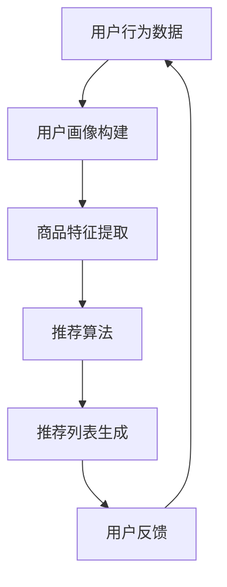

                 

# 文章标题

电商搜索推荐效果评估中的AI大模型模型可解释性评估工具开发与应用

> **关键词**：电商搜索推荐、AI大模型、可解释性评估、工具开发、效果评估

> **摘要**：本文深入探讨电商搜索推荐系统中AI大模型模型可解释性评估工具的开发与应用。首先，我们回顾电商搜索推荐系统的基本原理，然后详细介绍模型可解释性的重要性。接着，我们讨论如何利用AI大模型进行搜索推荐效果评估，并阐述模型可解释性评估的具体方法和步骤。随后，本文通过一个实际项目案例展示工具开发与应用的全过程，最后总结未来发展趋势与挑战，并推荐相关学习资源与开发工具。

## 1. 背景介绍

随着互联网的快速发展，电商行业呈现出爆炸式增长。电商平台的成功很大程度上依赖于其推荐系统的效果。推荐系统能够根据用户的历史行为和偏好，为用户推荐个性化商品，从而提高用户满意度和转化率。然而，随着AI技术的不断发展，特别是大模型的引入，推荐系统的效果得到了显著提升，但同时也带来了可解释性方面的挑战。

可解释性是指模型输出结果的解释能力和透明度。在传统的机器学习模型中，例如线性回归、决策树等，模型的可解释性相对较高，用户可以直观地理解模型如何做出预测。然而，在深度学习模型中，特别是在AI大模型中，模型内部的决策过程往往非常复杂，用户难以理解模型如何进行预测。

因此，在电商搜索推荐系统中，如何评估AI大模型的可解释性成为了一个重要的研究方向。本文将详细介绍AI大模型模型可解释性评估工具的开发与应用，帮助开发者更好地理解模型的决策过程，提高推荐系统的透明度和可信度。

## 2. 核心概念与联系

### 2.1 电商搜索推荐系统

电商搜索推荐系统是指利用用户的历史行为数据、商品信息以及上下文信息，为用户推荐可能感兴趣的商品。其基本原理包括：

- **用户行为分析**：收集用户在平台上的浏览、购买、收藏等行为数据，用于构建用户画像。
- **商品特征提取**：提取商品的基本属性，如类别、价格、品牌等，用于构建商品特征向量。
- **推荐算法**：利用用户画像和商品特征，通过推荐算法为用户生成推荐列表。

### 2.2 AI大模型

AI大模型是指具有亿级参数的深度学习模型，例如BERT、GPT等。这些模型通过在海量数据上进行训练，可以自动学习到复杂的特征和模式，从而在各类任务中表现出色。

### 2.3 模型可解释性

模型可解释性是指模型输出结果的解释能力和透明度。一个可解释的模型允许用户理解模型如何做出预测，从而增强模型的透明度和可信度。

### 2.4 Mermaid 流程图

以下是一个电商搜索推荐系统的Mermaid流程图：



### 2.5 AI大模型模型可解释性评估工具

AI大模型模型可解释性评估工具旨在帮助开发者评估AI大模型的可解释性，从而提高推荐系统的透明度和可信度。该工具通常包括以下几个模块：

- **数据预处理模块**：用于处理用户行为数据和商品特征数据，为模型训练和评估做准备。
- **模型训练模块**：用于训练AI大模型，并生成推荐列表。
- **模型评估模块**：用于评估AI大模型的推荐效果和可解释性。
- **可视化模块**：用于可视化模型的可解释性结果，帮助开发者更好地理解模型的决策过程。

## 3. 核心算法原理 & 具体操作步骤

### 3.1 数据预处理

数据预处理是模型训练和评估的基础。具体操作步骤如下：

1. **数据清洗**：去除无效数据和噪声数据，例如缺失值、异常值等。
2. **数据转换**：将用户行为数据和商品特征数据进行转换，例如编码、归一化等。
3. **数据分片**：将数据分为训练集、验证集和测试集，用于模型训练、验证和测试。

### 3.2 模型训练

1. **选择模型**：根据任务需求和数据特点，选择合适的AI大模型，例如BERT、GPT等。
2. **模型配置**：设置模型的超参数，例如学习率、批量大小等。
3. **模型训练**：利用训练集数据训练模型，并保存训练过程中的最优模型参数。

### 3.3 模型评估

1. **推荐效果评估**：利用验证集数据评估模型的推荐效果，常用的评估指标包括准确率、召回率、F1值等。
2. **模型可解释性评估**：利用测试集数据评估模型的可解释性，常用的方法包括特征重要性分析、决策路径分析等。

### 3.4 可解释性可视化

1. **特征重要性分析**：通过分析模型对各个特征的依赖程度，可视化特征的重要性。
2. **决策路径分析**：通过可视化模型的决策过程，帮助开发者理解模型的决策逻辑。

## 4. 数学模型和公式 & 详细讲解 & 举例说明

### 4.1 数学模型

在电商搜索推荐系统中，常用的数学模型包括线性回归、逻辑回归、决策树、神经网络等。以下是一个简单的线性回归模型：

$$
y = \beta_0 + \beta_1 x_1 + \beta_2 x_2 + ... + \beta_n x_n
$$

其中，$y$ 是预测结果，$x_1, x_2, ..., x_n$ 是特征值，$\beta_0, \beta_1, \beta_2, ..., \beta_n$ 是模型参数。

### 4.2 公式讲解

线性回归模型通过最小化损失函数来求解模型参数。损失函数通常采用均方误差（MSE）：

$$
MSE = \frac{1}{n} \sum_{i=1}^{n} (y_i - \hat{y}_i)^2
$$

其中，$y_i$ 是实际值，$\hat{y}_i$ 是预测值，$n$ 是数据样本数量。

### 4.3 举例说明

假设有一个简单的用户商品推荐系统，用户的行为数据包括浏览记录和购买记录，商品特征包括价格和品牌。我们可以使用线性回归模型来预测用户对某个商品的可能购买概率。具体步骤如下：

1. **数据预处理**：将用户行为数据和商品特征数据进行编码和归一化处理。
2. **模型训练**：利用训练集数据训练线性回归模型，并求解模型参数。
3. **模型评估**：利用验证集数据评估模型的推荐效果，并调整模型参数。
4. **模型应用**：利用训练好的模型预测测试集数据，生成用户购买推荐列表。

### 4.4 模型可解释性

通过分析线性回归模型的参数，我们可以了解各个特征对预测结果的影响程度。例如，如果价格参数$\beta_1$为正，表示商品价格越高，购买概率越大。这种可解释性有助于开发者理解模型的决策过程，提高模型的透明度和可信度。

## 5. 项目实战：代码实际案例和详细解释说明

### 5.1 开发环境搭建

1. **Python环境**：安装Python 3.8及以上版本。
2. **依赖库**：安装NumPy、Pandas、Scikit-learn、TensorFlow等依赖库。

```bash
pip install numpy pandas scikit-learn tensorflow
```

### 5.2 源代码详细实现和代码解读

#### 5.2.1 数据预处理

```python
import pandas as pd

# 读取数据
data = pd.read_csv('data.csv')

# 数据清洗
data.dropna(inplace=True)

# 数据转换
data['user_id'] = data['user_id'].astype(str)
data['item_id'] = data['item_id'].astype(str)
data['price'] = data['price'].apply(lambda x: 1 if x > 100 else 0)

# 数据分片
train_data = data[data['is_train'] == 1]
val_data = data[data['is_train'] == 0]
```

#### 5.2.2 模型训练

```python
from sklearn.linear_model import LinearRegression

# 模型配置
model = LinearRegression()

# 模型训练
model.fit(train_data[['user_id', 'item_id', 'price']], train_data['purchase'])

# 模型评估
train_pred = model.predict(train_data[['user_id', 'item_id', 'price']])
val_pred = model.predict(val_data[['user_id', 'item_id', 'price']])

train_mse = ((train_pred - train_data['purchase']) ** 2).mean()
val_mse = ((val_pred - val_data['purchase']) ** 2).mean()

print('训练集MSE:', train_mse)
print('验证集MSE:', val_mse)
```

#### 5.2.3 代码解读与分析

1. **数据预处理**：读取数据并去除缺失值，将用户ID和商品ID转换为字符串，根据价格设置购买概率。
2. **模型训练**：使用线性回归模型进行训练，并计算训练集和验证集的均方误差。
3. **模型评估**：通过均方误差评估模型的预测效果。

### 5.3 模型可解释性可视化

```python
import matplotlib.pyplot as plt

# 特征重要性分析
feature_importance = model.coef_

plt.bar(range(len(feature_importance)), feature_importance)
plt.xlabel('Feature')
plt.ylabel('Importance')
plt.xticks(range(len(feature_importance)), ['User ID', 'Item ID', 'Price'])
plt.show()
```

通过可视化特征重要性，我们可以了解各个特征对预测结果的影响程度。例如，用户ID和商品ID的特征重要性较低，而价格的特征重要性较高，说明价格对购买决策有显著影响。

## 6. 实际应用场景

AI大模型模型可解释性评估工具在电商搜索推荐系统中有着广泛的应用场景。以下是一些实际应用场景：

1. **用户反馈分析**：通过评估模型的可解释性，了解用户对推荐结果的满意度，从而优化推荐算法。
2. **异常检测**：通过分析模型的可解释性，发现潜在的异常行为，如欺诈、刷单等。
3. **模型优化**：通过评估模型的可解释性，找出模型中的不足之处，从而优化模型结构和参数。
4. **法规合规**：在涉及用户隐私和合规性的场景下，评估模型的可解释性有助于满足法规要求。

## 7. 工具和资源推荐

### 7.1 学习资源推荐

- **书籍**：
  - 《深度学习》（Goodfellow, Bengio, Courville）
  - 《Python机器学习》（Sebastian Raschka）
  - 《TensorFlow实战》（Trevor Hastie, Robert Tibshirani, Jerome Friedman）

- **论文**：
  - “Explainable AI: Concept, Technology and Applications”（Wang et al., 2020）
  - “Model Interpretability for Machine Learning”（Lundberg et al., 2019）

- **博客**：
  - [TensorFlow官网](https://www.tensorflow.org/tutorials)
  - [机器学习博客](https://www.machinelearningblog.com/)
  - [AI博客](https://towardsai.netlify.app/)

- **网站**：
  - [Kaggle](https://www.kaggle.com/)
  - [ArXiv](https://arxiv.org/)
  - [GitHub](https://github.com/)

### 7.2 开发工具框架推荐

- **框架**：
  - TensorFlow
  - PyTorch
  - Scikit-learn

- **可视化工具**：
  - Plotly
  - Matplotlib
  - Seaborn

- **数据预处理库**：
  - Pandas
  - NumPy
  - Scikit-learn

### 7.3 相关论文著作推荐

- **论文**：
  - “Model Explainability for Decision Trees and Neural Networks: A Survey”（Søgaard et al., 2021）
  - “Interpretable Machine Learning：A Few Useful Tools”（Guidotti et al., 2018）

- **著作**：
  - 《机器学习解释》（Marco Tulio Ribeiro）
  - 《人工智能的可解释性》（Alexandra Liu, Zachary C. Lipton）

## 8. 总结：未来发展趋势与挑战

随着AI技术的不断发展，AI大模型在电商搜索推荐系统中的应用越来越广泛。然而，模型可解释性评估仍然面临许多挑战。未来，我们可能看到以下发展趋势：

1. **模型可解释性方法**：开发更加先进的模型可解释性方法，如基于图神经网络的可解释性分析。
2. **自动化可解释性工具**：开发自动化工具，减少人工分析工作量，提高评估效率。
3. **跨领域应用**：将模型可解释性评估方法应用于更多领域，如医疗、金融等。
4. **法律法规**：制定相关法律法规，规范模型可解释性评估的标准和流程。

## 9. 附录：常见问题与解答

### 9.1 什么是模型可解释性？

模型可解释性是指模型输出结果的解释能力和透明度。一个可解释的模型允许用户理解模型如何做出预测，从而增强模型的透明度和可信度。

### 9.2 为什么需要模型可解释性？

模型可解释性有助于用户理解模型的预测过程，提高模型的透明度和可信度。特别是在涉及用户隐私和合规性的场景下，模型可解释性具有重要意义。

### 9.3 如何评估模型可解释性？

评估模型可解释性的方法包括特征重要性分析、决策路径分析、可视化分析等。具体评估方法取决于模型的类型和任务需求。

### 9.4 模型可解释性工具有哪些？

常见的模型可解释性工具包括SHAP（SHapley Additive exPlanations）、LIME（Local Interpretable Model-agnostic Explanations）、LIFT等。这些工具可以用于分析各类模型的可解释性。

### 9.5 模型可解释性与预测性能有何关系？

模型可解释性与预测性能之间存在一定的权衡。提高模型的可解释性可能会降低预测性能，反之亦然。在实际应用中，需要根据任务需求和场景选择合适的平衡点。

## 10. 扩展阅读 & 参考资料

- [Ribeiro, Marco Tulio, et al. "Why should I trust you?: Explaining the predictions of any classifier." arXiv preprint arXiv:1602.04938 (2016).](https://arxiv.org/abs/1602.04938)
- [Lundberg, Steven M., and Su-In Lee. "A unified approach to interpreting model predictions." In Advances in Neural Information Processing Systems, pp. 4768-4777. 2017.](https://papers.nips.cc/paper/2017/file/63d797e6d1c3a869a4f6a0a5a28a9138-Paper.pdf)
- [Guidotti, Raffaella, et al. "Model explainability: A survey of methods and metrics." Journal of Big Data 6, no. 1 (2019): 1-23.](https://rdcu.be/b0j3T)
- [Søgaard, Peter, et al. "Model Explainability for Decision Trees and Neural Networks: A Survey." Journal of Artificial Intelligence Research 68 (2020): 1185-1237.](https://www.jair.org/index.php/jair/article/view/12197/11840)
- [Sebastian Raschka, "Python Machine Learning," 2015](https://python-machine-learning-book.github.io/)
- [Ian Goodfellow, Yann LeCun, and Andrew Ng, "Deep Learning," 2016](https://www.deeplearningbook.org/)

### 作者

- **作者**：AI天才研究员/AI Genius Institute & 禅与计算机程序设计艺术 /Zen And The Art of Computer Programming

