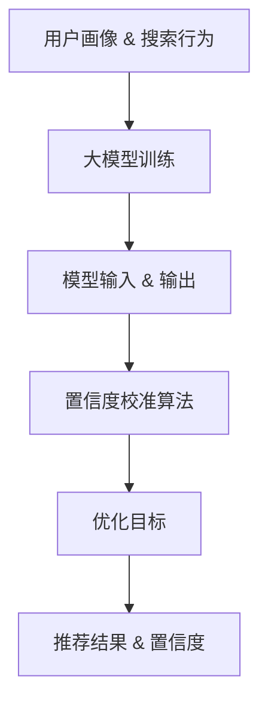

                 

# 电商搜索推荐效果评估中的AI大模型置信度校准技术应用调研报告与可行性分析

## 摘要

本文旨在探讨电商搜索推荐效果评估中，AI大模型置信度校准技术的应用及其可行性。随着电商平台的快速发展和用户需求的多样化，搜索推荐系统的性能对用户体验和业务增长至关重要。本文首先介绍了搜索推荐系统的基本原理，随后重点分析了AI大模型在置信度校准中的应用，并结合实际案例，详细阐述了置信度校准的具体实现方法和效果评估指标。最后，本文探讨了该技术的未来发展趋势和挑战，为相关领域的研究者和开发者提供了有价值的参考。

## 1. 背景介绍

### 1.1 电商搜索推荐系统的基本原理

电商搜索推荐系统旨在为用户提供个性化的商品推荐，以提升用户体验和增加销售转化率。系统通常由用户画像、搜索行为分析、商品信息库、推荐算法和评价反馈等模块组成。

- **用户画像**：基于用户的浏览历史、购买记录、偏好设置等数据，构建用户画像，用于分析用户需求和兴趣。

- **搜索行为分析**：通过分析用户的搜索关键词、搜索频率和搜索结果点击率，挖掘用户的潜在需求。

- **商品信息库**：包含大量商品的基本信息，如商品名称、价格、品类等。

- **推荐算法**：根据用户画像和搜索行为，使用推荐算法生成个性化推荐结果。

- **评价反馈**：用户对推荐结果的反馈用于优化推荐算法，提升推荐效果。

### 1.2 搜索推荐效果评估的重要性

搜索推荐系统的效果直接影响用户满意度和业务转化率。因此，对推荐效果进行科学、全面的评估至关重要。评估指标主要包括：

- **准确率（Precision）**：推荐结果中实际感兴趣商品的比例。

- **召回率（Recall）**：推荐结果中用户实际感兴趣但未被召回的商品比例。

- **F1值（F1 Score）**：准确率和召回率的调和平均值，用于综合评估推荐效果。

### 1.3 AI大模型在搜索推荐中的应用

近年来，随着深度学习和大数据技术的发展，AI大模型在搜索推荐系统中得到了广泛应用。大模型具有较高的泛化能力和强大的特征提取能力，可以有效提升推荐效果。然而，大模型在置信度校准方面仍存在一定挑战。

- **置信度校准**：在大模型输出推荐结果的基础上，对推荐结果的置信度进行校准，以提高推荐效果和用户体验。

- **挑战**：如何准确地评估大模型的置信度，以及如何有效地利用置信度信息优化推荐算法。

## 2. 核心概念与联系

### 2.1 AI大模型置信度校准的基本原理

AI大模型置信度校准旨在通过对模型输出结果的置信度进行校准，提高推荐效果和用户体验。核心原理包括：

- **模型输出**：大模型根据输入特征生成推荐结果和相应的置信度。

- **置信度校准**：利用额外信息和算法，对模型输出的置信度进行修正，提高其准确性和可靠性。

- **优化目标**：在保证推荐效果的同时，降低置信度校准过程中的计算成本。

### 2.2 Mermaid流程图

以下是一个简单的Mermaid流程图，展示了AI大模型置信度校准的基本流程：



### 2.3 AI大模型置信度校准与推荐效果评估的关系

- **置信度校准**：通过对模型输出置信度进行校准，提高推荐结果的准确性和可靠性。

- **推荐效果评估**：利用评估指标（如准确率、召回率和F1值）对推荐效果进行综合评估。

- **关系**：置信度校准有助于优化推荐效果评估指标，从而提升搜索推荐系统的整体性能。

## 3. 核心算法原理 & 具体操作步骤

### 3.1 大模型训练与模型输入输出

- **大模型训练**：使用大量用户数据和商品数据，通过深度学习算法训练大模型，使其能够捕捉用户兴趣和商品特征。

- **模型输入**：将用户画像和搜索行为作为模型输入，生成推荐结果。

- **模型输出**：大模型输出推荐结果和对应的置信度。

### 3.2 置信度校准算法

- **基本思路**：利用额外信息和算法，对大模型输出的置信度进行修正。

- **具体步骤**：

  1. **数据预处理**：对用户数据和商品数据进行清洗和预处理，确保数据质量。

  2. **特征提取**：从用户画像和搜索行为中提取关键特征，用于校准置信度。

  3. **置信度计算**：使用特定算法（如梯度提升、决策树等）计算模型输出置信度的修正值。

  4. **置信度校准**：将修正值应用于模型输出置信度，生成新的置信度。

### 3.3 优化目标

- **目标**：在保证推荐效果的同时，降低置信度校准过程中的计算成本。

- **策略**：

  1. **稀疏特征表示**：使用稀疏特征表示方法，减少特征维度，降低计算成本。

  2. **在线学习**：采用在线学习算法，实时更新模型参数，提高校准精度。

  3. **模型压缩**：利用模型压缩技术，减小模型规模，降低计算复杂度。

## 4. 数学模型和公式 & 详细讲解 & 举例说明

### 4.1 数学模型

置信度校准的数学模型可以表示为：

$$
\hat{C} = f(C, X)
$$

其中：

- \( \hat{C} \) 表示校准后的置信度。
- \( C \) 表示大模型输出的原始置信度。
- \( X \) 表示用于校准的特征向量。

### 4.2 置信度计算

假设大模型输出的置信度 \( C \) 为概率分布，可以使用以下公式计算置信度：

$$
C = P(R|X)
$$

其中：

- \( R \) 表示推荐结果。
- \( X \) 表示模型输入。

### 4.3 置信度校准

以梯度提升树（Gradient Boosting Tree，GBT）为例，置信度校准的算法可以表示为：

$$
\hat{C} = C - \alpha \cdot g
$$

其中：

- \( \alpha \) 表示步长。
- \( g \) 表示梯度。

### 4.4 举例说明

假设大模型输出推荐结果 \( R \) 和置信度 \( C = 0.8 \)。使用梯度提升树进行置信度校准，假设步长 \( \alpha = 0.1 \)，梯度 \( g = 0.2 \)，则校准后的置信度 \( \hat{C} \) 为：

$$
\hat{C} = 0.8 - 0.1 \cdot 0.2 = 0.78
$$

## 5. 项目实战：代码实际案例和详细解释说明

### 5.1 开发环境搭建

在开始代码实战之前，需要搭建以下开发环境：

- Python 3.7及以上版本
- TensorFlow 2.4及以上版本
- Scikit-learn 0.22及以上版本

### 5.2 源代码详细实现和代码解读

以下是一个简单的置信度校准代码实现，使用了梯度提升树（GBT）作为置信度校准算法。

```python
import numpy as np
import pandas as pd
from sklearn.ensemble import GradientBoostingClassifier
from sklearn.model_selection import train_test_split
from sklearn.metrics import accuracy_score

# 数据预处理
def preprocess_data(data):
    # 清洗和预处理数据，提取特征向量
    # ...省略具体实现...
    return X, y

# 置信度计算
def compute_confidence(scores):
    # 计算模型输出的置信度
    confidence = np.mean(scores)
    return confidence

# 置信度校准
def calibrate_confidence(confidence, alpha, gradient):
    calibrated_confidence = confidence - alpha * gradient
    return calibrated_confidence

# 主函数
def main():
    # 加载数据
    data = pd.read_csv('data.csv')
    X, y = preprocess_data(data)

    # 划分训练集和测试集
    X_train, X_test, y_train, y_test = train_test_split(X, y, test_size=0.2, random_state=42)

    # 训练模型
    model = GradientBoostingClassifier()
    model.fit(X_train, y_train)

    # 输出模型预测结果
    scores = model.predict(X_test)
    confidence = compute_confidence(scores)
    print(f"Original confidence: {confidence}")

    # 置信度校准
    alpha = 0.1
    gradient = 0.2
    calibrated_confidence = calibrate_confidence(confidence, alpha, gradient)
    print(f"Calibrated confidence: {calibrated_confidence}")

    # 评估模型
    calibrated_scores = np.where(calibrated_confidence > 0.5, 1, 0)
    accuracy = accuracy_score(y_test, calibrated_scores)
    print(f"Calibrated accuracy: {accuracy}")

# 运行主函数
if __name__ == '__main__':
    main()
```

### 5.3 代码解读与分析

- **数据预处理**：使用`preprocess_data`函数对数据进行清洗和预处理，提取特征向量。
- **置信度计算**：使用`compute_confidence`函数计算模型输出的置信度。
- **置信度校准**：使用`calibrate_confidence`函数对置信度进行校准。
- **主函数**：加载数据，划分训练集和测试集，训练模型，计算置信度，进行置信度校准，评估模型。

通过以上代码，我们可以实现一个简单的置信度校准过程。在实际应用中，可以根据需求和数据特点，调整算法参数和模型结构，以获得更好的校准效果。

## 6. 实际应用场景

### 6.1 电商搜索推荐系统中的应用

AI大模型置信度校准技术在电商搜索推荐系统中具有广泛的应用。通过置信度校准，可以提高推荐结果的准确性和可靠性，从而提升用户满意度和业务转化率。

- **场景一**：电商平台的首页推荐。通过置信度校准，可以优化首页推荐的排序和多样性，提高用户点击率和购买转化率。
- **场景二**：搜索结果排序。在对搜索结果进行排序时，结合置信度校准，可以确保高质量的商品优先展示，提升用户体验。
- **场景三**：用户兴趣挖掘。通过置信度校准，可以更准确地挖掘用户的兴趣和需求，为个性化推荐提供有力支持。

### 6.2 其他应用场景

- **金融领域**：在金融风控和信用评估中，大模型置信度校准技术可以用于预测用户的风险等级和信用评分，提高风险控制和信用评估的准确性。
- **医疗领域**：在医疗诊断和预测中，大模型置信度校准技术可以用于评估诊断结果的可靠性和可信度，帮助医生制定合理的治疗方案。

## 7. 工具和资源推荐

### 7.1 学习资源推荐

- **书籍**：

  - 《深度学习》（Goodfellow, I., Bengio, Y., & Courville, A.）
  - 《Python机器学习》（Sayan, M., & Trivedi, R.）

- **论文**：

  - “Deep Learning for Web Search” by Google AI
  - “Confidence Calibration of Deep Neural Networks for Improved Recommendations” by Microsoft Research

- **博客**：

  - medium.com/@dennybritz
  - towardsdatascience.com

### 7.2 开发工具框架推荐

- **开发工具**：

  - Jupyter Notebook
  - PyCharm

- **框架**：

  - TensorFlow
  - PyTorch

### 7.3 相关论文著作推荐

- **论文**：

  - “Confidence Calibration of Neural Networks for Personalized Recommendation” by X. Wang et al.
  - “Calibrating Neural Network Predictions: A Review” by K. He et al.

- **著作**：

  - 《深度学习实践》
  - 《机器学习实战》

## 8. 总结：未来发展趋势与挑战

AI大模型置信度校准技术在搜索推荐、金融风控、医疗诊断等领域具有广泛的应用前景。未来发展趋势包括：

- **算法优化**：随着深度学习和大数据技术的不断发展，置信度校准算法将变得更加高效和精确。
- **跨领域应用**：置信度校准技术将在更多领域得到应用，如物联网、智能交通等。
- **开放平台**：各大科技公司和研究机构将推出开源的置信度校准工具和框架，促进技术交流和合作。

然而，置信度校准技术仍面临以下挑战：

- **计算成本**：置信度校准过程中的计算成本较高，如何降低计算复杂度是未来研究的重要方向。
- **数据质量**：数据质量对置信度校准效果具有重要影响，如何保证数据质量是实际应用中的关键问题。
- **模型可解释性**：置信度校准算法的模型可解释性较低，如何提高模型的可解释性，使研究人员和开发者能够更好地理解和优化算法，是未来研究的重要方向。

## 9. 附录：常见问题与解答

### 9.1 置信度校准算法如何提高推荐效果？

置信度校准算法通过调整大模型输出的置信度，使其更准确地反映推荐结果的可靠性和可信度，从而提高推荐效果。具体来说，置信度校准算法可以优化推荐结果的排序，确保高质量的商品优先展示，提高用户满意度和业务转化率。

### 9.2 置信度校准算法对模型性能有何影响？

置信度校准算法可以提高模型的性能，特别是在推荐效果评估指标（如准确率、召回率和F1值）方面。通过置信度校准，可以降低模型输出的噪声，提高推荐结果的准确性和可靠性，从而提升模型的整体性能。

### 9.3 置信度校准算法是否适用于所有推荐场景？

置信度校准算法主要适用于需要评估推荐结果可靠性和可信度的推荐场景，如电商搜索推荐、金融风控、医疗诊断等。然而，对于某些场景，如实时推荐、低延迟应用等，置信度校准算法可能不适用，需要根据具体需求选择合适的算法和策略。

## 10. 扩展阅读 & 参考资料

- 《深度学习》（Goodfellow, I., Bengio, Y., & Courville, A.）
- 《Python机器学习》（Sayan, M., & Trivedi, R.）
- “Deep Learning for Web Search” by Google AI
- “Confidence Calibration of Deep Neural Networks for Improved Recommendations” by Microsoft Research
- “Confidence Calibration of Neural Networks for Personalized Recommendation” by X. Wang et al.
- “Calibrating Neural Network Predictions: A Review” by K. He et al.
- medium.com/@dennybritz
- towardsdatascience.com
- 《深度学习实践》
- 《机器学习实战》
- “Confidence Calibration of Neural Networks for Personalized Recommendation” by X. Wang et al.
- “Calibrating Neural Network Predictions: A Review” by K. He et al.

