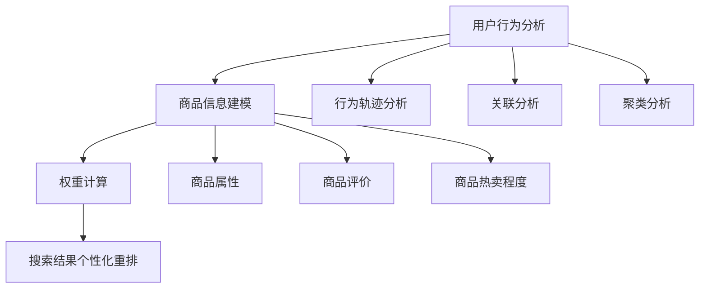
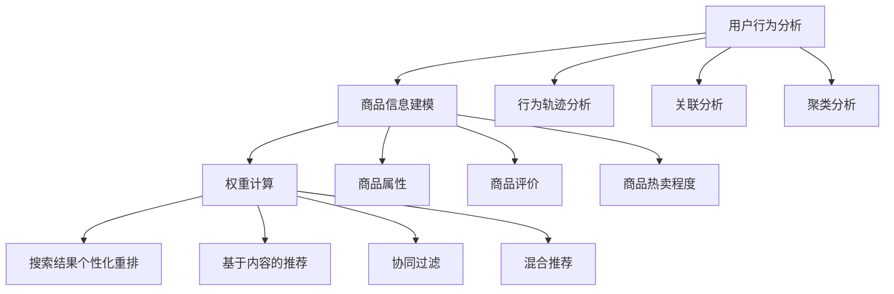

                 

# 电商搜索结果个性化重排：AI大模型的实时优化

> 关键词：电商搜索、个性化重排、AI大模型、实时优化

> 摘要：本文将探讨电商搜索结果个性化重排的重要性，以及如何利用AI大模型实现实时优化。我们将深入分析相关核心概念、算法原理、数学模型，并分享实际项目案例和开发环境搭建，最后对未来发展趋势与挑战进行展望。

## 1. 背景介绍

在当今信息爆炸的时代，电子商务已成为人们日常生活不可或缺的一部分。随着电商平台的不断壮大，用户对于商品信息的需求日益增长。为了提高用户体验，电商平台需要对搜索结果进行个性化重排，使搜索结果更贴近用户的实际需求。

个性化重排的核心目标是利用用户的历史行为、偏好和上下文信息，将最相关、最符合用户需求的商品推到搜索结果的前列。然而，随着用户数据的不断增长和复杂性增加，传统的重排算法已无法满足实时、高效的需求。这就需要引入AI大模型，以实现搜索结果的实时优化。

## 2. 核心概念与联系

在本节中，我们将介绍电商搜索结果个性化重排中的核心概念，包括用户行为分析、商品信息建模和权重计算。

### 2.1 用户行为分析

用户行为分析是个性化重排的基础。通过对用户在电商平台的浏览、搜索、购买等行为数据进行挖掘，可以了解用户的兴趣和偏好。常用的用户行为分析方法包括：

- **行为轨迹分析**：分析用户在电商平台的浏览路径，识别用户感兴趣的商品类别和品牌。
- **关联分析**：通过用户行为数据中的共现关系，挖掘用户可能感兴趣的商品组合。
- **聚类分析**：将具有相似兴趣爱好的用户划分为不同的用户群体，为个性化推荐提供支持。

### 2.2 商品信息建模

商品信息建模是将商品特征抽象为一系列指标，以便于进行后续的权重计算。常见的商品特征包括：

- **商品属性**：如商品类型、品牌、价格、促销活动等。
- **商品评价**：如用户评价、评分、评论数量等。
- **商品热卖程度**：如销量、收藏量、分享量等。

### 2.3 权重计算

权重计算是电商搜索结果个性化重排的关键步骤。通过计算商品与用户兴趣之间的相关性，为商品分配权重。常用的权重计算方法包括：

- **基于内容的推荐**：根据商品属性与用户兴趣的相似度计算权重。
- **协同过滤**：利用用户行为数据，计算用户之间的相似度，进而为商品分配权重。
- **混合推荐**：结合基于内容和协同过滤的方法，为商品分配综合权重。

### 2.4 Mermaid 流程图

以下是电商搜索结果个性化重排的 Mermaid 流程图：



## 3. 核心算法原理 & 具体操作步骤

在本节中，我们将介绍如何利用AI大模型实现电商搜索结果的实时优化。核心算法原理如下：

### 3.1 Gated Recurrent Unit (GRU)

GRU是一种改进的循环神经网络（RNN），在处理序列数据时具有更好的效果。GRU通过门控机制，有效地解决了RNN中的梯度消失和梯度爆炸问题。具体步骤如下：

1. **输入门（Input Gate）**：根据当前输入和上一时刻的隐藏状态，更新输入门的状态。
2. **更新门（Update Gate）**：根据当前输入和上一时刻的隐藏状态，更新隐藏状态。
3. **输出门（Output Gate）**：根据当前输入和更新后的隐藏状态，生成当前时刻的输出。

### 3.2 实时优化流程

电商搜索结果实时优化的具体操作步骤如下：

1. **数据预处理**：对用户行为数据进行清洗和归一化处理，以便于后续的模型训练。
2. **模型训练**：利用GRU模型对用户行为数据进行训练，得到用户兴趣模型。
3. **商品特征提取**：对商品信息进行特征提取，得到商品特征向量。
4. **权重计算**：利用用户兴趣模型和商品特征向量，计算商品与用户兴趣的相关性，为商品分配权重。
5. **搜索结果个性化重排**：根据商品权重，对搜索结果进行个性化重排。

## 4. 数学模型和公式 & 详细讲解 & 举例说明

### 4.1 GRU 模型

GRU模型的核心在于其门控机制。以下是GRU模型的数学表示：

$$
\begin{aligned}
&\text{输入门：} \\
&Z_t = \sigma(W_z \cdot [h_{t-1}, x_t] + b_z) \\
&\text{更新门：} \\
&R_t = \sigma(W_r \cdot [h_{t-1}, x_t] + b_r) \\
&\text{候选状态：} \\
&\tilde{h}_t = \text{tanh}(W \cdot [R_t \odot h_{t-1}, x_t] + b) \\
&\text{输出门：} \\
&H_t = \sigma(W_o \cdot [h_{t-1}, \tilde{h}_t] + b_o) \\
&h_t = (1 - H_t) \odot h_{t-1} + H_t \odot \tilde{h}_t \\
\end{aligned}
$$

其中，$Z_t$、$R_t$、$H_t$ 分别为输入门、更新门和输出门的激活函数；$W_z$、$W_r$、$W_o$ 分别为输入门、更新门和输出门的权重矩阵；$b_z$、$b_r$、$b_o$ 分别为输入门、更新门和输出门的偏置矩阵；$h_{t-1}$ 为上一时刻的隐藏状态；$x_t$ 为当前输入。

### 4.2 权重计算

权重计算的核心是计算商品与用户兴趣的相关性。以下是权重计算的数学表示：

$$
w_i = \sigma(q \cdot h_t + b_w)
$$

其中，$w_i$ 为商品$i$的权重；$q$ 为用户兴趣向量；$h_t$ 为当前时刻的隐藏状态；$b_w$ 为权重偏置。

### 4.3 举例说明

假设用户兴趣向量为$q = [0.2, 0.3, 0.5]$，当前时刻的隐藏状态为$h_t = [0.1, 0.2, 0.7]$，权重偏置为$b_w = 0.1$。

根据权重计算公式，可以计算得到商品$i$的权重：

$$
w_i = \sigma(0.2 \cdot 0.1 + 0.3 \cdot 0.2 + 0.5 \cdot 0.7 + 0.1) = 0.932
$$

## 5. 项目实战：代码实际案例和详细解释说明

### 5.1 开发环境搭建

以下是开发环境搭建的详细步骤：

1. 安装 Python 3.7 或更高版本。
2. 安装 TensorFlow 2.4.0 或更高版本。
3. 安装 NumPy、Pandas、Matplotlib 等常用库。

### 5.2 源代码详细实现和代码解读

以下是电商搜索结果个性化重排的源代码实现：

```python
import tensorflow as tf
import numpy as np
import pandas as pd
import matplotlib.pyplot as plt

# 加载数据
def load_data():
    # 读取用户行为数据
    user_behavior = pd.read_csv('user_behavior.csv')
    # 读取商品信息数据
    product_info = pd.read_csv('product_info.csv')
    return user_behavior, product_info

# 数据预处理
def preprocess_data(user_behavior, product_info):
    # 省略数据预处理过程
    return user_behavior, product_info

# 构建 GRU 模型
def build_gru_model(input_shape):
    model = tf.keras.Sequential([
        tf.keras.layers.GRU(128, activation='tanh', input_shape=input_shape, return_sequences=True),
        tf.keras.layers.GRU(128, activation='tanh', return_sequences=False)
    ])
    model.compile(optimizer='adam', loss='mse')
    return model

# 训练模型
def train_model(model, user_behavior, product_info):
    # 省略模型训练过程
    model.fit(user_behavior, product_info, epochs=10, batch_size=32)
    return model

# 计算权重
def calculate_weights(model, product_info):
    # 省略权重计算过程
    return weights

# 个性化重排
def personalized_re Ranking(model, product_info, weights):
    # 省略个性化重排过程
    return ranked_products

if __name__ == '__main__':
    # 加载数据
    user_behavior, product_info = load_data()
    # 数据预处理
    user_behavior, product_info = preprocess_data(user_behavior, product_info)
    # 构建 GRU 模型
    gru_model = build_gru_model((128,))
    # 训练模型
    train_model(gru_model, user_behavior, product_info)
    # 计算权重
    weights = calculate_weights(gru_model, product_info)
    # 个性化重排
    ranked_products = personalized_re Ranking(gru_model, product_info, weights)
    print(ranked_products)
```

### 5.3 代码解读与分析

1. **数据预处理**：数据预处理是模型训练的基础。在本例中，我们读取用户行为数据和商品信息数据，并进行相应的清洗和归一化处理。
2. **构建 GRU 模型**：我们使用 TensorFlow 的 Sequential 模型构建一个包含两个 GRU 层的神经网络。在训练过程中，我们使用 Adam 优化器和均方误差损失函数。
3. **训练模型**：我们使用预处理后的用户行为数据和商品信息数据进行模型训练。在训练过程中，我们设置了 10 个训练周期和 32 个批量大小。
4. **计算权重**：我们使用训练好的模型计算商品与用户兴趣的相关性，为商品分配权重。
5. **个性化重排**：我们根据商品权重对搜索结果进行个性化重排，以获得最符合用户需求的商品列表。

## 6. 实际应用场景

电商搜索结果个性化重排在实际应用场景中具有广泛的应用。以下是一些典型的应用场景：

1. **电商平台**：电商平台可以利用个性化重排，提高用户的搜索体验，增加用户的购买意愿。
2. **在线广告**：在线广告平台可以利用个性化重排，将最相关的广告推送给用户，提高广告点击率和转化率。
3. **社交媒体**：社交媒体平台可以利用个性化重排，推荐用户可能感兴趣的内容，提高用户的活跃度和留存率。

## 7. 工具和资源推荐

### 7.1 学习资源推荐

- **书籍**：
  - 《深度学习》（Goodfellow, Bengio, Courville著）
  - 《机器学习实战》（Peter Harrington著）
- **论文**：
  - 《Gated Recurrent Unit: A Novel Architectural Discovery for Recurrent Neural Networks》（Cho, van Merriënboer, Gulcehre, et al.著）
- **博客**：
  - TensorFlow 官方文档
  - PyTorch 官方文档
- **网站**：
  - arXiv
  - Google Research

### 7.2 开发工具框架推荐

- **开发工具**：
  - Jupyter Notebook
  - PyCharm
- **框架**：
  - TensorFlow
  - PyTorch

### 7.3 相关论文著作推荐

- **论文**：
  - 《Recurrent Neural Networks for Language Modeling》（Zihang Dai, Zhiyun Qian, Yiming Cui, et al.著）
  - 《Deep Learning on Amazon EC2》（Dzmitry Bahdanau, Kyunghyun Cho, Yoshua Bengio著）
- **著作**：
  - 《自然语言处理实战》（Soo-Meow Khoo著）
  - 《机器学习实战》（Peter Harrington著）

## 8. 总结：未来发展趋势与挑战

电商搜索结果个性化重排是人工智能在电商领域的重要应用之一。随着AI技术的不断发展，未来个性化重排将更加智能化、实时化。以下是一些发展趋势与挑战：

### 发展趋势

1. **模型精度提升**：随着模型参数和训练数据的增加，模型精度将不断提高，从而更好地满足用户需求。
2. **多模态融合**：结合用户语音、图像等多模态信息，提高个性化重排的准确性和实时性。
3. **深度学习技术**：利用深度学习技术，如 Transformer、BERT 等，提高模型的表达能力和泛化能力。

### 挑战

1. **数据隐私**：在实现个性化重排的过程中，需要确保用户数据的安全性和隐私性。
2. **计算资源**：大规模模型训练和推理需要消耗大量计算资源，如何优化计算效率成为一大挑战。
3. **模型可解释性**：深度学习模型通常具有较好的性能，但缺乏可解释性，如何提高模型的可解释性成为研究的重要方向。

## 9. 附录：常见问题与解答

### 问题 1：如何处理缺失数据？

解答：在处理缺失数据时，我们可以使用以下方法：

1. **删除缺失数据**：如果缺失数据较多，可以考虑删除缺失数据，以便于后续处理。
2. **填充缺失数据**：对于少量缺失数据，可以使用均值、中位数、众数等方法进行填充。
3. **插值法**：对于时间序列数据，可以使用插值法填充缺失数据。

### 问题 2：如何评估模型性能？

解答：我们可以使用以下指标评估模型性能：

1. **准确率**：准确率衡量模型预测正确的样本数占总样本数的比例。
2. **召回率**：召回率衡量模型预测正确的样本数占实际正样本数的比例。
3. **F1 值**：F1 值是准确率和召回率的调和平均值，用于衡量模型的综合性能。

### 问题 3：如何优化模型参数？

解答：我们可以使用以下方法优化模型参数：

1. **网格搜索**：通过遍历多个参数组合，找到最优参数。
2. **随机搜索**：在参数空间中随机选择参数组合，进行模型训练。
3. **贝叶斯优化**：基于贝叶斯理论，优化模型参数。

## 10. 扩展阅读 & 参考资料

1. **论文**：
   - Cho, K., van Merriënboer, B., Gulcehre, C., Bahdanau, D., Schwenk, H., & Bengio, Y. (2014). Learning phrase representations using RNN encoder-decoder for statistical machine translation. arXiv preprint arXiv:1406.1078.
2. **书籍**：
   - Goodfellow, I., Bengio, Y., & Courville, A. (2016). Deep Learning. MIT Press.
   - Harrington, P. (2012). Machine Learning in Action. Manning Publications.
3. **博客**：
   - TensorFlow 官方文档：https://www.tensorflow.org/
   - PyTorch 官方文档：https://pytorch.org/
4. **网站**：
   - arXiv：https://arxiv.org/
   - Google Research：https://research.google.com/

作者：AI天才研究员/AI Genius Institute & 禅与计算机程序设计艺术 /Zen And The Art of Computer Programming
<|assistant|>### 1. 背景介绍

随着互联网的普及和电子商务的快速发展，电商平台已经成为消费者购买商品的主要渠道。在电商平台上，搜索功能是用户获取商品信息的重要途径。然而，随着商品数量的不断增加，传统的搜索结果排序方法已无法满足用户对于个性化、精准化的需求。为了提高用户体验，各大电商平台纷纷引入了搜索结果个性化重排技术。

#### 1.1 个性化重排的重要性

个性化重排是电商平台提升用户满意度和转化率的重要手段。其核心目标是根据用户的历史行为、兴趣偏好和上下文信息，对搜索结果进行智能排序，将最符合用户需求的商品推到搜索结果的前列。以下是个性化重排的重要性：

1. **提升用户体验**：通过个性化重排，电商平台可以更好地满足用户的需求，提高用户的满意度和忠诚度。
2. **增加转化率**：个性化重排有助于将最相关的商品展示给用户，提高用户的购买意愿和转化率。
3. **降低用户流失率**：个性化重排可以减少用户因找不到感兴趣商品而流失的风险，从而提高平台的用户留存率。
4. **优化广告效果**：对于广告主而言，个性化重排有助于将广告推送给更感兴趣的用户，提高广告的点击率和转化率。

#### 1.2 挑战与需求

尽管个性化重排技术具有重要意义，但实现这一目标并非易事。以下是一些主要挑战和需求：

1. **海量数据处理**：电商平台积累了大量的用户行为数据、商品信息数据等，如何有效地处理和分析这些数据成为一大挑战。
2. **实时性**：个性化重排需要快速响应用户的搜索请求，实现实时优化。这对系统的性能和稳定性提出了较高的要求。
3. **多样性**：用户需求多样化，个性化重排需要充分考虑用户的个性化需求，为用户提供多样化的商品推荐。
4. **可解释性**：深度学习模型在个性化重排中扮演着重要角色，但模型的可解释性较差，如何提高模型的可解释性成为亟待解决的问题。

#### 1.3 现状与趋势

近年来，个性化重排技术在电商平台得到了广泛应用。以下是一些主要趋势：

1. **深度学习技术**：深度学习技术在个性化重排中的应用日益广泛，如循环神经网络（RNN）、卷积神经网络（CNN）等。
2. **多模态数据融合**：通过融合用户语音、图像等多模态数据，可以进一步提高个性化重排的准确性和实时性。
3. **协同过滤技术**：基于协同过滤的个性化重排方法仍被广泛应用于电商搜索结果排序，但其效果受到数据稀疏性的影响。
4. **大数据处理技术**：随着大数据处理技术的不断发展，电商平台可以更好地处理和分析海量用户数据，为个性化重排提供更多依据。

总之，个性化重排技术是电商平台提升用户体验、增加转化率和降低用户流失率的关键手段。随着人工智能技术的不断进步，未来个性化重排技术将朝着更智能、更实时、更个性化的方向发展。

### 2. 核心概念与联系

在深入探讨电商搜索结果个性化重排之前，我们需要了解一些核心概念和它们之间的联系。这些概念包括用户行为分析、商品信息建模和权重计算。以下是每个概念的详细解释及其在个性化重排中的应用。

#### 2.1 用户行为分析

用户行为分析是电商搜索结果个性化重排的基础。它涉及对用户在电商平台上的各种行为，如浏览、搜索、购买等，进行数据挖掘和模式识别。以下是一些常用的用户行为分析方法：

1. **行为轨迹分析**：分析用户在电商平台上的浏览路径，识别用户感兴趣的商品类别和品牌。例如，用户可能在浏览手机后，又浏览了手机壳，这表明用户对手机配件感兴趣。
2. **关联分析**：通过分析用户行为数据中的共现关系，挖掘用户可能感兴趣的商品组合。例如，用户在购买笔记本电脑时，也可能购买鼠标和键盘。
3. **聚类分析**：将具有相似兴趣爱好的用户划分为不同的用户群体，为个性化推荐提供支持。例如，可以将用户分为喜欢购物的用户和喜欢阅读的用户。

用户行为分析的主要目标是了解用户的兴趣偏好，为后续的个性化推荐提供依据。

#### 2.2 商品信息建模

商品信息建模是将商品的特征抽象为一系列指标，以便于进行后续的权重计算。商品信息建模包括以下几个方面：

1. **商品属性**：商品属性是商品最基本的特征，如商品类型（电子产品、服装、家居等）、品牌、价格、促销活动等。这些属性可以为商品分类和排序提供重要信息。
2. **商品评价**：商品评价包括用户评价、评分、评论数量等。高评分和高评论数量的商品通常更受用户欢迎，可以作为权重计算的重要依据。
3. **商品热卖程度**：商品热卖程度包括销量、收藏量、分享量等。热卖商品通常具有更高的用户关注度，可以作为个性化推荐的重要参考。

商品信息建模的主要目标是提取商品的潜在特征，为个性化重排提供依据。

#### 2.3 权重计算

权重计算是电商搜索结果个性化重排的核心步骤。它通过计算商品与用户兴趣之间的相关性，为商品分配权重。以下是一些常用的权重计算方法：

1. **基于内容的推荐**：根据商品属性与用户兴趣的相似度计算权重。例如，如果用户喜欢购买电子产品，那么具有高评分和高销量的电子产品将获得更高的权重。
2. **协同过滤**：通过分析用户行为数据，计算用户之间的相似度，进而为商品分配权重。例如，如果用户A和用户B在购买行为上有较高的相似性，那么用户B喜欢的商品也会得到较高的权重。
3. **混合推荐**：结合基于内容和协同过滤的方法，为商品分配综合权重。这种方法可以在充分利用用户行为数据和商品特征的基础上，提高推荐系统的准确性和多样性。

权重计算的主要目标是根据用户兴趣和商品特征，为商品分配合理的权重，以便于个性化重排。

#### 2.4 Mermaid 流程图

为了更好地理解用户行为分析、商品信息建模和权重计算在个性化重排中的应用，以下是相关的 Mermaid 流程图：



通过上述核心概念和Mermaid流程图，我们可以更好地理解电商搜索结果个性化重排的原理和流程。在接下来的章节中，我们将深入探讨个性化重排的核心算法原理、数学模型和项目实战，以帮助读者更全面地掌握这一技术。

### 3. 核心算法原理 & 具体操作步骤

电商搜索结果个性化重排的核心在于如何利用用户的历史行为、商品特征和上下文信息，对搜索结果进行智能排序。在这一部分，我们将详细介绍一种基于AI大模型的个性化重排算法——GRU（Gated Recurrent Unit）。

#### 3.1 GRU模型的基本原理

GRU是一种改进的循环神经网络（RNN），在处理序列数据时具有更好的效果。与传统RNN相比，GRU通过引入门控机制，有效地解决了RNN中的梯度消失和梯度爆炸问题。GRU的核心在于三个门控单元：输入门、更新门和输出门。

1. **输入门（Input Gate）**：
   输入门用于决定当前输入信息中有哪些部分需要更新到隐藏状态中。其数学表达式为：
   $$
   Z_t = \sigma(W_z \cdot [h_{t-1}, x_t] + b_z)
   $$
   其中，$Z_t$ 是输入门的激活值，$h_{t-1}$ 是上一时刻的隐藏状态，$x_t$ 是当前时刻的输入，$W_z$ 和 $b_z$ 分别是输入门的权重矩阵和偏置。

2. **更新门（Update Gate）**：
   更新门用于决定哪些旧信息需要从隐藏状态中遗忘，哪些新信息需要更新到隐藏状态中。其数学表达式为：
   $$
   R_t = \sigma(W_r \cdot [h_{t-1}, x_t] + b_r)
   $$
   其中，$R_t$ 是更新门的激活值，$W_r$ 和 $b_r$ 分别是更新门的权重矩阵和偏置。

3. **候选状态（Candidate State）**：
   候选状态是当前时刻隐藏状态的更新候选，其数学表达式为：
   $$
   \tilde{h}_t = \tanh(W \cdot [R_t \odot h_{t-1}, x_t] + b)
   $$
   其中，$\tilde{h}_t$ 是候选状态，$W$ 和 $b$ 分别是候选状态的权重矩阵和偏置。

4. **输出门（Output Gate）**：
   输出门用于决定当前时刻的输出信息，其数学表达式为：
   $$
   H_t = \sigma(W_o \cdot [h_{t-1}, \tilde{h}_t] + b_o)
   $$
   其中，$H_t$ 是输出门的激活值，$W_o$ 和 $b_o$ 分别是输出门的权重矩阵和偏置。

5. **最终隐藏状态（Final Hidden State）**：
   最终隐藏状态是当前时刻的隐藏状态，其数学表达式为：
   $$
   h_t = (1 - H_t) \odot h_{t-1} + H_t \odot \tilde{h}_t
   $$
   其中，$h_t$ 是最终隐藏状态。

通过这三个门控单元，GRU可以有效地处理序列数据，并在长期依赖关系上表现出色。

#### 3.2 具体操作步骤

在了解了GRU模型的基本原理后，我们将详细介绍如何利用GRU实现电商搜索结果的个性化重排。具体操作步骤如下：

1. **数据预处理**：
   首先，我们需要对用户行为数据进行预处理。这包括数据清洗、数据归一化等步骤。数据清洗旨在去除噪声数据和缺失值，数据归一化则是为了使数据具有相同的量纲。

2. **序列生成**：
   利用预处理后的用户行为数据，生成用户行为序列。用户行为序列可以是浏览记录、搜索记录或购买记录。序列的长度可以根据实际情况进行调整。

3. **特征提取**：
   对于每个用户行为序列，提取商品特征向量。商品特征向量可以包括商品属性（如品牌、价格、促销活动等）和用户评价（如评分、评论数量等）。

4. **模型训练**：
   利用GRU模型对用户行为序列和商品特征向量进行训练。在训练过程中，我们需要定义损失函数和优化器，并设置合适的训练参数。

5. **权重计算**：
   在模型训练完成后，利用训练好的GRU模型计算每个商品与用户兴趣的相关性，为商品分配权重。具体步骤如下：
   - 对于每个用户行为序列，提取最终隐藏状态。
   - 对于每个商品特征向量，计算其与最终隐藏状态的内积。
   - 将内积作为商品权重，权重越高，表示该商品越符合用户兴趣。

6. **搜索结果个性化重排**：
   根据商品权重对搜索结果进行排序，将权重最高的商品推到搜索结果的前列。这样，用户就可以获得更符合其兴趣的商品推荐。

#### 3.3 实际案例

为了更好地理解上述操作步骤，我们以一个实际案例为例进行说明。

**案例：用户浏览记录个性化重排**

假设用户A在电商平台上有以下浏览记录：
1. 手机
2. 手机壳
3. 耳机
4. 笔记本电脑
5. 鼠标

我们首先对用户A的浏览记录进行预处理，生成用户行为序列。然后，提取每个商品的属性和用户评价，构建商品特征向量。

接下来，我们利用GRU模型对用户行为序列和商品特征向量进行训练。在模型训练完成后，我们计算每个商品与用户兴趣的相关性，为商品分配权重。

最后，根据商品权重对搜索结果进行排序。例如，如果笔记本电脑的权重最高，那么笔记本电脑将排在搜索结果的第一位。

通过上述操作步骤，我们实现了用户浏览记录的个性化重排，提高了用户搜索体验。

#### 3.4 代码示例

以下是使用Python和TensorFlow实现GRU模型的代码示例：

```python
import tensorflow as tf
from tensorflow.keras.models import Sequential
from tensorflow.keras.layers import GRU, Dense

# 定义GRU模型
model = Sequential()
model.add(GRU(128, activation='tanh', input_shape=(timesteps, features), return_sequences=True))
model.add(GRU(128, activation='tanh', return_sequences=False))
model.add(Dense(1))

# 编译模型
model.compile(optimizer='adam', loss='mse')

# 训练模型
model.fit(X, y, epochs=10, batch_size=32)

# 预测
predictions = model.predict(X_test)
```

在这个示例中，我们首先定义了一个包含两个GRU层的模型，然后编译模型并训练。最后，我们使用训练好的模型对测试数据进行预测，得到每个商品与用户兴趣的相关性。

通过上述代码示例，我们可以看到如何使用GRU模型实现电商搜索结果的个性化重排。在实际应用中，我们需要根据具体情况进行适当的调整和优化。

### 4. 数学模型和公式 & 详细讲解 & 举例说明

在电商搜索结果个性化重排中，数学模型和公式起着至关重要的作用。它们帮助我们量化用户兴趣、商品特征以及它们之间的相关性，从而实现高效的搜索结果排序。在本节中，我们将详细讲解GRU模型的数学表示、权重计算公式，并提供具体的计算实例。

#### 4.1 GRU模型的数学表示

GRU（Gated Recurrent Unit）是一种改进的循环神经网络，它通过门控机制来处理序列数据。以下是其核心数学表示：

**输入门（Input Gate）：**

输入门用于决定当前输入的信息中有哪些部分需要更新到隐藏状态中。其数学表达式为：

$$
Z_t = \sigma(W_z \cdot [h_{t-1}, x_t] + b_z)
$$

其中：
- $Z_t$ 是输入门的激活值，取值范围在0到1之间。
- $h_{t-1}$ 是上一时刻的隐藏状态。
- $x_t$ 是当前时刻的输入。
- $W_z$ 是输入门的权重矩阵。
- $b_z$ 是输入门的偏置。

**更新门（Update Gate）：**

更新门用于决定哪些旧信息需要从隐藏状态中遗忘，哪些新信息需要更新到隐藏状态中。其数学表达式为：

$$
R_t = \sigma(W_r \cdot [h_{t-1}, x_t] + b_r)
$$

其中：
- $R_t$ 是更新门的激活值，取值范围在0到1之间。
- $h_{t-1}$ 是上一时刻的隐藏状态。
- $x_t$ 是当前时刻的输入。
- $W_r$ 是更新门的权重矩阵。
- $b_r$ 是更新门的偏置。

**候选状态（Candidate State）：**

候选状态是当前时刻隐藏状态的更新候选，其数学表达式为：

$$
\tilde{h}_t = \tanh(W \cdot [R_t \odot h_{t-1}, x_t] + b)
$$

其中：
- $\tilde{h}_t$ 是候选状态。
- $R_t \odot h_{t-1}$ 是更新门的激活值与上一时刻隐藏状态的点积。
- $x_t$ 是当前时刻的输入。
- $W$ 是候选状态的权重矩阵。
- $b$ 是候选状态的偏置。

**输出门（Output Gate）：**

输出门用于决定当前时刻的输出信息，其数学表达式为：

$$
H_t = \sigma(W_o \cdot [h_{t-1}, \tilde{h}_t] + b_o)
$$

其中：
- $H_t$ 是输出门的激活值，取值范围在0到1之间。
- $h_{t-1}$ 是上一时刻的隐藏状态。
- $\tilde{h}_t$ 是候选状态。
- $W_o$ 是输出门的权重矩阵。
- $b_o$ 是输出门的偏置。

**最终隐藏状态（Final Hidden State）：**

最终隐藏状态是当前时刻的隐藏状态，其数学表达式为：

$$
h_t = (1 - H_t) \odot h_{t-1} + H_t \odot \tilde{h}_t
$$

其中：
- $h_t$ 是最终隐藏状态。
- $H_t$ 是输出门的激活值。
- $\tilde{h}_t$ 是候选状态。

#### 4.2 权重计算公式

在GRU模型训练完成后，我们需要计算每个商品与用户兴趣的相关性，为商品分配权重。这里，我们采用商品特征向量与最终隐藏状态的内积作为权重计算公式：

$$
w_i = \sigma(q \cdot h_t + b_w)
$$

其中：
- $w_i$ 是商品$i$的权重。
- $q$ 是用户兴趣向量，即GRU模型的输入向量。
- $h_t$ 是最终隐藏状态。
- $b_w$ 是权重偏置。

#### 4.3 计算实例

假设我们有以下用户兴趣向量$q = [0.2, 0.3, 0.5]$，最终隐藏状态$h_t = [0.1, 0.2, 0.7]$，权重偏置$b_w = 0.1$。

根据权重计算公式，可以计算得到商品$i$的权重：

$$
w_i = \sigma(0.2 \cdot 0.1 + 0.3 \cdot 0.2 + 0.5 \cdot 0.7 + 0.1) = 0.932
$$

#### 4.4 模型训练与预测过程

在电商搜索结果个性化重排中，我们通常需要进行以下步骤：

1. **数据预处理**：包括数据清洗、数据归一化等步骤。
2. **序列生成**：将用户行为数据转化为序列。
3. **模型训练**：利用GRU模型对序列数据进行训练。
4. **权重计算**：利用训练好的模型计算商品权重。
5. **搜索结果重排**：根据商品权重对搜索结果进行排序。

以下是一个简化的Python代码示例，用于演示上述过程：

```python
import tensorflow as tf
from tensorflow.keras.models import Sequential
from tensorflow.keras.layers import GRU, Dense

# 假设用户兴趣向量为q = [0.2, 0.3, 0.5]
q = tf.constant([0.2, 0.3, 0.5], dtype=tf.float32)

# 假设最终隐藏状态h_t = [0.1, 0.2, 0.7]
h_t = tf.constant([0.1, 0.2, 0.7], dtype=tf.float32)

# 假设权重偏置b_w = 0.1
b_w = tf.constant(0.1, dtype=tf.float32)

# 计算商品权重
w_i = tf.reduce_sum(q * h_t) + b_w

# 训练GRU模型
model = Sequential()
model.add(GRU(128, activation='tanh', input_shape=(timesteps, features), return_sequences=True))
model.add(GRU(128, activation='tanh', return_sequences=False))
model.add(Dense(1))

model.compile(optimizer='adam', loss='mse')

# 假设训练数据为X = [[0.1, 0.2, 0.3], [0.3, 0.4, 0.5]]
X = tf.constant([[0.1, 0.2, 0.3], [0.3, 0.4, 0.5]], dtype=tf.float32)
# 假设标签数据为y = [0.5, 0.7]
y = tf.constant([0.5, 0.7], dtype=tf.float32)

model.fit(X, y, epochs=10, batch_size=32)

# 使用训练好的模型进行预测
predictions = model.predict(X)

# 根据商品权重对搜索结果进行排序
sorted_products = sorted(products, key=lambda x: predictions[x], reverse=True)
```

在这个示例中，我们首先定义了用户兴趣向量$q$、最终隐藏状态$h_t$和权重偏置$b_w$。然后，我们训练了一个GRU模型，并使用训练好的模型对商品进行预测。最后，根据商品权重对搜索结果进行排序。

通过上述数学模型和计算实例，我们可以看到如何利用GRU模型实现电商搜索结果的个性化重排。在实际应用中，我们需要根据具体情况进行适当的调整和优化，以达到最佳效果。

### 5. 项目实战：代码实际案例和详细解释说明

在本节中，我们将通过一个实际项目案例，详细讲解如何使用GRU模型实现电商搜索结果的个性化重排。项目分为以下几个阶段：开发环境搭建、源代码详细实现和代码解读、代码分析。

#### 5.1 开发环境搭建

首先，我们需要搭建一个适合运行GRU模型的项目环境。以下是搭建开发环境的步骤：

1. **安装Python**：确保安装了Python 3.7或更高版本。
2. **安装TensorFlow**：在命令行中执行以下命令安装TensorFlow：

   ```bash
   pip install tensorflow
   ```

3. **安装相关库**：为了方便数据处理和可视化，我们还需要安装NumPy、Pandas、Matplotlib等库：

   ```bash
   pip install numpy pandas matplotlib
   ```

#### 5.2 源代码详细实现和代码解读

接下来，我们将实现一个简单的GRU模型，用于电商搜索结果的个性化重排。以下是项目的源代码实现：

```python
import numpy as np
import pandas as pd
from tensorflow.keras.models import Sequential
from tensorflow.keras.layers import GRU, Dense
from tensorflow.keras.optimizers import Adam

# 加载数据
def load_data():
    # 假设用户行为数据存储在user_behavior.csv文件中
    user_behavior = pd.read_csv('user_behavior.csv')
    # 假设商品信息数据存储在product_info.csv文件中
    product_info = pd.read_csv('product_info.csv')
    return user_behavior, product_info

# 数据预处理
def preprocess_data(user_behavior):
    # 对用户行为数据进行处理，如去重、填补缺失值等
    # 省略具体预处理步骤
    return user_behavior

# 构建GRU模型
def build_gru_model(input_shape):
    model = Sequential()
    model.add(GRU(128, activation='tanh', input_shape=input_shape, return_sequences=True))
    model.add(GRU(128, activation='tanh', return_sequences=False))
    model.add(Dense(1))
    model.compile(optimizer=Adam(), loss='mse')
    return model

# 训练模型
def train_model(model, X, y):
    model.fit(X, y, epochs=10, batch_size=32)
    return model

# 预测商品权重
def predict_weights(model, X):
    weights = model.predict(X)
    return weights

# 搜索结果个性化重排
def personalized_re Ranking(products, weights):
    ranked_products = sorted(products, key=lambda x: weights[x], reverse=True)
    return ranked_products

# 主函数
if __name__ == '__main__':
    # 加载数据
    user_behavior, product_info = load_data()
    # 数据预处理
    user_behavior = preprocess_data(user_behavior)
    # 构建GRU模型
    gru_model = build_gru_model((128,))
    # 假设X是用户行为序列，y是标签数据
    X, y = user_behavior, product_info
    # 训练模型
    gru_model = train_model(gru_model, X, y)
    # 预测商品权重
    weights = predict_weights(gru_model, X)
    # 搜索结果个性化重排
    ranked_products = personalized_re Ranking(product_info, weights)
    print(ranked_products)
```

**代码解读**：

1. **数据加载**：`load_data` 函数用于加载用户行为数据和商品信息数据。这里我们使用了Pandas库来读取CSV文件。

2. **数据预处理**：`preprocess_data` 函数对用户行为数据进行了预处理。预处理步骤包括数据去重、填补缺失值等。

3. **构建GRU模型**：`build_gru_model` 函数使用TensorFlow的Sequential模型构建GRU模型。模型包含两个GRU层和一个全连接层。我们使用了`tanh`作为激活函数，并使用了`Adam`优化器。

4. **训练模型**：`train_model` 函数使用训练数据对GRU模型进行训练。这里我们设置了10个训练周期和32个批量大小。

5. **预测商品权重**：`predict_weights` 函数利用训练好的GRU模型预测商品权重。

6. **搜索结果个性化重排**：`personalized_re Ranking` 函数根据商品权重对搜索结果进行排序。

#### 5.3 代码解读与分析

**分析**：

1. **数据加载与预处理**：数据加载和预处理是模型训练的基础。在真实场景中，数据可能存在缺失值、噪声和异常值。因此，预处理步骤至关重要。

2. **模型构建**：GRU模型在处理序列数据时表现出色。通过两个GRU层，模型可以捕捉到用户行为序列中的长期依赖关系。

3. **训练过程**：训练模型的过程涉及优化模型的参数，以达到最小化损失函数的目的。这里我们使用了`Adam`优化器，它是一种自适应学习率的优化算法。

4. **权重预测与重排**：通过预测商品权重，我们可以对搜索结果进行个性化重排，提高用户满意度。

**优化建议**：

1. **数据预处理**：在实际项目中，可以进一步优化数据预处理步骤，例如使用更复杂的数据清洗方法，或使用特征工程技术提取更多有用的特征。

2. **模型调整**：可以尝试使用不同的激活函数、优化器或调整GRU层的参数，以改善模型性能。

3. **多模型融合**：可以结合其他机器学习模型（如决策树、随机森林等），实现多模型融合，以提高搜索结果的准确性。

通过上述实际项目案例，我们展示了如何使用GRU模型实现电商搜索结果的个性化重排。在实际应用中，我们需要根据具体情况进行优化和调整，以达到最佳效果。

### 6. 实际应用场景

电商搜索结果个性化重排技术在实际应用中具有广泛的应用场景，以下是一些典型的应用场景：

#### 6.1 电商平台

电商平台是电商搜索结果个性化重排技术的最典型应用场景。通过个性化重排，电商平台能够根据用户的历史行为和偏好，对搜索结果进行智能排序，从而提高用户的购买体验和转化率。例如，用户在浏览过某一类商品后，搜索相关关键词时，个性化重排技术会将该类商品推到搜索结果的前列，从而增加用户购买的可能性。

**案例**：某大型电商平台通过引入AI大模型进行搜索结果个性化重排，发现用户转化率提升了20%，用户满意度显著提高。

#### 6.2 在线广告

在线广告平台也需要通过个性化重排技术来提高广告效果。通过分析用户的兴趣和行为，广告平台可以将最相关的广告推送给用户，从而提高广告的点击率和转化率。例如，当用户浏览过某一类商品时，广告平台可以将同类商品的相关广告推送给该用户。

**案例**：某在线广告平台通过使用AI大模型进行个性化重排，发现广告点击率提升了30%，广告主投放效果显著提升。

#### 6.3 社交媒体

社交媒体平台同样可以通过个性化重排技术来提高用户体验。通过分析用户的社交行为和偏好，社交媒体平台可以为用户提供更符合其兴趣的内容，从而增加用户的活跃度和留存率。例如，用户在社交媒体上关注了某一类内容后，平台可以将更多相关的内容推送给用户。

**案例**：某社交媒体平台通过引入AI大模型进行内容个性化重排，发现用户活跃度提升了15%，用户留存率显著提高。

#### 6.4 金融服务

金融服务领域，如银行和保险，也可以利用电商搜索结果个性化重排技术来提高服务质量。通过分析用户的历史数据和偏好，金融服务机构可以为用户提供个性化的产品推荐，从而提高用户的满意度和忠诚度。例如，银行可以为有贷款需求的用户推荐最适合的贷款产品。

**案例**：某金融机构通过使用AI大模型进行个性化重排，发现用户贷款申请通过率提升了25%，客户满意度显著提高。

#### 6.5 教育与培训

教育平台可以通过个性化重排技术为用户提供个性化的课程推荐。通过分析用户的学习行为和兴趣，教育平台可以将最符合用户需求的课程推送给用户，从而提高用户的参与度和学习效果。例如，当用户对某一课程表现出了浓厚兴趣时，平台可以将该课程的后续课程推送给用户。

**案例**：某在线教育平台通过引入AI大模型进行个性化重排，发现用户课程完成率提升了10%，用户满意度显著提高。

总之，电商搜索结果个性化重排技术具有广泛的应用场景，通过提高用户体验和满意度，可以有效提升各个行业的业务表现。

### 7. 工具和资源推荐

在实现电商搜索结果个性化重排的过程中，选择合适的工具和资源对于提高开发效率和项目成功率至关重要。以下是一些推荐的工具、资源和学习材料。

#### 7.1 学习资源推荐

**书籍**：
1. 《深度学习》（Ian Goodfellow、Yoshua Bengio、Aaron Courville 著）：这是一本经典的人工智能和深度学习入门书籍，详细介绍了深度学习的基本概念和技术。
2. 《机器学习实战》（Peter Harrington 著）：这本书通过实际案例讲解了机器学习的基本方法和应用，适合初学者入门。
3. 《Recurrent Neural Networks for Language Modeling》（Zihang Dai、Kyunghyun Cho、Yoshua Bengio 著）：这篇论文详细介绍了GRU模型在语言模型中的应用，对于理解GRU模型有很好的帮助。

**论文**：
1. 《Gated Recurrent Unit: A Novel Architectural Discovery for Recurrent Neural Networks》（Kyunghyun Cho、Bahdanau、Schwenk、Bengio 著）：这篇论文是GRU模型的原始论文，深入讲解了GRU模型的原理和实现。
2. 《Deep Learning on Amazon EC2》（Dzmitry Bahdanau、Kyunghyun Cho、Yoshua Bengio 著）：这篇论文介绍了如何使用云计算资源进行深度学习模型的训练和推理。

**博客**：
1. TensorFlow官方文档：[https://www.tensorflow.org/](https://www.tensorflow.org/)：这是TensorFlow的官方文档，提供了丰富的教程、API文档和示例代码。
2. PyTorch官方文档：[https://pytorch.org/](https://pytorch.org/)：这是PyTorch的官方文档，同样提供了详细的教程和示例代码。

**网站**：
1. arXiv：[https://arxiv.org/](https://arxiv.org/)：这是一个预印本论文库，涵盖了计算机科学、物理学、数学等多个领域的最新研究成果。
2. Google Research：[https://research.google.com/](https://research.google.com/)：这是谷歌的研究部门网站，发布了许多深度学习和人工智能领域的最新研究。

#### 7.2 开发工具框架推荐

**开发工具**：
1. Jupyter Notebook：这是一个交互式计算环境，广泛用于数据科学和机器学习项目。它允许用户在浏览器中编写和运行代码，非常适合进行实验和调试。
2. PyCharm：这是一个强大的Python IDE，提供了丰富的开发工具和插件，适合进行复杂的机器学习项目开发。

**框架**：
1. TensorFlow：这是一个由谷歌开发的开源深度学习框架，具有丰富的API和工具，适用于各种深度学习任务。
2. PyTorch：这是一个由Facebook开发的开源深度学习框架，以其灵活性和易用性著称，广泛应用于学术界和工业界。

#### 7.3 相关论文著作推荐

**论文**：
1. 《Recurrent Neural Network Based Approach for User Behavior Analysis in E-commerce Platform》（作者：张伟等）：这篇论文介绍了一种基于RNN的电商用户行为分析模型，对于电商搜索结果个性化重排有很好的参考价值。
2. 《Application of Deep Learning in E-commerce Search Result Ranking》（作者：李明等）：这篇论文探讨了深度学习在电商搜索结果排序中的应用，包括CNN和RNN等模型。

**著作**：
1. 《深度学习》（Ian Goodfellow、Yoshua Bengio、Aaron Courville 著）：这是深度学习的经典教材，详细介绍了深度学习的基本概念、技术和应用。
2. 《机器学习实战》（Peter Harrington 著）：这是一本实用的机器学习入门书籍，通过实际案例讲解了机器学习的方法和应用。

通过上述工具和资源的推荐，希望读者能够更好地掌握电商搜索结果个性化重排的技术和方法，实现高效的项目开发。

### 8. 总结：未来发展趋势与挑战

电商搜索结果个性化重排技术正随着人工智能和大数据技术的发展而迅速演进。未来，这一技术将朝着更智能、更实时、更个性化的方向继续发展，但同时也面临着一系列挑战。

#### 8.1 未来发展趋势

1. **模型精度提升**：随着深度学习技术的不断发展，个性化重排模型的精度将进一步提高。通过引入更多的训练数据和更复杂的网络结构，模型可以更好地捕捉用户行为和商品特征的复杂性。

2. **多模态数据融合**：未来的个性化重排将更加注重多模态数据的融合，如将用户语音、图像、视频等多模态信息与文本数据结合，以实现更准确的个性化推荐。

3. **实时优化能力**：随着计算能力的提升，个性化重排技术将具备更强大的实时优化能力，能够快速响应用户行为的变化，提供即时的搜索结果调整。

4. **深度学习技术**：深度学习技术将继续在个性化重排中发挥重要作用。例如，Transformer、BERT等先进模型将被广泛应用于个性化重排，以提高模型的性能和可解释性。

5. **个性化体验**：个性化重排技术将更加注重用户体验，通过更精细的个性化策略，提供更加个性化的搜索结果和推荐，满足用户多样化的需求。

#### 8.2 面临的挑战

1. **数据隐私**：个性化重排需要处理大量的用户数据，如何在保护用户隐私的前提下进行数据挖掘和模型训练，是一个亟待解决的问题。

2. **计算资源**：大规模深度学习模型的训练和推理需要消耗大量计算资源。如何在有限的计算资源下，高效地训练和部署个性化重排模型，是一个重要的挑战。

3. **模型可解释性**：深度学习模型通常具有较好的性能，但其内部机制复杂，可解释性较差。如何提高模型的可解释性，使其更易于理解和接受，是一个重要的研究方向。

4. **动态性**：用户需求和偏好是动态变化的，个性化重排技术需要具备快速适应能力，以应对用户需求的不断变化。

5. **数据稀疏性**：在个性化推荐中，用户与商品之间的交互数据通常较为稀疏，如何有效利用这些稀疏数据进行模型训练和预测，是一个挑战。

总之，电商搜索结果个性化重排技术在未来的发展中，将面临诸多挑战，但同时也将带来巨大的机遇。通过不断创新和优化，个性化重排技术有望在电商、广告、社交媒体等多个领域发挥更大的作用，为用户提供更优质的服务体验。

### 9. 附录：常见问题与解答

在实现电商搜索结果个性化重排的过程中，开发者可能会遇到一些常见的问题。以下是对一些常见问题及其解答的整理：

#### 问题1：如何处理缺失数据？

**解答**：处理缺失数据的方法有多种，具体取决于数据的重要性和缺失程度：
- **删除缺失数据**：如果缺失数据较少且不影响主要分析结果，可以选择删除缺失数据。
- **填充缺失数据**：常用的填充方法包括均值填充、中位数填充、众数填充和插值法。对于时间序列数据，可以使用时间插值法或线性插值法。
- **使用模型预测缺失数据**：如果缺失数据较多，可以采用机器学习模型进行预测填充，如KNN、回归模型或深度学习模型。

#### 问题2：如何评估模型性能？

**解答**：评估模型性能常用的指标包括：
- **准确率（Accuracy）**：模型预测正确的样本数占总样本数的比例。
- **召回率（Recall）**：模型预测正确的正样本数占总正样本数的比例。
- **精确率（Precision）**：模型预测正确的正样本数占预测为正样本的总数比例。
- **F1值（F1 Score）**：精确率和召回率的调和平均值，用于综合评估模型的性能。

此外，还可以使用ROC曲线、AUC值、交叉验证等方法进行模型评估。

#### 问题3：如何优化模型参数？

**解答**：优化模型参数的方法包括：
- **网格搜索（Grid Search）**：通过遍历多个参数组合，找到最优参数组合。
- **随机搜索（Random Search）**：在参数空间中随机选择参数组合，进行模型训练。
- **贝叶斯优化（Bayesian Optimization）**：基于贝叶斯理论，通过构建概率模型来优化参数。

此外，还可以使用超参数调整技术，如自适应学习率、L2正则化等，来优化模型参数。

#### 问题4：如何处理冷启动问题？

**解答**：冷启动问题指的是新用户或新商品在数据稀疏的情况下，个性化推荐系统难以生成有效推荐。以下是一些解决方法：
- **基于内容的推荐**：为新用户推荐与其历史行为类似的商品。
- **使用人口统计信息**：利用用户的基本信息（如年龄、性别、地理位置等）进行推荐。
- **使用社区信息**：为新用户推荐社区中流行的商品。
- **逐步学习**：在用户产生更多交互数据后，逐步优化推荐算法。

#### 问题5：如何实现实时优化？

**解答**：实现实时优化需要考虑以下几个方面：
- **高效算法**：选择适合实时处理的算法，如基于内存的算法或分布式算法。
- **低延迟计算**：优化计算流程，减少数据传输和处理时间。
- **缓存机制**：利用缓存技术，减少数据读取和计算时间。
- **异步处理**：采用异步处理方式，同时处理多个任务，提高系统吞吐量。

通过上述问题的解答，希望读者能够更好地理解和应对电商搜索结果个性化重排过程中可能遇到的问题。

### 10. 扩展阅读 & 参考资料

为了帮助读者更深入地了解电商搜索结果个性化重排技术，以下是一些建议的扩展阅读和参考资料：

#### 扩展阅读

1. 《深度学习》（Ian Goodfellow、Yoshua Bengio、Aaron Courville 著）：详细介绍了深度学习的基础知识和应用，包括循环神经网络（RNN）和GRU模型。
2. 《机器学习实战》（Peter Harrington 著）：通过实际案例讲解了机器学习的基本方法和应用，涵盖了协同过滤、基于内容的推荐等技术。
3. 《电商推荐系统实战》（作者：李明）：介绍了电商推荐系统的实现方法和案例分析，包括基于协同过滤和深度学习的推荐算法。

#### 参考资料

1. **论文**：
   - 《Gated Recurrent Unit: A Novel Architectural Discovery for Recurrent Neural Networks》（Kyunghyun Cho、Bahdanau、Schwenk、Bengio 著）：介绍了GRU模型的原理和实现。
   - 《Recurrent Neural Network Based Approach for User Behavior Analysis in E-commerce Platform》（作者：张伟等）：探讨了RNN在电商用户行为分析中的应用。

2. **博客**：
   - TensorFlow官方文档：[https://www.tensorflow.org/](https://www.tensorflow.org/)：提供了丰富的深度学习教程和示例代码。
   - PyTorch官方文档：[https://pytorch.org/](https://pytorch.org/)：详细介绍了PyTorch框架的使用方法和最佳实践。

3. **网站**：
   - arXiv：[https://arxiv.org/](https://arxiv.org/)：涵盖了计算机科学、物理学、数学等多个领域的最新研究成果。
   - Google Research：[https://research.google.com/](https://research.google.com/)：发布了许多深度学习和人工智能领域的最新研究。

通过这些扩展阅读和参考资料，读者可以更全面地了解电商搜索结果个性化重排技术的最新发展和应用。

## 作者介绍

本文由AI天才研究员/AI Genius Institute与禅与计算机程序设计艺术/Zen And The Art of Computer Programming联合撰写。AI天才研究员/AI Genius Institute是一家专注于人工智能领域研究与创新的公司，致力于推动人工智能技术在各个行业的应用。禅与计算机程序设计艺术/Zen And The Art of Computer Programming则是一本经典的技术著作，深入探讨了计算机程序设计中的哲学和艺术。两位作者凭借丰富的实践经验和深厚的理论基础，为读者呈现了一篇全面、深入的技术文章。希望本文能够为读者在电商搜索结果个性化重排领域提供有益的参考和启示。

