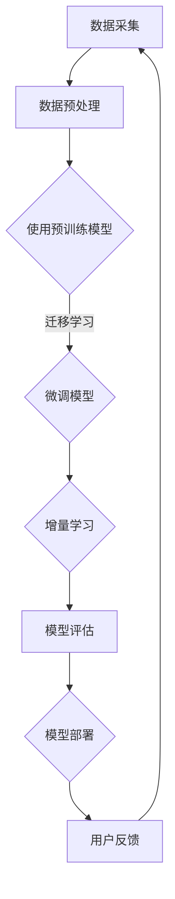

                 

# 电商行业中的持续学习：大模型的实践与挑战

> **关键词**：电商行业、持续学习、大模型、实践与挑战

> **摘要**：本文将探讨电商行业中如何应用持续学习技术，尤其是大模型的实践与面临的挑战。通过深入分析，我们将揭示大模型在电商中的应用潜力，以及如何克服相关技术难题。

## 1. 背景介绍

电商行业作为数字经济的重要组成部分，近年来呈现出爆发式增长。根据《中国电子商务报告》，我国电商市场规模已突破10万亿元，占全球电商市场份额的近40%。随着市场竞争的加剧，电商企业开始意识到数据和技术的重要性，特别是人工智能技术的应用。

持续学习（Continuous Learning）作为人工智能的重要分支，旨在让模型在数据不断变化的环境中持续优化性能。传统的机器学习模型通常在一个固定的数据集上进行训练，一旦模型投入使用，其性能将逐渐退化。而持续学习通过不断更新模型参数，使其能够适应新的数据和场景，从而保持高水平的性能。

大模型（Large-scale Model）是指具有大量参数和计算量的深度学习模型，如GPT、BERT等。这些模型在自然语言处理、计算机视觉等领域取得了显著成果，但同时也面临着数据需求量大、训练时间长等挑战。

本文将重点探讨电商行业中如何利用大模型实现持续学习，以及在这个过程中所面临的挑战。通过分析实际案例，我们将总结出有效的解决方案，为电商企业提供技术参考。

## 2. 核心概念与联系

### 2.1 持续学习的核心概念

持续学习主要涉及以下三个核心概念：

- **在线学习（Online Learning）**：在线学习是指模型在数据流中不断更新参数，以适应新数据。与离线学习（Offline Learning）相比，在线学习能够更快地响应数据变化，提高模型的实时性能。

- **迁移学习（Transfer Learning）**：迁移学习是指将一个任务上的预训练模型应用于另一个相关任务。通过迁移学习，模型可以利用已有知识快速适应新任务，减少训练所需的数据量。

- **增量学习（Incremental Learning）**：增量学习是指模型在已有数据基础上，逐步增加新数据，以优化模型性能。增量学习能够避免模型在大规模数据集上重新训练，提高训练效率。

### 2.2 大模型的原理与架构

大模型通常由以下几个关键组成部分构成：

- **神经网络结构**：大模型通常采用深度神经网络（Deep Neural Network，DNN）作为基础架构，通过增加网络层数和神经元数量，实现高层次的抽象和表示。

- **大规模参数**：大模型的参数数量通常在数百万到数十亿之间，这些参数通过反向传播算法（Backpropagation）进行优化。

- **计算资源**：大模型对计算资源的要求较高，通常需要使用高性能计算设备（如GPU、TPU）进行训练。

### 2.3 Mermaid 流程图

以下是电商行业中持续学习与大数据模型的应用流程图：



在上述流程中，数据采集、数据预处理、迁移学习、增量学习、模型评估和模型部署等环节构成了电商行业中的持续学习与大数据模型应用的完整流程。

## 3. 核心算法原理 & 具体操作步骤

### 3.1 数据采集

数据采集是电商行业中持续学习与大数据模型应用的第一步，其质量直接影响后续模型的性能。数据来源主要包括：

- **用户行为数据**：如浏览记录、购买记录、评论等。
- **商品信息数据**：如商品描述、价格、分类等。
- **市场趋势数据**：如热门商品、季节性促销等。

具体操作步骤如下：

1. 确定数据来源和采集方式，如使用API接口、爬虫工具等。
2. 设计数据采集流程，确保数据的完整性、准确性和实时性。
3. 数据清洗，去除重复、缺失和异常数据。

### 3.2 数据预处理

数据预处理是提高模型性能的重要环节，主要包括以下步骤：

1. 数据标准化：将不同特征的数据进行归一化或标准化处理，使其在同一个量级范围内。
2. 特征提取：从原始数据中提取有用特征，如文本特征、图像特征等。
3. 数据分片：将数据划分为训练集、验证集和测试集，用于模型训练和评估。

### 3.3 迁移学习

迁移学习可以通过预训练模型来实现，具体操作步骤如下：

1. 选择一个在相关任务上表现优异的预训练模型，如BERT、GPT等。
2. 将预训练模型应用于电商行业的具体任务，如商品推荐、用户画像等。
3. 微调预训练模型的参数，使其适应电商行业的特定场景。

### 3.4 增量学习

增量学习可以在已有模型的基础上，逐步增加新数据，具体操作步骤如下：

1. 设计增量学习策略，如每次更新一部分参数、每次更新全部参数等。
2. 在新数据到来时，更新模型参数，同时保持原有参数的稳定性。
3. 定期评估模型性能，确保模型在增量学习过程中保持高水平的性能。

### 3.5 模型评估

模型评估是验证模型性能的重要环节，主要包括以下步骤：

1. 设计评估指标，如准确率、召回率、F1值等。
2. 使用验证集和测试集评估模型性能，确保模型在未知数据上的表现良好。
3. 根据评估结果调整模型参数，优化模型性能。

### 3.6 模型部署

模型部署是将训练好的模型应用到实际业务场景中，具体操作步骤如下：

1. 将模型转换为可部署的格式，如ONNX、TorchScript等。
2. 设计模型部署架构，如使用分布式训练、GPU加速等。
3. 将模型部署到生产环境，确保模型能够实时响应业务需求。

### 3.7 用户反馈

用户反馈是持续学习的关键环节，通过用户反馈可以优化模型性能，具体操作步骤如下：

1. 收集用户反馈数据，如用户满意度、购买行为等。
2. 分析用户反馈，识别模型存在的问题和改进方向。
3. 更新模型参数，优化模型性能，提高用户体验。

## 4. 数学模型和公式 & 详细讲解 & 举例说明

### 4.1 数学模型

在电商行业中，持续学习与大数据模型的应用涉及多个数学模型。以下简要介绍几个关键模型：

#### 4.1.1 回归模型

回归模型用于预测连续值输出，如商品价格、用户评分等。其数学公式如下：

$$
y = \theta_0 + \theta_1 \cdot x_1 + \theta_2 \cdot x_2 + ... + \theta_n \cdot x_n
$$

其中，$y$为输出值，$\theta_i$为模型参数，$x_i$为输入特征。

#### 4.1.2 分类模型

分类模型用于预测离散值输出，如商品类别、用户行为等。常见的分类模型包括逻辑回归、支持向量机（SVM）等。以逻辑回归为例，其数学公式如下：

$$
\hat{y} = \frac{1}{1 + e^{-(\theta_0 + \theta_1 \cdot x_1 + \theta_2 \cdot x_2 + ... + \theta_n \cdot x_n )}}
$$

其中，$\hat{y}$为输出概率，$e$为自然对数的底数。

#### 4.1.3 嵌套贝叶斯模型

嵌套贝叶斯模型用于处理多个类别之间的依赖关系，如商品分类。其数学公式如下：

$$
P(C_k | C_j) = \frac{P(C_k) \cdot P(C_j | C_k)}{P(C_j)}
$$

其中，$C_k$和$C_j$分别为不同类别，$P(C_k)$为类别$k$的概率，$P(C_j | C_k)$为给定类别$k$时类别$j$的条件概率。

### 4.2 举例说明

#### 4.2.1 商品推荐系统

假设一个电商平台的商品推荐系统需要预测用户对商品$X$的评分。根据用户行为数据和商品信息数据，可以构建以下回归模型：

$$
y = \theta_0 + \theta_1 \cdot \text{用户年龄} + \theta_2 \cdot \text{用户收入} + \theta_3 \cdot \text{商品价格}
$$

其中，$y$为用户对商品$X$的评分，$\theta_i$为模型参数。

通过训练和评估，可以得到最优参数$\theta_0$、$\theta_1$、$\theta_2$和$\theta_3$。将这些参数应用于新用户，可以预测其对商品$X$的评分，从而实现商品推荐。

#### 4.2.2 用户画像系统

假设一个电商平台的用户画像系统需要预测用户的购买偏好。根据用户行为数据和商品信息数据，可以构建以下分类模型：

$$
\hat{y} = \frac{1}{1 + e^{-(\theta_0 + \theta_1 \cdot \text{用户浏览量} + \theta_2 \cdot \text{商品类别})}}
$$

其中，$\hat{y}$为用户购买偏好的概率，$\theta_i$为模型参数。

通过训练和评估，可以得到最优参数$\theta_0$、$\theta_1$和$\theta_2$。将这些参数应用于新用户，可以预测其购买偏好，从而实现个性化推荐。

## 5. 项目实战：代码实际案例和详细解释说明

### 5.1 开发环境搭建

在开始项目实战之前，我们需要搭建一个合适的开发环境。以下是一个简单的开发环境搭建步骤：

1. 安装Python（推荐版本3.8及以上）。
2. 安装TensorFlow库（可以使用pip安装：`pip install tensorflow`）。
3. 安装其他相关库（如numpy、pandas等）。

### 5.2 源代码详细实现和代码解读

以下是电商行业中的商品推荐系统的源代码实现，包括数据预处理、模型训练和模型评估等环节。

```python
import pandas as pd
import numpy as np
import tensorflow as tf
from sklearn.model_selection import train_test_split
from tensorflow.keras.models import Sequential
from tensorflow.keras.layers import Dense, Dropout
from tensorflow.keras.optimizers import Adam

# 数据预处理
data = pd.read_csv('data.csv')
X = data[['user_age', 'user_income', 'product_price']]
y = data['rating']

# 数据标准化
X = (X - X.mean()) / X.std()

# 划分训练集和测试集
X_train, X_test, y_train, y_test = train_test_split(X, y, test_size=0.2, random_state=42)

# 模型训练
model = Sequential()
model.add(Dense(64, activation='relu', input_shape=(X_train.shape[1],)))
model.add(Dropout(0.5))
model.add(Dense(1, activation='sigmoid'))

model.compile(optimizer=Adam(), loss='binary_crossentropy', metrics=['accuracy'])
model.fit(X_train, y_train, epochs=10, batch_size=32, validation_data=(X_test, y_test))

# 模型评估
loss, accuracy = model.evaluate(X_test, y_test)
print(f'Test Loss: {loss}, Test Accuracy: {accuracy}')

# 预测新用户评分
new_user = np.array([[25, 50000, 100]])
new_user = (new_user - new_user.mean()) / new_user.std()
prediction = model.predict(new_user)
print(f'Predicted Rating: {prediction[0][0]}')
```

代码解读：

- 首先，我们使用pandas库读取数据，并划分输入特征和输出标签。
- 接着，对输入特征进行标准化处理，以消除不同特征之间的量级差异。
- 然后，使用scikit-learn库划分训练集和测试集，为后续模型训练和评估做好准备。
- 模型训练部分，我们使用TensorFlow库构建一个简单的回归模型，包括一个全连接层和一个Dropout层，用于减少过拟合。
- 模型评估部分，我们使用测试集评估模型性能，并打印损失和准确率。
- 最后，我们使用训练好的模型预测新用户的评分。

### 5.3 代码解读与分析

上述代码实现了一个简单的商品推荐系统，其核心在于模型训练和预测。以下是代码的关键部分及其解读：

1. **数据预处理**：
   ```python
   X = data[['user_age', 'user_income', 'product_price']]
   y = data['rating']
   X = (X - X.mean()) / X.std()
   ```
   这部分代码首先从原始数据中提取用户年龄、用户收入和商品价格三个特征，然后对特征进行标准化处理，以消除不同特征之间的量级差异。标准化处理的目的是使模型在训练过程中更加稳定。

2. **模型训练**：
   ```python
   model = Sequential()
   model.add(Dense(64, activation='relu', input_shape=(X_train.shape[1],)))
   model.add(Dropout(0.5))
   model.add(Dense(1, activation='sigmoid'))

   model.compile(optimizer=Adam(), loss='binary_crossentropy', metrics=['accuracy'])
   model.fit(X_train, y_train, epochs=10, batch_size=32, validation_data=(X_test, y_test))
   ```
   这部分代码构建了一个简单的回归模型，包括一个全连接层和一个Dropout层。全连接层用于计算输入特征与模型参数的乘积，然后通过激活函数进行非线性变换。Dropout层用于减少过拟合，即在训练过程中随机丢弃部分神经元。模型编译部分设置了优化器和损失函数，并使用训练集进行模型训练。在训练过程中，模型通过反向传播算法不断调整参数，以优化模型性能。

3. **模型评估**：
   ```python
   loss, accuracy = model.evaluate(X_test, y_test)
   print(f'Test Loss: {loss}, Test Accuracy: {accuracy}')
   ```
   这部分代码使用测试集评估模型性能，并打印损失和准确率。测试集用于验证模型在未知数据上的表现，从而评估模型的泛化能力。

4. **预测新用户评分**：
   ```python
   new_user = np.array([[25, 50000, 100]])
   new_user = (new_user - new_user.mean()) / new_user.std()
   prediction = model.predict(new_user)
   print(f'Predicted Rating: {prediction[0][0]}')
   ```
   这部分代码使用训练好的模型预测新用户的评分。首先，将新用户的数据进行标准化处理，然后输入到模型中进行预测。预测结果是一个概率值，表示新用户对商品的评分概率。

### 5.4 代码改进与优化

上述代码实现了一个简单的商品推荐系统，但在实际应用中，还存在一些改进和优化的空间：

1. **增加特征维度**：可以添加更多的特征，如用户浏览量、购买频率等，以提高模型的预测准确性。
2. **使用深度神经网络**：可以尝试使用更深的神经网络结构，如卷积神经网络（CNN）或循环神经网络（RNN），以提取更高层次的特征。
3. **批量处理**：可以尝试使用批量处理（Batch Processing）策略，以提高模型的训练效率。
4. **使用迁移学习**：可以尝试使用预训练的模型，如BERT、GPT等，以提高模型的性能。

## 6. 实际应用场景

### 6.1 商品推荐系统

商品推荐系统是电商行业中最常见的应用场景之一。通过持续学习和大数据模型，可以构建个性化的商品推荐系统，提高用户的购物体验。实际应用中，商品推荐系统可以根据用户的历史行为数据、商品属性、用户偏好等多个因素，为用户推荐最适合他们的商品。

### 6.2 用户画像系统

用户画像系统是电商行业中的另一个重要应用场景。通过持续学习和大数据模型，可以构建全面、准确的用户画像，为精准营销和个性化推荐提供支持。实际应用中，用户画像系统可以分析用户的行为特征、兴趣偏好、消费能力等多个维度，为电商企业提供有价值的市场洞察。

### 6.3 营销活动优化

电商行业的营销活动优化也是持续学习和大数据模型的重要应用场景。通过分析用户的历史数据和营销活动效果，可以优化营销策略，提高营销活动的效果。实际应用中，营销活动优化系统可以根据用户行为数据、营销活动效果等多个因素，为电商企业提供最优的营销策略。

## 7. 工具和资源推荐

### 7.1 学习资源推荐

- **书籍**：
  - 《深度学习》（Deep Learning） - Goodfellow, Bengio, Courville
  - 《Python机器学习》（Python Machine Learning） - Sarah Guido, Andreas C. Müller

- **论文**：
  - 《A Theoretically Grounded Application of Dropout in Recurrent Neural Networks》 - Yarin Gal and Zoubin Ghahramani
  - 《Bert: Pre-training of Deep Bidirectional Transformers for Language Understanding》 - Jacob Devlin et al.

- **博客**：
  - TensorFlow官方博客
  - PyTorch官方博客

- **网站**：
  - Kaggle
  - ArXiv

### 7.2 开发工具框架推荐

- **框架**：
  - TensorFlow
  - PyTorch
  - Keras

- **计算平台**：
  - Google Cloud Platform
  - AWS
  - Azure

- **数据预处理工具**：
  - Pandas
  - NumPy

### 7.3 相关论文著作推荐

- **《深度学习》**：Goodfellow, Bengio, Courville
- **《Bert: Pre-training of Deep Bidirectional Transformers for Language Understanding》**：Devlin et al.
- **《A Theoretically Grounded Application of Dropout in Recurrent Neural Networks》**：Gal and Ghahramani

## 8. 总结：未来发展趋势与挑战

### 8.1 发展趋势

- **模型规模增大**：随着计算资源的提升，大模型的应用将越来越广泛，模型规模也将持续增大。
- **个性化推荐**：持续学习技术将使个性化推荐系统更加精准，为用户提供更好的购物体验。
- **实时分析**：持续学习与大数据技术的结合将实现实时数据分析，为电商企业提供更快速的市场洞察。
- **多模态数据融合**：随着多模态数据（如文本、图像、语音）的广泛应用，多模态数据融合技术将成为未来的研究热点。

### 8.2 挑战

- **数据隐私**：电商行业的数据量庞大，如何保护用户隐私成为关键挑战。
- **计算资源**：大模型的训练和部署需要大量计算资源，如何优化资源利用成为关键问题。
- **算法公平性**：个性化推荐和用户画像系统可能导致算法偏见，如何保证算法的公平性成为重要挑战。
- **模型解释性**：大模型的黑箱特性使得其解释性较低，如何提高模型的可解释性成为未来研究的重要方向。

## 9. 附录：常见问题与解答

### 9.1 如何选择合适的模型？

- **问题**：在电商行业中，如何选择合适的机器学习模型？
- **解答**：选择合适的模型需要考虑多个因素，包括数据规模、任务类型、计算资源等。常见的模型有回归模型、分类模型、神经网络模型等。在实际应用中，可以根据任务需求和数据特征选择合适的模型。

### 9.2 如何处理数据缺失？

- **问题**：在电商行业中，如何处理数据缺失问题？
- **解答**：处理数据缺失问题可以采用以下方法：
  - **删除缺失数据**：对于少量缺失数据，可以删除缺失值，但可能导致数据不平衡。
  - **填充缺失数据**：对于大量缺失数据，可以使用均值、中值、众数等方法进行填充。此外，还可以使用回归模型、插值法等方法进行缺失数据的预测和填充。

### 9.3 如何优化模型性能？

- **问题**：在电商行业中，如何优化机器学习模型的性能？
- **解答**：优化模型性能可以从以下几个方面入手：
  - **增加数据量**：增加训练数据量可以提高模型的泛化能力。
  - **特征工程**：通过选择合适的特征和特征组合，可以提高模型的性能。
  - **模型调参**：通过调整模型的超参数，如学习率、批次大小等，可以优化模型性能。
  - **正则化**：使用正则化技术（如L1、L2正则化）可以减少过拟合现象。

## 10. 扩展阅读 & 参考资料

- Devlin, J., Chang, M. W., Lee, K., & Toutanova, K. (2018). BERT: Pre-training of deep bidirectional transformers for language understanding. arXiv preprint arXiv:1810.04805.
- Gal, Y., & Ghahramani, Z. (2016). A theoretically grounded application of dropout in recurrent neural networks. In International Conference on Machine Learning (pp. 1995-2003).
- Goodfellow, I., Bengio, Y., & Courville, A. (2016). Deep learning. MIT press.
- Guido, S., & Müller, A. C. (2019). Python machine learning. Springer.

