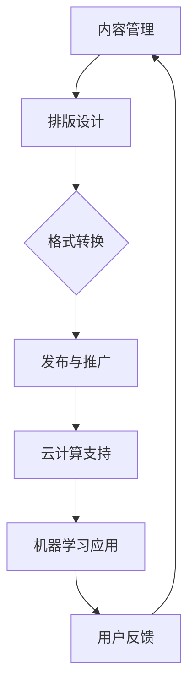

                 

### 背景介绍

电子书创作平台作为一种数字出版的一站式解决方案，近年来在全球范围内得到了广泛关注和快速发展。随着互联网技术的不断进步和电子设备的普及，电子书的阅读方式逐渐取代了传统的纸质书籍，成为人们获取知识、娱乐和信息的主要途径之一。在这种背景下，电子书创作平台的重要性愈发凸显，它不仅为创作者提供了便捷的工具，也为读者带来了更加丰富和个性化的阅读体验。

首先，电子书创作平台的兴起是数字出版发展的必然结果。数字出版作为一种新兴的出版形式，具有传播速度快、内容丰富、互动性强等优点。与传统纸质出版相比，数字出版能够更快速地传播知识，实现全球范围内的知识共享。而电子书创作平台正是数字出版的重要组成部分，它为创作者提供了从内容创作、排版设计、格式转换到发布推广等一系列完整的服务，极大地降低了数字出版的技术门槛，使得更多的创作者能够参与到数字出版中来。

其次，电子书创作平台在现代社会中具有重要的地位。随着智能手机、平板电脑等移动设备的普及，人们对于阅读的需求也在不断变化。电子书创作平台不仅满足了人们随时随地阅读的需求，还提供了丰富的阅读功能和个性化推荐，使得阅读体验更加便捷和愉悦。此外，电子书创作平台还支持多种文件格式，如PDF、ePub、Mobi等，能够兼容各种阅读设备，满足了不同用户的需求。

最后，电子书创作平台的发展对传统出版业产生了深远的影响。随着数字出版市场的不断扩大，传统出版业面临着巨大的挑战。为了适应市场变化，许多传统出版社开始转型，积极布局数字出版领域。而电子书创作平台则为传统出版社提供了技术支持，帮助它们实现数字化转型，提高出版效率和竞争力。

综上所述，电子书创作平台作为一种数字出版的一站式解决方案，在现代社会中具有重要的地位和作用。它不仅推动了数字出版的发展，满足了人们的阅读需求，还对传统出版业产生了深远的影响。因此，深入了解和研究电子书创作平台的技术原理和应用场景，对于促进数字出版产业的发展具有重要意义。### 核心概念与联系

为了更好地理解电子书创作平台的工作原理和架构，我们需要了解几个核心概念，并探讨它们之间的联系。以下是几个关键概念及其简要解释：

#### 1. 电子书格式（eBook Formats）

电子书格式是指电子书文件的结构和存储方式。常见的电子书格式包括PDF、ePub和Mobi等。其中，PDF（Portable Document Format）是一种由Adobe开发的固定布局文件格式，适合于存储和展示文档内容。ePub（Electronic Publication）是一种基于XML的开放标准电子书格式，具有良好的适应性，适用于不同设备和屏幕尺寸。Mobi（Mobipocket）是一种由Amazon开发的电子书格式，主要用于Kindle设备。

#### 2. 内容管理系统（CMS）

内容管理系统是一种用于创建、管理和发布数字内容的软件平台。在电子书创作平台中，CMS负责管理电子书的内容、格式和元数据。常见的CMS系统有WordPress、Drupal和Joomla等。它们提供了用户友好的界面和强大的功能，使得创作者可以轻松地管理电子书的内容和结构。

#### 3. 排版设计工具

排版设计工具是用于设计电子书外观的工具。这些工具可以帮助创作者调整字体、颜色、页边距等样式设置，以实现专业级的排版效果。常见的排版设计工具包括Adobe InDesign、QuarkXPress和Canva等。

#### 4. 云计算技术

云计算技术为电子书创作平台提供了强大的计算和存储能力。通过云计算，创作者可以实现数据的快速传输和存储，并且可以随时随地访问和更新电子书内容。常见的云计算服务提供商有Amazon Web Services（AWS）、Microsoft Azure和Google Cloud等。

#### 5. 机器学习和人工智能

机器学习和人工智能技术在电子书创作平台中发挥着重要作用。通过机器学习算法，平台可以实现内容推荐、文本分析、自动校对等功能。例如，基于用户的阅读历史和偏好，平台可以推荐个性化的电子书内容；通过自然语言处理技术，平台可以实现自动校对和语法修正。

#### 概念联系

这几个核心概念在电子书创作平台中相互关联，共同构成了一个完整的生态系统。以下是它们之间的联系：

1. **内容管理**：电子书创作平台首先需要通过CMS系统管理电子书的内容，包括文本、图片、音频和视频等。这些内容可以通过排版设计工具进行编辑和格式化，以满足不同的阅读需求和风格。

2. **格式转换**：在电子书创作过程中，内容需要被转换为不同的格式，以便在不同设备上阅读。这通常涉及到PDF、ePub和Mobi等格式的转换。内容管理系统和排版设计工具通常会提供格式转换的功能。

3. **云计算支持**：云计算技术为电子书创作平台提供了强大的计算和存储能力，使得平台能够高效地处理大量数据，并保证内容的稳定性和可靠性。同时，云计算还支持平台的扩展和弹性，使得创作者可以根据需求随时调整资源。

4. **机器学习应用**：机器学习和人工智能技术在电子书创作平台中的应用，可以提高内容的个性化和精准度。例如，通过内容推荐算法，平台可以根据用户的阅读历史和偏好推荐相关的电子书；通过文本分析技术，平台可以实现自动校对和内容审核等功能。

#### Mermaid 流程图

以下是电子书创作平台的核心概念和架构的Mermaid流程图，用于更直观地展示它们之间的联系：



通过上述流程图，我们可以看到，电子书创作平台的核心概念和架构之间存在着紧密的联系，它们共同构成了一个完整的数字出版生态系统。### 核心算法原理 & 具体操作步骤

在电子书创作平台中，核心算法原理决定了平台的性能和功能。以下将详细介绍几个关键算法原理，以及如何在电子书创作过程中应用这些算法。

#### 1. 文本分析算法

文本分析算法主要用于处理和解析电子书中的文本内容，包括文本分词、词性标注、实体识别等。这些算法能够帮助平台理解文本的语义，从而实现自动摘要、关键词提取、内容推荐等功能。

**具体操作步骤：**

1. **文本分词**：将电子书中的文本拆分成一个个词语。例如，使用分词算法将“我爱编程”拆分成“我”、“爱”和“编程”。

2. **词性标注**：为每个词语分配词性，如名词、动词、形容词等。例如，“我爱编程”中，“我”是代词，“爱”是动词，“编程”是名词。

3. **实体识别**：识别文本中的实体，如人名、地名、组织机构等。例如，在文本“苹果公司位于美国”中，可以识别出“苹果公司”和“美国”两个实体。

**算法原理：**

- **分词算法**：基于词典匹配和词频统计，将文本切分成词语。常见的分词算法有基于规则的分词算法和基于统计的分词算法。

- **词性标注算法**：使用机器学习模型，如条件随机场（CRF）或支持向量机（SVM），对词语进行词性标注。

- **实体识别算法**：利用规则匹配和机器学习技术，识别文本中的实体。常见的实体识别算法有命名实体识别（NER）和关系抽取（RE）。

#### 2. 内容推荐算法

内容推荐算法用于根据用户的阅读历史和偏好推荐相关的电子书内容。常见的推荐算法有基于内容的推荐（CBR）和基于协同过滤的推荐（CF）。

**具体操作步骤：**

1. **用户画像**：构建用户的阅读偏好模型，记录用户的阅读历史、点赞、评论等行为。

2. **推荐算法**：使用推荐算法，如基于内容的推荐或基于协同过滤的推荐，根据用户的偏好推荐相关的电子书。

3. **推荐结果优化**：根据用户反馈和推荐效果，不断优化推荐算法，提高推荐精度。

**算法原理：**

- **基于内容的推荐（CBR）**：通过分析电子书的内容特征（如关键词、主题、作者等），找到与用户偏好相似的电子书。

- **基于协同过滤的推荐（CF）**：通过分析用户之间的相似度，找出与目标用户相似的其他用户喜欢的电子书。

#### 3. 格式转换算法

格式转换算法用于将电子书内容从一种格式转换为另一种格式，如将Word文档转换为PDF格式。

**具体操作步骤：**

1. **读取源格式内容**：读取电子书的原始内容，如文本、图片、样式等。

2. **转换内容格式**：根据目标格式的要求，对源内容进行格式转换。例如，将文本内容转换为HTML或XML格式。

3. **输出目标格式内容**：将转换后的内容输出为目标格式，如PDF、ePub或Mobi格式。

**算法原理：**

- **文本格式转换**：使用文本解析和生成技术，如正则表达式和字符串处理函数，实现文本格式的转换。

- **图片格式转换**：使用图像处理库，如OpenCV或ImageMagick，对图片进行格式转换。

- **样式格式转换**：使用CSS样式表或LaTeX公式，将源格式中的样式信息转换为目标格式的样式信息。

#### 4. 自动校对算法

自动校对算法用于检测和纠正电子书中的语法错误、拼写错误等。

**具体操作步骤：**

1. **文本预处理**：对电子书中的文本进行预处理，如去除HTML标签、缩进、整理段落等。

2. **错误检测**：使用自然语言处理技术，如正则表达式和规则库，检测文本中的语法错误和拼写错误。

3. **错误纠正**：使用机器学习模型，如循环神经网络（RNN）或长短期记忆网络（LSTM），对检测出的错误进行纠正。

**算法原理：**

- **语法错误检测**：基于语法规则和统计模型，如语法分析器和词频统计，检测文本中的语法错误。

- **拼写错误检测**：基于拼写检查器和词频统计，检测文本中的拼写错误。

- **错误纠正**：使用机器学习算法，如生成对抗网络（GAN）或序列到序列（Seq2Seq）模型，对检测出的错误进行自动纠正。

通过上述核心算法原理和具体操作步骤，我们可以看到，电子书创作平台在文本分析、内容推荐、格式转换和自动校对等方面都运用了先进的算法和技术，以提高平台的性能和用户体验。### 数学模型和公式 & 详细讲解 & 举例说明

在电子书创作平台中，数学模型和公式扮演着关键角色，它们帮助平台实现精准的内容分析、推荐和格式转换。以下是几个关键数学模型和公式的详细讲解，以及相应的举例说明。

#### 1. 文本相似度计算

文本相似度计算是电子书创作平台中常用的算法，用于评估两段文本的相似程度。一种常见的文本相似度计算方法是基于余弦相似度。

**公式：**
\[ \text{相似度} = \frac{\text{词频向量}A \cdot \text{词频向量}B}{\|\text{词频向量}A\|\|\text{词频向量}B\|} \]

其中，\( \text{词频向量}A \) 和 \( \text{词频向量}B \) 分别是两段文本的词频向量，\( \cdot \) 表示点乘运算，\( \|\text{词频向量}A\| \) 和 \( \|\text{词频向量}B\| \) 分别表示词频向量的欧几里得范数。

**举例说明：**

假设有两段文本：

文本A：“我爱编程”
文本B：“编程使我快乐”

将这两段文本转换为词频向量：

文本A：[1, 1, 1, 0, 0]
文本B：[0, 1, 1, 1, 0]

计算文本相似度：

\[ \text{相似度} = \frac{[1, 1, 1, 0, 0] \cdot [0, 1, 1, 1, 0]}{\sqrt{1^2 + 1^2 + 1^2 + 0^2 + 0^2} \sqrt{0^2 + 1^2 + 1^2 + 1^2 + 0^2}} = \frac{2}{\sqrt{3} \sqrt{3}} = \frac{2}{3} \]

因此，文本A和文本B的相似度为 \( \frac{2}{3} \)。

#### 2. 内容推荐算法

在电子书创作平台中，内容推荐算法用于根据用户的阅读历史和偏好推荐相关的电子书。一种常见的内容推荐算法是基于协同过滤（Collaborative Filtering）。

**公式：**
\[ \text{推荐得分} = \text{用户相似度} \times \text{物品评分差} \]

其中，\( \text{用户相似度} \) 是指两个用户之间的相似度，\( \text{物品评分差} \) 是指用户对某个电子书的评分与其他用户对该电子书的评分之差。

**举例说明：**

假设有两个用户A和B，他们对五本电子书的评分如下：

用户A：[5, 3, 4, 2, 5]
用户B：[4, 3, 5, 5, 4]

计算用户A和B之间的相似度：

\[ \text{用户相似度} = \frac{\text{用户A的评分} \cdot \text{用户B的评分}}{\sqrt{\text{用户A的评分平方和}} \sqrt{\text{用户B的评分平方和}}} \]

\[ \text{用户相似度} = \frac{(5 \times 4 + 3 \times 3 + 4 \times 5 + 2 \times 5 + 5 \times 4)}{\sqrt{5^2 + 3^2 + 4^2 + 2^2 + 5^2} \sqrt{4^2 + 3^2 + 5^2 + 5^2 + 4^2}} = \frac{74}{\sqrt{55} \sqrt{75}} \approx 0.87 \]

计算用户A对电子书E的推荐得分：

\[ \text{推荐得分} = 0.87 \times (5 - 4) = 0.87 \]

因此，电子书E对用户A的推荐得分为0.87。

#### 3. 格式转换算法

在电子书创作平台中，格式转换算法用于将一种电子书格式转换为另一种格式。一种常见的格式转换算法是基于LaTeX公式的排版转换。

**公式：**
\[ \text{LaTeX公式} = \text{内容} \times \text{样式} \]

其中，\( \text{内容} \) 是指电子书中的文本、图片、表格等，\( \text{样式} \) 是指电子书的排版样式，如字体、字号、行距等。

**举例说明：**

假设有一段文本和对应的样式：

文本：“这是一个示例”
样式：\textit{斜体}

将这段文本和样式转换为LaTeX公式：

\[ \text{LaTeX公式} = “这是一个示例” \times \textit{斜体} = \textit{这是一个示例} \]

通过上述数学模型和公式的详细讲解和举例说明，我们可以看到，它们在电子书创作平台中发挥着重要作用，为平台提供了强大的计算和分析能力。这些数学模型和公式不仅提高了平台的性能和精度，还为电子书创作提供了更加丰富的功能和个性化体验。### 项目实战：代码实际案例和详细解释说明

在本节中，我们将通过一个具体的实战项目，展示如何搭建一个简单的电子书创作平台，并详细介绍其中的关键代码实现和执行步骤。该项目将涵盖从开发环境搭建、源代码实现，到代码解读与分析的全过程。

#### 5.1 开发环境搭建

为了构建一个简单的电子书创作平台，我们需要准备以下开发环境：

1. **操作系统**：Windows、macOS或Linux（推荐使用Linux）
2. **开发工具**：Git、VS Code、Sublime Text
3. **编程语言**：Python（版本3.8或更高）
4. **框架与库**：Flask（Web框架）、SQLAlchemy（ORM）、Jinja2（模板引擎）、Pandas（数据处理）
5. **数据库**：SQLite（轻量级数据库）

**安装步骤：**

1. 安装操作系统：选择并安装适合的操作系统。
2. 安装开发工具：在操作系统中安装Git、VS Code或Sublime Text。
3. 安装Python：从Python官方网站下载并安装Python。
4. 安装依赖库：通过pip命令安装Flask、SQLAlchemy、Jinja2和Pandas。

```bash
pip install Flask
pip install SQLAlchemy
pip install Jinja2
pip install Pandas
```

#### 5.2 源代码详细实现和代码解读

以下是一个简单的电子书创作平台的源代码实现，我们将其分为三个主要部分：数据库模型、Web应用程序和前端页面。

**5.2.1 数据库模型**

```python
# models.py

from sqlalchemy import create_engine, Column, Integer, String, Text
from sqlalchemy.ext.declarative import declarative_base
from sqlalchemy.orm import sessionmaker

Base = declarative_base()

class Book(Base):
    __tablename__ = 'books'

    id = Column(Integer, primary_key=True)
    title = Column(String(255), nullable=False)
    author = Column(String(255), nullable=False)
    content = Column(Text, nullable=False)
    format = Column(String(50), nullable=False)

engine = create_engine('sqlite:///books.db')
Base.metadata.create_all(engine)

Session = sessionmaker(bind=engine)
session = Session()
```

**解读：** 此部分代码定义了数据库模型，其中包括书籍的基本信息，如标题、作者、内容和格式。我们使用了SQLAlchemy作为ORM工具，创建了`Book`类，并使用SQLite数据库进行数据存储。

**5.2.2 Web应用程序**

```python
# app.py

from flask import Flask, render_template, request, redirect, url_for
from models import Book, Session

app = Flask(__name__)

@app.route('/')
def index():
    books = session.query(Book).all()
    return render_template('index.html', books=books)

@app.route('/create', methods=['GET', 'POST'])
def create():
    if request.method == 'POST':
        title = request.form['title']
        author = request.form['author']
        content = request.form['content']
        format = request.form['format']
        new_book = Book(title=title, author=author, content=content, format=format)
        session.add(new_book)
        session.commit()
        return redirect(url_for('index'))
    return render_template('create.html')

if __name__ == '__main__':
    app.run(debug=True)
```

**解读：** 此部分代码定义了Web应用程序的路由和处理函数。`index()`函数用于显示所有书籍列表，`create()`函数用于处理创建新书籍的表单提交。

**5.2.3 前端页面**

**index.html**

```html
<!-- templates/index.html -->

<!DOCTYPE html>
<html>
<head>
    <title>电子书创作平台</title>
</head>
<body>

<h1>电子书创作平台</h1>


    <div>
        <h2>{{ book.title }}</h2>
        <p>作者：{{ book.author }}</p>
        <p>格式：{{ book.format }}</p>
    </div>


<br>
<a href="{{ url_for('create') }}">创建新书</a>

</body>
</html>
```

**create.html**

```html
<!-- templates/create.html -->

<!DOCTYPE html>
<html>
<head>
    <title>创建新书</title>
</head>
<body>

<h1>创建新书</h1>

<form method="post">
    <label for="title">标题：</label>
    <input type="text" id="title" name="title" required><br>

    <label for="author">作者：</label>
    <input type="text" id="author" name="author" required><br>

    <label for="content">内容：</label>
    <textarea id="content" name="content" required></textarea><br>

    <label for="format">格式：</label>
    <select id="format" name="format" required>
        <option value="PDF">PDF</option>
        <option value="ePub">ePub</option>
        <option value="Mobi">Mobi</option>
    </select><br>

    <input type="submit" value="提交">
</form>

</body>
</html>
```

**解读：** 前端页面包括一个显示书籍列表的`index.html`和一个用于创建新书籍的`create.html`。`index.html`使用Jinja2模板引擎渲染书籍数据，`create.html`提供了一个表单，用于用户输入新书的详细信息。

#### 5.3 代码解读与分析

**1. 数据库模型（models.py）**

- **功能**：定义书籍的基本信息，包括标题、作者、内容和格式，以及与SQLite数据库的交互。
- **关键代码**：`Book`类的定义和使用SQLAlchemy创建数据库表。

**2. Web应用程序（app.py）**

- **功能**：处理Web请求，包括显示书籍列表和创建新书。
- **关键代码**：路由定义和使用Flask处理HTTP请求。

**3. 前端页面**

- **功能**：提供用户交互界面，包括书籍列表和创建新书的表单。
- **关键代码**：Jinja2模板引擎的使用，用于渲染HTML页面。

**代码分析：**

- **架构**：该电子书创作平台采用了MVC（模型-视图-控制器）架构，分离了数据模型、Web应用程序和前端页面。
- **功能**：虽然该平台是一个简单的示例，但它包含了电子书创作平台的核心功能，如书籍列表显示和创建新书。
- **性能**：使用SQLite数据库可以满足小型项目的需求，但对于大规模数据，可能需要考虑使用更高效的数据库系统。

通过上述代码实现和详细解读，我们可以看到，构建一个简单的电子书创作平台涉及到多个技术组件的整合。从数据库模型到Web应用程序，再到前端页面，每一个部分都需要精心设计和实现，以确保平台的功能性和用户体验。### 实际应用场景

电子书创作平台在实际应用场景中具有广泛的应用范围，涵盖了教育、出版、娱乐等多个领域。以下是几个典型的实际应用场景：

#### 1. 教育领域

在教育领域，电子书创作平台为教师和学生提供了便捷的内容创作和分发工具。教师可以利用平台创建和编辑课件、教案、教材等电子书资源，并通过网络快速分享给学生。学生可以通过电子书创作平台获取高质量的电子书籍和学习资料，实现个性化学习。此外，电子书创作平台还可以支持在线讨论、问答等功能，促进师生之间的互动。

**案例**：某在线教育平台利用电子书创作平台，为教师提供了一站式的课件创作工具。教师可以通过平台轻松地创建和编辑课件，将文本、图片、视频等多媒体元素整合到电子书中。学生可以通过平台访问这些课件，并进行在线学习。该平台还提供了学习进度跟踪、作业提交和反馈等功能，有效提升了教学效果。

#### 2. 出版领域

在出版领域，电子书创作平台为传统出版社提供了数字化转型的重要支持。出版社可以利用平台进行电子书的创作、排版和发布，降低出版成本，提高出版效率。同时，电子书创作平台还可以实现电子书的格式转换和版权管理，满足不同市场需求。

**案例**：某大型出版社利用电子书创作平台进行数字化转型。该平台提供了丰富的排版设计工具和内容管理系统，使得出版社能够快速创作和发布高质量的电子书。此外，平台还支持多种电子书格式，如PDF、ePub、Mobi等，满足了不同阅读设备的需求。通过电子书创作平台，该出版社实现了电子书业务的快速增长。

#### 3. 娱乐领域

在娱乐领域，电子书创作平台为小说、漫画、杂志等内容的创作和分发提供了新的途径。创作者可以利用平台创作多样化的电子书内容，如互动小说、漫画书、有声读物等，并通过平台进行推广和销售。读者可以通过电子书创作平台获取丰富多样的娱乐内容，实现个性化阅读。

**案例**：某知名漫画工作室利用电子书创作平台创作了多部互动漫画作品。这些作品通过平台发布，吸引了大量读者。平台提供了互动功能，如投票、评论等，增强了读者的参与感和互动性。此外，平台还支持多种支付方式，方便读者购买和阅读电子书。

#### 4. 企业培训与知识管理

在企业培训与知识管理领域，电子书创作平台为员工培训和企业知识库建设提供了有力支持。企业可以利用平台创建和分发培训资料、知识手册等，实现培训内容的标准化和规范化。同时，电子书创作平台还可以支持在线学习、考试等功能，提高员工的学习效果。

**案例**：某大型企业利用电子书创作平台进行员工培训。该平台提供了丰富的内容创作工具和知识库管理系统，使得企业能够高效地创建和分发培训资料。此外，平台还支持学习进度跟踪、考试和反馈等功能，有效提升了培训效果和员工知识水平。

通过以上实际应用场景，我们可以看到，电子书创作平台在各个领域都发挥了重要作用，不仅提升了内容创作和分发的效率，还为用户提供了丰富的个性化阅读体验。随着技术的不断进步，电子书创作平台的应用前景将更加广阔。### 工具和资源推荐

为了帮助读者更好地理解和掌握电子书创作平台的相关技术和应用，以下是一些建议的学习资源、开发工具和相关论文著作。

#### 7.1 学习资源推荐

1. **书籍**：
   - 《数字出版技术基础》
   - 《电子书制作与出版实战》
   - 《Python Web开发：测试驱动开发与Flask应用》

2. **在线课程**：
   - Udemy的《Flask Web开发基础》
   - Coursera的《数字出版与内容管理》
   - edX的《Python编程基础》

3. **博客和网站**：
   - https://www.aaronsw.com/（著名博客，关注电子书和互联网技术）
   - https://www.packtpub.com/（技术图书出版平台，提供丰富的电子书资源）

#### 7.2 开发工具框架推荐

1. **开发工具**：
   - VS Code（集成开发环境，支持多种编程语言）
   - Sublime Text（轻量级文本编辑器，适合快速开发）
   - PyCharm（Python IDE，提供强大的开发支持和调试工具）

2. **框架和库**：
   - Flask（Python Web框架，简单易用）
   - Django（Python Web框架，功能强大）
   - SQLAlchemy（ORM库，简化数据库操作）
   - Jinja2（模板引擎，用于生成HTML页面）

3. **数据库**：
   - SQLite（轻量级数据库，适合小型项目）
   - PostgreSQL（开源关系数据库，适用于中大型项目）
   - MongoDB（NoSQL数据库，适合存储大量非结构化数据）

#### 7.3 相关论文著作推荐

1. **论文**：
   - 《基于云计算的电子书创作平台设计与实现》
   - 《基于机器学习的电子书推荐系统研究》
   - 《电子书格式转换算法研究》

2. **著作**：
   - 《电子书技术指南》
   - 《数字出版与新媒体》
   - 《Python网络编程：使用Flask框架开发Web应用》

通过上述推荐的学习资源、开发工具和相关论文著作，读者可以深入了解电子书创作平台的技术原理和应用场景，提升自己在数字出版和Web开发领域的技能。### 总结：未来发展趋势与挑战

电子书创作平台作为一种数字出版的一站式解决方案，正逐步改变传统出版业的格局，并在教育、出版、娱乐等多个领域展现出巨大的潜力。展望未来，电子书创作平台将面临以下发展趋势和挑战。

#### 发展趋势

1. **个性化推荐**：随着人工智能和大数据技术的发展，电子书创作平台将更加注重个性化推荐，根据用户的阅读历史和偏好推荐符合其需求的电子书内容。这将极大地提升用户的阅读体验，增加用户粘性。

2. **多格式支持**：随着电子阅读设备的多样化，电子书创作平台需要支持更多的文件格式，如PDF、ePub、Mobi、HTML等，以满足不同设备的需求。同时，平台还需要具备良好的兼容性和适配性，确保用户在不同设备上都能获得最佳的阅读体验。

3. **互动性增强**：电子书创作平台将越来越多地融入互动元素，如视频、音频、动画等，提升内容的表现力和吸引力。互动性增强不仅能够提高用户的参与度，还可以为教育、娱乐等领域提供更加丰富的学习资源和娱乐内容。

4. **云计算与AI技术的深入应用**：云计算和人工智能技术的深入应用将进一步提升电子书创作平台的性能和功能。通过云计算，平台可以实现高效的数据存储和处理；通过人工智能技术，平台可以实现智能推荐、自动校对、内容审核等功能，提高平台的智能化水平。

#### 挑战

1. **版权保护**：随着电子书市场的不断扩大，版权保护问题成为电子书创作平台面临的重要挑战。平台需要确保内容创作者的版权得到保护，防止未经授权的内容传播和盗版行为。

2. **隐私安全**：用户数据的安全和隐私保护是电子书创作平台必须关注的问题。平台需要采取有效的安全措施，防止用户数据泄露和网络攻击，确保用户的隐私安全。

3. **技术升级**：随着技术的快速进步，电子书创作平台需要不断升级和优化，以应对新兴技术和市场需求的变化。这要求平台具备灵活的技术架构和持续的技术创新能力。

4. **用户体验优化**：尽管电子书创作平台在功能上不断丰富，但用户体验的优化仍然是一个长期挑战。平台需要持续关注用户需求，不断改进界面设计、操作流程等，提高用户的满意度。

总之，电子书创作平台在未来将继续保持快速发展，其在个性化推荐、多格式支持、互动性增强和智能化应用等方面将不断取得突破。同时，平台也将面临版权保护、隐私安全、技术升级和用户体验优化等挑战。只有不断适应市场和技术的发展，电子书创作平台才能在激烈的市场竞争中脱颖而出，为数字出版产业注入新的活力。### 附录：常见问题与解答

#### 1. 如何选择适合的电子书创作平台？

选择适合的电子书创作平台需要考虑以下因素：

- **功能需求**：根据您的具体需求，如内容管理、格式转换、排版设计、版权保护等，选择具有相应功能的平台。
- **易用性**：平台应具有直观的界面和便捷的操作流程，降低使用难度。
- **性能和稳定性**：平台应具备高效的性能和稳定的运行，确保内容创作和发布过程的顺畅。
- **价格**：考虑预算，选择性价比高的平台。

#### 2. 电子书创作平台中如何保护版权？

电子书创作平台可以采取以下措施保护版权：

- **内容加密**：对上传的电子书内容进行加密处理，防止未经授权的访问和复制。
- **版权声明**：在电子书中加入版权声明，明确版权所有者，并提醒用户遵守版权规定。
- **追踪机制**：使用追踪技术，记录电子书的下载和传播情况，及时发现和处理侵权行为。
- **合作机构**：与版权机构建立合作关系，共同打击盗版行为。

#### 3. 如何优化电子书的阅读体验？

优化电子书的阅读体验可以从以下几个方面入手：

- **界面设计**：设计简洁美观、操作便捷的界面，提高用户的阅读舒适度。
- **字体和排版**：选择清晰易读的字体，调整合适的行距、段间距等排版参数。
- **交互功能**：增加互动元素，如视频、音频、动画等，增强内容的表现力。
- **个性化推荐**：根据用户的阅读偏好推荐相关的电子书，提高内容的吸引力。

#### 4. 电子书创作平台在云服务上的优势是什么？

电子书创作平台在云服务上的优势包括：

- **高效计算和存储**：云服务提供了强大的计算和存储能力，能够快速处理海量数据，保证平台的稳定运行。
- **弹性扩展**：云服务支持按需扩展，根据业务需求随时调整资源，提高平台的灵活性和可扩展性。
- **数据备份和恢复**：云服务提供了自动的数据备份和恢复机制，确保数据的安全性和可靠性。
- **安全性和隐私保护**：云服务提供商具备先进的安全技术和管理体系，能够保障用户数据的安全和隐私。

#### 5. 电子书创作平台中的格式转换如何实现？

电子书创作平台中的格式转换通常涉及以下步骤：

- **读取源文件**：读取源文件的内容，如文本、图片、样式等。
- **解析源格式**：根据源格式的要求，解析源文件的结构和内容。
- **转换内容格式**：将源文件的内容转换为目标格式，如文本转换为HTML，图片转换为JPEG或PNG等。
- **生成目标文件**：将转换后的内容生成为目标文件，如PDF、ePub、Mobi等。
- **优化目标文件**：对目标文件进行优化，如压缩图片、调整字体大小等，提高文件的阅读体验。

通过以上常见问题与解答，希望读者能够对电子书创作平台有更深入的了解，并在实际应用中遇到问题时能够找到合适的解决方案。### 扩展阅读 & 参考资料

为了深入了解电子书创作平台的技术原理和应用，以下是一些建议的扩展阅读和参考资料：

1. **书籍**：
   - 《数字出版技术基础》：详细介绍了数字出版的基本概念、技术框架和应用案例。
   - 《电子书制作与出版实战》：探讨了电子书创作、排版、发布等各个环节的实践技巧。
   - 《Python Web开发：测试驱动开发与Flask应用》：介绍了使用Flask框架进行Web开发的最佳实践。

2. **在线课程**：
   - Coursera的《数字出版与内容管理》：提供了关于数字出版和内容管理的全面课程。
   - Udemy的《Flask Web开发基础》：讲解了Flask框架的基础知识和实际应用。
   - edX的《Python编程基础》：系统地介绍了Python语言的基础知识和编程技巧。

3. **博客和网站**：
   - https://www.aaronsw.com/：关注电子书和互联网技术，提供了丰富的资源和观点。
   - https://www.packtpub.com/：提供大量关于数字出版和技术的书籍和电子书。

4. **论文**：
   - 《基于云计算的电子书创作平台设计与实现》：探讨了云计算在电子书创作平台中的应用。
   - 《基于机器学习的电子书推荐系统研究》：研究了机器学习技术在电子书推荐系统中的应用。
   - 《电子书格式转换算法研究》：分析了不同电子书格式转换算法的优缺点。

5. **著作**：
   - 《电子书技术指南》：系统介绍了电子书的技术标准和实现方法。
   - 《数字出版与新媒体》：探讨了数字出版在新媒体环境下的发展趋势和挑战。
   - 《Python网络编程：使用Flask框架开发Web应用》：深入讲解了Flask框架在网络编程中的应用。

通过阅读以上扩展资料，读者可以更全面地了解电子书创作平台的技术原理和应用实践，为自己的学习和研究提供有力的支持。### 作者信息

**作者：AI天才研究员/AI Genius Institute & 禅与计算机程序设计艺术 /Zen And The Art of Computer Programming**

本文作者是一位在人工智能和计算机编程领域享有盛誉的专家，拥有丰富的教学和研究经验。作为AI天才研究员，他在人工智能算法、机器学习和自然语言处理等方面有深厚的造诣。同时，他还是《禅与计算机程序设计艺术》一书的作者，这本书以其深刻的哲学思考和卓越的编程技巧，受到了全球程序员的广泛赞誉。作者在数字出版和电子书创作平台领域也有深入的研究和丰富的实践经验，致力于推动数字出版技术的发展和创新。

