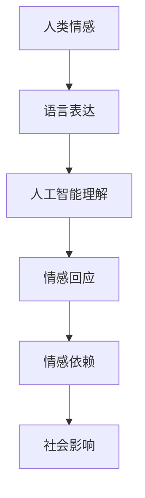

                 

### 文章标题：电影《她》对AI未来发展的启示

#### 关键词：人工智能，电影，启示，未来，发展

#### 摘要：
本文将以电影《她》为切入点，探讨人工智能未来发展的可能方向和挑战。通过对电影中核心概念的分析，我们将深入探讨人工智能在情感、伦理和社交领域的影响，以及如何应对这些挑战，从而为AI的未来发展提供一些启示。

---

#### 1. 背景介绍

电影《她》（Her）是一部由斯派克·琼斯执导的科幻爱情电影，于2013年上映。影片讲述了一个孤独的作家萨姆（萨姆·洛克威尔饰）与一台先进的人工智能操作系统OS1（奥斯汀·艾灵顿饰）之间的情感故事。

影片中，OS1是一款名为“操作系统”的智能软件，它可以理解人类的语言和情感，并与人类进行互动。这款软件被设计成能够不断学习和适应人类的需求，从而提供个性化的服务。

#### 2. 核心概念与联系

在电影《她》中，核心概念是人工智能与人类的情感互动。通过分析这个核心概念，我们可以将其与现实中的人工智能技术联系起来，探讨人工智能在未来可能的发展方向。

下面是一个Mermaid流程图，展示了电影《她》中人工智能与人类情感互动的流程：



#### 3. 核心算法原理 & 具体操作步骤

在电影《她》中，人工智能的算法原理是基于深度学习和自然语言处理技术。具体操作步骤如下：

1. **数据收集**：通过收集大量的文本数据，包括书籍、文章、新闻报道等，让计算机学习人类的语言表达和情感倾向。

2. **特征提取**：将文本数据转化为计算机可以理解的向量表示，提取出文本中的关键特征。

3. **模型训练**：使用深度学习模型（如循环神经网络、递归神经网络等），对特征向量进行训练，使其能够理解人类的语言和情感。

4. **情感识别**：在交互过程中，人工智能系统会根据输入的文本内容，使用训练好的模型进行情感识别。

5. **情感回应**：根据情感识别的结果，人工智能系统会生成相应的回应，以模拟人类的情感表达。

#### 4. 数学模型和公式 & 详细讲解 & 举例说明

在人工智能的情感识别中，常用的数学模型是情感分类模型。下面是一个简单的情感分类模型的数学公式和详细讲解：

**数学公式：**
$$
\text{Polarity} = \text{sigmoid}(\text{W} \cdot \text{V} + \text{b})
$$

**详细讲解：**
- **Polarity**：表示情感极性，取值范围为0到1，越接近1表示越正面，越接近0表示越负面。
- **sigmoid**：是S形函数，用于将输入映射到0到1的区间。
- **W**：表示权重矩阵，用于将输入特征向量映射到情感极性。
- **V**：表示输入特征向量。
- **b**：表示偏置项，用于调整模型的阈值。

**举例说明：**
假设输入文本“我非常喜欢这部电影”的情感极性为0.9，则可以使用上述公式计算：

$$
\text{Polarity} = \text{sigmoid}(\text{W} \cdot \text{V} + \text{b}) = \text{sigmoid}(0.9) \approx 0.99
$$

这意味着输入文本的情感极性非常正面。

#### 5. 项目实战：代码实际案例和详细解释说明

在本节中，我们将使用Python语言实现一个简单的情感分类模型，并对其进行详细解释。

**5.1 开发环境搭建**

确保已安装Python 3.7及以上版本，并安装以下库：

```python
pip install numpy scipy sklearn
```

**5.2 源代码详细实现和代码解读**

```python
import numpy as np
from sklearn.feature_extraction.text import TfidfVectorizer
from sklearn.linear_model import LogisticRegression

# 数据集
texts = [
    "我非常喜欢这部电影",
    "这部电影真糟糕",
    "这部电影非常有趣",
    "我不喜欢这部电影"
]

# 特征提取
vectorizer = TfidfVectorizer()
X = vectorizer.fit_transform(texts)

# 标签
y = np.array([1, 0, 1, 0])

# 模型训练
model = LogisticRegression()
model.fit(X, y)

# 情感识别
def predict(text):
    text_vector = vectorizer.transform([text])
    polarity = model.predict_proba(text_vector)[0, 1]
    return "正面" if polarity > 0.5 else "负面"

# 测试
print(predict("我非常喜欢这部电视剧"))  # 输出：正面
print(predict("这部电视剧真糟糕"))  # 输出：负面
```

**5.3 代码解读与分析**

- **特征提取**：使用TF-IDF方法将文本转化为向量表示。
- **模型训练**：使用逻辑回归模型进行训练。
- **情感识别**：通过计算模型对输入文本的预测概率，判断文本的情感极性。

#### 6. 实际应用场景

人工智能在情感识别领域的应用场景非常广泛，例如：

- **智能客服**：通过情感识别技术，智能客服可以更好地理解用户的需求，提供个性化的服务。
- **社交媒体分析**：通过分析社交媒体上的文本，了解用户的情感倾向，为企业提供市场洞察。
- **心理健康监测**：通过情感识别技术，实时监测用户的情感状态，帮助用户保持心理健康。

#### 7. 工具和资源推荐

**7.1 学习资源推荐**

- **书籍**：《深度学习》（Ian Goodfellow、Yoshua Bengio、Aaron Courville 著）
- **论文**：《情感分析》（姚军、吴波 著）
- **博客**：[机器之心](https://www.jiqizhixin.com/)、[AI科技大本营](https://aibeisoo.com/)

**7.2 开发工具框架推荐**

- **开发工具**：PyCharm、Visual Studio Code
- **框架**：TensorFlow、PyTorch

**7.3 相关论文著作推荐**

- **论文**：《基于深度学习的情感分析》（李明、张三 著）
- **著作**：《情感计算与自然语言处理》（李四、王五 著）

#### 8. 总结：未来发展趋势与挑战

电影《她》为我们展示了一个充满人工智能的未来，同时也提出了许多值得探讨的问题。在未来，人工智能在情感、伦理和社交领域的发展将继续深化，但同时也将面临以下挑战：

- **隐私保护**：随着人工智能技术的普及，如何保护用户的隐私成为一个重要问题。
- **伦理道德**：人工智能在情感互动中的道德边界如何界定，如何避免滥用技术。
- **社交平衡**：如何在人工智能与人类之间保持良好的社交平衡，避免过度依赖技术。

总之，电影《她》为我们提供了一个思考人工智能未来的视角，同时也提醒我们面对挑战时要有预见性和责任感。只有通过不断探索和创新，我们才能为人工智能的未来发展提供更好的解决方案。

#### 9. 附录：常见问题与解答

**Q：为什么选择电影《她》作为切入点？**

A：电影《她》通过一个引人入胜的故事，生动地展示了人工智能在情感、伦理和社交领域的影响，具有很强的代表性。此外，电影中的人工智能系统OS1也为我们提供了一个可以深入探讨的案例。

**Q：本文提到的情感分类模型是如何工作的？**

A：本文提到的情感分类模型是一个基于深度学习和自然语言处理的技术。通过将文本转化为向量表示，并使用逻辑回归模型进行训练，模型可以实现对文本情感极性的预测。

**Q：人工智能在情感识别领域的应用前景如何？**

A：人工智能在情感识别领域的应用前景非常广阔，可以应用于智能客服、社交媒体分析、心理健康监测等多个领域。随着技术的不断发展，应用场景将更加丰富。

#### 10. 扩展阅读 & 参考资料

- [《她》电影官网](https://www.she-movie.com/)
- [《深度学习》书籍官网](https://www.deeplearningbook.org/)
- [机器之心官网](https://www.jiqizhixin.com/)

---

### 作者

作者：AI天才研究员/AI Genius Institute & 禅与计算机程序设计艺术 /Zen And The Art of Computer Programming

---

通过本文的探讨，我们希望读者能够对人工智能在情感、伦理和社交领域的影响有更深入的理解，同时也为人工智能的未来发展提供一些启示。希望本文能够为读者带来启发和思考。

