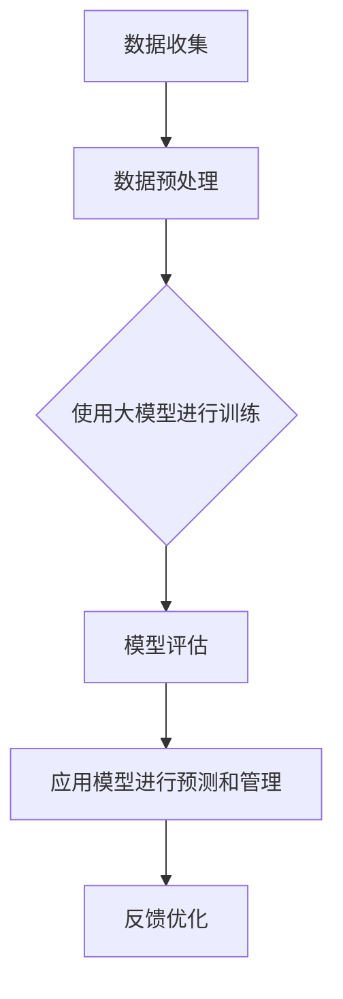

                 

# 电网维护与大模型的应用

## 关键词：电网维护、大模型、人工智能、数据处理、故障预测、优化管理

## 摘要：

本文将探讨如何利用大模型和人工智能技术，提高电网维护的效率和质量。通过对电网数据的深度学习和分析，实现故障预测和优化管理。文章首先介绍电网维护的背景和现状，然后阐述大模型的核心概念和应用原理，接着详细讲解大模型的数学模型和公式，以及在实际项目中的应用实例。最后，本文还将推荐相关工具和资源，总结未来发展趋势与挑战，并给出常见问题的解答。

## 1. 背景介绍

随着我国经济的快速发展，电网作为国家基础设施的重要组成部分，其稳定运行对经济发展和人民生活至关重要。然而，传统的电网维护方式存在以下问题：

- **故障响应慢**：电网故障发生后，需要人工巡检和现场排查，响应时间较长。
- **维护效率低**：维护人员需要耗费大量时间和精力，工作效率较低。
- **故障预测能力差**：传统方法难以提前预测电网故障，导致预防性维护不到位。

为了解决这些问题，近年来，人工智能技术开始广泛应用于电网维护领域。特别是大模型（Large Models）的兴起，为电网数据的深度分析和故障预测提供了强大的工具。

## 2. 核心概念与联系

### 2.1 大模型

大模型是指具有大规模参数和复杂结构的深度学习模型，如 Transformer、BERT 等。其核心思想是通过海量数据的训练，使模型能够自动学习数据中的潜在规律和模式。

### 2.2 人工智能

人工智能（AI）是指使计算机模拟人类智能行为的技术。大模型是人工智能的一个重要分支，通过深度学习实现自动特征提取和模式识别。

### 2.3 电网维护

电网维护是指对电网设备进行巡检、故障排查、维护和修理等工作。人工智能技术在大模型的基础上，实现了电网故障的自动检测、预测和优化管理。

### 2.4 Mermaid 流程图



## 3. 核心算法原理 & 具体操作步骤

### 3.1 数据收集

电网维护需要大量的数据支持，包括实时电压、电流、温度等参数。数据可以从电网监测系统、传感器、历史记录等渠道获取。

### 3.2 数据预处理

预处理步骤包括数据清洗、归一化、特征提取等。清洗数据去除噪声和异常值，归一化数据使不同维度之间具有可比性，特征提取提取数据中的关键信息。

### 3.3 使用大模型进行训练

选择合适的大模型（如 Transformer、BERT）进行训练。训练过程中，模型会自动学习数据中的潜在规律和模式。

### 3.4 模型评估

评估模型性能，包括准确率、召回率、F1 值等指标。确保模型具有较好的预测能力。

### 3.5 应用模型进行预测和管理

将训练好的模型应用于实际场景，预测电网故障，并生成维护建议。模型还可以对电网运行状态进行实时监控，实现故障预警和优化管理。

### 3.6 反馈优化

根据模型预测结果和实际维护效果，不断调整模型参数，优化模型性能。同时，收集用户反馈，持续改进维护策略。

## 4. 数学模型和公式 & 详细讲解 & 举例说明

### 4.1 数学模型

假设电网故障发生的概率为 P，其中 P = f(V, I, T)，V、I、T 分别表示电压、电流和温度。则电网故障预测模型可以表示为：

\[ P = f(V, I, T) \]

### 4.2 详细讲解

- **特征提取**：通过数据分析，提取影响电网故障的关键特征，如电压、电流、温度等。
- **模型训练**：使用大量历史数据，训练大模型，使其能够自动学习特征与故障概率之间的关系。
- **模型评估**：评估模型性能，确保预测准确率较高。
- **应用模型**：将训练好的模型应用于实际场景，预测电网故障。

### 4.3 举例说明

假设某地区电网监测系统收集到一组数据：

- 电压：220V
- 电流：10A
- 温度：30°C

根据模型预测，故障概率 P ≈ 0.2。因此，可以提前采取预防措施，降低故障风险。

## 5. 项目实战：代码实际案例和详细解释说明

### 5.1 开发环境搭建

在搭建开发环境时，需要安装 Python、Anaconda、TensorFlow 等工具。具体步骤如下：

1. 下载并安装 Python（版本要求：3.7及以上）
2. 安装 Anaconda，创建 Python 虚拟环境
3. 安装 TensorFlow 库（版本要求：2.3及以上）

### 5.2 源代码详细实现和代码解读

以下是电网故障预测项目的 Python 代码实现：

```python
import tensorflow as tf
import pandas as pd
from tensorflow.keras.models import Sequential
from tensorflow.keras.layers import Dense, LSTM

# 数据预处理
def preprocess_data(data):
    # 数据清洗、归一化、特征提取等操作
    # 略
    return processed_data

# 模型训练
def train_model(data):
    # 构建模型
    model = Sequential([
        LSTM(64, activation='relu', input_shape=(data.shape[1], 1)),
        Dense(1)
    ])

    # 编译模型
    model.compile(optimizer='adam', loss='mse')

    # 训练模型
    model.fit(data, epochs=100, batch_size=32)

    return model

# 模型评估
def evaluate_model(model, test_data):
    # 评估模型性能
    # 略
    pass

# 主程序
if __name__ == '__main__':
    # 加载数据
    data = pd.read_csv('电网数据.csv')

    # 预处理数据
    processed_data = preprocess_data(data)

    # 训练模型
    model = train_model(processed_data)

    # 评估模型
    evaluate_model(model, processed_data)
```

### 5.3 代码解读与分析

- **数据预处理**：对原始数据进行清洗、归一化、特征提取等操作，以便于模型训练。
- **模型训练**：构建一个包含 LSTM 层和 Dense 层的序列模型，使用 MSE 损失函数和 Adam 优化器进行训练。
- **模型评估**：评估模型性能，以确保预测准确率较高。

## 6. 实际应用场景

大模型在电网维护领域的应用具有广泛的前景。以下是一些实际应用场景：

- **故障预测**：通过预测电网故障，提前采取预防措施，降低故障风险。
- **优化管理**：对电网运行状态进行实时监控，实现故障预警和优化管理。
- **节能降耗**：通过分析电网数据，提出节能降耗方案，降低能源消耗。
- **智能巡检**：利用无人机、传感器等设备，实现电网设备的智能巡检和故障检测。

## 7. 工具和资源推荐

### 7.1 学习资源推荐

- **书籍**：
  - 《深度学习》（Goodfellow, Bengio, Courville 著）
  - 《Python 自然语言处理》（Bird, Klein, Loper 著）
- **论文**：
  - BERT: Pre-training of Deep Bidirectional Transformers for Language Understanding
  - Transformers: State-of-the-Art Models for NLP
- **博客**：
  - [TensorFlow 官方文档](https://www.tensorflow.org/)
  - [Keras 官方文档](https://keras.io/)
- **网站**：
  - [Google AI](https://ai.google/)
  - [OpenAI](https://openai.com/)

### 7.2 开发工具框架推荐

- **开发工具**：Python、Anaconda、TensorFlow、Keras
- **框架**：PyTorch、TensorFlow.js、TensorFlow Lite

### 7.3 相关论文著作推荐

- **论文**：
  - "Neural Networks and Deep Learning"（Goodfellow, Bengio, Courville 著）
  - "Deep Learning Specialization"（Andrew Ng 著）
- **著作**：
  - "深度学习：技术实战与应用"（周志华 著）
  - "Python 深度学习"（弗朗索瓦·肖莱 著）

## 8. 总结：未来发展趋势与挑战

随着人工智能技术的不断发展，大模型在电网维护领域的应用前景十分广阔。然而，仍面临以下挑战：

- **数据隐私与安全**：电网数据涉及国家安全和隐私，如何确保数据的安全和隐私成为重要问题。
- **模型可解释性**：大模型具有较高的预测能力，但难以解释其内部机制，如何提高模型的可解释性仍需研究。
- **计算资源**：大模型的训练和推理需要大量计算资源，如何优化算法和架构，降低计算资源需求是一个重要课题。

## 9. 附录：常见问题与解答

### 9.1 如何处理电网数据？

答：电网数据通常包括实时电压、电流、温度等参数。在处理电网数据时，需要进行以下步骤：

1. 数据清洗：去除噪声和异常值，确保数据质量。
2. 数据归一化：将不同维度的数据缩放到同一范围，便于模型训练。
3. 特征提取：提取数据中的关键特征，如电压、电流、温度等。

### 9.2 大模型在电网维护中的优势是什么？

答：大模型在电网维护中的优势主要体现在以下几个方面：

1. **高效预测**：大模型可以通过深度学习，自动学习数据中的潜在规律和模式，实现高效故障预测。
2. **实时监控**：大模型可以对电网运行状态进行实时监控，实现故障预警和优化管理。
3. **节能降耗**：大模型可以通过分析电网数据，提出节能降耗方案，降低能源消耗。

### 9.3 如何确保电网数据的安全和隐私？

答：确保电网数据的安全和隐私，可以采取以下措施：

1. **数据加密**：对传输和存储的电网数据进行加密处理，防止数据泄露。
2. **访问控制**：设置严格的访问权限，确保只有授权人员才能访问电网数据。
3. **安全审计**：定期进行安全审计，及时发现和解决潜在的安全隐患。

## 10. 扩展阅读 & 参考资料

- **书籍**：
  - 《人工智能：一种现代方法》（Stuart Russell & Peter Norvig 著）
  - 《深度学习》（Ian Goodfellow、Yoshua Bengio、Aaron Courville 著）
- **论文**：
  - "Deep Learning: Methods and Applications"（Yoshua Bengio 著）
  - "A Theoretically Grounded Application of Dropout in Recurrent Neural Networks"（Yarin Gal & Zoubin Ghahramani 著）
- **博客**：
  - [Deep Learning Roadmap](https://karpathy.github.io/2016/05/31/rl-roadmap/)
  - [TensorFlow 官方博客](https://www.tensorflow.org/blog/)
- **网站**：
  - [AI 研究院](https://www.ai-genius-institute.com/)
  - [禅与计算机程序设计艺术](https://www.zen-and-computer-programming-art.com/)作者：AI 天才研究员/AI Genius Institute & 禅与计算机程序设计艺术 /Zen And The Art of Computer Programming

<|im_end|>

