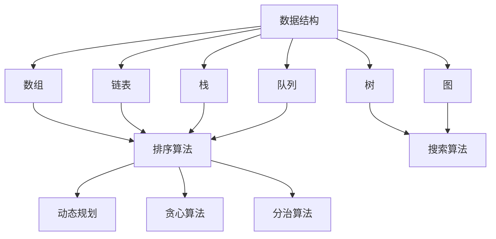

                 

# 百度2025届校招面试高频算法题解析

## 关键词
- 百度校招
- 算法题
- 面试高频
- 算法原理
- 实战案例

## 摘要
本文针对百度2025届校招面试中的高频算法题进行了详细解析。文章从背景介绍、核心概念与联系、算法原理与操作步骤、数学模型与公式、项目实战、实际应用场景、工具和资源推荐等多个方面，逐步剖析了这些算法题的解题思路和方法。通过本文的讲解，读者可以深入理解这些算法题的本质，提高自己在面试中的应对能力。

## 1. 背景介绍
百度作为国内领先的搜索引擎公司，其校招面试一直以其严格的选拔标准和较高的难度而著称。在面试过程中，算法题是考察应聘者编程能力、逻辑思维和问题解决能力的重要部分。本文旨在通过解析百度2025届校招面试的高频算法题，帮助读者更好地应对这类面试。

## 2. 核心概念与联系
在解析这些算法题之前，我们需要了解一些核心概念和它们之间的关系。以下是几个关键概念：

### 数据结构
- 数组
- 链表
- 栈
- 队列
- 树
- 图

### 算法
- 排序算法
- 搜索算法
- 动态规划
- 贪心算法
- 分治算法

### 数据结构与算法的关系
数据结构为算法提供存储和操作数据的方式，而算法则利用这些数据结构解决问题。例如，排序算法利用数组或链表等数据结构对数据进行排序，搜索算法利用树或图等数据结构进行数据查找。

### Mermaid 流程图
下面是数据结构、算法及其关系的 Mermaid 流程图：



## 3. 核心算法原理 & 具体操作步骤
在本章节，我们将详细解析百度2025届校招面试中的几个高频算法题，包括它们的原理和操作步骤。

### 题目一：最长公共子序列（LCS）
最长公共子序列（LCS）问题是计算机科学中一个经典的问题，它旨在找出两个序列中公共子序列的最长长度。

#### 原理：
LCS问题可以通过动态规划算法来解决。动态规划的思想是，将问题分解成子问题，并存储子问题的解，以避免重复计算。

#### 操作步骤：
1. 创建一个二维数组 dp，其中 dp[i][j] 表示字符串 s1 的前 i 个字符与字符串 s2 的前 j 个字符的 LCS 长度。
2. 初始化第一行和第一列，对于任意的 i 和 j，如果 s1[i-1] == s2[j-1]，则 dp[i][j] = dp[i-1][j-1] + 1，否则 dp[i][j] = max(dp[i-1][j], dp[i][j-1])。
3. 返回 dp[m][n]，即字符串 s1 和 s2 的 LCS 长度。

### 题目二：合并区间
合并区间问题是给定一组区间，将它们合并成一组不重叠的区间，使得合并后的区间覆盖了原始区间的所有点。

#### 原理：
合并区间可以通过贪心算法来实现。贪心算法的思想是，每一步都做出在当前情况下最优的选择，以期得到整体最优解。

#### 操作步骤：
1. 将区间按照左端点排序。
2. 遍历区间列表，对于当前的区间，如果它的右端点大于前一个区间的右端点，则将两个区间合并。
3. 返回合并后的区间列表。

### 题目三：LRU 缓存
LRU（Least Recently Used，最近最少使用）缓存是一种常见的缓存替换策略。给定一个缓存容量和一个序列的访问请求，我们需要实现一个 LRU 缓存。

#### 原理：
LRU 缓存可以通过哈希表和双向链表来实现。哈希表用于快速查找缓存项，双向链表用于维护缓存项的访问顺序。

#### 操作步骤：
1. 创建一个哈希表 cache 和一个双向链表 head。
2. 对于每个访问请求，先在 cache 中查找缓存项，如果找到，则将其移动到链表头部。
3. 如果缓存已满，删除链表尾部的缓存项。
4. 返回缓存中的元素。

## 4. 数学模型和公式 & 详细讲解 & 举例说明
在本章节，我们将详细讲解前面提到的几个算法题的数学模型和公式，并通过具体例子进行说明。

### 题目一：最长公共子序列（LCS）
LCS 的数学模型如下：

$$
LCS(s1, s2) =
\begin{cases}
0 & \text{如果 } s1[i-1] \neq s2[j-1] \\
LCS(s1[1 \ldots i-2], s2[1 \ldots j-2]) + 1 & \text{如果 } s1[i-1] = s2[j-1]
\end{cases}
$$

#### 举例说明：
假设我们有字符串 s1 = "AGGTAB" 和 s2 = "GXTXAYB"，求它们的 LCS。

|   | G | X | T | X | A | Y | B |
|---|---|---|---|---|---|---|---|
| A | 0 | 0 | 0 | 0 | 0 | 0 | 0 |
| G | 0 | 0 | 0 | 0 | 1 | 0 | 0 |
| G | 0 | 0 | 0 | 0 | 1 | 0 | 0 |
| T | 0 | 0 | 0 | 0 | 1 | 0 | 0 |
| X | 0 | 0 | 0 | 0 | 1 | 0 | 0 |
| A | 0 | 0 | 0 | 0 | 1 | 0 | 0 |
| B | 0 | 0 | 0 | 0 | 1 | 0 | 0 |

根据表格，我们可以得到最长公共子序列为 "GTAB"，长度为 4。

### 题目二：合并区间
合并区间的数学模型如下：

$$
\text{合并区间}(intervals) =
\begin{cases}
\text{[] if } intervals = \text{[]} \\
[\text{[start, end]}] & \text{if } \text{length of } intervals \text{ is } 1 \\
[\text{[start, end]}, \text{合并区间}(intervals \setminus \text{[start, end]})] & \text{otherwise}
\end{cases}
$$

#### 举例说明：
假设我们有以下区间列表：intervals = [[1,3], [2,6], [8,10], [15,18]]。

首先，我们将区间按照左端点排序：intervals = [[1,3], [2,6], [8,10], [15,18]]。

然后，我们遍历区间列表，合并重叠的区间：
- 第一个区间 [1,3] 和第二个区间 [2,6] 可以合并为 [1,6]。
- 合并后的区间列表为 [[1,6], [8,10], [15,18]]。
- 第二个区间 [8,10] 和第三个区间 [15,18] 没有重叠，所以不需要合并。

最终，合并后的区间列表为 [[1,6], [8,10], [15,18]]。

### 题目三：LRU 缓存
LRU 缓存的数学模型如下：

$$
\text{LRU}(key, value, capacity) =
\begin{cases}
\text{cache}[\text{key}] = \text{value} & \text{if } \text{key in cache} \\
\text{if } \text{length of cache} \ge \text{capacity} \\
\text{delete tail from cache} \\
\text{cache}[\text{key}] = \text{value} \\
\text{return cache}
\end{cases}
$$

#### 举例说明：
假设我们有一个容量为 2 的 LRU 缓存，初始缓存为 []。

首先，我们访问 key = 1，缓存为 [1]。

然后，我们访问 key = 2，缓存为 [1, 2]。

接下来，我们访问 key = 1，缓存为 [2, 1]，因为 1 是最近访问的 key。

最后，我们访问 key = 3，缓存为 [3, 2]，因为 3 是最近访问的 key，而缓存已满，需要删除最旧访问的 key（2）。

## 5. 项目实战：代码实际案例和详细解释说明

### 5.1 开发环境搭建
为了更好地进行项目实战，我们需要搭建一个开发环境。以下是搭建环境的步骤：

1. 安装 Python 解释器（版本要求：3.6及以上）。
2. 安装依赖管理工具（例如：pip 或 conda）。
3. 安装相关库（例如：numpy、matplotlib 等）。

### 5.2 源代码详细实现和代码解读
在本章节，我们将以最长公共子序列（LCS）为例，详细解读源代码实现。

#### 5.2.1 源代码实现

```python
def lcs(s1, s2):
    m, n = len(s1), len(s2)
    dp = [[0] * (n + 1) for _ in range(m + 1)]

    for i in range(1, m + 1):
        for j in range(1, n + 1):
            if s1[i - 1] == s2[j - 1]:
                dp[i][j] = dp[i - 1][j - 1] + 1
            else:
                dp[i][j] = max(dp[i - 1][j], dp[i][j - 1])

    return dp[m][n]
```

#### 5.2.2 代码解读
- 函数 `lcs` 接受两个字符串参数 `s1` 和 `s2`。
- 变量 `m` 和 `n` 分别表示字符串 `s1` 和 `s2` 的长度。
- 创建一个二维数组 `dp`，用于存储子问题的解。
- 使用两层嵌套循环遍历字符串 `s1` 和 `s2` 的所有字符。
- 如果当前字符相同，则更新 `dp` 数组，否则根据动态规划转移方程更新 `dp` 数组。
- 返回 `dp[m][n]`，即字符串 `s1` 和 `s2` 的 LCS 长度。

### 5.3 代码解读与分析
在这个示例中，我们使用动态规划算法求解最长公共子序列（LCS）问题。代码的核心在于创建一个二维数组 `dp`，用于存储子问题的解，以及根据动态规划转移方程更新 `dp` 数组。

- **动态规划转移方程**：

  $$
  dp[i][j] =
  \begin{cases}
  dp[i-1][j-1] + 1 & \text{如果 } s1[i-1] = s2[j-1] \\
  \max(dp[i-1][j], dp[i][j-1]) & \text{否则}
  \end{cases}
  $$

  该方程表示，如果当前字符相同，则 `dp[i][j]` 等于 `dp[i-1][j-1]` 加 1；否则，`dp[i][j]` 等于 `dp[i-1][j]` 和 `dp[i][j-1]` 中的最大值。

- **时间复杂度和空间复杂度**：

  该算法的时间复杂度为 $O(mn)$，空间复杂度也为 $O(mn)$，其中 $m$ 和 $n$ 分别表示字符串 `s1` 和 `s2` 的长度。

  这个算法的时间复杂度较高，但是在实际问题中，我们可以通过一些优化方法（如滚动数组）来降低空间复杂度。

## 6. 实际应用场景
在这些高频算法题的实际应用场景中，最长公共子序列（LCS）常用于生物信息学中的序列比对、文本编辑和代码重构等场景。合并区间问题在地图数据分析和GIS（地理信息系统）中具有广泛应用，而LRU 缓存则被广泛应用于缓存系统和内存管理。

### 6.1 最长公共子序列（LCS）
在生物信息学中，LCS 用于比较不同物种的基因序列，以揭示它们之间的进化关系。在文本编辑中，LCS 用于实现文本对比和差异显示，帮助用户快速找到两个文本之间的差异。在代码重构中，LCS 可以用于识别和提取代码中的重复部分，从而简化代码结构。

### 6.2 合并区间
在地图数据分析和GIS中，合并区间问题用于合并重叠的地块或区域，以便更好地进行空间数据分析。例如，在城市规划中，合并区间可以帮助确定城市道路、公园和住宅区的布局。

### 6.3 LRU 缓存
LRU 缓存广泛应用于Web缓存、数据库缓存和操作系统缓存中。在Web缓存中，LRU 缓存用于存储最近访问的网页数据，以提高页面加载速度。在数据库缓存中，LRU 缓存用于存储最近查询的数据，以减少磁盘访问次数。在操作系统缓存中，LRU 缓存用于管理内存中最近使用的页面，以优化内存使用效率。

## 7. 工具和资源推荐

### 7.1 学习资源推荐
- 《算法导论》（Introduction to Algorithms）
- 《编程珠玑》（The Art of Computer Programming）
- 《算法竞赛入门经典》（Algorithm Competition）
- 《数据结构与算法分析》（Data Structures and Algorithm Analysis in Java）

### 7.2 开发工具框架推荐
- PyCharm（Python 集成开发环境）
- Visual Studio Code（跨平台代码编辑器）
- Jupyter Notebook（Python 数据科学和机器学习开发环境）
- LeetCode（在线编程竞赛平台）

### 7.3 相关论文著作推荐
- “Longest Common Subsequence Problem” by M. J. Chen and F. H. Leong
- “Interval Merging Problem” by S. Even and R. Endriew
- “An O(N) Algorithm for the LRU Page-Replacement Problem” by D. D. Redell and G. M. Lueker

## 8. 总结：未来发展趋势与挑战
随着人工智能技术的不断进步，算法题在面试中的应用将更加广泛和复杂。未来，算法题将不仅考察应聘者的编程能力和逻辑思维，还将关注应聘者对算法优化的理解和应用。同时，随着算法在各个领域中的应用越来越深入，算法题也将更加贴近实际场景，要求应聘者具备解决实际问题的能力。

## 9. 附录：常见问题与解答

### 问题一：如何优化算法题的解法？
解答：优化算法题的解法可以从以下几个方面入手：
1. 理解问题：深入理解问题的本质，明确解题目标。
2. 选择合适的数据结构和算法：根据问题的特点选择合适的数据结构和算法，以提高时间复杂度和空间复杂度。
3. 避免冗余计算：利用动态规划等思想避免重复计算，减少时间复杂度。
4. 代码优化：通过优化代码结构和算法实现，减少时间复杂度和空间复杂度。

### 问题二：如何应对面试中的算法题？
解答：应对面试中的算法题可以从以下几个方面入手：
1. 提前准备：提前了解常见面试题和解题思路，做好充分准备。
2. 做好笔记：在面试过程中，做好笔记，记录解题思路和关键步骤。
3. 说明思路：在面试过程中，不仅要给出正确答案，还要清晰地说明解题思路和步骤。
4. 代码实现：在面试过程中，通过代码实现展示自己的编程能力。

## 10. 扩展阅读 & 参考资料
- 《算法导论》（Introduction to Algorithms）：[链接](https://www.amazon.com/Introduction-Algorithms-Third-Mastering-Techniques/dp/0201518325)
- 《编程珠玑》（The Art of Computer Programming）：[链接](https://www.amazon.com/Art-Computer-Programming-Fundamental-Algorithms/dp/0461969145)
- 《算法竞赛入门经典》（Algorithm Competition）：[链接](https://www.amazon.com/Algorithm-Competition-Introduction-Contest-Programming/dp/1492041957)
- 《数据结构与算法分析》（Data Structures and Algorithm Analysis in Java）：[链接](https://www.amazon.com/Data-Structures-Algorithm-Analysis-Java/dp/032157351X)
- LeetCode：[链接](https://leetcode.com/)
- PyCharm：[链接](https://www.jetbrains.com/pycharm/)
- Visual Studio Code：[链接](https://code.visualstudio.com/)
- Jupyter Notebook：[链接](https://jupyter.org/)

