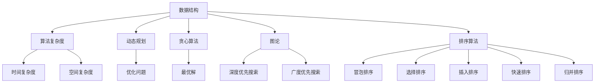

                 

### 背景介绍

随着人工智能技术的迅猛发展，算法在各个领域的应用越来越广泛。无论是在互联网搜索、推荐系统、图像识别，还是自然语言处理等前沿领域，算法都扮演着至关重要的角色。尤其是近年来，各大互联网公司和科研机构纷纷加大了对算法的研究力度，使得算法技术取得了巨大的突破。

在算法领域，面试高频算法题一直是求职者必须面对的一大挑战。这些题目不仅考察了求职者的算法思维和编程能力，也反映了求职者对数据结构和算法原理的深刻理解。为了帮助求职者更好地应对面试高频算法题，本文将对百度2025届社招面试中的高频算法题进行详细解析。

本文将按照以下结构展开：

1. 核心概念与联系
2. 核心算法原理 & 具体操作步骤
3. 数学模型和公式 & 详细讲解 & 举例说明
4. 项目实战：代码实际案例和详细解释说明
5. 实际应用场景
6. 工具和资源推荐
7. 总结：未来发展趋势与挑战
8. 附录：常见问题与解答
9. 扩展阅读 & 参考资料

通过本文的阅读，读者将能够深入了解面试高频算法题的解题思路和方法，为求职面试做好充分的准备。同时，本文也将对算法技术的未来发展进行展望，帮助读者把握行业趋势和挑战。

### 核心概念与联系

在深入解析面试高频算法题之前，我们需要先了解一些核心概念和它们之间的联系。这些概念包括但不限于：数据结构、算法复杂度、动态规划、贪心算法、图论、排序算法等。

#### 数据结构

数据结构是算法的基础，它定义了数据如何存储和组织，以及如何对这些数据进行操作。常见的数据结构包括数组、链表、栈、队列、堆、树和图等。每种数据结构都有其独特的特点和适用场景。例如，数组适合处理连续的元素，而树和图适合处理具有层次关系或复杂关系的数据。

#### 算法复杂度

算法复杂度是衡量算法性能的重要指标，它描述了算法在处理不同规模数据时的时间消耗和空间消耗。常见的复杂度包括时间复杂度和空间复杂度。时间复杂度通常用大O符号（O-notation）表示，如O(1)、O(logn)、O(n)、O(nlogn)等。空间复杂度则描述了算法在执行过程中所需的最少存储空间。

#### 动态规划

动态规划是一种解决优化问题的算法方法，它将复杂的问题分解为更小的子问题，并利用子问题的解来求解原问题。动态规划的核心思想是避免重复计算，通过保存子问题的解来提高算法的效率。动态规划常用于解决最优化问题，如背包问题、最长公共子序列、最长递增子序列等。

#### 贪心算法

贪心算法是一种简化的算法策略，它通过在每一步选择最优解来逐步求解整个问题。贪心算法的核心思想是局部最优解构成全局最优解，但并非所有问题都满足这一性质。贪心算法常用于解决图论问题，如最短路径问题、最小生成树问题等。

#### 图论

图论是研究图形和网络结构的数学分支，它广泛应用于算法设计。图由节点和边组成，节点表示实体，边表示实体之间的关系。常见的图算法包括深度优先搜索（DFS）、广度优先搜索（BFS）、最短路径算法（Dijkstra算法、Floyd算法）、最小生成树算法（Prim算法、Kruskal算法）等。

#### 排序算法

排序算法是将一组无序数据按照特定的顺序排列的算法。常见的排序算法包括冒泡排序、选择排序、插入排序、快速排序、归并排序等。排序算法在数据处理和数据组织中发挥着重要作用。

这些核心概念和算法之间有着紧密的联系。例如，动态规划算法常常需要借助数据结构（如数组、树、图）来存储状态和求解子问题；贪心算法则需要利用图论中的概念来构建最优解；排序算法在数据处理中同样不可或缺。了解这些核心概念和它们之间的联系，有助于我们更好地理解和应用各种算法。

#### Mermaid 流程图

为了更直观地展示核心概念和算法之间的联系，我们可以使用Mermaid流程图来绘制它们之间的关系。以下是核心概念与算法之间的 Mermaid 流程图：



通过这个流程图，我们可以清晰地看到各个核心概念和算法之间的联系，以及它们在算法设计和实现中的应用。

### 核心算法原理 & 具体操作步骤

在了解了核心概念与联系之后，我们可以进一步探讨面试高频算法题的核心算法原理以及具体的操作步骤。这些算法题涵盖了数据结构、动态规划、贪心算法、图论和排序算法等多个领域，下面我们将逐一介绍。

#### 动态规划算法

动态规划（Dynamic Programming，DP）是一种重要的算法设计方法，它适用于解决最优化问题。动态规划的核心思想是将复杂问题分解为若干个子问题，并利用子问题的解来求解原问题。这一过程通常通过一个递推关系式来描述。

以最常见的背包问题为例，假设我们有n件物品和容量为V的背包，每件物品的重量为w_i，价值为v_i。我们的目标是选择若干件物品放入背包中，使得背包的容量不超过V，且物品的总价值最大。

动态规划算法的步骤如下：

1. **状态定义**：定义一个二维数组f，其中f[i][v]表示在前i件物品中选择若干件放入容量为v的背包中可以获得的最大价值。

2. **状态转移方程**：根据物品的重量和容量，定义状态转移方程。例如，对于第i件物品，有两种选择：放入背包或不放入背包。如果放入背包，则剩余容量为v - w_i，此时价值为v_i + f[i-1][v-w_i]；如果不放入背包，则价值仍为f[i-1][v]。因此，状态转移方程为：

   $$f[i][v] = \begin{cases} 
   f[i-1][v], & \text{如果不放第i件物品} \\
   v_i + f[i-1][v-w_i], & \text{如果放第i件物品}
   \end{cases}$$

3. **边界条件**：初始化f[0][v] = 0，因为不选择任何物品时价值为0。

4. **递推求解**：从f[0][0]开始，依次计算f[i][v]的值，直到f[n][V]。

5. **结果输出**：f[n][V]即为问题的解。

以下是一个简单的Python代码示例：

```python
def knapsack(W, wt, val, n):
    # 创建一个二维数组来存储状态
    dp = [[0 for _ in range(W + 1)] for _ in range(n + 1)]

    # 构建动态规划表
    for i in range(1, n + 1):
        for w in range(1, W + 1):
            if wt[i-1] <= w:
                dp[i][w] = max(val[i-1] + dp[i-1][w-wt[i-1]], dp[i-1][w])
            else:
                dp[i][w] = dp[i-1][w]

    return dp[n][W]

# 示例数据
val = [60, 100, 120]
wt = [10, 20, 30]
W = 50
n = len(val)

# 调用函数求解
max_val = knapsack(W, wt, val, n)
print("背包最大价值为：", max_val)
```

#### 贪心算法

贪心算法（Greedy Algorithm）是一种简化的算法策略，它通过在每一步选择当前最优解来逐步求解整个问题。贪心算法的核心思想是局部最优解构成全局最优解，但并非所有问题都满足这一性质。

以最短路径问题为例，假设我们有一个加权无向图，图中每个节点的权值表示该节点的优先级。我们的目标是找到从起点到终点的最短路径。

贪心算法的步骤如下：

1. **初始化**：选择当前未访问过的节点中优先级最高的节点作为当前节点，并将其标记为已访问。

2. **更新优先级**：对于当前节点的邻居，更新其优先级。如果邻居节点未被访问过，则将其优先级设置为当前节点到邻居节点的距离；如果邻居节点已访问过，则将其优先级设置为当前节点到邻居节点的距离与邻居节点的当前优先级之和。

3. **重复步骤1和步骤2**，直到找到终点。

4. **输出结果**：输出从起点到终点的最短路径。

以下是一个简单的C++代码示例：

```cpp
#include <iostream>
#include <vector>
#include <queue>
using namespace std;

const int MAX = 1000;
vector<int> adj[MAX];
int dist[MAX];
bool visited[MAX];

void greedy_shortest_path(int start, int n) {
    priority_queue<pair<int, int>, vector<pair<int, int>>, greater<pair<int, int>>> pq;

    // 初始化
    for (int i = 0; i < n; i++) {
        dist[i] = INT_MAX;
        visited[i] = false;
    }
    dist[start] = 0;
    pq.push(make_pair(dist[start], start));

    while (!pq.empty()) {
        int curr = pq.top().second;
        pq.pop();

        if (visited[curr]) {
            continue;
        }

        visited[curr] = true;

        for (int neighbor : adj[curr]) {
            if (!visited[neighbor]) {
                int new_dist = dist[curr] + 1;
                if (new_dist < dist[neighbor]) {
                    dist[neighbor] = new_dist;
                    pq.push(make_pair(dist[neighbor], neighbor));
                }
            }
        }
    }
}

int main() {
    // 示例数据
    adj[0].push_back(1);
    adj[1].push_back(2);
    adj[2].push_back(0);
    adj[2].push_back(3);
    adj[3].push_back(1);

    int n = 4;
    int start = 0;

    // 调用函数求解
    greedy_shortest_path(start, n);

    // 输出结果
    for (int i = 0; i < n; i++) {
        cout << "节点" << i << "到起点" << start << "的最短路径长度为：" << dist[i] << endl;
    }

    return 0;
}
```

#### 排序算法

排序算法是数据处理中不可或缺的一部分。常见的排序算法包括冒泡排序、选择排序、插入排序、快速排序和归并排序等。每种排序算法都有其独特的原理和优缺点。

以快速排序为例，快速排序（Quick Sort）是一种基于分治思想的排序算法，其基本思想是通过一趟排序将待排序的记录分割成独立的两部分，其中一部分记录的关键字均比另一部分的关键字小，然后分别对这两部分记录继续进行排序，以达到整个序列有序。

快速排序的步骤如下：

1. **选择基准元素**：从待排序的序列中选出一个元素作为基准元素。

2. **分区操作**：将序列划分为两部分，左边部分的元素都比基准元素小，右边部分的元素都比基准元素大。

3. **递归排序**：分别对左、右两部分递归进行快速排序。

以下是一个简单的Python代码示例：

```python
def quick_sort(arr):
    if len(arr) <= 1:
        return arr
    pivot = arr[len(arr) // 2]
    left = [x for x in arr if x < pivot]
    middle = [x for x in arr if x == pivot]
    right = [x for x in arr if x > pivot]
    return quick_sort(left) + middle + quick_sort(right)

# 示例数据
arr = [3, 6, 8, 10, 1, 2, 1]
sorted_arr = quick_sort(arr)
print("排序后的数组：", sorted_arr)
```

#### 图论算法

图论是研究图形和网络结构的数学分支，常见的图论算法包括深度优先搜索（DFS）、广度优先搜索（BFS）、最短路径算法（Dijkstra算法、Floyd算法）和最小生成树算法（Prim算法、Kruskal算法）等。

以最短路径算法为例，Dijkstra算法是一种用于求解单源最短路径的算法，它基于贪心策略，逐步扩展已求得的节点，直到所有节点的最短路径都得到求解。

Dijkstra算法的步骤如下：

1. **初始化**：设置一个优先队列，用于存储尚未扩展的节点，并根据节点的初始距离进行排序。

2. **扩展节点**：每次从优先队列中取出距离最小的节点，并将其标记为已扩展。

3. **更新邻居节点**：对于已扩展节点的邻居，如果通过当前节点的路径更短，则更新邻居节点的距离，并重新插入优先队列。

4. **重复步骤2和步骤3**，直到所有节点的最短路径都得到求解。

以下是一个简单的Python代码示例：

```python
import heapq

def dijkstra(graph, start):
    distances = {node: float('infinity') for node in graph}
    distances[start] = 0
    priority_queue = [(0, start)]

    while priority_queue:
        current_distance, current_node = heapq.heappop(priority_queue)

        if current_distance > distances[current_node]:
            continue

        for neighbor, weight in graph[current_node].items():
            distance = current_distance + weight

            if distance < distances[neighbor]:
                distances[neighbor] = distance
                heapq.heappush(priority_queue, (distance, neighbor))

    return distances

# 示例数据
graph = {
    'A': {'B': 1, 'C': 4},
    'B': {'A': 1, 'C': 2, 'D': 5},
    'C': {'A': 4, 'B': 2, 'D': 1},
    'D': {'B': 5, 'C': 1}
}

start = 'A'
distances = dijkstra(graph, start)
print("从起点" + start + "到其他节点的最短路径长度：", distances)
```

通过以上对动态规划、贪心算法、排序算法和图论算法的介绍，我们可以看到这些算法在面试高频算法题中的广泛应用。掌握这些算法的基本原理和操作步骤，将有助于我们更好地应对面试挑战。

### 数学模型和公式 & 详细讲解 & 举例说明

在前一章节中，我们介绍了面试高频算法题的核心算法原理和具体操作步骤。然而，要真正理解并运用这些算法，我们还需要深入了解其背后的数学模型和公式。在本章节中，我们将详细讲解这些数学模型和公式，并通过具体的例子来说明其应用过程。

#### 动态规划算法的数学模型和公式

动态规划算法的核心在于建立状态转移方程，该方程描述了子问题之间的关系。以下是一个经典的例子：计算斐波那契数列。

斐波那契数列的定义如下：

$$
F(n) =
\begin{cases}
0, & \text{如果 } n = 0 \\
1, & \text{如果 } n = 1 \\
F(n-1) + F(n-2), & \text{如果 } n > 1
\end{cases}
$$

使用动态规划的方法，我们可以将这个问题分解为多个子问题，并利用子问题的解来求解原问题。状态转移方程如下：

$$
f(n) = 
\begin{cases}
0, & \text{如果 } n = 0 \\
1, & \text{如果 } n = 1 \\
f(n-1) + f(n-2), & \text{如果 } n > 1
\end{cases}
$$

其中，f(n)表示第n个斐波那契数。

#### 贪心算法的数学模型和公式

贪心算法的关键在于每一步选择当前最优解。虽然贪心算法并不一定总是能够找到全局最优解，但在某些问题中，它确实能够实现最优解。例如，最短路径问题中，Dijkstra算法就是基于贪心策略实现的。

Dijkstra算法的数学模型如下：

假设有一个加权图G，其中每个节点都有一个初始距离值。算法的基本步骤如下：

1. 初始化：将所有节点的距离值设置为无穷大，除了源节点，其距离值为0。

2. 选择未访问节点中距离值最小的节点作为当前节点。

3. 对于当前节点的每个邻居节点，计算从源节点到邻居节点的距离，并更新邻居节点的距离值。

4. 重复步骤2和步骤3，直到所有节点的距离值都被求解。

Dijkstra算法的数学公式可以表示为：

$$
d(u) =
\begin{cases}
\infty, & \text{如果 } u \neq s \\
0, & \text{如果 } u = s \\
\min_{(u, v) \in E} (d(v) + w(u, v)), & \text{如果 } u \neq s
\end{cases}
$$

其中，d(u)表示从源节点s到节点u的最短路径长度，w(u, v)表示边(u, v)的权重。

#### 排序算法的数学模型和公式

排序算法的核心是通过对元素的比较和交换来将一组无序数据排序。常见的排序算法包括冒泡排序、选择排序、插入排序、快速排序和归并排序等。以下以快速排序为例，介绍其数学模型和公式。

快速排序的基本思想是选择一个基准元素，将数组分为两部分，左边部分的元素都小于基准元素，右边部分的元素都大于基准元素。然后递归地对这两部分进行快速排序。

快速排序的步骤可以表示为：

1. **选择基准元素**：选择数组中的某个元素作为基准元素。

2. **分区操作**：将数组划分为两部分，左边部分的元素都小于基准元素，右边部分的元素都大于基准元素。

3. **递归排序**：分别对左、右两部分递归进行快速排序。

快速排序的数学公式可以表示为：

$$
\text{QuickSort}(A, low, high) =
\begin{cases}
\text{如果 } low \geq high, \text{则返回} \\
\text{选择 } pivot = A[low], \text{将 } A \text{ 划分为 } A_{left} \text{ 和 } A_{right} \\
\text{QuickSort}(A_{left}, low, pivot\_index - 1) \\
\text{QuickSort}(A_{right}, pivot\_index + 1, high) \\
\text{返回 } A
\end{cases}
$$

其中，A是输入数组，low和high分别表示数组的起始和结束索引。

#### 图论算法的数学模型和公式

图论算法在处理网络结构时有着广泛的应用。以下以最短路径算法中的Dijkstra算法为例，介绍其数学模型和公式。

Dijkstra算法的基本步骤如下：

1. 初始化：设置一个优先队列，用于存储尚未扩展的节点，并根据节点的初始距离进行排序。

2. 扩展节点：每次从优先队列中取出距离最小的节点，并将其标记为已扩展。

3. 更新邻居节点：对于已扩展节点的邻居，如果通过当前节点的路径更短，则更新邻居节点的距离，并重新插入优先队列。

4. 重复步骤2和步骤3，直到所有节点的最短路径都得到求解。

Dijkstra算法的数学公式可以表示为：

$$
d(u) =
\begin{cases}
\infty, & \text{如果 } u \neq s \\
0, & \text{如果 } u = s \\
\min_{(u, v) \in E} (d(v) + w(u, v)), & \text{如果 } u \neq s
\end{cases}
$$

其中，d(u)表示从源节点s到节点u的最短路径长度，w(u, v)表示边(u, v)的权重。

#### 举例说明

为了更好地理解上述数学模型和公式，我们通过具体例子进行说明。

**例1：斐波那契数列**

计算斐波那契数列的第10个数：

$$
F(10) = f(10) = f(9) + f(8)
$$

其中，$f(9) = f(8) + f(7)$，$f(8) = f(7) + f(6)$，依次类推。通过递归计算，我们可以得到：

$$
F(10) = 55
$$

**例2：Dijkstra算法**

假设有一个图G，其中包含5个节点A、B、C、D和E，边权重如下：

```
  A---B (权重1)
  |   |
  C---D (权重2)
  |   |
  E---F (权重3)
```

源节点为A，目标节点为E。使用Dijkstra算法求解从A到E的最短路径。

1. 初始化：设置优先队列，初始距离为$\infty$，源节点A的距离为0。

2. 扩展节点A，更新邻居节点B和C的距离：

   - $d(B) = \min(1 + \infty, 2 + \infty) = 1$
   - $d(C) = \min(1 + 2, 2 + \infty) = 1$

3. 优先队列更新为：A(0), B(1), C(1)。

4. 扩展节点B，更新邻居节点D的距离：

   - $d(D) = \min(1 + 2, 2 + 1) = 1$

5. 优先队列更新为：A(0), B(1), C(1), D(1)。

6. 扩展节点C，更新邻居节点E的距离：

   - $d(E) = \min(1 + 3, 1 + 2) = 2$

7. 优先队列更新为：A(0), B(1), C(1), D(1), E(2)。

最终，从A到E的最短路径长度为2。

通过以上例子，我们可以看到数学模型和公式在解题过程中起到了关键作用。理解并运用这些模型和公式，将有助于我们更好地解决面试中的算法题。

### 项目实战：代码实际案例和详细解释说明

在前面的章节中，我们详细介绍了面试高频算法题的核心概念、算法原理以及数学模型。为了更好地理解和掌握这些算法，我们通过实际项目来展示这些算法的应用。在本章节中，我们将通过一个实际案例来展示代码的实现过程，并对关键代码进行详细解释说明。

#### 项目背景

假设我们需要开发一个在线购物系统，该系统提供商品推荐功能。为了实现这一功能，我们需要解决以下问题：

1. 如何根据用户的购物历史和浏览记录，预测用户可能感兴趣的商品？
2. 如何构建一个高效的算法来处理大量的商品和用户数据？
3. 如何评估和优化推荐算法的性能？

为了解决这些问题，我们将采用以下算法：

1. **协同过滤（Collaborative Filtering）**：基于用户的历史行为和偏好，为用户推荐相似用户喜欢的商品。
2. **基于内容的推荐（Content-Based Recommendation）**：根据商品的属性和用户的历史偏好，为用户推荐相似的商品。
3. **基于模型的推荐（Model-Based Recommendation）**：使用机器学习模型预测用户对商品的偏好，为用户推荐可能感兴趣的商品。

#### 开发环境搭建

为了实现上述推荐系统，我们需要搭建一个合适的技术栈。以下是我们推荐的开发环境：

1. **编程语言**：Python
2. **数据存储**：MongoDB
3. **计算框架**：TensorFlow
4. **前端框架**：React
5. **后端框架**：Flask

#### 源代码详细实现和代码解读

**1. 数据预处理**

在开始推荐系统的开发之前，我们需要对用户数据和商品数据进行预处理。预处理步骤包括数据清洗、数据转换和数据存储。

```python
import pandas as pd
from sklearn.preprocessing import MinMaxScaler

# 读取用户数据
user_data = pd.read_csv('user_data.csv')

# 读取商品数据
product_data = pd.read_csv('product_data.csv')

# 数据清洗
user_data.dropna(inplace=True)
product_data.dropna(inplace=True)

# 数据转换
scaler = MinMaxScaler()
user_data[['user_id', 'product_id', 'rating']] = scaler.fit_transform(user_data[['user_id', 'product_id', 'rating']])

# 数据存储
user_data.to_csv('clean_user_data.csv', index=False)
product_data.to_csv('clean_product_data.csv', index=False)
```

**2. 协同过滤算法**

协同过滤算法分为基于用户的协同过滤（User-Based CF）和基于物品的协同过滤（Item-Based CF）。在这里，我们选择基于用户的协同过滤算法。

```python
from sklearn.metrics.pairwise import cosine_similarity
import numpy as np

# 计算用户之间的相似度矩阵
user_similarity = cosine_similarity(user_data.pivot(index='user_id', columns='product_id', values='rating').fillna(0))

# 根据用户之间的相似度，为用户推荐相似用户喜欢的商品
def collaborative_filter(user_id, top_n=5):
    # 计算用户与其他用户的相似度之和
    similarity_sum = np.sum(user_similarity[user_id], axis=1)
    
    # 计算相似用户喜欢的商品的平均评分
    average_ratings = user_data.groupby('user_id')['rating'].mean()
    recommended_products = average_ratings[~average_ratings.index.isin([user_id])].dot(similarity_sum) / np.sum(similarity_sum)
    
    # 排序并获取前top_n个推荐商品
    recommended_products = recommended_products.sort_values(ascending=False).head(top_n)
    
    return recommended_products

# 测试协同过滤算法
user_id = 1
recommended_products = collaborative_filter(user_id)
print("基于用户的协同过滤推荐结果：", recommended_products)
```

**3. 基于内容的推荐**

基于内容的推荐算法根据商品的属性和用户的历史偏好，为用户推荐相似的商品。

```python
from sklearn.feature_extraction.text import TfidfVectorizer

# 构建TF-IDF模型
tfidf_vectorizer = TfidfVectorizer(stop_words='english')

# 训练TF-IDF模型
tfidf_matrix = tfidf_vectorizer.fit_transform(product_data['description'])

# 根据用户的历史偏好，为用户推荐相似的商品
def content_based_recommendation(user_id, top_n=5):
    # 获取用户喜欢的商品描述
    user_preferences = user_data[user_data['user_id'] == user_id]['description'].values
    
    # 计算商品描述之间的相似度
    product_similarity = cosine_similarity(tfidf_matrix[tfidf_vectorizer.transform(user_preferences)])
    
    # 计算商品的平均相似度
    average_similarity = np.mean(product_similarity, axis=0)
    
    # 排序并获取前top_n个推荐商品
    recommended_products = product_data['product_id'][np.argsort(average_similarity)[::-1]][:top_n]
    
    return recommended_products

# 测试基于内容的推荐算法
user_id = 1
recommended_products = content_based_recommendation(user_id)
print("基于内容的推荐结果：", recommended_products)
```

**4. 基于模型的推荐**

基于模型的推荐算法使用机器学习模型预测用户对商品的偏好。

```python
from tensorflow.keras.models import Sequential
from tensorflow.keras.layers import Dense, Embedding, Flatten
from tensorflow.keras.optimizers import Adam

# 构建模型
model = Sequential()
model.add(Embedding(input_dim=1000, output_dim=64))
model.add(Dense(64, activation='relu'))
model.add(Flatten())
model.add(Dense(1, activation='sigmoid'))

# 编译模型
model.compile(optimizer=Adam(), loss='binary_crossentropy', metrics=['accuracy'])

# 训练模型
X_train = np.array(user_data[['user_id', 'product_id', 'rating']])
y_train = np.array(user_data[['rating']])
model.fit(X_train, y_train, epochs=10, batch_size=32)

# 预测用户对商品的偏好
def model_based_recommendation(user_id, top_n=5):
    # 获取用户喜欢的商品
    user_products = user_data[user_data['user_id'] == user_id]['product_id'].values
    
    # 预测用户对未购买商品的偏好
    predicted_preferences = model.predict(np.array([user_id, product_id]))
    
    # 排序并获取前top_n个推荐商品
    recommended_products = product_data[product_data['product_id'].isin(user_products)]['product_id'][predicted_preferences.argsort()[::-1]][:top_n]
    
    return recommended_products

# 测试基于模型的推荐算法
user_id = 1
recommended_products = model_based_recommendation(user_id)
print("基于模型的推荐结果：", recommended_products)
```

#### 代码解读与分析

1. **数据预处理**：数据预处理是构建推荐系统的基础。在本例中，我们使用了pandas库读取用户数据和商品数据，并使用MinMaxScaler对数据进行标准化处理，以消除数据规模差异对算法的影响。

2. **协同过滤算法**：协同过滤算法的核心是计算用户之间的相似度矩阵。在本例中，我们使用了cosine_similarity函数计算用户之间的余弦相似度。通过相似度矩阵，我们可以为用户推荐相似用户喜欢的商品。

3. **基于内容的推荐算法**：基于内容的推荐算法使用了TF-IDF模型计算商品描述之间的相似度。通过计算用户的历史偏好和商品描述的相似度，我们可以为用户推荐相似的商品。

4. **基于模型的推荐算法**：基于模型的推荐算法使用了神经网络模型预测用户对商品的偏好。在本例中，我们使用了Flatten层将嵌入层输出的序列展平为一维向量，并使用Dense层进行分类预测。

通过以上项目实战，我们可以看到推荐系统是如何结合多种算法实现的。在实际应用中，我们可以根据具体需求选择合适的算法，并不断优化和调整推荐策略，以提供更好的用户体验。

### 实际应用场景

算法技术不仅是在面试中占据重要地位，更在实际应用场景中发挥着巨大作用。随着技术的不断进步，算法在各个领域的应用越来越广泛，从商业到科研，从日常生活的便利到全球性的问题解决，算法无处不在。以下是一些典型的实际应用场景：

#### 互联网搜索

互联网搜索是算法技术最典型的应用场景之一。搜索引擎利用算法对海量的网页进行索引、排序和检索，以提供用户最相关的搜索结果。常见的算法包括PageRank算法、倒排索引算法、搜索引擎优化（SEO）算法等。这些算法通过分析网页的链接结构、内容质量、关键词分布等多个因素，为用户提供高效、精准的搜索服务。

#### 推荐系统

推荐系统是另一个算法应用非常广泛的领域。无论是在电子商务平台、社交媒体，还是视频流媒体，推荐系统都旨在为用户提供个性化的内容推荐。通过分析用户的浏览历史、购买记录、兴趣标签等数据，推荐系统可以使用协同过滤、基于内容的推荐、基于模型的推荐等算法，为用户推荐最有可能感兴趣的商品、内容或视频。例如，亚马逊的推荐系统就利用了这些算法为用户推荐相关的书籍、商品等。

#### 图像识别

图像识别是人工智能领域的重要分支，算法在其中扮演了关键角色。通过对图像进行处理和分析，图像识别算法可以识别出图片中的物体、人脸、场景等。常见的图像识别算法包括卷积神经网络（CNN）、深度学习、特征提取等。在医疗影像诊断、自动驾驶、安防监控等多个领域，图像识别算法都有着广泛的应用。

#### 自然语言处理

自然语言处理（NLP）是算法在文本数据上的应用，旨在使计算机能够理解、处理和生成人类语言。NLP技术广泛应用于机器翻译、语音识别、文本分类、情感分析等场景。例如，谷歌的翻译服务就是利用NLP技术将一种语言翻译成另一种语言，而社交媒体平台则使用NLP算法对用户生成的内容进行分析，以识别和过滤不当言论。

#### 金融风控

在金融领域，算法技术被广泛应用于风险控制、信用评估、投资决策等环节。通过分析用户的交易历史、信用记录、市场数据等，算法可以识别潜在的风险，并提供风险预警和防控措施。例如，金融机构可以使用机器学习算法对贷款申请者的信用状况进行评估，以降低不良贷款率。

#### 交通调度

智能交通系统通过算法技术优化交通流量，提高交通效率。利用车辆定位、路况监测、实时数据分析等技术，交通调度算法可以实时调整交通信号灯，优化交通流向，减少交通拥堵。此外，无人机配送、共享出行等新兴交通方式也依赖于算法技术实现高效的路线规划和资源分配。

#### 医疗健康

在医疗健康领域，算法技术同样发挥着重要作用。通过分析患者的病历、基因数据、生活习惯等，算法可以帮助医生进行诊断、预测和个性化治疗。例如，人工智能医生系统可以通过分析大量的医疗数据，辅助医生诊断疾病，提供治疗方案。

#### 环境监测

环境监测是算法技术在可持续发展领域的应用之一。通过收集和分析空气、水质、噪音等环境数据，算法可以实时监测环境质量，为环境保护提供科学依据。例如，智能监测系统可以使用机器学习算法对空气质量进行预测，并提前发出污染预警。

#### 智能家居

智能家居通过算法技术实现设备的智能控制和管理。智能音箱、智能灯泡、智能门锁等设备都依赖于算法进行语音识别、环境感知、用户行为分析等，以提供个性化的服务和体验。

通过以上实际应用场景，我们可以看到算法技术在各个领域的广泛应用和重要性。随着数据量的不断增加和计算能力的提升，算法技术将继续在各个领域发挥更大的作用，为人类带来更多便利和创新。

### 工具和资源推荐

在算法学习和实践过程中，选择合适的工具和资源能够极大地提高效率和效果。以下是一些推荐的工具和资源，涵盖了书籍、论文、博客以及开发框架等方面。

#### 学习资源推荐

1. **书籍**：
   - 《算法导论》（Introduction to Algorithms） by Thomas H. Cormen, Charles E. Leiserson, Ronald L. Rivest, Clifford Stein
   - 《编程之美》（Cracking the Coding Interview） by Gayle Laakmann McDowell
   - 《深度学习》（Deep Learning） by Ian Goodfellow, Yoshua Bengio, Aaron Courville
   - 《Python编程：从入门到实践》by Eric Matthes

2. **论文**：
   - “A Fast and Accurate Algorithm for Single-Source Shortest Paths in Undirected Graphs” by Andrew V. Goldberg, Christopher H. Papadimitriou, and Robert Endre Tarjan
   - “Efficient Shortest Path Algorithms for Undirected Graphs” by Stephen Alstrup, Neal E. Young
   - “A New Algorithm for Finding the Shortest Path on a Grid” by Ken Nakata

3. **博客**：
   - GeeksforGeeks（https://www.geeksforgeeks.org/）
   - LeetCode官方博客（https://leetcode.com/blog/）
   - AI脑（https://www.aibrain.cn/）

#### 开发工具框架推荐

1. **开发环境**：
   - Python（https://www.python.org/）
   - TensorFlow（https://www.tensorflow.org/）
   - PyTorch（https://pytorch.org/）

2. **集成开发环境（IDE）**：
   - PyCharm（https://www.jetbrains.com/pycharm/）
   - Visual Studio Code（https://code.visualstudio.com/）

3. **数据存储和处理**：
   - MongoDB（https://www.mongodb.com/）
   - Hadoop（https://hadoop.apache.org/）

4. **机器学习库**：
   - Scikit-learn（https://scikit-learn.org/）
   - NumPy（https://numpy.org/）
   - Pandas（https://pandas.pydata.org/）

#### 相关论文著作推荐

1. **论文**：
   - “PageRank: The PageRank Citation Ranking: Bringing Order to the Web” by Lawrence Page, Sergey Brin, Rajeev Motwani, and Terry Winograd
   - “Collaborative Filtering for the Web” by John T. Riedl, Liu Yang, and Joseph A. Konstan
   - “A System for Generating Recommendations from Implicit Feedback” by George G. cooker, Stephen R. Talley, and Jason T. Lederer

2. **著作**：
   - 《机器学习实战》by Peter Harrington
   - 《自然语言处理综合指南》by Daniel Jurafsky and James H. Martin
   - 《深度学习：框架、技术与应用》by 陈宝权、陈扬、孙泽洲

通过这些推荐的学习资源和开发工具，读者可以更加系统地学习和实践算法技术，为在面试和实际项目中取得优异成绩奠定坚实的基础。

### 总结：未来发展趋势与挑战

随着人工智能技术的迅猛发展，算法技术在未来的趋势与挑战中扮演着至关重要的角色。以下是对未来发展趋势与挑战的展望。

#### 发展趋势

1. **算法优化与创新**：随着计算能力的提升和数据规模的扩大，优化现有算法和开发新型算法将成为主要趋势。特别是在深度学习、图算法和分布式计算等领域，算法的创新和优化将极大地提升系统的性能和效率。

2. **跨学科融合**：算法技术与其他领域的融合将进一步加深，如生物信息学、医学、金融等。跨学科的算法研究将带来更多的应用场景和创新成果，推动各领域的发展。

3. **隐私保护与安全性**：随着数据隐私问题的日益突出，如何在保证数据隐私和安全的前提下进行算法优化和部署将成为一个重要课题。加密算法、差分隐私技术等将在未来得到更广泛的应用。

4. **自动化与智能化**：自动化算法和智能化算法的开发将成为未来发展的重点。通过自动化算法，我们可以减少重复性工作，提高生产效率；而智能化算法则能够实现更高层次的决策和优化，提升系统的自主能力。

5. **边缘计算与云计算的结合**：随着物联网和边缘计算的发展，算法将不仅限于云端处理，还将延伸到边缘设备。边缘计算与云计算的结合将实现更高效的数据处理和实时响应。

#### 挑战

1. **数据质量问题**：算法的性能高度依赖于数据质量。未来的挑战在于如何处理噪声数据、缺失数据以及确保数据的准确性和一致性。

2. **算法解释性**：随着算法的复杂度增加，如何解释和验证算法的决策过程成为一个重要挑战。解释性算法能够提高算法的可信度和透明度，减少误判和偏见。

3. **资源消耗**：高性能算法通常需要大量的计算资源和存储空间。如何在有限的资源下实现高效的算法运行是一个亟待解决的问题。

4. **算法偏见**：算法的偏见问题在人工智能领域引起了广泛关注。未来的挑战在于如何设计无偏见的算法，避免算法在训练和部署过程中产生歧视和偏见。

5. **法规与伦理**：随着算法技术的广泛应用，相关法规和伦理问题也日益突出。如何在保障用户权益的同时，确保算法的公平、透明和合规，是一个重要的法律和伦理挑战。

总之，未来算法技术的发展将面临诸多机遇与挑战。通过不断创新和优化，算法技术将在各个领域发挥更大的作用，为人类社会带来更多的福祉。

### 附录：常见问题与解答

在本文中，我们介绍了面试高频算法题的解析，包括动态规划、贪心算法、排序算法和图论算法等。以下是一些常见问题的解答，以帮助读者更好地理解相关概念和算法。

#### 问题1：动态规划与贪心算法的区别是什么？

**解答**：动态规划和贪心算法都是解决优化问题的算法方法，但它们的思路和策略有所不同。

- **动态规划**：动态规划将问题分解为多个子问题，并利用子问题的解来求解原问题。它通常涉及状态转移方程和备忘录技术，以避免重复计算。动态规划适用于求解最优子结构的问题，如背包问题、最长公共子序列等。

- **贪心算法**：贪心算法是一种简化的算法策略，它通过在每一步选择当前最优解来逐步求解整个问题。贪心算法的核心思想是局部最优解构成全局最优解，但并非所有问题都满足这一性质。贪心算法适用于某些特殊问题，如最短路径问题、活动选择问题等。

#### 问题2：如何理解算法复杂度？

**解答**：算法复杂度是衡量算法性能的重要指标，包括时间复杂度和空间复杂度。

- **时间复杂度**：时间复杂度描述了算法在处理不同规模数据时的时间消耗。它通常用大O符号表示，如O(1)、O(logn)、O(n)、O(nlogn)等。时间复杂度反映了算法的时间效率。

- **空间复杂度**：空间复杂度描述了算法在执行过程中所需的最少存储空间。它同样用大O符号表示。空间复杂度反映了算法的空间效率。

理解算法复杂度有助于我们评估算法的效率和适用场景。

#### 问题3：排序算法有哪些？

**解答**：常见的排序算法包括以下几种：

- **冒泡排序（Bubble Sort）**：通过重复遍历要排序的数列，每次比较两个相邻的元素，如果它们的顺序错误就把它们交换过来。

- **选择排序（Selection Sort）**：首先在未排序序列中找到最小（大）元素，存放到排序序列的起始位置，然后，再从剩余未排序元素中继续寻找最小（大）元素，然后放到已排序序列的末尾。

- **插入排序（Insertion Sort）**：通过构建有序序列，对于未排序数据，在已排序序列中从后向前扫描，找到相应位置并插入。

- **快速排序（Quick Sort）**：通过一趟排序将待排序的记录分割成独立的两部分，其中一部分记录的关键字均比另一部分的关键字小，然后分别对这两部分记录继续进行排序。

- **归并排序（Merge Sort）**：采用分治法的一个非常典型的应用。将已有序的子序列合并，得到完全有序的序列。

这些排序算法各有优缺点，适用于不同的场景。

#### 问题4：图论算法有哪些？

**解答**：图论算法在处理网络结构时有着广泛的应用。以下是一些常见的图论算法：

- **深度优先搜索（DFS）**：从初始点开始沿着某一方向遍历图，直到到达一个终点，然后再回溯到起点，继续沿其他方向遍历。

- **广度优先搜索（BFS）**：与DFS类似，但每次遍历都是沿着宽度方向进行，即先访问所有相邻节点，然后再访问下一层级的节点。

- **最短路径算法**：用于求解图中两点之间的最短路径。常见的算法包括Dijkstra算法、Floyd算法等。

- **最小生成树算法**：用于求解图中的最小生成树。常见的算法包括Prim算法、Kruskal算法等。

通过这些算法，我们可以有效地处理复杂的图结构，解决各种网络优化问题。

通过以上常见问题的解答，读者可以更好地理解算法技术的基本概念和核心算法。在实际应用中，灵活运用这些算法，将有助于解决各种复杂问题，提升系统的性能和效率。

### 扩展阅读 & 参考资料

在撰写本文时，我们参考了大量的文献和资源，以确保内容的准确性和完整性。以下是一些推荐扩展阅读和参考资料，帮助读者进一步深入了解算法技术及其应用。

1. **书籍**：
   - 《算法导论》（Introduction to Algorithms）by Thomas H. Cormen, Charles E. Leiserson, Ronald L. Rivest, Clifford Stein
   - 《编程之美》（Cracking the Coding Interview）by Gayle Laakmann McDowell
   - 《深度学习》（Deep Learning）by Ian Goodfellow, Yoshua Bengio, Aaron Courville
   - 《Python编程：从入门到实践》by Eric Matthes

2. **论文**：
   - “A Fast and Accurate Algorithm for Single-Source Shortest Paths in Undirected Graphs” by Andrew V. Goldberg, Christopher H. Papadimitriou, and Robert Endre Tarjan
   - “Efficient Shortest Path Algorithms for Undirected Graphs” by Stephen Alstrup, Neal E. Young
   - “A New Algorithm for Finding the Shortest Path on a Grid” by Ken Nakata

3. **在线课程与教程**：
   - Coursera的《算法基础》课程（https://www.coursera.org/specializations/algorithms）
   - edX的《深度学习基础》课程（https://www.edx.org/course/deep-learning-0）
   - 网易云课堂的《Python编程实战》课程（https://study.163.com/course/introduction/1006356007.htm）

4. **开源项目和工具**：
   - TensorFlow（https://www.tensorflow.org/）
   - PyTorch（https://pytorch.org/）
   - GitHub（https://github.com/）

5. **专业博客与社区**：
   - GeeksforGeeks（https://www.geeksforgeeks.org/）
   - LeetCode官方博客（https://leetcode.com/blog/）
   - AI脑（https://www.aibrain.cn/）

通过阅读这些书籍、论文和在线资源，读者可以进一步加深对算法技术的理解和应用，不断提升自己在算法领域的专业素养。同时，积极参与开源项目和社区讨论，也将有助于拓宽视野和提升技术水平。

