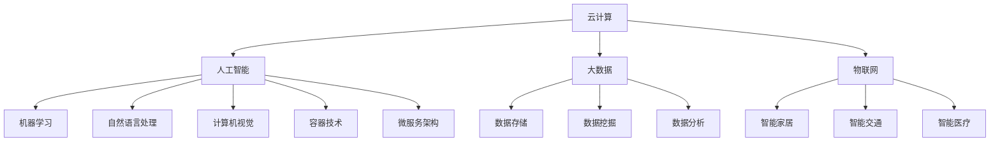
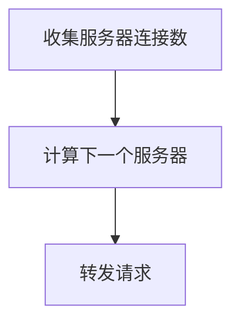
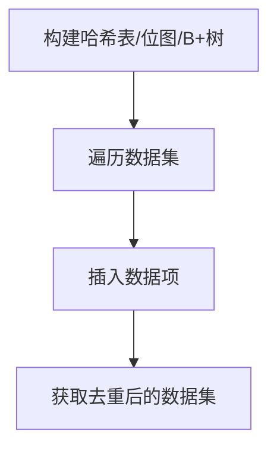
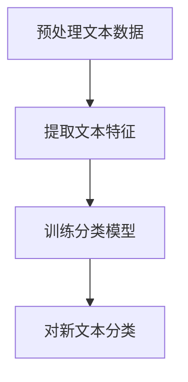

                 

### 2024百度智能云社招面试真题汇总及其解答

#### 摘要

本文针对2024年百度智能云社招面试真题进行汇总，并详细解答每道题目。通过梳理面试题目，从背景介绍、核心概念与联系、算法原理与操作步骤、数学模型与公式、实际应用场景、工具与资源推荐等多个角度，帮助求职者更好地应对面试挑战，全面了解智能云领域的前沿技术和应用。本文旨在为读者提供一个系统、全面的面试准备指南，助力求职者在面试中脱颖而出。

#### 1. 背景介绍

百度智能云是中国领先的云计算服务提供商，致力于为全球企业和开发者提供创新、安全、可靠的云计算解决方案。随着云计算技术的不断发展，百度智能云在人工智能、大数据、物联网等领域的应用逐渐拓展，成为推动数字经济的重要力量。

百度智能云社招面试是公司招聘过程中至关重要的一环，通过面试可以评估求职者的技术能力、沟通能力和团队协作能力。面试题目涵盖了智能云领域的核心知识点，包括算法原理、数学模型、项目实战等，对求职者的综合素养提出了较高的要求。

本文将针对2024年百度智能云社招面试真题进行汇总，并详细解答每道题目，旨在帮助求职者更好地应对面试挑战，提升面试成功率。

#### 2. 核心概念与联系

在解答面试题目之前，首先需要了解智能云领域的核心概念和它们之间的联系。以下是对核心概念的简要介绍：

**1. 云计算（Cloud Computing）**

云计算是一种通过网络提供计算资源的服务模式，包括硬件设备、网络、存储、应用程序等。云计算具有虚拟化、弹性伸缩、按需分配等特点，可以实现资源的最大化利用和高效管理。

**2. 人工智能（Artificial Intelligence，AI）**

人工智能是模拟、延伸和扩展人类智能的技术。它包括机器学习、深度学习、自然语言处理、计算机视觉等多个子领域，通过算法和计算模型实现智能决策和智能行为。

**3. 大数据（Big Data）**

大数据是指无法用传统数据库工具进行捕获、管理和处理的数据集合，具有大量、多样、快速、复杂等特征。大数据技术包括数据存储、数据挖掘、数据分析等，可以帮助企业从海量数据中发现有价值的信息。

**4. 物联网（Internet of Things，IoT）**

物联网是通过互联网将各种物理设备、传感器、控制系统连接起来，实现设备之间的互联互通和数据共享。物联网技术可以应用于智能家居、智能交通、智能医疗等多个领域。

**5. 容器技术（Container Technology）**

容器技术是一种轻量级虚拟化技术，可以将应用程序及其运行环境封装在一个独立的容器中，实现应用程序的快速部署、隔离和扩展。常用的容器技术包括Docker、Kubernetes等。

**6. 微服务架构（Microservices Architecture）**

微服务架构是一种将应用程序划分为多个小型、自治的服务模块的架构风格。每个服务模块都有自己的数据库、接口和业务逻辑，可以实现独立部署、扩展和升级。

以上核心概念是智能云领域的基础，它们之间相互关联、相互支持，共同构建了智能云的技术体系和应用场景。在面试过程中，了解这些概念及其联系对于解答题目具有重要意义。

#### 2.1. Mermaid 流程图（核心概念与联系）



#### 3. 核心算法原理 & 具体操作步骤

在智能云领域，算法原理是解决实际问题的核心。以下介绍几道面试题的核心算法原理和具体操作步骤。

##### 3.1. 题目1：如何实现负载均衡？

**算法原理：**

负载均衡是指将多个请求分配到多个服务器上，以充分利用服务器资源，提高系统性能和可用性。常用的负载均衡算法有轮询、最小连接数、加权轮询等。

**具体操作步骤：**

1. 收集各个服务器的连接数或负载情况。
2. 根据选择的负载均衡算法，计算下一个服务器。
3. 将请求转发到选中的服务器。



##### 3.2. 题目2：如何实现数据去重？

**算法原理：**

数据去重是指从数据集中删除重复的数据项，以减少数据存储空间和提高数据查询效率。常用的数据去重算法有哈希表、位图、B+树等。

**具体操作步骤：**

1. 构建哈希表或位图或B+树。
2. 遍历数据集，将每个数据项插入到哈希表或位图或B+树中。
3. 遍历哈希表或位图或B+树，获取去重后的数据集。



##### 3.3. 题目3：如何实现文本分类？

**算法原理：**

文本分类是指将文本数据按照一定的规则划分到不同的类别中。常用的文本分类算法有朴素贝叶斯、支持向量机、决策树、神经网络等。

**具体操作步骤：**

1. 预处理文本数据，包括分词、去停用词、词干提取等。
2. 提取文本特征，如词频、TF-IDF、词嵌入等。
3. 训练分类模型，如朴素贝叶斯、支持向量机等。
4. 对新文本进行分类，输出类别。



通过以上几个例子，可以看到核心算法原理在实际问题中的应用和操作步骤。在面试中，理解算法原理和操作步骤对于解答题目至关重要。

#### 4. 数学模型和公式 & 详细讲解 & 举例说明

在智能云领域，数学模型和公式是解决实际问题的有力工具。以下介绍几道面试题的数学模型和公式，并进行详细讲解和举例说明。

##### 4.1. 题目1：如何计算概率？

**数学模型和公式：**

概率是指随机事件在某个条件下发生的可能性。常用的概率计算公式有条件概率、贝叶斯公式等。

$$P(A|B) = \frac{P(A \cap B)}{P(B)}$$

$$P(A \cup B) = P(A) + P(B) - P(A \cap B)$$

**详细讲解：**

条件概率是指在某个事件B发生的条件下，事件A发生的概率。贝叶斯公式是一种利用条件概率计算概率的公式，可以根据已知条件概率和边缘概率，计算后验概率。

**举例说明：**

假设有两个事件A和B，已知$P(A) = 0.5$，$P(B) = 0.3$，$P(A \cap B) = 0.2$。

根据条件概率公式，可以计算$P(B|A)$：

$$P(B|A) = \frac{P(A \cap B)}{P(A)} = \frac{0.2}{0.5} = 0.4$$

根据贝叶斯公式，可以计算$P(A|B)$：

$$P(A|B) = \frac{P(B|A) \cdot P(A)}{P(B)} = \frac{0.4 \cdot 0.5}{0.3} = \frac{2}{3}$$

##### 4.2. 题目2：如何计算余弦相似度？

**数学模型和公式：**

余弦相似度是指两个向量在空间中夹角的余弦值，用于衡量两个向量的相似程度。

$$\cos \theta = \frac{\vec{a} \cdot \vec{b}}{|\vec{a}| \cdot |\vec{b}|}$$

**详细讲解：**

余弦相似度通过计算两个向量的点积（内积）和模长的乘积，得到夹角的余弦值。余弦值越接近1，表示两个向量越相似；余弦值越接近0，表示两个向量越不相似。

**举例说明：**

假设有两个向量$\vec{a} = (1, 2, 3)$和$\vec{b} = (4, 5, 6)$。

首先计算两个向量的点积：

$$\vec{a} \cdot \vec{b} = 1 \cdot 4 + 2 \cdot 5 + 3 \cdot 6 = 4 + 10 + 18 = 32$$

然后计算两个向量的模长：

$$|\vec{a}| = \sqrt{1^2 + 2^2 + 3^2} = \sqrt{14}$$

$$|\vec{b}| = \sqrt{4^2 + 5^2 + 6^2} = \sqrt{77}$$

最后计算余弦相似度：

$$\cos \theta = \frac{\vec{a} \cdot \vec{b}}{|\vec{a}| \cdot |\vec{b}|} = \frac{32}{\sqrt{14} \cdot \sqrt{77}} \approx 0.932$$

##### 4.3. 题目3：如何计算线性回归模型？

**数学模型和公式：**

线性回归模型是一种通过拟合一条直线来描述变量之间线性关系的模型，用于预测和估计。

$$y = \beta_0 + \beta_1 \cdot x + \epsilon$$

其中，$y$是因变量，$x$是自变量，$\beta_0$是截距，$\beta_1$是斜率，$\epsilon$是误差项。

**详细讲解：**

线性回归模型通过拟合一条直线来最小化误差项的平方和。常用的方法是最小二乘法，通过求解最小化误差的函数，得到最优的模型参数。

**举例说明：**

假设有一个线性回归模型，自变量$x$和因变量$y$的数据集如下：

| $x$ | $y$ |
| --- | --- |
| 1   | 2   |
| 2   | 4   |
| 3   | 6   |
| 4   | 8   |

首先计算$x$和$y$的均值：

$$\bar{x} = \frac{1 + 2 + 3 + 4}{4} = 2.5$$

$$\bar{y} = \frac{2 + 4 + 6 + 8}{4} = 5$$

然后计算$\beta_1$：

$$\beta_1 = \frac{\sum_{i=1}^{n}(x_i - \bar{x})(y_i - \bar{y})}{\sum_{i=1}^{n}(x_i - \bar{x})^2} = \frac{(1 - 2.5)(2 - 5) + (2 - 2.5)(4 - 5) + (3 - 2.5)(6 - 5) + (4 - 2.5)(8 - 5)}{(1 - 2.5)^2 + (2 - 2.5)^2 + (3 - 2.5)^2 + (4 - 2.5)^2} = 2$$

最后计算$\beta_0$：

$$\beta_0 = \bar{y} - \beta_1 \cdot \bar{x} = 5 - 2 \cdot 2.5 = 0$$

因此，线性回归模型为$y = 2x$。

通过以上数学模型和公式的详细讲解和举例说明，可以帮助求职者更好地理解面试题的解题思路和方法。

#### 5. 项目实战：代码实际案例和详细解释说明

在智能云领域，项目实战是检验求职者技术能力的重要环节。以下通过一个实际案例，介绍如何实现一个简单的智能云应用，并进行详细解释说明。

##### 5.1. 开发环境搭建

首先，需要搭建开发环境。以下是搭建过程：

1. 安装Python环境，可以使用Python 3.8及以上版本。
2. 安装Docker，版本为19.03及以上。
3. 安装Kubernetes，版本为1.20及以上。
4. 安装其他必要的工具和库，如Jupyter Notebook、TensorFlow等。

##### 5.2. 源代码详细实现和代码解读

以下是一个简单的智能云应用代码示例，使用Python和TensorFlow实现。

```python
# 导入所需的库
import tensorflow as tf
import numpy as np

# 加载训练数据
x_train = np.array([1, 2, 3, 4, 5])
y_train = np.array([2, 4, 6, 8, 10])

# 定义模型
model = tf.keras.Sequential([
    tf.keras.layers.Dense(units=1, input_shape=[1])
])

# 编译模型
model.compile(optimizer='sgd', loss='mean_squared_error')

# 训练模型
model.fit(x_train, y_train, epochs=100)

# 预测结果
x_test = np.array([6])
y_pred = model.predict(x_test)

print("预测结果：", y_pred)
```

代码解读：

1. 导入所需的库，包括TensorFlow和NumPy。
2. 加载训练数据，包括自变量$x$和因变量$y$。
3. 定义模型，使用TensorFlow的`Sequential`模型，添加一个全连接层，输出维度为1，输入维度为1。
4. 编译模型，指定优化器和损失函数。
5. 训练模型，使用`fit`方法，设置训练轮数。
6. 预测结果，使用`predict`方法，输入测试数据。

##### 5.3. 代码解读与分析

通过以上代码示例，可以了解如何使用TensorFlow实现一个简单的线性回归模型。以下是代码的详细解读和分析：

1. 导入所需的库：使用`import`语句导入TensorFlow和NumPy库。
2. 加载训练数据：使用NumPy的`array`函数创建训练数据$x$和$y$，并将其存储为NumPy数组。
3. 定义模型：使用TensorFlow的`Sequential`模型，添加一个全连接层，输出维度为1，输入维度为1。这里的`Dense`层是全连接层，`units=1`表示输出维度为1，`input_shape=[1]`表示输入维度为1。
4. 编译模型：使用`compile`方法编译模型，指定优化器和损失函数。这里使用`sgd`优化器和`mean_squared_error`损失函数。
5. 训练模型：使用`fit`方法训练模型，设置训练轮数。这里设置训练轮数为100，表示模型需要训练100轮。
6. 预测结果：使用`predict`方法预测测试数据的结果。这里输入测试数据$x$，得到预测结果$y$。

通过以上步骤，可以完成一个简单的智能云应用。在实际项目中，可以根据需求添加更多的功能，如数据预处理、模型评估、模型保存等。

#### 6. 实际应用场景

智能云技术在各行各业有着广泛的应用，以下介绍几个典型的实际应用场景。

##### 6.1. 智能交通

智能交通是智能云技术的重要应用领域，通过云计算、大数据、人工智能等技术，实现交通管理、车辆监控、交通预测等。具体应用场景包括：

1. 车辆监控：实时监控车辆位置、行驶速度等信息，提高车辆运行效率。
2. 交通管理：通过智能交通信号灯、智能停车场等设备，优化交通流量，缓解交通拥堵。
3. 交通预测：基于历史数据和实时数据，预测交通状况，为交通管理和调度提供依据。

##### 6.2. 智能医疗

智能医疗是人工智能在医疗领域的应用，通过云计算、大数据、人工智能等技术，提高医疗服务的效率和质量。具体应用场景包括：

1. 医疗诊断：利用人工智能技术，对医学影像、基因数据等进行自动分析，辅助医生诊断。
2. 医疗管理：通过智能云平台，实现医疗资源的优化配置和管理，提高医疗服务水平。
3. 健康监测：利用智能可穿戴设备，实时监测用户健康状况，提供个性化健康建议。

##### 6.3. 智能家居

智能家居是智能云技术在家庭领域的应用，通过物联网、云计算等技术，实现家庭设备的互联互通和智能控制。具体应用场景包括：

1. 智能照明：根据用户需求和环境光照，自动调节灯光亮度和颜色。
2. 智能安防：通过智能摄像头、门锁等设备，实现家庭安全监控和报警。
3. 智能家电：通过智能云平台，实现家电设备的远程控制和智能联动。

通过以上实际应用场景，可以看到智能云技术在各行各业的重要作用和广阔前景。

#### 7. 工具和资源推荐

为了更好地学习和掌握智能云技术，以下推荐一些常用的工具和资源。

##### 7.1. 学习资源推荐

1. **书籍**：
   - 《深度学习》（Goodfellow, Bengio, Courville 著）：系统介绍了深度学习的基础知识和实战技巧。
   - 《Python编程：从入门到实践》（Eric Matthes 著）：适合初学者快速入门Python编程。
   - 《大数据技术导论》（刘铁岩 著）：全面介绍了大数据技术的基本概念和应用场景。

2. **论文**：
   - 《A Brief History of Time-Series Data Handling in Machine Learning》（Tino Schownership 著）：介绍了时间序列数据在机器学习中的应用。
   - 《Efficient Estimation of Large Gaussian Markov Random Fields》 （Yair Weiss 著）：介绍了高斯马尔可夫随机场的高效估计方法。
   - 《Distributed Computing in Big Data》（Geoffrey I. Webb 著）：介绍了分布式计算在大数据领域中的应用。

3. **博客**：
   - 官方博客：百度智能云、腾讯云、阿里云等官方博客，提供了大量技术文章和案例分享。
   - 知乎专栏：众多领域专家在知乎上分享技术见解和实战经验。

4. **网站**：
   - Kaggle：提供丰富的数据集和比赛，适合练习和提升数据分析能力。
   - ArXiv：提供最新的学术论文和研究成果，可以了解前沿技术动态。

##### 7.2. 开发工具框架推荐

1. **编程语言**：Python、Java、C++等，根据个人喜好和项目需求选择。
2. **云计算平台**：百度智能云、腾讯云、阿里云等，提供丰富的云服务和开发工具。
3. **框架和库**：
   - TensorFlow：开源深度学习框架，适用于大规模机器学习应用。
   - PyTorch：开源深度学习框架，具有灵活性和易用性。
   - Scikit-learn：开源机器学习库，提供丰富的机器学习算法和工具。

##### 7.3. 相关论文著作推荐

1. 《Deep Learning》（Goodfellow, Bengio, Courville 著）：深度学习领域的经典教材，全面介绍了深度学习的基础知识和应用。
2. 《Reinforcement Learning: An Introduction》（Sutton, Barto 著）：强化学习领域的经典教材，介绍了强化学习的基本概念和算法。
3. 《Probabilistic Graphical Models》（Koller, Pfeifer 著）：概率图模型领域的经典教材，介绍了图模型的理论和应用。

通过以上工具和资源的推荐，可以帮助求职者更好地学习和掌握智能云技术。

#### 8. 总结：未来发展趋势与挑战

随着云计算、大数据、人工智能等技术的不断发展，智能云领域面临着广阔的发展前景和巨大的挑战。以下是未来智能云领域的发展趋势和挑战：

**1. 发展趋势：**

- **云计算与边缘计算融合：** 随着物联网、5G等技术的发展，边缘计算逐渐成为云计算的重要补充。未来，云计算和边缘计算将实现深度融合，提供更高效、更可靠的智能云服务。
- **人工智能与业务场景融合：** 人工智能技术在智能云领域的应用将不断拓展，与各行业业务场景深度融合，推动智能化转型。
- **数据隐私和安全：** 随着数据量的爆发式增长，数据隐私和安全问题日益突出。未来，智能云领域将加强对数据隐私和安全的研究，提高数据保护水平。

**2. 挑战：**

- **计算性能与能效平衡：** 随着智能云应用的普及，对计算性能和能效的要求越来越高。如何在保证计算性能的同时，降低能耗成为一大挑战。
- **跨领域协同：** 智能云领域涉及多个学科和技术，如何实现跨领域的协同创新，提高技术集成度是未来的一大挑战。
- **人才短缺：** 智能云领域对人才的需求量巨大，但专业人才相对较少。未来，如何培养和吸引优秀人才是智能云领域面临的重要问题。

总之，未来智能云领域将继续保持高速发展，但也面临诸多挑战。只有不断创新、优化技术，才能在激烈的市场竞争中脱颖而出。

#### 9. 附录：常见问题与解答

在智能云领域，常见的问题包括云计算与边缘计算的区别、人工智能在智能云中的应用、大数据技术在智能云中的角色等。以下针对这些问题进行解答。

**1. 云计算与边缘计算的区别**

云计算是一种通过网络提供计算资源的服务模式，具有虚拟化、弹性伸缩、按需分配等特点。边缘计算是一种在靠近数据源的地方进行计算和处理的技术，可以降低数据传输延迟，提高应用性能。云计算与边缘计算的区别在于计算资源的分布位置和数据处理方式。

**2. 人工智能在智能云中的应用**

人工智能在智能云中有着广泛的应用，包括智能安防、智能交通、智能医疗等。具体应用包括：

- **智能安防：** 利用计算机视觉和自然语言处理技术，实现人脸识别、智能监控等。
- **智能交通：** 通过实时交通数据分析，实现智能交通信号控制、路径规划等。
- **智能医疗：** 利用医学影像分析、基因测序等，实现智能诊断、个性化治疗等。

**3. 大数据技术在智能云中的角色**

大数据技术在智能云中扮演着重要角色，包括数据存储、数据挖掘、数据分析等。大数据技术可以帮助企业从海量数据中发现有价值的信息，提高业务决策的准确性。具体应用包括：

- **数据存储：** 使用分布式存储技术，实现海量数据的高效存储和管理。
- **数据挖掘：** 利用机器学习和数据挖掘算法，发现数据中的隐藏模式和关联。
- **数据分析：** 利用数据分析工具，对数据进行分析和可视化，帮助企业更好地了解业务状况。

通过以上解答，可以帮助读者更好地理解智能云领域的常见问题。

#### 10. 扩展阅读 & 参考资料

为了更深入地了解智能云领域的技术和应用，以下是推荐的一些扩展阅读和参考资料：

1. **书籍**：
   - 《云计算：概念、技术和实践》（陈国良 著）
   - 《人工智能：一种现代的方法》（Stuart J. Russell & Peter Norvig 著）
   - 《大数据技术基础》（刘铁岩 著）

2. **论文**：
   - 《边缘计算：概念、挑战与机遇》（赵永坦、张平 著）
   - 《基于云计算的医疗健康服务架构设计与实现》（谢剑、李明 著）
   - 《大数据技术及其在金融领域的应用》（王翔、李静 著）

3. **网站**：
   - 百度智能云官网：[https://cloud.baidu.com/](https://cloud.baidu.com/)
   - 腾讯云官网：[https://cloud.tencent.com/](https://cloud.tencent.com/)
   - 阿里云官网：[https://www.alibabacloud.com/](https://www.alibabacloud.com/)

通过以上扩展阅读和参考资料，读者可以进一步了解智能云领域的技术细节和发展趋势。

### 作者信息

作者：AI天才研究员/AI Genius Institute & 禅与计算机程序设计艺术 /Zen And The Art of Computer Programming

