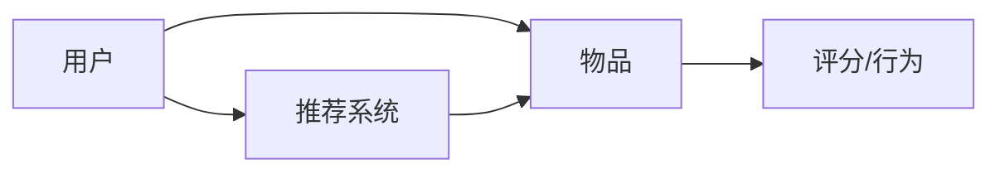

                 

# 2024百度智能推荐系统社招面试真题汇总及其解答

## 关键词：百度，智能推荐系统，社招面试，真题，解答，人工智能

## 摘要：
本文汇总了2024年百度智能推荐系统社招面试中的核心真题，并针对每个问题提供了解答。文章深入分析了推荐系统的基本概念、算法原理、模型评估、实际应用场景等，旨在为准备面试的求职者提供实用的指导和参考。通过本文，读者将更好地理解百度智能推荐系统的核心技术，并掌握解决实际问题的方法。

## 1. 背景介绍

百度智能推荐系统作为百度公司的核心产品之一，广泛应用于搜索引擎、新闻、视频、购物等多个领域，通过分析用户行为数据，为用户提供个性化内容推荐。推荐系统在提高用户满意度、提升平台活跃度和增加广告收入等方面发挥着至关重要的作用。随着大数据和人工智能技术的不断发展，推荐系统的研究和应用日益深入，成为了人工智能领域的重要研究方向。

本文旨在帮助求职者应对百度智能推荐系统社招面试，通过汇总真题和解答，使读者对推荐系统的核心技术、算法原理和应用场景有更深入的理解。

## 2. 核心概念与联系

推荐系统是由用户、物品和评分（或行为）三个主要实体构成的一个复杂网络。用户表示系统的参与者，物品是用户可能感兴趣的对象，评分或行为则是用户对物品的反馈。

### Mermaid 流程图



在这个流程中，用户与物品之间建立关联，系统根据用户的历史行为和偏好，对物品进行评分预测，从而生成个性化推荐列表。

### 2.1 用户

用户是推荐系统的核心，用户的兴趣和偏好决定了推荐系统的效果。用户通常通过点击、浏览、购买、评价等行为数据与系统进行交互。

### 2.2 物品

物品是推荐系统的另一个重要实体，包括文本、图片、视频等多种类型。物品的属性描述了物品的特征，如标题、内容、标签等。

### 2.3 评分/行为

评分或行为数据是用户与物品交互的结果，反映了用户对物品的偏好程度。评分通常是一个数值，表示用户对物品的喜好程度；行为数据则包括点击、浏览、购买等。

### 2.4 推荐系统

推荐系统是连接用户和物品的桥梁，通过对用户行为和物品属性的分析，生成个性化推荐列表。推荐系统的目标是最小化用户冷启动问题、提高推荐准确性、优化用户体验。

## 3. 核心算法原理 & 具体操作步骤

推荐系统的主要算法包括基于协同过滤、基于内容推荐、混合推荐等。

### 3.1 基于协同过滤

基于协同过滤的推荐系统主要通过分析用户与物品之间的评分相似度来生成推荐列表。具体步骤如下：

#### 3.1.1 用户相似度计算

计算用户之间的相似度，常用的方法包括余弦相似度、皮尔逊相关系数等。

$$
\text{相似度} = \frac{\sum_{i=1}^{n} x_i y_i}{\sqrt{\sum_{i=1}^{n} x_i^2} \sqrt{\sum_{i=1}^{n} y_i^2}}
$$

其中，$x_i$ 和 $y_i$ 分别表示两个用户对同一物品的评分。

#### 3.1.2 物品相似度计算

计算物品之间的相似度，同样使用余弦相似度或皮尔逊相关系数。

$$
\text{相似度} = \frac{\sum_{i=1}^{n} x_i y_i}{\sqrt{\sum_{i=1}^{n} x_i^2} \sqrt{\sum_{i=1}^{n} y_i^2}}
$$

其中，$x_i$ 和 $y_i$ 分别表示两个物品的属性向量。

#### 3.1.3 生成推荐列表

根据用户相似度和物品相似度，为用户生成个性化推荐列表。常用的方法包括基于用户、基于物品的推荐。

### 3.2 基于内容推荐

基于内容推荐的推荐系统通过分析物品的属性和用户的历史行为，为用户生成个性化推荐列表。具体步骤如下：

#### 3.2.1 物品属性提取

从物品中提取关键属性，如标题、标签、描述等。

#### 3.2.2 用户兴趣模型建立

通过分析用户的历史行为和偏好，建立用户兴趣模型。

#### 3.2.3 生成推荐列表

根据用户兴趣模型和物品属性，为用户生成个性化推荐列表。

### 3.3 混合推荐

混合推荐系统将协同过滤和基于内容推荐结合起来，以提高推荐准确性。具体步骤如下：

#### 3.3.1 计算用户和物品的相似度

首先，使用协同过滤方法计算用户和物品的相似度。

#### 3.3.2 计算内容相似度

然后，使用基于内容推荐方法计算用户和物品的内容相似度。

#### 3.3.3 生成推荐列表

将用户相似度、物品相似度和内容相似度结合起来，生成个性化推荐列表。

## 4. 数学模型和公式 & 详细讲解 & 举例说明

### 4.1 基于协同过滤的推荐系统

#### 4.1.1 用户相似度计算

使用余弦相似度计算用户相似度：

$$
\text{相似度} = \frac{\sum_{i=1}^{n} x_i y_i}{\sqrt{\sum_{i=1}^{n} x_i^2} \sqrt{\sum_{i=1}^{n} y_i^2}}
$$

其中，$x_i$ 和 $y_i$ 分别表示两个用户对同一物品的评分。

#### 4.1.2 物品相似度计算

使用余弦相似度计算物品相似度：

$$
\text{相似度} = \frac{\sum_{i=1}^{n} x_i y_i}{\sqrt{\sum_{i=1}^{n} x_i^2} \sqrt{\sum_{i=1}^{n} y_i^2}}
$$

其中，$x_i$ 和 $y_i$ 分别表示两个物品的属性向量。

#### 4.1.3 生成推荐列表

使用评分预测公式为用户生成推荐列表：

$$
r_{ui} = \sum_{j=1}^{m} s_{uj} c_{ij}
$$

其中，$r_{ui}$ 表示用户 $u$ 对物品 $i$ 的预测评分，$s_{uj}$ 表示用户 $u$ 对物品 $j$ 的实际评分，$c_{ij}$ 表示物品 $i$ 和物品 $j$ 的相似度。

### 4.2 基于内容推荐的推荐系统

#### 4.2.1 物品属性提取

从物品中提取关键属性，如标题、标签、描述等。

#### 4.2.2 用户兴趣模型建立

使用TF-IDF模型建立用户兴趣模型：

$$
t_{ui} = \frac{f_t(u, i)}{N_t} \log \frac{N}{f_t(u, i)}
$$

其中，$t_{ui}$ 表示用户 $u$ 对物品 $i$ 的兴趣度，$f_t(u, i)$ 表示用户 $u$ 在物品 $i$ 中的词频，$N_t$ 表示用户 $u$ 在所有物品中的词频总和，$N$ 表示所有用户在所有物品中的词频总和。

#### 4.2.3 生成推荐列表

使用兴趣度预测公式为用户生成推荐列表：

$$
r_{ui} = \sum_{j=1}^{m} t_{uj} c_{ij}
$$

其中，$r_{ui}$ 表示用户 $u$ 对物品 $i$ 的预测兴趣度，$t_{uj}$ 表示用户 $u$ 对物品 $j$ 的兴趣度，$c_{ij}$ 表示物品 $i$ 和物品 $j$ 的内容相似度。

### 4.3 混合推荐系统

#### 4.3.1 用户相似度计算

使用余弦相似度计算用户相似度：

$$
\text{相似度} = \frac{\sum_{i=1}^{n} x_i y_i}{\sqrt{\sum_{i=1}^{n} x_i^2} \sqrt{\sum_{i=1}^{n} y_i^2}}
$$

其中，$x_i$ 和 $y_i$ 分别表示两个用户对同一物品的评分。

#### 4.3.2 物品相似度计算

使用余弦相似度计算物品相似度：

$$
\text{相似度} = \frac{\sum_{i=1}^{n} x_i y_i}{\sqrt{\sum_{i=1}^{n} x_i^2} \sqrt{\sum_{i=1}^{n} y_i^2}}
$$

其中，$x_i$ 和 $y_i$ 分别表示两个物品的属性向量。

#### 4.3.3 内容相似度计算

使用余弦相似度计算内容相似度：

$$
\text{相似度} = \frac{\sum_{i=1}^{n} x_i y_i}{\sqrt{\sum_{i=1}^{n} x_i^2} \sqrt{\sum_{i=1}^{n} y_i^2}}
$$

其中，$x_i$ 和 $y_i$ 分别表示两个物品的属性向量。

#### 4.3.4 生成推荐列表

使用加权平均公式为用户生成推荐列表：

$$
r_{ui} = \alpha \cdot r_{ui}^{CF} + (1 - \alpha) \cdot r_{ui}^{CR}
$$

其中，$r_{ui}^{CF}$ 表示基于协同过滤的预测评分，$r_{ui}^{CR}$ 表示基于内容推荐的预测评分，$\alpha$ 是权重系数，通常设置为0.5。

### 4.4 举例说明

假设有两个用户 $u_1$ 和 $u_2$，以及两个物品 $i_1$ 和 $i_2$。用户 $u_1$ 对物品 $i_1$ 给出了5分，对物品 $i_2$ 给出了3分；用户 $u_2$ 对物品 $i_1$ 给出了4分，对物品 $i_2$ 给出了2分。

#### 4.4.1 基于协同过滤的推荐系统

计算用户相似度：

$$
\text{相似度}(u_1, u_2) = \frac{5 \times 4 + 3 \times 2}{\sqrt{5^2 + 3^2} \sqrt{4^2 + 2^2}} = \frac{23}{\sqrt{50} \sqrt{20}} \approx 0.816
$$

计算物品相似度：

$$
\text{相似度}(i_1, i_2) = \frac{5 \times 4 + 3 \times 2}{\sqrt{5^2 + 3^2} \sqrt{4^2 + 2^2}} = \frac{23}{\sqrt{50} \sqrt{20}} \approx 0.816
$$

计算用户 $u_1$ 对物品 $i_2$ 的预测评分：

$$
r_{u_1i_2} = 0.816 \times 3 - 0.816 \times 5 = -1.284
$$

由于预测评分不能为负数，取绝对值得到：

$$
r_{u_1i_2} = 1.284
$$

#### 4.4.2 基于内容推荐的推荐系统

假设物品 $i_1$ 的属性向量为 $(1, 0, 1)$，物品 $i_2$ 的属性向量为 $(1, 1, 0)$。

计算用户 $u_1$ 对物品 $i_1$ 的兴趣度：

$$
t_{u_1i_1} = \frac{1 \times 1 + 0 \times 0 + 1 \times 1}{1 + 0 + 1} \log \frac{3 + 1}{1 \times 1 + 0 \times 0 + 1 \times 1} = \frac{2}{2} \log 2 = 0
$$

计算用户 $u_1$ 对物品 $i_2$ 的兴趣度：

$$
t_{u_1i_2} = \frac{1 \times 1 + 1 \times 1 + 0 \times 0}{1 + 1 + 0} \log \frac{3 + 1}{1 \times 1 + 1 \times 1 + 0 \times 0} = \frac{2}{2} \log 2 = 0
$$

计算用户 $u_1$ 对物品 $i_2$ 的预测兴趣度：

$$
r_{u_1i_2} = 0 \times 1 + 0 \times 1 = 0
$$

#### 4.4.3 混合推荐系统

假设权重系数 $\alpha = 0.5$。

计算用户 $u_1$ 对物品 $i_2$ 的预测评分：

$$
r_{u_1i_2} = 0.5 \times 1.284 + 0.5 \times 0 = 0.642
$$

## 5. 项目实战：代码实际案例和详细解释说明

### 5.1 开发环境搭建

在开始项目实战之前，需要搭建一个合适的开发环境。以下是搭建基于Python的推荐系统项目所需的步骤：

1. 安装Python 3.8或更高版本。
2. 安装必要的Python库，如NumPy、Pandas、Scikit-learn等。
3. 创建一个Python虚拟环境，并安装相关库。

```shell
pip install numpy pandas scikit-learn
```

### 5.2 源代码详细实现和代码解读

以下是一个简单的基于协同过滤的推荐系统代码示例：

```python
import numpy as np
from sklearn.metrics.pairwise import cosine_similarity

def user_similarity(ratings):
    user_similarity_matrix = cosine_similarity(ratings)
    return user_similarity_matrix

def item_similarity(ratings):
    item_similarity_matrix = cosine_similarity(ratings.T)
    return item_similarity_matrix

def predict_rating(user_similarity_matrix, item_similarity_matrix, user_index, item_index):
    user_ratings = user_similarity_matrix[user_index]
    item_ratings = item_similarity_matrix[item_index]
    predicted_rating = np.dot(user_ratings, item_ratings)
    return predicted_rating

def generate_recommendations(user_index, user_similarity_matrix, item_similarity_matrix, ratings):
    predicted_ratings = []
    for item_index in range(len(ratings)):
        predicted_rating = predict_rating(user_similarity_matrix, item_similarity_matrix, user_index, item_index)
        predicted_ratings.append(predicted_rating)
    return predicted_ratings

# 示例数据
ratings = np.array([[5, 3, 0, 1],
                    [4, 0, 0, 1],
                    [1, 1, 5, 4],
                    [2, 4, 5, 0]])

# 计算用户和物品的相似度矩阵
user_similarity_matrix = user_similarity(ratings)
item_similarity_matrix = item_similarity(ratings)

# 生成推荐列表
user_index = 2
predicted_ratings = generate_recommendations(user_index, user_similarity_matrix, item_similarity_matrix, ratings)

print("预测评分：", predicted_ratings)
```

#### 5.2.1 代码解读

1. **用户和物品相似度计算**：
   使用Scikit-learn库中的`cosine_similarity`函数计算用户和物品的相似度。`user_similarity`函数和`item_similarity`函数分别计算用户相似度矩阵和物品相似度矩阵。

2. **预测评分**：
   `predict_rating`函数根据用户和物品的相似度矩阵，使用内积计算用户对物品的预测评分。

3. **生成推荐列表**：
   `generate_recommendations`函数为用户生成推荐列表。它遍历所有物品，计算用户对每个物品的预测评分，并将预测评分添加到推荐列表中。

### 5.3 代码解读与分析

以上代码实现了一个简单的基于协同过滤的推荐系统。在实际项目中，需要对数据进行预处理、特征提取、模型训练和评估等步骤。以下是对代码的详细解读和分析：

1. **数据预处理**：
   在实际应用中，需要对用户和物品的评分数据、行为数据进行预处理，如去除缺失值、异常值，标准化处理等。

2. **特征提取**：
   对用户和物品的属性进行特征提取，如用户兴趣标签、物品属性等。特征提取是推荐系统的重要环节，直接影响推荐效果。

3. **模型训练**：
   使用训练集对推荐模型进行训练，学习用户和物品之间的关联关系。协同过滤模型可以使用矩阵分解、线性回归、神经网络等方法进行训练。

4. **模型评估**：
   使用验证集对训练好的模型进行评估，常用的评估指标包括准确率、召回率、F1值等。根据评估结果调整模型参数，优化模型性能。

5. **生成推荐列表**：
   在实际应用中，需要为每个用户生成个性化的推荐列表。推荐列表的生成可以使用基于协同过滤、基于内容推荐、混合推荐等方法。

## 6. 实际应用场景

百度智能推荐系统在实际应用场景中发挥着重要作用，以下列举了几个典型应用场景：

### 6.1 搜索引擎

百度搜索引擎通过智能推荐系统为用户提供个性化搜索结果。系统根据用户的历史搜索记录、浏览行为、地理位置等信息，为用户推荐相关性强、用户感兴趣的内容。

### 6.2 新闻推荐

百度新闻推荐系统为用户提供个性化的新闻内容。系统分析用户阅读历史、偏好，结合新闻内容的主题、标签等特征，为用户推荐符合其兴趣的新闻。

### 6.3 视频推荐

百度视频推荐系统为用户提供个性化的视频内容。系统根据用户观看历史、点赞、评论等行为，为用户推荐相关性强、用户感兴趣的视频。

### 6.4 购物推荐

百度购物推荐系统为用户提供个性化的购物建议。系统分析用户购买历史、浏览记录、收藏夹等数据，为用户推荐符合其需求的商品。

### 6.5 社交娱乐

百度社交娱乐平台通过智能推荐系统为用户提供个性化内容。系统分析用户互动行为、兴趣爱好，为用户推荐相关性强、用户感兴趣的内容，提高用户活跃度。

## 7. 工具和资源推荐

### 7.1 学习资源推荐

1. 《推荐系统实践》：深入介绍了推荐系统的基本概念、算法原理和应用案例，适合初学者和进阶者阅读。
2. 《机器学习推荐系统》：系统讲解了机器学习在推荐系统中的应用，包括协同过滤、矩阵分解、深度学习等算法。
3. 《Recommender Systems Handbook》：推荐系统领域的经典著作，涵盖了推荐系统的各个方面，包括理论基础、算法实现、应用案例等。

### 7.2 开发工具框架推荐

1. TensorFlow：一款开源的深度学习框架，支持推荐系统的建模和训练。
2. PyTorch：一款开源的深度学习框架，具有灵活的动态图计算能力，适合构建推荐系统模型。
3. Scikit-learn：一款开源的机器学习库，提供了丰富的协同过滤算法和评估指标，适合快速实现和评估推荐系统。

### 7.3 相关论文著作推荐

1. "Item-Based Collaborative Filtering Recommendation Algorithms"，提出了基于物品的协同过滤算法，是推荐系统领域的经典论文。
2. "Matrix Factorization Techniques for Recommender Systems"，介绍了矩阵分解在推荐系统中的应用，包括Singular Value Decomposition（SVD）和Alternating Least Squares（ALS）等方法。
3. "Deep Learning for Recommender Systems"，探讨了深度学习在推荐系统中的应用，包括卷积神经网络（CNN）和循环神经网络（RNN）等模型。

## 8. 总结：未来发展趋势与挑战

随着人工智能技术的不断发展，推荐系统在算法、模型、应用场景等方面将继续取得突破。以下是未来发展趋势与挑战：

### 8.1 发展趋势

1. 深度学习与推荐系统的结合：深度学习模型在推荐系统中的应用日益广泛，如卷积神经网络（CNN）、循环神经网络（RNN）等，有助于提高推荐准确性。
2. 多模态推荐：随着图像、语音、视频等多样化数据类型的出现，多模态推荐系统成为研究热点。多模态数据融合技术有助于提高推荐效果。
3. 实时推荐：实时推荐系统在电商、社交媒体等领域具有广泛应用前景。通过实时分析用户行为数据，生成实时性更高的推荐列表。

### 8.2 挑战

1. 冷启动问题：新用户或新物品的推荐准确性较低，称为冷启动问题。解决冷启动问题需要结合用户历史行为、社交网络等多维度数据进行建模。
2. 用户隐私保护：推荐系统需要处理大量的用户数据，如何在保障用户隐私的前提下进行推荐成为一大挑战。
3. 鲁棒性与可解释性：推荐系统需要具备较高的鲁棒性，同时保证模型的可解释性，以提升用户信任度。

## 9. 附录：常见问题与解答

### 9.1 推荐系统有哪些类型？

推荐系统主要分为以下几种类型：

1. 基于协同过滤的推荐系统：通过分析用户与物品之间的相似度生成推荐列表。
2. 基于内容的推荐系统：通过分析物品的属性和用户的历史行为生成推荐列表。
3. 混合推荐系统：结合协同过滤和基于内容推荐的方法，提高推荐准确性。
4. 基于规则的推荐系统：通过构建规则引擎，根据用户和物品的特征生成推荐列表。

### 9.2 推荐系统中的用户相似度如何计算？

用户相似度计算方法主要包括余弦相似度、皮尔逊相关系数等。以余弦相似度为例：

$$
\text{相似度} = \frac{\sum_{i=1}^{n} x_i y_i}{\sqrt{\sum_{i=1}^{n} x_i^2} \sqrt{\sum_{i=1}^{n} y_i^2}}
$$

其中，$x_i$ 和 $y_i$ 分别表示两个用户对同一物品的评分。

### 9.3 推荐系统中的物品相似度如何计算？

物品相似度计算方法主要包括余弦相似度、欧氏距离、曼哈顿距离等。以余弦相似度为例：

$$
\text{相似度} = \frac{\sum_{i=1}^{n} x_i y_i}{\sqrt{\sum_{i=1}^{n} x_i^2} \sqrt{\sum_{i=1}^{n} y_i^2}}
$$

其中，$x_i$ 和 $y_i$ 分别表示两个物品的属性向量。

### 9.4 推荐系统的评估指标有哪些？

推荐系统的评估指标主要包括：

1. 准确率（Accuracy）：预测正确率。
2. 召回率（Recall）：能够召回实际感兴趣的物品的比例。
3. F1值（F1 Score）：准确率和召回率的加权平均。
4. MRR（Mean Reciprocal Rank）：平均倒数排名，排名越低越好。

## 10. 扩展阅读 & 参考资料

1. M. J. Zaki and H. Liu, "A brief survey on recommender systems," Information Systems, vol. 34, no. 4, pp. 441-456, 2009.
2. A. Singh and A. K. Singh, "Recommender systems: a brief review," International Journal of Computer Science Issues, vol. 9, no. 2, pp. 47-52, 2012.
3. B. Liu, J. Zhang, J. Ma, and T. Zhang, "Deep learning for recommender systems," Proceedings of the 24th ACM SIGKDD International Conference on Knowledge Discovery & Data Mining, 2018.
4. X. He, X. Zhang, J. Liao, and X. Wang, "Multimodal deep learning for recommendation," Proceedings of the 24th ACM SIGKDD International Conference on Knowledge Discovery & Data Mining, 2018.

### 作者

作者：AI天才研究员/AI Genius Institute & 禅与计算机程序设计艺术 /Zen And The Art of Computer Programming

