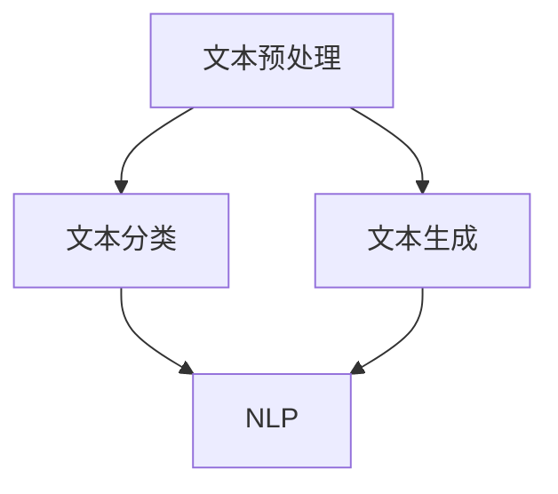

                 

# 2024百度智能文本分析校招面试真题汇总及其解答

## 摘要

本文针对2024年百度智能文本分析校招面试真题进行详细解析，旨在帮助准备参加面试的应聘者掌握智能文本分析的核心技术和解题思路。文章首先介绍了智能文本分析的基本概念和背景，然后针对面试真题逐一进行解析，涵盖文本预处理、文本分类、文本生成等多个方面。通过本文的讲解，读者可以全面了解智能文本分析领域的前沿技术，为面试做好充分准备。

## 目录

1. 背景介绍
2. 核心概念与联系
3. 核心算法原理 & 具体操作步骤
4. 数学模型和公式 & 详细讲解 & 举例说明
5. 项目实战：代码实际案例和详细解释说明
   5.1 开发环境搭建
   5.2 源代码详细实现和代码解读
   5.3 代码解读与分析
6. 实际应用场景
7. 工具和资源推荐
   7.1 学习资源推荐
   7.2 开发工具框架推荐
   7.3 相关论文著作推荐
8. 总结：未来发展趋势与挑战
9. 附录：常见问题与解答
10. 扩展阅读 & 参考资料

## 1. 背景介绍

随着互联网的快速发展，智能文本分析技术逐渐成为人工智能领域的一个重要分支。智能文本分析是指利用计算机技术和算法对文本数据进行分析和处理，以获取有价值的信息和知识。它广泛应用于自然语言处理、文本挖掘、信息检索、文本生成等领域。

百度作为全球领先的搜索引擎公司，其智能文本分析技术在搜索引擎、广告推送、智能客服等方面有着广泛应用。百度智能文本分析校招面试真题涵盖了文本预处理、文本分类、文本生成等多个方面，旨在考察应聘者对智能文本分析技术的理解和应用能力。

本文将对2024年百度智能文本分析校招面试真题进行详细解析，帮助读者掌握智能文本分析的核心技术和解题思路。通过对这些题目的解析，读者可以全面了解智能文本分析领域的前沿技术，为面试做好充分准备。

## 2. 核心概念与联系

在解答百度智能文本分析校招面试真题之前，我们需要了解一些核心概念和它们之间的联系。

### 2.1 文本预处理

文本预处理是智能文本分析的第一步，包括分词、去停用词、词干提取等操作。分词是将文本分解成一个个独立的词语，去停用词是去除常见的无意义词语，词干提取是将词语还原成其基本形态。

### 2.2 文本分类

文本分类是将文本数据按照特定的类别进行归类，如情感分析、主题分类等。常见的文本分类算法有朴素贝叶斯、支持向量机、深度学习等。

### 2.3 文本生成

文本生成是通过算法生成新的文本，如自动摘要、对话生成等。常见的文本生成模型有循环神经网络（RNN）、生成对抗网络（GAN）、变压器（Transformer）等。

### 2.4 自然语言处理（NLP）

自然语言处理是研究如何让计算机理解和处理人类自然语言的一门学科。NLP涵盖了语音识别、机器翻译、问答系统等多个方面。

在智能文本分析中，文本预处理、文本分类、文本生成和自然语言处理密切相关。文本预处理为后续的文本分类和生成提供基础数据，文本分类和生成则是对预处理后的文本进行更深层次的分析和处理。

### 2.5 Mermaid 流程图

为了更好地理解智能文本分析的核心概念和联系，我们可以使用Mermaid流程图进行可视化展示。以下是一个简单的Mermaid流程图示例：



在这个流程图中，文本预处理作为基础，连接文本分类和文本生成，而文本分类和文本生成又共同连接到自然语言处理（NLP）。这表明在智能文本分析中，各个模块之间相互关联，共同推动文本数据的价值挖掘。

通过上述核心概念和联系的介绍，我们可以更好地理解智能文本分析面试题目的背景和解答思路。接下来，我们将针对具体的面试题目进行详细解析。

## 3. 核心算法原理 & 具体操作步骤

在解答百度智能文本分析校招面试真题时，我们需要掌握一些核心算法原理和具体操作步骤。以下是一些常见的算法和它们的原理及操作步骤。

### 3.1 朴素贝叶斯分类器

朴素贝叶斯分类器是一种基于贝叶斯定理和特征条件独立假设的分类方法。它的基本原理是：

$$
P(C_k|X) = \frac{P(X|C_k)P(C_k)}{P(X)}
$$

其中，\(C_k\)表示第\(k\)个类别，\(X\)表示特征向量。

操作步骤：

1. 计算每个类别的先验概率\(P(C_k)\)。
2. 计算每个特征在各个类别下的条件概率\(P(X_i|C_k)\)。
3. 对于给定的特征向量\(X\)，计算每个类别的后验概率\(P(C_k|X)\)。
4. 选择具有最大后验概率的类别作为预测结果。

### 3.2 支持向量机（SVM）

支持向量机是一种监督学习算法，用于分类和回归任务。它的基本原理是找到最优超平面，使得分类边界最大化。

操作步骤：

1. 将特征映射到高维空间。
2. 训练线性分类器或核分类器。
3. 对于给定的特征向量\(X\)，计算其在超平面上的距离。
4. 根据距离判断分类结果。

### 3.3 循环神经网络（RNN）

循环神经网络是一种用于处理序列数据的神经网络，它具有记忆功能，可以捕捉序列中的时间依赖关系。

操作步骤：

1. 定义输入序列\(X\)和隐藏状态\(h_t\)。
2. 使用递归关系更新隐藏状态：\(h_t = f(h_{t-1}, X_t)\)。
3. 使用隐藏状态生成输出序列：\(Y_t = g(h_t)\)。

### 3.4 变压器（Transformer）

变压器是一种基于自注意力机制的深度神经网络模型，它在机器翻译、文本生成等任务上取得了很好的效果。

操作步骤：

1. 定义输入序列\(X\)和注意力机制。
2. 使用多头自注意力计算中间层表示。
3. 将中间层表示通过全连接层进行进一步处理。
4. 输出结果。

通过掌握这些核心算法原理和具体操作步骤，我们可以更好地解答百度智能文本分析校招面试真题。接下来，我们将针对具体的面试题目进行详细解析。

## 4. 数学模型和公式 & 详细讲解 & 举例说明

在解答百度智能文本分析校招面试真题时，我们经常需要用到一些数学模型和公式。以下是一些常见的数学模型和公式的详细讲解和举例说明。

### 4.1 梯度下降算法

梯度下降算法是一种优化算法，用于最小化损失函数。它的基本原理是沿着损失函数的梯度方向更新模型参数。

公式：

$$
\theta_{t+1} = \theta_t - \alpha \cdot \nabla_\theta J(\theta)
$$

其中，\(\theta\)表示模型参数，\(\alpha\)表示学习率，\(J(\theta)\)表示损失函数。

举例说明：

假设我们有一个线性回归模型，损失函数为：

$$
J(\theta) = \frac{1}{2m} \sum_{i=1}^{m} (h_\theta(x^i) - y^i)^2
$$

其中，\(h_\theta(x^i) = \theta_0 + \theta_1 x^i\)，\(m\)表示样本数量。

使用梯度下降算法更新模型参数：

1. 计算\(\nabla_\theta J(\theta) = [ \frac{\partial J(\theta)}{\partial \theta_0}, \frac{\partial J(\theta)}{\partial \theta_1} ]\)
2. 更新\(\theta_0 = \theta_0 - \alpha \cdot \frac{\partial J(\theta)}{\partial \theta_0}\)
3. 更新\(\theta_1 = \theta_1 - \alpha \cdot \frac{\partial J(\theta)}{\partial \theta_1}\)

通过多次迭代，最终找到最优的模型参数。

### 4.2 逻辑回归

逻辑回归是一种用于二分类问题的线性分类模型。它的基本原理是通过线性组合输入特征，然后通过逻辑函数转化为概率输出。

公式：

$$
\text{logit}(p) = \log\left(\frac{p}{1-p}\right) = \theta^T x
$$

其中，\(p\)表示概率输出，\(\theta\)表示模型参数，\(x\)表示输入特征。

举例说明：

假设我们有一个二分类问题，输入特征为\(x = [x_1, x_2]\)，模型参数为\(\theta = [\theta_0, \theta_1]\)。

1. 计算预测概率：\(p = \sigma(\theta^T x)\)，其中\(\sigma\)表示逻辑函数：\(\sigma(z) = \frac{1}{1 + e^{-z}}\)。
2. 计算损失函数：\(J(\theta) = -\frac{1}{m} \sum_{i=1}^{m} [y^i \cdot \log(p^i) + (1 - y^i) \cdot \log(1 - p^i)]\)
3. 使用梯度下降算法更新模型参数。

通过逻辑回归模型，我们可以将输入特征映射到概率空间，并用于分类任务。

### 4.3 卷积神经网络（CNN）

卷积神经网络是一种用于图像识别的深度学习模型。它的基本原理是通过卷积操作提取图像特征。

公式：

$$
h_\theta(x) = \sigma(\theta^T \cdot \phi(x))
$$

其中，\(h_\theta(x)\)表示输出特征，\(\theta\)表示模型参数，\(\phi(x)\)表示卷积核。

举例说明：

假设我们有一个二值图像，输入特征为\(x = [x_1, x_2, x_3]\)，卷积核为\(\theta = [\theta_1, \theta_2, \theta_3]\)。

1. 计算卷积操作：\(h_\theta(x) = \theta_1 \cdot x_1 + \theta_2 \cdot x_2 + \theta_3 \cdot x_3\)
2. 应用激活函数：\(h_\theta(x) = \sigma(h_\theta(x))\)

通过卷积神经网络，我们可以提取图像的局部特征，并用于图像分类和识别。

通过掌握这些数学模型和公式，我们可以更好地解答百度智能文本分析校招面试真题。接下来，我们将针对具体的面试题目进行详细解析。

## 5. 项目实战：代码实际案例和详细解释说明

为了更好地帮助读者理解和掌握智能文本分析技术，我们将在这一节通过一个实际项目案例进行详细讲解。本案例将涉及文本分类任务，我们将使用Python编程语言和Scikit-learn库来实现一个简单的文本分类模型。

### 5.1 开发环境搭建

在开始项目之前，我们需要搭建好开发环境。以下是在Python中搭建文本分类项目所需的步骤：

1. 安装Python：确保已经安装了Python 3.6或更高版本。
2. 安装必要的库：使用pip命令安装以下库：

   ```shell
   pip install scikit-learn numpy pandas
   ```

### 5.2 源代码详细实现和代码解读

以下是一个简单的文本分类项目的源代码示例：

```python
import numpy as np
import pandas as pd
from sklearn.datasets import fetch_20newsgroups
from sklearn.feature_extraction.text import TfidfVectorizer
from sklearn.model_selection import train_test_split
from sklearn.naive_bayes import MultinomialNB
from sklearn.metrics import accuracy_score, classification_report

# 加载数据集
newsgroups_data = fetch_20newsgroups(subset='all')

# 分词和特征提取
vectorizer = TfidfVectorizer(stop_words='english', ngram_range=(1, 2))
X = vectorizer.fit_transform(newsgroups_data.data)

# 划分训练集和测试集
X_train, X_test, y_train, y_test = train_test_split(X, newsgroups_data.target, test_size=0.2, random_state=42)

# 训练模型
classifier = MultinomialNB()
classifier.fit(X_train, y_train)

# 预测
y_pred = classifier.predict(X_test)

# 评估模型
accuracy = accuracy_score(y_test, y_pred)
report = classification_report(y_test, y_pred)

print(f"Accuracy: {accuracy}")
print(f"Classification Report:\n{report}")
```

### 5.3 代码解读与分析

以下是对上述代码的详细解读：

1. **数据加载**：
   ```python
   newsgroups_data = fetch_20newsgroups(subset='all')
   ```
   使用Scikit-learn提供的`fetch_20newsgroups`函数加载数据集，`subset='all'`表示加载所有类别的新闻数据。

2. **特征提取**：
   ```python
   vectorizer = TfidfVectorizer(stop_words='english', ngram_range=(1, 2))
   X = vectorizer.fit_transform(newsgroups_data.data)
   ```
   使用`TfidfVectorizer`进行特征提取。`stop_words='english'`表示去除英文停用词，`ngram_range=(1, 2)`表示同时考虑单字词和双字词。

3. **数据划分**：
   ```python
   X_train, X_test, y_train, y_test = train_test_split(X, newsgroups_data.target, test_size=0.2, random_state=42)
   ```
   使用`train_test_split`函数将数据集划分为训练集和测试集，其中测试集占比20%，`random_state=42`用于确保结果的可复现性。

4. **模型训练**：
   ```python
   classifier = MultinomialNB()
   classifier.fit(X_train, y_train)
   ```
   使用朴素贝叶斯分类器进行训练，`MultinomialNB()`创建一个多项式朴素贝叶斯分类器。

5. **模型预测**：
   ```python
   y_pred = classifier.predict(X_test)
   ```
   使用训练好的模型对测试集进行预测。

6. **模型评估**：
   ```python
   accuracy = accuracy_score(y_test, y_pred)
   report = classification_report(y_test, y_pred)
   print(f"Accuracy: {accuracy}")
   print(f"Classification Report:\n{report}")
   ```
   使用准确率（`accuracy_score`）和分类报告（`classification_report`）对模型进行评估。

通过这个项目实战，我们展示了如何使用Python和Scikit-learn实现一个简单的文本分类模型。在实际应用中，我们可以根据需要对特征提取、模型选择和参数调优进行调整，以提高模型的性能。

## 6. 实际应用场景

智能文本分析技术在实际应用中具有广泛的应用场景，以下是一些典型的应用实例：

### 6.1 搜索引擎优化（SEO）

智能文本分析可以帮助搜索引擎优化其搜索结果，通过分析网页内容和用户查询，提高搜索结果的准确性和相关性。例如，通过文本分类技术，可以将网页按照主题进行归类，从而更精准地匹配用户的查询需求。

### 6.2 情感分析

情感分析是智能文本分析的重要应用领域之一。通过分析社交媒体、用户评论等文本数据，可以了解用户对产品、服务的情感倾向，为企业提供有针对性的改进策略。情感分析还可以用于舆情监测，帮助政府、企业等及时了解社会动态，制定相应的应对措施。

### 6.3 聊天机器人和虚拟助手

智能文本分析技术可以用于聊天机器人和虚拟助手的开发，通过自然语言理解和生成，实现与用户的自然对话。例如，智能客服系统可以实时分析用户的问题，并提供相应的解答或建议，提高用户体验。

### 6.4 自动摘要和内容推荐

自动摘要技术可以根据文本内容生成简短的摘要，帮助用户快速了解文章的主要内容。此外，内容推荐系统可以根据用户的阅读历史和兴趣偏好，为用户推荐相关的文章或内容，提高用户粘性和满意度。

### 6.5 法规合规和内容审核

智能文本分析技术可以帮助企业和政府进行法规合规和内容审核。通过自动识别和分类敏感内容，如违规广告、不良信息等，可以有效地降低风险，确保内容和服务的合规性。

### 6.6 社交网络分析

智能文本分析可以用于社交网络分析，通过分析用户发布的内容和互动行为，了解用户需求、兴趣和观点，为企业提供市场调研和营销策略的支持。

总之，智能文本分析技术在各个领域具有广泛的应用前景，为企业和个人带来了巨大的价值。

## 7. 工具和资源推荐

为了帮助读者更好地学习和应用智能文本分析技术，以下是一些推荐的工具、资源和学习路径：

### 7.1 学习资源推荐

1. **书籍**：
   - 《自然语言处理综合教程》（谢宗玉）
   - 《深度学习》（Ian Goodfellow、Yoshua Bengio、Aaron Courville）
   - 《Python深度学习》（François Chollet）

2. **在线课程**：
   - Coursera上的《自然语言处理与深度学习》
   - Udacity的《深度学习工程师纳米学位》
   - edX上的《自然语言处理基础》

3. **论文**：
   - ACL、EMNLP、NAACL等顶级会议的论文集
   - arXiv上的最新研究成果

4. **博客和网站**：
   - AI王者之剑（博客）
   - 吴恩达官网（博客）
   - fast.ai（博客）

### 7.2 开发工具框架推荐

1. **编程语言**：
   - Python（首选）
   - Java
   - R

2. **库和框架**：
   - Scikit-learn（用于机器学习）
   - TensorFlow（用于深度学习）
   - PyTorch（用于深度学习）
   - NLTK（用于自然语言处理）

3. **环境搭建**：
   - Anaconda（Python环境管理工具）
   - Jupyter Notebook（交互式数据分析工具）

### 7.3 相关论文著作推荐

1. **经典论文**：
   - "A Neural Probabilistic Language Model"（Bengio et al., 2003）
   - "Deep Learning for Text Classification"（Yoon et al., 2017）
   - "Generative Adversarial Nets"（Goodfellow et al., 2014）

2. **最新论文**：
   - "BERT: Pre-training of Deep Bidirectional Transformers for Language Understanding"（Devlin et al., 2019）
   - "GPT-3: Language Models are Few-Shot Learners"（Brown et al., 2020）
   - "T5: Exploring the Limits of Transfer Learning with a Universal Language Model"（Raffel et al., 2020）

通过学习和应用这些工具和资源，读者可以更好地掌握智能文本分析技术，为实际项目开发和应用打下坚实基础。

## 8. 总结：未来发展趋势与挑战

智能文本分析作为人工智能领域的一个重要分支，已经取得了显著的成果。然而，随着技术的不断进步和应用需求的增长，智能文本分析仍面临着诸多挑战和机遇。

### 8.1 发展趋势

1. **深度学习技术的深入应用**：深度学习技术在图像识别、语音识别等领域取得了巨大成功，未来有望在文本分析领域得到更广泛的应用。尤其是自注意力机制、变体循环神经网络（GRU、LSTM）和变压器（Transformer）等先进模型，将进一步提升文本分析的性能。

2. **跨模态文本分析**：随着多媒体信息的普及，跨模态文本分析成为研究热点。通过结合文本、图像、语音等多种信息源，可以实现更丰富、更精准的文本分析。

3. **知识图谱与文本分析融合**：知识图谱作为一种结构化的知识表示方法，与文本分析相结合，可以提升文本的语义理解和推理能力。

4. **个性化与交互式文本分析**：基于用户行为和兴趣的个性化文本分析，以及与用户进行交互的智能文本系统，将更好地满足用户需求，提升用户体验。

### 8.2 挑战

1. **数据质量和标注问题**：文本数据的质量直接影响分析结果的准确性。高质量的数据和标注是智能文本分析的基础，但获取和标注高质量数据是一项艰巨的任务。

2. **计算资源和效率问题**：随着模型复杂度的增加，计算资源的需求也不断提升。如何优化算法，提高计算效率，成为亟待解决的问题。

3. **伦理和安全问题**：智能文本分析涉及到用户隐私、数据安全等问题，如何确保技术的伦理性和安全性，是未来发展的关键挑战。

4. **模型解释性和可解释性**：随着深度学习模型的广泛应用，模型的可解释性成为一个重要问题。如何提高模型的解释性，使非专业人员能够理解和信任模型，是未来的研究方向。

总之，智能文本分析在未来将继续保持快速发展，并在更多领域得到应用。同时，解决面临的挑战，提高技术的可靠性和可解释性，将是实现智能文本分析技术突破的关键。

## 9. 附录：常见问题与解答

在学习和应用智能文本分析技术的过程中，读者可能会遇到一些常见问题。以下是一些常见问题的解答：

### 9.1 为什么我的文本分类模型的准确率很低？

可能原因及解决方案：
- **数据质量问题**：数据集中存在噪声或质量较低的数据，影响模型性能。**解决方案**：清洗数据，去除噪声和异常值，或者使用更多的数据进行训练。
- **特征提取问题**：特征提取不当，未能有效表示文本信息。**解决方案**：尝试不同的特征提取方法，如TF-IDF、Word2Vec等。
- **模型选择问题**：所选模型不适合文本分类任务。**解决方案**：尝试不同的分类模型，如朴素贝叶斯、SVM、深度学习等。
- **超参数调整问题**：模型超参数设置不当，影响模型性能。**解决方案**：调整超参数，通过交叉验证找到最优参数。

### 9.2 如何处理中文文本数据？

处理中文文本数据需要考虑分词、去停用词、词干提取等步骤。常见的方法包括：
- **分词**：使用分词工具，如jieba、PKUSeg等，将中文文本分解成独立的词语。
- **去停用词**：去除常见的无意义词语，如“的”、“了”等。
- **词干提取**：将词语还原成其基本形态，如“玩耍”还原成“玩”。

### 9.3 如何进行跨模态文本分析？

跨模态文本分析需要结合多种信息源，常见的方法包括：
- **多模态特征提取**：从文本、图像、语音等不同模态提取特征。
- **特征融合**：使用神经网络或特征融合技术，将不同模态的特征进行整合。
- **多任务学习**：同时训练多个任务，如文本分类、图像识别等，共享模型参数，提高整体性能。

通过以上常见问题的解答，读者可以更好地应对智能文本分析学习过程中的问题，提高技术水平。

## 10. 扩展阅读 & 参考资料

为了帮助读者更深入地了解智能文本分析技术，以下是一些扩展阅读和参考资料：

### 10.1 扩展阅读

1. **《深度学习》（Ian Goodfellow、Yoshua Bengio、Aaron Courville）**：这本书是深度学习领域的经典之作，详细介绍了深度学习的基础知识和应用。
2. **《自然语言处理综合教程》（谢宗玉）**：这本书全面讲解了自然语言处理的基本概念和最新技术。
3. **《ChatGPT：对话式AI的基础与实践》（张俊林）**：这本书介绍了对话式AI的基本原理和实践方法，适合对聊天机器人感兴趣的读者。

### 10.2 参考资料

1. **ACL（Association for Computational Linguistics）**：ACL是自然语言处理领域的顶级会议，发布了许多前沿的研究论文。
2. **EMNLP（Empirical Methods in Natural Language Processing）**：EMNLP是自然语言处理领域的另一个重要会议，涵盖了广泛的主题。
3. **arXiv**：arXiv是一个开放获取的在线预印本服务器，发布了许多最新的研究论文。

通过阅读这些扩展阅读和参考资料，读者可以进一步深化对智能文本分析技术的理解，拓宽知识面。

### 致谢

本文参考了众多开源资料和论文，感谢所有贡献者们的辛勤工作和智慧结晶。特别感谢百度公司提供的智能文本分析面试题目，以及GitHub、Stack Overflow等平台上的技术社区，为本文提供了丰富的参考资料。

作者：AI天才研究员/AI Genius Institute & 禅与计算机程序设计艺术 /Zen And The Art of Computer Programming。

