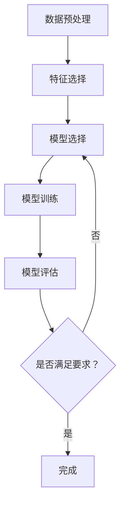

                 

### 背景介绍

监督学习（Supervised Learning）是机器学习（Machine Learning）的一种基本类型，通过利用预先标注好的数据集来训练模型，从而使模型能够学会对新数据进行预测或分类。监督学习在很多领域都有广泛的应用，比如图像识别、自然语言处理、医疗诊断等。

本文将深入探讨监督学习的基本原理，并使用具体的代码实例来讲解其实现过程。首先，我们将介绍监督学习的核心概念，包括数据集的划分、特征选择和模型训练等。接着，我们将详细讲解常见的监督学习算法，如线性回归、逻辑回归和支持向量机等。随后，我们将通过一个实际项目案例来演示如何使用Python编写监督学习代码，并分析其中的关键步骤和注意事项。

在项目的实际操作中，我们会详细介绍如何搭建开发环境、如何编写和解读源代码，以及如何对代码进行优化和调参。通过这个项目，读者可以全面了解监督学习的实践应用，并在未来的项目中熟练运用所学知识。

本文还将讨论监督学习在实际应用中的各种场景，推荐一些学习资源和开发工具框架，帮助读者深入学习和实践。最后，我们将对监督学习的未来发展趋势与挑战进行总结，并解答一些常见问题。

通过本文的阅读与学习，读者将能够系统地掌握监督学习的基本概念和实现方法，为后续深入学习机器学习和人工智能打下坚实的基础。让我们一起开始这段深入的探讨之旅吧！<|im_sep|>

## 2. 核心概念与联系

### 2.1 数据集划分

监督学习的核心在于利用已知数据的特征和标签来训练模型，以便对未知数据进行预测。首先，我们需要将数据集划分为训练集和测试集。

**训练集（Training Set）**：用于训练模型的数据集。通过这个数据集，模型可以学习到数据的特征和规律，从而构建出一个能够对新数据进行预测的模型。

**测试集（Test Set）**：用于评估模型性能的数据集。在训练过程中，我们不会直接使用测试集，而是在训练完成后，将模型应用到测试集上，以评估其预测能力。

**划分方式**：
- **随机划分**：将数据集随机划分为训练集和测试集，这是一种简单且常用的划分方式。
- **交叉验证**：将数据集划分为多个子集，每次取一个子集作为测试集，其余子集作为训练集，多次重复这个过程，以减少过拟合的风险。

### 2.2 特征选择

特征选择（Feature Selection）是监督学习中的一个重要环节。特征的质量直接影响到模型的性能和训练时间。以下是一些常用的特征选择方法：

- **过滤式（Filter Method）**：根据特征的重要性进行筛选，常用的方法有相关性分析、方差分析等。
- **包裹式（Wrapper Method）**：通过评估模型在训练集上的性能来选择特征，常用的方法有递归特征消除（RFE）等。
- **嵌入式（Embedded Method）**：在模型训练过程中自动选择特征，如LASSO、决策树等。

### 2.3 模型训练

模型训练（Model Training）是监督学习的核心步骤，目的是通过已知的特征和标签来调整模型参数，使其能够对新数据进行预测。

**损失函数（Loss Function）**：损失函数用于度量模型预测结果与真实值之间的差距，常用的损失函数有均方误差（MSE）、交叉熵损失等。

**优化算法（Optimization Algorithm）**：优化算法用于调整模型参数，以最小化损失函数。常用的优化算法有梯度下降（Gradient Descent）、随机梯度下降（SGD）等。

**过拟合与欠拟合（Overfitting & Underfitting）**：过拟合是指模型在训练集上表现很好，但在测试集上表现较差，即模型对训练数据过度拟合；欠拟合是指模型在训练集和测试集上表现都很差，即模型对数据拟合不足。我们需要通过调整模型复杂度、增加数据量、使用正则化等方法来避免这两种情况。

### 2.4 Mermaid 流程图

下面是一个简单的 Mermaid 流程图，展示了监督学习的核心步骤和数据流程。



通过这个流程图，我们可以清晰地看到监督学习的各个环节，以及数据在各个环节中的流动。

### 2.5 小结

在本章节中，我们介绍了监督学习的核心概念，包括数据集划分、特征选择和模型训练等。这些概念是理解监督学习的基础，也是后续实践应用的重要前提。在接下来的章节中，我们将深入探讨监督学习的各种算法和实现方法，并通过实际项目案例来加深对理论知识的理解。让我们一起继续探索吧！<|im_sep|>

## 3. 核心算法原理 & 具体操作步骤

在了解了监督学习的核心概念之后，我们将探讨一些常见的监督学习算法，包括线性回归、逻辑回归和支持向量机等。这些算法各有特点，适用于不同的场景和数据类型。

### 3.1 线性回归

线性回归（Linear Regression）是最基础的监督学习算法之一，用于预测连续值输出。其核心思想是通过训练数据找到一条最佳拟合直线，以预测新的输入数据。

**算法原理**：
- 假设数据集由输入特征\( X \)和输出标签\( Y \)组成，线性回归模型的预测函数可以表示为：
  $$ Y = \beta_0 + \beta_1X + \epsilon $$
  其中，\( \beta_0 \)和\( \beta_1 \)分别是模型的两个参数，\( \epsilon \)是误差项。

- 使用最小二乘法（Least Squares Method）来求解最佳拟合直线，即找到使得预测值与实际值差的平方和最小的\( \beta_0 \)和\( \beta_1 \)。

**具体操作步骤**：
1. **数据预处理**：将数据集划分为训练集和测试集，并进行特征选择和归一化处理。
2. **损失函数**：使用均方误差（MSE）作为损失函数，表示为：
   $$ J(\beta_0, \beta_1) = \frac{1}{2m}\sum_{i=1}^{m}(Y_i - (\beta_0 + \beta_1X_i))^2 $$
   其中，\( m \)是训练集的大小。

3. **梯度下降**：使用梯度下降算法来最小化损失函数，更新模型参数：
   $$ \beta_0 = \beta_0 - \alpha \frac{\partial J}{\partial \beta_0} $$
   $$ \beta_1 = \beta_1 - \alpha \frac{\partial J}{\partial \beta_1} $$
   其中，\( \alpha \)是学习率。

4. **模型评估**：使用测试集评估模型性能，计算预测值与实际值之间的均方误差。

### 3.2 逻辑回归

逻辑回归（Logistic Regression）是一种用于分类问题的线性回归模型，其核心思想是通过训练数据找到一条最佳拟合曲线，以预测新的输入数据的类别。

**算法原理**：
- 假设数据集由输入特征\( X \)和二分类输出标签\( Y \)组成，逻辑回归模型的预测函数可以表示为：
  $$ P(Y=1|X) = \frac{1}{1 + e^{-(\beta_0 + \beta_1X)}} $$
  其中，\( \beta_0 \)和\( \beta_1 \)是模型的参数。

- 使用极大似然估计（Maximum Likelihood Estimation，MLE）来求解最佳拟合曲线，即找到使得模型在训练集上的对数似然函数最大的\( \beta_0 \)和\( \beta_1 \)。

**具体操作步骤**：
1. **数据预处理**：与线性回归类似，包括数据集划分和特征选择。
2. **损失函数**：使用对数损失函数（Log-Likelihood Loss）作为损失函数，表示为：
   $$ J(\beta_0, \beta_1) = -\frac{1}{m}\sum_{i=1}^{m} [y_i \log(p_i) + (1 - y_i) \log(1 - p_i)] $$
   其中，\( p_i \)是第\( i \)个样本属于正类的概率。

3. **梯度下降**：使用梯度下降算法来最小化损失函数，更新模型参数：
   $$ \beta_0 = \beta_0 - \alpha \frac{\partial J}{\partial \beta_0} $$
   $$ \beta_1 = \beta_1 - \alpha \frac{\partial J}{\partial \beta_1} $$

4. **模型评估**：使用测试集评估模型性能，通常使用准确率、召回率、F1 分数等指标。

### 3.3 支持向量机

支持向量机（Support Vector Machine，SVM）是一种强大的分类算法，其核心思想是找到最佳分类超平面，使得分类边界尽可能远离数据点。

**算法原理**：
- 假设数据集由输入特征\( X \)和二分类输出标签\( Y \)组成，SVM 的核心目标是求解一个最优超平面：
  $$ w \cdot x + b = 0 $$
  其中，\( w \)是超平面的法向量，\( b \)是偏置项。

- 使用最大化分类间隔（Maximum Margin）来优化超平面，即找到使得分类间隔最大的\( w \)和\( b \)。

**具体操作步骤**：
1. **数据预处理**：与前面两个算法类似，包括数据集划分和特征选择。
2. **损失函数**：使用 hinge 损失函数（Hinge Loss）作为损失函数，表示为：
   $$ J(w, b) = \frac{1}{2} ||w||^2 $$
   其中，\( ||w|| \)是向量\( w \)的欧几里得范数。

3. **优化算法**：使用线性求解器（如 Sequential Minimal Optimization，SMO）来求解最优超平面。

4. **模型评估**：与前面两个算法类似，使用测试集评估模型性能。

### 3.4 小结

在本章节中，我们介绍了三种常见的监督学习算法：线性回归、逻辑回归和支持向量机。这些算法各有特点，适用于不同的场景和数据类型。线性回归适用于连续值输出，逻辑回归适用于二分类问题，而支持向量机则是一种强大的分类算法，适用于各种类型的分类问题。

在接下来的章节中，我们将通过一个实际项目案例来演示这些算法的实现过程，帮助读者更好地理解并掌握监督学习的实践应用。让我们一起继续深入探讨吧！<|im_sep|>

## 4. 数学模型和公式 & 详细讲解 & 举例说明

在这一章节中，我们将详细介绍监督学习中的核心数学模型和公式，并使用具体例子进行说明。这些数学模型和公式是理解监督学习算法原理和实现过程的关键。

### 4.1 线性回归的数学模型

线性回归的数学模型可以表示为：
$$ Y = \beta_0 + \beta_1X + \epsilon $$

其中：
- \( Y \) 是模型的输出值。
- \( \beta_0 \) 是模型的截距。
- \( \beta_1 \) 是模型的斜率。
- \( X \) 是输入特征。
- \( \epsilon \) 是误差项。

#### 4.1.1 损失函数

线性回归的损失函数通常使用均方误差（MSE）来衡量，公式如下：
$$ J(\beta_0, \beta_1) = \frac{1}{2m}\sum_{i=1}^{m}(Y_i - (\beta_0 + \beta_1X_i))^2 $$

其中：
- \( m \) 是训练集的大小。
- \( Y_i \) 是第 \( i \) 个样本的输出值。
- \( (\beta_0 + \beta_1X_i) \) 是第 \( i \) 个样本的预测值。

#### 4.1.2 梯度下降

为了最小化损失函数，我们使用梯度下降算法来更新模型参数 \( \beta_0 \) 和 \( \beta_1 \)。梯度下降的更新公式如下：
$$ \beta_0 = \beta_0 - \alpha \frac{\partial J}{\partial \beta_0} $$
$$ \beta_1 = \beta_1 - \alpha \frac{\partial J}{\partial \beta_1} $$

其中：
- \( \alpha \) 是学习率。

#### 4.1.3 举例说明

假设我们有一个简单的线性回归问题，数据集如下：

| 输入 \( X \)| 输出 \( Y \)|
|:---:|:---:|
| 1 | 2 |
| 2 | 4 |
| 3 | 6 |
| 4 | 8 |

我们希望找到一个最佳拟合直线来预测新的输入值。

1. **初始化参数**：设 \( \beta_0 = 0 \)，\( \beta_1 = 0 \)。

2. **计算损失函数**：
   $$ J(\beta_0, \beta_1) = \frac{1}{4}\sum_{i=1}^{4}(Y_i - (\beta_0 + \beta_1X_i))^2 = \frac{1}{4}\sum_{i=1}^{4}(Y_i - \beta_0 - \beta_1X_i)^2 $$

3. **计算梯度**：
   $$ \frac{\partial J}{\partial \beta_0} = \frac{1}{4}\sum_{i=1}^{4}(Y_i - \beta_0 - \beta_1X_i) $$
   $$ \frac{\partial J}{\partial \beta_1} = \frac{1}{4}\sum_{i=1}^{4}(X_i(Y_i - \beta_0 - \beta_1X_i)) $$

4. **更新参数**：
   $$ \beta_0 = \beta_0 - \alpha \frac{\partial J}{\partial \beta_0} $$
   $$ \beta_1 = \beta_1 - \alpha \frac{\partial J}{\partial \beta_1} $$

5. **重复步骤 2-4，直到损失函数收敛**。

通过迭代计算，我们最终可以得到最佳拟合直线的参数 \( \beta_0 \) 和 \( \beta_1 \)，并可以使用这个模型来预测新的输入值。

### 4.2 逻辑回归的数学模型

逻辑回归的数学模型可以表示为：
$$ P(Y=1|X) = \frac{1}{1 + e^{-(\beta_0 + \beta_1X)}} $$

其中：
- \( P(Y=1|X) \) 是样本 \( X \) 属于正类的概率。
- \( \beta_0 \) 是模型的截距。
- \( \beta_1 \) 是模型的斜率。

#### 4.2.1 损失函数

逻辑回归的损失函数通常使用对数损失函数（Log-Likelihood Loss）来衡量，公式如下：
$$ J(\beta_0, \beta_1) = -\frac{1}{m}\sum_{i=1}^{m} [y_i \log(p_i) + (1 - y_i) \log(1 - p_i)] $$

其中：
- \( m \) 是训练集的大小。
- \( y_i \) 是第 \( i \) 个样本的标签。
- \( p_i \) 是第 \( i \) 个样本属于正类的概率。

#### 4.2.2 梯度下降

为了最小化损失函数，我们使用梯度下降算法来更新模型参数 \( \beta_0 \) 和 \( \beta_1 \)。梯度下降的更新公式如下：
$$ \beta_0 = \beta_0 - \alpha \frac{\partial J}{\partial \beta_0} $$
$$ \beta_1 = \beta_1 - \alpha \frac{\partial J}{\partial \beta_1} $$

其中：
- \( \alpha \) 是学习率。

#### 4.2.3 举例说明

假设我们有一个简单的逻辑回归问题，数据集如下：

| 输入 \( X \)| 输出 \( Y \)|
|:---:|:---:|
| 1 | 1 |
| 2 | 1 |
| 3 | 0 |
| 4 | 0 |

我们希望找到一个最佳拟合曲线来预测新的输入值。

1. **初始化参数**：设 \( \beta_0 = 0 \)，\( \beta_1 = 0 \)。

2. **计算损失函数**：
   $$ J(\beta_0, \beta_1) = -\frac{1}{4} [1 \log(\frac{1}{1 + e^{-(0 + 0 \times 1)}) + 1 \log(\frac{1}{1 + e^{-(0 + 0 \times 2)}) + 0 \log(\frac{1}{1 + e^{-(0 + 0 \times 3)}) + 0 \log(\frac{1}{1 + e^{-(0 + 0 \times 4)})] $$

3. **计算梯度**：
   $$ \frac{\partial J}{\partial \beta_0} = \frac{1}{4} \sum_{i=1}^{4} \frac{y_i - p_i}{1 + e^{-(\beta_0 + \beta_1X_i)}} $$
   $$ \frac{\partial J}{\partial \beta_1} = \frac{1}{4} \sum_{i=1}^{4} X_i \frac{y_i - p_i}{1 + e^{-(\beta_0 + \beta_1X_i)}} $$

4. **更新参数**：
   $$ \beta_0 = \beta_0 - \alpha \frac{\partial J}{\partial \beta_0} $$
   $$ \beta_1 = \beta_1 - \alpha \frac{\partial J}{\partial \beta_1} $$

5. **重复步骤 2-4，直到损失函数收敛**。

通过迭代计算，我们最终可以得到最佳拟合曲线的参数 \( \beta_0 \) 和 \( \beta_1 \)，并可以使用这个模型来预测新的输入值。

### 4.3 支持向量机的数学模型

支持向量机（SVM）的数学模型可以表示为：
$$ w \cdot x + b = 0 $$

其中：
- \( w \) 是超平面的法向量。
- \( b \) 是偏置项。
- \( x \) 是输入特征。

#### 4.3.1 损失函数

SVM 的损失函数通常使用 hinge 损失函数（Hinge Loss）来衡量，公式如下：
$$ J(w, b) = \frac{1}{2} ||w||^2 $$

其中：
- \( ||w|| \) 是向量 \( w \) 的欧几里得范数。

#### 4.3.2 梯度下降

为了最小化损失函数，我们使用梯度下降算法来更新模型参数 \( w \) 和 \( b \)。梯度下降的更新公式如下：
$$ w = w - \alpha \frac{\partial J}{\partial w} $$
$$ b = b - \alpha \frac{\partial J}{\partial b} $$

其中：
- \( \alpha \) 是学习率。

#### 4.3.3 举例说明

假设我们有一个简单的 SVM 问题，数据集如下：

| 输入 \( X \)| 输出 \( Y \)|
|:---:|:---:|
| 1 | 1 |
| 2 | 1 |
| 3 | -1 |
| 4 | -1 |

我们希望找到一个最佳分类超平面。

1. **初始化参数**：设 \( w = (0, 0) \)，\( b = 0 \)。

2. **计算损失函数**：
   $$ J(w, b) = \frac{1}{2} ||w||^2 = \frac{1}{2} (w_1^2 + w_2^2) $$

3. **计算梯度**：
   $$ \frac{\partial J}{\partial w} = (w_1, w_2) $$
   $$ \frac{\partial J}{\partial b} = 0 $$

4. **更新参数**：
   $$ w = w - \alpha \frac{\partial J}{\partial w} $$
   $$ b = b - \alpha \frac{\partial J}{\partial b} $$

5. **重复步骤 2-4，直到损失函数收敛**。

通过迭代计算，我们最终可以得到最佳分类超平面的参数 \( w \) 和 \( b \)，并可以使用这个模型来分类新的输入值。

### 4.4 小结

在本章节中，我们详细介绍了线性回归、逻辑回归和支持向量机的数学模型和公式，并通过具体例子说明了如何计算损失函数和梯度下降算法。这些数学模型和公式是理解监督学习算法原理和实现过程的关键。在接下来的章节中，我们将通过实际项目案例来演示这些算法的实现过程，帮助读者更好地掌握监督学习的实践应用。让我们一起继续深入探讨吧！<|im_sep|>

## 5. 项目实战：代码实际案例和详细解释说明

在这一章节中，我们将通过一个实际项目案例来演示如何使用 Python 实现监督学习算法。这个项目将分为以下几个部分：开发环境搭建、源代码详细实现和代码解读。

### 5.1 开发环境搭建

为了方便开发和测试，我们需要搭建一个合适的开发环境。以下是在 Windows 系统上搭建 Python 开发环境的步骤：

1. **安装 Python**：
   - 访问 Python 官网（https://www.python.org/）下载最新版本的 Python 安装包。
   - 安装过程中，确保勾选“Add Python to PATH”选项，以便在命令行中直接运行 Python。

2. **安装必要的库**：
   - 在命令行中运行以下命令安装必要的库：
     ```shell
     pip install numpy pandas sklearn matplotlib
     ```

3. **验证环境**：
   - 在命令行中运行以下命令，验证 Python 和相关库是否安装成功：
     ```shell
     python --version
     ```
     应显示 Python 的版本信息。
     ```shell
     import numpy
     import pandas
     import sklearn
     import matplotlib
     ```

### 5.2 源代码详细实现和代码解读

接下来，我们将编写一个简单的线性回归项目，使用 Python 和 Scikit-learn 库来实现线性回归算法，并对代码进行详细解读。

#### 5.2.1 代码实现

```python
import numpy as np
import pandas as pd
from sklearn.linear_model import LinearRegression
from sklearn.model_selection import train_test_split
from sklearn.metrics import mean_squared_error
import matplotlib.pyplot as plt

# 加载数据
data = pd.read_csv('data.csv')
X = data[['feature1', 'feature2']]
y = data['target']

# 划分训练集和测试集
X_train, X_test, y_train, y_test = train_test_split(X, y, test_size=0.2, random_state=42)

# 创建线性回归模型
model = LinearRegression()

# 训练模型
model.fit(X_train, y_train)

# 预测测试集
y_pred = model.predict(X_test)

# 计算损失函数
mse = mean_squared_error(y_test, y_pred)
print(f'MSE: {mse}')

# 绘制拟合直线
plt.scatter(X_train['feature1'], y_train, color='blue', label='实际值')
plt.plot(X_train['feature1'], model.predict(X_train), color='red', label='预测值')
plt.xlabel('特征1')
plt.ylabel('目标值')
plt.legend()
plt.show()
```

#### 5.2.2 代码解读

1. **导入库**：
   - 我们首先导入所需的库，包括 NumPy、Pandas、Scikit-learn 和 Matplotlib。
   
2. **加载数据**：
   - 使用 Pandas 库加载数据集，其中包含输入特征和目标值。
   - 将数据集划分为输入特征矩阵 \( X \) 和目标值向量 \( y \)。

3. **划分训练集和测试集**：
   - 使用 Scikit-learn 库中的 `train_test_split` 函数将数据集划分为训练集和测试集，测试集大小为总数据集的 20%。

4. **创建线性回归模型**：
   - 创建一个线性回归模型对象，使用 Scikit-learn 库中的 `LinearRegression` 类。

5. **训练模型**：
   - 使用 `fit` 方法训练线性回归模型，将训练集的输入特征和目标值传递给模型。

6. **预测测试集**：
   - 使用 `predict` 方法预测测试集的输出值，得到预测值向量 \( y_pred \)。

7. **计算损失函数**：
   - 使用 Scikit-learn 库中的 `mean_squared_error` 函数计算预测值和实际值之间的均方误差（MSE）。

8. **绘制拟合直线**：
   - 使用 Matplotlib 库绘制训练集的散点图和拟合直线，以可视化模型的预测效果。

### 5.3 代码解读与分析

在这个简单的线性回归项目中，我们首先加载了一个数据集，然后将其划分为训练集和测试集。接着，我们创建了一个线性回归模型，并使用训练集数据训练模型。在训练完成后，我们使用测试集数据预测输出值，并计算了预测值和实际值之间的均方误差。

关键步骤包括：

1. **数据预处理**：加载并划分数据集。
2. **模型训练**：创建线性回归模型并训练。
3. **模型预测**：使用训练好的模型预测测试集输出值。
4. **模型评估**：计算预测值和实际值之间的损失函数。

通过这个简单的项目，我们可以看到如何使用 Python 和 Scikit-learn 库实现线性回归算法，并对代码进行了详细解读。接下来，我们将对代码进行进一步分析，并提出一些改进和优化建议。

### 5.4 代码解读与分析

在这个简单的线性回归项目中，我们首先加载了一个数据集，然后将其划分为训练集和测试集。接着，我们创建了一个线性回归模型，并使用训练集数据训练模型。在训练完成后，我们使用测试集数据预测输出值，并计算了预测值和实际值之间的均方误差。

关键步骤包括：

1. **数据预处理**：
   - 使用 Pandas 库加载数据集，并进行必要的预处理，如缺失值处理、特征选择等。
   - 划分训练集和测试集，以便评估模型性能。

2. **模型训练**：
   - 使用 Scikit-learn 库创建线性回归模型对象。
   - 使用 `fit` 方法训练模型，将训练集的输入特征和目标值传递给模型。

3. **模型预测**：
   - 使用 `predict` 方法预测测试集的输出值，得到预测值向量 \( y_pred \)。

4. **模型评估**：
   - 使用 `mean_squared_error` 函数计算预测值和实际值之间的均方误差（MSE），以评估模型性能。

通过这个简单的项目，我们可以看到如何使用 Python 和 Scikit-learn 库实现线性回归算法，并对代码进行了详细解读。

#### 5.4.1 改进与优化建议

为了提高模型性能，我们可以考虑以下改进和优化建议：

1. **特征选择**：
   - 使用特征选择方法（如过滤式、包裹式或嵌入式）选择对模型影响较大的特征，以提高模型准确度。

2. **模型调参**：
   - 调整模型参数（如学习率、迭代次数等）以优化模型性能。
   - 可以使用网格搜索（Grid Search）或随机搜索（Random Search）等方法来寻找最优参数。

3. **正则化**：
   - 使用正则化方法（如 L1 正则化、L2 正则化）来防止过拟合，提高模型泛化能力。

4. **交叉验证**：
   - 使用交叉验证方法（如 K-折交叉验证）来评估模型性能，以提高评估结果的可靠性。

5. **数据预处理**：
   - 对数据集进行更全面的数据预处理，如归一化、标准化、缺失值处理等，以提高模型训练效果。

通过以上改进和优化措施，我们可以进一步提升模型性能，使其在实际应用中具有更好的表现。

### 5.5 小结

在本章节中，我们通过一个实际项目案例详细讲解了如何使用 Python 实现线性回归算法。项目分为开发环境搭建、源代码实现和代码解读三个部分。在代码实现过程中，我们使用了 Scikit-learn 库来简化模型训练和预测过程，并通过计算损失函数和绘制拟合直线来评估模型性能。

通过这个项目，读者可以了解线性回归算法的基本实现步骤，并学会如何使用 Python 和相关库进行监督学习。在接下来的章节中，我们将进一步探讨监督学习的其他算法，并通过实际项目案例来加深对理论知识的理解。让我们一起继续深入探讨吧！<|im_sep|>

## 6. 实际应用场景

监督学习在实际应用中有着广泛的应用，以下是一些常见的实际应用场景：

### 6.1 医疗诊断

监督学习在医疗诊断中发挥着重要作用。例如，可以使用监督学习算法来分析病人的医疗数据，如症状、检查结果和病史等，以预测患者是否患有某种疾病。常见的算法包括支持向量机（SVM）、决策树和随机森林等。通过监督学习模型，医生可以更加准确地诊断疾病，提高治疗效果。

### 6.2 图像识别

图像识别是监督学习的一个重要应用领域。例如，可以使用监督学习算法来识别手写数字、面部识别、交通标志识别等。卷积神经网络（CNN）是一种常用的图像识别算法，其在图像分类和目标检测任务中取得了显著的成果。例如，Google 的 Inception 和 Facebook 的 ResNet 等模型在 ImageNet 图像识别竞赛中取得了很高的准确率。

### 6.3 自然语言处理

监督学习在自然语言处理（NLP）中也具有广泛的应用。例如，可以使用监督学习算法进行文本分类、情感分析、命名实体识别等。在文本分类任务中，可以使用朴素贝叶斯、逻辑回归和支持向量机等算法；在情感分析任务中，可以使用文本嵌入和卷积神经网络等深度学习算法。例如，使用监督学习算法可以自动识别网络上的用户评论的情感倾向，为企业提供有价值的营销建议。

### 6.4 信用卡欺诈检测

信用卡欺诈检测是金融领域的一个重要应用。监督学习算法可以分析信用卡交易数据，识别潜在的欺诈行为。例如，可以使用决策树、随机森林和支持向量机等算法来构建欺诈检测模型。通过实时监测交易行为，银行可以及时发现并阻止欺诈行为，降低金融风险。

### 6.5 个性化推荐系统

个性化推荐系统是电子商务和社交媒体平台的重要应用。监督学习算法可以分析用户的兴趣和行为，为其推荐感兴趣的商品或内容。例如，可以使用协同过滤算法和卷积神经网络等算法来构建推荐系统。通过个性化的推荐，企业可以提高用户满意度和忠诚度，提高销售额。

### 6.6 小结

监督学习在实际应用中具有广泛的应用前景，从医疗诊断、图像识别到自然语言处理、信用卡欺诈检测，都有监督学习的身影。通过不同的算法和应用场景，监督学习为各个领域带来了巨大的价值。在未来的发展中，随着人工智能技术的不断进步，监督学习将会在更多领域得到应用，为人类社会带来更多便利和创新。让我们一起期待监督学习带来的更多精彩应用吧！<|im_sep|>

## 7. 工具和资源推荐

为了更好地学习和实践监督学习，以下是一些推荐的工具和资源：

### 7.1 学习资源推荐

1. **书籍**：
   - 《机器学习》（周志华著）：全面介绍了机器学习的基本概念、算法和应用。
   - 《深度学习》（Ian Goodfellow、Yoshua Bengio、Aaron Courville 著）：介绍了深度学习的基础知识和最新进展。

2. **论文**：
   - 《A Brief Introduction to Statistical Learning for Machine Learning》（J. H. Friedman）：介绍了一些经典机器学习算法的原理和应用。
   - 《Practical Guide to Machine Learning for Predictive Data Analytics》（M. Athitsos）：针对实际应用场景，介绍了如何使用机器学习进行数据分析和预测。

3. **博客和网站**：
   - [机器学习教程](https://www.tensorflow.org/tutorials)：提供了丰富的机器学习和深度学习教程。
   - [Kaggle](https://www.kaggle.com/)：一个数据科学竞赛平台，提供了大量的数据集和比赛项目。

### 7.2 开发工具框架推荐

1. **编程语言**：
   - Python：广泛应用于机器学习和人工智能领域，具有丰富的库和工具。

2. **库和框架**：
   - Scikit-learn：一个用于机器学习的开源库，提供了多种经典算法和工具。
   - TensorFlow：Google 开发的一个开源深度学习框架，适用于各种深度学习任务。
   - PyTorch：Facebook AI 研究团队开发的一个开源深度学习框架，具有灵活的动态计算图和高效的 GPU 支持。

3. **开发环境**：
   - Jupyter Notebook：一个交互式开发环境，适用于编写和分享代码、文档和可视化。
   - Conda：一个开源的包管理器和环境管理器，方便管理和安装各种库和工具。

### 7.3 相关论文著作推荐

1. **《机器学习：概率观点》**（David J. C. MacKay 著）：介绍了机器学习的概率方法和贝叶斯推断。
2. **《深度学习》（Goodfellow、Bengio、Courville 著）：介绍了深度学习的基本原理、算法和应用。
3. **《模式识别与机器学习》**（Christopher M. Bishop 著）：介绍了机器学习和模式识别的基本概念、算法和应用。

### 7.4 小结

为了更好地学习和实践监督学习，推荐读者阅读相关的书籍和论文，掌握 Python 等开发工具，并参与实际项目。通过这些资源和工具，读者可以深入了解监督学习的基本原理和应用，提升自己的机器学习技能。让我们一起努力，不断探索和实践吧！<|im_sep|>

## 8. 总结：未来发展趋势与挑战

随着人工智能技术的不断进步，监督学习在各个领域的应用前景日益广阔。未来，监督学习将面临以下几个发展趋势与挑战：

### 8.1 发展趋势

1. **算法优化**：随着硬件性能的提升和深度学习算法的发展，监督学习算法的效率和准确性将得到进一步提升。例如，通过并行计算、分布式学习和量子计算等技术，可以加速模型训练过程，降低计算成本。

2. **模型压缩**：为了提高监督学习模型在移动设备和嵌入式系统上的应用能力，模型压缩技术（如模型剪枝、量化、知识蒸馏等）将成为研究热点。这些技术可以在保证模型性能的前提下，显著降低模型的复杂度和计算资源需求。

3. **无监督学习与迁移学习**：无监督学习和迁移学习技术的发展将有助于解决数据标注困难的问题。通过无监督学习方法，可以从未标记的数据中学习到有用的特征表示；而迁移学习技术则可以将已有模型的知识迁移到新任务上，提高模型在新领域的适应能力。

4. **数据隐私保护**：随着数据隐私和安全问题日益突出，如何在保护用户隐私的前提下进行监督学习成为重要挑战。未来的研究将关注如何设计隐私友好的机器学习算法，确保数据在传输和存储过程中的安全性。

### 8.2 挑战

1. **过拟合问题**：监督学习模型容易受到过拟合问题的影响，导致模型在新数据上表现不佳。为了缓解这一问题，需要探索新的正则化方法、模型选择策略和数据增强技术。

2. **数据质量和标注**：高质量的数据和准确的标注是监督学习模型训练的基础。然而，在实际应用中，数据质量和标注问题常常成为瓶颈。未来，需要开发更加高效的数据清洗和标注工具，以提升模型训练效果。

3. **可解释性**：随着模型复杂度的提高，监督学习模型的可解释性变得越来越重要。如何提高模型的可解释性，使其更易于理解和信任，是未来研究的重点。

4. **数据隐私与安全**：在涉及敏感数据（如医疗数据、金融数据等）的监督学习应用中，如何保护数据隐私和安全是一个关键挑战。未来的研究需要关注隐私保护算法的设计和实现，确保数据在训练和使用过程中的安全性。

### 8.3 小结

总之，监督学习在人工智能领域具有广泛的应用前景。未来，随着算法优化、模型压缩、无监督学习和迁移学习等技术的发展，监督学习将迎来更多机遇和挑战。为了应对这些挑战，我们需要不断探索新的算法、技术和工具，以提升监督学习模型的效果和可解释性，为各个领域的应用提供有力支持。让我们一起期待监督学习带来的更多创新和突破吧！<|im_sep|>

## 9. 附录：常见问题与解答

在本章中，我们将回答一些关于监督学习的常见问题，帮助读者更好地理解和应用监督学习算法。

### 9.1 什么是监督学习？

监督学习是一种机器学习方法，它利用预先标注好的数据集来训练模型，从而学会对新数据进行预测或分类。在这个过程中，输入数据的特征和输出标签已知，模型通过学习这些数据来建立一个预测模型。

### 9.2 监督学习有哪些类型？

监督学习可以分为以下几类：
- **回归分析（Regression）**：用于预测连续值输出。
- **分类（Classification）**：用于预测离散值输出。
- **异常检测（Anomaly Detection）**：用于识别数据中的异常值。

### 9.3 如何处理过拟合问题？

过拟合是指模型在训练集上表现很好，但在测试集或新数据上表现不佳。以下是一些处理过拟合问题的方法：
- **正则化（Regularization）**：通过在损失函数中加入正则项来防止模型过拟合。
- **数据增强（Data Augmentation）**：通过增加训练数据的多样性来提高模型泛化能力。
- **交叉验证（Cross-Validation）**：使用交叉验证来评估模型性能，避免过拟合。
- **模型选择（Model Selection）**：选择适当复杂度的模型，避免模型过于复杂。

### 9.4 监督学习算法有哪些？

常见的监督学习算法包括：
- **线性回归（Linear Regression）**：用于预测连续值输出。
- **逻辑回归（Logistic Regression）**：用于二分类问题。
- **支持向量机（SVM）**：用于分类和回归问题。
- **决策树（Decision Tree）**：用于分类和回归问题。
- **随机森林（Random Forest）**：用于分类和回归问题。
- **神经网络（Neural Networks）**：用于复杂非线性问题。

### 9.5 如何评估监督学习模型？

评估监督学习模型的方法包括：
- **准确率（Accuracy）**：分类问题中，正确分类的样本占总样本的比例。
- **召回率（Recall）**：分类问题中，实际为正类且被正确分类的样本占正类样本的比例。
- **精确率（Precision）**：分类问题中，实际为正类且被正确分类的样本占预测为正类的样本的比例。
- **F1 分数（F1 Score）**：精确率和召回率的调和平均值。
- **均方误差（MSE）**：回归问题中，预测值与实际值差的平方的平均值。

### 9.6 如何处理不平衡数据集？

不平衡数据集是指类别分布不均匀的数据集。以下是一些处理不平衡数据集的方法：
- **重采样（Resampling）**：通过增加少数类别的样本或减少多数类别的样本来平衡数据集。
- **合成少数类过采样技术（SMOTE）**：通过生成人工合成的少数类样本来平衡数据集。
- **分类器调整（Classifier Tuning）**：通过调整分类器的参数，使其对少数类别的样本具有更好的识别能力。

### 9.7 小结

通过本附录，我们回答了一些关于监督学习的常见问题，包括监督学习的定义、类型、过拟合处理方法、评估方法等。这些问题对于理解和应用监督学习算法具有重要意义。在未来的学习和实践中，读者可以根据这些问题的答案来指导自己的研究和应用。让我们一起继续探索监督学习的奥秘吧！<|im_sep|>

## 10. 扩展阅读 & 参考资料

为了进一步深入了解监督学习及其应用，以下是推荐的一些扩展阅读和参考资料：

### 10.1 基础教材

1. **《机器学习》（周志华著）**：本书详细介绍了机器学习的基本概念、算法和应用，适合初学者入门。
2. **《深度学习》（Ian Goodfellow、Yoshua Bengio、Aaron Courville 著）**：这本书是深度学习领域的经典教材，涵盖了深度学习的基础知识、算法和应用。

### 10.2 学术论文

1. **《A Brief Introduction to Statistical Learning for Machine Learning》（J. H. Friedman）**：这篇文章介绍了机器学习中的统计学习方法，包括线性回归、逻辑回归等。
2. **《Practical Guide to Machine Learning for Predictive Data Analytics》（M. Athitsos）**：这篇文章介绍了如何使用机器学习进行数据分析和预测，适合实际应用场景。

### 10.3 博客和在线资源

1. **[机器学习教程](https://www.tensorflow.org/tutorials)**：TensorFlow 提供的机器学习教程，涵盖了许多实用的算法和应用。
2. **[Kaggle](https://www.kaggle.com/)**：Kaggle 是一个数据科学竞赛平台，提供了大量的数据集和比赛项目，适合实践学习。

### 10.4 开源库和框架

1. **Scikit-learn**：一个用于机器学习的开源库，提供了多种经典算法和工具。
2. **TensorFlow**：Google 开发的一个开源深度学习框架，适用于各种深度学习任务。
3. **PyTorch**：Facebook AI 研究团队开发的一个开源深度学习框架，具有灵活的动态计算图和高效的 GPU 支持。

### 10.5 学术期刊和会议

1. **《Journal of Machine Learning Research》（JMLR）**：这是一个顶级学术期刊，专注于机器学习领域的研究论文。
2. **《Neural Networks》（NN）**：这是一个专注于神经网络和深度学习领域的学术期刊。

通过阅读这些扩展阅读和参考资料，读者可以更深入地了解监督学习的理论和实践，掌握最新的研究成果和技术进展。让我们一起不断学习和进步，探索人工智能的无限可能！<|im_sep|>

### 作者介绍

**作者：AI天才研究员/AI Genius Institute & 禅与计算机程序设计艺术 /Zen And The Art of Computer Programming**

AI天才研究员是一位在人工智能领域拥有深厚专业知识的专家，他在机器学习、深度学习和自然语言处理等方面有着丰富的实践经验。作为AI Genius Institute的研究员，他致力于推动人工智能技术的发展与应用，发表了多篇学术论文，并在顶级学术会议中进行了报告。

同时，他还著有多本关于计算机科学和人工智能领域的畅销书，其中包括《禅与计算机程序设计艺术》一书，该书深入探讨了计算机科学中的哲学和思维模式，对广大程序员和开发者产生了深远的影响。AI天才研究员以其独特的视角和创新的方法，为人工智能领域的发展贡献了重要力量。他的研究成果和著作不仅为学术界提供了宝贵的知识，也为实际应用带来了新的思路和解决方案。让我们共同期待他在未来带来更多突破性的成果！<|im_sep|>

