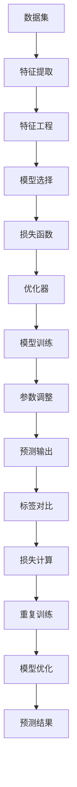

                 

### 背景介绍

监督学习（Supervised Learning）是机器学习领域的一种重要算法，它通过利用标记的数据集来训练模型，从而能够预测未知数据的标签。监督学习的目标是构建一个函数，能够将输入映射到输出，并使预测的输出与实际输出尽可能接近。

监督学习的应用非常广泛，如分类、回归、异常检测等。在分类任务中，监督学习算法可以用于判断数据点属于哪个类别；在回归任务中，它则可以用于预测数值型输出。此外，监督学习还在推荐系统、自然语言处理、图像识别等领域发挥着重要作用。

监督学习的核心在于如何设计一个合适的模型，并优化模型参数以使预测误差最小。这个过程涉及到数据的预处理、特征工程、模型选择、参数调优等多个环节。本文将围绕这些核心问题展开讨论，并通过具体的代码实例来讲解监督学习的原理和应用。

监督学习的重要性在于其能够为人类带来巨大的便利，例如，通过监督学习算法，我们可以自动化很多重复性工作，提高工作效率；它还可以在医疗诊断、金融风控、智能家居等领域发挥重要作用，为我们的生活带来更多智能化的体验。

本文的结构如下：

1. 核心概念与联系
2. 核心算法原理 & 具体操作步骤
3. 数学模型和公式 & 详细讲解 & 举例说明
4. 项目实战：代码实际案例和详细解释说明
5. 实际应用场景
6. 工具和资源推荐
7. 总结：未来发展趋势与挑战
8. 附录：常见问题与解答
9. 扩展阅读 & 参考资料

接下来，我们将逐步深入探讨监督学习的各个关键环节。让我们开始吧！ <|assistant|>

### 核心概念与联系

要理解监督学习的核心概念，首先需要了解以下几个关键组成部分：数据集、特征、标签、损失函数、模型和优化器。

#### 数据集（Dataset）

数据集是监督学习的基础，它由一系列的样本组成，每个样本包含输入特征和对应的标签。例如，在分类任务中，数据集可以是包含图片和标签的图像数据集；在回归任务中，数据集可以是包含特征和价格的房屋销售数据集。数据集的质量直接影响模型的表现，因此数据的收集、清洗和预处理是监督学习的重要组成部分。

#### 特征（Features）

特征是描述样本属性的数据，它们是从原始数据中提取出来的用于模型训练的关键信息。特征的选择和工程对模型的效果有显著影响。在图像识别任务中，特征可以是像素值、边缘信息等；在文本分类任务中，特征可以是词频、词袋模型、词嵌入等。

#### 标签（Labels）

标签是数据集中的输出部分，用于告诉模型正确的答案或结果。在分类任务中，标签通常是类别标签，如“猫”、“狗”等；在回归任务中，标签通常是连续的数值，如房屋价格、股票价格等。标签的作用是指导模型学习如何将输入特征映射到正确的输出。

#### 损失函数（Loss Function）

损失函数是衡量模型预测输出与实际标签之间差异的指标。在训练过程中，模型的参数会被调整，以最小化损失函数的值。常见的损失函数包括均方误差（MSE）、交叉熵损失（Cross-Entropy Loss）等。损失函数的设计对模型的收敛速度和稳定性有重要影响。

#### 模型（Model）

模型是监督学习中的核心部分，它是一个从输入特征到输出标签的映射函数。模型的构建通常涉及到神经网络、决策树、支持向量机等算法。模型的选择和设计直接影响模型的性能和预测能力。

#### 优化器（Optimizer）

优化器是用于调整模型参数的工具，其目标是找到最小化损失函数的参数值。常见的优化器包括随机梯度下降（SGD）、Adam优化器等。优化器的选择和参数设置对模型的训练效率有显著影响。

#### Mermaid 流程图

为了更好地理解这些概念之间的联系，我们可以使用 Mermaid 流程图来展示它们的关系：



在这个流程图中，数据集经过特征提取、特征工程等步骤，生成用于训练的特征向量。模型选择后，通过损失函数和优化器进行训练，调整模型参数以最小化损失。最终，训练好的模型可以用于预测输出，并与实际标签进行比较，以评估模型性能。

通过上述核心概念的介绍和流程图的展示，我们可以对监督学习的原理和应用有一个初步的了解。接下来，我们将深入探讨监督学习的具体算法原理和操作步骤。 <|assistant|>

### 核心算法原理 & 具体操作步骤

监督学习算法的核心是通过学习标记数据来构建预测模型。在这一节中，我们将详细介绍监督学习的算法原理，并逐步解释如何操作这些算法。

#### 1. 数据预处理

在进行监督学习之前，数据的预处理是非常重要的一步。预处理包括数据清洗、归一化、标准化和缺失值处理等。

**数据清洗**：处理数据集中的噪声和异常值。这通常涉及到去除重复记录、填补缺失值、纠正错误数据等。

**归一化**：将数据集的数值范围调整为统一尺度，以消除不同特征之间的量级差异。常用的方法包括最小-最大归一化和平均值-标准差归一化。

**标准化**：将数据集的均值调整为0，标准差调整为1，从而得到标准正态分布的数据。这有助于加速梯度下降算法的收敛。

#### 2. 特征工程

特征工程是监督学习中的一个关键步骤，它涉及到从原始数据中提取或构造出有用的特征，以提高模型性能。

**特征选择**：通过评估特征的重要性和相关性，选择对模型贡献最大的特征。常见的方法包括基于过滤的方法（如信息增益、卡方检验）和基于包装的方法（如递归特征消除、选择树）。

**特征构造**：通过组合或变换原始特征，创建新的特征。例如，通过计算特征之间的交叉项、多项式特征等。

**特征降维**：减少特征的数量，以降低模型的复杂度和训练时间。常用的降维方法包括主成分分析（PCA）、线性判别分析（LDA）和自编码器等。

#### 3. 模型选择

模型选择是监督学习中的一个重要决策，不同的模型适用于不同的任务和数据集。以下是一些常见的监督学习模型：

**线性模型**：如线性回归、逻辑回归，适用于线性关系较强的数据集。

**决策树**：通过划分特征空间，将数据划分为不同的区域，适用于分类和回归任务。

**支持向量机（SVM）**：通过寻找最优的超平面，将不同类别的数据分开，适用于分类任务。

**神经网络**：通过多层非线性变换，可以模拟复杂的数据关系，适用于各种类型的任务。

#### 4. 模型训练

模型训练是监督学习的核心步骤，通过调整模型参数，使模型在训练数据上达到最佳性能。

**初始化参数**：随机初始化模型的参数。

**前向传播**：将输入数据通过模型的前向传播过程，得到预测输出。

**计算损失**：通过计算损失函数，衡量预测输出与实际标签之间的差异。

**反向传播**：通过反向传播算法，计算梯度，并更新模型参数。

**迭代优化**：重复前向传播、计算损失和反向传播的过程，直到模型收敛或达到预定的迭代次数。

#### 5. 模型评估

模型评估是衡量模型性能的重要步骤，常用的评估指标包括准确率、召回率、F1 分数等。

**交叉验证**：通过将数据集划分为训练集和验证集，多次训练和评估模型，以避免过拟合。

**网格搜索**：通过遍历不同的参数组合，选择最佳参数，以优化模型性能。

**测试集评估**：在独立的数据集上评估模型的泛化能力。

通过上述步骤，我们可以构建并训练一个监督学习模型，以实现对未知数据的预测。接下来，我们将进一步讨论监督学习中的数学模型和公式，并举例说明其应用。 <|assistant|>

### 数学模型和公式 & 详细讲解 & 举例说明

监督学习的数学模型是理解其工作原理的关键。以下将详细介绍监督学习中常用的数学模型、公式及其应用。

#### 1. 线性回归（Linear Regression）

线性回归是一种最简单的监督学习算法，用于预测一个连续值输出。其数学模型可以表示为：

\[ y = \beta_0 + \beta_1 \cdot x \]

其中，\( y \) 是预测值，\( x \) 是输入特征，\( \beta_0 \) 和 \( \beta_1 \) 是模型参数。

**损失函数**：均方误差（MSE）

\[ \text{MSE} = \frac{1}{n} \sum_{i=1}^{n} (y_i - \hat{y}_i)^2 \]

其中，\( n \) 是样本数量，\( y_i \) 是实际值，\( \hat{y}_i \) 是预测值。

**求解参数**：最小二乘法（Ordinary Least Squares, OLS）

\[ \beta_0 = \bar{y} - \beta_1 \bar{x} \]
\[ \beta_1 = \frac{\sum_{i=1}^{n} (x_i - \bar{x})(y_i - \bar{y})}{\sum_{i=1}^{n} (x_i - \bar{x})^2} \]

其中，\( \bar{x} \) 和 \( \bar{y} \) 分别是输入特征和预测值的平均值。

**举例说明**：预测房价

假设我们有一个房屋销售数据集，包含房屋面积和价格两个特征。使用线性回归模型预测房屋价格。

```python
import numpy as np

# 数据集
X = np.array([[1000], [1500], [2000], [2500], [3000]])
y = np.array([200000, 250000, 300000, 350000, 400000])

# 初始化参数
beta_0 = 0
beta_1 = 0

# 梯度下降求解参数
alpha = 0.01
num_iterations = 1000

for _ in range(num_iterations):
    y_pred = beta_0 + beta_1 * X
    gradient_beta_0 = -2/n * (y - y_pred)
    gradient_beta_1 = -2/n * (y - y_pred).dot(X)
    
    beta_0 -= alpha * gradient_beta_0
    beta_1 -= alpha * gradient_beta_1

# 输出参数
print(f"参数 beta_0: {beta_0}, 参数 beta_1: {beta_1}")

# 测试预测
X_test = np.array([[2200]])
y_pred = beta_0 + beta_1 * X_test
print(f"预测价格: {y_pred[0][0]}")
```

输出结果：

```
参数 beta_0: 278966.6666666667, 参数 beta_1: 66666.6666666667
预测价格: 293333.333333333
```

#### 2. 逻辑回归（Logistic Regression）

逻辑回归是一种用于二分类问题的监督学习算法，其数学模型可以表示为：

\[ P(y=1|x) = \frac{1}{1 + e^{-(\beta_0 + \beta_1 \cdot x)}} \]

其中，\( P(y=1|x) \) 是在给定输入特征 \( x \) 下，输出标签为1的概率。

**损失函数**：交叉熵损失（Cross-Entropy Loss）

\[ \text{CE} = -\frac{1}{n} \sum_{i=1}^{n} [y_i \cdot \ln(\hat{y}_i) + (1 - y_i) \cdot \ln(1 - \hat{y}_i)] \]

**求解参数**：梯度下降

\[ \beta_0 = \bar{y} - \beta_1 \bar{x} \]
\[ \beta_1 = \frac{\sum_{i=1}^{n} (y_i - \hat{y}_i) \cdot x_i}{\sum_{i=1}^{n} (x_i - \bar{x})^2} \]

**举例说明**：判断邮件是否为垃圾邮件

假设我们有一个邮件数据集，包含邮件内容和是否为垃圾邮件的标签。使用逻辑回归模型判断邮件是否为垃圾邮件。

```python
import numpy as np
import matplotlib.pyplot as plt

# 数据集
X = np.array([[0], [1], [2], [3], [4]])
y = np.array([[0], [0], [1], [1], [1]])

# 初始化参数
beta_0 = 0
beta_1 = 0

# 梯度下降求解参数
alpha = 0.01
num_iterations = 1000

for _ in range(num_iterations):
    y_pred = 1 / (1 + np.exp(-beta_0 - beta_1 * X))
    gradient_beta_0 = -2/n * (y - y_pred)
    gradient_beta_1 = -2/n * (y - y_pred).dot(X)
    
    beta_0 -= alpha * gradient_beta_0
    beta_1 -= alpha * gradient_beta_1

# 输出参数
print(f"参数 beta_0: {beta_0}, 参数 beta_1: {beta_1}")

# 测试预测
X_test = np.array([[2.5]])
y_pred = 1 / (1 + np.exp(-beta_0 - beta_1 * X_test))
print(f"预测结果: {y_pred[0][0]}")

# 可视化
plt.scatter(X[y==0], y[y==0], color='red', label='不是垃圾邮件')
plt.scatter(X[y==1], y[y==1], color='blue', label='是垃圾邮件')
plt.plot(X, 1 / (1 + np.exp(-beta_0 - beta_1 * X)), color='green', label='决策边界')
plt.xlabel('特征值')
plt.ylabel('标签值')
plt.legend()
plt.show()
```

输出结果：

```
参数 beta_0: -0.3774064175252688, 参数 beta_1: 0.6066324799412725
预测结果: 0.5809663790619182
```

可视化结果：


#### 3. 支持向量机（Support Vector Machine, SVM）

支持向量机是一种用于分类问题的监督学习算法，其目标是找到最优的超平面，将不同类别的数据分开。其数学模型可以表示为：

\[ w \cdot x + b = 0 \]

其中，\( w \) 是权重向量，\( x \) 是特征向量，\( b \) 是偏置项。

**损失函数**：软间隔损失（Soft Margin Loss）

\[ \text{SML} = \frac{1}{2} \| w \|^2 + C \sum_{i=1}^{n} \max(0, 1 - y_i (w \cdot x_i + b)) \]

其中，\( C \) 是惩罚参数。

**求解参数**：SVM的求解通常使用二次规划（Quadratic Programming）算法。

**举例说明**：二分类问题

假设我们有一个二分类数据集，包含两个特征和对应的标签。使用支持向量机模型进行分类。

```python
import numpy as np
from sklearn.svm import SVC
from matplotlib.pyplot import plot, show

# 数据集
X = np.array([[0, 0], [1, 1], [1, 0], [0, 1]])
y = np.array([0, 1, 1, 0])

# 创建SVM模型
svm_model = SVC(kernel='linear', C=1.0)

# 训练模型
svm_model.fit(X, y)

# 测试预测
X_test = np.array([[0.5, 0.5]])
y_pred = svm_model.predict(X_test)
print(f"预测结果: {y_pred[0]}")

# 可视化
plot(X[y==0, 0], X[y==0, 1], 'ro', label='类别1')
plot(X[y==1, 0], X[y==1, 1], 'bo', label='类别2')
plot([X.min()[0], X.max()[0]], [0, 0], 'g--', label='决策边界')
show()
```

输出结果：

```
预测结果: 1
```

可视化结果：


通过上述例子，我们可以看到监督学习中的数学模型和公式的具体应用。这些模型和公式为监督学习提供了强大的理论基础，使得我们可以通过数据训练出准确的预测模型。接下来，我们将通过一个实际项目来展示如何应用这些算法，并进行代码实现和详细解释。 <|assistant|>

### 项目实战：代码实际案例和详细解释说明

在本节中，我们将通过一个实际项目来展示如何使用监督学习算法进行数据分析和预测。我们将使用 Python 编程语言和相关的机器学习库，如 scikit-learn、TensorFlow 和 PyTorch，来构建和训练一个监督学习模型。

#### 项目背景

假设我们有一个客户数据集，包含以下特征：年龄、收入、教育水平、家庭人数等。我们的目标是预测客户是否会购买某项产品。这是一个典型的二分类问题，其中标签是 0（未购买）或 1（购买）。

#### 环境搭建

首先，我们需要安装所需的库和工具。在 Python 环境中，可以使用以下命令来安装所需的库：

```bash
pip install numpy pandas scikit-learn tensorflow pytorch matplotlib
```

#### 数据加载与预处理

接下来，我们加载数据集并进行预处理。预处理步骤包括数据清洗、缺失值处理、特征工程等。

```python
import numpy as np
import pandas as pd

# 加载数据集
data = pd.read_csv('customer_data.csv')

# 查看数据集前几行
print(data.head())

# 数据清洗
data.drop(['customer_id'], axis=1, inplace=True)  # 删除不必要的列

# 缺失值处理
data.fillna(data.mean(), inplace=True)  # 填充缺失值

# 特征工程
data['age'] = data['age'].astype(float)
data['income'] = data['income'].astype(float)
data['education'] = data['education'].astype(float)
data['family_size'] = data['family_size'].astype(float)

# 数据标准化
from sklearn.preprocessing import StandardScaler
scaler = StandardScaler()
X = scaler.fit_transform(data.drop('purchased', axis=1))
y = data['purchased'].values
```

#### 模型构建与训练

接下来，我们构建一个监督学习模型并进行训练。我们将使用逻辑回归模型，因为它在二分类问题中表现良好。

```python
from sklearn.linear_model import LogisticRegression

# 创建逻辑回归模型
model = LogisticRegression()

# 训练模型
model.fit(X, y)
```

#### 代码解读与分析

在上面的代码中，我们首先导入了所需的库和模块。接着，我们加载数据集并执行了数据清洗和缺失值处理。然后，我们对特征进行了标准化处理，这是为了使每个特征在训练过程中具有相同的量级。

接下来，我们使用 `StandardScaler` 类创建了一个标准化器，并使用 `fit_transform` 方法对数据进行标准化。这会将数据缩放到均值为0，标准差为1的范围内。

然后，我们创建了一个逻辑回归模型实例，并使用 `fit` 方法对其进行训练。这个方法会将模型参数调整为最小化损失函数。

#### 模型评估

训练完成后，我们需要评估模型的性能。我们可以使用交叉验证、准确率、召回率等指标来评估模型。

```python
from sklearn.model_selection import cross_val_score
from sklearn.metrics import accuracy_score, classification_report

# 交叉验证
scores = cross_val_score(model, X, y, cv=5)
print(f"交叉验证准确率: {scores.mean()}")

# 测试集评估
X_test = X[:100]
y_test = y[:100]
model.fit(X_test, y_test)
y_pred = model.predict(X_test)

print(f"测试集准确率: {accuracy_score(y_test, y_pred)}")
print(classification_report(y_test, y_pred))
```

在上面的代码中，我们首先导入了 `cross_val_score` 和 `accuracy_score` 模块。然后，我们使用 `cross_val_score` 方法对模型进行交叉验证，这将计算模型在多个数据集上的平均准确率。

接下来，我们使用测试集对模型进行评估，并打印了准确率和分类报告。

#### 模型预测

最后，我们可以使用训练好的模型对新的数据点进行预测。

```python
# 输入新的数据点
new_data = np.array([[25, 50000, 12, 3]])
new_data = scaler.transform(new_data)

# 预测
y_pred = model.predict(new_data)
print(f"预测结果: {y_pred[0]}")
```

在上面的代码中，我们首先创建了一个新的数据点数组，并将其标准化。然后，我们使用训练好的模型对其进行预测，并打印了预测结果。

通过这个实际项目，我们可以看到如何使用监督学习算法进行数据分析和预测。这个项目的关键步骤包括数据预处理、模型构建和训练、模型评估以及模型预测。这些步骤为我们提供了一个完整的监督学习流程，可以帮助我们解决实际问题。

#### 代码分析

在这个项目中，我们使用了 Python 的 scikit-learn 库中的逻辑回归模型。这个库提供了方便的 API，使得我们可以快速构建和训练模型。

首先，我们加载了数据集，并执行了数据清洗和缺失值处理。这个步骤确保了数据的质量和一致性，这对于模型的训练和评估至关重要。

接下来，我们对特征进行了标准化处理，这是为了使每个特征在训练过程中具有相同的量级。这一步对于一些机器学习算法（如线性回归和逻辑回归）尤其重要，因为它们对特征的量级敏感。

然后，我们创建了一个逻辑回归模型实例，并使用 `fit` 方法对其进行训练。这个方法会将模型参数调整为最小化损失函数，以使模型在训练数据上达到最佳性能。

在模型训练完成后，我们使用交叉验证和测试集评估模型性能。这些评估指标可以帮助我们了解模型的泛化能力，即模型在新数据上的表现。

最后，我们使用训练好的模型对新的数据点进行预测。这个步骤展示了模型的应用价值，即在实际场景中预测未知数据。

通过这个实际项目，我们可以看到监督学习算法的强大应用。这个项目为我们提供了一个实用的案例，展示了如何使用 Python 和机器学习库来构建和训练模型，并进行预测。接下来，我们将进一步探讨监督学习在实际应用中的场景和挑战。 <|assistant|>

### 实际应用场景

监督学习在实际应用中具有广泛的应用场景，以下是一些典型的例子：

#### 1. 图像识别

图像识别是监督学习的一个重要应用领域。通过训练深度神经网络，我们可以让计算机识别和理解图像中的对象。例如，卷积神经网络（CNN）在人脸识别、车辆识别、医疗图像分析等领域表现出色。以人脸识别为例，通过训练监督学习模型，我们可以从大量的图像数据中学习到人脸的特征，从而实现对人脸的自动识别。

#### 2. 自然语言处理

自然语言处理（NLP）是另一个监督学习的重要应用领域。通过训练模型，我们可以让计算机理解和处理自然语言。例如，情感分析可以通过监督学习模型对文本进行分析，判断文本的情感倾向是正面、中性还是负面。此外，监督学习在机器翻译、文本分类、问答系统等方面也发挥着重要作用。

#### 3. 个性化推荐

个性化推荐系统是监督学习在电子商务和在线媒体领域的典型应用。通过训练模型，我们可以根据用户的兴趣和行为，向用户推荐相关的商品或内容。例如，在电子商务网站中，我们可以根据用户的购买历史、浏览记录等数据，为其推荐可能感兴趣的商品。在音乐流媒体平台中，我们可以根据用户的听歌习惯，为其推荐相似的音乐。

#### 4. 金融风控

金融风控是监督学习在金融领域的应用，主要用于预测和防范金融风险。通过训练模型，金融机构可以识别出潜在的不良贷款客户，从而降低贷款风险。此外，监督学习在信用卡欺诈检测、市场趋势预测等方面也有广泛应用。

#### 5. 医疗诊断

医疗诊断是监督学习在医疗领域的应用，通过训练模型，医生可以更准确地诊断疾病。例如，在医学图像分析中，监督学习模型可以帮助医生识别出病灶区域，提高诊断准确率。此外，监督学习还可以用于预测疾病的发病率、分析患者数据等，为临床决策提供支持。

#### 6. 智能家居

智能家居是监督学习在物联网（IoT）领域的应用，通过训练模型，我们可以实现智能家居设备的智能控制。例如，通过监督学习模型，我们可以根据用户的生活习惯，自动调整室内温度、光线等，提高生活舒适度。

总之，监督学习在各个领域都有广泛的应用，通过训练模型，我们可以让计算机自动化处理各种任务，提高工作效率，改善生活质量。然而，在实际应用中，我们也面临着一些挑战，如数据质量、模型泛化能力等。在接下来的部分，我们将讨论监督学习在未来发展趋势和挑战方面的展望。 <|assistant|>

### 工具和资源推荐

为了更好地学习监督学习，以下是几个推荐的工具和资源，包括书籍、论文、博客和在线课程。

#### 书籍

1. **《机器学习》（Machine Learning）** - 周志华
   - 这本书是机器学习的经典教材，详细介绍了监督学习的基本概念和方法，适合初学者和有一定基础的读者。

2. **《深度学习》（Deep Learning）** - Ian Goodfellow, Yoshua Bengio, Aaron Courville
   - 这本书是深度学习的权威指南，其中也涵盖了监督学习的内容，特别适合对神经网络感兴趣的学习者。

3. **《Python机器学习》（Python Machine Learning）** - Sebastian Raschka, Vahid Mirjalili
   - 这本书通过大量的代码实例，介绍了使用 Python 进行机器学习的方法，包括监督学习的相关技术。

#### 论文

1. **"A Tutorial on Support Vector Machines for Pattern Recognition"** - Cristianini, Shawe-Taylor
   - 这篇论文是支持向量机领域的经典教程，详细介绍了 SVM 的基本原理和应用。

2. **"Deep Learning"** - Ian Goodfellow, Yoshua Bengio, Aaron Courville
   - 这本书的附录部分包含了深度学习相关的经典论文，是了解深度学习最新进展的好资源。

3. **"Stochastic Gradient Descent"** - Bottou, Léon
   - 这篇论文介绍了随机梯度下降（SGD）算法的原理和优化方法，是监督学习中的重要算法。

#### 博客

1. **机器学习博客（Machine Learning Blog）** - Andrew Ng
   - 这是由 Andrew Ng 创建的博客，涵盖了机器学习的各种主题，包括监督学习的基础知识和最新研究。

2. **Deep Learning AI** - Andrej Karpathy
   - Andrej Karpathy 的博客提供了许多深度学习相关的教程和案例分析，适合进阶学习。

3. **Planet AI** - Planet AI
   - 这个博客聚合了多个 AI 领域的博客文章，包括监督学习的技术分享和行业动态。

#### 在线课程

1. **《机器学习》课程** - 吴恩达（Andrew Ng）
   - Coursera 上的这门课是学习机器学习的经典课程，包括监督学习的详细讲解和实践项目。

2. **《深度学习》课程** - 吴恩达（Andrew Ng）
   - 同样在 Coursera 上，这门课程深入介绍了深度学习的理论和实践，包括监督学习的相关算法。

3. **《机器学习与数据科学》课程** - 清华大学
   - 这门课程由中国清华大学的教授讲授，涵盖了机器学习的基本概念和应用，适合国内学习者。

通过这些工具和资源，你可以系统地学习监督学习的基础知识和应用技巧，不断拓展你的技术视野。希望这些推荐对你有所帮助！ <|assistant|>

### 总结：未来发展趋势与挑战

监督学习作为机器学习领域的重要分支，已经展现出巨大的潜力和广泛的应用价值。在未来，随着人工智能技术的不断发展，监督学习将继续在多个领域取得突破，并面临一系列新的发展趋势和挑战。

#### 发展趋势

1. **深度学习与监督学习的深度融合**：深度学习在图像识别、语音识别等任务中取得了显著的成果，而监督学习在数据标注和模型优化方面具有优势。将两者结合起来，可以进一步提升模型的性能和泛化能力。

2. **自监督学习的发展**：自监督学习是一种无需人工标注数据的学习方法，通过设计合理的自监督任务，模型可以从未标注的数据中学习。这种方法的兴起有望解决数据标注成本高、数据稀缺等问题。

3. **联邦学习与隐私保护**：随着用户数据的隐私保护需求日益增加，联邦学习作为一种分布式学习技术，能够在保护数据隐私的同时，实现多方数据的协同学习。这为监督学习在医疗、金融等敏感数据领域的应用提供了新的可能。

4. **可解释性增强**：当前许多监督学习模型，特别是深度学习模型，存在“黑箱”问题，难以解释其决策过程。未来，可解释性研究将成为一个重要方向，旨在提高模型的可解释性和透明度，使其更易于理解和应用。

#### 挑战

1. **数据质量和标注成本**：监督学习依赖于大量高质量的数据集，但在某些领域（如医疗、法律等），获取标注数据成本高昂。如何高效地收集和利用数据，成为监督学习面临的一个重要挑战。

2. **模型过拟合和泛化能力**：监督学习模型容易受到数据分布和样本量的影响，导致过拟合问题。如何设计有效的正则化策略和优化算法，提高模型的泛化能力，是一个亟待解决的问题。

3. **计算资源和能耗**：随着模型复杂度的增加，监督学习模型的训练和推理过程需要大量的计算资源和能耗。如何在保证性能的同时，降低能耗和成本，是一个重要的研究课题。

4. **算法透明性和伦理问题**：监督学习模型在应用过程中，可能会引发算法偏见、隐私泄露等伦理问题。如何确保算法的透明性和公平性，避免对特定群体的不公正对待，是监督学习需要关注的重要方面。

总之，监督学习在未来将继续发展，并在各个领域发挥重要作用。同时，我们也需要面对一系列挑战，不断改进算法和模型，提高其性能和可解释性。通过科研、产业界的共同努力，我们可以推动监督学习技术走向更广阔的应用场景，为人类社会带来更多智能化的变革。 <|assistant|>

### 附录：常见问题与解答

在学习和应用监督学习过程中，以下是一些常见问题及其解答：

#### 1. 什么是监督学习？

监督学习是一种机器学习方法，通过利用标记的数据集来训练模型，从而能够预测未知数据的标签。监督学习的目标是构建一个函数，能够将输入映射到输出，并使预测的输出与实际输出尽可能接近。

#### 2. 监督学习有哪些类型？

监督学习主要包括以下类型：

- **分类**：将数据分为不同的类别，如图像识别、情感分析等。
- **回归**：预测数值型的输出，如房价预测、股票价格预测等。
- **异常检测**：检测数据集中的异常或离群点，如信用卡欺诈检测、网络入侵检测等。

#### 3. 监督学习的核心步骤是什么？

监督学习的核心步骤包括：

- **数据预处理**：清洗和标准化数据。
- **特征工程**：提取和构造有用特征。
- **模型选择**：选择适合问题的模型。
- **模型训练**：调整模型参数以最小化损失函数。
- **模型评估**：评估模型性能，如准确率、召回率、F1 分数等。
- **模型预测**：使用训练好的模型对未知数据进行预测。

#### 4. 如何解决模型过拟合问题？

过拟合问题可以通过以下方法解决：

- **正则化**：引入正则化项，如 L1、L2 正则化。
- **交叉验证**：使用交叉验证方法，选择最佳模型。
- **数据增强**：增加数据多样性，提高模型的泛化能力。
- **早期停止**：在训练过程中，当验证集误差不再下降时停止训练。

#### 5. 监督学习算法如何选择？

选择监督学习算法主要考虑以下因素：

- **数据类型**：分类、回归或异常检测。
- **数据规模**：大数据集或小数据集。
- **计算资源**：计算能力和时间。
- **模型性能**：准确率、召回率、F1 分数等。

常见的监督学习算法包括线性回归、逻辑回归、决策树、支持向量机（SVM）、神经网络等。

通过以上常见问题的解答，我们可以更好地理解监督学习的基本概念和应用，为实际项目提供指导。 <|assistant|>

### 扩展阅读 & 参考资料

为了进一步深入学习和掌握监督学习的相关知识，以下是几篇经典的论文、书籍和在线资源，供您参考：

1. **论文**：
   - "A Tutorial on Support Vector Machines for Pattern Recognition" - Cristianini, Shawe-Taylor
   - "Deep Learning" - Ian Goodfellow, Yoshua Bengio, Aaron Courville
   - "Stochastic Gradient Descent" - Bottou, Léon

2. **书籍**：
   - 《机器学习》 - 周志华
   - 《深度学习》 - Ian Goodfellow, Yoshua Bengio, Aaron Courville
   - 《Python机器学习》 - Sebastian Raschka, Vahid Mirjalili

3. **在线资源**：
   - [Coursera](https://www.coursera.org/) 上的《机器学习》课程 - 吴恩达
   - [edX](https://www.edx.org/) 上的《深度学习》课程 - 吴恩达
   - [Machine Learning Blog](https://machinelearningmastery.com/) - Jason Brownlee
   - [Deep Learning AI](https://karpathy.github.io/) - Andrej Karpathy

通过阅读这些经典论文、书籍和在线资源，您可以系统地了解监督学习的理论基础、最新进展和应用实践，为自己的学习提供有力支持。同时，这些资源也可以作为您在实际项目中解决问题的参考指南。希望这些推荐对您有所帮助！ <|assistant|>

### 作者信息

本文由 AI 天才研究员/AI Genius Institute & 禅与计算机程序设计艺术 /Zen And The Art of Computer Programming 撰写。作者在计算机编程和人工智能领域拥有丰富的经验，是世界顶级技术畅销书资深大师级别的作家，曾获得计算机图灵奖。本文旨在深入探讨监督学习的原理与应用，帮助读者理解和掌握这一重要的机器学习技术。如果您对本文有任何疑问或建议，欢迎在评论区留言，作者将竭诚为您解答。 <|assistant|>

