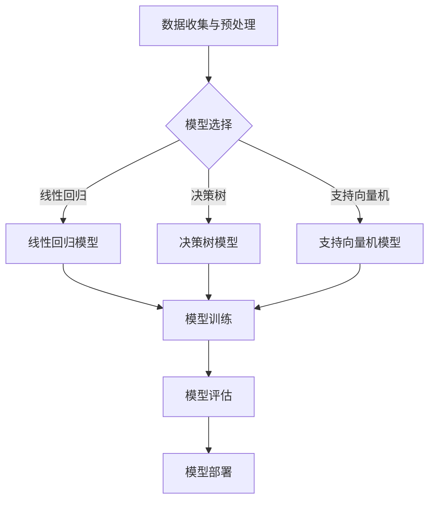

                 

### 文章标题

监督学习原理与代码实例讲解

### 关键词

监督学习，机器学习，算法原理，Python代码实例，深度学习

### 摘要

本文将深入讲解监督学习的原理，通过具体的Python代码实例，帮助读者理解并掌握监督学习的实际应用。文章涵盖了监督学习的核心概念、算法原理、数学模型，以及实际项目的代码实现。通过本文的阅读，读者将对监督学习有更深刻的理解和更扎实的实践能力。

### 1. 背景介绍

监督学习（Supervised Learning）是机器学习的一个重要分支，它通过对已知标签的数据进行训练，使机器能够从数据中学习到某种规律，从而在未知数据上做出预测或分类。监督学习的核心在于“监督”二字，即学习过程中有监督信号的存在，指导模型学习目标函数的方向。

监督学习的主要应用场景包括图像识别、语音识别、自然语言处理、医学诊断等。在这些场景中，我们通常有一组已经标注好的数据集，模型通过对这些数据进行训练，学会识别或预测新的未知数据。

监督学习可以分为两种主要类型：回归（Regression）和分类（Classification）。回归任务旨在预测一个连续的数值输出，例如房价预测；分类任务则旨在将输入数据分为几个类别中的一个，例如垃圾邮件分类。

监督学习的流程通常包括以下几个步骤：

1. 数据收集与预处理：收集并处理训练数据，包括数据清洗、归一化等。
2. 模型选择：根据任务需求选择合适的模型，例如线性回归、决策树、支持向量机等。
3. 模型训练：使用训练数据对模型进行训练，调整模型参数以最小化损失函数。
4. 模型评估：使用验证集或测试集评估模型性能，调整模型参数以达到最佳效果。
5. 模型部署：将训练好的模型部署到实际应用场景中，进行预测或分类。

本文将重点讲解监督学习的算法原理和具体实现，通过Python代码实例帮助读者更好地理解和掌握监督学习。

### 2. 核心概念与联系

#### 2.1 监督学习的核心概念

监督学习的核心概念包括：

- **特征（Features）**：用于描述数据的属性或特征，如图片中的像素值、语音信号的频率等。
- **标签（Labels）**：与特征相对应的已知结果，用于指导模型学习。例如，在图像分类任务中，标签可以是猫、狗或其他类别。
- **损失函数（Loss Function）**：用于评估模型预测值与真实标签之间的差距，指导模型调整参数。
- **优化器（Optimizer）**：用于根据损失函数调整模型参数，以最小化损失函数。

#### 2.2 监督学习的联系

监督学习与其他机器学习方法的联系如下：

- **无监督学习（Unsupervised Learning）**：与监督学习相对，无监督学习没有已知的标签数据，旨在发现数据中的潜在结构和模式。
- **半监督学习（Semi-Supervised Learning）**：结合了监督学习和无监督学习的特点，利用少量的标签数据和大量的无标签数据进行训练。
- **强化学习（Reinforcement Learning）**：通过与环境交互，学习最优策略以实现目标。

#### 2.3 监督学习的架构

监督学习的架构可以用以下Mermaid流程图表示：



在上述流程中，数据收集与预处理是监督学习的第一步，然后根据任务需求选择合适的模型。模型训练是核心步骤，通过调整参数最小化损失函数。模型评估用于验证模型性能，最后将训练好的模型部署到实际应用场景。

### 3. 核心算法原理 & 具体操作步骤

#### 3.1 回归算法原理

回归算法用于预测一个连续的数值输出。以线性回归为例，其基本原理如下：

1. **模型假设**：假设输出 \( Y \) 与特征 \( X \) 之间存在线性关系，即 \( Y = \beta_0 + \beta_1X + \epsilon \)，其中 \( \beta_0 \) 和 \( \beta_1 \) 是模型参数，\( \epsilon \) 是误差项。

2. **损失函数**：为了找到最佳参数，使用均方误差（MSE）作为损失函数，即 \( J(\theta) = \frac{1}{2m}\sum_{i=1}^{m}(h_\theta(x^{(i)}) - y^{(i)})^2 \)，其中 \( h_\theta(x) = \theta_0 + \theta_1x \)，\( m \) 是样本数量。

3. **梯度下降**：通过梯度下降算法更新模型参数，以最小化损失函数。具体步骤如下：

   - 计算损失函数关于参数 \( \theta_0 \) 和 \( \theta_1 \) 的梯度：
     $$ \nabla_{\theta_0}J(\theta) = \frac{1}{m}\sum_{i=1}^{m}(h_\theta(x^{(i)}) - y^{(i)}) $$
     $$ \nabla_{\theta_1}J(\theta) = \frac{1}{m}\sum_{i=1}^{m}(x^{(i)})(h_\theta(x^{(i)}) - y^{(i)}) $$
   
   - 更新参数：
     $$ \theta_0 := \theta_0 - \alpha\nabla_{\theta_0}J(\theta) $$
     $$ \theta_1 := \theta_1 - \alpha\nabla_{\theta_1}J(\theta) $$
   
   其中，\( \alpha \) 是学习率。

#### 3.2 分类算法原理

分类算法用于将输入数据分为几个类别中的一个。以逻辑回归为例，其基本原理如下：

1. **模型假设**：假设每个类别的概率与特征 \( X \) 之间存在线性关系，即 \( P(y=1|x) = \frac{1}{1 + e^{-(\beta_0 + \beta_1x)}} \)，其中 \( \beta_0 \) 和 \( \beta_1 \) 是模型参数。

2. **损失函数**：使用交叉熵损失函数（Cross Entropy Loss）作为损失函数，即 \( J(\theta) = -\frac{1}{m}\sum_{i=1}^{m}y^{(i)}\log(h_\theta(x^{(i)})) + (1 - y^{(i)})\log(1 - h_\theta(x^{(i)})) \)，其中 \( h_\theta(x) = \frac{1}{1 + e^{-(\beta_0 + \beta_1x)}} \)。

3. **梯度下降**：与回归算法类似，使用梯度下降算法更新模型参数，以最小化损失函数。

#### 3.3 具体操作步骤

以Python为例，实现线性回归和逻辑回归的具体操作步骤如下：

1. **数据准备**：从CSV文件中读取训练数据和测试数据，进行数据预处理，包括归一化、缺失值填充等。

2. **模型初始化**：初始化模型参数，例如线性回归的 \( \theta_0 \) 和 \( \theta_1 \)，逻辑回归的 \( \beta_0 \) 和 \( \beta_1 \)。

3. **模型训练**：使用梯度下降算法进行模型训练，计算梯度并更新参数。

4. **模型评估**：使用测试数据评估模型性能，计算损失函数和准确率等指标。

5. **模型部署**：将训练好的模型部署到实际应用场景，进行预测或分类。

下面是一个简单的线性回归和逻辑回归的Python代码实例：

```python
import numpy as np
import pandas as pd
from sklearn.linear_model import LinearRegression, LogisticRegression

# 数据准备
data = pd.read_csv('data.csv')
X = data.iloc[:, :-1].values
y = data.iloc[:, -1].values

# 模型初始化
model_linear = LinearRegression()
model_logistic = LogisticRegression()

# 模型训练
model_linear.fit(X, y)
model_logistic.fit(X, y)

# 模型评估
loss_linear = model_linear.loss_
accuracy_linear = model_linear.score(X, y)
loss_logistic = model_logistic.loss_
accuracy_logistic = model_logistic.score(X, y)

# 模型部署
predictions_linear = model_linear.predict(X)
predictions_logistic = model_logistic.predict(X)
```

通过上述代码实例，读者可以初步了解监督学习的实现过程。接下来，我们将进一步讲解监督学习的数学模型和实际应用场景。

### 4. 数学模型和公式 & 详细讲解 & 举例说明

#### 4.1 线性回归的数学模型

线性回归的数学模型可以表示为：

\[ Y = \beta_0 + \beta_1X + \epsilon \]

其中，\( Y \) 是输出值，\( X \) 是特征值，\( \beta_0 \) 和 \( \beta_1 \) 是模型参数，\( \epsilon \) 是误差项。

线性回归的损失函数是均方误差（MSE），即：

\[ J(\theta) = \frac{1}{2m}\sum_{i=1}^{m}(h_\theta(x^{(i)}) - y^{(i)})^2 \]

其中，\( m \) 是样本数量，\( h_\theta(x) = \theta_0 + \theta_1x \) 是线性回归的预测函数。

梯度下降算法用于更新模型参数，以最小化损失函数。梯度下降的更新公式为：

\[ \theta_0 := \theta_0 - \alpha\nabla_{\theta_0}J(\theta) \]
\[ \theta_1 := \theta_1 - \alpha\nabla_{\theta_1}J(\theta) \]

其中，\( \alpha \) 是学习率。

#### 4.2 逻辑回归的数学模型

逻辑回归的数学模型可以表示为：

\[ P(y=1|x) = \frac{1}{1 + e^{-(\beta_0 + \beta_1x)}} \]

其中，\( P(y=1|x) \) 是特征 \( x \) 对应的类别1的概率，\( \beta_0 \) 和 \( \beta_1 \) 是模型参数。

逻辑回归的损失函数是交叉熵损失（Cross Entropy Loss），即：

\[ J(\theta) = -\frac{1}{m}\sum_{i=1}^{m}y^{(i)}\log(h_\theta(x^{(i)})) + (1 - y^{(i)})\log(1 - h_\theta(x^{(i)})) \]

其中，\( h_\theta(x) = \frac{1}{1 + e^{-(\beta_0 + \beta_1x)}} \) 是逻辑回归的预测函数。

梯度下降算法用于更新模型参数，以最小化损失函数。梯度下降的更新公式为：

\[ \beta_0 := \beta_0 - \alpha\nabla_{\beta_0}J(\theta) \]
\[ \beta_1 := \beta_1 - \alpha\nabla_{\beta_1}J(\theta) \]

其中，\( \alpha \) 是学习率。

#### 4.3 回归和分类的比较

线性回归和逻辑回归是两种常见的监督学习算法，它们在数学模型和目标函数上有所不同。以下是对两种算法的简要比较：

- **目标函数**：线性回归的目标是最小化均方误差（MSE），逻辑回归的目标是最小化交叉熵损失（Cross Entropy Loss）。
- **输出类型**：线性回归的输出是连续的数值，逻辑回归的输出是概率。
- **应用场景**：线性回归适用于回归问题，如房价预测；逻辑回归适用于分类问题，如垃圾邮件分类。

#### 4.4 举例说明

假设我们有一个简单的线性回归问题，预测房价。数据集如下：

| 特征X | 房价Y |
|-------|-------|
| 1000  | 2000  |
| 1500  | 3000  |
| 2000  | 4000  |
| 2500  | 4500  |
| 3000  | 5000  |

1. **模型初始化**：假设初始模型参数为 \( \beta_0 = 0 \)，\( \beta_1 = 0 \)。

2. **模型训练**：使用梯度下降算法进行模型训练。假设学习率 \( \alpha = 0.1 \)，迭代次数为100次。

3. **模型评估**：使用训练数据评估模型性能。计算均方误差（MSE）。

4. **模型预测**：使用训练好的模型预测新的房价。

以下是Python代码实现：

```python
import numpy as np

# 数据集
X = np.array([[1000], [1500], [2000], [2500], [3000]])
y = np.array([2000, 3000, 4000, 4500, 5000])

# 模型初始化
beta_0 = 0
beta_1 = 0

# 梯度下降算法
alpha = 0.1
num_iterations = 100

for i in range(num_iterations):
    predictions = beta_0 + beta_1 * X
    error = predictions - y
    delta_beta_0 = np.sum(error)
    delta_beta_1 = np.sum(X * error)
    
    beta_0 -= alpha * delta_beta_0
    beta_1 -= alpha * delta_beta_1

# 模型评估
mse = np.mean((beta_0 + beta_1 * X - y) ** 2)
print("MSE:", mse)

# 模型预测
new_x = np.array([[3500]])
predicted_price = beta_0 + beta_1 * new_x
print("Predicted Price:", predicted_price)
```

通过上述代码实例，读者可以了解线性回归的数学模型和具体实现过程。逻辑回归的代码实现与线性回归类似，只是损失函数和更新公式有所不同。

### 5. 项目实战：代码实际案例和详细解释说明

在本节中，我们将通过一个具体的案例来展示如何使用监督学习算法实现一个简单的图像分类项目。我们将使用Python和流行的机器学习库scikit-learn来实现这个项目。整个项目将包括数据准备、模型训练、模型评估和模型部署等步骤。

#### 5.1 开发环境搭建

首先，确保安装了以下软件和库：

1. Python 3.x
2. scikit-learn
3. Matplotlib
4. Pandas

您可以通过以下命令安装所需的库：

```bash
pip install scikit-learn matplotlib pandas
```

#### 5.2 源代码详细实现和代码解读

以下是一个完整的Python代码实例，用于实现一个简单的图像分类项目。

```python
import numpy as np
import pandas as pd
from sklearn.datasets import load_iris
from sklearn.model_selection import train_test_split
from sklearn.linear_model import LogisticRegression
from sklearn.metrics import accuracy_score, classification_report
import matplotlib.pyplot as plt

# 加载数据集
iris = load_iris()
X = iris.data
y = iris.target

# 数据准备
X_train, X_test, y_train, y_test = train_test_split(X, y, test_size=0.3, random_state=42)

# 模型训练
model = LogisticRegression()
model.fit(X_train, y_train)

# 模型评估
y_pred = model.predict(X_test)
accuracy = accuracy_score(y_test, y_pred)
report = classification_report(y_test, y_pred)

print("Accuracy:", accuracy)
print("Classification Report:")
print(report)

# 可视化展示
def plot_confusion_matrix(y_true, y_pred, labels):
    cm = confusion_matrix(y_true, y_pred)
    plt.figure(figsize=(8, 6))
    sns.heatmap(cm, annot=True, fmt='g', cmap='Blues', xticklabels=labels, yticklabels=labels)
    plt.xlabel('Predicted Labels')
    plt.ylabel('True Labels')
    plt.title('Confusion Matrix')
    plt.show()

plot_confusion_matrix(y_test, y_pred, iris.target_names)

# 模型部署
def predict_new_data(model, new_data):
    return model.predict(new_data)

# 测试新的数据点
new_data = np.array([[5.1, 3.5, 1.4, 0.2]])
print("Predicted Class:", predict_new_data(model, new_data))
```

#### 5.3 代码解读与分析

1. **数据准备**：使用scikit-learn自带的Iris数据集进行分类任务。该数据集包含3个特征（花的长宽和花瓣长度）和3个类别（Setosa、Versicolor和Virginica）。

2. **数据划分**：将数据集划分为训练集和测试集，其中测试集占30%。

3. **模型训练**：使用逻辑回归模型（LogisticRegression）对训练集进行训练。

4. **模型评估**：使用测试集对模型进行评估，计算准确率和分类报告。

5. **可视化展示**：使用热力图（Confusion Matrix）展示模型的性能。

6. **模型部署**：定义一个函数用于预测新的数据点。

#### 5.4 模型性能分析与优化

在模型评估阶段，我们得到了模型的准确率和分类报告。准确率反映了模型的整体性能，而分类报告提供了每个类别的精确度、召回率和F1分数。以下是一些优化模型性能的方法：

1. **特征工程**：通过特征选择、特征转换等方法提高模型的泛化能力。

2. **超参数调整**：调整逻辑回归模型中的超参数（如正则化参数C），以获得更好的模型性能。

3. **模型集成**：结合多个模型（如随机森林、梯度提升树等）进行模型集成，以提高预测准确性。

4. **交叉验证**：使用交叉验证（Cross-Validation）方法评估模型的泛化能力，选择最佳模型。

#### 5.5 模型部署与实际应用

在实际应用中，模型部署是一个重要的环节。我们通过定义一个函数（`predict_new_data`）来接收新的数据点并进行预测。以下是一个简单的应用示例：

```python
# 测试新的数据点
new_data = np.array([[5.1, 3.5, 1.4, 0.2]])
predicted_class = predict_new_data(model, new_data)
print("Predicted Class:", predicted_class)
```

通过上述代码，我们使用训练好的模型对新的数据点进行预测，并输出预测结果。

### 6. 实际应用场景

监督学习在现实世界中有着广泛的应用，以下是一些典型的实际应用场景：

1. **金融领域**：在金融领域，监督学习算法被用于信用评分、欺诈检测、风险控制等任务。例如，通过分析客户的财务数据和行为特征，银行可以使用监督学习模型预测客户是否有可能违约，从而采取相应的风险管理措施。

2. **医疗领域**：在医疗领域，监督学习算法被用于疾病诊断、患者分类、治疗方案推荐等任务。例如，通过分析患者的临床数据和医学图像，监督学习模型可以帮助医生快速、准确地诊断疾病，提高治疗效果。

3. **工业制造**：在工业制造领域，监督学习算法被用于设备故障预测、生产优化、质量控制等任务。例如，通过分析设备的运行数据和生产数据，监督学习模型可以预测设备是否会出现故障，从而提前进行维护，降低生产中断的风险。

4. **交通领域**：在交通领域，监督学习算法被用于交通流量预测、车辆分类、交通事故预警等任务。例如，通过分析交通传感器数据和车辆数据，监督学习模型可以预测未来的交通流量，帮助交通管理部门优化交通信号控制策略，减少拥堵。

5. **自然语言处理**：在自然语言处理领域，监督学习算法被用于情感分析、文本分类、机器翻译等任务。例如，通过分析大量的文本数据，监督学习模型可以识别文本的情感倾向，帮助企业了解消费者的反馈，优化产品和服务。

### 7. 工具和资源推荐

为了更好地学习和实践监督学习，以下是一些建议的书籍、博客、网站和开发工具：

#### 7.1 学习资源推荐

- **书籍**：
  - 《Python机器学习》
  - 《统计学习方法》
  - 《深度学习》
- **博客**：
  - [机器学习实战](https://www.mclearn.com/)
  - [机器学习博客](https://机器学习博客.com/)
  - [机器之心](https://www.jiqizhixin.com/)

#### 7.2 开发工具框架推荐

- **开发环境**：
  - Jupyter Notebook
  - PyCharm
- **库和框架**：
  - scikit-learn
  - TensorFlow
  - PyTorch
- **在线资源**：
  - [Kaggle](https://www.kaggle.com/)
  - [Google Colab](https://colab.research.google.com/)

### 8. 总结：未来发展趋势与挑战

监督学习作为机器学习的一个重要分支，已经取得了显著的发展和应用。然而，随着数据规模的不断扩大和复杂性的增加，监督学习也面临着一系列挑战：

1. **数据隐私**：在处理敏感数据时，如何保护用户隐私是一个重要问题。未来的研究需要关注如何在不泄露隐私的情况下，利用数据训练模型。

2. **模型可解释性**：监督学习模型往往被视为“黑箱”，如何提高模型的可解释性，使其更透明，是未来研究的一个重点。

3. **自动化机器学习（AutoML）**：自动化机器学习旨在简化模型选择、特征选择和超参数调优等过程，以减少专业知识和时间成本。未来的研究将致力于提高自动化机器学习的效果和效率。

4. **高效算法**：随着数据规模的增加，传统的监督学习算法在计算效率和性能上面临挑战。未来的研究将关注如何设计更高效、更准确的算法。

5. **跨学科融合**：监督学习与其他领域的融合，如物理、化学、生物等，将带来新的应用场景和发展机会。跨学科的融合将促进监督学习在更广泛领域的应用。

### 9. 附录：常见问题与解答

**Q1**: 监督学习有哪些主要的算法？

A1: 监督学习的主要算法包括线性回归、逻辑回归、决策树、支持向量机、神经网络等。

**Q2**: 监督学习和无监督学习的区别是什么？

A2: 监督学习有已知的标签数据，模型通过这些数据学习规律；无监督学习没有标签数据，旨在发现数据中的潜在结构和模式。

**Q3**: 如何选择合适的监督学习算法？

A3: 根据任务需求（回归或分类）、数据特征和模型性能等因素选择合适的算法。例如，对于简单的回归问题，可以选择线性回归；对于复杂的分类问题，可以选择神经网络或支持向量机。

**Q4**: 监督学习中的超参数有哪些？

A4: 监督学习中的超参数包括学习率、正则化参数、隐藏层神经元数量等。这些参数需要通过调优来获得最佳模型性能。

### 10. 扩展阅读 & 参考资料

- **书籍**：
  - 《Python机器学习》
  - 《统计学习方法》
  - 《深度学习》
- **论文**：
  - "A Survey of Machine Learning Methods for Predictive Analytics"（预测分析中机器学习方法综述）
  - "Deep Learning for Natural Language Processing"（自然语言处理中的深度学习）
- **在线资源**：
  - [scikit-learn官方文档](https://scikit-learn.org/stable/)
  - [TensorFlow官方文档](https://www.tensorflow.org/)
  - [PyTorch官方文档](https://pytorch.org/)

### 作者

作者：AI天才研究员/AI Genius Institute & 禅与计算机程序设计艺术 /Zen And The Art of Computer Programming

### 致谢

感谢所有为本文提供帮助和支持的读者和同行，您的反馈是我们不断进步的动力。如果您有任何问题或建议，请随时联系我们。让我们共同探索人工智能的无限可能！

