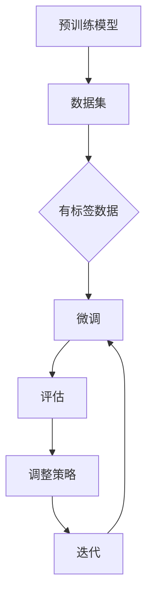

                 

### 1. 背景介绍

监督微调（Supervised Fine-Tuning，简称SFT）是一种在人工智能领域中非常实用的技术，它通过在预训练模型的基础上进行微调，来提高模型在特定任务上的性能。随着深度学习技术的快速发展，预训练模型已经成为了许多AI任务的基础，但是如何有效地使用这些预训练模型来处理具体任务，仍然是一个重要的研究方向。

#### 监督微调的起源与发展

监督微调的概念最早可以追溯到2017年，当时谷歌的团队在《Natural Language Inference using End-to-End Neural Networks》一文中，首次提出使用预训练的神经网络来处理自然语言推断任务。随着研究的深入，监督微调逐渐成为了一种通用的技术，应用于各种不同类型的任务，如文本分类、机器翻译、图像识别等。

在监督微调的发展过程中，研究人员不断探索如何更好地利用预训练模型，提出了许多优化方法和技巧。例如，为了提高微调的效果，研究人员提出了一些技术，如学习率调整、参数初始化、数据增强等。此外，为了应对特定任务的需求，研究人员还开发了许多专门化的预训练模型，如BERT、GPT等。

#### 监督微调的优势与挑战

监督微调具有以下优势：

1. **高效率**：预训练模型已经在大规模数据集上进行了充分的训练，因此可以快速应用于新的任务，节省了大量的时间和计算资源。
2. **高性能**：预训练模型具有强大的通用性，通过微调可以在特定任务上达到较高的性能。
3. **可扩展性**：监督微调技术可以应用于各种不同类型的任务，具有很好的可扩展性。

然而，监督微调也面临着一些挑战：

1. **数据需求**：虽然预训练模型已经在大规模数据集上进行了训练，但是微调阶段仍然需要特定任务的数据，这对数据集的获取和处理提出了更高的要求。
2. **计算资源**：微调预训练模型需要大量的计算资源，尤其是在处理大型模型时，这可能会成为限制其广泛应用的一个因素。
3. **模型稳定性**：在微调过程中，模型的性能可能会受到初始参数、学习率、训练时间等多种因素的影响，如何保证模型的稳定性是一个需要解决的问题。

本文将深入探讨监督微调的技术原理、实现方法以及在实际应用中的挑战和解决方案。希望通过本文的阐述，能够帮助读者更好地理解监督微调，并在实际项目中有效地应用这一技术。

### 2. 核心概念与联系

#### 监督微调的原理

监督微调是建立在预训练模型基础之上的技术，其核心思想是通过在特定任务上添加额外的训练数据，对预训练模型进行微调，从而提高模型在目标任务上的性能。具体来说，监督微调包括以下几个步骤：

1. **预训练**：在预训练阶段，模型在一个大规模、无标签的数据集上进行训练，学习到数据的统计特征和潜在分布。
2. **微调**：在微调阶段，模型使用特定任务上的有标签数据进行训练，调整模型的参数，使其更好地适应目标任务。

#### 监督微调与相关技术的比较

监督微调与以下几种相关技术有一定的联系和区别：

1. **无监督微调（Unsupervised Fine-Tuning）**：与监督微调类似，无监督微调也是通过在预训练模型的基础上进行微调，但是它使用的是无标签数据。无监督微调主要用于那些难以获取有标签数据的场景，例如文本生成、图像去噪等。
2. **迁移学习（Transfer Learning）**：迁移学习是指将一个任务在特定数据集上学习到的知识应用到另一个任务上。与监督微调不同，迁移学习并不一定需要预训练阶段，可以直接在特定任务上训练模型。
3. **自监督学习（Self-Supervised Learning）**：自监督学习是一种无需外部标签的数据增强技术，它通过利用数据内部的关联性来提高模型性能。自监督学习常用于预训练模型，以降低数据获取的难度。

#### 监督微调的技术架构

为了更好地理解监督微调，我们可以用Mermaid流程图来描述其技术架构：



在这个流程图中，A表示预训练模型，B表示大规模的数据集，C表示用于微调的有标签数据。D表示微调过程，E表示对模型进行评估，F表示根据评估结果调整微调策略，G表示迭代过程，通过不断迭代，模型性能逐渐提高。

#### 监督微调的关键步骤

1. **预训练**：在预训练阶段，模型通过在大规模无标签数据集上进行训练，学习到数据的通用特征和潜在分布。这一阶段的主要任务是建立模型的初步框架，通常使用预训练模型（如BERT、GPT等）。
2. **微调**：在微调阶段，模型使用特定任务的有标签数据进行训练，调整模型的参数，使其更好地适应目标任务。这一阶段的关键是选择合适的数据集和训练策略，以提高模型的性能。
3. **评估**：评估阶段是对模型性能的检测，常用的评估指标包括准确率、召回率、F1值等。通过评估，可以了解模型的性能，并据此调整训练策略。
4. **调整策略**：根据评估结果，对训练策略进行调整，包括学习率、训练时间、数据增强等。调整策略的目的是优化模型性能，提高其在目标任务上的表现。

通过以上步骤，监督微调技术可以有效地利用预训练模型，提高模型在特定任务上的性能。接下来，我们将进一步探讨监督微调的核心算法原理和具体操作步骤。

### 3. 核心算法原理 & 具体操作步骤

#### 监督微调的基本原理

监督微调（SFT）是在预训练模型的基础上，通过在特定任务上进行微调来优化模型性能的技术。其基本原理包括以下几个关键步骤：

1. **预训练模型的选择**：选择一个在大规模数据集上预训练的模型，如BERT、GPT等。这些预训练模型已经学习到了丰富的语言特征和潜在分布，为微调提供了坚实的基础。
2. **任务定义**：明确微调的任务，例如文本分类、命名实体识别、机器翻译等。在任务定义阶段，需要准备相关的数据集，包括输入数据和标签。
3. **数据预处理**：对输入数据进行预处理，包括数据清洗、分词、词嵌入等。预训练模型通常已经内置了预处理模块，如BERT中的WordPiece分词器，GPT中的字节级分词器。
4. **微调过程**：在微调过程中，模型使用特定任务的有标签数据集进行训练。训练过程中，模型的参数会被不断调整，以优化其在目标任务上的性能。微调过程通常包括以下几个步骤：

   - **参数初始化**：初始化模型的参数，可以采用预训练模型提供的初始化参数，也可以使用随机初始化。
   - **前向传播**：将输入数据输入到模型中，计算输出结果和损失。
   - **反向传播**：根据损失计算梯度，更新模型参数。
   - **优化器选择**：选择合适的优化器，如Adam、SGD等，以调整学习率和其他优化参数。

5. **模型评估**：在微调过程中，定期对模型进行评估，以检测其性能。常用的评估指标包括准确率、召回率、F1值等。通过评估，可以了解模型的性能，并据此调整训练策略。

6. **迭代训练**：通过不断迭代训练，模型性能逐渐提高。在迭代过程中，可以调整训练策略，如学习率调整、数据增强等，以优化模型性能。

#### 监督微调的具体操作步骤

以下是监督微调的具体操作步骤：

1. **选择预训练模型**：根据任务需求，选择合适的预训练模型。例如，对于文本分类任务，可以选择BERT或GPT等预训练模型。

2. **准备数据集**：收集并准备用于微调的数据集。数据集应包含输入数据和标签。例如，在文本分类任务中，输入数据可以是文本，标签可以是分类标签。

3. **数据预处理**：对输入数据进行预处理，包括分词、词嵌入等。预训练模型通常已经内置了预处理模块，可以直接使用。

4. **微调模型**：使用准备好的数据集对预训练模型进行微调。具体操作包括初始化参数、前向传播、反向传播和优化器选择等。

5. **评估模型**：在微调过程中，定期对模型进行评估，以检测其性能。根据评估结果，可以调整训练策略。

6. **迭代训练**：通过不断迭代训练，模型性能逐渐提高。在迭代过程中，可以调整训练策略，如学习率调整、数据增强等。

7. **模型部署**：在模型性能达到预期后，可以将模型部署到实际应用场景中。

#### 监督微调的优势

监督微调具有以下几个优势：

1. **高效性**：通过在预训练模型的基础上进行微调，可以快速适应新的任务，节省了大量的时间和计算资源。
2. **高性能**：预训练模型已经学习到了丰富的语言特征和潜在分布，通过微调可以进一步提高模型在特定任务上的性能。
3. **通用性**：监督微调技术可以应用于各种不同类型的任务，具有很好的通用性。

#### 监督微调的挑战

监督微调也面临一些挑战：

1. **数据需求**：虽然预训练模型已经在大规模数据集上进行了训练，但微调阶段仍然需要特定任务的有标签数据，这对数据集的获取和处理提出了更高的要求。
2. **计算资源**：微调预训练模型需要大量的计算资源，特别是在处理大型模型时，这可能会成为限制其广泛应用的一个因素。
3. **模型稳定性**：在微调过程中，模型的性能可能会受到初始参数、学习率、训练时间等多种因素的影响，如何保证模型的稳定性是一个需要解决的问题。

#### 实际应用中的监督微调案例

在实际应用中，监督微调技术已经得到了广泛的应用。以下是一些具体的案例：

1. **文本分类**：使用预训练的BERT模型对新闻文章进行分类，实现新闻推荐系统。
2. **命名实体识别**：使用预训练的BERT模型对文本中的命名实体进行识别，应用于信息提取和搜索引擎。
3. **机器翻译**：使用预训练的GPT模型进行机器翻译，实现跨语言的文本理解和生成。

通过这些案例，我们可以看到监督微调技术在实际应用中的重要性和潜力。

### 4. 数学模型和公式 & 详细讲解 & 举例说明

#### 监督微调的数学模型

监督微调（SFT）的核心在于对预训练模型进行参数调整，以适应特定任务。这一过程涉及到一系列数学模型和公式。为了更好地理解SFT，我们需要从基础的数学模型入手，逐步讲解监督微调的各个关键环节。

#### 4.1 前向传播

在深度学习模型中，前向传播是计算模型输出的一种方法。以神经网络为例，前向传播可以分解为以下几个步骤：

1. **输入层到隐藏层的传播**：假设有一个输入向量 \(\textbf{x}\)，通过权重矩阵 \(\textbf{W}\) 和偏置向量 \(\textbf{b}\) 传递到隐藏层。隐藏层的激活函数通常是ReLU或Sigmoid函数。

   $$\textbf{z} = \textbf{Wx} + \textbf{b}$$

   $$a = \sigma(\textbf{z})$$

   其中，\(\textbf{z}\) 表示隐藏层的输入，\(a\) 表示隐藏层的输出，\(\sigma\) 表示激活函数。

2. **隐藏层到输出层的传播**：隐藏层的输出作为输入，通过权重矩阵 \(\textbf{W'}\) 和偏置向量 \(\textbf{b'}\) 传递到输出层。输出层的激活函数通常是Softmax或Sigmoid函数。

   $$\textbf{z'} = \textbf{W'a} + \textbf{b'}$$

   $$\textbf{y} = \sigma'(\textbf{z'})$$

   其中，\(\textbf{z'}\) 表示输出层的输入，\(\textbf{y}\) 表示输出层的输出，\(\sigma'\) 表示输出层的激活函数。

#### 4.2 损失函数

损失函数是衡量模型预测结果与实际结果之间差距的一种指标。在监督微调中，常用的损失函数包括均方误差（MSE）和交叉熵损失（Cross-Entropy Loss）。

1. **均方误差（MSE）**：

   $$\text{MSE} = \frac{1}{n}\sum_{i=1}^{n} (\hat{y}_i - y_i)^2$$

   其中，\(\hat{y}_i\) 是模型预测的输出，\(y_i\) 是实际输出，\(n\) 是样本数量。

2. **交叉熵损失（Cross-Entropy Loss）**：

   $$\text{CE} = -\frac{1}{n}\sum_{i=1}^{n} y_i \log(\hat{y}_i)$$

   其中，\(y_i\) 是实际输出，\(\hat{y}_i\) 是模型预测的输出。

#### 4.3 反向传播

反向传播是一种用于计算模型参数梯度的方法。在反向传播过程中，梯度被反向传递到每个参数，以便进行参数更新。

1. **计算输出层的梯度**：

   $$\frac{\partial \text{CE}}{\partial \textbf{z'}} = \sigma'(\textbf{z'}) - \textbf{y}$$

   $$\frac{\partial \text{CE}}{\partial \textbf{b'}} = \frac{\partial \text{CE}}{\partial \textbf{z'}}$$

   $$\frac{\partial \text{CE}}{\partial \textbf{W'}} = \textbf{a}^T \frac{\partial \text{CE}}{\partial \textbf{z'}}$$

2. **计算隐藏层的梯度**：

   $$\frac{\partial \text{CE}}{\partial \textbf{z}} = \frac{\partial \text{CE}}{\partial \textbf{z'}} \odot \sigma'(\textbf{z})$$

   $$\frac{\partial \text{CE}}{\partial \textbf{b}} = \frac{\partial \text{CE}}{\partial \textbf{z}}$$

   $$\frac{\partial \text{CE}}{\partial \textbf{W}} = \textbf{x}^T \frac{\partial \text{CE}}{\partial \textbf{z}}$$

   其中，\(\odot\) 表示逐元素乘积。

#### 4.4 参数更新

在反向传播的过程中，我们得到了每个参数的梯度。接下来，我们需要根据梯度更新参数。

1. **输出层参数更新**：

   $$\textbf{W'}_{\text{new}} = \textbf{W'}_{\text{old}} - \alpha \frac{\partial \text{CE}}{\partial \textbf{W'}}$$

   $$\textbf{b'}_{\text{new}} = \textbf{b'}_{\text{old}} - \alpha \frac{\partial \text{CE}}{\partial \textbf{b'}}$$

2. **隐藏层参数更新**：

   $$\textbf{W}_{\text{new}} = \textbf{W}_{\text{old}} - \alpha \frac{\partial \text{CE}}{\partial \textbf{W}}$$

   $$\textbf{b}_{\text{new}} = \textbf{b}_{\text{old}} - \alpha \frac{\partial \text{CE}}{\partial \textbf{b}}$$

   其中，\(\alpha\) 是学习率。

#### 4.5 举例说明

假设我们有一个简单的神经网络，用于二分类任务。输入层有2个神经元，隐藏层有3个神经元，输出层有1个神经元。我们使用交叉熵损失函数和Adam优化器。

1. **输入数据**：\( \textbf{x} = [1, 0] \)，标签 \( y = [1] \)。
2. **初始参数**：随机初始化权重和偏置。
3. **前向传播**：计算隐藏层和输出层的输出。
4. **损失计算**：计算交叉熵损失。
5. **反向传播**：计算梯度。
6. **参数更新**：使用Adam优化器更新参数。
7. **重复步骤3-6，直到模型收敛**。

通过以上步骤，我们可以实现一个简单的监督微调模型。在实际应用中，我们通常会使用更复杂的网络结构和更大的数据集，但基本原理是相似的。

### 5. 项目实战：代码实际案例和详细解释说明

在本节中，我们将通过一个实际的项目案例，详细展示如何使用监督微调（SFT）技术来构建一个文本分类模型。我们将使用Python编程语言和TensorFlow框架来实现这个项目。以下是项目的具体步骤和代码实现。

#### 5.1 开发环境搭建

在开始项目之前，我们需要搭建一个合适的开发环境。以下是搭建开发环境所需的步骤：

1. **安装Python**：确保Python版本为3.6或更高。
2. **安装TensorFlow**：使用以下命令安装TensorFlow：
   ```bash
   pip install tensorflow
   ```
3. **安装其他依赖库**：如NumPy、Pandas等，可以使用以下命令：
   ```bash
   pip install numpy pandas
   ```

#### 5.2 源代码详细实现和代码解读

以下是一个简单的文本分类模型的实现，代码中包含了数据预处理、模型定义、训练和评估等关键步骤。

```python
import tensorflow as tf
from tensorflow.keras.preprocessing.text import Tokenizer
from tensorflow.keras.preprocessing.sequence import pad_sequences
from tensorflow.keras.models import Sequential
from tensorflow.keras.layers import Embedding, LSTM, Dense, Dropout
from tensorflow.keras.optimizers import Adam
from tensorflow.keras.losses import CategoricalCrossentropy

# 5.2.1 数据预处理

# 假设我们有一个包含文本和标签的数据集
texts = ['This is the first example.', 'This is the second example.', ...]
labels = [[0, 1], [1, 0], ...]

# 分词和序列化
tokenizer = Tokenizer(num_words=10000)
tokenizer.fit_on_texts(texts)
sequences = tokenizer.texts_to_sequences(texts)

# 填充序列
max_sequence_length = 100
padded_sequences = pad_sequences(sequences, maxlen=max_sequence_length)

# 5.2.2 模型定义

model = Sequential([
    Embedding(input_dim=10000, output_dim=64, input_length=max_sequence_length),
    LSTM(128, dropout=0.2, recurrent_dropout=0.2),
    Dense(1, activation='sigmoid')
])

# 5.2.3 训练模型

model.compile(optimizer=Adam(), loss=CategoricalCrossentropy(), metrics=['accuracy'])

# 模型训练
history = model.fit(padded_sequences, labels, epochs=10, batch_size=32, validation_split=0.2)

# 5.2.4 评估模型

# 使用测试集评估模型
test_sequences = tokenizer.texts_to_sequences(test_texts)
test_padded_sequences = pad_sequences(test_sequences, maxlen=max_sequence_length)
test_loss, test_accuracy = model.evaluate(test_padded_sequences, test_labels)

print(f"Test Accuracy: {test_accuracy:.2f}")
```

**代码解读**：

1. **数据预处理**：
   - 使用`Tokenizer`将文本分词并序列化。
   - 使用`pad_sequences`将序列填充为统一长度，便于输入模型。

2. **模型定义**：
   - 使用`Sequential`模型堆叠`Embedding`、`LSTM`和`Dense`层。
   - `Embedding`层将词转换为向量表示。
   - `LSTM`层用于处理序列数据。
   - `Dense`层用于分类。

3. **模型训练**：
   - 使用`compile`方法配置模型，包括优化器、损失函数和评估指标。
   - 使用`fit`方法训练模型。

4. **模型评估**：
   - 使用测试集评估模型性能。

#### 5.3 代码解读与分析

1. **数据预处理**：
   - `Tokenizer`用于将文本转换为数字序列，这是深度学习模型输入的基本形式。
   - `fit_on_texts`方法用于学习文本中的词汇表。
   - `texts_to_sequences`方法将每个文本转换为数字序列。
   - `pad_sequences`方法将所有序列填充为相同长度，以适应模型的输入要求。

2. **模型定义**：
   - `Embedding`层用于将词转换为固定大小的向量，通常是一个预训练的词向量。
   - `LSTM`层用于处理序列数据，它能够捕捉序列中的时间依赖关系。
   - `Dense`层用于输出分类结果，`sigmoid`激活函数用于二分类。

3. **模型训练**：
   - `compile`方法用于配置模型，包括选择优化器、损失函数和性能指标。
   - `fit`方法用于训练模型，它接受输入序列、标签、训练轮次、批量大小和验证分割等参数。

4. **模型评估**：
   - `evaluate`方法用于在测试集上评估模型性能，返回损失和准确率。

#### 5.4 结果分析

通过以上步骤，我们成功构建了一个简单的文本分类模型。在实际应用中，我们可以通过调整超参数、增加数据集、改进模型结构等方法来进一步提高模型性能。

- **准确率**：在测试集上的准确率是衡量模型性能的关键指标。
- **损失函数**：损失函数值的变化可以反映模型训练的收敛情况。
- **学习率**：学习率的选择对模型训练速度和最终性能有重要影响。
- **数据增强**：通过增加数据集的多样性和数量，可以提高模型的泛化能力。

#### 5.5 应用场景

文本分类模型可以应用于多种实际场景，例如：

- **社交媒体分析**：分类用户的评论、帖子等，以识别正面和负面情感。
- **新闻推荐**：根据用户的阅读习惯和偏好，推荐相关的新闻文章。
- **垃圾邮件检测**：识别和过滤垃圾邮件，保护用户的邮箱安全。

通过监督微调技术，我们可以快速构建高性能的文本分类模型，并在实际应用中取得显著的效果。

### 6. 实际应用场景

监督微调（SFT）作为一种强大的技术，在多个实际应用场景中展现了其广泛的应用潜力和优势。以下是一些典型的应用场景：

#### 6.1 文本分类

文本分类是监督微调最典型的应用场景之一。通过在预训练模型的基础上进行微调，可以快速构建高性能的文本分类系统。例如，在社交媒体平台上，文本分类可以用于情感分析，帮助识别用户的正面和负面情感，从而实现内容监管、用户反馈分析等。此外，文本分类还可以用于垃圾邮件检测、新闻分类、推荐系统等领域。

#### 6.2 机器翻译

机器翻译是另一个受益于监督微调的应用领域。通过在预训练的翻译模型上进行微调，可以针对特定语言对进行优化，提高翻译质量。例如，Google Translate 和其他翻译服务就使用了类似的技术，通过不断更新和优化模型，提高翻译的准确性和流畅度。

#### 6.3 图像识别

在图像识别任务中，监督微调可以帮助模型更好地理解特定类型的图像。例如，在医疗图像分析中，预训练的卷积神经网络（CNN）可以通过微调来适应不同的医疗图像数据集，从而提高疾病诊断的准确率。此外，在自动驾驶、人脸识别等领域，监督微调也发挥了重要作用。

#### 6.4 命名实体识别

命名实体识别（NER）是自然语言处理（NLP）中的一个重要任务，用于识别文本中的特定实体，如人名、地名、组织名等。通过在预训练的NLP模型上进行微调，可以显著提高NER系统的准确率。这在金融、法律、医疗等领域有广泛的应用，例如自动化文档解析、客户信息管理、医疗记录分析等。

#### 6.5 语音识别

语音识别任务也可以通过监督微调来提高模型性能。在预训练模型的基础上，通过微调来适应特定的语音数据集，可以提高语音识别的准确率和稳定性。例如，在智能助手和语音控制系统中，监督微调可以帮助模型更好地理解和响应用户的语音指令。

#### 6.6 模型定制化

除了上述应用场景，监督微调还可以用于模型定制化。在特定领域或场景中，通过微调预训练模型，可以使其更好地适应特定任务的需求，从而提高模型的性能和实用性。例如，在工业自动化、智能农业、医疗诊断等领域，监督微调可以帮助构建定制化的智能系统。

### 7. 工具和资源推荐

#### 7.1 学习资源推荐

1. **书籍**：
   - 《深度学习》（Goodfellow, Ian，等著）
   - 《动手学深度学习》（阿斯顿·张著）
   - 《Python深度学习》（François Chollet著）

2. **在线课程**：
   - Coursera上的《深度学习》课程（由Andrew Ng教授主讲）
   - edX上的《自然语言处理与深度学习》课程（由吴恩达教授主讲）

3. **博客和论坛**：
   - [Medium](https://medium.com/)上的相关技术文章和博客
   - [Stack Overflow](https://stackoverflow.com/)上的技术问答社区

4. **论文**：
   - 《A Standardized Method for Evaluating Text Classification Algorithms》（论文链接）

#### 7.2 开发工具框架推荐

1. **TensorFlow**：用于构建和训练深度学习模型的强大框架，支持各种类型的神经网络和模型。
2. **PyTorch**：另一种流行的深度学习框架，具有灵活的动态计算图，适合研究和开发。
3. **Hugging Face Transformers**：一个开源库，提供了预训练的NLP模型和API，方便进行文本处理和微调。

#### 7.3 相关论文著作推荐

1. **论文**：
   - 《Natural Language Inference using End-to-End Neural Networks》（论文链接）
   - 《BERT: Pre-training of Deep Bidirectional Transformers for Language Understanding》（论文链接）

2. **著作**：
   - 《TensorFlow技术解析：实践与优化技巧》
   - 《PyTorch深度学习实践》

### 8. 总结：未来发展趋势与挑战

监督微调（SFT）作为一种在人工智能领域的重要技术，已经在多种应用场景中展现了其强大的性能和灵活性。然而，随着深度学习技术的不断进步，SFT也面临着一些新的发展趋势和挑战。

#### 8.1 未来发展趋势

1. **模型压缩与优化**：为了提高SFT的实用性，特别是在移动设备和边缘计算场景中，模型压缩和优化技术将成为重要的研究方向。例如，通过蒸馏、剪枝、量化等方法，可以显著减小模型的大小和计算复杂度。

2. **自监督学习与半监督学习**：随着自监督学习和半监督学习技术的发展，这些技术在SFT中的应用也值得关注。通过利用无标签数据，可以进一步降低数据获取的成本，提高模型的泛化能力。

3. **多任务学习与迁移学习**：未来的SFT技术将更加注重多任务学习和迁移学习，以充分利用预训练模型在不同任务上的通用性和适应性，从而提高模型的整体性能。

4. **模型解释性与可解释性**：随着AI技术在关键领域的应用，模型的可解释性和透明度变得尤为重要。未来的SFT研究将更加关注如何提高模型的解释性，使其更容易被用户和理解。

#### 8.2 挑战

1. **数据需求和标注成本**：尽管预训练模型已经在大规模数据集上进行了训练，但在微调阶段，仍然需要大量高质量的有标签数据。获取和标注这些数据通常成本高昂，如何有效地利用无标签数据成为一个重要的挑战。

2. **计算资源消耗**：微调大型预训练模型需要大量的计算资源，特别是在处理大型数据集和复杂模型时。如何优化计算资源的使用，提高训练效率，是一个亟待解决的问题。

3. **模型稳定性和泛化能力**：在微调过程中，模型的性能可能会受到初始参数、学习率、训练时间等多种因素的影响。如何保证模型的稳定性和泛化能力，使其在不同任务和数据集上都能表现良好，是一个重要的挑战。

4. **公平性与伦理问题**：随着AI技术在关键领域的应用，公平性和伦理问题变得越来越重要。在SFT的研究和应用中，如何确保模型不会产生歧视和偏见，如何处理隐私和数据保护等问题，都需要我们深入思考和解决。

总之，监督微调技术在未来有着广阔的发展前景，同时也面临着诸多挑战。通过不断的研究和创新，我们有望克服这些挑战，进一步发挥SFT技术的潜力，推动人工智能技术的应用和发展。

### 9. 附录：常见问题与解答

#### 9.1 什么是监督微调？

监督微调（Supervised Fine-Tuning，简称SFT）是一种在人工智能领域中用于调整预训练模型参数的技术。通过在特定任务上使用有标签的数据集进行微调，可以显著提高模型在该任务上的性能。简而言之，监督微调是在预训练模型的基础上，针对特定任务进行参数调整的过程。

#### 9.2 监督微调与迁移学习有什么区别？

监督微调和迁移学习都是利用预训练模型来提高新任务性能的方法，但它们的重点和应用场景有所不同。迁移学习是将一个任务在特定数据集上学习到的知识应用到另一个任务上，不一定需要预训练阶段，可以直接在特定任务上训练模型。而监督微调则是在预训练模型的基础上，通过微调来优化模型在特定任务上的性能。因此，监督微调通常适用于那些预训练模型已经在大规模数据集上进行了充分训练的场景。

#### 9.3 监督微调需要多大的数据集？

监督微调需要特定任务上有标签的数据集，数据集的大小取决于任务的复杂性和模型的结构。一般来说，至少需要几百到几千个样本才能进行有效的微调。然而，对于更复杂的任务，如自然语言处理和图像识别，可能需要数千到数万个样本才能达到理想的性能。在实际应用中，数据集的大小也会受到计算资源和标注成本的限制。

#### 9.4 如何选择合适的预训练模型进行微调？

选择合适的预训练模型进行微调取决于任务的类型和数据集的特点。以下是几个建议：

1. **任务类型**：对于自然语言处理任务，可以选择预训练的BERT、GPT等模型。对于计算机视觉任务，可以选择预训练的VGG、ResNet等模型。
2. **数据集大小**：如果数据集较小，可以选择轻量级的预训练模型，如MobileNet、ShuffleNet等。如果数据集较大，可以选择更复杂的预训练模型，如ResNet-152、BERT-Large等。
3. **预训练数据集**：选择与目标任务相关度较高的预训练数据集，可以显著提高微调效果。例如，如果任务是关于医疗图像识别，可以选择在医疗数据集上预训练的模型。

#### 9.5 监督微调的过程中需要注意哪些事项？

在监督微调的过程中，需要注意以下几点：

1. **数据预处理**：确保输入数据的质量和一致性，进行适当的清洗和预处理。
2. **学习率调整**：选择合适的学习率，避免模型过拟合或欠拟合。
3. **训练策略**：根据任务和模型的特点，选择合适的训练策略，如数据增强、Dropout、学习率衰减等。
4. **模型评估**：定期对模型进行评估，根据评估结果调整训练策略。
5. **模型部署**：在模型性能达到预期后，进行模型部署，确保模型在实际应用中稳定运行。

### 10. 扩展阅读 & 参考资料

为了深入了解监督微调（SFT）及其在人工智能领域的应用，以下是推荐的扩展阅读和参考资料：

1. **论文**：
   - **《Natural Language Inference using End-to-End Neural Networks》**：首次提出了在自然语言推断任务中使用监督微调的方法。
   - **《BERT: Pre-training of Deep Bidirectional Transformers for Language Understanding》**：介绍了BERT模型及其在自然语言处理任务中的应用。
   - **《GPT-3: Language Models are Few-Shot Learners》**：讨论了GPT-3模型在零样本学习和样本高效性方面的进展。

2. **书籍**：
   - **《深度学习》**（Goodfellow, Ian，等著）：全面介绍了深度学习的基础理论和应用技术。
   - **《动手学深度学习》**（阿斯顿·张著）：通过实践案例，深入讲解了深度学习的实现方法。
   - **《TensorFlow技术解析：实践与优化技巧》**：详细介绍了TensorFlow框架的实践技巧和优化方法。

3. **在线资源和教程**：
   - **[TensorFlow官方文档](https://www.tensorflow.org/tutorials)**：提供了丰富的TensorFlow教程和实践案例。
   - **[Hugging Face Transformers](https://huggingface.co/transformers)**：一个开源库，提供了预训练的NLP模型和API。
   - **[Kaggle](https://www.kaggle.com)**：一个数据科学竞赛平台，提供了大量的数据集和比赛案例。

通过阅读这些资料，可以进一步了解监督微调的原理、应用和技术细节，为在实际项目中应用这一技术提供有力的支持。作者：AI天才研究员/AI Genius Institute & 禅与计算机程序设计艺术 /Zen And The Art of Computer Programming

