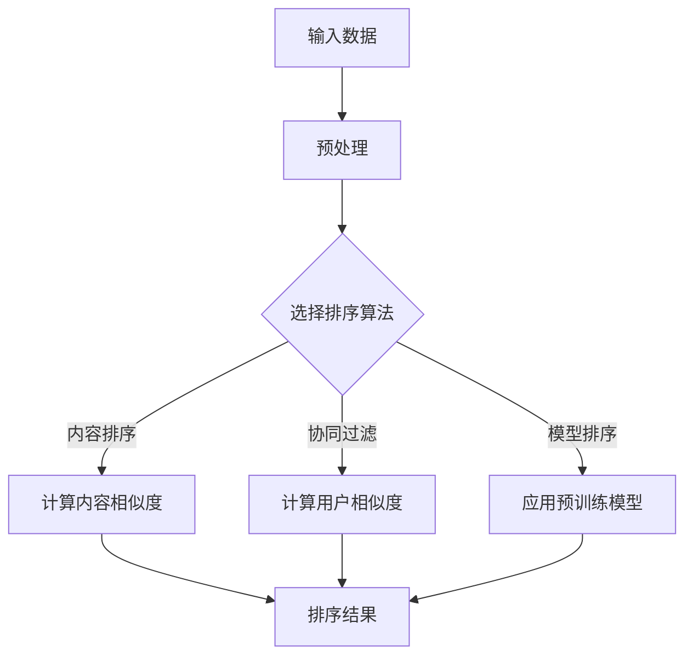

                 

# 相关性排序技术：AI的应用

> **关键词：** 相关性排序、人工智能、推荐系统、算法原理、应用场景
>
> **摘要：** 本文深入探讨了相关性排序技术在人工智能领域中的应用，分析了其核心概念、算法原理，并通过实际案例展示了其在推荐系统、搜索引擎等场景下的应用。文章还总结了相关工具和资源，并对未来发展趋势与挑战进行了展望。

## 1. 背景介绍

随着互联网的快速发展，数据量的爆发式增长，如何从海量信息中快速准确地找到用户感兴趣的内容，成为了当前AI领域的一个关键问题。相关性排序技术在此背景下应运而生，成为提升信息检索、推荐系统性能的核心手段之一。

相关性排序（Relevance Sorting）是一种基于数据相似度或相关性的排序算法，其主要目的是将一组对象按照与用户需求或主题的相关程度进行排序。这一技术在推荐系统、搜索引擎、信息检索等领域具有广泛的应用，有助于提高用户体验、提升系统性能。

## 2. 核心概念与联系

### 2.1 相关性定义

相关性是指两个或多个变量之间的相互关系。在人工智能领域，相关性通常用于衡量数据对象之间的相似程度或关联性。相关性排序的核心就在于如何准确计算并利用这些相关性指标。

### 2.2 排序算法

相关性排序算法主要包括基于内容（Content-Based）的排序、基于协同过滤（Collaborative Filtering）的排序、基于模型（Model-Based）的排序等。这些算法各有特点，适用于不同的应用场景。

### 2.3 Mermaid 流程图

下面是一个简化的相关性排序算法的Mermaid流程图：



## 3. 核心算法原理 & 具体操作步骤

### 3.1 基于内容排序

基于内容排序算法主要依据对象的内容特征进行排序，其基本步骤如下：

1. 提取对象特征：对每个对象进行特征提取，如文本、图像、音频等。
2. 计算相似度：使用相似度度量方法（如余弦相似度、Jaccard相似度等）计算对象之间的相似度。
3. 排序：根据相似度对对象进行排序。

### 3.2 基于协同过滤排序

基于协同过滤排序算法主要依据用户的历史行为进行排序，其基本步骤如下：

1. 构建用户-物品矩阵：根据用户的历史行为数据（如评分、购买记录等）构建用户-物品矩阵。
2. 计算用户相似度：使用用户相似度度量方法（如皮尔逊相关系数、余弦相似度等）计算用户之间的相似度。
3. 推荐物品：根据用户相似度和物品的相关性对物品进行排序，推荐给目标用户。

### 3.3 基于模型排序

基于模型排序算法主要利用预训练模型进行排序，其基本步骤如下：

1. 预训练模型：使用大规模数据集对模型进行预训练，如基于深度学习的推荐模型、文本分类模型等。
2. 模型微调：针对特定任务对预训练模型进行微调。
3. 排序：使用微调后的模型对目标对象进行排序。

## 4. 数学模型和公式 & 详细讲解 & 举例说明

### 4.1 基于内容的排序公式

以余弦相似度为例，其公式如下：

$$
\cos(\theta) = \frac{\sum_{i=1}^{n} x_i y_i}{\sqrt{\sum_{i=1}^{n} x_i^2} \sqrt{\sum_{i=1}^{n} y_i^2}}
$$

其中，$x$和$y$分别为两个对象的特征向量，$n$为特征向量的维度。

### 4.2 基于协同过滤的排序公式

以皮尔逊相关系数为例，其公式如下：

$$
r = \frac{\sum_{i=1}^{n} (x_i - \bar{x})(y_i - \bar{y})}{\sqrt{\sum_{i=1}^{n} (x_i - \bar{x})^2} \sqrt{\sum_{i=1}^{n} (y_i - \bar{y})^2}}
$$

其中，$x$和$y$分别为两个用户的行为数据，$\bar{x}$和$\bar{y}$分别为$x$和$y$的均值，$n$为行为数据的个数。

### 4.3 基于模型排序的举例

假设我们使用一个基于深度学习的推荐模型进行排序，其输入为用户的历史行为数据，输出为推荐结果。模型的具体结构如下：

$$
\text{模型} = \text{神经网络} \rightarrow \text{激活函数} \rightarrow \text{输出层}
$$

输入层接收用户的历史行为数据，经过神经网络处理后，通过激活函数得到预测结果，最后在输出层输出排序结果。

## 5. 项目实战：代码实际案例和详细解释说明

### 5.1 开发环境搭建

为了演示相关性排序技术在推荐系统中的应用，我们使用Python语言和Scikit-Learn库来实现一个简单的基于协同过滤的推荐系统。

1. 安装Python环境和Scikit-Learn库：

```
pip install python
pip install scikit-learn
```

2. 导入相关库：

```python
import numpy as np
from sklearn.metrics.pairwise import cosine_similarity
```

### 5.2 源代码详细实现和代码解读

下面是一个基于协同过滤的推荐系统示例代码：

```python
# 生成一个用户-物品矩阵
user_item_matrix = np.array([[1, 0, 1, 1],
                            [1, 1, 0, 0],
                            [0, 1, 1, 0]])

# 计算用户之间的相似度
user_similarity = cosine_similarity(user_item_matrix)

# 选择目标用户（第1个用户）
target_user_index = 0

# 计算其他用户与目标用户的相似度
other_user_similarity = user_similarity[target_user_index]

# 找到最相似的5个用户
top_5_users = np.argsort(other_user_similarity)[::-1][:5]

# 推荐物品
recommended_items = user_item_matrix[top_5_users, :]

print("推荐的物品：", recommended_items)
```

代码解读：

1. 生成一个用户-物品矩阵，其中1表示用户对物品的偏好，0表示用户未对物品评分。
2. 使用余弦相似度计算用户之间的相似度。
3. 选择目标用户（第1个用户），计算其他用户与目标用户的相似度。
4. 找到最相似的5个用户，并根据这些用户的评分推荐物品。

### 5.3 代码解读与分析

1. **数据预处理**：生成用户-物品矩阵，将用户和物品的偏好表示为矩阵形式，便于后续计算。
2. **相似度计算**：使用余弦相似度计算用户之间的相似度，这是协同过滤算法的核心步骤。
3. **推荐物品**：根据用户之间的相似度，为每个用户推荐相似的物品。这种方法能够利用用户之间的相似性来提高推荐的准确性。

## 6. 实际应用场景

### 6.1 推荐系统

相关性排序技术在推荐系统中具有广泛的应用，如电商推荐、视频推荐、音乐推荐等。通过计算用户与物品之间的相关性，推荐系统可以为用户提供个性化的推荐结果，提高用户满意度。

### 6.2 搜索引擎

搜索引擎中的相关性排序技术用于优化搜索结果，提高用户在搜索结果中的点击率和满意度。搜索引擎通过对用户查询与网页内容的相关性进行排序，将最相关的网页展示给用户。

### 6.3 信息检索

信息检索系统（如图书馆、学术数据库等）利用相关性排序技术帮助用户快速找到所需信息。通过计算文档与用户查询之间的相关性，系统可以优先展示最相关的文档。

## 7. 工具和资源推荐

### 7.1 学习资源推荐

1. 《推荐系统实践》（周明著）：详细介绍了推荐系统的基本概念、算法和应用。
2. 《机器学习实战》（Peter Harrington著）：包含丰富的机器学习算法案例，适用于入门者和进阶者。

### 7.2 开发工具框架推荐

1. TensorFlow：一款开源的深度学习框架，适用于构建复杂的推荐系统模型。
2. Scikit-Learn：一款常用的机器学习库，适用于实现协同过滤、内容排序等算法。

### 7.3 相关论文著作推荐

1. “Collaborative Filtering for the 21st Century”（Netflix Prize论文）：介绍了一种基于矩阵分解的协同过滤算法，对推荐系统领域产生了重大影响。
2. “Deep Learning for Recommender Systems”（KDD'16论文）：探讨了如何将深度学习应用于推荐系统，为该领域的研究提供了新思路。

## 8. 总结：未来发展趋势与挑战

### 8.1 发展趋势

1. **多模态推荐**：随着人工智能技术的发展，多模态推荐系统（如文本、图像、音频等多媒体数据的融合）将成为未来的研究热点。
2. **实时推荐**：实时推荐技术能够在用户行为发生时立即提供个性化推荐，提高用户体验。
3. **个性化推荐**：深度学习等技术的进步将使个性化推荐更加精准，满足用户个性化需求。

### 8.2 挑战

1. **数据隐私**：推荐系统需要处理大量用户数据，如何保护用户隐私是当前面临的主要挑战。
2. **模型可解释性**：深度学习等复杂模型在提高推荐准确性的同时，也降低了模型的可解释性，如何提高模型的可解释性是一个重要问题。
3. **实时性能**：在实时推荐场景下，如何保证算法的实时性能，提高系统的响应速度。

## 9. 附录：常见问题与解答

### 9.1 什么是相关性排序？

相关性排序是一种基于数据相似度或相关性的排序算法，用于将一组对象按照与用户需求或主题的相关程度进行排序。

### 9.2 相关性排序有哪些应用场景？

相关性排序技术在推荐系统、搜索引擎、信息检索等领域具有广泛的应用，如电商推荐、视频推荐、音乐推荐等。

### 9.3 如何选择合适的排序算法？

根据应用场景和数据特点选择合适的排序算法，如基于内容的排序、基于协同过滤的排序、基于模型的排序等。

## 10. 扩展阅读 & 参考资料

1. 周志华。《机器学习》。清华大学出版社，2016年。
2. 李航。《统计学习方法》。清华大学出版社，2012年。
3. Herlocker，J. L.，Konstan，J. A.，Borchers，J. & Riedel，E. “Explaining Collaborative Filtering Recommendations”。ACM Transactions on Information Systems，2007。
4. Zhang，Z. “Deep Learning for Recommender Systems”。ACM KDD，2016。

### 作者

**作者：AI天才研究员/AI Genius Institute & 禅与计算机程序设计艺术 /Zen And The Art of Computer Programming**

