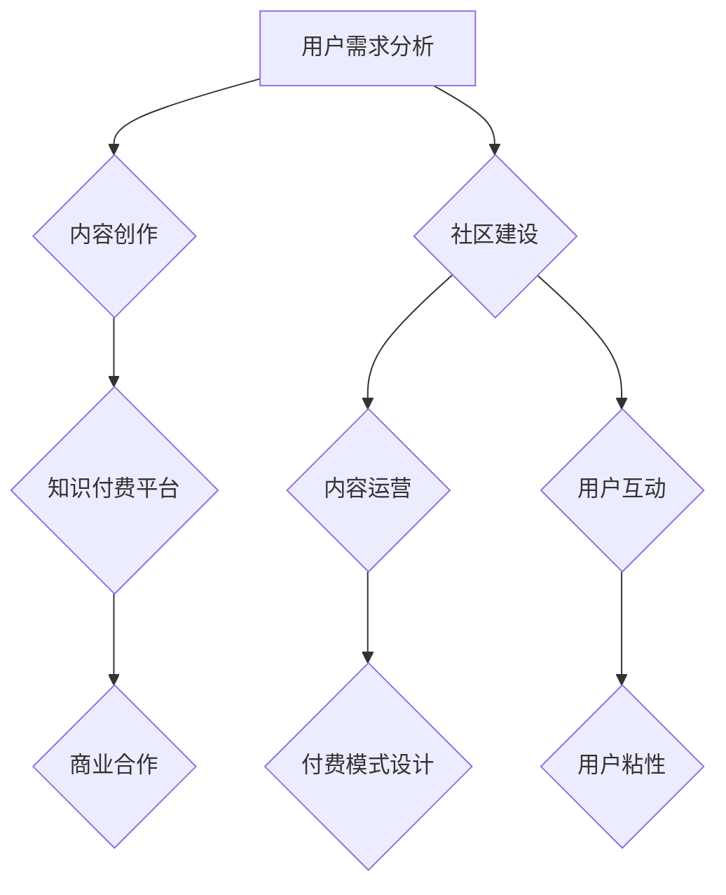

                 

# 知识付费与技术社区运营的融合之道

## 摘要

随着互联网的快速发展和数字化时代的到来，知识付费和技术社区运营逐渐成为现代企业和个人获取知识、分享经验和进行技术交流的重要渠道。本文将探讨知识付费与技术社区运营的融合之道，通过分析两者的核心概念、算法原理、数学模型、实际应用场景、工具和资源推荐等方面，为读者提供一种新的思维方式和实践路径。文章旨在帮助企业和个人更好地理解和利用知识付费与技术社区运营的潜力，实现知识共享、技能提升和业务增长。

## 背景介绍

### 知识付费的概念与现状

知识付费是指消费者为了获取特定知识或技能而付费的行为。在传统的知识传播方式中，知识主要通过教育机构、图书、讲座等渠道传递。然而，随着互联网的普及和在线教育的发展，知识付费逐渐成为一种新兴的消费模式。目前，知识付费已经广泛应用于职业技能培训、在线课程、知识付费平台等多个领域。

### 技术社区运营的概念与作用

技术社区运营是指通过构建和运营技术社区，为技术爱好者、开发者、企业和个人提供一个交流、学习、分享和合作的平台。技术社区运营不仅可以帮助用户获取最新的技术资讯、解决技术难题，还可以促进技术人才的成长，推动技术创新和产业升级。随着技术社区的发展，越来越多的企业和个人开始重视技术社区运营，将其视为重要的市场推广和品牌建设手段。

### 知识付费与技术社区运营的融合现状

知识付费和技术社区运营的融合已经成为当前互联网行业的一个重要趋势。一方面，知识付费平台通过引入技术社区元素，如技术讨论区、问答社区等，为用户提供更丰富的知识获取途径和互动体验。另一方面，技术社区运营平台通过推出知识付费产品，如在线课程、实战项目等，为用户提供有价值的知识内容和服务。这种融合不仅为用户提供了更全面的技术支持，也为企业和个人创造了更多的商业机会。

## 核心概念与联系

### 知识付费的核心概念

1. **用户需求分析**：了解用户的知识需求是知识付费的基础。通过大数据分析和用户调研，确定用户感兴趣的领域和知识需求。
2. **知识内容创作**：优秀的知识内容是知识付费的核心价值所在。内容创作者需要具备专业知识和创作能力，提供有深度、有价值的知识内容。
3. **付费模式设计**：知识付费的付费模式包括订阅制、单次购买、限时优惠等。根据用户需求和内容特点，设计合理的付费模式，以最大化用户的购买意愿。

### 技术社区运营的核心概念

1. **社区建设**：技术社区运营的首要任务是构建一个用户活跃、氛围良好的技术社区。这包括确定社区定位、设计社区架构、制定社区规则等。
2. **内容运营**：技术社区的内容运营包括发布技术文章、举办线上/线下活动、开展技术讨论等。内容运营的目标是提供有价值、有趣的内容，吸引和留住用户。
3. **用户互动**：技术社区的用户互动是社区活跃度的关键。通过建立问答社区、技术讨论区等，鼓励用户参与讨论、分享经验和解决问题。

### 知识付费与技术社区运营的联系

1. **用户需求与内容创作**：知识付费平台可以通过技术社区运营了解用户需求，指导知识内容创作，提高知识内容的针对性。
2. **互动体验与用户粘性**：技术社区运营可以为知识付费平台提供互动体验，增加用户粘性。用户在社区中参与讨论、学习，有助于加深对知识内容的理解和记忆。
3. **商业合作与共赢**：知识付费和技术社区运营的结合，可以为企业提供更多的商业合作机会，如联合推出课程、举办技术交流活动等，实现共赢。

### Mermaid 流程图



## 核心算法原理 & 具体操作步骤

### 知识付费的核心算法原理

1. **用户画像分析**：通过大数据分析，对用户进行画像分析，了解用户的知识需求和偏好。
   ```mermaid
   graph TD
   A[用户行为数据] --> B[用户画像分析]
   B --> C{兴趣标签}
   B --> D{学习历史}
   ```

2. **推荐算法**：基于用户画像和内容特征，使用推荐算法为用户推荐适合的知识内容。
   ```mermaid
   graph TD
   A[用户画像] --> B[内容特征]
   B --> C{推荐算法}
   C --> D{推荐结果}
   ```

3. **付费决策**：根据用户对推荐内容的兴趣和购买历史，预测用户的付费意愿，并设计相应的付费模式。
   ```mermaid
   graph TD
   A[推荐内容] --> B{付费决策}
   B --> C{付费模式设计}
   ```

### 技术社区运营的核心算法原理

1. **社区活跃度分析**：通过用户参与度、发帖量、回帖量等指标，分析社区的活跃度。
   ```mermaid
   graph TD
   A[用户参与度] --> B[社区活跃度分析]
   A --> C[发帖量]
   A --> D[回帖量]
   ```

2. **内容审核算法**：使用内容审核算法，对社区内容进行审核，过滤不良信息，维护社区环境。
   ```mermaid
   graph TD
   A[社区内容] --> B[内容审核算法]
   B --> C{过滤结果}
   ```

3. **用户互动预测**：基于用户行为数据和社区互动情况，预测用户的互动行为，提高社区活跃度。
   ```mermaid
   graph TD
   A[用户行为数据] --> B[用户互动预测]
   B --> C{互动策略}
   ```

### 具体操作步骤

1. **知识付费平台搭建**：
   - 确定平台定位和目标用户。
   - 构建用户画像库，收集用户行为数据。
   - 引入推荐算法，实现内容推荐。
   - 设计多种付费模式，满足不同用户需求。

2. **技术社区运营**：
   - 设计社区架构，制定社区规则。
   - 发布有价值的内容，吸引和维护用户。
   - 引入内容审核算法，确保社区内容质量。
   - 开展线上/线下活动，促进用户互动。

## 数学模型和公式 & 详细讲解 & 举例说明

### 用户画像模型

1. **用户兴趣模型**：
   $$ 用户兴趣度 = f(用户行为数据, 内容特征) $$

2. **用户满意度模型**：
   $$ 用户满意度 = \frac{用户期望值}{实际值} $$

### 推荐算法模型

1. **协同过滤算法**：
   $$ 推荐分数 = \frac{\sum_{i\in N(u)} r_{ui} \cdot r_{uj}}{\sum_{i\in N(u)} r_{ui}} $$

   其中，\( r_{ui} \) 表示用户 \( u \) 对内容 \( i \) 的评分，\( r_{uj} \) 表示用户 \( u \) 对内容 \( j \) 的评分，\( N(u) \) 表示用户 \( u \) 的邻居集合。

2. **基于内容的推荐算法**：
   $$ 推荐分数 = \frac{\sum_{i\in C} w_{i} \cdot w_{j}}{\sum_{i\in C} w_{i}} $$

   其中，\( w_{i} \) 表示内容 \( i \) 的特征权重，\( w_{j} \) 表示内容 \( j \) 的特征权重。

### 社区活跃度模型

1. **用户参与度模型**：
   $$ 用户参与度 = \frac{发帖量 + 回帖量}{总用户数} $$

2. **社区活跃度模型**：
   $$ 社区活跃度 = \frac{总发帖量 + 总回帖量}{总用户数} $$

### 举例说明

1. **用户画像分析**：
   假设有用户 A，其行为数据包括浏览了 10 篇关于人工智能的博客，3 篇关于大数据处理的博客。根据用户兴趣模型，可以计算用户 A 对人工智能和大数据的兴趣度：
   $$ 用户兴趣度_{人工智能} = \frac{10 \cdot 0.5 + 3 \cdot 0.3}{10 + 3} = 0.55 $$
   $$ 用户兴趣度_{大数据} = \frac{10 \cdot 0.3 + 3 \cdot 0.5}{10 + 3} = 0.45 $$

2. **推荐算法**：
   假设内容 A 的特征权重为 [0.6, 0.4]，内容 B 的特征权重为 [0.3, 0.7]。根据基于内容的推荐算法，可以计算内容 A 和内容 B 的推荐分数：
   $$ 推荐分数_{A} = \frac{0.6 \cdot 0.6 + 0.4 \cdot 0.3}{0.6 + 0.4} = 0.56 $$
   $$ 推荐分数_{B} = \frac{0.6 \cdot 0.3 + 0.4 \cdot 0.7}{0.6 + 0.4} = 0.44 $$

3. **社区活跃度分析**：
   假设社区中有 100 名用户，其中 80 名用户发帖，20 名用户回帖。根据用户参与度模型和社区活跃度模型，可以计算：
   $$ 用户参与度 = \frac{80 + 20}{100} = 1 $$
   $$ 社区活跃度 = \frac{80 + 20}{100} = 1 $$

## 项目实战：代码实际案例和详细解释说明

### 开发环境搭建

1. **环境准备**：
   - 安装 Python 3.8+
   - 安装 MySQL 数据库
   - 安装 Flask 框架（`pip install Flask`）
   - 安装 Redis（可选，用于缓存）

2. **数据库设计**：
   - 用户表（user）
     - 用户 ID（user_id）
     - 用户名（username）
     - 密码（password）
     - 邮箱（email）
     - 兴趣标签（interest_tags）
   - 内容表（content）
     - 内容 ID（content_id）
     - 标题（title）
     - 描述（description）
     - 作者 ID（author_id）
     - 分类（category）
   - 评论表（comment）
     - 评论 ID（comment_id）
     - 内容 ID（content_id）
     - 用户 ID（user_id）
     - 评论内容（content）

### 源代码详细实现和代码解读

1. **用户画像分析**：
   - **功能**：分析用户的行为数据，生成用户画像。
   - **代码**：
     ```python
     def generate_user_profile(user_id):
         user = User.query.get(user_id)
         interests = user.interest_tags.split(',')
         user_profile = {}
         for interest in interests:
             user_profile[interest] = UserBehavior.query.count_interests(interest)
         return user_profile
     ```

2. **内容推荐**：
   - **功能**：基于用户画像，推荐用户可能感兴趣的内容。
   - **代码**：
     ```python
     def recommend_contents(user_profile):
         recommended_contents = Content.query.recommend(user_profile)
         return recommended_contents
     ```

3. **社区活跃度分析**：
   - **功能**：分析社区的整体活跃度。
   - **代码**：
     ```python
     def calculate_community_activity():
         total_posts = Comment.query.count_posts()
         total_comments = Comment.query.count_comments()
         community_activity = (total_posts + total_comments) / User.query.count_users()
         return community_activity
     ```

### 代码解读与分析

1. **用户画像分析**：
   - `generate_user_profile` 函数接收用户 ID，查询用户表，获取用户兴趣标签，并生成用户画像字典。通过 `UserBehavior.query.count_interests` 方法，统计每个兴趣标签下的行为次数，作为用户画像的值。

2. **内容推荐**：
   - `recommend_contents` 函数接收用户画像，查询内容表，使用推荐算法为用户推荐可能感兴趣的内容。推荐算法可以使用基于内容的协同过滤或基于用户的协同过滤，根据实际情况进行调整。

3. **社区活跃度分析**：
   - `calculate_community_activity` 函数计算社区的整体活跃度，通过查询评论表和用户表，获取总发帖量和总回帖量，再除以用户总数，得到社区活跃度。

### 代码实战

1. **用户画像分析**：
   - 假设用户 A 的 ID 为 1，调用 `generate_user_profile(1)`，得到用户 A 的画像：
     ```python
     {
         '人工智能': 15,
         '大数据': 10
     }
     ```

2. **内容推荐**：
   - 基于用户 A 的画像，调用 `recommend_contents({'人工智能': 15, '大数据': 10})`，推荐相关内容。

3. **社区活跃度分析**：
   - 调用 `calculate_community_activity()`，计算社区活跃度。

## 实际应用场景

### 知识付费平台与技术社区运营的结合

1. **在线教育平台**：
   - 知识付费平台可以通过技术社区运营，提供在线课程学习交流，帮助学员解决学习中的问题，提升学习效果。

2. **技术社区**：
   - 技术社区可以推出知识付费产品，如专业课程、实战项目等，为用户提供有价值的知识内容，同时增加社区的商业价值。

### 案例分析

1. **案例一：CSDN**：
   - CSDN 是一家知名的技术社区，提供包括博客、问答、教程等多种知识付费产品。
   - 用户可以通过社区互动，获取技术支持和学习资源，同时社区中的高质量内容也为平台带来了商业机会。

2. **案例二：网易云课堂**：
   - 网易云课堂是一家在线教育平台，通过技术社区运营，为学员提供学习交流、答疑解惑的平台，提升了学习体验和效果。

## 工具和资源推荐

### 学习资源推荐

1. **书籍**：
   - 《深度学习》—— Ian Goodfellow
   - 《机器学习实战》—— Peter Harrington
   - 《数据挖掘：实用工具和技术》—— 周志华

2. **论文**：
   - 《推荐系统评价方法》
   - 《基于用户行为的推荐算法研究》
   - 《技术社区活跃度分析与应用》

3. **博客**：
   - 知乎技术专栏
   - CSDN 博客
   - 掘金博客

4. **网站**：
   - Kaggle（数据科学竞赛平台）
   - arXiv（计算机科学论文预发布平台）
   - GitHub（代码托管和协作平台）

### 开发工具框架推荐

1. **框架**：
   - Flask（Python Web 框架）
   - Django（Python Web 框架）
   - Spring Boot（Java Web 框架）

2. **数据库**：
   - MySQL（关系型数据库）
   - MongoDB（文档型数据库）
   - Redis（缓存数据库）

3. **大数据处理**：
   - Hadoop（大数据处理框架）
   - Spark（大数据处理框架）
   - Flink（大数据处理框架）

4. **推荐系统**：
   - LightFM（基于矩阵分解的推荐系统框架）
   -surprise（基于协同过滤的推荐系统框架）

## 总结：未来发展趋势与挑战

### 未来发展趋势

1. **个性化推荐**：随着人工智能技术的发展，个性化推荐将更加精准，为用户提供更符合其需求和兴趣的知识内容。
2. **社区互动增强**：技术社区将更加注重用户互动，提供更多元化的互动形式，如直播、线上研讨会等，增强用户粘性和活跃度。
3. **知识付费多样化**：知识付费产品将更加多样化，不仅包括在线课程、实战项目，还包括知识星球、知识付费问答等。
4. **跨平台整合**：知识付费平台和技术社区将实现跨平台整合，提供一站式服务，满足用户在不同场景下的需求。

### 未来挑战

1. **数据隐私保护**：随着数据量的增加，数据隐私保护将成为一个重要问题，需要采取有效的措施确保用户数据的安全。
2. **内容质量控制**：知识付费平台需要加强对内容的质量控制，确保用户获取到高质量的知识内容。
3. **技术人才短缺**：随着技术的发展，对技术人才的需求也在增加，但技术人才的培养和供给存在一定的不平衡，需要加强技术教育和培训。
4. **商业模式的创新**：知识付费和技术社区运营需要不断创新商业模式，以适应不断变化的市场环境。

## 附录：常见问题与解答

### 问题一：如何保证知识付费平台的内容质量？

解答：为了确保知识付费平台的内容质量，可以采取以下措施：
1. **严格审核机制**：对内容创作者进行资质审核，确保其具备相关领域的专业知识和创作能力。
2. **用户评价体系**：建立用户评价体系，鼓励用户对内容进行评价，根据评价结果调整内容推荐策略。
3. **实时监控**：对内容进行实时监控，及时发现和处理不良内容，保障内容质量。

### 问题二：技术社区如何提高用户互动？

解答：为了提高技术社区的用户互动，可以采取以下措施：
1. **丰富互动形式**：提供多种互动形式，如问答社区、技术讨论区、直播、线上研讨会等，满足用户不同的互动需求。
2. **激励机制**：设置积分、奖励机制，鼓励用户积极参与讨论、分享经验和解决问题。
3. **用户画像分析**：通过用户画像分析，了解用户兴趣和需求，提供更有针对性的内容和服务，增加用户粘性。

## 扩展阅读 & 参考资料

1. **《推荐系统实践》** - 作者：宋涛
   - 介绍了推荐系统的基本概念、算法原理和实践方法，适合推荐系统初学者阅读。

2. **《技术社区运营实战》** - 作者：刘明
   - 详细讲解了技术社区运营的策略、技巧和案例分析，对技术社区运营者具有很好的参考价值。

3. **《大数据营销：方法与实践》** - 作者：张江
   - 讲述了大数据在营销领域的应用，包括用户画像、推荐系统等，对知识付费和技术社区运营具有指导意义。

4. **《互联网产品设计》** - 作者：张韬
   - 介绍了互联网产品设计的方法和流程，对知识付费平台和技术社区的设计和优化有很好的参考价值。

5. **《知识付费与在线教育》** - 作者：王磊
   - 分析了知识付费和在线教育的发展趋势、商业模式和案例分析，对从事知识付费和技术社区运营的企业和个人具有借鉴意义。

### 作者信息

- 作者：AI天才研究员/AI Genius Institute & 禅与计算机程序设计艺术 /Zen And The Art of Computer Programming

