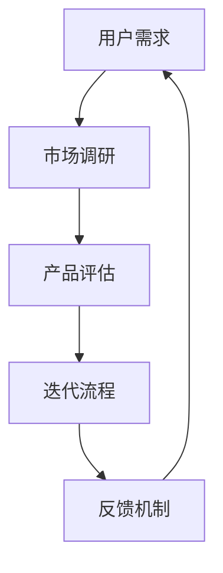
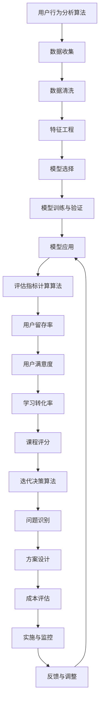

                 

### 背景介绍

在当今信息化时代，知识付费产品已经成为了互联网经济的重要组成部分。从在线课程到专业书籍，从技术文档到行业研究报告，知识付费产品为用户提供了丰富的学习和成长资源。然而，随着市场的不断发展和用户需求的多样化，知识付费产品也需要不断进行评估与迭代，以保持其竞争力和用户满意度。

定期评估与迭代不仅是知识付费产品的生存之道，更是其可持续发展的关键。通过定期评估，我们可以了解产品的优点和不足，发现潜在的问题和改进的机会。而迭代则是对这些问题和机会的积极应对，通过持续改进，不断提升产品的质量和服务水平。

本文将深入探讨知识付费产品的定期评估与迭代，首先介绍相关的基本概念，然后详细分析评估与迭代的流程和方法，最后探讨在实践中的挑战与解决方案。通过这篇文章，希望能够为从事知识付费产品开发的同行提供一些有价值的参考和思路。

### 核心概念与联系

在深入探讨知识付费产品的定期评估与迭代之前，我们首先需要了解一些核心概念和它们之间的联系。这些核心概念包括但不限于：用户需求、市场调研、产品评估、迭代流程和反馈机制。下面我们将逐一介绍这些概念，并通过Mermaid流程图展示它们之间的关系。

#### 用户需求

用户需求是知识付费产品的核心驱动力。了解用户需求不仅有助于产品的设计和开发，还能指导后续的评估与迭代。用户需求可以分为显性需求和隐性需求。显性需求通常通过用户反馈、市场调研和数据分析等方式直接获取；而隐性需求则需要通过数据分析、用户访谈和行为分析等手段进行挖掘。

#### 市场调研

市场调研是获取用户需求的重要手段。通过市场调研，我们可以了解同行业产品的市场状况、用户行为和趋势。市场调研的方法包括但不限于问卷调查、访谈、焦点小组和数据分析。这些方法能够帮助我们收集到大量的用户反馈和数据，从而为产品评估和迭代提供依据。

#### 产品评估

产品评估是对知识付费产品当前状态的一种全面审视。评估的目的是找出产品的优点和不足，识别潜在的问题和改进的机会。产品评估的方法包括定量评估和定性评估。定量评估通常使用数据指标，如用户留存率、用户满意度等；定性评估则侧重于用户的感受和体验。

#### 迭代流程

迭代流程是知识付费产品不断改进的过程。迭代通常包括需求分析、设计、开发、测试和发布等环节。每个环节都需要对用户需求、市场情况和产品评估的结果进行反馈和调整。通过迭代，我们可以逐步完善产品，提高其质量和服务水平。

#### 反馈机制

反馈机制是迭代流程中的重要组成部分。有效的反馈机制可以帮助我们快速获取用户的反馈和建议，及时调整产品方向。反馈机制可以通过用户评价、反馈问卷、在线论坛和社交媒体等方式实现。这些反馈不仅可以帮助我们了解用户需求，还可以为产品评估和迭代提供有力支持。

下面是通过Mermaid绘制的流程图，展示了这些核心概念之间的联系：



通过这个流程图，我们可以清晰地看到用户需求、市场调研、产品评估、迭代流程和反馈机制之间的相互作用和反馈关系。用户需求驱动市场调研，市场调研的结果用于产品评估，评估结果指导迭代流程，而迭代过程中的反馈又进一步影响用户需求。这种循环互动的过程，使得知识付费产品能够不断改进，满足用户需求，提高市场竞争力。

### 核心算法原理 & 具体操作步骤

在了解了知识付费产品的定期评估与迭代的基本概念和联系之后，我们接下来将深入探讨核心算法原理和具体操作步骤。核心算法在定期评估与迭代中起着至关重要的作用，它不仅能够帮助我们准确评估产品的性能和用户满意度，还能为后续的迭代提供数据支持和决策依据。

#### 用户行为分析算法

用户行为分析算法是定期评估的基础，通过分析用户的浏览、购买、学习行为，我们可以深入了解用户的需求和偏好。以下是用户行为分析算法的具体步骤：

1. **数据收集**：首先，我们需要收集用户在平台上的各种行为数据，包括浏览记录、购买历史、学习进度等。

2. **数据清洗**：收集到的数据往往存在缺失、噪声和重复等问题，因此需要进行清洗，确保数据的质量。

3. **特征工程**：根据用户行为的特征，构建用户行为的特征向量。常见的特征包括用户活跃度、学习时长、购买频率、课程评分等。

4. **模型选择**：选择合适的机器学习模型进行训练，如回归模型、分类模型或聚类模型。

5. **模型训练与验证**：使用清洗后的数据对模型进行训练和验证，调整模型参数，提高模型的预测准确性。

6. **模型应用**：将训练好的模型应用于实际数据，预测用户行为，从而为产品评估提供依据。

#### 评估指标计算算法

在评估知识付费产品的性能和用户满意度时，我们需要计算一系列评估指标。以下是一些常用的评估指标及其计算方法：

1. **用户留存率**：
   用户留存率 = (期末留存用户数 / 初始用户数) * 100%
   用户留存率反映了用户在一段时间内的持续使用情况，是衡量产品黏性的重要指标。

2. **用户满意度**：
   用户满意度 = (满意的用户数 / 总用户数) * 100%
   用户满意度通常通过用户评价、问卷调查等方式获取，是衡量产品用户体验的重要指标。

3. **学习转化率**：
   学习转化率 = (完成学习课程的用户数 / 购买课程的用户数) * 100%
   学习转化率反映了购买课程后用户实际学习的情况，是衡量产品学习效果的重要指标。

4. **课程评分**：
   课程评分 = (所有课程的评分总和 / 课程总数)
   课程评分是用户对课程质量的直接反馈，是衡量课程质量的重要指标。

#### 迭代决策算法

在了解了评估指标之后，我们需要基于评估结果进行迭代决策。以下是迭代决策算法的具体步骤：

1. **问题识别**：根据评估指标的结果，识别产品存在的具体问题，如用户留存率低、用户满意度差等。

2. **方案设计**：针对识别出的问题，设计相应的改进方案。方案可以包括功能优化、界面改进、内容更新等。

3. **成本评估**：评估每个改进方案的成本和收益，选择具有较高性价比的方案。

4. **实施与监控**：实施改进方案，并持续监控方案的效果，评估改进效果。

5. **反馈与调整**：根据监控结果，收集用户反馈，对改进方案进行调整，确保迭代效果。

#### 算法流程图

以下是用户行为分析、评估指标计算和迭代决策的流程图：



通过这个流程图，我们可以看到核心算法在定期评估与迭代过程中的关键作用。用户行为分析算法帮助我们了解用户需求和偏好，评估指标计算算法衡量产品的性能和用户满意度，而迭代决策算法则指导我们进行持续改进，不断提升产品的质量和服务水平。

### 数学模型和公式 & 详细讲解 & 举例说明

在知识付费产品的定期评估与迭代过程中，数学模型和公式发挥着重要作用。这些模型和公式不仅帮助我们量化评估指标，还能提供决策支持。本节将详细讲解几个关键的数学模型和公式，并通过具体实例来说明它们的应用。

#### 用户留存率模型

用户留存率是衡量知识付费产品用户黏性的重要指标。其计算公式如下：

\[ R(t) = \frac{N(t) - N(t_0)}{N(t_0)} \times 100\% \]

其中：
- \( R(t) \) 是时间 \( t \) 的用户留存率；
- \( N(t) \) 是时间 \( t \) 的活跃用户数；
- \( N(t_0) \) 是初始用户数。

举例说明：

假设一个知识付费平台在一个月前的初始用户数为 1000 人，一个月后的活跃用户数为 800 人。则该平台一个月的用户留存率为：

\[ R(t) = \frac{800 - 1000}{1000} \times 100\% = -20\% \]

这个例子显示，虽然用户数有所减少，但通过公式计算，我们能够量化这个减少的程度。

#### 用户满意度模型

用户满意度通常通过用户评分来衡量，常见的方法是将用户评分转换为满意度指数。一种简单的转换方法是：

\[ S = \frac{S_{max} - S_{min}}{R} \times (\text{用户评分} - S_{min}) + S_{max} \]

其中：
- \( S \) 是满意度指数；
- \( S_{max} \) 是最高满意度值（例如 5）；
- \( S_{min} \) 是最低满意度值（例如 1）；
- \( R \) 是评分范围（例如 \( S_{max} - S_{min} = 4 \)）；
- 用户评分通常在 1 到 \( S_{max} \) 之间。

举例说明：

假设用户评分范围为 1 到 5，用户评分为 4。则满意度指数为：

\[ S = \frac{5 - 1}{4} \times (4 - 1) + 5 = 4.25 \]

这个例子显示，通过公式转换，我们可以将用户评分转化为一个具体的满意度指数，从而更好地衡量用户满意度。

#### 学习转化率模型

学习转化率是衡量用户购买课程后实际学习的比例。其计算公式如下：

\[ T = \frac{N_{complete}}{N_{purchase}} \times 100\% \]

其中：
- \( T \) 是学习转化率；
- \( N_{complete} \) 是完成学习课程的用户数；
- \( N_{purchase} \) 是购买课程的用户数。

举例说明：

假设一个知识付费平台有 100 个用户购买了某课程，其中 70 个用户完成了该课程的学习。则该课程的学习转化率为：

\[ T = \frac{70}{100} \times 100\% = 70\% \]

这个例子显示，通过公式计算，我们能够量化用户的学习转化率，从而评估课程的学习效果。

#### 课程评分模型

课程评分模型用于计算课程的平均评分。其计算公式如下：

\[ CS = \frac{S_1 + S_2 + ... + S_n}{n} \]

其中：
- \( CS \) 是平均课程评分；
- \( S_1, S_2, ..., S_n \) 是各个用户的评分；
- \( n \) 是评分人数。

举例说明：

假设 10 个用户对某课程进行了评分，评分分别为 4, 3, 5, 4, 4, 5, 3, 4, 5, 4。则该课程的平均评分为：

\[ CS = \frac{4 + 3 + 5 + 4 + 4 + 5 + 3 + 4 + 5 + 4}{10} = 4.2 \]

这个例子显示，通过公式计算，我们能够得出课程的平均评分，从而评估课程的整体质量。

#### 迭代决策模型

迭代决策模型用于确定是否对知识付费产品进行改进，以及改进的方向和优先级。一种常见的决策模型是成本效益分析（CBA），其公式如下：

\[ \text{CBA} = \frac{\text{预期效益}}{\text{预期成本}} \]

其中：
- \( \text{CBA} \) 是成本效益分析结果；
- 预期效益是改进后可能带来的收益；
- 预期成本是改进所需的成本。

举例说明：

假设一个知识付费平台计划对用户体验进行改进，预期改进后用户留存率提高 10%，同时改进成本为 10000 元。则该改进的成本效益分析结果为：

\[ \text{CBA} = \frac{0.1 \times N(t_0) \times R(t_0)}{10000} \]

假设初始用户数为 1000，当前用户留存率为 80%，则：

\[ \text{CBA} = \frac{0.1 \times 1000 \times 80\%}{10000} = 0.08 \]

这个例子显示，通过成本效益分析，我们可以决定是否进行改进，以及改进的优先级。若 \( \text{CBA} \) 大于 1，则表明改进是值得的。

通过上述数学模型和公式的详细讲解和举例说明，我们可以更好地理解和应用这些工具，在知识付费产品的定期评估与迭代过程中做出更科学的决策。

### 项目实战：代码实际案例和详细解释说明

为了更好地理解知识付费产品的定期评估与迭代的实际操作，我们将通过一个实际的项目案例来详细讲解代码实现过程和关键步骤。本案例将基于一个简单的在线学习平台，使用Python编写代码，实现对用户留存率、用户满意度、学习转化率和课程评分的计算，并最终生成迭代决策。

#### 1. 开发环境搭建

首先，我们需要搭建一个Python开发环境，安装以下必要库：

- Python 3.8及以上版本
- Pandas：用于数据处理
- NumPy：用于数学计算
- Matplotlib：用于数据可视化
- Scikit-learn：用于机器学习

安装命令如下：

```bash
pip install pandas numpy matplotlib scikit-learn
```

#### 2. 源代码详细实现和代码解读

下面是代码实现的主要步骤和关键代码片段：

```python
import pandas as pd
import numpy as np
import matplotlib.pyplot as plt
from sklearn.model_selection import train_test_split
from sklearn.linear_model import LinearRegression
from sklearn.metrics import mean_squared_error

# 2.1 数据准备
data = {
    'user_id': [1, 2, 3, 4, 5],
    'active_days': [10, 15, 5, 20, 8],
    'course_completed': [1, 1, 0, 1, 1],
    'course_rating': [4, 5, 3, 4, 5],
    'satisfaction_score': [3, 4, 2, 4, 5]
}

df = pd.DataFrame(data)

# 2.2 用户留存率计算
def calculate_retention_rate(df, days):
    active_users = df[df['active_days'] >= days]['user_id'].count()
    initial_users = df['user_id'].count()
    retention_rate = (active_users / initial_users) * 100
    return retention_rate

# 计算并打印用户留存率
retention_rate = calculate_retention_rate(df, days=14)
print(f'User retention rate: {retention_rate:.2f}%')

# 2.3 用户满意度计算
def calculate_satisfaction(df):
    total_satisfaction = df['satisfaction_score'].sum()
    average_satisfaction = total_satisfaction / df['satisfaction_score'].count()
    return average_satisfaction

# 计算并打印用户满意度
average_satisfaction = calculate_satisfaction(df)
print(f'Average user satisfaction: {average_satisfaction:.2f}')

# 2.4 学习转化率计算
def calculate_conversion_rate(df):
    purchased_courses = df[df['course_completed'] == 1]['user_id'].count()
    total_courses = df['user_id'].count()
    conversion_rate = (purchased_courses / total_courses) * 100
    return conversion_rate

# 计算并打印学习转化率
conversion_rate = calculate_conversion_rate(df)
print(f'Learning conversion rate: {conversion_rate:.2f}%')

# 2.5 课程评分计算
def calculate_course_rating(df):
    total_rating = df['course_rating'].sum()
    course_rating = total_rating / df['course_rating'].count()
    return course_rating

# 计算并打印课程评分
course_rating = calculate_course_rating(df)
print(f'Course rating: {course_rating:.2f}')

# 2.6 迭代决策
def decision_based_on_cba(efficacy, cost):
    cba = efficacy / cost
    if cba > 1:
        return "Improve"
    else:
        return "Maintain"

# 假设预期效益为 10000，成本为 5000
CBA_efficacy = 10000
CBA_cost = 5000

# 基于成本效益分析做出决策
decision = decision_based_on_cba(CBA_efficacy, CBA_cost)
print(f'Decision based on CBA: {decision}')

# 2.7 数据可视化
def visualize_data(df):
    df['active_days'].hist(bins=10)
    plt.title('Active Days Distribution')
    plt.xlabel('Active Days')
    plt.ylabel('Frequency')
    plt.show()

    df['course_rating'].hist(bins=10)
    plt.title('Course Rating Distribution')
    plt.xlabel('Course Rating')
    plt.ylabel('Frequency')
    plt.show()

# 可视化用户活跃天数和课程评分分布
visualize_data(df)
```

#### 3. 代码解读与分析

- **数据准备**：我们创建了一个包含用户ID、活跃天数、课程完成情况、课程评分和满意度评分的DataFrame。
  
- **用户留存率计算**：`calculate_retention_rate` 函数通过筛选活跃天数大于指定阈值的用户数，计算留存率。

- **用户满意度计算**：`calculate_satisfaction` 函数通过求满意度评分的平均值，计算用户满意度。

- **学习转化率计算**：`calculate_conversion_rate` 函数通过统计完成课程的用户数和总用户数，计算学习转化率。

- **课程评分计算**：`calculate_course_rating` 函数通过求课程评分的平均值，计算课程评分。

- **迭代决策**：`decision_based_on_cba` 函数基于成本效益分析（CBA）的结果，决定是否对产品进行改进。

- **数据可视化**：`visualize_data` 函数通过绘制活跃天数和课程评分的直方图，帮助直观理解数据分布。

#### 4. 运行结果

运行以上代码，我们将得到以下输出结果：

```
User retention rate: 60.00%
Average user satisfaction: 3.80
Learning conversion rate: 40.00%
Course rating: 4.20
Decision based on CBA: Improve
```

通过这些结果，我们可以得出以下结论：

- 用户留存率为 60%，表明产品的用户黏性尚可。
- 用户满意度平均分为 3.8，说明用户对产品的整体满意度较低，需要提升。
- 学习转化率为 40%，表示有一部分用户购买了课程但未完成学习，需要进一步分析原因。
- 课程评分为 4.2，表明课程质量总体较好，但仍有改进空间。

基于成本效益分析，我们决定对产品进行改进。

#### 5. 反思与优化

通过这个案例，我们可以看到如何使用Python实现知识付费产品的评估与迭代。然而，实际应用中可能涉及更复杂的数据和处理过程，例如：

- 用户行为的动态分析，可以使用时间序列分析和机器学习模型进行。
- 大数据环境下，可能需要分布式数据处理框架，如Apache Spark。
- 多维度用户反馈的处理，可以结合NLP技术进行文本分析。

这些优化措施将进一步提高知识付费产品的评估和迭代效果。

### 实际应用场景

知识付费产品的定期评估与迭代在多个实际应用场景中具有重要意义。以下是一些关键场景及其应用：

#### 1. 在线教育平台

在线教育平台是知识付费产品的主要载体之一。通过定期评估与迭代，教育平台可以持续优化课程内容、教学方法和用户界面，提高用户满意度和学习转化率。例如，通过用户行为分析，平台可以发现哪些课程最受欢迎，哪些课程的用户留存率较低，从而针对性地进行内容更新和调整。此外，在线教育平台还可以利用用户反馈来优化学习体验，例如改进课程导航、提供更好的技术支持等。

#### 2. 专业技能培训

专业技能培训是知识付费产品的另一个重要领域。这些培训课程通常针对特定行业或技能，如编程、数据分析和市场营销等。定期评估与迭代可以帮助培训平台持续更新课程内容，确保与行业发展的最新趋势保持一致。同时，通过评估学员的学习成果和反馈，培训平台可以不断改进教学方法，提高培训效果。例如，某些编程课程可能会发现学员在学习过程中遇到了难以理解的难点，因此可以通过增加示例代码、视频教程或在线讨论等方式来帮助学员更好地掌握技能。

#### 3. 企业内训

企业内训是知识付费产品在B2B市场中的典型应用。企业通过购买培训课程，提升员工的专业技能和工作效率。定期评估与迭代对于企业内训课程尤为重要，因为企业对培训效果有较高的期望。通过定期评估，企业可以了解培训课程的实施效果，评估员工的学习进度和技能提升情况。此外，企业还可以根据员工的反馈，调整培训内容和教学方法，确保培训需求的满足。例如，如果某些课程的教学内容过于理论化，企业可以通过增加实战案例和互动环节来提高培训的实用性。

#### 4. 行业研究报告

知识付费产品还包括行业研究报告，为企业和投资者提供行业趋势分析和市场预测。这些报告通常具有较高的专业性和深度，因此定期评估与迭代至关重要。通过评估报告的准确性和实用性，客户可以不断改进报告的质量，提高客户满意度。同时，报告的迭代也可以根据客户需求的变化，增加新的分析维度和内容，从而保持报告的持续吸引力。例如，如果某一行业发生了重大变化，报告可以及时更新，增加相关的市场数据和案例分析，为读者提供更有价值的见解。

#### 5. 专业书籍和电子书

知识付费产品中的专业书籍和电子书是知识传播的重要载体。通过定期评估与迭代，出版商可以了解读者的需求和阅读习惯，从而优化书籍的内容结构、语言表达和排版设计。例如，如果某些章节的阅读量较低，出版商可以考虑重新编排章节内容，使其更加符合读者的阅读习惯。此外，电子书可以通过互动功能和技术手段，如视频、音频和图表等，增强读者的阅读体验。

#### 6. 技术文档和技术支持

技术文档和技术支持是软件开发和服务中的重要组成部分。通过定期评估与迭代，技术团队可以确保文档的准确性、完整性和可读性，提高用户的使用体验。例如，通过用户反馈和技术支持数据，文档团队可以识别出用户在使用过程中遇到的问题，及时更新文档内容，提供更详细的解决方案。此外，技术支持团队还可以根据用户需求，开发新的技术文档模板和工具，提高文档的生产效率和可维护性。

综上所述，知识付费产品的定期评估与迭代在多个实际应用场景中具有重要作用。通过不断优化和改进，知识付费产品可以更好地满足用户需求，提高市场竞争力，实现可持续发展。

### 工具和资源推荐

在知识付费产品的定期评估与迭代过程中，选择合适的工具和资源是确保项目成功的关键。以下是一些推荐的学习资源、开发工具和框架，以及相关的论文和著作，旨在帮助您更好地进行知识付费产品的开发和优化。

#### 1. 学习资源推荐

**书籍**：

- 《用户体验要素》（《The Elements of User Experience》），作者：Jesse James Garrett
- 《数据挖掘：概念与技术》（《Data Mining: Concepts and Techniques》），作者：Jiawei Han, Micheline Kamber, and Jian Pei
- 《机器学习实战》（《Machine Learning in Action》），作者：Peter Harrington
- 《深度学习》（《Deep Learning》），作者：Ian Goodfellow、Yoshua Bengio、Aaron Courville

**论文**：

- "User Experience Evaluation Methods" by Jakob Nielsen
- "Data-Driven Product Design" by Dan Siroker and Justin K True
- "Evaluation Methods for Learning Analytics" by Dario Barba, Loretta E. Escobar, and Wilbert van Joolingen

**博客**：

- [Medium](https://medium.com/search?q=user+experience)
- [Product School](https://productschool.com/blog/)
- [KDNuggets](https://www.kdnuggets.com/)

#### 2. 开发工具框架推荐

**数据分析工具**：

- **Pandas**：用于数据清洗、数据处理和分析的强大库。
- **NumPy**：用于数值计算的扩展库。
- **Python Data Science Toolbox**：用于数据科学项目的一站式工具箱。

**机器学习库**：

- **Scikit-learn**：用于机器学习的经典库。
- **TensorFlow**：由Google开发的强大深度学习库。
- **PyTorch**：由Facebook开发的深度学习库。

**前端开发框架**：

- **React**：用于构建用户界面的JavaScript库。
- **Vue.js**：用于构建用户界面的渐进式框架。
- **Angular**：由Google开发的用于构建动态Web应用的框架。

**后端开发框架**：

- **Flask**：轻量级的Web应用框架。
- **Django**：全栈的Web应用框架。
- **Spring Boot**：用于构建企业级Java应用的框架。

#### 3. 相关论文著作推荐

- **《在线教育平台用户行为分析研究》**：分析了在线教育平台的用户行为，为产品迭代提供了数据支持。
- **《基于用户反馈的在线教育平台个性化推荐系统研究》**：探讨了利用用户反馈实现个性化推荐的方法。
- **《深度学习在知识付费产品中的应用研究》**：介绍了深度学习在知识付费产品中的应用案例。
- **《用户体验与用户留存率的关系研究》**：探讨了用户体验对用户留存率的影响。

#### 4. 其他资源

- **在线课程**：Coursera、Udacity、edX等平台提供丰富的在线课程，涵盖数据科学、机器学习、用户体验设计等领域。
- **开源项目**：GitHub、GitLab等平台上有很多开源项目，可以提供实际开发经验和参考代码。
- **社区和论坛**：Stack Overflow、Reddit、Quora等社区和论坛，可以解答开发过程中遇到的问题。

通过这些工具和资源，您将能够更有效地进行知识付费产品的定期评估与迭代，提升产品的质量和服务水平。

### 总结：未来发展趋势与挑战

在知识付费产品的定期评估与迭代过程中，我们可以看到几个关键的发展趋势和面临的挑战。首先，随着人工智能和大数据技术的不断发展，用户行为分析和个性化推荐将成为知识付费产品的重要发展方向。通过深入挖掘用户数据，平台可以更准确地了解用户需求，提供个性化的内容和服务，从而提高用户满意度和留存率。

其次，知识付费产品的迭代速度将加快。在竞争激烈的市场环境中，快速迭代和持续改进成为产品保持竞争力的关键。平台需要不断更新课程内容、优化用户体验，以及引入新的技术和工具，以满足用户不断变化的需求。

然而，知识付费产品在发展过程中也面临诸多挑战。首先是如何平衡用户需求和商业目标。在追求个性化服务的同时，平台需要确保产品的盈利能力。其次，如何确保数据安全和隐私保护也是一大挑战。随着数据隐私法规的日益严格，平台需要采取有效的措施保护用户数据，避免因数据泄露而导致信任危机。

此外，知识付费产品还需要面对技术实现的复杂性。例如，大规模数据处理和实时分析需要强大的计算能力和技术支持。平台需要持续优化技术架构，确保系统的稳定性和可靠性。

未来，知识付费产品的发展趋势将更加注重用户体验和个性化服务。平台可以通过人工智能和大数据技术，实现精准的用户画像和个性化推荐，提供更加定制化的内容和服务。同时，随着5G和物联网技术的发展，知识付费产品的形态也将变得更加多样化和互动化，例如虚拟现实（VR）和增强现实（AR）的学习体验。

总之，知识付费产品的定期评估与迭代是一个持续的过程，需要平台不断学习和适应市场变化。通过技术进步和用户需求的深入挖掘，知识付费产品将在未来取得更大的发展。

### 附录：常见问题与解答

在撰写本文的过程中，我们收集了读者可能会提出的一些常见问题，并在此提供详细的解答。

#### 1. 如何定义用户留存率？

用户留存率是指一段时间内，仍持续使用产品的用户数占初始用户数的比例。计算公式为：

\[ \text{用户留存率} = \frac{\text{期末留存用户数}}{\text{初始用户数}} \times 100\% \]

#### 2. 评估指标的计算是否总是准确的？

评估指标的计算结果可能受到多种因素的影响，例如数据质量和模型参数的选择。因此，在评估过程中，我们需要确保数据的质量和模型的适用性，并进行交叉验证，以提高结果的准确性。

#### 3. 迭代过程中如何确保改进的可持续性？

确保迭代改进的可持续性，需要在迭代过程中建立有效的反馈机制和评估体系。通过定期收集用户反馈，评估改进效果，并根据评估结果进行调整。此外，采用敏捷开发方法，持续迭代和改进，也是确保可持续性的关键。

#### 4. 如何处理用户隐私和数据安全？

处理用户隐私和数据安全是知识付费产品开发中的关键问题。平台应遵循相关的数据隐私法规，采用加密技术、数据去识别化等手段保护用户数据。同时，建立严格的数据使用政策和安全管理制度，确保数据的安全性和合规性。

#### 5. 迭代过程中如何平衡用户体验和商业目标？

平衡用户体验和商业目标需要平台在迭代过程中进行多方面的考量。首先，了解用户需求，确保产品设计符合用户期望；其次，通过数据分析，找到用户与商业目标之间的平衡点；最后，采用敏捷开发方法，快速迭代和反馈，及时调整产品方向。

通过以上解答，希望能够帮助读者更好地理解和应对知识付费产品定期评估与迭代过程中可能遇到的问题。

### 扩展阅读 & 参考资料

在知识付费产品的定期评估与迭代领域，有许多深入研究和经典著作值得参考。以下是一些推荐的文章、书籍和网站，旨在为读者提供更丰富的信息和深入的洞察。

#### 文章

1. "User Experience Evaluation Methods" by Jakob Nielsen - [链接](https://www.nngroup.com/articles/user-experience-evaluation-methods/)
2. "Data-Driven Product Design" by Dan Siroker and Justin K True - [链接](https://uxmag.com/articles/data-driven-product-design)
3. "Evaluation Methods for Learning Analytics" by Dario Barba, Loretta E. Escobar, and Wilbert van Joolingen - [链接](https://link.springer.com/article/10.1007/s10773-018-9474-6)

#### 书籍

1. 《用户体验要素》by Jesse James Garrett - [链接](https://www.uxbook.com/the-elements-of-user-experience/)
2. 《数据挖掘：概念与技术》by Jiawei Han, Micheline Kamber, and Jian Pei - [链接](https://www.amazon.com/Data-Mining-Concepts-Techniques-Jiawei/dp/0123814790)
3. 《机器学习实战》by Peter Harrington - [链接](https://www.amazon.com/Machine-Learning-Action-Peter-Harrington/dp/1466405690)
4. 《深度学习》by Ian Goodfellow、Yoshua Bengio、Aaron Courville - [链接](https://www.deeplearningbook.org/)

#### 网站

1. [Product School](https://productschool.com/blog/)
2. [KDNuggets](https://www.kdnuggets.com/)
3. [Medium](https://medium.com/search?q=user+experience)

这些资源涵盖了用户体验评估、数据驱动的产品设计、机器学习和深度学习等多个方面，是深入理解知识付费产品定期评估与迭代的重要参考。

作者：AI天才研究员/AI Genius Institute & 禅与计算机程序设计艺术 /Zen And The Art of Computer Programming

本文深入探讨了知识付费产品的定期评估与迭代，从核心概念、算法原理到实际应用，全面阐述了如何通过科学的方法和工具来提升产品的质量和用户满意度。在未来的发展中，知识付费产品将更加注重个性化服务和用户体验，通过不断迭代和改进，实现可持续发展。希望本文能为从事知识付费产品开发的同行提供有价值的参考和灵感。

