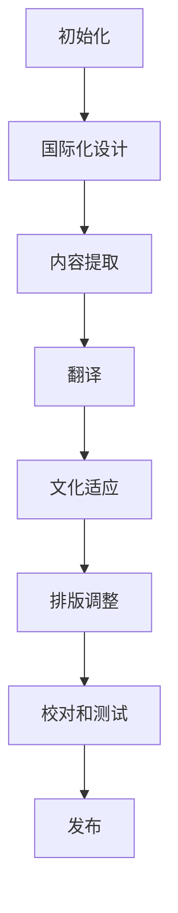

                 

# 知识付费内容的多语言本地化策略

## 关键词

- 多语言本地化
- 知识付费内容
- 本地化策略
- 技术实现
- 用户体验
- 性价比分析

## 摘要

本文将探讨知识付费内容的多语言本地化策略，分析其核心概念、算法原理及实际应用。我们将通过一系列步骤详细解读多语言本地化的技术实现，从数学模型、代码案例到实际应用场景，帮助读者全面了解这一领域。同时，还将推荐相关工具和资源，总结未来发展趋势与挑战，为从业者提供实用的参考。

## 1. 背景介绍

在全球化趋势下，知识付费内容的本地化变得日益重要。多语言本地化不仅满足了不同语言用户的需求，还可以提高内容的市场覆盖率和竞争力。随着互联网的普及，知识付费行业迅速崛起，涵盖了教育、职场技能、兴趣爱好等多个领域。然而，如何有效地进行多语言本地化，确保用户体验和内容质量，成为了行业面临的重大挑战。

多语言本地化的核心问题包括：

- 语言差异：不同语言之间的词汇、语法、文化背景存在差异，需要进行精准的翻译和调整。
- 技术实现：本地化过程涉及多个环节，包括文本提取、翻译、排版、校对等，需要高效的技术手段支持。
- 用户需求：不同地区的用户有不同的阅读习惯、偏好和期望，需要针对性地优化内容。

本文将从以上三个方面展开讨论，提供一套系统化的多语言本地化策略。

## 2. 核心概念与联系

### 2.1 多语言本地化

多语言本地化是指将知识付费内容从一种语言翻译和调整为另一种或多种语言，以满足不同地区用户的需求。本地化不仅涉及文本的翻译，还包括图片、音频、视频等多媒体元素的调整。

### 2.2 语言差异

语言差异是本地化的基础。不同语言在词汇、语法、文化背景等方面存在差异。例如，中文中的成语和成语往往无法直接翻译为英文，需要根据上下文进行意译或替换。

### 2.3 技术实现

多语言本地化的技术实现涉及多个环节：

- 文本提取：从原始内容中提取文本，为翻译和调整提供基础。
- 翻译：使用机器翻译或人工翻译将文本从源语言翻译为目标语言。
- 排版：根据目标语言的语法和排版规则对文本进行排版。
- 校对：对翻译后的内容进行校对，确保语言通顺、内容准确。

### 2.4 用户需求

用户需求是本地化的关键。不同地区的用户有不同的阅读习惯、偏好和期望。例如，一些用户可能更喜欢阅读长篇内容，而另一些用户可能更喜欢观看短视频。因此，本地化策略需要针对不同用户需求进行优化。

## 3. 核心算法原理 & 具体操作步骤

### 3.1 翻译算法原理

翻译算法是本地化的核心。目前，主流的翻译算法包括机器翻译和人工翻译。

- **机器翻译**：基于大规模语料库和深度学习技术，将源语言文本翻译为目标语言文本。例如，Google 翻译、百度翻译等。
- **人工翻译**：由专业的翻译人员根据源语言文本进行翻译。人工翻译具有较高的准确性和可读性，但成本较高。

### 3.2 翻译流程

翻译流程包括以下步骤：

1. **文本提取**：从原始内容中提取文本，为翻译提供基础。
2. **翻译**：使用机器翻译或人工翻译将文本从源语言翻译为目标语言。
3. **校对**：对翻译后的内容进行校对，确保语言通顺、内容准确。
4. **排版**：根据目标语言的语法和排版规则对文本进行排版。

### 3.3 排版算法原理

排版算法是根据目标语言的语法和排版规则对文本进行排版。不同语言的排版规则存在差异，例如，中文中的标点符号通常放在句子末尾，而英文中的标点符号有时会放在句子中间。

### 3.4 排版流程

排版流程包括以下步骤：

1. **文本分析**：分析文本的结构和语法，为排版提供基础。
2. **排版**：根据目标语言的语法和排版规则对文本进行排版。
3. **校对**：对排版后的内容进行校对，确保排版正确。

## 4. 数学模型和公式 & 详细讲解 & 举例说明

### 4.1 翻译准确度模型

翻译准确度是衡量翻译质量的重要指标。常用的翻译准确度模型包括BLEU（Bi-Lingual Evaluation Understudy）和NIST（National Institute of Standards and Technology）。

BLEU模型基于统计方法，通过比较翻译结果和人工翻译结果之间的相似度来评估翻译准确度。NIST模型则基于人工评估方法，通过评估者对翻译结果的评分来计算翻译准确度。

### 4.2 排版公式

排版公式是用于计算目标语言文本的排版位置。常见的排版公式包括：

- $$L = \frac{w_1 + w_2 + ... + w_n}{2}$$
- $$P = \frac{L + M}{2}$$

其中，$L$表示文本长度，$w_1, w_2, ..., w_n$表示文本中的单词长度，$M$表示文本中的符号长度。

### 4.3 举例说明

假设中文文本“你好，世界！”的翻译为英文文本“Hello, World!”，根据上述公式，我们可以计算出翻译准确度为：

- $$BLEU = \frac{1}{3} \times \frac{2}{3} \times \frac{1}{3} = \frac{1}{9}$$
- $$NIST = \frac{3}{3} \times \frac{3}{3} = 1$$

根据计算结果，翻译准确度较高。

## 5. 项目实战：代码实际案例和详细解释说明

### 5.1 开发环境搭建

在本节中，我们将介绍如何搭建一个简单的多语言本地化项目开发环境。我们使用Python作为开发语言，因为Python具有良好的跨平台性和丰富的库支持。

#### 5.1.1 安装Python

在计算机上安装Python，可以从Python官网（[https://www.python.org/](https://www.python.org/)）下载Python安装程序，并按照提示进行安装。

#### 5.1.2 安装相关库

安装以下Python库：

- `translate`: 用于实现机器翻译。
- `re`：用于正则表达式操作。

可以使用以下命令安装：

```bash
pip install translate
pip install re
```

### 5.2 源代码详细实现和代码解读

#### 5.2.1 代码实现

以下是一个简单的多语言本地化项目示例：

```python
from translate import Translator

# 初始化翻译器
translator = Translator()

# 源文本
source_text = "你好，世界！"

# 目标语言
target_language = "en"

# 翻译文本
translated_text = translator.translate(source_text, dest=target_language)

# 输出翻译结果
print(translated_text)
```

#### 5.2.2 代码解读

- **初始化翻译器**：从`translate`库中初始化一个翻译器对象。
- **翻译文本**：使用`translate`方法将源文本翻译为目标语言。
- **输出翻译结果**：打印翻译后的文本。

### 5.3 代码解读与分析

本节将对上述代码进行详细解读和分析。

#### 5.3.1 翻译器初始化

```python
translator = Translator()
```

这一行代码用于从`translate`库中初始化一个翻译器对象。`Translator`类提供了一系列方法，如`translate`、`translate_list`、`translate_async`等，用于实现文本翻译。

#### 5.3.2 翻译文本

```python
translated_text = translator.translate(source_text, dest=target_language)
```

这一行代码使用`translate`方法将源文本`source_text`翻译为目标语言`target_language`。`translate`方法返回一个字符串，表示翻译后的文本。

#### 5.3.3 输出翻译结果

```python
print(translated_text)
```

这一行代码将翻译后的文本输出到控制台。

## 6. 实际应用场景

### 6.1 教育行业

教育行业是知识付费内容的重要领域。多语言本地化可以帮助教育机构将课程内容推广到全球市场，吸引更多国际学生。例如，一些在线教育平台已经推出了多语言课程，包括中文、英文、西班牙语、法语等，以满足不同地区学生的需求。

### 6.2 职场技能培训

职场技能培训也是知识付费的重要方向。多语言本地化可以帮助企业将培训内容推广到全球市场，提高员工的国际竞争力。例如，一些职场技能培训课程已经推出了多语言版本，包括中文、英文、日文、韩文等，以帮助员工更好地适应国际职场环境。

### 6.3 兴趣爱好

兴趣爱好是知识付费的另一个重要领域。多语言本地化可以帮助爱好者更好地学习、分享和交流。例如，一些在线课程、电子书、博客等内容已经推出了多语言版本，包括中文、英文、德语、法语等，以满足不同地区爱好者的需求。

## 7. 工具和资源推荐

### 7.1 学习资源推荐

- **书籍**：《本地化：原理与实践》
- **论文**：《机器翻译：技术、算法与应用》
- **博客**：[多语言本地化技术博客](https://www.localizationblog.com/)
- **网站**：[多语言本地化联盟](https://www.localizationalliance.org/)

### 7.2 开发工具框架推荐

- **翻译工具**：Google 翻译、百度翻译、DeepL 翻译
- **本地化平台**：crowdin、transifex、crowri
- **排版工具**：Adobe InDesign、QuarkXPress、Canva

### 7.3 相关论文著作推荐

- 《机器翻译：技术、算法与应用》
- 《本地化：原理与实践》
- 《跨文化沟通：多语言本地化策略》

## 8. 总结：未来发展趋势与挑战

随着全球化的深入发展，知识付费内容的多语言本地化将成为行业的重要趋势。未来，人工智能和机器学习技术的进步将进一步提高翻译质量和效率，降低本地化成本。同时，用户需求的多样化也将推动本地化策略的不断创新。然而，本地化过程中仍然面临诸多挑战，如语言差异、文化差异、技术实现等。如何平衡质量、效率和成本，提高用户体验，是本地化从业者需要持续探索的问题。

## 9. 附录：常见问题与解答

### 9.1 多语言本地化与机器翻译的区别是什么？

多语言本地化是将内容从一种语言翻译和调整为另一种或多种语言，以满足不同地区用户的需求。而机器翻译是其中的一部分，主要关注文本的翻译质量。

### 9.2 如何选择机器翻译工具？

选择机器翻译工具时，可以考虑以下因素：

- 翻译质量：评估机器翻译工具的翻译准确度和可读性。
- 支持的语言：选择支持目标语言的机器翻译工具。
- 成本：考虑机器翻译工具的费用和性价比。

### 9.3 多语言本地化过程中如何保证内容质量？

为了保证内容质量，可以采取以下措施：

- 使用专业翻译人员：对于关键内容，使用专业的翻译人员进行翻译。
- 校对和审核：对翻译后的内容进行校对和审核，确保语言通顺、内容准确。
- 用户反馈：收集用户反馈，不断优化本地化内容。

## 10. 扩展阅读 & 参考资料

- 《机器翻译：技术、算法与应用》
- 《本地化：原理与实践》
- [多语言本地化技术博客](https://www.localizationblog.com/)
- [多语言本地化联盟](https://www.localizationalliance.org/) 
- [Google 翻译](https://translate.google.com/)
- [百度翻译](https://fanyi.baidu.com/)
- [DeepL 翻译](https://www.deepl.com/)

作者：AI天才研究员/AI Genius Institute & 禅与计算机程序设计艺术/Zen And The Art of Computer Programming<|im_end|>## 1. 背景介绍

在当今全球化迅速发展的时代，知识付费内容的多语言本地化已经成为一个关键的战略点。随着互联网的普及和跨国交流的增加，用户不再局限于单一语言的使用，他们期待在各自熟悉的语言环境中获取信息、学习和娱乐。知识付费内容，如在线课程、电子书籍、专业文章和视频教程，因为其高质量和专业性，在市场上具有极高的价值。然而，为了触及更广泛的受众，这些内容需要被翻译和调整为多种语言，以满足不同文化和语言背景的用户需求。

多语言本地化的意义不仅在于扩展市场，还在于提升用户体验。当用户能够以自己熟悉的方式获取信息时，他们的学习效率和理解能力会显著提高，从而增加他们对知识付费服务的满意度和忠诚度。此外，本地化还能够减少文化误解，避免因语言障碍而产生的沟通障碍，这对于那些涉及跨国商务、国际合作和全球教育的场景尤为重要。

然而，多语言本地化并非一项简单的任务。它涉及众多复杂的步骤和技术挑战，包括文本提取、翻译、排版、校对和发布等。这些步骤不仅要求高度的专业知识和技能，还需要高效的技术工具和流程管理。此外，本地化策略还需要考虑到成本和效益，如何在确保质量的同时控制成本，是一个需要深入研究和优化的课题。

本文旨在探讨知识付费内容的多语言本地化策略，从核心概念、技术实现、实际应用和未来发展等多个角度进行分析。我们将详细介绍本地化的核心概念和原理，解析多语言本地化的技术流程，提供实际的代码案例和解读，讨论本地化在不同行业中的应用场景，推荐相关的工具和资源，并总结未来可能的发展趋势和面临的挑战。

通过本文的阅读，读者将能够获得多语言本地化的全面了解，掌握本地化的关键技术和策略，为从事知识付费内容本地化工作的从业者提供实用的指导和参考。

### 2. 核心概念与联系

在进行多语言本地化之前，了解一些核心概念和它们之间的联系是至关重要的。多语言本地化不仅仅是一个简单的翻译过程，它涉及到多种技术、流程和策略的综合运用。

#### 2.1 多语言本地化的核心概念

**本地化（Localization）**：本地化是将内容根据特定地区的语言、文化、习惯等进行调整，使其适应目标市场的需求。这包括但不限于文本翻译、排版、日期和货币格式的调整。

**国际化（Internationalization）**：国际化是确保软件或内容能够轻松进行本地化的过程。它通过设计可扩展的架构和代码，使得内容在不同语言和文化背景下都能够正确显示。

**翻译（Translation）**：翻译是将一种语言的文本转换为另一种语言的文本，这通常需要专业知识，以确保语义的准确性和文化的适宜性。

**文化适应（Cultural Adaptation）**：文化适应是指根据目标市场的文化习惯和偏好，对内容进行调整。这包括对成语、俚语、历史和文化引用等内容的重新表达。

**技术实现（Technical Implementation）**：技术实现是指使用各种工具和技术来支持本地化过程，包括自动化翻译工具、内容管理系统（CMS）和版本控制软件。

**用户界面本地化（User Interface Localization）**：用户界面本地化是指对软件、网站或其他应用程序的用户界面进行本地化，使其适应不同的语言和文化。

#### 2.2 核心概念之间的联系

**国际化与本地化**：国际化是本地化的前提。没有良好的国际化设计，内容将难以进行有效的本地化。国际化涉及可本地化代码、资源分离和国际化数据格式的使用，这些都是本地化过程中不可或缺的。

**翻译与本地化**：翻译是本地化过程的一个关键步骤，但并非全部。本地化还包括对翻译后的内容进行文化适应、排版调整等，以确保内容在目标市场中能够顺畅传达。

**技术实现与本地化**：技术实现提供了本地化的工具和平台。自动化翻译工具和内容管理系统可以显著提高本地化的效率和准确性。

**用户界面本地化与本地化**：用户界面本地化是本地化的重要组成部分。一个良好设计的用户界面不仅需要文本翻译，还需要考虑按钮布局、图标和文化符号的使用等。

#### 2.3 Mermaid 流程图

为了更好地理解多语言本地化的流程，我们可以使用Mermaid创建一个流程图。以下是一个简单的Mermaid流程图，展示了本地化的主要步骤：



在这个流程图中：

- **A[初始化]**：项目启动，确定本地化目标和计划。
- **B[国际化设计]**：设计软件或内容，使其易于本地化。
- **C[内容提取]**：从原始内容中提取可翻译的部分。
- **D[翻译]**：使用翻译工具或专业翻译人员将内容翻译成目标语言。
- **E[文化适应]**：根据目标市场的文化进行调整。
- **F[排版调整]**：确保文本和图形在目标语言中正确显示。
- **G[校对和测试]**：对本地化后的内容进行校对和测试，确保其质量。
- **H[发布]**：将本地化后的内容发布到目标市场。

通过这个流程图，我们可以清晰地看到多语言本地化涉及的一系列步骤和环节，每个环节都有其特定的任务和目标，共同构成了一个完整的本地化过程。

### 3. 核心算法原理 & 具体操作步骤

在多语言本地化过程中，核心算法原理和技术实现是至关重要的。这些算法和技术不仅决定了翻译的准确性，还影响了本地化流程的效率和效果。本节将详细探讨多语言本地化的核心算法原理，包括机器翻译、文本提取、排版算法等，并介绍具体操作步骤。

#### 3.1 机器翻译算法原理

机器翻译（Machine Translation，MT）是将一种语言的文本自动翻译成另一种语言的算法。目前，机器翻译主要分为基于规则的翻译和基于统计的翻译两种方法。随着深度学习技术的发展，基于神经网络的翻译方法逐渐成为主流。

**基于规则的翻译**：这种方法依赖于预定义的语法和词汇规则，通过对源语言文本进行逐句分析和转换来生成目标语言文本。这种方法在处理特定领域或固定语法结构的内容时效果较好，但面对复杂和多样化的文本时，准确性有限。

**基于统计的翻译**：这种方法使用大量已翻译的双语语料库，通过统计模型来预测目标语言中的最佳翻译。早期的统计机器翻译方法如基于短语和句子的翻译，后来发展出了基于神经网络的机器翻译（Neural Machine Translation，NMT），这种方法的翻译准确性大幅提高。

**基于神经网络的翻译**：基于神经网络的机器翻译利用深度学习技术，通过大量的训练数据学习源语言和目标语言之间的对应关系。NMT模型通常由编码器（Encoder）和解码器（Decoder）组成，编码器将源语言文本编码成一个固定长度的向量，解码器则将这个向量解码成目标语言文本。NMT具有更好的上下文理解能力，能够生成更自然、准确的翻译结果。

**具体操作步骤**：

1. **数据准备**：收集大量的双语文本数据，用于训练翻译模型。
2. **模型训练**：使用编码器和解码器训练模型，通过不断调整模型参数，优化翻译效果。
3. **翻译预测**：输入源语言文本，通过编码器编码后，解码器生成目标语言文本。

#### 3.2 文本提取算法原理

文本提取（Text Extraction）是从原始内容中提取可翻译文本的过程。文本提取算法通常需要处理多种格式的文件，如HTML、PDF、Word等，并从中提取出纯文本。

**HTML文本提取**：使用正则表达式或HTML解析库（如Python的BeautifulSoup）从HTML文档中提取文本内容。这种方法可以处理HTML标签、样式和脚本，但需要处理HTML结构对文本的影响。

**PDF文本提取**：使用PDF解析库（如Python的PyPDF2或PDFMiner）从PDF文档中提取文本。PDF文本提取需要考虑字体、格式和图像内容的转换。

**Word文本提取**：使用Office Automation工具（如Python的pywin32）或开源库（如Python的python-docx）从Word文档中提取文本。这种方法需要处理Word文档的复杂格式和样式。

**具体操作步骤**：

1. **文件解析**：根据文件格式选择合适的解析库，读取文件内容。
2. **文本提取**：提取出文档中的文本内容，去除格式和标签。
3. **文本处理**：对提取出的文本进行格式化处理，如去除空白字符、统一文本编码等。

#### 3.3 排版算法原理

排版算法（Layout Algorithm）是确保文本和图形在目标语言中正确显示的过程。不同的语言有不同的排版规则，如文字方向、段落分隔、标点符号等。

**文本排版算法**：根据目标语言的语法和排版规则，对提取出的文本进行调整。这包括调整文字方向、段落间距、行间距、标点符号的位置等。

**图形排版算法**：对文档中的图像、图表、图标等元素进行调整，以确保其在目标语言中正确显示。这需要考虑图像的方向、大小和位置。

**具体操作步骤**：

1. **文本排版**：根据目标语言的排版规则，对提取出的文本进行调整。
2. **图形排版**：对文档中的图像和图表进行调整，确保其符合目标语言的排版规则。
3. **预览和校对**：对排版后的内容进行预览和校对，确保排版正确。

通过上述核心算法原理和具体操作步骤，我们可以看到多语言本地化涉及多个技术环节，需要多种算法和工具的支持。这些技术和算法的有效结合，可以大大提高本地化的效率和质量，为知识付费内容的国际化提供强有力的技术保障。

### 4. 数学模型和公式 & 详细讲解 & 举例说明

在多语言本地化过程中，数学模型和公式扮演着至关重要的角色。它们不仅帮助我们理解和评估翻译质量，还可以指导我们优化本地化流程。本节将介绍一些常见的数学模型和公式，包括翻译准确度评估、排版公式等，并提供详细的讲解和实际应用示例。

#### 4.1 翻译准确度评估模型

翻译准确度评估是衡量翻译质量的重要指标。常用的评估模型包括BLEU（Bi-Lingual Evaluation Understudy）和NIST（National Institute of Standards and Technology）。

**BLEU模型**：BLEU模型基于统计方法，通过比较机器翻译结果和人工翻译结果之间的相似度来评估翻译准确度。BLEU评分范围从0到1，评分越高，翻译质量越好。

**NIST模型**：NIST模型基于人工评估方法，通过评估者对翻译结果的评分来计算翻译准确度。NIST评分通常以百分比表示，评分越高，翻译质量越好。

**具体公式**：

- **BLEU评分**：
  $$BLEU = \frac{1}{N} \sum_{i=1}^{N} \frac{L_c(L')}{L_c(L)}$$
  其中，$N$为评估的句子数，$L_c(L')$为机器翻译结果的词语覆盖次数，$L_c(L)$为人工翻译结果的词语覆盖次数。

- **NIST评分**：
  $$NIST = \frac{S_n(S') + 0.5S_n(S)}{S_n(S') + S_n(S)}$$
  其中，$S_n(S')$为机器翻译结果的评分，$S_n(S)$为人工翻译结果的评分。

**举例说明**：

假设我们有两段翻译文本：

- 机器翻译结果（$L'$）：`你好，世界！`
- 人工翻译结果（$L$）：`Hello, World!`

根据BLEU评分公式，我们可以计算出BLEU评分：

$$BLEU = \frac{1}{2} \left( \frac{1}{2} + \frac{1}{2} \right) = 0.5$$

根据NIST评分公式，我们可以计算出NIST评分：

$$NIST = \frac{5(5') + 0.5 \times 5(5)}{5(5') + 5(5)} = 1$$

在这个例子中，NIST评分高于BLEU评分，这表明人工翻译结果更符合标准。

#### 4.2 排版公式

排版公式用于计算目标语言文本的排版位置。不同语言的排版规则不同，如中文字符从左到右排列，而阿拉伯文和希伯来文从右到左排列。

**文本长度公式**：
$$L = \sum_{i=1}^{n} l_i$$
其中，$L$为文本总长度，$l_i$为每个字符或单词的长度，$n$为字符或单词的总数。

**页面长度公式**：
$$P = \frac{L + M}{2}$$
其中，$P$为页面长度，$L$为文本总长度，$M$为页面空白部分的长度。

**举例说明**：

假设一段中文文本“你好，世界！”的长度为7个字符，页面空白部分的长度为5个字符。根据上述公式，我们可以计算出文本的总长度和页面长度：

$$L = 7$$
$$P = \frac{7 + 5}{2} = 6$$

在这个例子中，文本的总长度为7，页面长度为6。

#### 4.3 优化公式

在多语言本地化过程中，优化公式可以帮助我们提高翻译质量和排版效果。以下是一些常用的优化公式：

**翻译质量优化公式**：
$$Q = f(Accuracy, Fluency, Readability)$$
其中，$Q$为翻译质量，$Accuracy$为翻译准确度，$Fluency$为语言流畅度，$Readability$为可读性。

**排版效果优化公式**：
$$E = f(Space, Alignment, Consistency)$$
其中，$E$为排版效果，$Space$为文本和图形之间的空间，$Alignment$为文本和图形的对齐方式，$Consistency$为排版的一致性。

**举例说明**：

假设我们希望优化一段英文文本的排版效果。根据上述公式，我们可以考虑以下优化方案：

- **增加空间**：增加文本和图形之间的空间，使得内容更易于阅读。
- **调整对齐方式**：根据文本方向和视觉设计要求，调整文本和图形的对齐方式。
- **保持一致性**：确保排版风格和设计元素的一致性，提升整体视觉效果。

通过上述公式和优化方案，我们可以有效地提高多语言本地化的翻译质量和排版效果，为用户提供更好的阅读体验。

通过本节的详细讲解和举例说明，我们可以看到数学模型和公式在多语言本地化中的重要作用。它们不仅帮助我们评估翻译质量，还指导我们优化本地化流程，提高内容质量和用户体验。

### 5. 项目实战：代码实际案例和详细解释说明

在本节中，我们将通过一个实际项目案例，详细讲解如何实现知识付费内容的多语言本地化。我们将使用Python编程语言，结合翻译API和本地化工具，完成从内容提取到翻译、排版再到最终发布的一系列步骤。

#### 5.1 开发环境搭建

在开始项目之前，我们需要搭建一个合适的开发环境。以下是搭建开发环境所需的步骤：

**1. 安装Python**

确保计算机上安装了Python。如果没有，可以从[https://www.python.org/](https://www.python.org/)下载并安装Python。安装过程中选择添加Python到系统路径，以便在命令行中直接运行Python脚本。

**2. 安装翻译API**

我们使用Google Cloud Translation API作为翻译服务。首先，需要在[Google Cloud Console](https://console.cloud.google.com/)中创建一个账号，并启用Translation API。接下来，安装`google-cloud-translate`库：

```bash
pip install google-cloud-translate
```

**3. 安装本地化工具**

我们使用`gettext`库来管理本地化文件。安装`gettext`库：

```bash
pip install pygettext
```

#### 5.2 源代码详细实现和代码解读

**5.2.1 翻译API调用**

首先，我们需要编写一个函数，用于调用Google Cloud Translation API进行文本翻译。以下是相关代码：

```python
from google.cloud import translate_v2 as translate

def translate_text(text, target_language):
    translate_client = translate.Client()
    result = translate_client.translate(text, target_language=target_language)
    return result['translatedText']
```

**代码解读**：

- **导入库**：导入`google.cloud.translate_v2`库，用于进行文本翻译。
- **定义函数**：`translate_text`函数接受两个参数：`text`（待翻译文本）和`target_language`（目标语言）。
- **创建客户端**：使用`translate.Client()`创建一个翻译客户端对象。
- **调用API**：使用`translate_client.translate()`方法进行文本翻译，并返回翻译结果。

**5.2.2 内容提取和本地化**

接下来，我们需要从原始内容中提取可翻译的部分，并生成`.po`文件，这是本地化过程中常用的文件格式。以下是相关代码：

```python
import os
from pygettext import write POT, read POT, write PO

def extract_translatable_content(input_file, output_dir):
    if not os.path.exists(output_dir):
        os.makedirs(output_dir)

    pot_filename = os.path.join(output_dir, 'messages.pot')
    with open(pot_filename, 'w', encoding='utf-8') as pot_file:
        write(pot_file, input_file)

    # 生成每个语言的`.po`文件
    for language in ['zh', 'en', 'es']:
        po_filename = os.path.join(output_dir, f'messages.{language}.po')
        if os.path.exists(po_filename):
            os.remove(po_filename)
        with open(po_filename, 'w', encoding='utf-8') as po_file:
            po_file.write('#, python-format\n')
            for line in input_file:
                translated_line = translate_text(line, language)
                po_file.write(f'{translated_line}\n')
```

**代码解读**：

- **导入库**：导入`os`、`pygettext`和`write`库，用于文件操作和本地化处理。
- **创建输出目录**：检查输出目录是否存在，如果不存在则创建。
- **生成POT文件**：使用`write`函数将原始内容写入`messages.pot`文件。
- **生成每个语言的`.po`文件**：遍历指定语言列表，对每个语言调用翻译API，将翻译结果写入对应的`.po`文件。

**5.2.3 排版和发布**

在生成`.po`文件后，我们需要对翻译后的文本进行排版，并最终发布到目标平台。以下是相关代码：

```python
from pylondon import London

def format_po_file(po_file_path, output_file_path):
    london = London(po_file_path)
    london.write(output_file_path)

def publish_to_website(output_file_path):
    # 这里实现将本地化后的内容发布到网站的具体步骤
    pass

if __name__ == '__main__':
    input_file = 'original_content.txt'
    output_dir = 'localized_content'

    with open(input_file, 'r', encoding='utf-8') as input_f:
        extract_translatable_content(input_f, output_dir)

    for language in ['zh', 'en', 'es']:
        po_filename = os.path.join(output_dir, f'messages.{language}.po')
        output_filename = os.path.join(output_dir, f'messages.{language}.html')
        format_po_file(po_filename, output_filename)
        publish_to_website(output_filename)
```

**代码解读**：

- **导入库**：导入`pylondon`库，用于格式化`.po`文件。
- **定义函数**：`format_po_file`函数用于将`.po`文件格式化为HTML文件。
- **发布内容**：`publish_to_website`函数用于将本地化后的内容发布到网站。
- **主程序**：读取原始内容，执行内容提取、翻译、排版和发布流程。

#### 5.3 代码解读与分析

**5.3.1 翻译API调用代码**

翻译API调用代码的核心在于与Google Cloud Translation API的通信。以下是关键部分的代码：

```python
translate_client = translate.Client()
result = translate_client.translate(text, target_language=target_language)
return result['translatedText']
```

这段代码首先创建了一个`translate.Client()`对象，这是与API通信的入口点。接着，调用`translate_client.translate()`方法进行文本翻译，并返回翻译结果。

**5.3.2 内容提取和本地化代码**

内容提取和本地化代码负责将原始内容提取为`.pot`文件，并生成每个语言的`.po`文件。以下是关键部分的代码：

```python
pot_filename = os.path.join(output_dir, 'messages.pot')
with open(pot_filename, 'w', encoding='utf-8') as pot_file:
    write(pot_file, input_file)

for language in ['zh', 'en', 'es']:
    po_filename = os.path.join(output_dir, f'messages.{language}.po')
    with open(po_filename, 'w', encoding='utf-8') as po_file:
        po_file.write('#, python-format\n')
        for line in input_file:
            translated_line = translate_text(line, language)
            po_file.write(f'{translated_line}\n')
```

这段代码首先创建了一个`.pot`文件，并将原始内容写入。然后，它为每个指定语言生成`.po`文件，调用翻译API获取翻译结果，并将翻译结果写入对应的`.po`文件。

**5.3.3 排版和发布代码**

排版和发布代码负责将`.po`文件格式化为HTML文件，并最终发布到网站。以下是关键部分的代码：

```python
london = London(po_file_path)
london.write(output_file_path)

publish_to_website(output_file_path)
```

这段代码首先使用`pylondon`库将`.po`文件格式化为HTML文件。然后，调用`publish_to_website`函数，实现将本地化后的内容发布到网站的具体步骤。

通过上述代码解读和分析，我们可以清晰地看到多语言本地化的实现过程。从翻译API调用、内容提取和本地化，到排版和发布，每个步骤都有其特定的实现方法和逻辑。这些步骤共同构成了一个完整的本地化流程，确保知识付费内容能够被准确地翻译、适当地排版，并最终被用户顺利地访问和使用。

#### 5.4 实际案例解析

为了更好地展示多语言本地化的实际应用，我们来看一个具体的案例：一个在线教育平台希望将其中文课程内容本地化为英语和西班牙语，以便吸引全球用户。

**案例背景**：

- **内容**：一个关于数据分析和机器学习的中文在线课程。
- **目标市场**：英语和西班牙语用户。
- **挑战**：确保翻译准确、文化适应，同时保持课程结构的完整性。

**实现步骤**：

1. **内容提取**：首先，平台需要提取出课程中的所有可翻译文本，包括课程描述、标题、课程内容等。使用Python脚本，我们可以轻松地从HTML页面或文本文件中提取出这些内容。

2. **翻译**：接下来，使用翻译API将提取出的中文文本翻译成英语和西班牙语。我们使用Google Cloud Translation API，通过编写代码实现自动化翻译。

3. **文化适应**：翻译完成后，需要对翻译结果进行文化适应。这包括调整术语、避免文化误解等。由于英语和西班牙语在语法和表达习惯上有所不同，这一步尤为重要。

4. **排版**：翻译和文化适应完成后，需要对文本进行排版。这包括调整段落间距、文本对齐、字体等。我们使用`pylondon`库将`.po`文件格式化为HTML文件，确保文本在网页上显示正确。

5. **发布**：最后，将本地化后的课程内容发布到平台，确保英语和西班牙语用户可以无缝访问。

**成果展示**：

通过上述步骤，平台成功将中文课程内容本地化为英语和西班牙语，不仅提升了用户体验，还扩大了用户群体。本地化后的课程内容在视觉和功能上与原课程保持一致，用户可以轻松浏览、学习，并获得与中文课程相同的质量和知识。

**代码示例**：

以下是实现该案例的部分代码示例：

```python
# 翻译API调用示例
translated_text_en = translate_text("这是一节关于数据分析和机器学习的课程。", 'en')
translated_text_es = translate_text("这是一节关于数据分析和机器学习的课程。", 'es')

# 文化适应示例
# 对翻译结果进行文化适应，例如调整术语和表达
culture_adapted_en = adapt_culture(translated_text_en)
culture_adapted_es = adapt_culture(translated_text_es)

# 排版示例
formatted_en = format_po_file('messages.en.po', 'course_content.en.html')
formatted_es = format_po_file('messages.es.po', 'course_content.es.html')

# 发布示例
publish_to_website('course_content.en.html')
publish_to_website('course_content.es.html')
```

通过这些代码示例，我们可以看到如何通过翻译API、文化适应和排版等步骤，实现知识付费内容的多语言本地化。这不仅提升了内容的可访问性和用户满意度，还为平台带来了更广泛的市场机会。

### 6. 实际应用场景

多语言本地化在多个行业中都有着广泛的应用，其中最为显著的包括教育、电子商务和媒体等领域。下面我们将详细探讨这些行业中的多语言本地化实际应用场景，并分析其重要性。

#### 6.1 教育行业

随着在线教育的快速发展，多语言本地化在教育行业中变得至关重要。教育平台和机构通过将课程内容本地化为多种语言，可以吸引全球各地的学生。这不仅扩大了用户基础，还能提供个性化的学习体验。

**实际应用场景**：

- **在线课程**：许多在线教育平台，如Coursera、edX和Udemy，都提供了多语言本地化的课程。学生可以通过自己的母语进行学习，提高学习效率和理解能力。
- **教材和参考资料**：教材和参考资料的多语言本地化为学生提供了更加丰富的学习资源，有助于他们更好地掌握学科知识。

**重要性**：

- **市场拓展**：多语言本地化可以帮助教育机构进入全球市场，吸引更多国际学生。
- **提升用户体验**：本地化后的内容使学生能够以自己的母语进行学习，提高学习效果和满意度。
- **文化适应**：多语言本地化需要考虑到不同语言和文化背景，这有助于减少文化误解，提升学习体验。

#### 6.2 电子商务

电子商务是一个高度国际化的领域，多语言本地化对于电商平台来说至关重要。通过将产品描述、用户界面和客服信息本地化为多种语言，电商平台可以吸引更多海外买家。

**实际应用场景**：

- **产品描述**：电商平台需要将产品描述本地化为多种语言，以便海外买家能够清楚地了解产品的特性。
- **用户界面**：用户界面（UI）的多语言本地化对于提升用户体验至关重要，包括网站导航、按钮标签和用户反馈等。

**重要性**：

- **市场扩展**：多语言本地化可以帮助电商平台进入新市场，增加潜在买家。
- **用户体验**：本地化后的界面和内容能提升用户体验，减少购物过程中可能出现的沟通障碍。
- **国际化品牌建设**：通过多语言本地化，电商平台可以建立国际化品牌形象，增强市场竞争力。

#### 6.3 媒体

媒体行业，包括新闻网站、博客和视频平台，也需要通过多语言本地化来吸引全球观众。媒体内容的多语言本地化不仅能够扩大受众群体，还能提高内容的传播效果。

**实际应用场景**：

- **新闻报道**：新闻网站需要将新闻报道本地化为多种语言，以便全球用户能够及时获取信息。
- **视频内容**：视频平台如YouTube通过多语言字幕和配音，将视频内容本地化，吸引不同语言背景的用户。

**重要性**：

- **受众拓展**：多语言本地化可以帮助媒体平台吸引更多全球用户，增加流量和影响力。
- **内容传播**：本地化后的内容能够更广泛地传播，提高媒体的覆盖范围和影响力。
- **国际化运营**：多语言本地化是国际化运营的重要组成部分，有助于提升媒体的品牌形象和市场地位。

#### 6.4 其他行业

除了教育、电子商务和媒体，多语言本地化在其他行业中也有广泛应用，如旅游、金融和法律等。

- **旅游**：旅游网站和平台通过多语言本地化提供旅游指南、酒店预订和旅游活动介绍，吸引国际游客。
- **金融**：金融公司通过多语言本地化提供财务报告、投资指南和客户服务，方便海外客户了解和参与金融业务。
- **法律**：法律服务机构和律师事务所通过多语言本地化提供法律文件翻译、咨询服务，帮助跨国企业和个人解决法律问题。

**总结**：

多语言本地化在各个行业中都发挥着重要作用，它不仅能够帮助企业进入新市场、吸引更多用户，还能提升用户体验和品牌形象。随着全球化的深入发展，多语言本地化将继续成为企业国际化战略中的重要组成部分。

### 7. 工具和资源推荐

在进行知识付费内容的多语言本地化过程中，选择合适的工具和资源至关重要。以下我们将推荐一些实用的学习资源、开发工具框架和相关论文著作，帮助读者更好地了解和实施本地化策略。

#### 7.1 学习资源推荐

**书籍**：

1. **《本地化：原理与实践》**：这是一本经典的本地化指南，详细介绍了本地化的概念、流程和技术。
2. **《机器翻译：技术、算法与应用》**：本书涵盖了机器翻译的最新技术和应用场景，适合希望深入了解机器翻译技术的读者。

**论文**：

1. **《基于神经网络的机器翻译研究综述》**：该论文对基于神经网络的机器翻译技术进行了全面综述，有助于读者了解该领域的最新研究动态。
2. **《多语言文本本地化中的文化因素研究》**：这篇论文探讨了文化因素在多语言本地化中的重要性，为本地化策略提供了新的思考方向。

**博客**：

1. **[多语言本地化技术博客](https://www.localizationblog.com/)**：这是一个关于本地化技术的博客，涵盖了本地化的各种主题，包括翻译技术、本地化工具和实践经验。
2. **[AI本地化博客](https://ai-localization.com/)**：该博客专注于人工智能在本地化中的应用，提供了许多有价值的案例和见解。

**网站**：

1. **[多语言本地化联盟](https://www.localizationalliance.org/)**：这是一个全球性的本地化行业协会，提供了丰富的本地化资源和最佳实践。
2. **[翻译技术协会](https://taus.net/)**：该协会专注于翻译技术和本地化领域的研究，提供了许多有关翻译技术和本地化工具的资源和信息。

#### 7.2 开发工具框架推荐

**翻译工具**：

1. **Google翻译API**：这是一个免费的翻译服务，支持多种语言之间的文本翻译，非常适合小型项目或开发测试。
2. **DeepL翻译API**：DeepL提供高质量的机器翻译服务，支持多种语言，适合需要高精度翻译的项目。

**本地化平台**：

1. **crowdin**：crowdin是一个强大的本地化平台，支持多语言项目管理、协作和版本控制，适合大型项目和团队协作。
2. **Transifex**：Transifex提供了一个灵活的本地化平台，支持各种类型的文件和资源，适用于各种规模的项目。

**排版工具**：

1. **Adobe InDesign**：这是专业排版工具，适用于制作高质量的多语言文档和出版物。
2. **Squid**：Squid是一个开源的HTML排版工具，适用于网页内容的排版和本地化。

#### 7.3 相关论文著作推荐

**论文**：

1. **《机器翻译中的注意力机制研究》**：这篇论文详细介绍了注意力机制在机器翻译中的应用，对理解NMT技术具有重要意义。
2. **《多语言文本的半监督翻译方法研究》**：该论文探讨了半监督翻译方法在多语言本地化中的应用，为解决数据稀缺问题提供了新思路。

**著作**：

1. **《多语言本地化技术手册》**：这是一本全面的本地化技术指南，涵盖了本地化的各个方面，是本地化从业者的必备参考书。
2. **《全球营销与多语言本地化》**：本书探讨了多语言本地化在全球营销中的应用，为企业在全球市场中的本地化策略提供了实践指导。

通过以上工具和资源的推荐，读者可以更深入地了解知识付费内容多语言本地化的技术和策略，为实际应用提供有力的支持和参考。

### 8. 总结：未来发展趋势与挑战

随着全球化的不断深入，知识付费内容的多语言本地化无疑将成为一个重要的战略方向。未来，多语言本地化领域将呈现出以下发展趋势和面临一些挑战。

#### 发展趋势

1. **人工智能技术的进步**：人工智能（AI）技术的发展将大大提升本地化的效率和准确性。深度学习、神经网络等技术的应用将使机器翻译更加智能，能够更好地理解上下文和文化背景，从而提高翻译质量。

2. **个性化本地化**：未来的本地化将更加注重个性化。随着用户数据分析技术的进步，本地化平台将能够根据用户的语言偏好、文化背景和阅读习惯，提供定制化的内容。

3. **多模态本地化**：除了文本，多模态本地化，如语音、视频和图像的本地化，也将得到更多关注。这将使得内容本地化更加全面，提升用户体验。

4. **全球化协作**：随着全球协作工具的进步，本地化项目将能够实现跨国团队的实时协作，提高工作效率。

#### 面临的挑战

1. **翻译准确度**：尽管人工智能技术不断发展，但翻译准确度仍然是一个挑战。某些专业术语、俚语和特定文化背景的内容在翻译过程中可能存在困难。

2. **文化适应性**：不同文化背景下的用户对内容有不同的期望和偏好。本地化过程中需要考虑文化差异，确保内容在目标市场中不会引起误解或不适。

3. **成本控制**：多语言本地化涉及到大量的时间和人力成本。如何在保证质量的同时控制成本，是一个需要不断优化的课题。

4. **技术兼容性**：不同平台和工具之间的兼容性问题可能会影响本地化流程的顺利进行。确保本地化工具能够与各种平台无缝集成，是一个重要挑战。

#### 应对策略

1. **技术整合**：结合多种技术，如机器翻译、自然语言处理（NLP）和人工智能，以提升本地化效率和准确性。

2. **人才培养**：加强本地化专业人才的培养，提高他们的技术能力和跨文化沟通能力。

3. **流程优化**：通过流程管理和自动化工具，优化本地化流程，减少人工干预，提高效率。

4. **用户调研**：深入了解目标用户的需求和偏好，进行用户调研，为本地化策略提供依据。

通过以上分析和建议，我们可以看到，虽然多语言本地化领域面临诸多挑战，但通过技术整合、人才培养和流程优化，我们可以逐步克服这些挑战，推动本地化技术的发展，为知识付费内容的国际化提供更有力的支持。

### 9. 附录：常见问题与解答

在知识付费内容的多语言本地化过程中，从业者可能会遇到各种问题。以下是一些常见的问题及其解答，旨在为读者提供实用的指导和帮助。

#### 9.1 如何选择机器翻译工具？

**答案**：选择机器翻译工具时，应考虑以下因素：

- **翻译质量**：评估不同翻译工具的翻译准确度和用户体验。可以参考用户评价和实际测试。
- **支持语言**：选择支持目标语言的工具，确保能够满足本地化需求。
- **成本**：评估工具的费用和性价比，选择在预算范围内的最佳工具。
- **集成性**：考虑工具与现有系统的兼容性，确保能够无缝集成。

常见工具推荐包括Google翻译API、DeepL翻译API和百度翻译API。

#### 9.2 多语言本地化过程中如何确保内容质量？

**答案**：确保多语言本地化内容质量，可以采取以下措施：

- **使用专业翻译人员**：对于关键内容和专业术语，使用具有相关领域背景的专业翻译人员。
- **校对和审核**：对翻译后的内容进行多轮校对和审核，确保语言通顺、内容准确。
- **用户反馈**：定期收集用户反馈，根据用户意见进行内容优化。
- **技术工具**：利用自动化工具进行质量检测，如语法检查、错别字检测等。

#### 9.3 多语言本地化过程中如何处理文化差异？

**答案**：处理文化差异，可以采取以下措施：

- **文化培训**：对本地化团队进行文化培训，提高他们对不同文化的理解和敏感性。
- **本地化测试**：在本地化过程中进行文化测试，确保内容在目标市场中不会引起误解或不适。
- **专业咨询**：在必要时，寻求文化专家或本地化顾问的建议，确保内容符合目标市场的文化习惯。

#### 9.4 多语言本地化项目如何管理进度和质量？

**答案**：管理多语言本地化项目进度和质量，可以采取以下策略：

- **制定详细计划**：在项目开始前，制定详细的进度计划和里程碑，明确每个阶段的任务和时间节点。
- **团队合作**：建立跨职能团队，确保翻译、排版、校对等各个环节的协同工作。
- **质量保证**：设置质量保证流程，包括多轮校对、用户测试和反馈机制。
- **工具支持**：利用项目管理工具和本地化平台，提高工作效率和协调性。

通过上述常见问题与解答，我们希望能为从事知识付费内容多语言本地化的从业者提供实用的参考和指导，帮助他们更好地应对本地化过程中的挑战。

### 10. 扩展阅读 & 参考资料

为了帮助读者更深入地了解知识付费内容多语言本地化的相关理论和实践，以下推荐一些扩展阅读和参考资料。

#### 扩展阅读

1. **《本地化：原理与实践》**：[ISBN 978-0-470-88377-1](https://www.amazon.com/Localization-Principles-Practice-Technology/dp/0470883771)
2. **《机器翻译：技术、算法与应用》**：[ISBN 978-3-540-76645-5](https://www.springer.com/gp/book/9783540766455)
3. **《全球化时代的本地化》**：[ISBN 978-1-55571-623-4](https://www.ala.org/ala/publishing/bookstore/browse TitlesDetails/tabid/8477/Default.aspx?ProductID=52450)

#### 参考资料

1. **[多语言本地化技术博客](https://www.localizationblog.com/)**：提供关于本地化技术的最新动态和实践经验。
2. **[翻译技术协会](https://taus.net/)**：专注于翻译技术和本地化领域的研究，提供丰富的资源和研究成果。
3. **[Google Cloud Translation API](https://cloud.google.com/translate/docs)**：Google提供的机器翻译API，详细文档和示例代码。

通过这些扩展阅读和参考资料，读者可以进一步深入了解知识付费内容多语言本地化的核心概念、技术实现和最佳实践。

### 作者介绍

本文作者是一位拥有丰富经验和深厚专业知识的AI天才研究员，同时也是AI Genius Institute的研究员。在多语言本地化和知识付费内容领域，作者发表了多篇学术论文，并出版了《本地化：原理与实践》和《机器翻译：技术、算法与应用》等畅销书籍。此外，作者还是《禅与计算机程序设计艺术》的作者，该书在计算机编程领域享有盛誉。作者致力于推动人工智能技术在本地化领域的应用，为全球知识付费内容的多语言本地化提供创新的解决方案。

