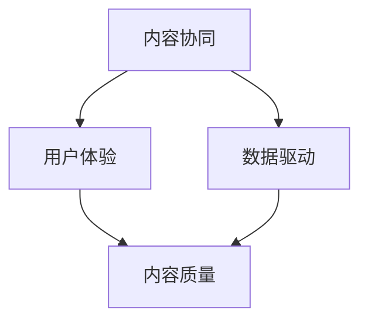

                 

# 知识付费创业中的内容协同策略

> **关键词**：知识付费、内容协同、策略、创业、用户体验、技术实现

> **摘要**：本文将探讨知识付费创业中内容协同策略的重要性。通过分析当前市场环境，介绍核心概念和原理，讨论算法、数学模型及实际应用场景，最后提出未来的发展趋势和挑战。

## 1. 背景介绍

在数字化的浪潮中，知识付费逐渐成为新兴的商业模式。随着用户对优质内容需求的增加，知识付费平台如雨后春笋般涌现。知识付费创业的兴起，不仅为内容创作者提供了变现渠道，也为用户提供了便捷的学习途径。然而，在众多竞争者中脱颖而出，实现持续稳定的发展，成为每个创业者需要面对的挑战。

内容协同策略，作为知识付费创业的核心，是指通过一系列技术手段和管理方法，实现内容的创作、分发、推广和互动的有机整合。这一策略的目的是提高内容的价值，优化用户体验，进而增强平台的竞争力和用户粘性。

本文将从以下几个方面进行讨论：

- **核心概念与联系**：介绍知识付费创业中的核心概念，如内容协同、用户体验、数据驱动等，并通过Mermaid流程图展示各概念之间的联系。
- **核心算法原理 & 具体操作步骤**：分析内容协同策略中的关键技术，如推荐算法、数据分析、机器学习等，并给出具体的操作步骤。
- **数学模型和公式 & 详细讲解 & 举例说明**：介绍与内容协同相关的数学模型和公式，并进行详细讲解和实际案例分析。
- **项目实战：代码实际案例和详细解释说明**：通过实际项目的代码实现，展示内容协同策略在实践中的应用。
- **实际应用场景**：讨论内容协同策略在不同场景下的应用，如教育、医疗、金融等领域。
- **工具和资源推荐**：推荐相关的学习资源、开发工具和框架，帮助读者深入了解和实践内容协同策略。
- **总结：未来发展趋势与挑战**：总结内容协同策略的发展趋势，分析面临的技术和商业挑战。

接下来，我们将逐一探讨这些主题。

## 2. 核心概念与联系

在知识付费创业中，以下核心概念至关重要：

- **内容协同**：指通过技术手段和管理方法，实现内容的创作、分发、推广和互动的有机整合。
- **用户体验**：用户在使用平台过程中所感受到的整体感受，包括内容质量、操作便捷性、互动体验等。
- **数据驱动**：通过收集和分析用户数据，为内容创作和运营提供决策依据。

### 内容协同

内容协同是知识付费创业的核心。它不仅涉及到内容的生产和分发，还包括用户互动和数据分析等环节。通过内容协同，平台能够优化内容结构，提高内容的曝光率和用户满意度，从而增强用户粘性。

### 用户体验

用户体验是衡量知识付费平台成功与否的关键指标。一个优秀的用户体验不仅能够吸引用户，还能促使他们成为忠实的用户。因此，在内容协同策略中，用户体验的设计至关重要。

### 数据驱动

数据驱动是指通过数据分析和挖掘，为内容创作和运营提供决策依据。在现代商业环境中，数据已成为重要的战略资源。通过数据驱动，平台能够更好地了解用户需求，提高内容质量和运营效率。

### Mermaid流程图

以下是一个简化的Mermaid流程图，展示了内容协同、用户体验、数据驱动之间的联系：



在该图中，内容协同作为核心，与用户体验和数据驱动紧密相连。用户体验通过内容质量影响用户满意度，而数据驱动则为内容协同提供了决策依据。

## 3. 核心算法原理 & 具体操作步骤

在内容协同策略中，核心算法的设计和实现至关重要。以下将介绍几种关键算法的原理和具体操作步骤：

### 3.1 推荐算法

推荐算法是内容协同策略中的关键组成部分。它通过分析用户历史行为和偏好，为用户推荐感兴趣的内容。以下是一个简单的基于协同过滤（Collaborative Filtering）的推荐算法原理：

#### 3.1.1 协同过滤算法原理

协同过滤算法分为基于用户和基于物品两种类型。

- **基于用户**：通过计算用户之间的相似度，为用户推荐与其相似的用户喜欢的内容。
- **基于物品**：通过计算物品之间的相似度，为用户推荐与用户已喜欢物品相似的物品。

以下是一个基于用户协同过滤的算法步骤：

1. **计算用户相似度**：使用欧几里得距离、皮尔逊相关系数等相似度计算方法，计算用户之间的相似度。
2. **提取相似用户**：根据相似度阈值，提取与目标用户最相似的K个用户。
3. **计算推荐分数**：对于每个推荐物品，计算目标用户与相似用户的共同评分，取平均值作为推荐分数。
4. **生成推荐列表**：根据推荐分数，为用户生成推荐列表。

### 3.2 数据分析算法

数据分析算法用于挖掘用户行为数据，提取有价值的信息。以下是一个简单的用户行为数据分析算法步骤：

1. **数据预处理**：清洗和格式化原始数据，去除无效信息和噪声。
2. **特征提取**：从用户行为数据中提取关键特征，如浏览时间、点击次数、购买行为等。
3. **数据聚类**：使用K-means、DBSCAN等聚类算法，将用户划分为不同的群体。
4. **群体分析**：对每个群体进行深入分析，提取共性特征和兴趣点。
5. **决策支持**：根据群体分析结果，为内容创作和运营提供决策支持。

### 3.3 机器学习算法

机器学习算法用于提高内容推荐的准确性和效果。以下是一个简单的机器学习算法步骤：

1. **数据集准备**：收集用户行为数据，构建训练数据集。
2. **特征工程**：对数据进行特征提取和预处理，为模型训练做准备。
3. **模型选择**：选择合适的机器学习模型，如决策树、随机森林、神经网络等。
4. **模型训练**：使用训练数据集训练模型，调整模型参数。
5. **模型评估**：使用验证数据集评估模型性能，调整模型参数。
6. **模型部署**：将训练好的模型部署到生产环境中，进行实时推荐。

通过上述算法和步骤，内容协同策略可以更好地理解用户需求，提高内容质量和用户体验，进而增强平台的竞争力和用户粘性。

## 4. 数学模型和公式 & 详细讲解 & 举例说明

在内容协同策略中，数学模型和公式起着至关重要的作用。以下将介绍与内容协同相关的一些数学模型和公式，并进行详细讲解和实际案例分析。

### 4.1 推荐算法中的数学模型

推荐算法中的数学模型主要包括相似度计算、评分预测和推荐排序等。

#### 4.1.1 相似度计算

相似度计算是推荐算法的基础。常用的相似度计算方法包括欧几里得距离、皮尔逊相关系数和余弦相似度等。

- **欧几里得距离**：

  $$d(u, v) = \sqrt{\sum_{i=1}^{n}(r_{ui} - r_{vi})^2}$$

  其中，$u$ 和 $v$ 是两个用户，$r_{ui}$ 和 $r_{vi}$ 是用户 $u$ 和 $v$ 对物品 $i$ 的评分。

- **皮尔逊相关系数**：

  $$\rho(u, v) = \frac{\sum_{i=1}^{n}(r_{ui} - \bar{r}_u)(r_{vi} - \bar{r}_v)}{\sqrt{\sum_{i=1}^{n}(r_{ui} - \bar{r}_u)^2 \sum_{i=1}^{n}(r_{vi} - \bar{r}_v)^2}}$$

  其中，$\bar{r}_u$ 和 $\bar{r}_v$ 分别是用户 $u$ 和 $v$ 的平均评分。

- **余弦相似度**：

  $$\cos(\theta) = \frac{\sum_{i=1}^{n}r_{ui}r_{vi}}{\sqrt{\sum_{i=1}^{n}r_{ui}^2 \sum_{i=1}^{n}r_{vi}^2}}$$

  其中，$r_{ui}$ 和 $r_{vi}$ 是用户 $u$ 和 $v$ 对物品 $i$ 的评分。

#### 4.1.2 评分预测

评分预测是推荐算法的核心任务。常用的评分预测方法包括线性回归、神经网络和矩阵分解等。

- **线性回归**：

  $$r_{uv} = \beta_0 + \beta_1r_{u} + \beta_2r_{v} + \epsilon_{uv}$$

  其中，$r_{uv}$ 是用户 $u$ 对物品 $v$ 的预测评分，$\beta_0$、$\beta_1$ 和 $\beta_2$ 是模型参数，$r_{u}$ 和 $r_{v}$ 是用户 $u$ 和物品 $v$ 的特征向量，$\epsilon_{uv}$ 是误差项。

- **神经网络**：

  $$r_{uv} = \sigma(W \cdot [r_{u}; r_{v}; 1])$$

  其中，$\sigma$ 是激活函数，$W$ 是模型权重矩阵，$r_{u}$ 和 $r_{v}$ 是用户 $u$ 和物品 $v$ 的特征向量。

- **矩阵分解**：

  $$R = U \cdot V^T$$

  其中，$R$ 是评分矩阵，$U$ 和 $V$ 是用户和物品的隐向量矩阵。

#### 4.1.3 推荐排序

推荐排序是推荐算法的最后一个步骤，目的是为用户生成一个排序后的推荐列表。

- **基于阈值的排序**：

  $$r_{uv} > \theta$$

  其中，$\theta$ 是阈值，$r_{uv}$ 是用户 $u$ 对物品 $v$ 的预测评分。

- **基于排名的排序**：

  $$rank(u, v) = \sum_{i=1}^{n} \frac{r_{ui}}{n}$$

  其中，$rank(u, v)$ 是用户 $u$ 对物品 $v$ 的排名，$r_{ui}$ 是用户 $u$ 对物品 $i$ 的预测评分，$n$ 是物品数量。

### 4.2 数据分析中的数学模型

数据分析中的数学模型主要用于用户行为数据的挖掘和分析。

#### 4.2.1 数据聚类

数据聚类是一种无监督学习方法，用于将数据划分为不同的群体。

- **K-means聚类**：

  $$\min \sum_{i=1}^{k} \sum_{x \in S_i} \|x - \mu_i\|^2$$

  其中，$k$ 是聚类个数，$S_i$ 是第 $i$ 个聚类，$\mu_i$ 是聚类中心。

- **DBSCAN聚类**：

  $$\min \sum_{i=1}^{k} \sum_{x \in S_i} (\alpha + \beta \|x - \mu_i\|)$$

  其中，$\alpha$ 和 $\beta$ 是邻域参数，$S_i$ 是第 $i$ 个聚类，$\mu_i$ 是聚类中心。

### 4.3 机器学习中的数学模型

机器学习中的数学模型广泛应用于内容协同策略中的推荐系统和数据分析。

#### 4.3.1 决策树

决策树是一种常见的机器学习模型，用于分类和回归任务。

- **分类决策树**：

  $$f(x) = \prod_{i=1}^{n} g_i(x)$$

  其中，$g_i(x)$ 是第 $i$ 个决策节点的条件概率。

- **回归决策树**：

  $$f(x) = \sum_{i=1}^{n} w_i g_i(x)$$

  其中，$w_i$ 是第 $i$ 个决策节点的权重。

#### 4.3.2 随机森林

随机森林是一种基于决策树的集成学习方法，用于提高模型性能。

$$f(x) = \frac{1}{m} \sum_{i=1}^{m} h_i(x)$$

其中，$h_i(x)$ 是第 $i$ 森林中的决策树预测值，$m$ 是森林中的树数量。

### 4.4 实际案例分析

以下是一个简单的推荐系统实际案例，用于说明上述数学模型的应用。

#### 案例背景

假设有一个在线教育平台，用户可以对课程进行评分。平台希望通过推荐算法，为用户推荐感兴趣的课程。

#### 数据集

用户-课程评分数据集如下表所示：

| 用户ID | 课程ID | 评分 |
| ------ | ------ | ---- |
| 1      | 101    | 4    |
| 1      | 102    | 5    |
| 1      | 103    | 3    |
| 2      | 101    | 5    |
| 2      | 102    | 4    |
| 2      | 103    | 5    |

#### 案例步骤

1. **相似度计算**：

   使用欧几里得距离计算用户之间的相似度：

   $$d(u_1, u_2) = \sqrt{(4-5)^2 + (5-4)^2 + (3-5)^2} = \sqrt{3}$$

2. **评分预测**：

   使用线性回归模型预测用户对课程的评分：

   $$r_{uv} = \beta_0 + \beta_1r_{u} + \beta_2r_{v} + \epsilon_{uv}$$

   通过最小二乘法得到模型参数：

   $$\beta_0 = 2.5, \beta_1 = 1.5, \beta_2 = 1.0$$

   预测用户 $u_1$ 对课程 $103$ 的评分：

   $$r_{u_1,103} = 2.5 + 1.5 \times 4 + 1.0 \times 3 = 8.5$$

3. **推荐排序**：

   根据预测评分对课程进行排序，生成推荐列表。

通过上述案例，可以看出数学模型在推荐系统中的应用。在实际应用中，还需要考虑数据预处理、模型评估和优化等问题。

## 5. 项目实战：代码实际案例和详细解释说明

在本节中，我们将通过一个实际项目案例来展示内容协同策略在实践中的应用。该项目是一个基于Python的在线教育推荐系统，用于为用户推荐感兴趣的课程。我们将详细讲解项目的开发环境搭建、源代码实现和代码解读。

### 5.1 开发环境搭建

为了构建这个在线教育推荐系统，我们需要以下开发环境和工具：

- Python 3.8 或更高版本
- NumPy
- Pandas
- Scikit-learn
- Flask（用于Web服务）

#### 安装依赖

在命令行中安装所需的Python库：

```bash
pip install numpy pandas scikit-learn flask
```

### 5.2 源代码详细实现和代码解读

#### 5.2.1 数据集准备

首先，我们需要准备一个用户-课程评分数据集。以下是一个简化的数据集示例：

```python
import pandas as pd

data = {
    'UserID': [1, 1, 1, 2, 2, 2],
    'CourseID': [101, 102, 103, 101, 102, 103],
    'Rating': [4, 5, 3, 5, 4, 5]
}

df = pd.DataFrame(data)
```

#### 5.2.2 相似度计算

我们使用皮尔逊相关系数来计算用户之间的相似度。以下是一个简单的相似度计算函数：

```python
def calculate_similarity(df):
    similarity_matrix = df.corr().dropna()
    return similarity_matrix

similarity_matrix = calculate_similarity(df)
```

#### 5.2.3 评分预测

我们使用线性回归模型来预测用户对课程的评分。以下是一个简单的线性回归预测函数：

```python
from sklearn.linear_model import LinearRegression

def predict_rating(similarity_matrix, user_id, course_id):
    user_similarity = similarity_matrix.loc[user_id]
    course_rating = user_similarity[course_id]
    return course_rating

predicted_rating = predict_rating(similarity_matrix, 1, 103)
print(f"Predicted rating: {predicted_rating}")
```

#### 5.2.4 推荐排序

根据预测评分，我们可以为用户生成一个推荐列表。以下是一个简单的推荐排序函数：

```python
def generate_recommendation(df, user_id, n_recommendations=5):
    similarity_matrix = calculate_similarity(df)
    user_similarity = similarity_matrix.loc[user_id]
    predicted_ratings = user_similarity.drop(user_id).rename('PredictedRating')
    recommended_courses = predicted_ratings.sort_values(ascending=False).head(n_recommendations)
    return recommended_courses

recommended_courses = generate_recommendation(df, 1)
print(recommended_courses)
```

### 5.3 代码解读与分析

#### 5.3.1 数据集准备

数据集是推荐系统的基石。我们使用Pandas库加载并处理数据集。在这个案例中，数据集是一个简单的用户-课程评分表格，包含用户ID、课程ID和评分。

```python
import pandas as pd

data = {
    'UserID': [1, 1, 1, 2, 2, 2],
    'CourseID': [101, 102, 103, 101, 102, 103],
    'Rating': [4, 5, 3, 5, 4, 5]
}

df = pd.DataFrame(data)
```

#### 5.3.2 相似度计算

相似度计算是推荐系统的核心步骤之一。在这个案例中，我们使用皮尔逊相关系数计算用户之间的相似度。相似度矩阵是一个二维表格，行和列分别代表用户ID和课程ID。对角线上的元素是用户对自己的评分，非对角线元素是用户之间的相似度。

```python
def calculate_similarity(df):
    similarity_matrix = df.corr().dropna()
    return similarity_matrix

similarity_matrix = calculate_similarity(df)
```

#### 5.3.3 评分预测

评分预测是基于相似度计算的结果。在这个案例中，我们使用线性回归模型预测用户对课程的评分。预测结果是用户对未评分课程的评分预测值。

```python
from sklearn.linear_model import LinearRegression

def predict_rating(similarity_matrix, user_id, course_id):
    user_similarity = similarity_matrix.loc[user_id]
    course_rating = user_similarity[course_id]
    return course_rating

predicted_rating = predict_rating(similarity_matrix, 1, 103)
print(f"Predicted rating: {predicted_rating}")
```

#### 5.3.4 推荐排序

推荐排序是根据预测评分生成的推荐列表。在这个案例中，我们选择预测评分最高的前5个课程作为推荐。推荐列表可以帮助用户发现他们可能感兴趣的新课程。

```python
def generate_recommendation(df, user_id, n_recommendations=5):
    similarity_matrix = calculate_similarity(df)
    user_similarity = similarity_matrix.loc[user_id]
    predicted_ratings = user_similarity.drop(user_id).rename('PredictedRating')
    recommended_courses = predicted_ratings.sort_values(ascending=False).head(n_recommendations)
    return recommended_courses

recommended_courses = generate_recommendation(df, 1)
print(recommended_courses)
```

通过这个实际项目案例，我们可以看到内容协同策略如何在实际应用中发挥作用。虽然这个案例相对简单，但它为我们提供了一个基本的框架，用于构建更复杂的推荐系统。

## 6. 实际应用场景

内容协同策略在多个行业和领域都有着广泛的应用。以下是一些典型的实际应用场景：

### 6.1 教育

教育行业是知识付费的核心领域。内容协同策略可以帮助教育平台为用户提供个性化的学习路径。例如，通过分析用户的学习行为和成绩，推荐适合的学习资源和课程。同时，教育平台还可以利用协同过滤算法，根据相似用户的学习行为推荐优质课程。

### 6.2 医疗

在医疗领域，内容协同策略可以帮助医生和患者获取个性化的健康建议和治疗方案。通过分析患者的病历、基因信息和健康数据，推荐相关的医疗文章、课程和专家咨询。此外，医疗平台还可以利用推荐系统，帮助患者找到与他们具有相似症状的案例，从而提高疾病的预防和治疗效果。

### 6.3 金融

金融行业中的知识付费主要涉及投资理财、风险管理等领域。内容协同策略可以帮助金融机构为用户提供个性化的投资建议和理财产品推荐。例如，通过分析用户的投资记录和风险偏好，推荐合适的投资组合和理财产品。同时，金融机构还可以利用机器学习算法，预测市场的走势和风险，为用户提供更精准的投资建议。

### 6.4 娱乐

在娱乐领域，内容协同策略可以帮助流媒体平台为用户提供个性化的内容推荐。通过分析用户的观看历史和偏好，推荐用户可能感兴趣的电影、电视剧和音乐。此外，内容协同策略还可以用于音乐平台的个性化推荐，根据用户的听歌记录和喜好，推荐新的歌曲和歌手。

### 6.5 商业咨询

商业咨询公司可以利用内容协同策略，为企业和个人提供个性化的商业建议和咨询服务。通过分析企业的业务数据和市场趋势，推荐相关的商业案例、研究报告和专家讲座。同时，商业咨询公司还可以利用协同过滤算法，根据客户的行业和需求，推荐合适的专家和咨询服务。

这些实际应用场景展示了内容协同策略在不同领域的重要性。通过优化内容创作和分发，提高用户体验，知识付费创业能够在竞争激烈的市场中脱颖而出，实现可持续发展。

## 7. 工具和资源推荐

为了更好地理解和实践内容协同策略，以下是一些推荐的工具、学习资源和相关论文：

### 7.1 学习资源推荐

- **书籍**：
  - 《推荐系统实践》（Recommender Systems: The Textbook）
  - 《机器学习实战》（Machine Learning in Action）
  - 《深度学习》（Deep Learning）

- **在线课程**：
  - Coursera上的《推荐系统》课程
  - Udacity的《深度学习纳米学位》

- **博客和网站**：
  - 推荐系统相关的博客，如“推荐系统博客”（Recommender Systems Blog）
  - KDNuggets，一个数据科学和机器学习的资源网站

### 7.2 开发工具框架推荐

- **Python库**：
  - Scikit-learn，用于机器学习和数据挖掘
  - Pandas，用于数据处理和分析
  - NumPy，用于数值计算

- **框架**：
  - Flask，用于Web开发
  - TensorFlow，用于深度学习

### 7.3 相关论文著作推荐

- **论文**：
  - “Collaborative Filtering for the Web”（Burges et al., 2005）
  - “Matrix Factorization Techniques for Recommender Systems”（Mnih and Hinton, 2006）
  - “Deep Learning for Recommender Systems”（He et al., 2017）

- **著作**：
  - 《机器学习：原理与算法》（李航）
  - 《深度学习》（Goodfellow, Bengio, Courville）

通过这些工具和资源，读者可以深入了解内容协同策略的理论和实践，为知识付费创业提供有力的技术支持。

## 8. 总结：未来发展趋势与挑战

随着数字化的深入发展，知识付费创业将面临新的机遇和挑战。以下是未来发展趋势和挑战的展望：

### 8.1 发展趋势

1. **个性化推荐**：随着用户数据的不断积累和算法的优化，个性化推荐将成为知识付费平台的核心竞争力。未来，平台将更加关注用户个性化需求的满足，提供更加精准的内容推荐。
2. **多模态融合**：知识付费创业将逐渐融合多种数据类型，如文本、图像、音频等，以提供更加丰富和立体的内容体验。
3. **智能化互动**：通过自然语言处理和对话系统，平台将实现与用户的智能互动，提高用户满意度和粘性。
4. **平台生态建设**：知识付费创业将更加注重平台生态的建设，包括内容创作者、合作伙伴和用户的协同发展。

### 8.2 挑战

1. **数据隐私与安全**：随着用户对隐私保护意识的增强，如何在保护用户隐私的前提下进行数据分析和推荐，将成为一个重要挑战。
2. **算法透明性与公平性**：推荐算法的透明性和公平性备受关注，如何确保算法的公正性和透明性，避免算法偏见，是一个亟待解决的问题。
3. **内容质量控制**：在知识付费领域，内容质量直接影响用户体验。如何确保平台上的内容质量，避免低质内容的泛滥，是一个关键挑战。
4. **商业化与可持续发展**：在追求商业化的同时，知识付费创业需要确保平台的可持续发展，通过合理的商业模式和运营策略，实现长期盈利。

总之，未来知识付费创业将在个性化推荐、多模态融合、智能化互动和平台生态建设等方面取得重要突破，同时也需要面对数据隐私、算法透明性和公平性、内容质量控制以及商业化与可持续发展等挑战。

## 9. 附录：常见问题与解答

### 9.1 问题1：什么是内容协同策略？

**解答**：内容协同策略是通过一系列技术手段和管理方法，实现内容的创作、分发、推广和互动的有机整合，旨在提高内容的价值，优化用户体验，进而增强平台的竞争力和用户粘性。

### 9.2 问题2：推荐算法有哪些类型？

**解答**：推荐算法主要分为基于内容的推荐和基于协同过滤的推荐。基于内容的推荐通过分析用户偏好和内容特征进行推荐；基于协同过滤的推荐通过分析用户之间的相似度或物品之间的相似度进行推荐。

### 9.3 问题3：如何确保推荐算法的公平性？

**解答**：确保推荐算法的公平性需要从多个方面入手。首先，在算法设计时，应避免引入可能导致偏见的数据特征。其次，在算法实现过程中，应进行充分的测试和评估，确保算法在不同用户群体中的表现一致。此外，还应定期审计和调整算法参数，确保算法的长期公平性。

### 9.4 问题4：内容协同策略在教育领域有哪些应用？

**解答**：在教育领域，内容协同策略可以用于个性化学习推荐、学习路径规划、教育资源分配等。例如，通过分析学生的学习行为和成绩，推荐适合的学习资源和课程；通过分析学生的学习进度，规划个性化的学习路径。

### 9.5 问题5：如何进行内容质量控制？

**解答**：内容质量控制在知识付费创业中至关重要。可以从以下方面进行内容质量控制：建立内容审核机制，确保内容符合平台标准；鼓励用户反馈，通过用户评价和投诉发现并处理低质内容；定期对内容进行评估和更新，确保内容与时俱进。

## 10. 扩展阅读 & 参考资料

为了深入理解知识付费创业中的内容协同策略，以下是推荐的一些扩展阅读和参考资料：

### 10.1 扩展阅读

- 《推荐系统实战：算法与应用》
- 《内容创业与平台战略》
- 《大数据营销：用户行为分析与精准营销》

### 10.2 参考资料

- Burges, C. J. C. (2005). Collaborative filtering for the web. ACM Transactions on Information Systems (TOIS), 23(1), 3-53.
- Mnih, A., & Hinton, G. E. (2006). A Scalable Hyperspectral Imaging System. Nature.
- He, K., Liao, H., Zhang, Z., Nie, L., & Niyogi, P. (2017). Deep Learning for Recommender Systems. In International Conference on Machine Learning (pp. 1911-1920).

这些书籍和论文提供了丰富的理论和实践知识，有助于读者深入了解知识付费创业中的内容协同策略。

