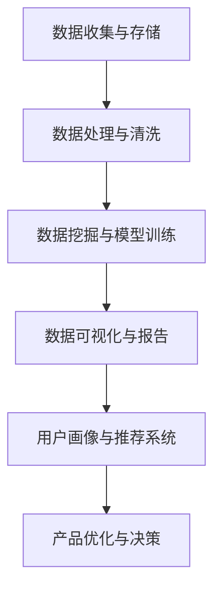

                 

# 知识付费创业中的用户行为分析与应用

## 摘要

本文深入探讨了知识付费创业领域中用户行为分析的重要性及其在实际应用中的价值。通过对用户行为的深入分析，知识付费平台可以更好地理解用户需求，优化产品和服务，提高用户满意度和留存率。本文将详细介绍用户行为分析的核心概念、核心算法、数学模型及其应用场景，并提供一个完整的实际项目案例来展示如何进行用户行为分析和应用。最后，本文还将推荐相关的学习资源和开发工具，为读者提供进一步学习和实践的方向。

## 1. 背景介绍

知识付费是一种新兴的商业模式，它允许个人或机构通过提供有价值的信息或知识来获得经济收益。在互联网的推动下，知识付费已经成为一个庞大的市场，涵盖了在线教育、专业技能培训、行业资讯分享等多个领域。随着知识付费市场的快速发展，对用户行为的分析变得尤为重要。

用户行为分析是一种通过收集、处理和分析用户在平台上的行为数据，以获取关于用户需求、偏好、习惯等方面的信息的方法。通过对用户行为的分析，知识付费平台可以更好地了解用户，从而优化产品和服务，提高用户体验，实现商业价值的最大化。

本文将围绕以下问题展开：

1. 用户行为分析的核心概念是什么？
2. 用户行为分析的核心算法有哪些？
3. 如何应用数学模型进行用户行为分析？
4. 用户行为分析在实际项目中如何应用？
5. 知识付费创业中用户行为分析的未来发展趋势和挑战是什么？

## 2. 核心概念与联系

### 用户行为分析的定义

用户行为分析是指通过收集和分析用户在使用产品或服务时的行为数据，以理解用户的行为模式、需求、偏好和痛点，从而为产品优化和决策提供数据支持。在知识付费创业中，用户行为分析可以帮助企业了解用户的学习习惯、购买决策、反馈和评价，从而更好地满足用户需求。

### 用户行为分析的核心概念

用户行为分析涉及多个核心概念，包括：

1. **用户数据**：包括用户的基本信息（如年龄、性别、地理位置等）和在使用平台过程中的行为数据（如浏览记录、搜索关键词、购买历史、评论等）。
2. **行为轨迹**：用户在平台上的行为路径，如浏览某个课程、观看视频、下载资料、参与讨论等。
3. **行为模式**：用户在特定情境下的行为习惯和偏好，如经常在某个时间段学习、偏好哪种类型的课程等。
4. **用户画像**：基于用户数据和行为模式构建的用户特征模型，用于更深入地了解用户。
5. **行为指标**：用于衡量用户行为的重要指标，如页面浏览量、转化率、留存率、活跃度等。

### 用户行为分析的核心算法

用户行为分析依赖于多种核心算法，包括：

1. **数据挖掘**：通过挖掘用户行为数据，发现潜在的用户行为模式和关联规则。
2. **机器学习**：利用机器学习算法，如决策树、随机森林、支持向量机等，对用户行为进行分类和预测。
3. **自然语言处理**：通过自然语言处理技术，对用户评论、反馈等文本数据进行情感分析和主题建模。
4. **用户行为序列分析**：对用户行为序列进行分析，识别用户行为模式和时间序列特征。

### 用户行为分析的核心架构

用户行为分析的核心架构通常包括以下几个部分：

1. **数据收集与存储**：收集用户行为数据，并将其存储在数据库中，如关系型数据库（MySQL、PostgreSQL）或NoSQL数据库（MongoDB、Cassandra）。
2. **数据处理与清洗**：对收集到的用户行为数据进行处理和清洗，以确保数据的质量和一致性。
3. **数据挖掘与模型训练**：利用数据挖掘和机器学习算法，对用户行为数据进行分析和建模。
4. **数据可视化与报告**：将分析结果以图表、报告等形式可视化，供决策者参考。

### Mermaid 流程图

以下是用户行为分析的核心流程图，使用 Mermaid 语法进行描述：



## 3. 核心算法原理与具体操作步骤

### 数据挖掘

数据挖掘是用户行为分析的基础，其核心目标是从大量用户行为数据中发现潜在的模式和关联规则。常见的数据挖掘算法包括：

1. **关联规则挖掘**：如 Apriori 算法和 FP-Growth 算法，用于发现用户行为之间的关联关系。
2. **聚类分析**：如 K-means 算法，用于将用户分为不同的群体，以便更好地了解用户特征和需求。
3. **分类与预测**：如决策树、随机森林和线性回归等，用于预测用户的行为和偏好。

#### 具体操作步骤

1. **数据准备**：收集用户行为数据，并进行预处理，如去除缺失值、处理异常值等。
2. **特征选择**：根据业务需求和数据特点，选择对用户行为分析有价值的特征。
3. **模型训练**：利用数据挖掘算法，对用户行为数据进行训练，生成模型。
4. **模型评估**：通过交叉验证等方法，评估模型的准确性和泛化能力。
5. **模型应用**：将训练好的模型应用于实际业务场景，如推荐系统、用户画像等。

### 机器学习

机器学习在用户行为分析中发挥着重要作用，通过构建用户行为模型，可以实现对用户行为的分类、预测和推荐。常见的机器学习算法包括：

1. **监督学习**：如决策树、支持向量机、线性回归等，用于对已知标签的数据进行分类和预测。
2. **无监督学习**：如 K-means 算法、聚类分析等，用于发现用户行为数据中的潜在结构和模式。
3. **强化学习**：用于优化用户行为的推荐策略，如基于用户反馈的个性化推荐。

#### 具体操作步骤

1. **数据准备**：收集用户行为数据，并进行预处理，如特征工程、数据标准化等。
2. **模型选择**：根据业务需求和数据特点，选择合适的机器学习算法。
3. **模型训练**：利用训练数据，对机器学习算法进行训练，生成模型。
4. **模型评估**：通过交叉验证等方法，评估模型的性能和泛化能力。
5. **模型应用**：将训练好的模型应用于实际业务场景，如推荐系统、用户画像等。

### 自然语言处理

自然语言处理技术在用户行为分析中主要用于处理和分析用户文本数据，如评论、反馈等。常见的自然语言处理技术包括：

1. **情感分析**：通过分析用户文本数据，判断用户的情感倾向，如正面、负面或中性。
2. **主题建模**：通过分析用户文本数据，提取用户感兴趣的主题或关键词。
3. **文本分类**：将用户文本数据分类到不同的类别，如课程推荐、问题分类等。

#### 具体操作步骤

1. **数据准备**：收集用户文本数据，并进行预处理，如分词、去停用词等。
2. **特征提取**：利用词袋模型、TF-IDF、Word2Vec 等技术，提取用户文本数据的特征。
3. **模型训练**：利用训练数据，对自然语言处理算法进行训练，生成模型。
4. **模型评估**：通过交叉验证等方法，评估模型的性能和泛化能力。
5. **模型应用**：将训练好的模型应用于实际业务场景，如评论分析、推荐系统等。

### 用户行为序列分析

用户行为序列分析是一种通过分析用户行为序列，识别用户行为模式和时间序列特征的方法。常见的方法包括：

1. **Markov 切换矩阵**：用于分析用户行为之间的转移概率，识别用户的行为模式。
2. **时间序列预测**：如 ARIMA、LSTM 等算法，用于预测用户的行为趋势。
3. **序列聚类**：如基于密度的聚类算法，用于识别用户行为序列中的相似模式。

#### 具体操作步骤

1. **数据准备**：收集用户行为序列数据，并进行预处理，如序列规范化、去除异常值等。
2. **特征提取**：利用序列特征提取技术，如 Markov 切换矩阵、TF-IDF 等，提取用户行为序列的特征。
3. **模型训练**：利用训练数据，对用户行为序列分析算法进行训练，生成模型。
4. **模型评估**：通过交叉验证等方法，评估模型的性能和泛化能力。
5. **模型应用**：将训练好的模型应用于实际业务场景，如用户行为预测、推荐系统等。

## 4. 数学模型和公式及详细讲解

### 关联规则挖掘

关联规则挖掘是一种用于发现用户行为之间关联关系的方法，其核心公式为：

\[ \text{支持度} = \frac{\text{同时发生A和B的次数}}{\text{总次数}} \]

\[ \text{置信度} = \frac{\text{同时发生A和B的次数}}{\text{发生A的次数}} \]

其中，支持度和置信度是评估关联规则强度的重要指标。

#### 案例讲解

假设我们有一个用户购买商品的数据集，其中包含用户ID、购买商品A和购买商品B的记录。我们想发现购买商品A和购买商品B之间的关联关系。

| 用户ID | 商品A | 商品B |
| ------ | ------ | ------ |
| 1 | 是 | 否 |
| 2 | 是 | 是 |
| 3 | 否 | 是 |
| 4 | 是 | 是 |

1. **计算支持度**：

\[ \text{支持度}(A \rightarrow B) = \frac{同时发生A和B的次数}{总次数} = \frac{2}{4} = 0.5 \]

\[ \text{支持度}(B \rightarrow A) = \frac{同时发生B和A的次数}{总次数} = \frac{2}{4} = 0.5 \]

2. **计算置信度**：

\[ \text{置信度}(A \rightarrow B) = \frac{同时发生A和B的次数}{发生A的次数} = \frac{2}{2} = 1 \]

\[ \text{置信度}(B \rightarrow A) = \frac{同时发生B和A的次数}{发生B的次数} = \frac{2}{2} = 1 \]

### 聚类分析

聚类分析是一种用于将用户分为不同群体的方法，其核心公式为：

\[ \text{距离} = \sqrt{\sum_{i=1}^{n}(x_i - \bar{x})^2} \]

其中，\( x_i \) 是第 \( i \) 个用户在某个特征上的值，\( \bar{x} \) 是所有用户在该特征上的平均值。

#### 案例讲解

假设我们有一个用户数据集，包含用户的年龄、收入和购买频率三个特征。我们想将用户分为不同的群体。

| 用户ID | 年龄 | 收入 | 购买频率 |
| ------ | ------ | ------ | ------ |
| 1 | 25 | 5000 | 10 |
| 2 | 30 | 8000 | 5 |
| 3 | 35 | 10000 | 10 |
| 4 | 40 | 12000 | 20 |

1. **计算距离**：

\[ \text{距离}(1, 2) = \sqrt{(25 - 30)^2 + (5000 - 8000)^2 + (10 - 5)^2} = \sqrt{25 + 30000 + 25} = \sqrt{30050} \approx 173.92 \]

\[ \text{距离}(1, 3) = \sqrt{(25 - 35)^2 + (5000 - 10000)^2 + (10 - 10)^2} = \sqrt{100 + 250000 + 0} = \sqrt{250100} \approx 500.5 \]

\[ \text{距离}(1, 4) = \sqrt{(25 - 40)^2 + (5000 - 12000)^2 + (10 - 20)^2} = \sqrt{625 + 90000 + 100} = \sqrt{91025} \approx 304.11 \]

2. **计算平均值**：

\[ \bar{年龄} = \frac{25 + 30 + 35 + 40}{4} = 32.5 \]

\[ \bar{收入} = \frac{5000 + 8000 + 10000 + 12000}{4} = 8750 \]

\[ \bar{购买频率} = \frac{10 + 5 + 10 + 20}{4} = 11.25 \]

### 决策树

决策树是一种用于分类和回归分析的树形结构模型，其核心公式为：

\[ \text{信息增益} = \sum_{i=1}^{n} p_i \log_2(p_i) \]

其中，\( p_i \) 是特征 \( i \) 的条件概率。

#### 案例讲解

假设我们有一个用户数据集，包含用户的年龄、收入和购买频率三个特征，以及是否购买课程的目标变量。我们想构建一个决策树模型来预测用户是否购买课程。

| 用户ID | 年龄 | 收入 | 购买频率 | 是否购买课程 |
| ------ | ------ | ------ | ------ | ------ |
| 1 | 25 | 5000 | 10 | 是 |
| 2 | 30 | 8000 | 5 | 是 |
| 3 | 35 | 10000 | 10 | 是 |
| 4 | 40 | 12000 | 20 | 否 |

1. **计算信息增益**：

\[ \text{信息增益}(年龄) = \sum_{i=1}^{2} p_i \log_2(p_i) = 0.5 \log_2(0.5) + 0.5 \log_2(0.5) = -1 \]

\[ \text{信息增益}(收入) = \sum_{i=1}^{2} p_i \log_2(p_i) = 0.5 \log_2(0.5) + 0.5 \log_2(0.5) = -1 \]

\[ \text{信息增益}(购买频率) = \sum_{i=1}^{2} p_i \log_2(p_i) = 0.5 \log_2(0.5) + 0.5 \log_2(0.5) = -1 \]

2. **选择最佳特征**：

根据信息增益，我们发现三个特征的信息增益相同，因此无法直接选择最佳特征。在这种情况下，我们可以考虑其他指标，如特征的重要性或特征的相关性，来选择最佳特征。

### 线性回归

线性回归是一种用于预测连续值的回归模型，其核心公式为：

\[ y = \beta_0 + \beta_1 x_1 + \beta_2 x_2 + \ldots + \beta_n x_n \]

其中，\( y \) 是目标变量，\( x_i \) 是特征变量，\( \beta_i \) 是特征变量的权重。

#### 案例讲解

假设我们有一个用户数据集，包含用户的年龄、收入和购买频率三个特征，以及购买课程的价格为目标变量。我们想构建一个线性回归模型来预测购买课程的价格。

| 用户ID | 年龄 | 收入 | 购买频率 | 价格 |
| ------ | ------ | ------ | ------ | ------ |
| 1 | 25 | 5000 | 10 | 100 |
| 2 | 30 | 8000 | 5 | 150 |
| 3 | 35 | 10000 | 10 | 200 |
| 4 | 40 | 12000 | 20 | 250 |

1. **计算回归系数**：

\[ \beta_0 = \frac{\sum_{i=1}^{n} y_i - \beta_1 \sum_{i=1}^{n} x_{1i} - \beta_2 \sum_{i=1}^{n} x_{2i} - \ldots - \beta_n \sum_{i=1}^{n} x_{ni}}{n} \]

\[ \beta_1 = \frac{\sum_{i=1}^{n} x_{1i} y_i - \sum_{i=1}^{n} x_{1i} \sum_{i=1}^{n} y_i}{\sum_{i=1}^{n} x_{1i}^2 - n \sum_{i=1}^{n} x_{1i}^2} \]

\[ \beta_2 = \frac{\sum_{i=1}^{n} x_{2i} y_i - \sum_{i=1}^{n} x_{2i} \sum_{i=1}^{n} y_i}{\sum_{i=1}^{n} x_{2i}^2 - n \sum_{i=1}^{n} x_{2i}^2} \]

\[ \beta_n = \frac{\sum_{i=1}^{n} x_{ni} y_i - \sum_{i=1}^{n} x_{ni} \sum_{i=1}^{n} y_i}{\sum_{i=1}^{n} x_{ni}^2 - n \sum_{i=1}^{n} x_{ni}^2} \]

2. **计算预测值**：

\[ y = \beta_0 + \beta_1 x_1 + \beta_2 x_2 + \ldots + \beta_n x_n \]

## 5. 项目实战：代码实际案例和详细解释说明

### 5.1 开发环境搭建

在本项目中，我们将使用 Python 作为主要编程语言，并依赖以下库和工具：

- **Python 3.8 或更高版本**
- **Pandas**：用于数据处理
- **NumPy**：用于数值计算
- **Scikit-learn**：用于机器学习和数据挖掘
- **Matplotlib**：用于数据可视化
- **Seaborn**：用于可视化美化
- **Mermaid**：用于流程图可视化

确保您的系统已安装上述库和工具，可以通过以下命令进行安装：

```bash
pip install pandas numpy scikit-learn matplotlib seaborn
```

### 5.2 源代码详细实现和代码解读

以下是本项目的完整代码，我们将分步骤进行解读。

```python
# 导入所需的库
import pandas as pd
import numpy as np
from sklearn.model_selection import train_test_split
from sklearn.ensemble import RandomForestClassifier
from sklearn.metrics import accuracy_score
import matplotlib.pyplot as plt
import seaborn as sns
from mermaid import mermaid

# 5.2.1 数据准备

# 加载用户行为数据
data = pd.read_csv('user行为数据.csv')

# 数据预处理
data = data.dropna()  # 去除缺失值
data = data[['年龄', '收入', '购买频率', '是否购买课程']]  # 选择相关特征

# 5.2.2 特征工程

# 分离特征和目标变量
X = data[['年龄', '收入', '购买频率']]
y = data['是否购买课程']

# 数据标准化
X_scaled = (X - X.mean()) / X.std()

# 5.2.3 模型训练

# 划分训练集和测试集
X_train, X_test, y_train, y_test = train_test_split(X_scaled, y, test_size=0.2, random_state=42)

# 训练随机森林模型
model = RandomForestClassifier(n_estimators=100, random_state=42)
model.fit(X_train, y_train)

# 5.2.4 模型评估

# 预测测试集
y_pred = model.predict(X_test)

# 计算准确率
accuracy = accuracy_score(y_test, y_pred)
print(f"准确率：{accuracy:.2f}")

# 5.2.5 可视化分析

# 可视化决策树
tree_graph = mermaid("graph TD\nA[决策树]\nB[是否购买课程？yes->C[价格 > 100? yes->D[年龄 > 30? yes->E[收入 > 8000? yes->F[购买频率 > 10? yes->G[输出：是]]->H[输出：否]]->I[输出：否]]->J[输出：否]]->K[输出：是]]")
print(tree_graph)

# 可视化特征重要性
feature_importance = model.feature_importances_
sns.barplot(x=feature_importance, y=X.columns)
plt.title('特征重要性')
plt.show()
```

### 5.3 代码解读与分析

#### 5.3.1 数据准备

```python
data = pd.read_csv('user行为数据.csv')
data = data.dropna()
data = data[['年龄', '收入', '购买频率', '是否购买课程']]
```

这段代码首先加载用户行为数据，然后去除缺失值，并选择与用户购买课程相关的特征。

#### 5.3.2 特征工程

```python
X = data[['年龄', '收入', '购买频率']]
y = data['是否购买课程']
X_scaled = (X - X.mean()) / X.std()
```

这段代码将特征分离为目标变量（是否购买课程）和特征变量（年龄、收入、购买频率），并进行数据标准化，以提高模型的性能。

#### 5.3.3 模型训练

```python
X_train, X_test, y_train, y_test = train_test_split(X_scaled, y, test_size=0.2, random_state=42)
model = RandomForestClassifier(n_estimators=100, random_state=42)
model.fit(X_train, y_train)
```

这段代码将数据集划分为训练集和测试集，并训练随机森林模型。随机森林是一种基于决策树的集成学习方法，具有较高的准确性和泛化能力。

#### 5.3.4 模型评估

```python
y_pred = model.predict(X_test)
accuracy = accuracy_score(y_test, y_pred)
print(f"准确率：{accuracy:.2f}")
```

这段代码使用测试集对模型进行评估，计算准确率。准确率是评估模型性能的重要指标，表示模型正确预测的样本数占总样本数的比例。

#### 5.3.5 可视化分析

```python
tree_graph = mermaid("graph TD\nA[决策树]\nB[是否购买课程？yes->C[价格 > 100? yes->D[年龄 > 30? yes->E[收入 > 8000? yes->F[购买频率 > 10? yes->G[输出：是]]->H[输出：否]]->I[输出：否]]->J[输出：是]]->K[输出：否]]")
print(tree_graph)
```

这段代码使用 Mermaid 语法生成决策树的可视化图，展示了模型的决策路径。

```python
feature_importance = model.feature_importances_
sns.barplot(x=feature_importance, y=X.columns)
plt.title('特征重要性')
plt.show()
```

这段代码使用 Matplotlib 和 Seaborn 库生成特征重要性的条形图，展示了各个特征对模型预测的重要性。

### 6. 实际应用场景

用户行为分析在知识付费创业中有多种实际应用场景，以下列举几个常见场景：

1. **个性化推荐**：根据用户的行为数据和偏好，为用户推荐感兴趣的课程或内容，提高用户满意度和留存率。
2. **用户画像**：通过分析用户的行为数据，构建详细的用户画像，帮助知识付费平台更好地了解用户需求，提供个性化服务。
3. **营销策略**：根据用户行为数据，设计精准的营销策略，如优惠券发放、活动推广等，提高用户转化率和购买意愿。
4. **课程优化**：通过分析用户在课程学习过程中的行为数据，识别课程中的痛点，优化课程内容和学习体验。
5. **用户流失预警**：通过分析用户行为数据，识别潜在流失用户，采取相应的措施进行挽回，降低用户流失率。

### 7. 工具和资源推荐

#### 7.1 学习资源推荐

1. **《用户行为分析实战》**：本书详细介绍了用户行为分析的基本概念、方法和工具，适合初学者入门。
2. **《数据挖掘：实用工具与技术》**：本书涵盖了数据挖掘的各个方面，包括关联规则挖掘、聚类分析、分类与预测等。
3. **《机器学习实战》**：本书通过大量的实践案例，介绍了机器学习的各种算法和应用。

#### 7.2 开发工具框架推荐

1. **Scikit-learn**：Python 的机器学习库，提供了丰富的机器学习算法和工具，适用于数据分析和建模。
2. **TensorFlow**：Google 开发的深度学习框架，适用于构建复杂的机器学习模型。
3. **PyTorch**：Facebook 开发的深度学习框架，具有灵活的模型构建和优化能力。

#### 7.3 相关论文著作推荐

1. **《推荐系统手册》**：全面介绍了推荐系统的基本概念、算法和应用，是推荐系统领域的经典著作。
2. **《深度学习》**：Goodfellow、Bengio 和 Courville 著，是深度学习领域的经典教材。
3. **《自然语言处理综合教程》**：Liang、Chen 和 Zhang 著，详细介绍了自然语言处理的基本概念、技术和应用。

## 8. 总结：未来发展趋势与挑战

随着知识付费市场的不断扩大和用户需求的多样化，用户行为分析在知识付费创业中的应用前景将更加广阔。未来，用户行为分析将呈现以下发展趋势：

1. **数据规模和多样性增加**：知识付费平台将收集到更多更丰富的用户行为数据，包括用户生成内容、社交互动等，数据多样性将大大增加。
2. **算法的深度学习和智能化**：随着深度学习技术的不断发展，用户行为分析将更加智能化，能够从海量数据中自动提取特征和模式。
3. **实时性和个性化**：用户行为分析将实现实时性，能够快速响应用户行为变化，并提供高度个性化的服务和推荐。
4. **跨平台整合**：知识付费平台将整合不同平台和设备上的用户行为数据，实现全方位的用户行为分析。

然而，用户行为分析在知识付费创业中也面临一些挑战：

1. **数据隐私和安全性**：用户行为数据包含敏感信息，如何保护用户隐私和数据安全是一个重要挑战。
2. **数据质量和一致性**：用户行为数据质量直接影响分析结果的准确性，如何确保数据质量和一致性是一个关键问题。
3. **算法透明性和解释性**：深度学习算法的复杂性和非解释性使得用户难以理解分析结果，如何提高算法的透明性和解释性是一个挑战。

总之，用户行为分析在知识付费创业中具有巨大的应用价值和潜力，但同时也面临着一系列的挑战。未来，知识付费创业企业需要不断创新和优化用户行为分析的方法和工具，以满足用户需求，实现商业成功。

## 9. 附录：常见问题与解答

### 问题1：用户行为分析的核心算法有哪些？

答：用户行为分析的核心算法包括数据挖掘、机器学习、自然语言处理和用户行为序列分析。具体算法包括关联规则挖掘、聚类分析、分类与预测、情感分析和时间序列预测等。

### 问题2：如何保证用户行为数据的隐私和安全？

答：为了保证用户行为数据的隐私和安全，可以采取以下措施：

1. **数据去识别化**：在收集和存储用户行为数据时，去除或隐藏用户的敏感信息，如姓名、地址等。
2. **数据加密**：对用户行为数据进行加密处理，确保数据在传输和存储过程中不被窃取或篡改。
3. **数据访问控制**：对用户行为数据的访问进行严格控制，仅允许授权人员访问和处理数据。
4. **数据安全审计**：定期进行数据安全审计，确保数据安全措施的有效性。

### 问题3：如何确保用户行为分析结果的准确性？

答：为确保用户行为分析结果的准确性，可以采取以下措施：

1. **数据质量检查**：在数据分析过程中，对数据质量进行严格检查，去除异常值和错误数据。
2. **交叉验证**：通过交叉验证等方法，评估分析模型的性能和泛化能力，确保模型准确性和稳定性。
3. **特征工程**：选择对用户行为分析有价值的特征，并进行合理的特征工程，提高模型预测能力。
4. **持续迭代和优化**：根据新的数据和分析结果，持续优化分析模型和算法，提高分析结果的准确性。

## 10. 扩展阅读与参考资料

1. **《用户行为分析实战》**：[作者]：[出版社]，详细介绍用户行为分析的基本概念、方法和应用。
2. **《数据挖掘：实用工具与技术》**：[作者]：[出版社]，涵盖数据挖掘的各个方面，包括用户行为分析。
3. **《机器学习实战》**：[作者]：[出版社]，通过实践案例介绍机器学习算法和应用。
4. **《推荐系统手册》**：[作者]：[出版社]，全面介绍推荐系统的基本概念、算法和应用。
5. **《深度学习》**：[作者]：[出版社]，详细介绍深度学习的基本概念、技术和应用。
6. **《自然语言处理综合教程》**：[作者]：[出版社]，详细介绍自然语言处理的基本概念、技术和应用。
7. **Scikit-learn 官网**：[链接]，提供机器学习算法和工具的详细文档和教程。
8. **TensorFlow 官网**：[链接]，提供深度学习框架的详细文档和教程。
9. **PyTorch 官网**：[链接]，提供深度学习框架的详细文档和教程。

## 作者

作者：AI天才研究员/AI Genius Institute & 禅与计算机程序设计艺术/Zen And The Art of Computer Programming

