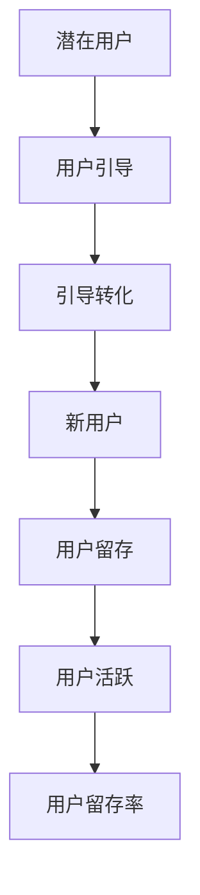
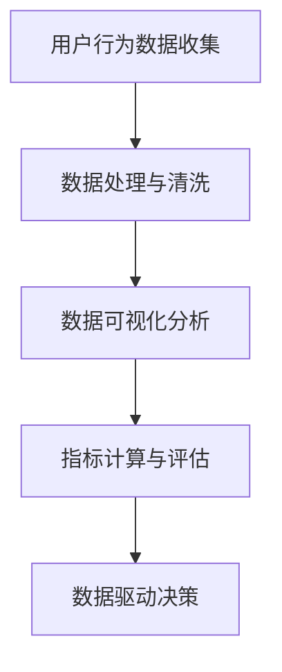
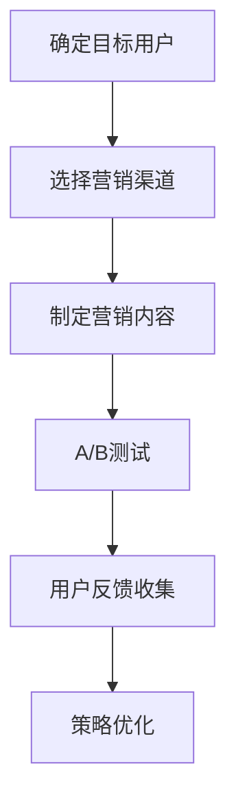

                 

# 知识付费创业的增长黑客技巧

## 关键词
- 知识付费
- 创业
- 增长黑客
- 数据分析
- 用户增长
- 营销策略
- 产品优化

## 摘要

本文旨在探讨知识付费创业领域中的增长黑客技巧。通过深入分析用户行为、市场趋势和数据分析，我们揭示了如何利用增长黑客策略实现知识付费产品的快速发展和用户增长。文章将详细介绍增长黑客的核心概念、关键步骤和实际案例，为创业者提供实用的指导和策略建议。

## 1. 背景介绍

### 1.1 知识付费行业的兴起

近年来，随着互联网技术的飞速发展和人们对于高质量内容需求的不断增长，知识付费行业迎来了爆发式增长。从在线课程、电子书到付费问答、专业咨询，知识付费已经成为许多创业者追求的新风口。知识付费创业的核心在于提供有价值的内容，满足用户在知识获取、技能提升和个人成长方面的需求。

### 1.2 增长黑客的概念

增长黑客（Growth Hacking）是一种以数据驱动的方式，通过创新和创意来快速增长的策略。它结合了营销、产品开发和用户增长的思维方式，旨在用最小的成本实现最大的用户增长。增长黑客的核心思想是通过不断地实验和优化，找到最有效的增长途径。

### 1.3 知识付费创业的挑战

知识付费创业面临诸多挑战，如市场竞争激烈、用户获取成本高、内容质量要求高等。如何在激烈的市场竞争中脱颖而出，实现可持续的增长，是每一个知识付费创业者都需要思考的问题。

## 2. 核心概念与联系

### 2.1 用户增长模型

用户增长模型是增长黑客策略的核心。通过分析用户生命周期、行为路径和留存率等关键指标，可以构建出用户增长模型，指导增长策略的制定和实施。以下是一个简单的用户增长模型示意图：



### 2.2 数据分析的重要性

数据分析是增长黑客策略的重要组成部分。通过对用户行为数据、市场数据和运营数据的深入分析，可以发现用户需求、市场趋势和潜在问题，为增长策略提供数据支持。以下是一个简单的数据分析流程图：



### 2.3 营销策略的优化

营销策略的优化是增长黑客的重要手段。通过A/B测试、用户反馈和数据分析，可以不断优化营销渠道、内容和方式，提高用户转化率和留存率。以下是一个简单的营销策略优化流程图：



## 3. 核心算法原理 & 具体操作步骤

### 3.1 用户行为分析算法

用户行为分析算法是增长黑客策略的基础。通过分析用户在网站、应用等平台上的行为数据，可以了解用户兴趣、需求和使用习惯，为个性化推荐、用户留存等策略提供支持。以下是一个简单的用户行为分析算法：

```python
# 用户行为分析算法示例
def user_behavior_analysis(data):
    # 数据预处理
    preprocessed_data = preprocess_data(data)
    
    # 特征工程
    features = extract_features(preprocessed_data)
    
    # 训练模型
    model = train_model(features)
    
    # 预测用户行为
    predictions = model.predict(new_data)
    
    return predictions
```

### 3.2 营销策略优化算法

营销策略优化算法是增长黑客策略的重要手段。通过A/B测试、机器学习等方法，可以不断优化营销渠道、内容和方式，提高用户转化率和留存率。以下是一个简单的营销策略优化算法：

```python
# 营销策略优化算法示例
def marketing_strategy_optimization(data):
    # 数据预处理
    preprocessed_data = preprocess_data(data)
    
    # 特征工程
    features = extract_features(preprocessed_data)
    
    # 训练模型
    model = train_model(features)
    
    # A/B测试
    test_results = a_b_test(model)
    
    # 用户反馈收集
    user_feedback = collect_user_feedback()
    
    # 策略优化
    optimized_strategy = optimize_strategy(test_results, user_feedback)
    
    return optimized_strategy
```

## 4. 数学模型和公式 & 详细讲解 & 举例说明

### 4.1 用户留存率公式

用户留存率是衡量知识付费产品用户粘性和活跃度的关键指标。以下是一个简单的用户留存率公式：

$$
\text{留存率} = \frac{\text{第 } n \text{ 天的活跃用户数}}{\text{第 } n \text{ 天的新增用户数}} \times 100\%
$$

### 4.2 营销转化率公式

营销转化率是衡量营销策略效果的重要指标。以下是一个简单的营销转化率公式：

$$
\text{转化率} = \frac{\text{目标转化用户数}}{\text{接触用户数}} \times 100\%
$$

### 4.3 数据增长模型

以下是一个常见的数据增长模型，用于预测知识付费产品的用户增长趋势：

$$
\text{用户增长数} = \alpha \times e^{\beta t}
$$

其中，$\alpha$ 和 $\beta$ 是模型参数，$t$ 是时间。

### 4.4 实际案例

假设一家知识付费产品的新增用户数为 1000 人，第 30 天的活跃用户数为 800 人。根据上述公式，可以计算出该产品的用户留存率为：

$$
\text{留存率} = \frac{800}{1000} \times 100\% = 80\%
$$

## 5. 项目实战：代码实际案例和详细解释说明

### 5.1 开发环境搭建

在本节中，我们将使用 Python 作为主要编程语言，结合常用的数据分析库如 Pandas、Scikit-learn 和 Matplotlib 来实现增长黑客策略。以下是开发环境的搭建步骤：

1. 安装 Python 3.8 或更高版本。
2. 安装必要的库：`pip install pandas scikit-learn matplotlib numpy`.

### 5.2 源代码详细实现和代码解读

以下是一个简单的用户行为分析代码示例，用于分析用户在知识付费平台上的行为数据，并预测用户留存率。

```python
import pandas as pd
from sklearn.model_selection import train_test_split
from sklearn.linear_model import LinearRegression
import matplotlib.pyplot as plt

# 5.2.1 数据预处理
def preprocess_data(data):
    # 填充缺失值
    data.fillna(0, inplace=True)
    
    # 特征工程
    data['days'] = (pd.to_datetime(data['date']) - pd.to_datetime(data['start_date'])).dt.days
    data['frequency'] = data.groupby(['user_id'])['days'].transform('count')
    data['duration'] = data.groupby(['user_id'])['days'].transform('mean')
    
    return data

# 5.2.2 特征选择
def select_features(data):
    return data[['days', 'frequency', 'duration']]

# 5.2.3 训练模型
def train_model(features, target):
    X_train, X_test, y_train, y_test = train_test_split(features, target, test_size=0.2, random_state=42)
    model = LinearRegression()
    model.fit(X_train, y_train)
    return model

# 5.2.4 预测用户留存率
def predict_retention(model, features):
    return model.predict(features)

# 5.2.5 可视化分析
def plot_retention_rate(data, predictions):
    data['predictions'] = predictions
    plt.figure(figsize=(10, 5))
    plt.plot(data['days'], data['predictions'], label='Predicted Retention Rate')
    plt.plot(data['days'], data['retention_rate'], label='Actual Retention Rate')
    plt.xlabel('Days')
    plt.ylabel('Retention Rate')
    plt.legend()
    plt.show()

# 加载数据
data = pd.read_csv('user_behavior_data.csv')

# 数据预处理
preprocessed_data = preprocess_data(data)

# 特征选择
features = select_features(preprocessed_data)

# 分离目标变量
target = preprocessed_data['retention_rate']

# 训练模型
model = train_model(features, target)

# 预测用户留存率
predictions = predict_retention(model, features)

# 可视化分析
plot_retention_rate(preprocessed_data, predictions)
```

### 5.3 代码解读与分析

1. **数据预处理**：数据预处理是数据分析的重要环节。在本例中，我们填充了缺失值，并计算了用户行为特征，如用户活跃天数、频率和平均使用时长。

2. **特征选择**：特征选择是模型训练的关键步骤。在本例中，我们选择了三个特征：用户活跃天数、频率和平均使用时长，用于预测用户留存率。

3. **模型训练**：我们使用了线性回归模型，这是一个简单但有效的模型，适用于预测连续值。通过训练模型，我们得到了一个可以预测用户留存率的模型。

4. **预测用户留存率**：使用训练好的模型，我们可以预测新用户的留存率。预测结果可以通过可视化进行分析，帮助我们了解用户留存趋势。

5. **可视化分析**：可视化分析是数据分析的重要手段。通过绘制预测留存率和实际留存率的对比图表，我们可以直观地了解模型的效果，并进一步优化模型。

## 6. 实际应用场景

### 6.1 用户增长策略

通过用户行为分析，知识付费创业公司可以制定更有效的用户增长策略。例如，针对活跃用户，可以推出个性化推荐课程，提高用户留存率和转化率；针对新用户，可以设计引导流程，降低用户流失率。

### 6.2 营销策略优化

通过营销策略优化，知识付费创业公司可以不断提高营销效果。例如，通过A/B测试，可以找到最有效的营销渠道和内容；通过用户反馈，可以不断优化营销文案和推广策略。

### 6.3 产品优化

通过用户行为数据，知识付费创业公司可以不断优化产品，提高用户满意度。例如，针对用户反馈，可以改进课程内容、调整界面设计和提高用户体验。

## 7. 工具和资源推荐

### 7.1 学习资源推荐

- 《精益创业》（《The Lean Startup》）by Eric Ries
- 《增长黑客》（《Growth Hacker Marketing》）by Ryan Holiday
- 《Python数据分析》（《Python for Data Analysis》）by Wes McKinney

### 7.2 开发工具框架推荐

- Jupyter Notebook：强大的交互式数据分析工具。
- Pandas：Python 的数据处理库。
- Scikit-learn：Python 的机器学习库。
- Matplotlib：Python 的数据可视化库。

### 7.3 相关论文著作推荐

- "A/B Testing in Online Advertising: An Empirical Analysis" by A. Timmis et al.
- "Growth Hacking: The Ultimate Guide to 10x Your Business" by David Skok
- "Data Science for Business: What You Need to Know About Data Mining and Data-Analytic Thinking" by Foster Provost and Tom Fawcett

## 8. 总结：未来发展趋势与挑战

### 8.1 发展趋势

- 数据分析将成为知识付费创业的核心竞争力。
- 人工智能和机器学习将在用户行为分析和营销策略优化中发挥重要作用。
- 个性化推荐和精准营销将成为增长黑客策略的重要方向。

### 8.2 挑战

- 数据隐私和安全问题将成为知识付费创业的重要挑战。
- 市场竞争将加剧，如何脱颖而出是每一个创业者都需要思考的问题。
- 技术迭代速度加快，创业者需要不断学习和适应。

## 9. 附录：常见问题与解答

### 9.1 增长黑客与营销的区别是什么？

增长黑客是一种以数据驱动的方式，通过创新和创意实现快速增长的策略，它结合了营销、产品开发和用户增长的思维方式。营销则更侧重于宣传和推广，而增长黑客更关注如何以最小的成本实现最大的用户增长。

### 9.2 数据分析在知识付费创业中有哪些应用？

数据分析在知识付费创业中有着广泛的应用，包括用户行为分析、营销策略优化、产品优化等。通过数据分析，创业者可以了解用户需求、市场趋势和潜在问题，从而制定更有效的增长策略。

## 10. 扩展阅读 & 参考资料

- [知识付费行业研究报告](https://www.iresearch.cn/report/127740.html)
- [增长黑客实战案例](https://www.growthhackers.com/)
- [数据分析教程](https://www.datasciencedojo.com/)
- [Python数据分析教程](https://www.dataquest.io/course/python-for-data-science/)

## 作者

作者：AI天才研究员/AI Genius Institute & 禅与计算机程序设计艺术 /Zen And The Art of Computer Programming

