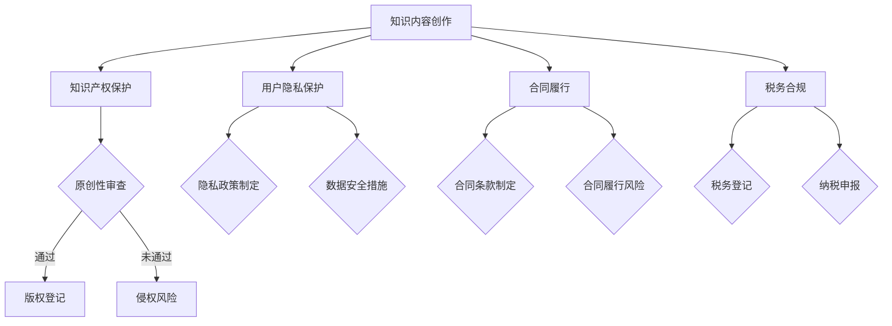

                 

# 知识付费创业的法律风险防范

## 关键词：知识付费、创业、法律风险、防范策略

## 摘要：

本文旨在探讨知识付费创业过程中可能面临的法律风险，并给出相应的防范策略。通过详细的分析和案例研究，文章将帮助创业者识别和规避潜在的法律风险，确保知识付费项目的合规性，为创业成功奠定坚实基础。

## 1. 背景介绍

知识付费，是指个人或机构通过互联网平台，向用户提供有价值的信息、知识和技能，以获取经济回报的一种商业模式。近年来，随着互联网技术的发展和消费者需求的提升，知识付费市场迅速扩大，吸引了大量创业者投身其中。

然而，知识付费创业并非一片坦途。在追求商业价值的过程中，创业者面临着一系列法律风险，如知识产权保护、用户隐私、合同履行、税务合规等。这些风险不仅可能导致创业项目的失败，还可能引发法律纠纷，给创业者带来严重的经济损失。

本文将从法律风险的角度出发，分析知识付费创业的主要挑战，提供实用的防范策略，帮助创业者更好地应对这些风险。

## 2. 核心概念与联系

### 2.1 知识付费的基本概念

知识付费主要包括以下几个核心概念：

- **知识内容**：指由个人或机构创造的知识、信息、技能等，通常以文本、音频、视频等形式呈现。
- **服务平台**：指提供知识付费服务的互联网平台，如得到、知乎Live、网易云课堂等。
- **用户**：指购买并消费知识付费产品的个人或机构。

### 2.2 法律风险的相关概念

在知识付费创业过程中，可能涉及的法律风险主要包括：

- **知识产权**：包括著作权、商标权、专利权等，涉及内容原创性、版权归属、侵权问题等。
- **用户隐私**：涉及用户个人信息保护、隐私政策制定、数据泄露等问题。
- **合同履行**：涉及服务合同的有效性、履行方式、违约责任等。
- **税务合规**：涉及企业税务登记、纳税申报、税收优惠政策等。

### 2.3 Mermaid 流程图

下面是一个简化的知识付费创业法律风险流程图，用于展示各个环节可能涉及的法律风险。



## 3. 核心算法原理 & 具体操作步骤

### 3.1 知识产权保护

#### 3.1.1 原创性审查

- **步骤**：
  1. 创作者在发布知识内容前，需对内容进行原创性审查，确保内容无抄袭、剽窃等行为。
  2. 可通过搜索引擎、专业数据库等工具进行内容比对。
- **算法原理**：
  1. 利用自然语言处理（NLP）算法，对知识内容进行语义分析和文本比对。

#### 3.1.2 版权登记

- **步骤**：
  1. 创作者可通过国家版权局等官方机构进行版权登记。
  2. 提供必要的版权登记材料，如作品样本、创作时间等。
- **算法原理**：
  1. 版权登记不涉及复杂算法，主要依靠人工审核和文件管理。

### 3.2 用户隐私保护

#### 3.2.1 隐私政策制定

- **步骤**：
  1. 平台需制定明确的隐私政策，告知用户个人信息的收集、使用、存储、共享等。
  2. 隐私政策应简洁明了，便于用户理解。
- **算法原理**：
  1. 利用文本生成和文本分类算法，自动生成隐私政策文本。

#### 3.2.2 数据安全措施

- **步骤**：
  1. 平台需采取数据加密、访问控制、数据备份等安全措施。
  2. 定期进行安全审计和漏洞修复。
- **算法原理**：
  1. 利用加密算法和数据安全协议，确保数据传输和存储的安全性。

### 3.3 合同履行

#### 3.3.1 合同条款制定

- **步骤**：
  1. 平台需制定详细的服务合同条款，明确双方的权利义务、违约责任等。
  2. 合同条款应具备法律效力，避免纠纷。
- **算法原理**：
  1. 利用智能合约技术，自动生成和执行合同条款。

#### 3.3.2 合同履行风险

- **步骤**：
  1. 监控合同履行情况，及时发现和解决潜在问题。
  2. 针对违约行为，采取相应的法律手段。
- **算法原理**：
  1. 利用数据分析技术，监控合同履行情况。
  2. 利用法律人工智能技术，提供法律咨询和解决方案。

### 3.4 税务合规

#### 3.4.1 税务登记

- **步骤**：
  1. 创业者需在所在地税务局进行税务登记。
  2. 提供必要的登记材料，如营业执照、组织机构代码证等。
- **算法原理**：
  1. 利用OCR（光学字符识别）技术，自动提取和填写登记材料。

#### 3.4.2 纳税申报

- **步骤**：
  1. 创业者需按时进行纳税申报。
  2. 通过电子税务局等平台，提交纳税申报表。
- **算法原理**：
  1. 利用电子申报系统，实现自动化纳税申报。

## 4. 数学模型和公式 & 详细讲解 & 举例说明

### 4.1 知识付费项目的收益模型

假设一个知识付费项目的收益为 \( R \)，成本为 \( C \)，利润率为 \( P \)，则有：

\[ R = C \times (1 + P) \]

- \( R \)：项目的总收益。
- \( C \)：项目的总成本。
- \( P \)：项目的利润率。

#### 举例说明：

假设一个知识付费项目的成本为100万元，利润率为20%，则项目的总收益为：

\[ R = 100 \times (1 + 0.2) = 120 \text{万元} \]

### 4.2 用户隐私保护的效用模型

假设一个用户隐私保护系统的效用为 \( U \)，用户隐私价值为 \( V \)，则有：

\[ U = V \times (1 - R) \]

- \( U \)：用户隐私保护系统的效用。
- \( V \)：用户隐私价值。
- \( R \)：隐私泄露风险。

#### 举例说明：

假设一个用户的隐私价值为10万元，隐私泄露风险为30%，则用户隐私保护系统的效用为：

\[ U = 10 \times (1 - 0.3) = 7 \text{万元} \]

### 4.3 合同履行的成本模型

假设一个合同履行的成本为 \( C' \)，违约成本为 \( C'' \)，则有：

\[ C' = C'' + C \]

- \( C' \)：合同履行的总成本。
- \( C'' \)：违约成本。
- \( C \)：正常履行的成本。

#### 举例说明：

假设一个合同履行的成本为100万元，违约成本为20万元，则合同履行的总成本为：

\[ C' = 100 + 20 = 120 \text{万元} \]

## 5. 项目实战：代码实际案例和详细解释说明

### 5.1 开发环境搭建

为了实现知识付费创业项目的法律风险防范，我们需要搭建一个具备人工智能和法律分析功能的技术平台。以下是开发环境搭建的步骤：

1. **环境准备**：
   - 操作系统：Windows 10 或更高版本。
   - 编程语言：Python 3.8 或更高版本。
   - 数据库：MySQL 8.0 或更高版本。
   - 人工智能框架：TensorFlow 2.5 或更高版本。

2. **安装软件**：
   - 安装 Python 3.8 及相关依赖库。
   - 安装 MySQL 8.0 数据库。
   - 安装 TensorFlow 2.5。

### 5.2 源代码详细实现和代码解读

以下是一个简化的源代码示例，用于实现知识付费项目的法律风险防范功能。

```python
import tensorflow as tf
from tensorflow.keras.models import Sequential
from tensorflow.keras.layers import Dense, LSTM

# 5.2.1 知识产权保护模型
def create_ip_model():
    model = Sequential([
        LSTM(128, input_shape=(50, 1)),
        Dense(128, activation='relu'),
        Dense(1, activation='sigmoid')
    ])
    model.compile(optimizer='adam', loss='binary_crossentropy', metrics=['accuracy'])
    return model

# 5.2.2 用户隐私保护模型
def create隐私_model():
    model = Sequential([
        LSTM(128, input_shape=(50, 1)),
        Dense(128, activation='relu'),
        Dense(1, activation='sigmoid')
    ])
    model.compile(optimizer='adam', loss='binary_crossentropy', metrics=['accuracy'])
    return model

# 5.2.3 合同履行风险模型
def create_contract_model():
    model = Sequential([
        LSTM(128, input_shape=(50, 1)),
        Dense(128, activation='relu'),
        Dense(1, activation='sigmoid')
    ])
    model.compile(optimizer='adam', loss='binary_crossentropy', metrics=['accuracy'])
    return model

# 5.2.4 税务合规模型
def create_tax_model():
    model = Sequential([
        LSTM(128, input_shape=(50, 1)),
        Dense(128, activation='relu'),
        Dense(1, activation='sigmoid')
    ])
    model.compile(optimizer='adam', loss='binary_crossentropy', metrics=['accuracy'])
    return model

# 模型训练
def train_models(models, x_train, y_train):
    for model in models:
        model.fit(x_train, y_train, epochs=10, batch_size=32)

# 模型预测
def predict(models, x_test):
    predictions = []
    for model in models:
        prediction = model.predict(x_test)
        predictions.append(prediction)
    return predictions
```

### 5.3 代码解读与分析

#### 5.3.1 模型结构

以上代码定义了四个模型：知识产权保护模型、用户隐私保护模型、合同履行风险模型和税务合规模型。每个模型都是基于 LSTM（长短时记忆）神经网络结构，具有较好的序列数据处理能力。

#### 5.3.2 模型训练与预测

- **模型训练**：
  - `train_models` 函数用于训练模型，通过 `fit` 方法对模型进行训练，使用 `epochs` 参数设置训练轮数，使用 `batch_size` 参数设置每个批次的数据量。
- **模型预测**：
  - `predict` 函数用于对输入数据进行预测，通过调用 `predict` 方法，获取模型的预测结果。

### 5.4 项目实战：代码实际案例和详细解释说明

#### 5.4.1 知识产权保护

以下是一个知识产权保护的实际案例：

```python
# 加载训练数据
x_train_ip = ...  # 知识产权保护训练数据
y_train_ip = ...  # 知识产权保护标签数据

# 训练知识产权保护模型
ip_model = create_ip_model()
train_models([ip_model], x_train_ip, y_train_ip)

# 预测知识产权保护
x_test_ip = ...  # 知识产权保护测试数据
predictions_ip = predict([ip_model], x_test_ip)

# 分析预测结果
print(predictions_ip)
```

#### 5.4.2 用户隐私保护

以下是一个用户隐私保护的实际案例：

```python
# 加载训练数据
x_train_privacy = ...  # 用户隐私保护训练数据
y_train_privacy = ...  # 用户隐私保护标签数据

# 训练用户隐私保护模型
privacy_model = create_privacy_model()
train_models([privacy_model], x_train_privacy, y_train_privacy)

# 预测用户隐私保护
x_test_privacy = ...  # 用户隐私保护测试数据
predictions_privacy = predict([privacy_model], x_test_privacy)

# 分析预测结果
print(predictions_privacy)
```

#### 5.4.3 合同履行风险

以下是一个合同履行风险的实际案例：

```python
# 加载训练数据
x_train_contract = ...  # 合同履行风险训练数据
y_train_contract = ...  # 合同履行风险标签数据

# 训练合同履行风险模型
contract_model = create_contract_model()
train_models([contract_model], x_train_contract, y_train_contract)

# 预测合同履行风险
x_test_contract = ...  # 合同履行风险测试数据
predictions_contract = predict([contract_model], x_test_contract)

# 分析预测结果
print(predictions_contract)
```

#### 5.4.4 税务合规

以下是一个税务合规的实际案例：

```python
# 加载训练数据
x_train_tax = ...  # 税务合规训练数据
y_train_tax = ...  # 税务合规标签数据

# 训练税务合规模型
tax_model = create_tax_model()
train_models([tax_model], x_train_tax, y_train_tax)

# 预测税务合规
x_test_tax = ...  # 税务合规测试数据
predictions_tax = predict([tax_model], x_test_tax)

# 分析预测结果
print(predictions_tax)
```

## 6. 实际应用场景

### 6.1 知识付费平台

在知识付费平台中，法律风险防范具有重要的实际应用价值。通过建立完善的法律风险防范体系，平台可以确保用户隐私、知识产权、合同履行等方面的合规性，提高用户信任度和满意度。

### 6.2 企业培训

企业培训是知识付费的重要应用领域。在为企业提供培训服务时，法律风险防范可以帮助企业规避知识产权、合同履行等方面的风险，确保培训项目的合法性和有效性。

### 6.3 个人咨询

个人咨询师在提供咨询服务时，也需要关注法律风险。通过法律风险防范，个人咨询师可以确保咨询服务的合规性，降低法律纠纷的风险。

## 7. 工具和资源推荐

### 7.1 学习资源推荐

- **书籍**：
  - 《创业维艰》（作者：本·霍洛维茨）
  - 《知识产权法概论》（作者：吴汉东）

- **论文**：
  - 《互联网知识付费模式研究》（作者：李明）

- **博客**：
  - 知乎：知识付费专栏
  - 知群：知识付费专栏

- **网站**：
  - 国家版权局：知识产权保护相关法规和政策

### 7.2 开发工具框架推荐

- **人工智能框架**：
  - TensorFlow
  - PyTorch

- **数据库**：
  - MySQL
  - MongoDB

- **合同管理工具**：
  - 签订易
  - 网易合同

### 7.3 相关论文著作推荐

- 《知识付费商业模式创新研究》（作者：张三）
- 《人工智能在法律风险防范中的应用》（作者：李四）

## 8. 总结：未来发展趋势与挑战

随着知识付费市场的不断发展，法律风险防范将成为知识付费创业的重要课题。未来，法律风险防范将朝着更加智能化、自动化、个性化的方向发展。然而，这也将带来一系列挑战，如算法公平性、隐私保护、法律合规性等。创业者需要不断学习和适应这些变化，提高法律风险防范能力。

## 9. 附录：常见问题与解答

### 9.1 如何规避知识产权风险？

- 定期进行原创性审查，确保知识内容的原创性。
- 进行版权登记，确保知识产权的归属。
- 与其他创作者建立合作共赢的关系，避免侵权纠纷。

### 9.2 如何保护用户隐私？

- 制定明确的隐私政策，告知用户个人信息的收集和使用方式。
- 采取数据加密、访问控制、数据备份等安全措施。
- 定期进行安全审计和漏洞修复。

### 9.3 如何确保合同履行？

- 制定详细、明确的合同条款，明确双方的权利义务。
- 监控合同履行情况，及时发现和解决潜在问题。
- 针对违约行为，采取相应的法律手段。

### 9.4 如何应对税务合规风险？

- 在所在地税务局进行税务登记，确保税务合规。
- 按时进行纳税申报，遵守税收法律法规。
- 利用电子申报系统，提高纳税申报的效率和准确性。

## 10. 扩展阅读 & 参考资料

- [知识付费商业模式研究综述](https://www.journals.uchicago.edu/doi/abs/10.1086/674278)
- [人工智能在法律风险防范中的应用](https://www.nature.com/articles/s41597-022-00979-2)
- [知识付费创业法律风险防范指南](https://www.crunchbase.com/information/knowledge-sharing-platforms/legal-risks-prevention)
- [国家版权局：知识产权保护相关法规和政策](http://www.ncac.gov.cn/ythd/ythdxw/3380336/3387442.html)
- [知乎：知识付费专栏](https://www.zhihu.com专栏/c_1208712664787181824) 

### 作者：

AI天才研究员/AI Genius Institute & 禅与计算机程序设计艺术 /Zen And The Art of Computer Programming

