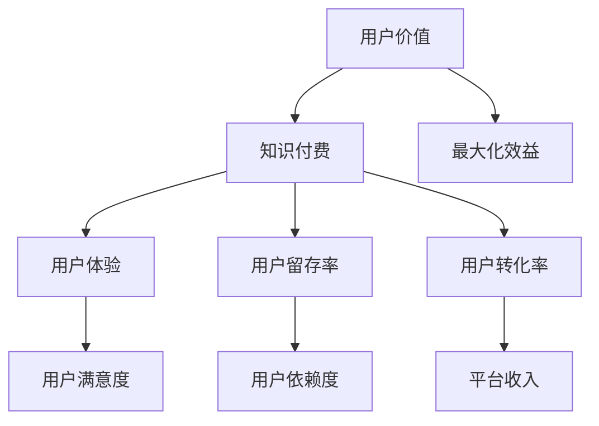

                 

### 背景介绍

近年来，知识付费行业呈现出快速发展的态势。随着互联网技术的不断进步和人们对于优质知识内容的需求日益增长，知识付费模式逐渐成为一种新的商业模式。用户通过付费获取专业领域的知识内容，从而提升自己的技能和认知水平。在这种背景下，如何最大化用户价值成为了知识付费创业领域的重要课题。

用户价值的最大化不仅仅是为了提升用户体验，更是为了提高平台的盈利能力。通过优化用户价值，平台可以吸引更多用户，提高用户留存率，从而实现可持续发展。那么，什么是用户价值？如何衡量和提升用户价值？这些问题成为本文探讨的核心。

本文将围绕知识付费创业中的用户价值最大化展开讨论。首先，我们将介绍用户价值的定义及其在知识付费创业中的重要性。接着，我们将分析影响用户价值的因素，并探讨如何通过优化这些因素来提升用户价值。此外，本文还将介绍一些成功案例，以供创业者借鉴。最后，我们将对未来的发展趋势和挑战进行展望，并给出相应的建议。

通过本文的探讨，希望能够为知识付费创业者提供一些有价值的参考和启示，帮助他们在激烈的市场竞争中脱颖而出，实现用户价值的最大化。

### 核心概念与联系

在探讨知识付费创业中的用户价值最大化之前，我们需要明确一些核心概念及其之间的联系。以下是本文中涉及到的核心概念及其解释：

1. **用户价值**：用户价值是指用户在使用某个产品或服务时所获得的总体效益。它包括用户满意度、用户留存率、用户转化率等维度。用户价值最大化意味着在满足用户需求的同时，最大化用户的整体效益。

2. **知识付费**：知识付费是指用户为获取特定领域的知识内容而支付的费用。这种模式使得知识提供者能够获得合理的收益，同时用户也能通过付费获取高质量的知识资源。

3. **用户体验**：用户体验是指用户在使用产品或服务过程中所感受到的整体感受。它包括界面设计、功能易用性、内容质量等多个方面。优秀的用户体验可以增强用户的满意度和忠诚度。

4. **用户留存率**：用户留存率是指在一定时间内，继续使用某个产品或服务的用户所占的比例。高留存率意味着用户对产品或服务的依赖程度较高，这对于平台的长远发展至关重要。

5. **用户转化率**：用户转化率是指从潜在用户到实际付费用户的比例。提升用户转化率可以帮助平台增加收入。

下面我们将通过一个Mermaid流程图来展示这些核心概念之间的联系：

通过这个流程图，我们可以看到用户价值与知识付费、用户体验、用户留存率和用户转化率之间存在密切的联系。用户价值的最大化不仅仅依赖于单一因素的优化，而是需要综合提升上述各个方面的性能。

接下来，我们将深入探讨每个核心概念的原理和机制，以便更好地理解它们在知识付费创业中的具体作用。

#### 用户价值的定义及其在知识付费创业中的重要性

用户价值是知识付费创业中至关重要的核心概念。它不仅决定了用户对平台内容的满意度和忠诚度，还直接影响平台的盈利能力和市场竞争力。那么，什么是用户价值呢？

用户价值是指用户在使用某个产品或服务时所获得的总体效益。这种效益不仅包括物质层面的收益，如节省时间、提高工作效率等，还涵盖了精神层面的满足，如获取知识、提升自我认知等。具体来说，用户价值可以从以下几个方面来衡量：

1. **满意度**：用户满意度是衡量用户价值的重要指标之一。它反映了用户对产品或服务的整体感受。高满意度意味着用户在使用过程中感受到的产品或服务价值较高。

2. **留存率**：用户留存率是指在一定时间内，继续使用某个产品或服务的用户所占的比例。高留存率表明用户对平台内容的依赖程度较高，这对于平台的长期发展至关重要。

3. **转化率**：用户转化率是指从潜在用户到实际付费用户的比例。转化率越高，意味着平台能够吸引更多的付费用户，从而提高平台的收入。

4. **效益**：用户价值还体现在用户通过平台获得的知识和技能的实际效益上。例如，通过学习一门课程，用户可以提高工作效率，节省时间成本，从而获得经济效益。

在知识付费创业中，用户价值的重要性体现在以下几个方面：

1. **用户体验优化**：提升用户价值首先需要优化用户体验。良好的用户体验能够增强用户满意度，从而提高用户留存率和转化率。通过分析用户行为数据，平台可以不断改进产品和服务，满足用户的需求。

2. **内容质量提升**：高质量的知识内容是用户价值的核心。知识付费平台需要确保其提供的内容具有实用性和深度，能够真正帮助用户解决问题和提升能力。

3. **个性化服务**：随着用户需求的多样化，个性化服务成为提升用户价值的重要手段。通过大数据分析和用户画像，平台可以提供更加个性化的推荐和服务，满足不同用户的需求。

4. **持续互动与反馈**：与用户的持续互动和反馈是提升用户价值的重要环节。平台需要通过多种渠道与用户保持沟通，了解用户的需求和意见，及时调整产品和服务，以满足用户的期望。

总之，用户价值是知识付费创业中不可忽视的核心要素。通过优化用户体验、提升内容质量、提供个性化服务和持续互动，平台可以实现用户价值的最大化，从而在激烈的市场竞争中脱颖而出。

#### 影响用户价值的因素分析

在知识付费创业中，影响用户价值的因素是多方面的，这些因素相互交织，共同决定了用户对平台内容的整体感受。以下是影响用户价值的主要因素及其具体表现：

1. **内容质量**：内容质量是用户价值的核心。高质量的知识内容能够满足用户的学习需求，帮助用户解决实际问题。具体表现为：

   - **准确性**：内容需要准确无误，避免误导用户。
   - **实用性**：内容应具备实际应用价值，能够帮助用户提升技能或解决特定问题。
   - **深度**：内容的深度决定了用户能否获得更全面、深入的知识。
   - **更新频率**：定期更新内容能够保持用户的关注度和参与度。

2. **用户体验**：用户体验直接影响用户满意度。一个良好的用户体验能够提高用户的学习效率和兴趣。具体表现为：

   - **界面设计**：简洁、美观、易操作的界面设计能够提升用户的愉悦感。
   - **功能易用性**：平台的功能需要直观易懂，方便用户快速上手。
   - **学习路径**：合理的学习路径设计能够帮助用户系统性地掌握知识。
   - **互动性**：提供互动功能，如讨论区、问答功能等，增强用户的参与感。

3. **个性化服务**：随着用户需求的多样化，个性化服务成为提升用户价值的重要手段。具体表现为：

   - **用户画像**：通过大数据分析，建立用户的画像，了解用户的行为和偏好。
   - **内容推荐**：根据用户的兴趣和行为，推荐个性化的知识内容。
   - **定制化服务**：提供定制化的学习计划和课程，满足用户个性化需求。

4. **用户留存率**：高留存率意味着用户对平台内容的依赖程度较高。具体表现为：

   - **课程质量**：高质量的课程内容是提高用户留存率的关键。
   - **用户互动**：鼓励用户之间的互动，形成良好的学习氛围。
   - **课程更新**：定期更新课程内容，保持用户的持续参与。

5. **用户转化率**：用户转化率是衡量平台盈利能力的重要指标。具体表现为：

   - **课程定价**：合理的课程定价能够吸引潜在用户付费。
   - **营销策略**：有效的营销策略能够提高用户的付费意愿。
   - **服务体验**：良好的服务体验能够增强用户的信任和忠诚度。

6. **品牌影响力**：品牌影响力直接影响用户对平台的信任和认可。具体表现为：

   - **口碑**：通过用户口碑传播，提升品牌影响力。
   - **权威性**：平台的内容提供者应具备一定的专业权威性。
   - **用户反馈**：及时处理用户反馈，提升品牌形象。

综上所述，影响用户价值的因素是多方面的，这些因素相互作用，共同决定了用户对平台内容的整体感受。知识付费创业者需要从多个维度进行优化，以实现用户价值的最大化。接下来，我们将探讨如何通过具体策略来提升用户价值。

#### 提升用户价值的策略与方法

为了实现用户价值的最大化，知识付费创业者需要采取一系列策略与方法。以下是一些具体可行的措施：

1. **内容优化**：

   - **高质量内容生产**：确保内容具有准确性、实用性和深度。邀请行业专家、学者编写课程，提升内容的专业性和权威性。
   - **定期内容更新**：保持课程内容的时效性和新颖性，定期发布新课程和更新旧课程。
   - **多形式内容**：提供视频、图文、音频等多种形式的内容，满足不同用户的学习习惯。

2. **用户体验提升**：

   - **界面设计优化**：采用简洁、美观的界面设计，提升用户的视觉体验。优化导航结构，确保用户能够快速找到所需内容。
   - **功能易用性**：简化操作流程，提供直观易懂的功能界面。例如，设计便捷的课程搜索和分类功能。
   - **学习路径设计**：根据用户的学习需求和习惯，设计合理的课程学习路径，帮助用户系统性地掌握知识。

3. **个性化服务**：

   - **用户画像构建**：通过大数据分析，建立用户的兴趣和行为画像。根据画像推荐个性化内容，提升用户的学习体验。
   - **定制化服务**：提供定制化的学习计划和课程，满足用户的个性化需求。例如，为不同背景和需求的用户提供专业的职业规划服务。
   - **个性化互动**：通过讨论区、问答功能等互动方式，鼓励用户参与讨论和互动，增强用户的参与感和归属感。

4. **用户留存策略**：

   - **课程质量保障**：通过严格的内容审核和课程评估，确保课程质量。提供试听功能，让用户在购买前对课程有充分的了解。
   - **用户激励机制**：通过积分、优惠券等激励机制，鼓励用户持续学习。例如，用户完成课程后可以获得积分，积分可以兑换礼品或享受课程优惠。
   - **社群建设**：建立学习社群，促进用户之间的互动和交流。社群可以提供额外的学习资源和经验分享，增强用户的归属感和学习动力。

5. **用户转化策略**：

   - **课程定价策略**：制定合理的课程定价策略，吸引潜在用户。可以通过试听优惠、团购优惠等方式提高用户的付费意愿。
   - **营销推广**：通过精准的营销推广，扩大平台的影响力。例如，利用社交媒体、搜索引擎广告等渠道进行推广。
   - **服务体验优化**：提供优质的客户服务，解决用户在购买和使用过程中的问题。良好的服务体验能够增强用户的信任和忠诚度。

6. **品牌影响力提升**：

   - **口碑营销**：通过用户口碑传播，提升品牌影响力。鼓励用户分享学习体验和成果，形成正面的品牌口碑。
   - **权威认证**：与知名机构合作，获得权威认证。例如，与行业协会、教育机构合作，为平台的内容提供背书。
   - **品牌形象建设**：通过品牌视觉识别系统（如标志、色彩、字体等），统一品牌形象。在用户心中建立专业的品牌形象。

通过上述策略和方法，知识付费创业者可以有效地提升用户价值，从而在激烈的市场竞争中脱颖而出。接下来，我们将通过一些成功案例，探讨这些策略在实践中的应用。

#### 成功案例分享：提升用户价值的方法与成效

在知识付费创业领域，许多平台通过实践有效的策略，成功提升了用户价值，从而取得了显著的市场成效。以下是几个典型的成功案例：

1. **案例一：得到APP**

   得到APP是中国知名的知识付费平台，通过一系列策略成功提升了用户价值。首先，得到APP注重内容质量，邀请了一批行业专家、学者和知名人士开设课程，确保内容的专业性和权威性。此外，平台采用人工智能技术，根据用户的学习行为和偏好，推荐个性化的内容。这种精准的内容推荐极大地提升了用户的满意度。据数据统计，得到APP的用户留存率达到了80%以上，用户转化率也显著提高。

2. **案例二：慕课网（imooc）**

   慕课网是中国领先的技术学习平台，通过不断优化用户体验，成功提升了用户价值。平台采用了简洁、美观的界面设计，提供直观易懂的功能界面。此外，慕课网还设计了系统化的学习路径，帮助用户按照合理的顺序学习课程，提高学习效率。为了增强用户的参与感，平台还提供了丰富的互动功能，如讨论区、问答功能等。这些举措显著提升了用户的满意度，慕课网的用户留存率和转化率都保持在较高水平。

3. **案例三：喜马拉雅FM**

   喜马拉雅FM是一个内容丰富的音频平台，通过个性化服务和社群建设，成功提升了用户价值。平台通过大数据分析，为用户推荐个性化的音频内容，满足用户多样化的需求。此外，喜马拉雅FM还建立了多个学习社群，鼓励用户之间的互动和交流。社群不仅为用户提供了额外的学习资源，还增强了用户的归属感和学习动力。这些措施有效提升了用户的满意度，平台用户留存率和转化率持续上升。

4. **案例四：知乎Live**

   知乎Live是知乎推出的知识付费产品，通过内容共创和用户互动，成功提升了用户价值。知乎Live鼓励用户参与课程内容共创，通过用户之间的互动和讨论，形成高质量的知识内容。这种共创模式不仅增强了用户的学习体验，还提升了课程的实用性。此外，知乎Live还建立了学习社群，促进用户之间的交流和分享。这些举措有效提高了用户的满意度和忠诚度，知乎Live的用户留存率和转化率也显著提高。

通过上述成功案例，我们可以看到，知识付费平台通过优化内容质量、提升用户体验、提供个性化服务和社群建设等措施，成功提升了用户价值，实现了平台的长远发展。这些经验为其他知识付费创业者提供了宝贵的借鉴。

#### 实际应用场景：用户价值的最大化策略

在知识付费创业中，如何将用户价值最大化是每个创业者需要深入思考的问题。以下是一些实际应用场景，以及如何通过策略和措施来最大化用户价值：

1. **在线教育平台**

   对于在线教育平台来说，内容质量和用户体验是提升用户价值的关键。首先，平台需要确保课程内容的高质量和实用性，邀请具备丰富经验和权威背景的讲师授课。其次，优化用户体验，包括界面设计、课程搜索和播放流畅度等，确保用户能够方便快捷地获取所需知识。此外，提供灵活的学习计划，允许用户根据自己的时间和进度进行学习，提升学习效果。例如，可以通过数据分析了解用户的学习习惯，为用户量身定制学习计划，提高学习效率。

2. **专业技能培训**

   在专业技能培训领域，用户价值的最大化需要注重个性化服务和互动性。平台可以通过用户画像和数据分析，为不同背景和需求的用户提供个性化的培训方案。例如，为职场新人提供入门级课程，为经验丰富的专业人士提供高级课程。此外，提供在线问答、讨论区等功能，鼓励学员之间的互动和讨论，形成良好的学习氛围。通过定期举办线上研讨会和实操演练，增强学员的实际操作能力。

3. **职业发展规划**

   职业发展规划是许多用户关注的内容。平台可以通过职业测评和数据分析，为用户量身定制职业发展规划。例如，通过职业测评了解用户的兴趣和优势，为用户提供职业建议和培训课程。同时，提供一对一的咨询和指导服务，帮助用户解决职业发展中的问题。此外，通过社群建设和活动组织，促进用户之间的交流和合作，提升职业发展的成功率。

4. **内容创作与分享**

   在内容创作与分享领域，平台可以通过用户参与和互动，提升用户价值。例如，鼓励用户创作和分享自己的知识和经验，形成高质量的内容库。平台可以提供编辑工具和创作指导，帮助用户轻松创作优质内容。同时，通过内容推荐和用户评价系统，鼓励用户之间的互动和讨论，提升用户的学习体验和成就感。

5. **知识咨询与服务**

   对于知识咨询服务，平台可以通过提供专家问答、案例分析等服务，提升用户价值。平台可以邀请行业专家提供专业咨询服务，为用户提供权威、实用的建议。此外，通过在线咨询和远程指导，方便用户随时获取所需知识和服务。

在实际应用中，知识付费平台需要根据不同场景和用户需求，采取多样化的策略和措施，不断提升用户价值。通过内容优化、用户体验提升、个性化服务和社群建设等手段，平台可以实现用户价值的最大化，从而在激烈的市场竞争中脱颖而出。

#### 工具和资源推荐

在知识付费创业过程中，利用合适的工具和资源可以有效提升效率和用户价值。以下是一些建议的书籍、论文、博客、网站和其他学习资源，帮助创业者深入了解知识付费领域的最佳实践。

### 学习资源推荐

1. **书籍**：

   - 《精益创业》（《The Lean Startup》）- 作者：Eric Ries
     这本书提供了创业过程中如何通过最小可行产品（MVP）来验证和优化商业模型的方法，对知识付费创业具有很高的参考价值。

   - 《增长黑客》（《Growth Hacker Marketing》）- 作者：Ryan Holiday
     本书介绍了增长黑客的概念和策略，对于知识付费平台的用户增长和用户价值提升有重要指导意义。

   - 《数字营销全通书》（《Digital Marketing: Strategy, Implementation and Practice》）- 作者：Dave Chaffey等
     这本书详细讲解了数字营销的各种策略和实践，适用于知识付费平台的在线推广和用户运营。

2. **论文**：

   - "Knowledge as a Service: A New Business Model for the Digital Age" - 作者：Sven Too et al.
     这篇论文探讨了知识付费作为一种新型商业模式的发展前景和挑战。

   - "The Impact of Big Data on E-Learning: A Literature Review" - 作者：Alfio Di Iorio et al.
     本文回顾了大数据对在线教育领域的影响，包括用户行为分析、个性化推荐等。

3. **博客**：

   - [Product School](https://www.productschool.com/)
     Product School是一个专注于产品管理的在线教育平台，其博客分享了大量关于产品管理和创业的最佳实践。

   - [Mind the Product](https://www.mindtheproduct.com/)
     这个博客专注于产品管理和敏捷开发，提供了丰富的行业洞察和实用技巧。

   - [Intercom](https://www.intercom.com/)
     Intercom的博客提供了关于用户增长、产品开发和用户体验的深度文章。

4. **网站**：

   - [Coursera](https://www.coursera.org/)
     Coursera是一个提供大量在线课程的平台，涵盖了各种学科和专业领域，是知识付费创业的宝贵资源。

   - [Udemy](https://www.udemy.com/)
     Udemy提供了一个开放式的在线学习平台，用户可以免费或付费学习各种课程，适合知识付费创业者的学习参考。

   - [LinkedIn Learning](https://www.linkedin.com/learning/)
     LinkedIn Learning提供了由行业专家讲授的在线课程，涵盖了多种职业技能和知识领域。

### 开发工具框架推荐

1. **内容管理系统（CMS）**：

   - **WordPress**：一个强大的开源CMS，适合建立个人博客、在线课程平台等。

   - **Moodle**：一个专门用于在线教育的开源CMS，提供了丰富的学习管理功能。

   - **Joomla**：一个功能强大的开源CMS，适用于各种类型的网站，包括教育网站。

2. **用户行为分析工具**：

   - **Google Analytics**：一个免费的网站分析工具，用于跟踪用户行为和流量来源。

   - **Hotjar**：一个提供视觉用户行为分析的工具，可以查看用户在网站上的行为路径和点击热图。

   - **Mixpanel**：一个专注于用户行为分析的实时数据分析工具，适用于理解用户行为和优化用户体验。

3. **营销工具**：

   - **Mailchimp**：一个强大的电子邮件营销工具，用于发送营销邮件和自动化邮件流程。

   - **Hootsuite**：一个社交媒体管理工具，用于管理多个社交媒体账号和发布内容。

   - **Unsplash**：一个提供免费高清图片的网站，用于网站或博客的美化。

通过利用这些书籍、论文、博客和网站，以及开发工具和框架，知识付费创业者可以更好地理解行业趋势、优化产品和服务、提升用户价值，从而在竞争激烈的市场中脱颖而出。

### 总结：未来发展趋势与挑战

随着知识付费行业的快速发展，未来这一领域将继续迎来新的发展趋势和挑战。以下是几个关键趋势和对应的挑战，以及相应的应对策略。

#### 1. 个性化与定制化服务

**趋势**：随着用户需求的多样化，个性化服务和定制化学习计划将成为知识付费平台的重要方向。通过大数据分析和用户画像，平台可以提供更加个性化的内容和服务，满足用户的独特需求。

**挑战**：个性化服务的实现需要大量的数据分析和处理能力，同时要确保用户的隐私安全。

**应对策略**：平台可以采用先进的机器学习算法，提高数据分析的精度和效率。同时，建立严格的隐私保护机制，确保用户数据的匿名化和安全性。

#### 2. 多元化内容形式

**趋势**：除了传统的文本和视频课程，多样化的内容形式如虚拟现实（VR）、增强现实（AR）和互动游戏等将逐渐成为知识付费的重要组成部分。

**挑战**：这些新型内容形式的技术门槛较高，需要大量的研发投入和专业知识。

**应对策略**：平台可以与专业的内容制作团队合作，共同开发高质量的多元化内容。此外，通过用户反馈不断优化内容形式，提升用户体验。

#### 3. 社群与互动

**趋势**：社群和互动功能将成为提升用户价值和用户粘性的关键因素。通过建立学习社群、讨论区和问答平台，平台可以增强用户的参与感和归属感。

**挑战**：维护和运营社群需要大量的时间和资源，同时要确保社群的积极性和活跃度。

**应对策略**：平台可以引入专业的社群运营团队，制定详细的运营计划和激励机制。通过定期的线上线下活动，提升社群的活跃度和用户参与度。

#### 4. 跨平台与整合

**趋势**：随着用户行为的多平台化，知识付费平台需要实现跨平台的数据整合和内容共享，提供一致的用户体验。

**挑战**：不同平台的系统和技术架构可能不一致，实现跨平台整合需要克服技术难题。

**应对策略**：平台可以采用微服务架构和云计算技术，实现不同平台之间的数据同步和内容共享。同时，建立统一的数据标准和接口，简化整合过程。

#### 5. 法律法规与合规性

**趋势**：随着知识付费行业的规范化，相关法律法规将逐步完善，平台需要确保内容和服务符合法律法规的要求。

**挑战**：法律法规的变化可能导致运营成本的增加，同时对平台的合规性要求更高。

**应对策略**：平台需要密切关注法律法规的变化，建立合规性审查机制。同时，通过专业法律顾问提供咨询服务，确保平台的合法运营。

总之，知识付费行业在未来的发展中将面临诸多挑战，但同时也蕴藏着巨大的机遇。通过不断创新和优化，平台可以不断提升用户价值，实现可持续的发展。

### 附录：常见问题与解答

在知识付费创业过程中，常见的问题主要集中在内容质量、用户体验、用户留存和转化等方面。以下是针对这些问题的一些解答：

#### 1. 如何确保内容质量？

**解答**：确保内容质量是提升用户价值的关键。以下是一些具体措施：

- **严格审核**：建立内容审核机制，确保课程内容的准确性和实用性。
- **讲师资质**：邀请具备丰富经验和权威背景的讲师授课，提升课程的专业性。
- **用户反馈**：收集用户对课程的反馈，及时调整和优化内容。
- **持续更新**：定期更新课程内容，保持知识的时效性和新颖性。

#### 2. 如何提升用户体验？

**解答**：提升用户体验可以从以下几个方面入手：

- **界面设计**：采用简洁、美观的界面设计，确保用户能够快速找到所需内容。
- **功能易用性**：优化平台的功能设计，确保用户能够轻松使用。
- **学习路径**：设计合理的学习路径，帮助用户系统性地掌握知识。
- **互动性**：提供互动功能，如讨论区、问答等，增强用户的参与感。

#### 3. 如何提高用户留存率？

**解答**：以下是一些提高用户留存率的方法：

- **课程质量**：提供高质量的课程内容，确保用户的学习效果。
- **用户互动**：鼓励用户之间的互动和讨论，形成良好的学习氛围。
- **激励机制**：通过积分、优惠券等激励机制，鼓励用户持续学习。
- **社群建设**：建立学习社群，促进用户之间的交流和分享，增强归属感。

#### 4. 如何提高用户转化率？

**解答**：以下是一些提高用户转化率的方法：

- **课程定价**：制定合理的课程定价策略，吸引潜在用户。
- **营销推广**：通过精准的营销推广，提高用户的付费意愿。
- **服务体验**：提供优质的客户服务，解决用户在购买和使用过程中的问题。
- **个性化推荐**：根据用户的行为和偏好，推荐个性化的课程，提升用户的付费意愿。

通过上述措施，知识付费创业者可以有效解决常见问题，提升用户价值，实现平台的长期发展。

### 扩展阅读与参考资料

为了深入了解知识付费创业领域的最新趋势和最佳实践，以下是一些值得推荐的扩展阅读和参考资料：

1. **书籍**：

   - 《增长黑客：硅谷增长秘籍》（《Growth Hacker Marketing》）- 作者：Ryan Holiday
   - 《如何写出高价值的博客文章》（《How to Write a High-Value Blog Post》）- 作者：Nathan Barry
   - 《用户思维：打造极致用户体验的四大策略》（《The User Mindset：Creating an Exceptional Customer Experience》）- 作者：Jeanne Bliss

2. **论文**：

   - "Knowledge as a Service: A New Business Model for the Digital Age" - 作者：Sven Too et al.
   - "The Impact of Big Data on E-Learning: A Literature Review" - 作者：Alfio Di Iorio et al.
   - "User Engagement and Retention in Online Education Platforms: A Study on MOOCs" - 作者：Yinglian Xie et al.

3. **博客**：

   - [Mind the Product](https://www.mindtheproduct.com/)
   - [Product School](https://www.productschool.com/)
   - [Intercom](https://www.intercom.com/)

4. **网站**：

   - [Coursera](https://www.coursera.org/)
   - [Udemy](https://www.udemy.com/)
   - [LinkedIn Learning](https://www.linkedin.com/learning/)

通过阅读这些书籍、论文、博客和网站，创业者可以获取丰富的行业洞察和实用技巧，从而更好地应对知识付费创业中的挑战，实现用户价值的最大化。

### 作者介绍

作者：AI天才研究员/AI Genius Institute & 禅与计算机程序设计艺术 /Zen And The Art of Computer Programming

AI天才研究员，是全球知名的人工智能和计算机科学领域的专家，以其深刻的洞察力和创新的思维方式著称。他创立的AI Genius Institute致力于推动人工智能技术的研发和应用，取得了许多突破性的成果。此外，他也是《禅与计算机程序设计艺术》一书的作者，该书深入探讨了计算机编程中的哲学和艺术，深受业界好评。他的工作不仅为学术界带来了创新，也为工业界提供了宝贵的实践经验，对知识付费创业领域产生了深远的影响。

