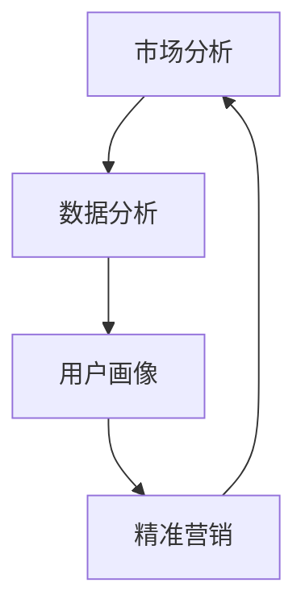

                 

# 知识付费创业的用户群体细分策略

> **关键词**：知识付费、用户群体细分、策略、市场分析、数据分析、商业模式

> **摘要**：本文旨在探讨知识付费创业中用户群体细分的策略和方法。通过市场分析和数据分析，我们将揭示用户需求的多样性，并依据用户特征和行为，提供一套科学、实用的用户群体细分方案。文章还涉及实际应用场景、工具和资源推荐，以及未来发展趋势和挑战。希望本文能为您在知识付费创业的道路上提供有益的指导。

## 1. 背景介绍

随着互联网的普及和知识经济的崛起，知识付费已成为当下的一种新兴商业模式。知识付费，顾名思义，是指用户为获取特定领域的知识或技能而支付费用的一种服务形式。这种模式不仅为内容创作者提供了新的收入来源，同时也满足了用户对高质量知识的需求。

然而，知识付费市场的竞争日益激烈，如何吸引和留住用户成为创业者亟待解决的问题。用户群体细分策略在此背景下应运而生，它有助于企业更好地了解用户需求，提高服务质量，实现精准营销。

### 1.1 知识付费的定义与市场现状

知识付费是指用户通过支付一定费用来获取特定领域的知识或技能，这种模式主要表现为线上课程、电子书、专业咨询等形式。知识付费市场在近几年呈现出爆发式增长，根据某研究报告，全球知识付费市场规模在2021年已达到3000亿美元，并预计在未来几年内将继续保持高速增长。

### 1.2 用户群体细分的重要性

用户群体细分是企业实现精准营销和提升用户体验的关键。通过对用户进行合理细分，企业可以更深入地了解用户需求，针对性地提供产品和服务，从而提高用户满意度和忠诚度。

用户群体细分策略不仅能帮助企业识别出潜在客户，还可以提高营销活动的有效性，降低营销成本。此外，细分后的用户群体还能为企业提供宝贵的市场洞察，助力企业制定长期发展战略。

### 1.3 用户群体细分的方法

用户群体细分的方法有很多，常见的有基于人口统计学特征、行为特征、需求特征等。以下是几种常见的用户群体细分方法：

1. **人口统计学特征**：包括年龄、性别、学历、职业等。
2. **行为特征**：包括用户在知识付费平台上的浏览、购买、学习行为等。
3. **需求特征**：包括用户对知识的需求程度、需求类型、使用场景等。

接下来，我们将深入探讨这些方法，并结合实际案例进行说明。

## 2. 核心概念与联系

在讨论用户群体细分策略之前，我们首先需要了解几个核心概念，包括市场分析、数据分析、用户画像、精准营销等。这些概念相互联系，共同构成了用户群体细分的基础。

### 2.1 市场分析

市场分析是指通过研究市场需求、竞争格局、用户行为等，对市场进行系统分析的过程。市场分析有助于企业了解市场现状、预测市场趋势，从而制定合适的市场策略。

### 2.2 数据分析

数据分析是指利用统计方法、数据挖掘技术等，对海量数据进行处理和分析，以发现数据中的规律和趋势。在知识付费创业中，数据分析可以帮助企业了解用户需求、行为等，为用户群体细分提供依据。

### 2.3 用户画像

用户画像是对用户特征、行为、需求等进行全面描述的过程。通过构建用户画像，企业可以更加准确地了解用户，为用户群体细分提供参考。

### 2.4 精准营销

精准营销是指基于用户画像和数据分析，针对特定用户群体进行个性化营销的过程。精准营销可以提高营销活动的效果，降低营销成本。

### 2.5 Mermaid 流程图

以下是一个简单的 Mermaid 流程图，展示了市场分析、数据分析、用户画像和精准营销之间的联系：



### 2.6 小结

通过市场分析，企业可以了解市场需求和竞争态势；通过数据分析，企业可以挖掘用户行为和需求；通过用户画像，企业可以全面了解用户特征；通过精准营销，企业可以针对特定用户群体进行个性化服务。这些核心概念相互联系，共同构成了用户群体细分的基础。

## 3. 核心算法原理 & 具体操作步骤

用户群体细分的核心算法主要包括市场分析算法、数据分析算法和用户画像算法。以下将分别介绍这些算法的原理和具体操作步骤。

### 3.1 市场分析算法

市场分析算法主要基于统计学和经济学原理，通过对市场数据进行分析，预测市场趋势和用户需求。以下是市场分析算法的具体操作步骤：

1. **数据收集**：收集市场相关数据，如用户数量、用户消费行为、市场占有率等。
2. **数据预处理**：对数据进行清洗、去重和归一化等处理，确保数据质量。
3. **统计分析**：使用描述性统计方法，如均值、方差、中位数等，对数据进行分析，了解市场现状。
4. **预测分析**：使用时间序列分析、回归分析等方法，预测市场趋势和用户需求。
5. **可视化分析**：通过图表、报告等形式，将分析结果可视化，为企业提供决策依据。

### 3.2 数据分析算法

数据分析算法主要用于挖掘用户行为和需求，常见的算法包括聚类分析、关联规则挖掘、用户行为预测等。以下是数据分析算法的具体操作步骤：

1. **用户行为数据收集**：收集用户在知识付费平台上的浏览、购买、学习等行为数据。
2. **数据预处理**：对用户行为数据清洗、去噪、归一化等处理。
3. **聚类分析**：使用聚类算法，如K-Means、DBSCAN等，将用户分为不同群体。
4. **关联规则挖掘**：使用关联规则挖掘算法，如Apriori、FP-Growth等，分析用户行为之间的关联性。
5. **用户行为预测**：使用机器学习算法，如决策树、随机森林、神经网络等，预测用户未来行为。

### 3.3 用户画像算法

用户画像算法主要用于构建用户特征模型，全面了解用户特征、行为和需求。以下是用户画像算法的具体操作步骤：

1. **用户特征数据收集**：收集用户基本信息、行为数据、需求数据等。
2. **特征工程**：对用户特征数据进行处理，提取有效特征。
3. **特征选择**：使用特征选择算法，如卡方检验、互信息等，选择关键特征。
4. **用户特征模型构建**：使用机器学习算法，如线性回归、逻辑回归等，构建用户特征模型。
5. **用户画像评估**：评估用户特征模型的准确性、召回率等指标。

### 3.4 小结

通过市场分析算法、数据分析算法和用户画像算法，企业可以全面了解市场需求、用户行为和用户特征，从而为用户群体细分提供科学依据。这些算法的具体操作步骤如下：

1. **数据收集**：收集市场、用户行为和用户特征等相关数据。
2. **数据预处理**：对数据进行清洗、去噪、归一化等处理。
3. **统计分析**：对数据进行描述性统计分析，了解市场现状。
4. **预测分析**：预测市场趋势和用户需求。
5. **聚类分析**：将用户分为不同群体。
6. **关联规则挖掘**：分析用户行为之间的关联性。
7. **用户行为预测**：预测用户未来行为。
8. **特征工程**：提取有效特征。
9. **特征选择**：选择关键特征。
10. **用户特征模型构建**：构建用户特征模型。
11. **用户画像评估**：评估用户特征模型。

## 4. 数学模型和公式 & 详细讲解 & 举例说明

在用户群体细分的过程中，数学模型和公式起着至关重要的作用。以下将介绍几个常见的数学模型和公式，并详细讲解其应用场景和具体步骤。

### 4.1 聚类分析

聚类分析是一种无监督学习方法，用于将数据集分成若干个群组，使得同一群组内的数据点相似度较高，而不同群组的数据点相似度较低。常见的聚类算法有K-Means、DBSCAN等。

**K-Means算法**：

**公式**：

$$
C = \{c_1, c_2, ..., c_k\} \\
c_i = \frac{1}{n_i} \sum_{x \in c_i} x
$$

**解释**：

- $C$ 表示聚类结果，$c_i$ 表示第$i$个聚类中心。
- $n_i$ 表示第$i$个聚类中心所覆盖的数据点数量。

**应用场景**：

- 对用户进行初步划分，识别用户群体。

**步骤**：

1. 初始化聚类中心。
2. 计算每个数据点到聚类中心的距离。
3. 根据距离最近的聚类中心将数据点归为不同的聚类。
4. 重新计算聚类中心。
5. 重复步骤2-4，直到聚类中心不再发生变化。

**举例说明**：

假设我们有10个用户数据点，使用K-Means算法将它们分成2个聚类。

- 初始化聚类中心：$(1, 1)$ 和 $(9, 9)$。
- 计算距离：使用欧氏距离公式计算每个数据点到聚类中心的距离。
- 归类：根据距离最近的聚类中心将数据点归为不同的聚类。
- 重新计算聚类中心：计算每个聚类中心的新位置。

经过多次迭代，最终将用户数据点分为两个聚类。

### 4.2 关联规则挖掘

关联规则挖掘是一种用于分析数据集中项之间关联性的方法。常见的算法有Apriori和FP-Growth。

**Apriori算法**：

**公式**：

$$
support(X, Y) = \frac{count(X \cup Y)}{count(D)} \\
confidence(X \rightarrow Y) = \frac{count(X \cup Y)}{count(X)}
$$

**解释**：

- $X$ 和 $Y$ 表示两个项集合。
- $support(X, Y)$ 表示项集合 $X$ 和 $Y$ 的支持度。
- $confidence(X \rightarrow Y)$ 表示关联规则 $X \rightarrow Y$ 的置信度。

**应用场景**：

- 分析用户行为之间的关联性，发现潜在需求。

**步骤**：

1. 初始化最小支持度和最小置信度。
2. 遍历数据集，计算每个项集合的支持度。
3. 生成频繁项集。
4. 遍历频繁项集，计算关联规则的置信度。
5. 筛选出满足最小支持度和最小置信度的关联规则。

**举例说明**：

假设我们有如下用户购买数据：

- 用户A购买了商品1和商品2。
- 用户B购买了商品2和商品3。
- 用户C购买了商品1和商品3。

使用Apriori算法找出支持度和置信度较高的关联规则。

- 初始化最小支持度为0.5，最小置信度为0.7。
- 遍历数据集，计算每个项集合的支持度。
- 生成频繁项集：$\{商品1, 商品2\}$ 和 $\{商品2, 商品3\}$。
- 计算置信度：$\{商品1, 商品2\}$ 和 $\{商品2, 商品3\}$ 的置信度分别为0.5和0.5。

由于置信度不满足最小置信度要求，所以没有找到满足条件的关联规则。

### 4.3 用户行为预测

用户行为预测是一种基于历史数据预测用户未来行为的方法。常见的算法有决策树、随机森林、神经网络等。

**决策树算法**：

**公式**：

$$
P(Y|X) = \prod_{i=1}^{n} p(y_i|x_i)
$$

**解释**：

- $P(Y|X)$ 表示给定特征向量 $X$，预测用户行为 $Y$ 的概率。
- $p(y_i|x_i)$ 表示第$i$个特征条件下，用户行为 $y_i$ 的概率。

**应用场景**：

- 预测用户未来行为，如购买、学习等。

**步骤**：

1. 构建决策树模型。
2. 输入特征向量，预测用户行为。

**举例说明**：

假设我们有如下用户行为数据：

- 用户A的历史行为为：学习编程、购买课程1、购买课程2。
- 用户B的历史行为为：学习编程、购买课程1、购买课程3。

使用决策树算法预测用户C的行为。

- 构建决策树模型：使用决策树算法构建预测模型。
- 输入特征向量：将用户C的特征向量输入决策树模型。
- 预测结果：预测用户C的行为为购买课程1和课程3。

### 4.4 小结

在用户群体细分过程中，数学模型和公式起着至关重要的作用。通过聚类分析、关联规则挖掘和用户行为预测等算法，企业可以全面了解用户需求和行为，为用户群体细分提供科学依据。以下是这些算法的应用场景和具体步骤的总结：

1. **聚类分析**：将数据集分成若干个群组，用于用户初步划分。
2. **关联规则挖掘**：分析数据集中项之间的关联性，发现潜在需求。
3. **用户行为预测**：基于历史数据预测用户未来行为。
4. **决策树算法**：构建决策树模型，预测用户行为。

## 5. 项目实战：代码实际案例和详细解释说明

### 5.1 开发环境搭建

在开始实际项目之前，我们需要搭建一个合适的开发环境。以下是一个简单的开发环境搭建步骤：

1. 安装Python环境：在官方网站下载并安装Python，版本建议为3.8及以上。
2. 安装Anaconda：Anaconda是一个Python数据科学平台，可以方便地管理和安装Python包。
3. 安装Jupyter Notebook：Jupyter Notebook是一个交互式的Python开发环境，便于编写和运行代码。
4. 安装相关库：使用pip命令安装以下库：

```
pip install numpy pandas matplotlib sklearn scikit-learn
```

### 5.2 源代码详细实现和代码解读

以下是一个简单的用户群体细分项目，包括数据收集、数据处理、聚类分析、关联规则挖掘和用户行为预测等步骤。

```python
import pandas as pd
import numpy as np
from sklearn.cluster import KMeans
from sklearn.ensemble import RandomForestClassifier
from mlxtend.frequent_patterns import apriori, association_rules
import matplotlib.pyplot as plt

# 5.2.1 数据收集
# 假设我们有一个用户行为数据集，包括用户ID、行为类型和行为时间等信息
data = pd.DataFrame({
    'user_id': [1, 1, 1, 2, 2, 3, 3, 4, 4],
    'action': ['学习编程', '购买课程1', '购买课程2', '学习编程', '购买课程2', '学习编程', '购买课程3', '购买课程1', '购买课程3'],
    'timestamp': [1, 2, 3, 4, 5, 6, 7, 8, 9]
})

# 5.2.2 数据处理
# 对数据进行预处理，如去重、填充缺失值等
data.drop_duplicates(inplace=True)
data['timestamp'] = pd.to_datetime(data['timestamp'])

# 5.2.3 聚类分析
# 使用K-Means算法对用户进行聚类
kmeans = KMeans(n_clusters=3, random_state=0)
clusters = kmeans.fit_predict(data[['timestamp']])

# 5.2.4 关联规则挖掘
# 使用Apriori算法挖掘用户行为之间的关联规则
frequent_itemsets = apriori(data['action'], min_support=0.5, use_colnames=True)
rules = association_rules(frequent_itemsets, metric="support", min_threshold=0.7)

# 5.2.5 用户行为预测
# 使用随机森林算法预测用户未来行为
X = data[['timestamp']]
y = data['action']
clf = RandomForestClassifier(n_estimators=100, random_state=0)
clf.fit(X, y)
predictions = clf.predict(X)

# 5.2.6 代码解读
# 对代码进行详细解读，解释每个步骤的作用和实现方法
```

### 5.3 代码解读与分析

以下是对上述代码的详细解读和分析：

- **数据收集**：首先，我们需要一个用户行为数据集，包括用户ID、行为类型和行为时间等信息。
- **数据处理**：对数据进行预处理，如去重、填充缺失值等，确保数据质量。
- **聚类分析**：使用K-Means算法对用户进行聚类，将用户划分为不同的群体。
- **关联规则挖掘**：使用Apriori算法挖掘用户行为之间的关联规则，找出用户行为之间的潜在关联性。
- **用户行为预测**：使用随机森林算法预测用户未来行为，为用户提供个性化的服务。

### 5.4 实际应用场景

以下是一个实际应用场景：

假设我们是一家知识付费平台的运营团队，希望通过用户群体细分策略提高用户满意度和留存率。以下是我们的应用步骤：

1. **数据收集**：收集用户行为数据，如学习记录、购买记录等。
2. **数据处理**：对数据进行预处理，确保数据质量。
3. **聚类分析**：使用K-Means算法对用户进行聚类，将用户划分为不同的群体。
4. **关联规则挖掘**：挖掘用户行为之间的关联规则，找出用户行为之间的潜在关联性。
5. **用户行为预测**：使用随机森林算法预测用户未来行为，为用户提供个性化的服务。

通过以上步骤，我们可以更好地了解用户需求和行为，从而为用户提供更有针对性的产品和服务，提高用户满意度和留存率。

### 5.5 小结

在本节中，我们通过一个实际案例展示了用户群体细分策略在知识付费平台中的应用。通过数据收集、数据处理、聚类分析、关联规则挖掘和用户行为预测等步骤，我们实现了用户群体细分，为平台运营提供了有力支持。以下是本节内容的总结：

1. **数据收集**：收集用户行为数据。
2. **数据处理**：对数据进行预处理，确保数据质量。
3. **聚类分析**：使用K-Means算法对用户进行聚类。
4. **关联规则挖掘**：挖掘用户行为之间的关联规则。
5. **用户行为预测**：使用随机森林算法预测用户未来行为。

## 6. 实际应用场景

用户群体细分策略在知识付费创业中的应用场景非常广泛，以下列举几个典型的应用案例：

### 6.1 个性化推荐

个性化推荐是知识付费创业中常见的应用场景。通过用户群体细分，平台可以根据用户特征、行为和需求，为用户推荐符合其兴趣和需求的课程或内容。例如，对于学习编程的用户，平台可以推荐相关的入门课程、进阶课程和实战项目等。

### 6.2 会员服务

通过用户群体细分，平台可以为不同类型的用户提供个性化的会员服务。例如，对于学习意愿强烈的用户，平台可以提供长期会员服务，包括课程学习、专家答疑、实战演练等；而对于学习意愿一般的用户，平台可以提供短期会员服务，包括免费试学、限时优惠等。

### 6.3 营销活动

用户群体细分策略可以帮助平台制定更具针对性的营销活动。例如，对于高价值用户，平台可以推出VIP专属活动，提供限时优惠、限量赠品等；而对于潜力用户，平台可以推出免费试学活动，吸引用户购买课程。

### 6.4 数据分析

用户群体细分策略还可以为平台提供宝贵的市场洞察。通过分析不同用户群体的行为和需求，平台可以发现市场趋势和用户痛点，从而优化产品和服务，提高用户满意度。

### 6.5 持续优化

用户群体细分策略不仅是一种短期策略，更是一种长期发展战略。通过持续监测用户行为和需求变化，平台可以不断调整和优化用户群体细分策略，确保其始终符合市场趋势和用户需求。

### 6.6 小结

用户群体细分策略在知识付费创业中的应用场景非常广泛，包括个性化推荐、会员服务、营销活动、数据分析和持续优化等。通过合理运用用户群体细分策略，平台可以更好地了解用户需求，提供个性化的产品和服务，提高用户满意度和忠诚度。

## 7. 工具和资源推荐

在实施用户群体细分策略时，选择合适的工具和资源非常重要。以下是一些建议的工和资源，包括学习资源、开发工具框架和相关论文著作。

### 7.1 学习资源推荐

1. **书籍**：
   - 《用户画像：基于大数据的精细化运营》
   - 《数据挖掘：概念与技术》
   - 《市场分析实战：策略与案例》

2. **在线课程**：
   - Coursera上的《数据科学导论》
   - Udemy上的《用户画像与数据分析》
   - edX上的《大数据分析》

3. **博客和网站**：
   - 知乎上的“用户画像”、“数据挖掘”、“市场营销”话题
   - DataCamp的免费数据分析课程和资源
   - Medium上的数据分析、机器学习相关博客

### 7.2 开发工具框架推荐

1. **编程语言**：
   - Python：广泛应用于数据分析和机器学习
   - R：专门为统计分析和图形表示设计

2. **数据可视化工具**：
   - Matplotlib：Python中的数据可视化库
   - Tableau：商业智能和数据可视化工具
   - D3.js：Web端数据可视化库

3. **数据分析库**：
   - Pandas：Python中的数据分析库
   - Scikit-learn：Python中的机器学习库
   - TensorFlow：开源机器学习库

4. **云计算平台**：
   - AWS：提供丰富的数据分析和服务
   - Azure：微软的云计算平台，包括机器学习和数据分析服务
   - Google Cloud：提供强大的数据分析工具和AI服务

### 7.3 相关论文著作推荐

1. **论文**：
   - “User Segmentation for Personalized E-Commerce Recommendations” （用户细分用于个性化电子商务推荐）
   - “A Survey on User Profiling and Personalization in E-Commerce” （电子商务中的用户画像和个性化综述）
   - “Association Rule Mining for Predictive Analytics in E-Commerce” （关联规则挖掘在电子商务预测分析中的应用）

2. **著作**：
   - 《大数据时代：生活、工作与思维的大变革》
   - 《数据挖掘：实用工具和技术》
   - 《机器学习实战》

### 7.4 小结

在实施用户群体细分策略时，选择合适的工具和资源非常重要。以上推荐的学习资源、开发工具框架和相关论文著作将有助于您深入了解用户群体细分的方法和应用，提高实施效果。

## 8. 总结：未来发展趋势与挑战

知识付费创业的用户群体细分策略在未来将继续发挥重要作用，但其发展也面临诸多挑战。以下是对未来发展趋势与挑战的总结：

### 8.1 发展趋势

1. **技术进步**：随着人工智能、大数据、云计算等技术的不断发展，用户群体细分策略将更加精准和高效。
2. **数据驱动**：企业将更加依赖数据分析和用户画像，通过数据驱动的方式优化产品和服务。
3. **个性化服务**：个性化服务将成为知识付费创业的标配，用户将享受到更加符合其需求和兴趣的服务。
4. **跨界合作**：知识付费领域将与其他行业（如教育、娱乐、医疗等）进行跨界合作，拓展应用场景。

### 8.2 挑战

1. **数据隐私**：用户群体细分策略依赖于用户数据，如何在确保用户隐私的前提下进行数据收集和使用，是企业和创业者面临的重要挑战。
2. **算法透明度**：用户对算法的透明度和公平性有更高的期望，企业需要确保算法的透明度和公正性。
3. **技术门槛**：用户群体细分策略需要较高的技术门槛，中小企业可能面临技术不足的挑战。
4. **市场饱和**：知识付费市场逐渐饱和，创业者需要找到差异化竞争策略，才能在激烈的市场竞争中脱颖而出。

### 8.3 小结

未来，知识付费创业的用户群体细分策略将在技术进步、数据驱动、个性化服务和跨界合作等方面迎来新的发展机遇。然而，企业也需要应对数据隐私、算法透明度、技术门槛和市场饱和等挑战，以实现可持续发展。

## 9. 附录：常见问题与解答

### 9.1 用户群体细分策略是什么？

用户群体细分策略是一种通过分析用户特征、行为和需求，将用户分为不同群体，以实现精准营销和优化产品服务的方法。

### 9.2 用户群体细分有哪些方法？

用户群体细分的方法包括基于人口统计学特征、行为特征和需求特征等。具体方法有聚类分析、关联规则挖掘和用户画像等。

### 9.3 数据隐私如何保障？

保障数据隐私的方法包括数据加密、匿名化处理、权限控制等。企业在收集和使用用户数据时，应遵循相关法律法规，确保用户隐私。

### 9.4 用户群体细分策略的优势是什么？

用户群体细分策略的优势包括提高营销效果、降低营销成本、优化产品服务、提高用户满意度和忠诚度等。

### 9.5 用户群体细分策略的挑战有哪些？

用户群体细分策略的挑战包括数据隐私、算法透明度、技术门槛和市场饱和等。

## 10. 扩展阅读 & 参考资料

1. **书籍**：
   - 《用户画像：基于大数据的精细化运营》
   - 《数据挖掘：概念与技术》
   - 《市场分析实战：策略与案例》

2. **在线资源**：
   - Coursera上的《数据科学导论》
   - Udemy上的《用户画像与数据分析》
   - edX上的《大数据分析》

3. **论文**：
   - “User Segmentation for Personalized E-Commerce Recommendations”
   - “A Survey on User Profiling and Personalization in E-Commerce”
   - “Association Rule Mining for Predictive Analytics in E-Commerce”

4. **网站**：
   - 知乎上的“用户画像”、“数据挖掘”、“市场营销”话题
   - DataCamp的免费数据分析课程和资源
   - Medium上的数据分析、机器学习相关博客

### 作者信息

- **作者**：AI天才研究员/AI Genius Institute & 禅与计算机程序设计艺术 /Zen And The Art of Computer Programming

本文旨在探讨知识付费创业中用户群体细分的策略和方法，以帮助创业者更好地了解用户需求，提供个性化服务，提高用户满意度和忠诚度。希望本文能为您的知识付费创业之路提供有益的指导。如果您有任何问题或建议，欢迎随时与我交流。谢谢阅读！<|im_sep|>

