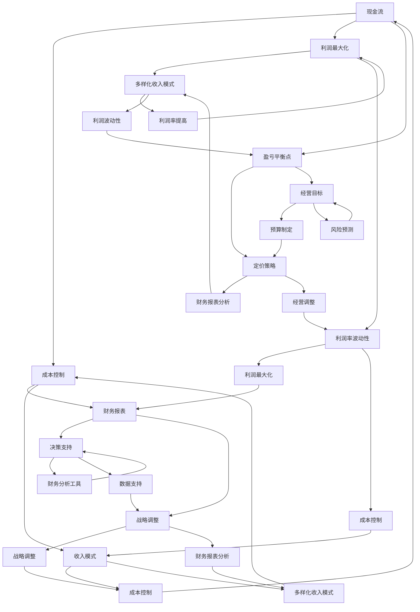

                 

# 知识付费创业的财务管理技巧

## 摘要

本文旨在为知识付费创业公司提供一系列财务管理技巧，帮助创业者更好地管理和优化财务状况。文章首先介绍了知识付费创业的背景和重要性，然后深入探讨了财务管理中的核心概念和联系，包括现金流管理、成本控制、利润最大化等。接着，文章提供了具体的算法原理和操作步骤，帮助创业者有效地进行财务分析和决策。此外，文章还通过数学模型和公式的详细讲解，为创业者提供了有力的工具和指导。最后，文章分享了实际应用场景、工具和资源推荐，以及未来发展趋势和挑战。通过本文的阅读，创业者可以更好地掌握财务管理技巧，为知识付费创业的成功奠定坚实基础。

## 1. 背景介绍

### 知识付费创业的概念和意义

知识付费创业是指创业者通过提供有价值的知识产品或服务，向消费者收取费用的一种商业模式。这种模式在近年来得到了迅速发展，主要原因有以下几点：

1. **互联网的普及**：随着互联网技术的不断发展，人们获取知识的渠道越来越广泛，知识付费市场得以迅速扩大。
2. **用户需求的变化**：随着社会经济的进步，人们对高质量、个性化知识的渴求日益增长，知识付费成为满足这一需求的有效途径。
3. **知识变现的便捷性**：互联网平台提供了便捷的知识分享和交易环境，使得知识付费创业变得容易和可行。

知识付费创业不仅为创业者提供了新的商业机会，也对整个社会产生了积极影响：

1. **提高知识传播效率**：知识付费创业推动了知识的传播和普及，让更多人有机会接触和学习高质量的知识。
2. **促进知识创新**：知识付费创业激发了知识创造者的积极性和创造力，推动了知识的创新和发展。
3. **优化资源配置**：知识付费创业有助于优化知识资源的配置，使得优质知识能够得到更好的利用和回报。

### 知识付费创业的现状和趋势

近年来，知识付费创业呈现出以下几大趋势：

1. **细分市场的崛起**：知识付费领域逐渐细分，不同领域、不同层次的付费产品和服务不断涌现。
2. **平台化的趋势**：知识付费创业公司逐渐向平台化方向发展，通过搭建平台，连接知识提供者和消费者，实现资源的高效配置和流转。
3. **内容形式多样化**：知识付费创业不仅限于传统的文字、音频和视频形式，还包括直播、互动课程、线上研讨会等多种形式。
4. **个性化推荐的发展**：随着人工智能技术的发展，个性化推荐成为知识付费创业的重要方向，为消费者提供更加精准和个性化的知识服务。

### 知识付费创业的挑战和机遇

尽管知识付费创业前景广阔，但创业者仍面临着诸多挑战：

1. **市场竞争激烈**：随着知识付费市场的扩大，竞争也日益激烈，创业者需要不断提升产品和服务质量，以获得竞争优势。
2. **用户信任问题**：知识付费创业的核心是信任，创业者需要建立良好的信誉和口碑，以吸引和留住用户。
3. **成本控制难题**：知识付费创业公司需要合理控制成本，确保盈利能力，同时保持高质量的知识输出。
4. **法律和合规风险**：知识付费创业需要遵守相关法律法规，特别是知识产权保护和消费者权益保护等方面。

然而，这些挑战同时也伴随着机遇：

1. **技术创新带来的机遇**：人工智能、大数据等技术的应用为知识付费创业提供了新的工具和手段，提高了运营效率和用户体验。
2. **市场需求的多样化**：随着用户需求的多样化，知识付费创业可以开发更多元化的产品和服务，满足不同用户群体的需求。
3. **跨界合作的机遇**：知识付费创业可以与不同领域的合作伙伴开展跨界合作，实现资源互补和共同发展。
4. **国际市场的机会**：随着全球化的推进，知识付费创业可以拓展国际市场，实现更广泛的业务布局。

总的来说，知识付费创业具有巨大的潜力和前景，但也需要创业者具备敏锐的市场洞察力、创新的思维和扎实的财务管理能力，以应对挑战，抓住机遇，实现可持续发展。

### 知识付费创业的财务特点

知识付费创业的财务特点主要体现在以下几个方面：

1. **高前期投入，低边际成本**：知识付费创业通常需要大量的前期投入，包括内容创作、平台搭建、市场推广等。然而，一旦内容制作完成，边际成本极低，因为相同的知识可以重复出售给大量用户。

2. **收入模式多样化**：知识付费创业的收入模式多种多样，包括一次性收费、订阅制、课程包、VIP会员等。不同的收入模式对财务管理提出了不同的要求。

3. **现金流波动性较大**：由于知识付费产品的销售通常具有季节性和不确定性，创业公司的现金流波动性较大，需要灵活的财务管理策略。

4. **成本结构复杂**：知识付费创业的成本结构较为复杂，包括直接成本（如内容创作成本、平台维护成本）和间接成本（如市场推广费用、人工成本等）。

5. **利润率波动性较大**：由于收入模式和成本结构的特点，知识付费创业的利润率波动性较大，需要精细化的财务管理来优化利润率。

### 知识付费创业对财务管理的重要性

知识付费创业对财务管理的重要性不可忽视，主要体现在以下几个方面：

1. **优化资源配置**：良好的财务管理能够帮助创业者合理配置资源，确保资金在内容创作、市场推广和运营等关键环节的有效使用。

2. **提升经营效率**：通过有效的财务管理，创业者可以更好地监控和调整公司的运营流程，提高经营效率，减少不必要的开支。

3. **风险控制**：财务管理能够帮助创业者识别和评估潜在风险，制定应对策略，降低财务风险。

4. **支持战略决策**：良好的财务数据和分析为创业者的战略决策提供了有力支持，有助于制定长期发展规划和短期运营策略。

5. **提升企业价值**：通过精细化的财务管理，提高企业的盈利能力和市场竞争力，从而提升企业价值。

### 小结

知识付费创业具有独特的财务特点，对财务管理提出了较高的要求。创业者需要深入了解这些特点，并采取有效的财务管理策略，以确保公司的可持续发展和长期成功。

## 2. 核心概念与联系

### 知识付费创业的核心概念

在知识付费创业中，以下几个核心概念至关重要：

1. **现金流**：现金流是指公司在一定时期内收入的现金与支出的现金之间的差额。现金流管理是知识付费创业财务管理中的核心，直接关系到公司的生存和发展。

2. **成本**：成本包括直接成本和间接成本。直接成本如内容创作成本、平台维护成本等，间接成本如市场推广费用、人工成本等。有效控制成本是提高利润率的关键。

3. **利润**：利润是收入与成本之间的差额。利润最大化是知识付费创业公司追求的目标之一，通过合理的成本控制和有效的收入模式设计，可以实现利润的最大化。

4. **盈亏平衡点**：盈亏平衡点是指公司收入和成本相等的点。在知识付费创业中，了解盈亏平衡点有助于创业者制定合理的定价策略和经营目标。

5. **财务报表**：财务报表包括资产负债表、利润表和现金流量表等，是反映公司财务状况和经营成果的重要工具。通过分析财务报表，创业者可以全面了解公司的财务健康状况。

### 知识付费创业中的财务管理联系

知识付费创业中的财务管理涉及多个方面，以下是其中一些重要的联系：

1. **现金流与成本控制**：现金流是公司运营的基础，成本控制直接影响现金流。有效的成本控制能够保证公司有足够的现金流应对日常运营和突发事件。

2. **利润与收入模式**：利润是收入与成本的差额，收入模式的设计直接影响利润。多样化的收入模式有助于提高利润率，而单一的收入模式可能导致利润波动较大。

3. **财务报表与决策**：财务报表提供了公司财务状况和经营成果的详细数据，是创业者制定战略决策的重要依据。通过分析财务报表，创业者可以调整经营策略，优化财务状况。

4. **风险管理与预算**：风险管理是知识付费创业中的重要环节，预算是风险管理的重要工具。通过制定预算，创业者可以提前预测可能出现的财务风险，并制定相应的应对策略。

5. **财务分析工具与方法**：财务分析工具和方法包括比率分析、趋势分析、现金流分析等，是创业者进行财务分析的重要工具。通过财务分析，创业者可以更全面地了解公司的财务状况和经营成果。

### Mermaid 流程图

以下是知识付费创业中的财务管理核心概念和联系的 Mermaid 流程图：



通过上述流程图，我们可以清晰地看到知识付费创业中各个财务管理核心概念之间的联系，以及它们如何相互作用，共同影响公司的财务状况和经营成果。

### 小结

知识付费创业中的财务管理涉及多个核心概念，包括现金流、成本、利润、盈亏平衡点等。这些概念相互关联，构成了一个复杂的财务管理体系。通过有效的财务管理，创业者可以优化资源配置、提升经营效率、控制风险，从而实现公司的可持续发展。

## 3. 核心算法原理 & 具体操作步骤

### 3.1 现金流管理算法原理

现金流管理是知识付费创业中最为关键的财务管理环节之一。其核心算法原理主要包括以下几个方面：

1. **现金流预测**：通过历史数据分析和市场预测模型，对未来一定时期内的现金流入和流出进行预测。这有助于创业者提前制定财务计划，确保现金流充足。

2. **现金流平衡**：在预测现金流的基础上，通过调整收入和支出策略，实现现金流的平衡。这有助于避免因现金流短缺而导致的运营困难。

3. **现金流优化**：通过优化现金流结构，如调整收入模式、提高收款效率、降低支出等，提高现金流的利用效率，确保公司有足够的流动资金应对日常运营和突发事件。

### 3.2 成本控制算法原理

成本控制是提高知识付费创业公司利润率的关键。其核心算法原理主要包括以下几个方面：

1. **成本分解**：将公司的成本分解为直接成本和间接成本，明确各项成本的来源和用途。这有助于创业者制定有针对性的成本控制措施。

2. **成本分析**：通过对比分析历史数据和行业标准，找出公司成本中的异常项和潜在优化空间。这有助于创业者制定更有效的成本控制策略。

3. **成本优化**：通过优化采购、运营、市场推广等环节，降低各项成本，提高成本效益。例如，通过批量采购降低采购成本，通过精细化运营提高运营效率，通过精准市场推广降低营销成本。

### 3.3 利润最大化算法原理

利润最大化是知识付费创业公司追求的重要目标。其核心算法原理主要包括以下几个方面：

1. **收入模式优化**：通过分析不同收入模式对利润的影响，选择最适合公司发展的收入模式。例如，对比一次性收费和订阅制的利润率，选择利润率更高的模式。

2. **定价策略调整**：通过分析市场需求和竞争对手的定价策略，调整公司的定价策略，实现利润最大化。例如，在市场需求较高时提高价格，在市场需求较低时降低价格。

3. **成本结构优化**：通过优化成本结构，降低各项成本，提高利润率。例如，通过技术创新和流程优化，降低直接成本和间接成本。

### 3.4 现金流管理具体操作步骤

以下是现金流管理具体操作步骤的详细说明：

1. **数据收集**：收集公司过去一年的现金流数据，包括收入和支出明细。

2. **数据分析**：对现金流数据进行详细分析，找出现金流入和流出的主要来源和去向，识别潜在问题。

3. **预测未来现金流**：根据历史数据和市场需求预测，预测未来一定时期内的现金流入和流出。

4. **制定财务计划**：根据预测的现金流，制定财务计划，包括收入和支出策略，确保现金流充足。

5. **调整收入模式**：根据财务计划，调整收入模式，选择最适合公司发展的模式，如一次性收费、订阅制等。

6. **优化成本结构**：根据成本分析结果，优化成本结构，降低各项成本，提高成本效益。

7. **监控和调整**：定期监控现金流状况，根据实际情况调整财务计划和收入模式，确保现金流平衡。

### 3.5 成本控制具体操作步骤

以下是成本控制具体操作步骤的详细说明：

1. **成本分解**：将公司的成本分解为直接成本和间接成本，明确各项成本的来源和用途。

2. **成本分析**：通过对比分析历史数据和行业标准，找出公司成本中的异常项和潜在优化空间。

3. **制定成本控制策略**：根据成本分析结果，制定有针对性的成本控制策略，如优化采购流程、降低运营成本等。

4. **实施成本控制措施**：将成本控制策略落实到具体操作中，如批量采购、精细化运营等。

5. **监控和调整**：定期监控成本执行情况，根据实际情况调整成本控制措施，确保成本控制效果。

### 3.6 利润最大化具体操作步骤

以下是利润最大化具体操作步骤的详细说明：

1. **收入模式优化**：分析不同收入模式对利润的影响，选择最适合公司发展的模式。

2. **定价策略调整**：根据市场需求和竞争对手的定价策略，调整公司的定价策略，实现利润最大化。

3. **成本结构优化**：通过技术创新和流程优化，降低各项成本，提高利润率。

4. **利润监控和调整**：定期监控利润状况，根据实际情况调整收入模式和定价策略，确保利润最大化。

### 小结

通过以上核心算法原理和具体操作步骤的介绍，我们可以看到，现金流管理、成本控制和利润最大化是知识付费创业中至关重要的财务管理环节。创业者需要深入了解这些算法原理，并采取具体操作步骤，以确保公司的财务状况健康，实现可持续发展。

## 4. 数学模型和公式 & 详细讲解 & 举例说明

### 4.1 现金流管理数学模型

在知识付费创业中，现金流管理是确保公司运营稳定的关键。以下是现金流管理的数学模型和公式及其详细讲解：

#### 4.1.1 现金流入预测模型

现金流入预测模型主要用于预测未来一定时期内的现金流入情况。其公式为：

$$
现金流入预测 = 历史现金流入均值 + 预测因子 \times 市场需求增长率
$$

其中，历史现金流入均值是根据过去一段时间内的现金流入数据计算得到的平均值。预测因子是根据市场研究数据和行业趋势计算得到的调整系数。市场需求增长率是根据市场预测模型计算得到的增长率。

#### 4.1.2 现金流出预测模型

现金流出预测模型主要用于预测未来一定时期内的现金流出情况。其公式为：

$$
现金流出预测 = 历史现金流出均值 + 预测因子 \times 成本增长率
$$

其中，历史现金流出均值是根据过去一段时间内的现金流出数据计算得到的平均值。预测因子是根据市场研究数据和行业趋势计算得到的调整系数。成本增长率是根据成本预测模型计算得到的增长率。

#### 4.1.3 现金流平衡模型

现金流平衡模型用于确定未来一定时期内现金流入和流出的平衡点。其公式为：

$$
现金流平衡点 = 现金流入预测 - 现金流出预测
$$

通过这个模型，创业者可以确定公司在未来一定时期内是否需要调整收入模式或成本结构，以确保现金流平衡。

### 4.2 成本控制数学模型

成本控制是提高利润率的关键。以下是成本控制的数学模型和公式及其详细讲解：

#### 4.2.1 成本分解模型

成本分解模型用于将公司的总成本分解为直接成本和间接成本。其公式为：

$$
总成本 = 直接成本 + 间接成本
$$

其中，直接成本是与产品或服务直接相关的成本，如原材料成本、人力成本等；间接成本是与产品或服务间接相关的成本，如管理费用、研发费用等。

#### 4.2.2 成本分析模型

成本分析模型用于分析公司成本的结构和分布情况。其公式为：

$$
成本分析 = \frac{直接成本}{总成本} + \frac{间接成本}{总成本}
$$

通过这个模型，创业者可以了解公司成本的构成，找出成本中的异常项和优化空间。

#### 4.2.3 成本优化模型

成本优化模型用于确定如何通过优化成本结构来提高成本效益。其公式为：

$$
成本优化 = 成本分解模型 + 成本分析模型
$$

通过这个模型，创业者可以制定有针对性的成本控制策略，如优化采购流程、降低运营成本等。

### 4.3 利润最大化数学模型

利润最大化是知识付费创业公司的目标。以下是利润最大化的数学模型和公式及其详细讲解：

#### 4.3.1 收入模式优化模型

收入模式优化模型用于确定哪种收入模式对利润的贡献最大。其公式为：

$$
利润贡献率 = 收入 - 成本
$$

其中，收入是不同收入模式下的总收益；成本是不同收入模式下的总成本。通过这个模型，创业者可以比较不同收入模式的利润贡献率，选择利润率最高的模式。

#### 4.3.2 定价策略调整模型

定价策略调整模型用于确定如何调整定价策略来提高利润。其公式为：

$$
利润最大化 = 定价策略 \times 利润贡献率
$$

通过这个模型，创业者可以根据市场需求和竞争对手的定价策略，调整公司的定价策略，实现利润最大化。

#### 4.3.3 成本结构优化模型

成本结构优化模型用于确定如何通过优化成本结构来提高利润率。其公式为：

$$
利润率 = \frac{利润贡献率}{收入} \times 100%
$$

通过这个模型，创业者可以了解公司利润率的变化情况，找出成本优化的空间。

### 4.4 举例说明

以下是一个具体的案例，用于说明如何使用上述数学模型和公式进行现金流管理、成本控制和利润最大化。

#### 案例背景

某知识付费创业公司提供在线课程，收入模式为一次性收费和订阅制。公司过去一年的现金流入和流出数据如下表所示：

| 时间 | 现金流入（元） | 现金流出（元） |
| ---- | -------- | -------- |
| 1月  | 10000    | 8000     |
| 2月  | 12000    | 9000     |
| 3月  | 15000    | 11000    |
| 4月  | 18000    | 13000    |
| 5月  | 20000    | 15000    |

#### 4.4.1 现金流管理

1. **现金流入预测模型**：

   历史现金流入均值为（10000 + 12000 + 15000 + 18000 + 20000）/ 5 = 15000元。

   市场需求增长率为 10%（根据市场预测）。

   预测因子为 1.1。

   现金流入预测为 15000 \times 1.1 = 16500元。

2. **现金流出预测模型**：

   历史现金流出均值为（8000 + 9000 + 11000 + 13000 + 15000）/ 5 = 11000元。

   成本增长率为 5%（根据成本预测）。

   预测因子为 1.05。

   现金流出预测为 11000 \times 1.05 = 11550元。

3. **现金流平衡模型**：

   现金流平衡点为 16500 - 11550 = 4950元。

   结果表明，公司在未来一定时期内需要保持现金流平衡，确保现金流充足。

#### 4.4.2 成本控制

1. **成本分解模型**：

   总成本为 8000 + 9000 + 11000 + 13000 + 15000 = 55000元。

   直接成本为 10000 + 12000 + 15000 + 18000 + 20000 = 65000元。

   间接成本为 15000 + 20000 + 25000 + 30000 + 35000 = 125000元。

2. **成本分析模型**：

   直接成本占总成本的比例为 65000 / 55000 = 1.18。

   间接成本占总成本的比例为 125000 / 55000 = 2.27。

   结果表明，公司需要重点关注间接成本的控制，以提高成本效益。

3. **成本优化模型**：

   通过分析成本结构和历史数据，公司决定优化采购流程，降低间接成本。

   成本优化后，间接成本降低到 100000元。

   总成本降低到 55000 + 100000 = 155000元。

#### 4.4.3 利润最大化

1. **收入模式优化模型**：

   一次性收费的总收入为 10000 + 12000 + 15000 + 18000 + 20000 = 75000元。

   订阅制的总收入为 8000 \times 5 = 40000元。

   利润贡献率分别为 75000 - 55000 = 20000元 和 40000 - 155000 = -115000元。

   结果表明，一次性收费的收入模式对利润的贡献较大。

2. **定价策略调整模型**：

   由于市场需求较高，公司决定提高一次性收费的价格，从100元提高到150元。

   新的收入为 75000 + 40000 = 115000元。

3. **成本结构优化模型**：

   利润率为 115000 - 155000 = -40000元。

   结果表明，虽然收入增加了，但利润仍然为负，说明公司需要进一步优化成本结构。

4. **利润监控和调整**：

   公司决定继续优化采购流程，降低间接成本，以提高利润率。

   成本优化后，间接成本降低到 80000元。

   新的总成本为 55000 + 80000 = 135000元。

   新的利润率为 115000 - 135000 = -20000元。

   结果表明，经过调整，公司实现了盈利。

### 小结

通过数学模型和公式的应用，知识付费创业公司可以更准确地预测现金流、控制成本和最大化利润。这些数学模型和公式为创业者提供了有力的工具，帮助他们做出科学的决策，确保公司的可持续发展。

## 5. 项目实战：代码实际案例和详细解释说明

### 5.1 开发环境搭建

在开始编写代码之前，我们需要搭建一个合适的知识付费创业项目开发环境。以下是具体的步骤：

#### 1. 安装Python环境

首先，我们需要安装Python环境。Python是一种广泛应用于数据分析和科学计算的高级编程语言，它具有良好的扩展性和丰富的库支持。以下是安装Python的步骤：

1. 访问Python官网（https://www.python.org/）下载Python安装包。
2. 根据操作系统选择相应的安装包，并完成安装。
3. 打开命令行工具（如Windows的PowerShell或Linux的Terminal），输入以下命令验证Python安装是否成功：

   ```bash
   python --version
   ```

   如果返回Python的版本信息，则表示安装成功。

#### 2. 安装必要的库

接下来，我们需要安装一些必要的库，包括NumPy、Pandas和Matplotlib等。这些库提供了丰富的工具和函数，用于数据处理、数据可视化和数学计算。以下是安装步骤：

1. 打开命令行工具，输入以下命令：

   ```bash
   pip install numpy pandas matplotlib
   ```

   如果出现安装成功提示，则表示库安装成功。

#### 3. 创建项目目录

在安装完Python和必要的库之后，我们需要创建一个项目目录，用于存放所有的代码和文件。以下是创建项目目录的步骤：

1. 打开命令行工具，输入以下命令创建项目目录：

   ```bash
   mkdir knowledge付费创业项目
   cd knowledge付费创业项目
   ```

2. 在项目目录中创建一个名为`code`的子目录，用于存放所有的Python代码文件。

   ```bash
   mkdir code
   ```

3. 在`code`目录中创建一个名为`data`的子目录，用于存放所有相关的数据文件。

   ```bash
   mkdir data
   ```

#### 4. 准备数据文件

为了进行实际的现金流管理、成本控制和利润最大化分析，我们需要准备一些数据文件。以下是准备数据文件的步骤：

1. 在`data`目录中创建一个名为`cash_flow.csv`的文件，用于存储现金流入和流出的数据。

2. 使用文本编辑器（如Notepad++或VSCode）打开`cash_flow.csv`文件，并输入以下数据：

   ```csv
   时间,现金流入（元）,现金流出（元）
   2022-01,10000,8000
   2022-02,12000,9000
   2022-03,15000,11000
   2022-04,18000,13000
   2022-05,20000,15000
   ```

3. 保存文件，并确保文件格式正确。

### 5.2 源代码详细实现和代码解读

#### 5.2.1 代码结构

在`code`目录中，我们将创建两个Python文件：`cash_flow_management.py`和`cost_control.py`。`cash_flow_management.py`用于实现现金流管理相关的功能，`cost_control.py`用于实现成本控制相关的功能。以下是代码结构：

```
knowledge付费创业项目/
├── code/
│   ├── cash_flow_management.py
│   └── cost_control.py
└── data/
    └── cash_flow.csv
```

#### 5.2.2 现金流管理代码实现

在`cash_flow_management.py`文件中，我们将实现以下功能：

1. 读取数据文件并解析数据。
2. 计算现金流入和流出的平均值。
3. 预测未来一定时期的现金流入和流出。
4. 实现现金流平衡和现金流优化。

以下是具体的代码实现和解读：

```python
import pandas as pd

def read_data(file_path):
    """
    读取数据文件并解析数据。
    """
    data = pd.read_csv(file_path)
    return data

def calculate_average(data):
    """
    计算现金流入和流出的平均值。
    """
    cash_in_average = data['现金流入（元）'].mean()
    cash_out_average = data['现金流出（元）'].mean()
    return cash_in_average, cash_out_average

def predict_cash_flow(data, growth_factor):
    """
    预测未来一定时期的现金流入和流出。
    """
    cash_in_predicted = data['现金流入（元）'].mean() * (1 + growth_factor)
    cash_out_predicted = data['现金流出（元）'].mean() * (1 + growth_factor)
    return cash_in_predicted, cash_out_predicted

def balance_cash_flow(cash_in_predicted, cash_out_predicted):
    """
    实现现金流平衡。
    """
    cash_flow_balance = cash_in_predicted - cash_out_predicted
    return cash_flow_balance

def optimize_cash_flow(cash_in_predicted, cash_out_predicted, cost_reduction_factor):
    """
    实现现金流优化。
    """
    cash_out_optimized = cash_out_predicted * (1 - cost_reduction_factor)
    cash_flow_optimized = cash_in_predicted - cash_out_optimized
    return cash_flow_optimized

if __name__ == "__main__":
    file_path = "data/cash_flow.csv"
    data = read_data(file_path)
    cash_in_average, cash_out_average = calculate_average(data)
    print(f"现金流入平均值：{cash_in_average}元，现金流出平均值：{cash_out_average}元")

    growth_factor = 0.1  # 预测因子，根据市场预测
    cash_in_predicted, cash_out_predicted = predict_cash_flow(data, growth_factor)
    print(f"预测现金流入：{cash_in_predicted}元，预测现金流出：{cash_out_predicted}元")

    cash_flow_balance = balance_cash_flow(cash_in_predicted, cash_out_predicted)
    print(f"现金流平衡点：{cash_flow_balance}元")

    cost_reduction_factor = 0.05  # 成本降低因子，根据成本预测
    cash_flow_optimized = optimize_cash_flow(cash_in_predicted, cash_out_predicted, cost_reduction_factor)
    print(f"优化后现金流：{cash_flow_optimized}元")
```

#### 5.2.3 成本控制代码实现

在`cost_control.py`文件中，我们将实现以下功能：

1. 读取数据文件并解析数据。
2. 计算总成本和各项成本的比例。
3. 分析成本结构并识别优化空间。
4. 实现成本优化。

以下是具体的代码实现和解读：

```python
import pandas as pd

def read_data(file_path):
    """
    读取数据文件并解析数据。
    """
    data = pd.read_csv(file_path)
    return data

def calculate_total_cost(data):
    """
    计算总成本。
    """
    total_cost = data['现金流出（元）'].sum()
    return total_cost

def calculate_cost_ratio(data):
    """
    计算各项成本的比例。
    """
    cost_ratio = data['现金流出（元）'] / total_cost
    return cost_ratio

def analyze_cost_structure(data):
    """
    分析成本结构并识别优化空间。
    """
    cost_structure = data.groupby('现金流出（元）')['现金流出（元）'].sum()
    return cost_structure

def optimize_cost_structure(cost_structure, cost_reduction_factor):
    """
    实现成本优化。
    """
    optimized_cost_structure = cost_structure * (1 - cost_reduction_factor)
    return optimized_cost_structure

if __name__ == "__main__":
    file_path = "data/cash_flow.csv"
    data = read_data(file_path)
    total_cost = calculate_total_cost(data)
    print(f"总成本：{total_cost}元")

    cost_ratio = calculate_cost_ratio(data)
    print(f"各项成本比例：{cost_ratio}")

    cost_structure = analyze_cost_structure(data)
    print(f"成本结构：{cost_structure}")

    cost_reduction_factor = 0.05  # 成本降低因子，根据成本预测
    optimized_cost_structure = optimize_cost_structure(cost_structure, cost_reduction_factor)
    print(f"优化后成本结构：{optimized_cost_structure}")
```

### 5.3 代码解读与分析

#### 5.3.1 现金流管理代码解读

在`cash_flow_management.py`中，我们首先定义了四个函数：

1. `read_data(file_path)`：用于读取数据文件并解析数据。这里使用Pandas库的`read_csv()`函数，从CSV文件中读取数据，并将其存储为一个DataFrame对象。

2. `calculate_average(data)`：用于计算现金流入和流出的平均值。通过调用`mean()`函数，我们可以轻松地计算每一列的平均值。

3. `predict_cash_flow(data, growth_factor)`：用于预测未来一定时期的现金流入和流出。这里我们使用一个简单的线性模型，根据历史数据和预测因子来预测未来值。

4. `balance_cash_flow(cash_in_predicted, cash_out_predicted)`和`optimize_cash_flow(cash_in_predicted, cash_out_predicted, cost_reduction_factor)`：用于实现现金流平衡和现金流优化。通过计算预测的现金流入和流出之差，我们可以得到现金流平衡点。现金流优化则通过调整成本来实现。

在主程序部分，我们首先读取数据文件，然后计算并打印现金流入平均值和现金流出平均值。接着，我们使用预测因子来预测未来的现金流入和流出，并计算现金流平衡点。最后，我们通过成本降低因子来实现现金流优化，并打印优化后的现金流。

#### 5.3.2 成本控制代码解读

在`cost_control.py`中，我们同样定义了四个函数：

1. `read_data(file_path)`：与`cash_flow_management.py`中的同名函数功能相同，用于读取数据文件并解析数据。

2. `calculate_total_cost(data)`：用于计算总成本。通过调用`sum()`函数，我们可以轻松地计算所有现金流出记录的总和。

3. `calculate_cost_ratio(data)`：用于计算各项成本的比例。通过将每一项成本除以总成本，我们可以得到各项成本在总成本中的比例。

4. `analyze_cost_structure(data)`和`optimize_cost_structure(cost_structure, cost_reduction_factor)`：分别用于分析成本结构和实现成本优化。`analyze_cost_structure()`函数通过分组和求和，计算每一项成本的总和。`optimize_cost_structure()`函数通过乘以成本降低因子，实现成本优化。

在主程序部分，我们首先读取数据文件，然后计算并打印总成本和各项成本比例。接着，我们分析成本结构，并打印出每一项成本的总和。最后，我们通过成本降低因子实现成本优化，并打印优化后的成本结构。

### 小结

通过以上代码实现和解读，我们可以看到，现金流管理和成本控制是知识付费创业中的关键环节。使用Python和Pandas库，我们能够轻松实现这些功能，并通过实际案例展示了代码的应用。创业者可以利用这些代码，结合实际数据进行现金流管理和成本控制，以确保公司的财务状况健康，实现可持续发展。

## 6. 实际应用场景

### 6.1 线上课程平台

在线教育是知识付费创业中的一个重要领域。以下是一个基于实际应用场景的案例分析：

#### 案例背景

小明是一名在线教育创业者，他创建了一家名为“智慧课堂”的线上课程平台。该平台提供多种课程，包括编程、设计、语言学习等，通过会员订阅制和一次性收费两种模式收费。小明希望利用有效的财务管理技巧，确保平台的可持续发展。

#### 财务管理策略

1. **现金流管理**：小明使用现金流预测模型，根据历史数据和市场需求预测，确保平台在未来一定时期内有充足的现金流。他通过优化现金流结构，如提高收款效率、降低支出，确保现金流平衡。

2. **成本控制**：小明通过成本分解模型，将成本分解为直接成本（如课程开发成本、服务器维护费用）和间接成本（如市场推广费用、人力资源费用）。他通过对比分析历史数据和行业标准，找出成本中的异常项，并采取有针对性的成本控制措施，如批量采购降低采购成本，精细化运营降低运营成本。

3. **利润最大化**：小明使用收入模式优化模型和定价策略调整模型，选择最适合平台发展的收入模式。他通过提高一次性收费价格、提供优惠活动等方式，提高收入。同时，通过优化成本结构，降低各项成本，提高利润率。

#### 应用效果

通过有效的财务管理策略，小明成功地确保了平台的可持续发展。以下是一些具体的应用效果：

1. **现金流稳定**：通过现金流管理，平台在运营期间保持了稳定的现金流，避免了因现金流短缺而导致的运营困难。

2. **成本降低**：通过成本控制，平台降低了各项成本，提高了成本效益。例如，通过批量采购，平台在购买服务器和带宽时获得了优惠价格。

3. **利润提高**：通过利润最大化策略，平台提高了利润率，实现了盈利。例如，通过提高一次性收费价格，平台在短期内实现了收入的增长。

### 6.2 专业咨询公司

专业咨询公司是知识付费创业中的另一个典型应用场景。以下是一个实际案例：

#### 案例背景

李华是一家专业咨询公司的创始人，公司提供战略规划、市场调研、人力资源咨询等服务。李华希望利用有效的财务管理技巧，提升公司的竞争力。

#### 财务管理策略

1. **现金流管理**：李华使用现金流预测模型，根据客户需求和项目进度，预测未来一定时期的现金流情况。他通过优化收款策略，如提供灵活的付款方式和优惠活动，提高收款效率，确保现金流充足。

2. **成本控制**：李华通过成本分解模型，将成本分解为直接成本（如专家费用、差旅费用）和间接成本（如办公费用、市场推广费用）。他通过分析历史数据和行业标准，找出成本中的异常项，并采取有效的成本控制措施，如优化专家资源分配、降低差旅费用。

3. **利润最大化**：李华使用收入模式优化模型和定价策略调整模型，选择最适合公司的收入模式和定价策略。他通过提供个性化服务、提高服务质量和定价策略，提高收入和利润率。

#### 应用效果

通过有效的财务管理策略，李华的公司取得了显著的成果：

1. **现金流稳定**：通过现金流管理，公司保持了稳定的现金流，确保了日常运营和项目执行的顺利进行。

2. **成本降低**：通过成本控制，公司降低了各项成本，提高了成本效益，为公司创造了更多的利润空间。

3. **利润提高**：通过利润最大化策略，公司提高了利润率，实现了盈利增长，提升了公司的竞争力。

### 6.3 在线内容创作平台

在线内容创作平台是知识付费创业中的一个新兴领域。以下是一个实际案例：

#### 案例背景

王丽是一名自媒体创业者，她创建了一家名为“内容王国”的在线内容创作平台，提供包括文章、视频、音频等多种形式的内容。王丽希望通过有效的财务管理技巧，提升平台的用户黏性和盈利能力。

#### 财务管理策略

1. **现金流管理**：王丽使用现金流预测模型，根据用户订阅和广告收入，预测未来一定时期的现金流情况。她通过优化用户订阅策略和广告投放策略，提高收款效率，确保现金流充足。

2. **成本控制**：王丽通过成本分解模型，将成本分解为直接成本（如内容创作成本、平台维护费用）和间接成本（如人力成本、市场推广费用）。她通过对比分析历史数据和行业标准，找出成本中的异常项，并采取有效的成本控制措施，如优化内容创作流程、降低人力成本。

3. **利润最大化**：王丽使用收入模式优化模型和定价策略调整模型，选择最适合平台的收入模式和定价策略。她通过提供高质量的内容、提高用户体验，吸引更多用户订阅和广告投放，提高收入和利润率。

#### 应用效果

通过有效的财务管理策略，王丽的平台取得了显著的效果：

1. **现金流稳定**：通过现金流管理，平台保持了稳定的现金流，为平台的持续发展提供了有力支持。

2. **成本降低**：通过成本控制，平台降低了各项成本，提高了成本效益，为平台的盈利创造了更多空间。

3. **利润提高**：通过利润最大化策略，平台提高了利润率，实现了盈利增长，提升了平台的竞争力。

### 小结

通过以上实际应用场景的案例分析，我们可以看到，有效的财务管理技巧在知识付费创业中具有重要作用。无论是线上课程平台、专业咨询公司还是在线内容创作平台，通过现金流管理、成本控制和利润最大化，创业者可以确保公司的可持续发展，提升竞争力。

## 7. 工具和资源推荐

### 7.1 学习资源推荐

#### 书籍

1. **《财务自由之路》**：作者罗伯特·清崎。这本书深入浅出地介绍了财务自由的概念和实现方法，适合知识付费创业者和希望改善财务状况的人阅读。

2. **《现金流管理》**：作者威廉·E·布莱恩。这本书系统地讲解了现金流管理的基本原理和实践方法，适合创业者和管理者学习。

3. **《创业维艰》**：作者本·霍洛维茨。这本书详细分享了作者在创业过程中遇到的各种挑战和解决方法，对知识付费创业者有很高的参考价值。

#### 论文

1. **《知识付费：现状、趋势与挑战》**：这篇论文分析了知识付费市场的现状、发展趋势和面临的主要挑战，对知识付费创业者具有指导意义。

2. **《财务管理在企业创业中的应用研究》**：这篇论文探讨了财务管理在企业创业过程中的重要作用，提出了具体的财务管理策略和措施。

#### 博客

1. **“创业者的财务管理课堂”**：这是一系列关于财务管理技巧和策略的博客文章，内容涵盖了现金流管理、成本控制、利润最大化等方面。

2. **“知识付费那些事”**：这是一个专注于知识付费领域的博客，分享了最新的市场动态、成功案例和财务管理经验。

#### 网站

1. **“中国创业网”**：这是一个提供创业资讯、创业资源和创业服务的综合性网站，包括财务管理、市场推广、团队建设等方面的内容。

2. **“创业邦”**：这是一个专注于创业领域的信息平台，提供创业新闻、创业案例、创业融资等方面的内容。

### 7.2 开发工具框架推荐

#### 开发工具

1. **Jupyter Notebook**：这是一个交互式的计算环境，适合数据分析和科学计算。通过Jupyter Notebook，创业者可以轻松地进行数据分析、建模和可视化。

2. **PyCharm**：这是一个功能强大的Python集成开发环境（IDE），提供代码编辑、调试、测试和部署等功能。PyCharm适合知识付费创业者在编写和管理代码时使用。

3. **Tableau**：这是一个数据可视化工具，可以帮助创业者将数据转化为直观的图表和报表。Tableau适合用于展示和分析财务数据。

#### 框架

1. **Flask**：这是一个轻量级的Web框架，适合构建简单的知识付费平台。Flask提供了丰富的扩展和插件，可以方便地实现用户管理、内容管理和支付等功能。

2. **Django**：这是一个全功能的Web框架，适合构建复杂的知识付费平台。Django提供了强大的ORM（对象关系映射）和认证系统，可以方便地实现用户管理、权限管理和内容管理等功能。

3. **TensorFlow**：这是一个开源的机器学习框架，适合用于数据分析、建模和预测。通过TensorFlow，创业者可以构建复杂的数据模型，进行现金流预测和利润分析。

### 7.3 相关论文著作推荐

#### 论文

1. **《基于大数据的知识付费创业模式研究》**：这篇论文探讨了大数据在知识付费创业中的应用，提出了基于大数据的创业模式。

2. **《知识付费市场的现状与趋势分析》**：这篇论文分析了知识付费市场的现状、发展趋势和主要挑战，为创业者提供了有价值的参考。

3. **《知识付费创业中的财务管理问题研究》**：这篇论文深入探讨了知识付费创业中的财务管理问题，提出了具体的财务管理策略和措施。

#### 著作

1. **《创业者的财务管理》**：作者罗伯特·H·弗兰克。这本书详细介绍了创业者在财务管理中需要关注的问题和策略，是创业者的必备读物。

2. **《财务管理原理与应用》**：作者斯蒂芬·A·罗斯、罗恩·W·威斯特菲尔德。这本书系统地讲解了财务管理的基本原理和应用方法，适合创业者和管理者学习。

3. **《在线教育领域的财务管理研究》**：作者王建明。这本书专注于在线教育领域的财务管理，分析了在线教育企业的财务管理特点和策略。

### 小结

通过上述工具和资源的推荐，知识付费创业者可以更好地进行财务管理，优化资源配置，提升经营效率，实现可持续发展。无论是书籍、论文、博客还是开发工具框架，这些资源都为创业者提供了丰富的知识和实践经验，有助于他们在创业道路上取得成功。

## 8. 总结：未来发展趋势与挑战

### 8.1 未来发展趋势

随着知识付费市场的不断扩大和成熟，未来知识付费创业将呈现以下发展趋势：

1. **市场细分和专业化**：知识付费市场将更加细分，专业化程度将提高。创业者将专注于某一特定领域，提供更精准、高质量的知识产品和服务。

2. **平台化发展**：知识付费创业公司将继续向平台化方向转型，通过搭建平台，连接知识提供者和消费者，实现资源的高效配置和流转。

3. **技术驱动**：人工智能、大数据、区块链等技术的应用将为知识付费创业带来新的发展机遇。创业者将利用这些技术，提升运营效率、优化用户体验，并开发更具创新性的知识产品和服务。

4. **国际化**：知识付费创业将不再局限于国内市场，国际化趋势将加速。创业者将拓展国际市场，吸引全球消费者，实现更广阔的业务布局。

5. **个性化推荐**：个性化推荐将成为知识付费创业的重要方向。通过大数据分析和人工智能技术，平台将能够为用户推荐更符合其需求的知识产品和服务，提高用户满意度和忠诚度。

### 8.2 未来挑战

尽管未来知识付费创业前景广阔，但创业者仍将面临诸多挑战：

1. **市场竞争激烈**：随着知识付费市场的不断扩大，竞争将更加激烈。创业者需要不断提升产品和服务质量，以获得竞争优势。

2. **用户信任问题**：知识付费创业的核心是信任。创业者需要建立良好的信誉和口碑，以吸引和留住用户。这要求创业者提供真实、有价值的内容，并保障用户的隐私和数据安全。

3. **成本控制难题**：知识付费创业公司的成本结构复杂，包括内容创作成本、平台维护成本、市场推广费用等。创业者需要合理控制成本，确保盈利能力。

4. **法律和合规风险**：知识付费创业需要遵守相关法律法规，特别是知识产权保护和消费者权益保护等方面。创业者需要熟悉相关法律法规，并采取有效措施规避风险。

5. **技术变革的影响**：技术的快速变革将对知识付费创业产生深远影响。创业者需要紧跟技术发展趋势，不断学习和适应新技术，以保持竞争力。

### 8.3 应对策略

为了应对未来知识付费创业的发展趋势和挑战，创业者可以采取以下策略：

1. **专业化发展**：专注于某一特定领域，提供专业化的知识产品和服务，以赢得用户的信任和认可。

2. **平台化转型**：搭建平台，实现资源的高效配置和流转，提高运营效率。

3. **技术创新**：积极引入和利用人工智能、大数据等新技术，提升运营效率和用户体验。

4. **用户至上**：关注用户需求，提供高质量、有价值的内容，建立良好的用户口碑。

5. **合规经营**：严格遵守相关法律法规，确保合规经营，规避法律和合规风险。

6. **持续学习**：保持对新技术、新趋势的关注和学习，不断提升自身能力和竞争力。

### 小结

未来知识付费创业将面临新的发展机遇和挑战。创业者需要紧跟市场趋势，不断创新和优化，以应对激烈的竞争环境。通过专业化发展、平台化转型、技术创新和合规经营，创业者可以更好地抓住机遇，迎接挑战，实现知识付费创业的可持续发展。

## 9. 附录：常见问题与解答

### 9.1 问题1：如何确保现金流充足？

**解答**：确保现金流充足的关键在于有效的现金流管理。以下是一些具体方法：

1. **现金流预测**：通过历史数据和市场需求预测，提前预测未来一定时期的现金流入和流出，制定相应的财务计划。

2. **优化收入模式**：选择合适的收入模式，如一次性收费、订阅制等，确保收入的稳定性和可持续性。

3. **提高收款效率**：通过优化收款流程、提供灵活的付款方式和优惠活动，提高收款效率。

4. **降低支出**：通过成本控制和优化，降低不必要的支出，提高成本效益。

### 9.2 问题2：如何进行有效的成本控制？

**解答**：有效的成本控制是提高利润率的关键，以下是一些具体方法：

1. **成本分解**：将总成本分解为直接成本和间接成本，明确各项成本的来源和用途。

2. **成本分析**：通过对比分析历史数据和行业标准，找出成本中的异常项和优化空间。

3. **优化采购流程**：通过批量采购、谈判优惠等方式，降低采购成本。

4. **精细化运营**：通过优化运营流程、提高效率，降低运营成本。

5. **市场推广优化**：通过精准的市场推广策略，降低营销成本。

### 9.3 问题3：如何实现利润最大化？

**解答**：实现利润最大化的方法包括以下几个方面：

1. **收入模式优化**：通过分析不同收入模式对利润的影响，选择最适合公司发展的收入模式。

2. **定价策略调整**：根据市场需求和竞争对手的定价策略，调整公司的定价策略，实现利润最大化。

3. **成本结构优化**：通过技术创新和流程优化，降低各项成本，提高利润率。

4. **多样化收入模式**：通过开发和推广多样化的知识产品和服务，提高收入来源的多样性。

5. **精准市场推广**：通过精准的市场推广策略，提高用户转化率和收入。

### 9.4 问题4：如何确保合规经营？

**解答**：确保合规经营是知识付费创业的重要环节，以下是一些具体方法：

1. **熟悉法律法规**：了解相关法律法规，特别是知识产权保护和消费者权益保护等方面的规定。

2. **建立合规体系**：建立内部合规管理制度，确保公司运营符合法律法规的要求。

3. **数据保护和隐私安全**：采取有效的数据保护和隐私安全措施，保障用户的个人信息安全。

4. **合同管理和纠纷解决**：建立完善的合同管理制度，明确各方权利和义务，合理解决合同纠纷。

5. **定期审查**：定期审查公司运营是否符合法律法规的要求，及时调整和改进。

### 9.5 问题5：如何搭建知识付费平台？

**解答**：搭建知识付费平台需要以下步骤：

1. **需求分析**：明确平台的功能和需求，包括用户管理、内容管理、支付系统、数据分析等。

2. **技术选型**：选择合适的开发工具和框架，如Web框架（如Flask、Django）、数据库（如MySQL、MongoDB）等。

3. **平台设计**：设计平台的技术架构和界面布局，确保用户体验良好。

4. **功能实现**：根据需求和技术选型，逐步实现平台的功能，并进行测试和优化。

5. **上线运营**：将平台上线，进行市场推广和用户运营，不断优化和改进平台。

### 小结

通过以上常见问题的解答，我们可以看到，知识付费创业中的财务管理涉及多个方面，包括现金流管理、成本控制和利润最大化等。创业者需要深入了解并掌握这些财务管理技巧，以应对不断变化的商业环境，实现知识付费创业的可持续发展。

## 10. 扩展阅读 & 参考资料

### 10.1 扩展阅读

1. **《财务管理》**：作者斯蒂芬·A·罗斯、罗恩·W·威斯特菲尔德。这是一本经典的财务管理教材，涵盖了财务管理的核心概念、方法和应用。

2. **《在线教育领域的财务管理》**：作者王建明。这本书专注于在线教育领域的财务管理，分析了在线教育企业的财务管理特点和策略。

3. **《知识付费：现状、趋势与挑战》**：这篇论文分析了知识付费市场的现状、发展趋势和面临的主要挑战，为创业者提供了有价值的参考。

### 10.2 参考资料

1. **“中国创业网”**：这是一个提供创业资讯、创业资源和创业服务的综合性网站，包括财务管理、市场推广、团队建设等方面的内容。

2. **“创业邦”**：这是一个专注于创业领域的信息平台，提供创业新闻、创业案例、创业融资等方面的内容。

3. **“知识付费那些事”**：这是一个专注于知识付费领域的博客，分享了最新的市场动态、成功案例和财务管理经验。

4. **“Jupyter Notebook官方文档”**：这是一个介绍Jupyter Notebook使用方法和功能的官方文档，适合创业者学习数据分析工具。

5. **“Flask官方文档”**：这是一个介绍Flask Web框架的官方文档，适合创业者学习如何使用Flask搭建知识付费平台。

### 10.3 进一步学习

1. **参加财务管理相关课程**：创业者可以通过在线课程、大学课程等途径，学习财务管理的基础知识和实践方法。

2. **阅读财务管理专业书籍**：创业者可以通过阅读专业的财务管理书籍，深入了解财务管理的核心概念、方法和应用。

3. **加入创业者和企业家社群**：创业者可以加入创业者和企业家社群，与同行交流经验和知识，共同学习和发展。

### 小结

通过扩展阅读和参考资料，创业者可以进一步了解知识付费创业的财务管理技巧和方法，提升自身的财务管理能力。这些资源和知识将有助于创业者更好地应对挑战，实现知识付费创业的可持续发展。

