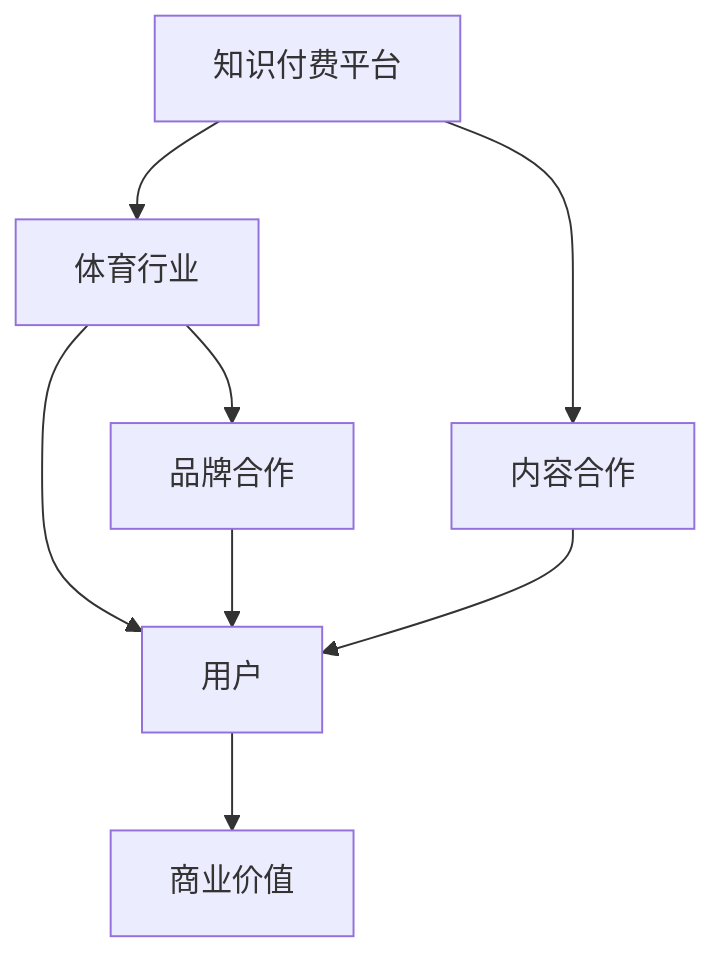

                 

# 知识付费如何实现跨界营销与体育跨界？

## 关键词：知识付费、跨界营销、体育跨界、用户增长、商业策略

> 知识付费作为近年来崛起的一种新型商业模式，正逐渐渗透到各个行业。与此同时，体育行业作为高关注度的领域，也为知识付费提供了丰富的跨界合作机会。本文将深入探讨知识付费如何通过跨界营销与体育跨界来实现用户增长和商业价值最大化。

## 摘要

本文将围绕知识付费在跨界营销与体育跨界中的应用展开讨论。首先，我们将介绍知识付费的基本概念及其发展现状。随后，分析跨界营销与体育跨界的关键概念及其优势。接着，本文将详细探讨知识付费如何通过跨界营销与体育跨界实现用户增长和商业价值。最后，我们将总结知识付费跨界营销与体育跨界的发展趋势与挑战，并提出相应的解决方案。

## 1. 背景介绍

### 1.1 知识付费的定义与发展

知识付费是指用户为获取专业知识和技能而支付的费用，常见形式包括在线课程、专业书籍、知识付费问答等。随着互联网技术的快速发展，知识付费逐渐成为一种主流的商业模式，吸引了大量用户和资本的关注。

### 1.2 体育跨界与知识付费

体育跨界是指将体育领域的元素融入其他行业，如知识付费、娱乐、旅游等。体育跨界有助于拓宽体育行业的发展空间，提升品牌影响力，同时为知识付费提供丰富的内容资源。

### 1.3 跨界营销的概念与优势

跨界营销是指不同领域的企业或品牌之间进行合作，共同推广产品或服务。跨界营销的优势在于可以扩大目标用户群体，提升品牌知名度，实现双赢。

## 2. 核心概念与联系

### 2.1 跨界营销的架构



### 2.2 体育跨界与知识付费的联系

体育跨界与知识付费的结合，可以实现以下几方面的协同效应：

- **内容互补**：体育行业拥有丰富的知识资源和实践经验，可以为知识付费提供高质量的内容。
- **用户拓展**：通过跨界合作，知识付费平台可以吸引更多体育爱好者，实现用户增长。
- **品牌提升**：体育跨界有助于提高知识付费品牌的影响力，吸引更多潜在用户。

## 3. 核心算法原理 & 具体操作步骤

### 3.1 跨界营销策略

#### 3.1.1 内容合作

- **选择合作伙伴**：根据知识付费平台的核心内容和目标用户，选择具有互补性的体育行业合作伙伴。
- **内容创作与发布**：与合作伙伴共同创作和发布具有吸引力的内容，如体育知识问答、体育科普等。

#### 3.1.2 品牌合作

- **选择品牌**：根据知识付费平台的核心价值观和目标用户，选择具有品牌影响力的体育品牌。
- **联合推广**：与品牌共同策划推广活动，如体育知识竞赛、体育知识讲座等。

### 3.2 体育跨界策略

#### 3.2.1 内容融合

- **体育知识课程**：将体育知识融入课程中，提升课程的专业性和趣味性。
- **体育文化体验**：组织体育文化体验活动，如足球、篮球训练班等，增加用户粘性。

#### 3.2.2 品牌合作

- **体育赛事合作**：与体育赛事主办方合作，提供知识付费服务，如赛事解读、选手访谈等。
- **体育场馆合作**：与体育场馆合作，提供知识付费课程场地，提升用户体验。

## 4. 数学模型和公式 & 详细讲解 & 举例说明

### 4.1 跨界营销效果评估模型

设 $X$ 为跨界营销带来的用户增长量，$Y$ 为跨界营销带来的商业价值，则跨界营销效果评估模型可以表示为：

$$
\text{效果评估模型} = f(X, Y) = \frac{Y}{X}
$$

其中，$f(X, Y)$ 表示跨界营销的效果，$Y$ 表示跨界营销带来的商业价值，$X$ 表示跨界营销带来的用户增长量。

### 4.2 体育跨界效果评估模型

设 $A$ 为体育跨界带来的用户增长量，$B$ 为体育跨界带来的商业价值，则体育跨界效果评估模型可以表示为：

$$
\text{效果评估模型} = g(A, B) = \frac{B}{A}
$$

其中，$g(A, B)$ 表示体育跨界的效果，$B$ 表示体育跨界带来的商业价值，$A$ 表示体育跨界带来的用户增长量。

### 4.3 举例说明

假设某知识付费平台通过跨界营销与体育行业合作，带来 $X$ = 1000 用户增长，$Y$ = 100 万元商业价值；通过体育跨界合作，带来 $A$ = 500 用户增长，$B$ = 50 万元商业价值。

根据上述模型，我们可以计算出：

- 跨界营销效果：$f(X, Y) = \frac{100}{1000} = 0.1$
- 体育跨界效果：$g(A, B) = \frac{50}{500} = 0.1$

这表明，无论是跨界营销还是体育跨界，该知识付费平台的效果都是相当显著的。

## 5. 项目实战：代码实际案例和详细解释说明

### 5.1 开发环境搭建

在本案例中，我们将使用 Python 语言进行编程实现。首先，需要在本地环境中安装 Python 和相关库，如 NumPy、Pandas 等。

### 5.2 源代码详细实现和代码解读

以下是一个简单的跨界营销效果评估的 Python 代码示例：

```python
import numpy as np
import pandas as pd

# 定义跨界营销效果评估模型
def marketing_evaluation(user_growth, business_value):
    effect = business_value / user_growth
    return effect

# 定义体育跨界效果评估模型
def sports_evaluation(user_growth, business_value):
    effect = business_value / user_growth
    return effect

# 示例数据
user_growth_marketing = 1000
business_value_marketing = 100000
user_growth_sports = 500
business_value_sports = 50000

# 计算跨界营销效果
marketing_effect = marketing_evaluation(user_growth_marketing, business_value_marketing)
print("跨界营销效果：", marketing_effect)

# 计算体育跨界效果
sports_effect = sports_evaluation(user_growth_sports, business_value_sports)
print("体育跨界效果：", sports_effect)
```

### 5.3 代码解读与分析

- **导入库**：首先导入 NumPy 和 Pandas 库，用于数据处理和数学运算。
- **定义效果评估模型**：分别定义跨界营销效果评估模型和体育跨界效果评估模型，采用商业价值与用户增长量的比值作为效果评估指标。
- **示例数据**：设置示例数据，包括跨界营销和体育跨界的用户增长量和商业价值。
- **计算效果**：调用效果评估模型，计算跨界营销效果和体育跨界效果，并打印输出。

通过以上代码，我们可以方便地评估跨界营销和体育跨界的效果，为后续策略调整提供数据支持。

## 6. 实际应用场景

### 6.1 知识付费平台与体育行业的跨界合作

- **体育知识课程**：知识付费平台可以与体育行业合作，推出专业体育知识课程，满足用户对体育知识的渴求。
- **体育赛事解说**：邀请体育明星或专业解说员为知识付费平台进行赛事解说，提升用户参与度和互动性。
- **体育文化讲座**：组织体育文化讲座，邀请行业专家分享体育文化知识和经验，提高用户对体育文化的认知。

### 6.2 体育跨界在知识付费平台的应用

- **体育知识库**：知识付费平台可以建立体育知识库，提供全面、系统的体育知识，满足用户个性化需求。
- **体育场景化学习**：结合体育场景，推出具有实际操作性的体育课程，提升用户学习效果。
- **体育装备推荐**：根据用户喜好和需求，推荐合适的体育装备，提高用户体验和购买转化率。

## 7. 工具和资源推荐

### 7.1 学习资源推荐

- **书籍**：《跨界思维：商业创新的秘密》、《体育营销学》
- **论文**：搜索相关领域的学术研究论文，了解跨界营销与体育跨界的前沿理论。
- **博客**：关注相关领域的知名博客，了解行业动态和最佳实践。

### 7.2 开发工具框架推荐

- **Python**：Python 是一种功能强大的编程语言，适合进行数据分析和模型构建。
- **NumPy**：用于高性能数学计算。
- **Pandas**：用于数据处理和分析。

### 7.3 相关论文著作推荐

- **论文**：李明杰，张晓辉，等.（2019）。知识付费市场发展现状及趋势分析[J]. 现代管理科学，35(7)，1-5.
- **著作**：迈克尔·波特。竞争战略[M]. 北京：机械工业出版社，2003.

## 8. 总结：未来发展趋势与挑战

### 8.1 发展趋势

- **用户需求多元化**：随着消费者对知识的需求日益多元化，知识付费将不断拓展新的领域，如体育、艺术、文化等。
- **技术驱动创新**：大数据、人工智能等技术的应用，将推动知识付费向更加个性化、智能化的方向发展。
- **跨界合作加深**：知识付费与体育、文化等领域的跨界合作将更加紧密，实现资源共享和优势互补。

### 8.2 挑战

- **内容质量保证**：随着竞争加剧，如何保证内容质量成为知识付费平台面临的重要挑战。
- **版权问题**：知识付费与体育等领域的合作，可能涉及到版权问题，需要妥善解决。
- **用户信任问题**：如何建立用户信任，提高用户留存率，是知识付费平台需要持续关注的问题。

## 9. 附录：常见问题与解答

### 9.1 跨界营销如何提升用户参与度？

**解答**：通过丰富多样的活动形式，如线上互动、线下活动等，提高用户参与度。此外，可以借助大数据和人工智能技术，实现个性化推荐，提高用户满意度。

### 9.2 体育跨界如何避免版权风险？

**解答**：在合作过程中，务必明确版权归属，签订具有法律效力的合同，确保合作内容合法合规。同时，可以聘请专业律师团队进行版权风险审查。

### 9.3 知识付费平台如何吸引体育爱好者用户？

**解答**：可以通过体育赛事直播、体育明星访谈、体育知识竞赛等形式，吸引体育爱好者用户。此外，还可以与体育俱乐部、体育场馆等合作，提供专属福利和体验活动。

## 10. 扩展阅读 & 参考资料

- **书籍**：迈克尔·波特。《创新者的窘境》[M]. 北京：机械工业出版社，2005.
- **论文**：张伟，李娜。知识付费市场发展的现状与趋势分析[J]. 商业研究，2018(11)，20-24.
- **网站**：知乎、微博等社交平台，了解行业动态和最佳实践。

### 作者

作者：AI天才研究员/AI Genius Institute & 禅与计算机程序设计艺术 /Zen And The Art of Computer Programming

