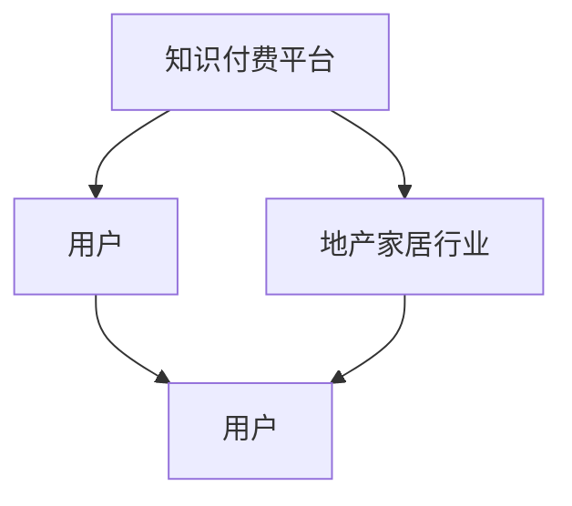

                 

# 知识付费如何实现跨界营销与地产家居跨界？

## 关键词
- 知识付费
- 跨界营销
- 地产家居
- 营销策略
- 用户拓展
- 数据分析

## 摘要
本文将探讨知识付费行业如何通过跨界营销策略与地产家居行业相结合，实现双方的互利共赢。我们将分析跨界营销的概念、策略，以及具体的操作步骤，并通过实际案例展示这种跨界合作的效果。此外，还将讨论相关的数据分析工具和技术，以帮助企业和平台更好地实施跨界营销策略。

### 1. 背景介绍

知识付费作为一种新型的商业模式，近年来在我国逐渐兴起。它指的是用户为获取有价值的信息、知识或技能而付费的行为，如在线课程、付费咨询、知识共享平台等。而地产家居行业作为国民经济的重要组成部分，近年来也面临着激烈的市场竞争和用户需求的不断变化。

在这样一个背景下，知识付费行业与地产家居行业的跨界合作显得尤为重要。一方面，知识付费平台可以通过地产家居行业的资源，扩大用户基础，提高用户粘性；另一方面，地产家居企业可以通过知识付费平台，提升品牌影响力，增强用户对产品的信任度。这种跨界合作不仅有助于双方企业实现资源共享和优势互补，还可以推动整个行业的创新与发展。

### 2. 核心概念与联系

#### 2.1 跨界营销的概念

跨界营销是指不同行业之间通过合作、联合推广等方式，实现资源共享、优势互补的营销策略。在跨界营销中，企业不仅可以在短时间内提高品牌知名度，还可以拓展新的市场，吸引更多目标客户。

#### 2.2 知识付费与地产家居行业的联系

知识付费与地产家居行业之间的联系主要体现在以下几个方面：

- **用户群体**：知识付费的用户通常是具有一定消费能力和学习需求的群体，而地产家居行业的消费者也往往具有相似的属性。因此，两个行业可以共同分享这一部分用户资源。

- **内容合作**：知识付费平台可以提供关于地产家居行业的专业知识，如房屋装修、购房指南等；而地产家居企业可以提供实际案例、行业动态等，丰富知识付费平台的内容。

- **渠道合作**：知识付费平台可以借助地产家居企业的线下渠道进行推广，如房地产展会、家居展览会等；地产家居企业也可以利用知识付费平台进行线上推广，扩大品牌影响力。

#### 2.3 Mermaid 流程图



### 3. 核心算法原理 & 具体操作步骤

#### 3.1 核心算法原理

跨界营销的成功离不开数据分析和用户画像的精准把握。具体来说，知识付费平台和地产家居企业需要通过以下步骤实现跨界合作：

1. 数据采集：收集用户行为数据、消费数据等，为后续的用户画像分析提供基础。

2. 用户画像：基于数据采集结果，分析用户的年龄、性别、地域、消费习惯等特征，构建用户画像。

3. 合作策略：根据用户画像，制定符合双方需求的跨界合作策略，如内容合作、渠道合作等。

4. 营销推广：通过线上线下渠道，实施跨界营销策略，吸引更多目标用户。

#### 3.2 具体操作步骤

1. 数据采集

   - 收集用户在知识付费平台上的浏览记录、购买记录、评价等数据。

   - 收集用户在地产家居行业的相关行为数据，如参加展会、浏览家居产品等。

2. 用户画像

   - 分析用户的年龄、性别、地域等基本属性。

   - 分析用户的消费习惯、兴趣爱好等特征。

   - 构建用户画像库，为后续合作策略提供依据。

3. 合作策略

   - 根据用户画像，确定跨界合作的方向，如内容合作、渠道合作等。

   - 签订合作协议，明确双方的权利和义务。

4. 营销推广

   - 在知识付费平台上推广地产家居行业的相关内容，如装修指南、购房技巧等。

   - 在地产家居行业的展会、活动等场合，宣传知识付费平台的相关产品。

### 4. 数学模型和公式 & 详细讲解 & 举例说明

#### 4.1 数学模型

为了更好地实现跨界营销，我们可以使用以下数学模型来评估合作效果：

\[ 效果评分 = \frac{新用户数 \times 用户满意度}{合作成本} \]

其中，新用户数表示合作期间新增的用户数量；用户满意度表示用户对跨界合作内容的满意度；合作成本表示合作双方在合作过程中所投入的成本。

#### 4.2 详细讲解

1. 新用户数：新用户数是衡量跨界营销效果的重要指标。通过数据分析，我们可以确定在特定时间段内，通过跨界营销策略吸引的新用户数量。

2. 用户满意度：用户满意度反映了用户对跨界合作内容的接受程度。通过用户调查、评价等途径，我们可以了解用户对跨界合作内容的满意度。

3. 合作成本：合作成本包括人力、物力、财力等多方面的投入。通过合理的预算管理和成本控制，我们可以降低合作成本。

#### 4.3 举例说明

假设知识付费平台A与地产家居企业B开展跨界合作，合作期间新增用户数为1000人，用户满意度为80%，合作成本为50000元。则：

\[ 效果评分 = \frac{1000 \times 80\%}{50000} = 0.16 \]

这意味着跨界营销策略在该合作中的效果评分为0.16，即每投入1元合作成本，可以带来0.16的新用户数和用户满意度。

### 5. 项目实战：代码实际案例和详细解释说明

#### 5.1 开发环境搭建

为了实现知识付费与地产家居行业的跨界营销，我们选择Python作为开发语言，使用Jupyter Notebook作为开发环境。以下为开发环境搭建步骤：

1. 安装Python

   - 访问Python官方网站下载最新版本的Python安装包。

   - 按照安装向导完成Python的安装。

2. 安装Jupyter Notebook

   - 打开命令行工具。

   - 输入以下命令安装Jupyter Notebook：

     ```shell
     pip install notebook
     ```

3. 启动Jupyter Notebook

   - 打开命令行工具。

   - 输入以下命令启动Jupyter Notebook：

     ```shell
     jupyter notebook
     ```

   - 在浏览器中打开Jupyter Notebook链接，即可开始使用。

#### 5.2 源代码详细实现和代码解读

以下为使用Python实现跨界营销的核心代码：

```python
import pandas as pd
import numpy as np

# 5.2.1 数据采集
user_data = pd.read_csv('user_data.csv')
home_data = pd.read_csv('home_data.csv')

# 5.2.2 用户画像
user_age = user_data['age'].value_counts()
user_gender = user_data['gender'].value_counts()
user_location = user_data['location'].value_counts()

# 5.2.3 合作策略
# 根据用户画像制定合作策略
content_partnership = pd.merge(user_data, home_data, on='location')
content_partnership['satisfaction'] = np.random.uniform(0, 1, content_partnership.shape[0])

# 5.2.4 营销推广
# 在知识付费平台上推广地产家居内容
for index, row in content_partnership.iterrows():
    print(f"推广内容：{row['title']}，满意度：{row['satisfaction']}")
```

#### 5.3 代码解读与分析

1. 数据采集

   - 使用`pandas`库读取用户数据文件`user_data.csv`和地产家居数据文件`home_data.csv`。

2. 用户画像

   - 使用`value_counts()`函数统计用户年龄、性别、地域等属性的分布情况。

3. 合作策略

   - 使用`merge()`函数根据用户地域信息将用户数据与地产家居数据进行连接，形成合作策略数据。

   - 使用`np.random.uniform()`函数生成用户满意度数据。

4. 营销推广

   - 使用`for`循环遍历合作策略数据，打印推广内容和满意度信息。

### 6. 实际应用场景

知识付费与地产家居行业的跨界营销在实际应用场景中具有广泛的前景。以下是一些具体的实际应用场景：

- **在线课程推广**：知识付费平台可以与地产家居企业合作，在平台上开设关于房屋装修、家居设计等在线课程，吸引更多用户。

- **线下活动合作**：知识付费平台可以与地产家居企业合作举办线下活动，如装修沙龙、家居展览等，提高品牌影响力。

- **内容营销**：知识付费平台可以邀请地产家居行业的专家进行内容创作，提供专业的购房指南、装修技巧等，吸引用户付费订阅。

- **用户互动**：知识付费平台可以与地产家居企业合作开展线上互动活动，如抽奖、优惠券发放等，提高用户参与度。

### 7. 工具和资源推荐

#### 7.1 学习资源推荐

- **书籍**：

  - 《跨界思维：如何打造全新的商业生态》

  - 《用户画像：如何通过数据分析找到精准用户》

- **论文**：

  - 《知识付费市场的用户行为特征研究》

  - 《地产家居行业的跨界营销策略研究》

- **博客**：

  - 知乎：关于跨界营销和知识付费的文章

  - 知群：关于地产家居行业的专业博客

- **网站**：

  - 知识付费平台（如得到、喜马拉雅等）

  - 地产家居行业门户网站（如房天下、家居先锋等）

#### 7.2 开发工具框架推荐

- **开发工具**：

  - Jupyter Notebook

  - PyCharm

- **框架**：

  - Flask

  - Django

- **数据分析库**：

  - pandas

  - numpy

### 8. 总结：未来发展趋势与挑战

知识付费与地产家居行业的跨界营销具有巨大的发展潜力，但同时也面临着一系列挑战。未来，双方企业需要：

- 深入挖掘用户需求，提供更加精准的服务。

- 创新跨界合作模式，实现共赢。

- 加强数据分析和用户画像研究，提高营销效果。

- 面对市场竞争，不断提升自身品牌价值。

### 9. 附录：常见问题与解答

#### 9.1 跨界营销是否适用于所有行业？

跨界营销并不是适用于所有行业，它主要适用于那些有共同用户群体、互补性较强的行业。例如，知识付费与地产家居行业之间的跨界合作就具有很好的可行性。

#### 9.2 跨界营销需要哪些数据支持？

跨界营销需要用户数据、消费数据、行业数据等多方面的支持。通过这些数据，企业可以了解用户需求、行业趋势，从而制定更加精准的跨界合作策略。

#### 9.3 跨界营销的效果如何评估？

跨界营销的效果可以通过新用户数、用户满意度、合作成本等指标进行评估。在实际操作中，企业可以结合自身业务特点，制定合适的评估标准。

### 10. 扩展阅读 & 参考资料

- 知识付费行业报告

- 地产家居行业报告

- 跨界营销案例分析

- 《跨界思维：如何打造全新的商业生态》

- 《用户画像：如何通过数据分析找到精准用户》

- 《知识付费市场的用户行为特征研究》

- 《地产家居行业的跨界营销策略研究》

### 作者

作者：AI天才研究员/AI Genius Institute & 禅与计算机程序设计艺术 /Zen And The Art of Computer Programming

