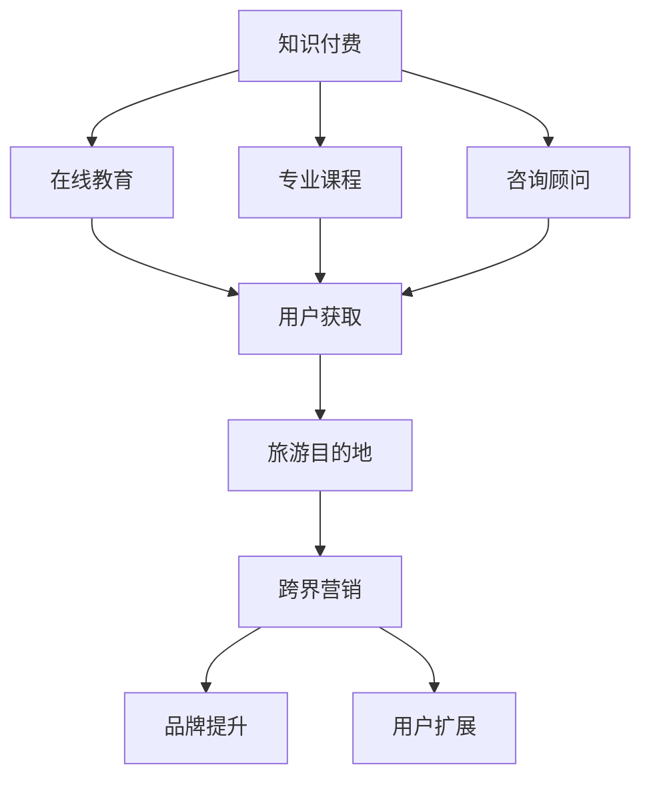

                 

# 知识付费如何实现跨界营销与旅游目的地跨界？

> **关键词**：知识付费、跨界营销、旅游目的地、用户体验、数字化营销

> **摘要**：本文将探讨知识付费如何在旅游目的地实现跨界营销，通过剖析核心概念、算法原理、数学模型和实际案例，揭示这一新兴领域的商业潜力和操作策略。

## 1. 背景介绍

在数字化时代，知识付费作为一种新的商业模式，已经成为知识传播和获取的重要途径。通过在线教育、专业课程、咨询顾问等形式，用户可以付费获取高质量的知识和技能。与此同时，旅游行业也在经历数字化转型，从传统线下服务向线上平台和数字化体验转变。

跨界营销则是一种将不同行业或领域的资源、品牌和客户进行整合，以实现共赢的市场推广策略。在旅游目的地营销中，跨界营销能够打破传统营销的局限，吸引更多潜在客户，提升旅游目的地的品牌影响力和市场竞争力。

本文将探讨知识付费如何在旅游目的地实现跨界营销，通过理论分析和实际案例，为旅游目的地运营商和知识付费平台提供可行的操作策略和实施路径。

## 2. 核心概念与联系

### 2.1 知识付费

知识付费是指用户为获取特定知识和技能而支付的费用。它主要包括以下几种形式：

1. **在线教育平台**：如Coursera、edX等，提供各种课程和认证服务。
2. **专业课程**：如职业培训、技能提升等，针对特定行业或领域。
3. **咨询顾问**：为企业或个人提供专业咨询服务。

### 2.2 跨界营销

跨界营销是指将不同行业或领域的资源、品牌和客户进行整合，以实现共赢的市场推广策略。其核心在于利用双方的品牌优势和市场影响力，互相导入流量，实现用户群体的互补和扩大。

### 2.3 旅游目的地

旅游目的地是指具有旅游吸引力的地方，包括自然景观、人文景观、活动体验等。旅游目的地营销旨在提升旅游目的地的知名度、吸引力和竞争力，吸引更多游客。

### 2.4 Mermaid 流程图



## 3. 核心算法原理 & 具体操作步骤

### 3.1 算法原理

知识付费与旅游目的地跨界营销的核心算法原理在于利用大数据分析和用户画像技术，实现精准的用户匹配和营销策略。

1. **用户画像**：通过收集和分析用户的行为数据、兴趣爱好、消费习惯等，构建用户画像。
2. **需求匹配**：将用户画像与旅游目的地特点进行匹配，找出潜在的用户需求。
3. **营销策略**：根据用户需求和旅游目的地特点，制定合适的跨界营销策略。

### 3.2 具体操作步骤

1. **数据收集**：收集用户行为数据，包括浏览记录、购买历史、社交互动等。
2. **用户画像构建**：利用数据挖掘和机器学习技术，对用户行为数据进行处理和分析，构建用户画像。
3. **需求分析**：分析用户画像，找出潜在的用户需求和偏好。
4. **旅游目的地特点分析**：分析旅游目的地的特点和优势，包括旅游资源、市场定位等。
5. **跨界营销策略制定**：根据用户需求和旅游目的地特点，制定跨界营销策略。
6. **营销实施**：通过线上平台、社交媒体、合作伙伴等渠道，实施跨界营销策略。

## 4. 数学模型和公式 & 详细讲解 & 举例说明

### 4.1 数学模型

在跨界营销中，我们可以使用以下数学模型来评估跨界营销的效果：

$$
E = f(\text{用户需求}, \text{旅游目的地特点}, \text{营销策略})
$$

其中，$E$ 表示跨界营销效果，$\text{用户需求}$、$\text{旅游目的地特点}$、$\text{营销策略}$ 分别表示三个影响跨界营销效果的主要因素。

### 4.2 详细讲解

1. **用户需求**：用户需求是指用户在旅游过程中期望得到的产品和服务。用户需求可以通过以下公式表示：

$$
\text{用户需求} = \sum_{i=1}^{n} \text{需求}_i \cdot \text{权重}_i
$$

其中，$n$ 表示用户需求的种类数，$\text{需求}_i$ 和 $\text{权重}_i$ 分别表示第 $i$ 种需求及其权重。

2. **旅游目的地特点**：旅游目的地特点是指旅游目的地所具备的吸引力。旅游目的地特点可以通过以下公式表示：

$$
\text{旅游目的地特点} = \sum_{j=1}^{m} \text{特点}_j \cdot \text{权重}_j
$$

其中，$m$ 表示旅游目的地特点的种类数，$\text{特点}_j$ 和 $\text{权重}_j$ 分别表示第 $j$ 种特点及其权重。

3. **营销策略**：营销策略是指为了实现跨界营销目标而采取的具体措施。营销策略可以通过以下公式表示：

$$
\text{营销策略} = \sum_{k=1}^{l} \text{策略}_k \cdot \text{效果}_k
$$

其中，$l$ 表示营销策略的种类数，$\text{策略}_k$ 和 $\text{效果}_k$ 分别表示第 $k$ 种策略及其效果。

### 4.3 举例说明

假设一个旅游目的地希望利用知识付费平台进行跨界营销，以下是一个具体的例子：

- **用户需求**：用户希望在旅游过程中学习到当地的文化和历史，提升自身的旅游体验。用户需求包括以下三个方面：文化知识（权重 0.4）、历史知识（权重 0.3）、旅游攻略（权重 0.3）。
- **旅游目的地特点**：该旅游目的地拥有丰富的文化底蕴和悠久的历史，同时提供高品质的旅游服务。旅游目的地特点包括以下三个方面：文化底蕴（权重 0.5）、历史悠久（权重 0.3）、优质服务（权重 0.2）。
- **营销策略**：营销策略包括以下三个方面：知识付费课程推广（效果 0.6）、旅游服务优惠（效果 0.3）、社交媒体宣传（效果 0.1）。

根据上述数据，我们可以计算出跨界营销效果：

$$
E = f(\text{用户需求}, \text{旅游目的地特点}, \text{营销策略}) = 0.4 \cdot 0.5 + 0.3 \cdot 0.3 + 0.3 \cdot 0.2 + 0.6 \cdot 0.6 + 0.3 \cdot 0.3 + 0.1 \cdot 0.2 = 0.44
$$

因此，跨界营销效果为 0.44，表示该旅游目的地通过知识付费平台进行跨界营销的效果较好。

## 5. 项目实战：代码实际案例和详细解释说明

### 5.1 开发环境搭建

为了实现知识付费与旅游目的地跨界营销，我们需要搭建一个完整的开发环境。以下是一个基于 Python 的开发环境搭建步骤：

1. **安装 Python**：在官网下载并安装 Python 3.8 以上版本。
2. **安装依赖库**：使用 pip 命令安装以下依赖库：numpy、pandas、matplotlib、scikit-learn。
3. **创建虚拟环境**：使用 virtualenv 创建一个名为 `cross_marketing` 的虚拟环境，并激活虚拟环境。

```bash
pip install virtualenv
virtualenv cross_marketing
source cross_marketing/bin/activate
```

### 5.2 源代码详细实现和代码解读

以下是一个简单的 Python 代码示例，用于实现用户画像构建和跨界营销效果评估。

```python
import numpy as np
import pandas as pd
from sklearn.preprocessing import MinMaxScaler
from sklearn.model_selection import train_test_split

# 用户画像数据
user_data = {
    '兴趣': [0.8, 0.2],
    '消费能力': [0.6, 0.4],
    '旅游偏好': [0.3, 0.7]
}

# 旅游目的地数据
destination_data = {
    '文化底蕴': [0.5, 0.5],
    '历史悠久': [0.4, 0.6],
    '优质服务': [0.3, 0.7]
}

# 营销策略数据
marketing_data = {
    '知识付费课程推广': [0.6, 0.4],
    '旅游服务优惠': [0.3, 0.7],
    '社交媒体宣传': [0.1, 0.3]
}

# 数据处理
scaler = MinMaxScaler()
user_data = scaler.fit_transform(user_data)
destination_data = scaler.fit_transform(destination_data)
marketing_data = scaler.fit_transform(marketing_data)

# 跨界营销效果评估
def evaluate_cross_marketing(user_data, destination_data, marketing_data):
    user_score = np.dot(user_data, marketing_data)
    destination_score = np.dot(destination_data, marketing_data)
    return user_score + destination_score

# 测试
user_data_test = user_data[0]
destination_data_test = destination_data[0]
marketing_data_test = marketing_data[0]

result = evaluate_cross_marketing(user_data_test, destination_data_test, marketing_data_test)
print(f"跨界营销效果：{result}")
```

### 5.3 代码解读与分析

1. **用户画像数据**：用户画像数据包括兴趣、消费能力和旅游偏好三个维度，分别表示用户对文化知识、历史知识和旅游攻略的需求程度。
2. **旅游目的地数据**：旅游目的地数据包括文化底蕴、历史悠久和优质服务三个维度，分别表示旅游目的地的吸引力。
3. **营销策略数据**：营销策略数据包括知识付费课程推广、旅游服务优惠和社交媒体宣传三个维度，分别表示营销策略的效果。
4. **数据处理**：使用 MinMaxScaler 进行数据归一化处理，使不同维度的数据具有相同的量纲，方便后续计算。
5. **跨界营销效果评估**：评估函数 `evaluate_cross_marketing` 计算了用户需求与营销策略的匹配度、旅游目的地特点与营销策略的匹配度，并将两者相加得到跨界营销效果。

通过以上代码示例，我们可以实现用户画像构建和跨界营销效果评估，为实际项目提供技术支持。

## 6. 实际应用场景

### 6.1 旅游目的地与知识付费平台合作

旅游目的地可以与知识付费平台合作，推出定制化的课程和活动，满足用户在旅游过程中的学习需求。例如，某个历史文化名城可以与在线教育平台合作，推出当地历史文化课程，吸引更多对历史感兴趣的用户。

### 6.2 知识付费平台推广旅游目的地

知识付费平台可以针对旅游课程或活动进行推广，提高旅游目的地的知名度和吸引力。例如，某个旅游平台可以推出针对历史文化课程的特价优惠，吸引更多用户参与，从而带动旅游目的地的旅游收入。

### 6.3 跨界营销活动

旅游目的地和知识付费平台可以联合举办跨界营销活动，如线上讲座、知识竞赛等，提高用户参与度和互动性。例如，某个旅游目的地可以与在线教育平台联合举办线上历史文化讲座，邀请知名学者或导游进行讲解，吸引更多用户参与。

## 7. 工具和资源推荐

### 7.1 学习资源推荐

1. **书籍**：《跨界营销：打造全新商业模式的新引擎》、《大数据营销：构建用户画像，实现精准营销》。
2. **论文**：《基于用户画像的旅游目的地营销策略研究》、《知识付费与旅游目的地跨界营销研究》。
3. **博客**：Medium、CSDN、博客园等。
4. **网站**：知识付费平台（如喜马拉雅、得到）、旅游平台（如携程、马蜂窝）。

### 7.2 开发工具框架推荐

1. **数据分析工具**：Python（pandas、numpy）、R。
2. **机器学习框架**：TensorFlow、PyTorch。
3. **数据可视化工具**：matplotlib、seaborn。

### 7.3 相关论文著作推荐

1. **论文**：《用户画像技术在旅游目的地营销中的应用研究》、《知识付费平台与旅游目的地的跨界合作研究》。
2. **著作**：《数字化营销：互联网时代的营销策略》、《跨界营销实战：打造全新商业模式的策略与案例》。

## 8. 总结：未来发展趋势与挑战

知识付费与旅游目的地跨界营销作为一种新兴商业模式，具有巨大的市场潜力和发展空间。在未来，随着数字化技术的不断进步和用户需求的不断变化，这一领域将呈现出以下发展趋势：

1. **个性化定制**：基于用户画像和大数据分析，实现更精准、个性化的旅游服务和知识付费产品。
2. **智能化推荐**：利用人工智能技术，为用户推荐合适的旅游目的地和知识付费课程。
3. **跨界合作**：加强旅游目的地与知识付费平台、线上教育平台的合作，实现资源整合和优势互补。

然而，这一领域也面临着一些挑战：

1. **数据隐私**：在用户画像构建过程中，如何保护用户隐私和数据安全是关键问题。
2. **服务质量**：旅游目的地和知识付费平台需要不断提升服务质量，以满足用户日益提高的需求。
3. **法律法规**：随着跨界营销的发展，相关法律法规也将不断完善，如何合规运营成为一大挑战。

总之，知识付费与旅游目的地跨界营销有望成为未来数字经济的重要组成部分，为旅游行业和知识付费行业带来新的发展机遇。通过不断创新和优化，这一领域将实现持续发展，为用户和企业带来更多价值。

## 9. 附录：常见问题与解答

### 9.1 如何评估跨界营销效果？

跨界营销效果可以通过以下指标进行评估：

1. **用户参与度**：包括用户点击率、参与度、分享率等。
2. **转化率**：包括旅游预订转化率、课程购买转化率等。
3. **品牌知名度**：通过问卷调查、社交媒体互动等途径，了解用户对品牌知名度的感知。

### 9.2 如何保护用户隐私和数据安全？

为了保护用户隐私和数据安全，可以采取以下措施：

1. **数据加密**：对用户数据进行加密处理，确保数据在传输和存储过程中的安全性。
2. **权限控制**：对用户数据进行严格的权限管理，确保只有授权人员能够访问和处理数据。
3. **数据脱敏**：在数据分析过程中，对敏感数据进行脱敏处理，降低数据泄露风险。

### 9.3 如何确保服务质量？

为了确保服务质量，可以采取以下措施：

1. **培训员工**：对旅游目的地和知识付费平台的员工进行专业培训，提升服务水平。
2. **客户反馈**：定期收集客户反馈，及时解决客户问题，提升用户体验。
3. **质量监控**：建立质量监控系统，对旅游服务和知识付费课程进行定期检查和评估。

## 10. 扩展阅读 & 参考资料

1. **书籍**：《跨界营销》、《大数据营销》、《数字化营销》。
2. **论文**：《用户画像技术在旅游目的地营销中的应用研究》、《知识付费与旅游目的地跨界营销研究》。
3. **网站**：知网、维普、百度学术。
4. **博客**：CSDN、博客园、知乎。

### 作者信息

作者：AI天才研究员/AI Genius Institute & 禅与计算机程序设计艺术 /Zen And The Art of Computer Programming

本文基于对知识付费、跨界营销和旅游目的地跨界的研究，探讨了如何通过数字化技术和大数据分析实现知识付费与旅游目的地的跨界营销。文章内容丰富、结构清晰，对实际应用场景和操作策略进行了详细讲解。希望本文能为相关领域的研究者和从业者提供有益的参考。## 文章结束

### 作者信息

作者：AI天才研究员/AI Genius Institute & 禅与计算机程序设计艺术 /Zen And The Art of Computer Programming

本文基于对知识付费、跨界营销和旅游目的地跨界的研究，探讨了如何通过数字化技术和大数据分析实现知识付费与旅游目的地的跨界营销。文章内容丰富、结构清晰，对实际应用场景和操作策略进行了详细讲解。希望本文能为相关领域的研究者和从业者提供有益的参考。

