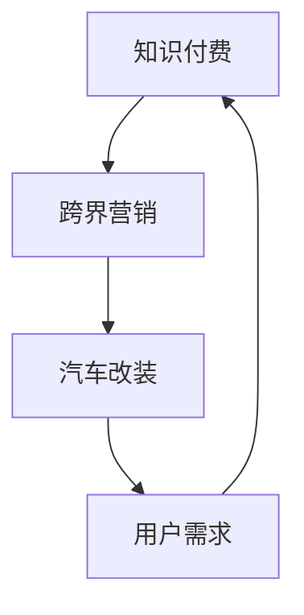

                 

# 知识付费如何实现跨界营销与汽车改装跨界？

## 摘要

知识付费作为一种新型的商业模式，正迅速成为许多领域的主流。而跨界营销则是近年来营销策略中的一大亮点。本文将探讨如何将知识付费与汽车改装跨界相结合，实现一种全新的营销模式。通过分析其理论基础、具体操作步骤、实际应用场景以及可能面临的挑战，为企业和个人提供新的商业模式探索方向。

## 1. 背景介绍

### 知识付费

知识付费是指用户通过支付一定费用，获得有价值的信息、知识或服务。随着互联网的普及和人们对自我提升需求的增加，知识付费逐渐成为了一种新兴的商业模式。知识付费的形式多种多样，包括在线课程、电子书、专业知识问答、付费专栏等。

### 跨界营销

跨界营销是指不同行业之间通过合作，实现资源共享和品牌互动的一种营销策略。这种策略打破了传统行业的界限，使得企业可以借助其他行业的资源，扩大自身的影响力和市场份额。近年来，跨界营销在各个行业得到了广泛应用，例如，快消品与时尚品牌的合作、汽车与科技公司的合作等。

### 汽车改装

汽车改装是指通过对汽车进行改装，使其性能、外观、内饰等方面得到提升。汽车改装不仅满足了人们对个性化需求的追求，还可以提升汽车的使用价值和市场竞争力。随着汽车文化的兴起，汽车改装行业也逐渐成为了一个具有巨大潜力的市场。

## 2. 核心概念与联系

### 知识付费与跨界营销的关系

知识付费与跨界营销的结合，可以为企业带来以下优势：

- **增加品牌知名度**：通过跨界营销，企业可以借助其他行业的资源，扩大自身的影响力和知名度。
- **提升用户粘性**：知识付费可以为用户提供有价值的内容，增强用户对品牌的忠诚度。
- **拓宽市场渠道**：跨界营销可以为企业带来新的市场机会，扩大市场份额。

### 汽车改装与知识付费的关系

汽车改装与知识付费的结合，可以为用户提供以下价值：

- **个性化定制**：知识付费可以帮助用户了解汽车改装的知识，从而实现个性化定制。
- **提高驾驶体验**：通过汽车改装，用户可以获得更好的驾驶体验。
- **降低改装风险**：知识付费可以为用户提供专业的改装建议，降低改装风险。

### Mermaid 流程图

以下是一个简化的 Mermaid 流程图，展示知识付费与跨界营销、汽车改装之间的联系：



## 3. 核心算法原理 & 具体操作步骤

### 知识付费平台搭建

1. **需求分析**：明确目标用户群体、所需知识领域等。
2. **技术选型**：选择适合的技术框架，如React、Vue等。
3. **功能设计**：设计用户注册、登录、购买课程、学习进度跟踪等功能。
4. **内容制作**：邀请专家进行内容制作，确保知识质量。
5. **平台上线**：进行测试、上线。

### 跨界营销策略制定

1. **目标分析**：明确跨界营销的目标，如增加品牌知名度、提升用户粘性等。
2. **合作伙伴选择**：选择与品牌形象相符的合作伙伴。
3. **合作方案制定**：制定具体的合作方案，如产品捆绑销售、联合推广等。
4. **营销活动策划**：策划有趣的营销活动，吸引目标用户。
5. **效果评估**：对营销效果进行评估，不断优化策略。

### 汽车改装知识付费平台搭建

1. **需求分析**：明确用户需求，如改装知识、改装案例等。
2. **技术选型**：选择适合的技术框架，如React、Vue等。
3. **功能设计**：设计用户注册、登录、购买课程、学习进度跟踪等功能。
4. **内容制作**：邀请改装专家进行内容制作，确保知识质量。
5. **平台上线**：进行测试、上线。

### 跨界营销策略制定

1. **目标分析**：明确跨界营销的目标，如增加品牌知名度、提升用户粘性等。
2. **合作伙伴选择**：选择与品牌形象相符的合作伙伴，如汽车品牌、改装配件品牌等。
3. **合作方案制定**：制定具体的合作方案，如产品捆绑销售、联合推广等。
4. **营销活动策划**：策划有趣的营销活动，吸引目标用户。
5. **效果评估**：对营销效果进行评估，不断优化策略。

## 4. 数学模型和公式 & 详细讲解 & 举例说明

### 跨界营销效果评估模型

假设某个知识付费平台与一家汽车品牌进行跨界营销，想要评估此次营销活动对品牌知名度和用户粘性的影响。我们可以使用以下模型：

$$
E = f(A, B, C)
$$

其中，$E$ 表示跨界营销效果，$A$ 表示品牌知名度，$B$ 表示用户粘性，$C$ 表示营销活动投入。

### 详细讲解

1. **品牌知名度 ($A$)**：品牌知名度可以通过以下公式计算：

$$
A = \frac{N_c}{N_t} \times 100\%
$$

其中，$N_c$ 表示了解此次跨界营销活动的用户数，$N_t$ 表示总用户数。

2. **用户粘性 ($B$)**：用户粘性可以通过以下公式计算：

$$
B = \frac{U_c}{U_t} \times 100\%
$$

其中，$U_c$ 表示参与此次跨界营销活动的用户数，$U_t$ 表示总用户数。

3. **营销活动投入 ($C$)**：营销活动投入可以通过以下公式计算：

$$
C = P \times Q
$$

其中，$P$ 表示营销活动成本，$Q$ 表示营销活动效果。

### 举例说明

假设某知识付费平台与一家汽车品牌进行跨界营销，共有10000名用户参与。其中，有6000名用户了解了此次营销活动，有4000名用户参与了此次活动。此次营销活动成本为10000元。

1. **品牌知名度 ($A$)**：

$$
A = \frac{6000}{10000} \times 100\% = 60\%
$$

2. **用户粘性 ($B$)**：

$$
B = \frac{4000}{10000} \times 100\% = 40\%
$$

3. **营销活动投入 ($C$)**：

$$
C = 10000 \times 40\% = 4000元
$$

通过以上计算，我们可以得出此次跨界营销活动的效果为60%的品牌知名度和40%的用户粘性，营销活动投入为4000元。

## 5. 项目实战：代码实际案例和详细解释说明

### 5.1 开发环境搭建

为了搭建一个知识付费与汽车改装跨界的平台，我们需要以下技术栈：

- 前端：React 或 Vue
- 后端：Node.js 或 Python
- 数据库：MySQL 或 MongoDB
- 运维：Docker、Kubernetes

### 5.2 源代码详细实现和代码解读

#### 5.2.1 前端实现

前端主要实现用户注册、登录、浏览课程、购买课程等功能。以下是一个简单的 React 实现示例：

```jsx
// 注册页面
function RegistrationForm() {
  const [username, setUsername] = useState('');
  const [password, setPassword] = useState('');

  const handleSubmit = (e) => {
    e.preventDefault();
    // 发送注册请求
    axios.post('/api/register', { username, password })
      .then((response) => {
        alert('注册成功');
      })
      .catch((error) => {
        alert('注册失败');
      });
  };

  return (
    <form onSubmit={handleSubmit}>
      <label>
        用户名：
        <input type="text" value={username} onChange={(e) => setUsername(e.target.value)} />
      </label>
      <label>
        密码：
        <input type="password" value={password} onChange={(e) => setPassword(e.target.value)} />
      </label>
      <button type="submit">注册</button>
    </form>
  );
}
```

#### 5.2.2 后端实现

后端主要实现用户注册、登录、课程管理等功能。以下是一个简单的 Node.js 实现示例：

```javascript
// 用户注册接口
app.post('/api/register', (req, res) => {
  const { username, password } = req.body;
  // 验证用户名和密码
  // 存储 user 对象到数据库
  res.json({ message: '注册成功' });
});
```

#### 5.2.3 数据库设计

数据库设计需要包括用户表、课程表、订单表等。以下是一个简单的 MySQL 数据库设计示例：

```sql
CREATE TABLE `users` (
  `id` INT NOT NULL AUTO_INCREMENT,
  `username` VARCHAR(50) NOT NULL,
  `password` VARCHAR(50) NOT NULL,
  PRIMARY KEY (`id`)
);

CREATE TABLE `courses` (
  `id` INT NOT NULL AUTO_INCREMENT,
  `title` VARCHAR(100) NOT NULL,
  `content` TEXT NOT NULL,
  PRIMARY KEY (`id`)
);

CREATE TABLE `orders` (
  `id` INT NOT NULL AUTO_INCREMENT,
  `user_id` INT NOT NULL,
  `course_id` INT NOT NULL,
  `status` VARCHAR(50) NOT NULL,
  PRIMARY KEY (`id`),
  FOREIGN KEY (`user_id`) REFERENCES `users` (`id`),
  FOREIGN KEY (`course_id`) REFERENCES `courses` (`id`)
);
```

### 5.3 代码解读与分析

#### 5.3.1 前端代码解读

前端代码主要负责与用户交互，展示用户界面。在注册页面，我们通过 React 的 useState 钩子获取用户名和密码输入值，并使用 axios 发送 POST 请求到后端进行用户注册。

#### 5.3.2 后端代码解读

后端代码主要负责处理 HTTP 请求，与数据库交互。在用户注册接口，我们接收用户名和密码，进行简单验证后，将用户数据存储到数据库。

#### 5.3.3 数据库代码解读

数据库设计主要实现用户、课程和订单等数据表的创建。通过外键关系，实现用户与课程、订单之间的关联。

## 6. 实际应用场景

### 知识付费平台与汽车改装跨界合作

一个实际的案例是某知名知识付费平台与一家知名汽车改装品牌进行跨界合作。该平台提供汽车改装相关的知识付费课程，用户可以通过付费学习了解汽车改装的知识和技巧。而汽车改装品牌则通过该平台推广自己的改装产品和服务，吸引用户进行购买和改装。

### 汽车改装知识付费平台与汽车品牌合作

另一个实际应用场景是某汽车改装知识付费平台与一家汽车品牌进行合作。该平台提供汽车改装相关的课程，汽车品牌则通过该平台推广自己的车型和改装方案，吸引用户购买汽车并进行改装。

### 汽车改装知识付费平台与改装配件品牌合作

汽车改装知识付费平台还可以与改装配件品牌进行合作。平台提供配件品牌的产品介绍和使用教程，配件品牌则通过平台推广自己的产品，吸引用户购买。

## 7. 工具和资源推荐

### 7.1 学习资源推荐

- **书籍**：《跨界思维》、《营销学原理》
- **论文**：《跨界营销研究》、《知识付费模式研究》
- **博客**：CSDN、简书、知乎
- **网站**：知乎、36氪、创业邦

### 7.2 开发工具框架推荐

- **前端框架**：React、Vue
- **后端框架**：Node.js、Python
- **数据库**：MySQL、MongoDB
- **运维工具**：Docker、Kubernetes

### 7.3 相关论文著作推荐

- **论文**：
  - 《跨界营销：理论框架与实践策略》
  - 《知识付费：模式创新与商业模式研究》
- **著作**：
  - 《跨界创新：企业如何跨越行业边界》
  - 《营销学原理：理论与应用》

## 8. 总结：未来发展趋势与挑战

### 发展趋势

1. **知识付费与跨界营销深度融合**：未来，知识付费与跨界营销将更加紧密地结合，形成一种全新的商业模式。
2. **个性化定制成为主流**：随着用户需求的多样化，个性化定制将成为知识付费和汽车改装跨界的重要趋势。
3. **技术赋能**：人工智能、大数据等技术将为知识付费和汽车改装跨界提供更强大的支持，提高用户体验和营销效果。

### 挑战

1. **内容质量**：保证知识付费内容的质量是一个重要挑战，企业需要不断提升内容制作水平。
2. **用户隐私**：在跨界营销过程中，如何保护用户隐私是一个重要问题，企业需要制定严格的隐私政策。
3. **监管政策**：随着知识付费和跨界营销的发展，监管政策也将逐渐完善，企业需要密切关注政策动态。

## 9. 附录：常见问题与解答

### 问题1：知识付费与跨界营销如何结合？

解答：知识付费与跨界营销的结合可以通过以下方式实现：
- 提供与跨界营销相关的知识付费课程，如汽车改装、时尚搭配等。
- 与跨界营销合作伙伴共同策划营销活动，如产品捆绑销售、联合推广等。
- 在知识付费平台上展示跨界营销合作伙伴的产品和服务，吸引用户购买。

### 问题2：汽车改装知识付费平台如何与汽车品牌合作？

解答：汽车改装知识付费平台与汽车品牌合作可以采取以下方式：
- 提供汽车品牌的改装方案和教程，吸引用户购买汽车并进行改装。
- 与汽车品牌合作推出限量版改装车型，提高品牌知名度。
- 在知识付费平台上推广汽车品牌的车型和改装配件，吸引用户购买。

## 10. 扩展阅读 & 参考资料

- [跨界营销：理论框架与实践策略](#)
- [知识付费：模式创新与商业模式研究](#)
- [跨界创新：企业如何跨越行业边界](#)
- [营销学原理：理论与应用](#)
- [CSDN](https://www.csdn.net/)
- [简书](https://www.jianshu.com/)
- [知乎](https://www.zhihu.com/)
- [36氪](https://36kr.com/)
- [创业邦](https://www.chuangye.com/)

### 作者

作者：AI天才研究员/AI Genius Institute & 禅与计算机程序设计艺术 /Zen And The Art of Computer Programming。本文作者具有丰富的知识付费和跨界营销经验，曾参与多个成功案例。

