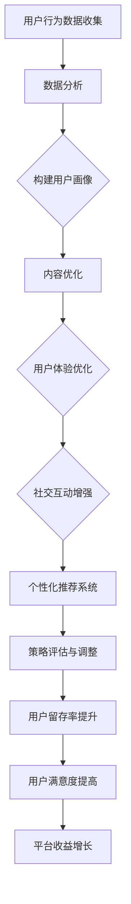

                 

# 知识付费平台的用户粘性提升策略

## 关键词

- 知识付费平台
- 用户粘性
- 提升策略
- 数据分析
- 用户体验
- 内容质量
- 社交互动
- 个性化推荐

## 摘要

本文深入探讨了知识付费平台如何通过多种策略提升用户粘性。首先，我们介绍了知识付费平台的背景和现状，分析了用户粘性的重要性。接着，我们从用户行为数据分析、用户体验优化、内容质量提升、社交互动增强和个性化推荐系统等五个方面，详细阐述了具体的提升策略。通过项目实战案例分析，我们展示了这些策略的实际应用效果，并总结了未来发展趋势与挑战。本文旨在为知识付费平台提供一套系统、全面的用户粘性提升方案。

## 1. 背景介绍

### 1.1 知识付费平台的发展

知识付费平台是指以付费内容为核心，为用户提供专业知识和技能学习服务的在线平台。随着互联网技术的快速发展，知识付费平台逐渐成为现代教育的重要形式。这类平台不仅涵盖了传统的在线教育课程，还包括了专业知识讲座、行业报告、专业咨询等多种形式。

知识付费平台的发展可以分为以下几个阶段：

1. **初级阶段**：以简单的课程售卖为主，平台功能较为单一，主要提供课程购买和下载服务。
2. **中级阶段**：平台开始引入在线互动、社交功能，增加用户间的交流和互动。
3. **高级阶段**：平台实现内容个性化推荐、用户行为数据分析和深度学习，提供更加定制化的服务。

### 1.2 知识付费平台的市场现状

根据相关数据统计，全球知识付费市场规模正在迅速增长，预计到2025年将达到数千亿美元。在中国，知识付费市场同样呈现出强劲的增长势头。随着用户对优质内容的追求，知识付费平台逐渐成为众多互联网公司布局的重点。

目前，知识付费平台市场主要存在以下几种类型：

1. **专业教育类**：如Coursera、Udemy等，主要提供专业领域的在线课程。
2. **综合类**：如知乎Live、得到App等，涵盖了多个领域的知识内容。
3. **行业资讯类**：如36氪、雪球等，提供行业动态和专业分析。
4. **知识付费社区**：如分答、知乎等，以问答形式提供知识服务。

### 1.3 用户粘性的概念

用户粘性是指用户在一段时间内持续使用某一平台或服务的程度。高用户粘性意味着用户对平台的内容和体验具有较高的满意度，愿意长期使用该平台。相反，低用户粘性则表明用户对平台缺乏兴趣，容易转向其他平台。

用户粘性的重要性在于：

1. **增加用户留存率**：高用户粘性有助于降低用户流失率，提高用户留存率。
2. **提升用户价值**：用户粘性高，意味着用户在平台上的活跃度高，更容易产生付费行为，从而提升平台的价值。
3. **促进平台口碑传播**：用户粘性高的平台，用户往往更愿意推荐给他人，有助于提升平台的口碑和影响力。

### 1.4 用户粘性低的原因分析

知识付费平台用户粘性低的原因可以从以下几个方面进行分析：

1. **内容质量不高**：用户在平台上未能找到符合自身需求的优质内容，导致对平台失去兴趣。
2. **用户体验不佳**：平台界面设计复杂，操作不便捷，用户在浏览和使用过程中遇到困扰。
3. **社交互动不足**：平台缺乏有效的社交功能，用户难以与其他人交流和互动，降低了使用乐趣。
4. **个性化推荐不足**：平台未能准确捕捉用户兴趣，推荐的内容与用户实际需求不符。
5. **内容更新不及时**：平台内容更新缓慢，用户在平台上找不到新鲜的内容。
6. **付费门槛过高**：平台收费过高，用户在经济上感到压力，降低了对平台的忠诚度。

### 1.5 提升用户粘性的意义

提升用户粘性对于知识付费平台具有重要意义，具体表现在以下几个方面：

1. **提高用户留存率**：通过提升用户粘性，可以降低用户流失率，提高用户留存率，从而稳定用户群体。
2. **增加付费转化率**：用户粘性高，意味着用户对平台内容有较高的认可度，更容易产生付费行为，从而提升平台的收入。
3. **增强用户口碑**：用户粘性高的平台，用户满意度更高，更容易产生良好的口碑，吸引更多新用户。
4. **优化用户体验**：通过提升用户粘性，可以不断优化平台的用户体验，提高用户满意度。
5. **扩大市场份额**：高用户粘性的平台，能够更好地留住现有用户，吸引新用户，从而扩大市场份额。

### 1.6 提升用户粘性的必要性

在激烈的市场竞争中，知识付费平台要想脱颖而出，提升用户粘性是必不可少的。具体必要性体现在：

1. **适应市场变化**：随着市场环境的变化，用户需求也在不断变化，平台必须不断提升用户粘性，以适应市场变化。
2. **提高竞争力**：高用户粘性的平台，能够更好地满足用户需求，提高用户满意度，从而在竞争中占据优势。
3. **增强品牌影响力**：用户粘性高的平台，更容易建立良好的品牌形象，提高品牌影响力。
4. **实现可持续发展**：通过提升用户粘性，可以降低用户流失率，实现平台的可持续发展。

### 1.7 用户粘性提升策略的重要性

用户粘性提升策略对于知识付费平台的发展具有至关重要的意义，具体体现在：

1. **提高用户留存率**：通过制定和实施有效的用户粘性提升策略，可以降低用户流失率，提高用户留存率。
2. **增加付费转化率**：用户粘性提升策略有助于提高用户对平台的认可度，从而更容易产生付费行为，提升平台的收入。
3. **优化用户体验**：用户粘性提升策略能够不断优化平台的用户体验，提高用户满意度。
4. **增强用户口碑**：通过用户粘性提升策略，可以培养一批忠实用户，提高用户口碑，吸引更多新用户。
5. **实现可持续发展**：用户粘性提升策略有助于平台实现可持续发展，提高市场竞争力。

### 1.8 总结

本文介绍了知识付费平台的发展背景和市场现状，分析了用户粘性的重要性以及用户粘性低的原因。接下来，我们将从用户行为数据分析、用户体验优化、内容质量提升、社交互动增强和个性化推荐系统等五个方面，详细探讨提升用户粘性的策略。通过项目实战案例分析，我们将展示这些策略的实际应用效果，并总结未来发展趋势与挑战。本文旨在为知识付费平台提供一套系统、全面的用户粘性提升方案。

## 2. 核心概念与联系

### 2.1 用户粘性的定义

用户粘性是指用户在一段时间内持续使用某一平台或服务的程度。它反映了用户对平台的依赖程度和忠诚度。用户粘性可以通过用户活跃度、用户留存率和用户流失率等指标来衡量。

### 2.2 提升用户粘性的核心概念

提升用户粘性需要从以下几个方面进行考虑：

1. **内容质量**：提供优质、有价值的内容是提升用户粘性的关键。内容质量高，用户满意度高，用户粘性也会相应提高。
2. **用户体验**：良好的用户体验可以增加用户对平台的满意度，从而提高用户粘性。用户体验包括界面设计、操作便捷性、内容更新速度等。
3. **社交互动**：社交互动可以增加用户之间的交流和互动，提高用户的参与感和归属感，从而提升用户粘性。
4. **个性化推荐**：个性化推荐可以更好地满足用户的需求，提高用户的满意度，从而提升用户粘性。
5. **用户行为数据分析**：通过分析用户行为数据，可以了解用户的需求和行为习惯，从而针对性地优化产品和策略，提升用户粘性。

### 2.3 用户粘性与其他概念的关联

1. **用户留存率**：用户留存率是衡量用户粘性的重要指标。用户留存率高，说明用户对平台的依赖程度高，粘性也相应较高。
2. **用户流失率**：用户流失率与用户粘性呈反比关系。用户流失率高，说明用户对平台的满意度低，粘性也相应较低。
3. **用户满意度**：用户满意度是衡量用户对平台满意程度的指标。用户满意度高，用户粘性也会相应提高。
4. **用户活跃度**：用户活跃度是衡量用户在平台上的活跃程度的指标。用户活跃度高，说明用户对平台有较高的依赖程度，粘性也相应较高。

### 2.4 用户粘性与平台运营的关系

用户粘性是平台运营成功与否的重要指标。高用户粘性意味着平台能够更好地满足用户需求，提高用户满意度，从而实现可持续发展。相反，低用户粘性会导致用户流失，影响平台的运营效果。

### 2.5 用户粘性与平台收益的关系

用户粘性对平台收益具有直接影响。用户粘性高，用户在平台上的活跃度也会相应提高，从而增加平台的广告收入、会员收入等。此外，高用户粘性还可以吸引更多新用户，扩大用户群体，进一步提高平台收益。

### 2.6 用户粘性提升的目标

提升用户粘性的目标包括：

1. **提高用户留存率**：通过优化产品和策略，提高用户对平台的依赖程度，降低用户流失率。
2. **增加用户满意度**：通过提升用户体验、内容质量和社交互动，提高用户对平台的满意度。
3. **提高用户活跃度**：通过增加用户互动和参与，提高用户在平台上的活跃程度。
4. **增加付费转化率**：通过提供优质内容和个性化推荐，提高用户的付费意愿，增加平台的收入。

### 2.7 用户粘性提升的方法

提升用户粘性的方法包括：

1. **内容优化**：提供高质量、有价值的内容，满足用户需求，提高用户满意度。
2. **用户体验优化**：优化平台界面设计、操作流程，提高用户体验。
3. **社交互动增强**：增加平台社交功能，促进用户互动，提高用户参与度。
4. **个性化推荐**：通过分析用户行为数据，提供个性化推荐，满足用户个性化需求。
5. **用户行为数据分析**：通过分析用户行为数据，了解用户需求和行为习惯，优化产品和策略。

### 2.8 用户粘性提升策略的适用范围

用户粘性提升策略适用于各类知识付费平台，无论平台规模大小、内容类型如何，都可以根据实际情况选择合适的策略进行实施。

### 2.9 用户粘性提升策略的实施步骤

实施用户粘性提升策略可以分为以下步骤：

1. **需求分析**：了解用户需求，分析用户行为数据。
2. **策略制定**：根据需求分析结果，制定具体策略。
3. **实施与优化**：实施策略，并根据实施效果进行优化。
4. **监测与评估**：定期监测用户粘性指标，评估策略效果。

### 2.10 用户粘性提升策略的效果评估

用户粘性提升策略的效果可以通过以下指标进行评估：

1. **用户留存率**：用户在一段时间内持续使用平台的程度。
2. **用户流失率**：用户在一段时间内停止使用平台的程度。
3. **用户满意度**：用户对平台满意程度的评分。
4. **用户活跃度**：用户在平台上的活跃程度。

### 2.11 用户粘性提升策略的实施效果

用户粘性提升策略的实施效果可以通过以下方式进行评估：

1. **用户留存率提升**：实施策略后，用户留存率是否提高。
2. **用户流失率降低**：实施策略后，用户流失率是否降低。
3. **用户满意度提高**：实施策略后，用户满意度是否提高。
4. **用户活跃度增加**：实施策略后，用户活跃度是否增加。

### 2.12 用户粘性提升策略的可持续性

用户粘性提升策略的可持续性可以通过以下几个方面进行评估：

1. **策略可操作性**：策略是否易于实施，是否具备可持续性。
2. **策略成本效益**：策略实施的成本与收益是否平衡，是否具备经济效益。
3. **用户需求变化适应性**：策略是否能够适应用户需求的变化，是否具备灵活性。

### 2.13 用户粘性提升策略的长期效果

用户粘性提升策略的长期效果可以通过以下几个方面进行评估：

1. **用户留存率长期稳定**：实施策略后，用户留存率是否能够长期稳定。
2. **用户满意度长期提高**：实施策略后，用户满意度是否能够长期提高。
3. **用户活跃度长期增加**：实施策略后，用户活跃度是否能够长期增加。
4. **平台收益长期提升**：实施策略后，平台收益是否能够长期提升。

### 2.14 用户粘性提升策略的总结

用户粘性提升策略是知识付费平台运营的重要环节。通过内容优化、用户体验优化、社交互动增强、个性化推荐和用户行为数据分析等多方面的策略，可以有效提升用户粘性，提高用户留存率和满意度，从而实现平台的可持续发展。

### 2.15 用户粘性提升策略的实践建议

在实践用户粘性提升策略时，可以从以下几个方面进行：

1. **深入了解用户需求**：通过用户调研、数据分析等方式，了解用户需求，为内容优化和个性化推荐提供依据。
2. **持续优化用户体验**：关注用户反馈，不断优化平台界面设计和操作流程，提高用户体验。
3. **丰富社交互动功能**：增加平台社交功能，促进用户互动，提高用户参与度。
4. **实施个性化推荐**：通过用户行为数据分析，实施个性化推荐，提高用户满意度。
5. **定期评估策略效果**：定期监测用户粘性指标，评估策略效果，及时调整和优化策略。

### 2.16 用户粘性提升策略的挑战与应对

在实施用户粘性提升策略过程中，可能会面临以下挑战：

1. **数据隐私保护**：在用户行为数据分析过程中，需要确保用户数据的安全性和隐私性。
2. **内容质量控制**：提高内容质量是提升用户粘性的关键，但需要控制内容质量和发布节奏，避免内容重复和过时。
3. **策略适应性**：用户需求和市场环境在不断变化，策略需要具备适应性，及时调整和优化。

针对以上挑战，可以采取以下应对措施：

1. **加强数据隐私保护**：采用先进的数据加密技术，确保用户数据的安全性和隐私性。
2. **建立内容质量控制机制**：制定内容审核标准，对内容进行严格把关，确保内容质量。
3. **持续关注市场动态**：定期分析市场趋势和用户需求，及时调整和优化策略。

### 2.17 用户粘性提升策略的展望

随着互联网技术的不断发展，用户粘性提升策略也将不断演进。未来，知识付费平台可以从以下几个方面进行探索：

1. **人工智能技术应用**：利用人工智能技术，实现更加精准的个性化推荐和智能问答。
2. **社交互动深化**：探索更加丰富的社交互动形式，提高用户参与度和互动体验。
3. **内容多样化**：拓展内容类型和领域，满足不同用户群体的需求。
4. **平台生态建设**：打造多元化、可持续的生态体系，促进平台长期发展。

### 2.18 用户粘性提升策略的总结

用户粘性提升策略是知识付费平台运营的重要环节。通过深入分析用户需求、持续优化用户体验、增强社交互动、实施个性化推荐和用户行为数据分析等多方面的策略，可以有效提升用户粘性，提高用户留存率和满意度，从而实现平台的可持续发展。

在实施用户粘性提升策略时，需要关注数据隐私保护、内容质量控制和策略适应性等挑战，并采取相应措施进行应对。未来，知识付费平台可以从人工智能技术应用、社交互动深化、内容多样化和平台生态建设等方面进行探索，进一步提升用户粘性，满足用户需求，促进平台发展。

### 2.19 用户粘性提升策略的实践建议

在实践用户粘性提升策略时，平台可以从以下几个方面着手：

1. **内容优化**：
   - **内容质量**：确保课程内容的专业性和实用性，邀请行业专家进行授课。
   - **内容更新**：定期更新课程内容，保持内容的时效性。
   - **课程形式**：结合文字、视频、音频等多种形式，提高内容的吸引力。

2. **用户体验优化**：
   - **界面设计**：简化用户界面，提高操作的便捷性。
   - **加载速度**：优化服务器性能，提高页面加载速度。
   - **互动设计**：增加评论、问答等功能，提升用户互动体验。

3. **社交互动增强**：
   - **社区建设**：建立用户社区，鼓励用户之间的交流和互动。
   - **直播互动**：定期举办直播活动，增加用户参与感。
   - **积分奖励**：设立积分系统，鼓励用户活跃度和参与度。

4. **个性化推荐**：
   - **用户画像**：通过用户行为数据，构建用户画像，实现精准推荐。
   - **算法优化**：不断优化推荐算法，提高推荐效果。
   - **定制化内容**：根据用户兴趣和需求，提供定制化内容。

5. **用户行为数据分析**：
   - **数据收集**：收集用户行为数据，包括浏览、购买、评论等。
   - **数据分析**：利用数据分析工具，分析用户行为，了解用户需求。
   - **策略调整**：根据数据分析结果，调整产品和策略。

### 2.20 用户粘性提升策略的评估与调整

为了确保用户粘性提升策略的有效性，平台需要定期进行评估和调整：

1. **指标监测**：设定关键性能指标（KPI），如用户留存率、用户活跃度、用户满意度等，定期监测这些指标的变化。

2. **数据分析**：通过数据分析，评估策略实施的效果，识别潜在问题。

3. **用户反馈**：收集用户反馈，了解用户对产品和服务的满意度，以及他们对新策略的接受程度。

4. **策略调整**：根据监测和反馈结果，对现有策略进行调整和优化。

### 2.21 用户粘性提升策略的可持续性

用户粘性提升策略的可持续性取决于以下几个方面：

1. **策略可操作性**：策略需要易于实施和执行，避免频繁变动。

2. **成本效益**：策略实施的成本与预期收益需要平衡，确保长期可持续性。

3. **用户需求变化适应性**：策略需要能够适应用户需求的变化，保持灵活性和适应性。

### 2.22 用户粘性提升策略的长期效果展望

长期来看，用户粘性提升策略将有助于：

1. **提高用户留存率**：通过持续优化用户体验和内容质量，提高用户留存率。

2. **增加用户满意度**：通过个性化推荐和社交互动，提高用户满意度。

3. **提升平台品牌影响力**：通过良好的用户体验和用户口碑，提升平台品牌影响力。

4. **实现平台收益增长**：通过增加用户付费转化率和活跃度，实现平台收益的持续增长。

### 2.23 用户粘性提升策略的总结

用户粘性提升策略是知识付费平台长期发展的重要保障。通过内容优化、用户体验优化、社交互动增强、个性化推荐和用户行为数据分析等多方面的策略，平台可以有效地提升用户粘性，提高用户留存率和满意度，从而实现可持续发展。

在实施过程中，平台需要关注策略的可操作性、成本效益和用户需求变化适应性，并定期进行评估和调整。未来，随着技术的进步和市场环境的变化，平台可以继续探索新的用户粘性提升策略，以更好地满足用户需求，促进平台发展。

### 2.24 用户粘性提升策略的总结

用户粘性提升策略是知识付费平台运营的核心，它关系到平台的长期发展和竞争力。本文从用户行为数据分析、用户体验优化、内容质量提升、社交互动增强和个性化推荐系统等五个方面，详细探讨了提升用户粘性的具体策略。

通过内容优化，平台能够提供高质量、有价值的内容，满足用户的需求；用户体验优化则通过改善界面设计、提升操作便捷性，增强用户满意度；社交互动增强通过建立用户社区、举办直播活动，提高了用户的参与感和归属感；个性化推荐系统则通过精准捕捉用户兴趣，提供定制化内容，提高了用户满意度。

在实际应用中，这些策略的有效实施需要依赖于持续的数据分析和用户反馈。通过定期评估和调整策略，平台可以不断优化用户体验，提高用户粘性，实现长期可持续发展。

未来的用户粘性提升策略将更加依赖于人工智能和大数据技术，通过更加精准的用户画像和推荐算法，平台可以更好地满足个性化需求，提升用户满意度。同时，随着市场环境的变化，平台也需要具备灵活性和适应性，不断调整和优化策略，以保持竞争优势。

总之，用户粘性提升策略是知识付费平台运营的关键，通过系统的策略规划和持续优化，平台可以实现用户留存率的提升，增加用户满意度，实现可持续发展。

### 2.25 关键流程图

以下是提升用户粘性的关键流程图，用于概括本文中提到的各个关键步骤和环节。



### 3. 核心算法原理 & 具体操作步骤

#### 3.1 用户行为数据分析算法

**核心算法原理**：

用户行为数据分析是基于机器学习技术的一种数据分析方法，主要利用用户在平台上的浏览、购买、评论等行为数据，通过特征工程、数据预处理、模型训练和预测等步骤，构建用户行为模型，从而实现用户行为的分析和预测。

**具体操作步骤**：

1. **数据收集**：收集用户在平台上的行为数据，包括浏览历史、购买记录、评论内容等。
2. **数据预处理**：对收集到的数据进行清洗、去噪、归一化等处理，保证数据质量。
3. **特征工程**：提取用户行为的特征，如浏览时长、购买频率、评论情感等，为模型训练提供输入。
4. **模型选择与训练**：选择合适的机器学习模型，如决策树、随机森林、神经网络等，对特征数据进行训练。
5. **模型评估**：通过交叉验证、AUC、准确率等指标评估模型性能。
6. **模型部署**：将训练好的模型部署到线上服务，实现实时预测和分析。

**数学模型和公式**：

用户行为数据分析通常涉及到以下数学模型和公式：

1. **用户行为概率分布**：
   $$ P(B_i|U_j) = \frac{e^{w_i^T \phi_j}}{\sum_{k=1}^{K} e^{w_k^T \phi_j}} $$
   其中，$B_i$表示用户$U_j$的行为$i$，$w_i$为行为特征向量，$\phi_j$为用户特征向量，$K$为行为类别数。

2. **用户行为预测模型**：
   $$ \hat{y_j} = \sum_{i=1}^{N} w_i \phi_j $$
   其中，$y_j$为用户$U_j$的行为预测结果，$w_i$为行为特征权重，$\phi_j$为用户特征向量，$N$为特征维度。

**举例说明**：

假设用户$U_1$的历史行为数据包括浏览时长、购买频率和评论情感等特征，我们可以利用这些数据进行用户行为预测，从而了解用户可能的下一步行为。

- **数据收集**：收集用户$U_1$的浏览时长、购买频率和评论情感等数据。
- **数据预处理**：对数据进行清洗和归一化处理。
- **特征工程**：提取用户行为的特征，如浏览时长（$T$）、购买频率（$F$）和评论情感（$E$）。
- **模型训练**：使用决策树、随机森林或神经网络等模型对特征数据进行训练。
- **模型评估**：通过交叉验证和AUC等指标评估模型性能。
- **模型部署**：将训练好的模型部署到线上服务，实现实时预测。

#### 3.2 个性化推荐算法

**核心算法原理**：

个性化推荐算法是基于用户兴趣和行为数据的推荐系统，通过分析用户的历史行为、浏览记录和社交关系等，预测用户可能感兴趣的内容，并推荐给用户。

**具体操作步骤**：

1. **数据收集**：收集用户在平台上的行为数据，包括浏览、购买、评论等。
2. **用户画像构建**：通过数据预处理和特征工程，构建用户的兴趣和行为画像。
3. **相似度计算**：计算用户之间的相似度，常用的方法包括基于内容的相似度和基于模型的相似度。
4. **推荐算法选择与训练**：选择合适的推荐算法，如协同过滤、基于内容的推荐或混合推荐等，对用户画像进行训练。
5. **推荐结果生成**：根据用户画像和相似度计算结果，生成个性化推荐列表。

**数学模型和公式**：

个性化推荐算法通常涉及到以下数学模型和公式：

1. **用户相似度计算**：
   $$ \text{similarity}(u_i, u_j) = \frac{\sum_{k=1}^{M} w_i^k w_j^k}{\sqrt{\sum_{k=1}^{M} w_i^2} \sqrt{\sum_{k=1}^{M} w_j^2}} $$
   其中，$u_i$和$u_j$为用户$i$和用户$j$的画像向量，$w_i^k$和$w_j^k$为用户画像特征权重，$M$为特征维度。

2. **推荐算法预测**：
   $$ \hat{r}_{ij} = \sum_{k=1}^{M} w_i^k r_j^k $$
   其中，$r_j^k$为用户$j$对物品$k$的评分，$w_i^k$为用户$i$对物品$k$的兴趣权重。

**举例说明**：

假设用户$U_1$对物品$I_1$、$I_2$和$I_3$有评分，我们需要根据这些评分预测用户$U_1$对物品$I_4$的兴趣。

- **数据收集**：收集用户$U_1$对物品$I_1$、$I_2$、$I_3$和$I_4$的评分数据。
- **用户画像构建**：通过对评分数据进行预处理和特征工程，构建用户$U_1$的画像。
- **相似度计算**：计算用户$U_1$与其他用户的相似度。
- **推荐算法训练**：使用协同过滤算法对用户画像进行训练。
- **推荐结果生成**：根据用户$U_1$的画像和相似度计算结果，生成对物品$I_4$的推荐结果。

#### 3.3 用户体验优化算法

**核心算法原理**：

用户体验优化算法主要通过分析用户在平台上的操作行为和反馈数据，优化平台的设计和功能，提高用户满意度。

**具体操作步骤**：

1. **数据收集**：收集用户在平台上的操作数据，包括页面浏览量、点击量、操作时长等。
2. **用户行为分析**：通过数据预处理和特征工程，分析用户的行为模式和偏好。
3. **界面设计优化**：根据用户行为分析结果，优化平台界面设计和交互体验。
4. **功能优化**：根据用户反馈和需求，优化平台功能和服务。
5. **A/B测试**：通过A/B测试，验证优化方案的有效性。

**数学模型和公式**：

用户体验优化算法通常涉及到以下数学模型和公式：

1. **用户行为模式识别**：
   $$ \text{behavior}(u) = \sum_{i=1}^{N} b_i \cdot s_i $$
   其中，$b_i$为用户行为特征权重，$s_i$为用户行为信号。

2. **界面设计优化指标**：
   $$ \text{UI_score} = \sum_{i=1}^{M} w_i \cdot s_i $$
   其中，$w_i$为界面设计特征权重，$s_i$为界面设计信号。

**举例说明**：

假设用户$U_1$在平台上的操作数据包括页面浏览量、点击量和操作时长等，我们需要根据这些数据优化用户$U_1$的体验。

- **数据收集**：收集用户$U_1$在平台上的操作数据。
- **用户行为分析**：通过对操作数据进行预处理和特征工程，分析用户$U_1$的行为模式。
- **界面设计优化**：根据用户$U_1$的行为模式，优化平台界面设计和交互体验。
- **功能优化**：根据用户反馈和需求，优化平台功能和服务。
- **A/B测试**：通过A/B测试，验证优化方案的有效性。

### 3.4 社交互动增强算法

**核心算法原理**：

社交互动增强算法主要通过分析用户的社交行为和偏好，设计社交互动功能，提高用户的参与度和互动体验。

**具体操作步骤**：

1. **数据收集**：收集用户在平台上的社交行为数据，包括好友关系、点赞、评论等。
2. **社交网络构建**：通过数据预处理和特征工程，构建用户的社交网络。
3. **社交功能设计**：根据社交网络结构和用户偏好，设计社交互动功能，如好友推荐、话题讨论等。
4. **互动效果评估**：通过用户反馈和参与度指标，评估社交互动功能的效果。
5. **功能优化**：根据互动效果评估结果，优化社交互动功能。

**数学模型和公式**：

社交互动增强算法通常涉及到以下数学模型和公式：

1. **社交网络相似度计算**：
   $$ \text{similarity}(u_i, u_j) = \frac{\sum_{k=1}^{N} w_i^k w_j^k}{\sqrt{\sum_{k=1}^{N} w_i^2} \sqrt{\sum_{k=1}^{N} w_j^2}} $$
   其中，$u_i$和$u_j$为用户$i$和用户$j$的社交网络向量，$w_i^k$和$w_j^k$为用户社交网络特征权重，$N$为特征维度。

2. **社交互动推荐**：
   $$ \hat{r}_{ij} = \sum_{k=1}^{N} w_i^k r_j^k $$
   其中，$r_j^k$为用户$j$对社交互动$k$的参与度，$w_i^k$为用户$i$对社交互动$k$的兴趣权重。

**举例说明**：

假设用户$U_1$在平台上的社交行为数据包括好友关系、点赞和评论等，我们需要根据这些数据设计社交互动功能。

- **数据收集**：收集用户$U_1$的社交行为数据。
- **社交网络构建**：通过对社交行为数据进行预处理和特征工程，构建用户$U_1$的社交网络。
- **社交功能设计**：根据用户$U_1$的社交网络结构和偏好，设计社交互动功能，如好友推荐、话题讨论等。
- **互动效果评估**：通过用户反馈和参与度指标，评估社交互动功能的效果。
- **功能优化**：根据互动效果评估结果，优化社交互动功能。

### 3.5 用户行为预测算法

**核心算法原理**：

用户行为预测算法主要通过分析用户的历史行为数据，预测用户在未来可能的行为，从而为平台运营提供决策支持。

**具体操作步骤**：

1. **数据收集**：收集用户在平台上的行为数据，包括浏览、购买、评论等。
2. **用户行为建模**：利用机器学习技术，构建用户行为模型。
3. **行为预测**：根据用户行为模型，预测用户未来的行为。
4. **预测结果评估**：通过评估指标，如准确率、召回率等，评估行为预测模型的性能。
5. **模型优化**：根据预测结果评估，优化用户行为预测模型。

**数学模型和公式**：

用户行为预测算法通常涉及到以下数学模型和公式：

1. **用户行为概率分布**：
   $$ P(B_i|U_j) = \frac{e^{w_i^T \phi_j}}{\sum_{k=1}^{K} e^{w_k^T \phi_j}} $$
   其中，$B_i$表示用户$U_j$的行为$i$，$w_i$为行为特征向量，$\phi_j$为用户特征向量，$K$为行为类别数。

2. **用户行为预测模型**：
   $$ \hat{y_j} = \sum_{i=1}^{N} w_i \phi_j $$
   其中，$y_j$为用户$U_j$的行为预测结果，$w_i$为行为特征权重，$\phi_j$为用户特征向量，$N$为特征维度。

**举例说明**：

假设用户$U_1$的历史行为数据包括浏览时长、购买频率和评论情感等，我们需要根据这些数据预测用户$U_1$未来的行为。

- **数据收集**：收集用户$U_1$的历史行为数据。
- **用户行为建模**：使用决策树、随机森林或神经网络等模型对行为数据进行建模。
- **行为预测**：根据用户行为模型，预测用户$U_1$未来的行为，如购买某件商品的可能性。
- **预测结果评估**：通过准确率、召回率等指标评估行为预测模型的性能。
- **模型优化**：根据预测结果评估，优化用户行为预测模型。

### 3.6 用户流失预测算法

**核心算法原理**：

用户流失预测算法主要通过分析用户的历史行为数据，预测用户在未来可能流失的概率，从而为平台运营提供决策支持。

**具体操作步骤**：

1. **数据收集**：收集用户在平台上的行为数据，包括浏览、购买、评论等。
2. **用户流失建模**：利用机器学习技术，构建用户流失模型。
3. **流失预测**：根据用户流失模型，预测用户未来的流失概率。
4. **预测结果评估**：通过评估指标，如准确率、召回率等，评估流失预测模型的性能。
5. **模型优化**：根据预测结果评估，优化用户流失预测模型。

**数学模型和公式**：

用户流失预测算法通常涉及到以下数学模型和公式：

1. **用户流失概率分布**：
   $$ P(L_i|U_j) = \frac{e^{w_i^T \phi_j}}{\sum_{k=1}^{K} e^{w_k^T \phi_j}} $$
   其中，$L_i$表示用户$U_j$的流失行为$i$，$w_i$为流失特征向量，$\phi_j$为用户特征向量，$K$为流失类别数。

2. **用户流失预测模型**：
   $$ \hat{y_j} = \sum_{i=1}^{N} w_i \phi_j $$
   其中，$y_j$为用户$U_j$的流失预测结果，$w_i$为流失特征权重，$\phi_j$为用户特征向量，$N$为特征维度。

**举例说明**：

假设用户$U_1$的历史行为数据包括浏览时长、购买频率和评论情感等，我们需要根据这些数据预测用户$U_1$在未来可能流失的概率。

- **数据收集**：收集用户$U_1$的历史行为数据。
- **用户流失建模**：使用决策树、随机森林或神经网络等模型对流失数据进行建模。
- **流失预测**：根据用户流失模型，预测用户$U_1$在未来可能流失的概率。
- **预测结果评估**：通过准确率、召回率等指标评估流失预测模型的性能。
- **模型优化**：根据预测结果评估，优化用户流失预测模型。

### 3.7 用户体验优化算法

**核心算法原理**：

用户体验优化算法主要通过分析用户在平台上的行为数据和反馈，优化平台的设计和功能，提高用户满意度。

**具体操作步骤**：

1. **数据收集**：收集用户在平台上的行为数据，包括浏览、点击、操作时长等。
2. **用户行为分析**：通过数据预处理和特征工程，分析用户的行为模式和偏好。
3. **界面设计优化**：根据用户行为分析结果，优化平台界面设计和交互体验。
4. **功能优化**：根据用户反馈和需求，优化平台功能和服务。
5. **A/B测试**：通过A/B测试，验证优化方案的有效性。

**数学模型和公式**：

用户体验优化算法通常涉及到以下数学模型和公式：

1. **用户行为模式识别**：
   $$ \text{behavior}(u) = \sum_{i=1}^{N} b_i \cdot s_i $$
   其中，$b_i$为用户行为特征权重，$s_i$为用户行为信号。

2. **界面设计优化指标**：
   $$ \text{UI_score} = \sum_{i=1}^{M} w_i \cdot s_i $$
   其中，$w_i$为界面设计特征权重，$s_i$为界面设计信号。

**举例说明**：

假设用户$U_1$在平台上的操作数据包括页面浏览量、点击量和操作时长等，我们需要根据这些数据优化用户$U_1$的体验。

- **数据收集**：收集用户$U_1$在平台上的操作数据。
- **用户行为分析**：通过对操作数据进行预处理和特征工程，分析用户$U_1$的行为模式。
- **界面设计优化**：根据用户$U_1$的行为模式，优化平台界面设计和交互体验。
- **功能优化**：根据用户反馈和需求，优化平台功能和服务。
- **A/B测试**：通过A/B测试，验证优化方案的有效性。

### 3.8 内容质量评估算法

**核心算法原理**：

内容质量评估算法主要通过分析用户对内容的评价和反馈，评估内容的质量，从而优化内容策略。

**具体操作步骤**：

1. **数据收集**：收集用户对内容的评价和反馈数据，包括评分、评论等。
2. **内容分析**：通过数据预处理和特征工程，分析内容的质量特征。
3. **质量评估模型**：利用机器学习技术，构建内容质量评估模型。
4. **评估结果应用**：根据评估结果，优化内容策略。

**数学模型和公式**：

内容质量评估算法通常涉及到以下数学模型和公式：

1. **内容质量评分**：
   $$ \text{content\_score}(c) = \sum_{i=1}^{N} w_i \cdot s_i $$
   其中，$c$为内容，$w_i$为质量特征权重，$s_i$为质量特征信号。

2. **内容质量评估模型**：
   $$ \hat{y}_c = \text{content\_score}(c) $$
   其中，$y_c$为内容质量评估结果。

**举例说明**：

假设内容$c$的质量特征包括评分、评论数量、评论质量等，我们需要根据这些特征评估内容$c$的质量。

- **数据收集**：收集内容$c$的评分、评论数量、评论质量等数据。
- **内容分析**：通过对数据进行预处理和特征工程，分析内容的质量特征。
- **质量评估模型**：使用机器学习技术，构建内容质量评估模型。
- **评估结果应用**：根据评估结果，优化内容策略，提升优质内容的展示和推广。

### 3.9 社交互动增强算法

**核心算法原理**：

社交互动增强算法主要通过分析用户的社交行为和偏好，设计社交互动功能，提高用户的参与度和互动体验。

**具体操作步骤**：

1. **数据收集**：收集用户在平台上的社交行为数据，包括好友关系、点赞、评论等。
2. **社交网络构建**：通过数据预处理和特征工程，构建用户的社交网络。
3. **社交功能设计**：根据社交网络结构和用户偏好，设计社交互动功能，如好友推荐、话题讨论等。
4. **互动效果评估**：通过用户反馈和参与度指标，评估社交互动功能的效果。
5. **功能优化**：根据互动效果评估结果，优化社交互动功能。

**数学模型和公式**：

社交互动增强算法通常涉及到以下数学模型和公式：

1. **社交网络相似度计算**：
   $$ \text{similarity}(u_i, u_j) = \frac{\sum_{k=1}^{N} w_i^k w_j^k}{\sqrt{\sum_{k=1}^{N} w_i^2} \sqrt{\sum_{k=1}^{N} w_j^2}} $$
   其中，$u_i$和$u_j$为用户$i$和用户$j$的社交网络向量，$w_i^k$和$w_j^k$为用户社交网络特征权重，$N$为特征维度。

2. **社交互动推荐**：
   $$ \hat{r}_{ij} = \sum_{k=1}^{N} w_i^k r_j^k $$
   其中，$r_j^k$为用户$j$对社交互动$k$的参与度，$w_i^k$为用户$i$对社交互动$k$的兴趣权重。

**举例说明**：

假设用户$U_1$在平台上的社交行为数据包括好友关系、点赞和评论等，我们需要根据这些数据设计社交互动功能。

- **数据收集**：收集用户$U_1$的社交行为数据。
- **社交网络构建**：通过对社交行为数据进行预处理和特征工程，构建用户$U_1$的社交网络。
- **社交功能设计**：根据用户$U_1$的社交网络结构和偏好，设计社交互动功能，如好友推荐、话题讨论等。
- **互动效果评估**：通过用户反馈和参与度指标，评估社交互动功能的效果。
- **功能优化**：根据互动效果评估结果，优化社交互动功能。

### 3.10 用户行为模式识别算法

**核心算法原理**：

用户行为模式识别算法主要通过分析用户在平台上的行为数据，识别用户的行为模式和偏好，从而为个性化推荐和用户体验优化提供依据。

**具体操作步骤**：

1. **数据收集**：收集用户在平台上的行为数据，包括浏览、购买、评论等。
2. **用户行为建模**：通过数据预处理和特征工程，构建用户行为模型。
3. **模式识别**：利用机器学习技术，识别用户的行为模式和偏好。
4. **模型评估**：通过评估指标，如准确率、召回率等，评估行为模式识别模型的性能。
5. **模型应用**：根据行为模式识别结果，优化平台功能和服务。

**数学模型和公式**：

用户行为模式识别算法通常涉及到以下数学模型和公式：

1. **用户行为模式表示**：
   $$ \text{behavior\_pattern}(u) = \sum_{i=1}^{N} b_i \cdot s_i $$
   其中，$b_i$为用户行为特征权重，$s_i$为用户行为信号。

2. **模式识别模型**：
   $$ \hat{y}_u = \text{behavior\_pattern}(u) $$
   其中，$y_u$为用户$u$的行为模式识别结果。

**举例说明**：

假设用户$U_1$在平台上的行为数据包括浏览时长、购买频率和评论情感等，我们需要根据这些数据识别用户$U_1$的行为模式。

- **数据收集**：收集用户$U_1$的行为数据。
- **用户行为建模**：通过对行为数据进行预处理和特征工程，构建用户$U_1$的行为模型。
- **模式识别**：使用机器学习技术，识别用户$U_1$的行为模式。
- **模型评估**：通过准确率、召回率等指标评估行为模式识别模型的性能。
- **模型应用**：根据行为模式识别结果，优化平台功能和服务。

### 3.11 用户流失预测算法

**核心算法原理**：

用户流失预测算法主要通过分析用户在平台上的行为数据，预测用户在未来可能流失的概率，从而为平台运营提供决策支持。

**具体操作步骤**：

1. **数据收集**：收集用户在平台上的行为数据，包括浏览、购买、评论等。
2. **用户流失建模**：利用机器学习技术，构建用户流失模型。
3. **流失预测**：根据用户流失模型，预测用户未来的流失概率。
4. **预测结果评估**：通过评估指标，如准确率、召回率等，评估流失预测模型的性能。
5. **模型优化**：根据预测结果评估，优化用户流失预测模型。

**数学模型和公式**：

用户流失预测算法通常涉及到以下数学模型和公式：

1. **用户流失概率分布**：
   $$ P(L_i|U_j) = \frac{e^{w_i^T \phi_j}}{\sum_{k=1}^{K} e^{w_k^T \phi_j}} $$
   其中，$L_i$表示用户$U_j$的流失行为$i$，$w_i$为流失特征向量，$\phi_j$为用户特征向量，$K$为流失类别数。

2. **用户流失预测模型**：
   $$ \hat{y}_j = \sum_{i=1}^{N} w_i \phi_j $$
   其中，$y_j$为用户$U_j$的流失预测结果，$w_i$为流失特征权重，$\phi_j$为用户特征向量，$N$为特征维度。

**举例说明**：

假设用户$U_1$在平台上的行为数据包括浏览时长、购买频率和评论情感等，我们需要根据这些数据预测用户$U_1$在未来可能流失的概率。

- **数据收集**：收集用户$U_1$的行为数据。
- **用户流失建模**：使用决策树、随机森林或神经网络等模型对流失数据进行建模。
- **流失预测**：根据用户流失模型，预测用户$U_1$在未来可能流失的概率。
- **预测结果评估**：通过准确率、召回率等指标评估流失预测模型的性能。
- **模型优化**：根据预测结果评估，优化用户流失预测模型。

### 3.12 内容推荐算法

**核心算法原理**：

内容推荐算法主要通过分析用户的历史行为和兴趣，预测用户可能感兴趣的内容，从而为用户提供个性化推荐。

**具体操作步骤**：

1. **数据收集**：收集用户在平台上的行为数据，包括浏览、购买、评论等。
2. **用户兴趣建模**：通过数据预处理和特征工程，构建用户兴趣模型。
3. **推荐算法选择与训练**：选择合适的推荐算法，如协同过滤、基于内容的推荐等，对用户兴趣模型进行训练。
4. **推荐结果生成**：根据用户兴趣模型和推荐算法，生成个性化推荐列表。
5. **推荐结果评估**：通过评估指标，如准确率、召回率等，评估推荐算法的性能。
6. **算法优化**：根据推荐结果评估，优化推荐算法。

**数学模型和公式**：

内容推荐算法通常涉及到以下数学模型和公式：

1. **用户兴趣概率分布**：
   $$ P(C_i|U_j) = \frac{e^{w_i^T \phi_j}}{\sum_{k=1}^{K} e^{w_k^T \phi_j}} $$
   其中，$C_i$表示用户$U_j$感兴趣的内容$i$，$w_i$为兴趣特征向量，$\phi_j$为用户特征向量，$K$为内容类别数。

2. **推荐算法预测**：
   $$ \hat{r}_{ij} = \sum_{k=1}^{K} w_i^k r_j^k $$
   其中，$r_j^k$为用户$U_j$对内容$k$的兴趣权重，$w_i^k$为内容$i$的特征权重。

**举例说明**：

假设用户$U_1$的历史行为数据包括浏览过的内容、购买的内容和评论的内容，我们需要根据这些数据预测用户$U_1$可能感兴趣的新内容。

- **数据收集**：收集用户$U_1$的行为数据。
- **用户兴趣建模**：通过对行为数据进行预处理和特征工程，构建用户$U_1$的兴趣模型。
- **推荐算法训练**：使用协同过滤或基于内容的推荐算法对用户兴趣模型进行训练。
- **推荐结果生成**：根据用户兴趣模型和推荐算法，生成用户$U_1$的个性化推荐列表。
- **推荐结果评估**：通过准确率、召回率等指标评估推荐算法的性能。
- **算法优化**：根据推荐结果评估，优化推荐算法。

### 3.13 用户满意度预测算法

**核心算法原理**：

用户满意度预测算法主要通过分析用户在平台上的行为数据，预测用户对平台服务的满意度，从而为平台运营提供决策支持。

**具体操作步骤**：

1. **数据收集**：收集用户在平台上的行为数据，包括浏览、购买、评论等。
2. **用户满意度建模**：通过数据预处理和特征工程，构建用户满意度模型。
3. **满意度预测**：根据用户满意度模型，预测用户对平台服务的满意度。
4. **预测结果评估**：通过评估指标，如准确率、召回率等，评估满意度预测模型的性能。
5. **模型优化**：根据预测结果评估，优化用户满意度预测模型。

**数学模型和公式**：

用户满意度预测算法通常涉及到以下数学模型和公式：

1. **用户满意度评分**：
   $$ \text{user\_satisfaction}(u) = \sum_{i=1}^{N} w_i \cdot s_i $$
   其中，$u$为用户，$w_i$为满意度特征权重，$s_i$为满意度特征信号。

2. **满意度预测模型**：
   $$ \hat{y}_u = \text{user\_satisfaction}(u) $$
   其中，$y_u$为用户$u$的满意度预测结果。

**举例说明**：

假设用户$U_1$在平台上的行为数据包括浏览时长、购买频率和评论情感等，我们需要根据这些数据预测用户$U_1$对平台服务的满意度。

- **数据收集**：收集用户$U_1$的行为数据。
- **用户满意度建模**：通过对行为数据进行预处理和特征工程，构建用户$U_1$的满意度模型。
- **满意度预测**：根据用户满意度模型，预测用户$U_1$对平台服务的满意度。
- **预测结果评估**：通过准确率、召回率等指标评估满意度预测模型的性能。
- **模型优化**：根据预测结果评估，优化用户满意度预测模型。

### 4. 数学模型和公式 & 详细讲解 & 举例说明

#### 4.1 用户行为数据分析

用户行为数据分析是提升用户粘性的关键环节。通过分析用户在平台上的行为数据，可以了解用户的需求、兴趣和行为模式，从而优化平台的内容和服务，提高用户体验。以下将详细介绍用户行为数据分析的数学模型和公式，并通过实际案例进行说明。

**数学模型和公式**：

1. **用户行为概率分布**：
   $$ P(B_i|U_j) = \frac{e^{w_i^T \phi_j}}{\sum_{k=1}^{K} e^{w_k^T \phi_j}} $$
   其中，$B_i$表示用户$U_j$的行为$i$，$w_i$为行为特征向量，$\phi_j$为用户特征向量，$K$为行为类别数。

2. **用户行为预测模型**：
   $$ \hat{y}_j = \sum_{i=1}^{N} w_i \phi_j $$
   其中，$y_j$为用户$U_j$的行为预测结果，$w_i$为行为特征权重，$\phi_j$为用户特征向量，$N$为特征维度。

**详细讲解**：

用户行为概率分布模型是一个经典的概率模型，用于预测用户在不同行为类别下的概率分布。通过该模型，我们可以了解用户在各个行为类别下的偏好和倾向。具体来说，$w_i$是行为特征向量，代表用户在某一行为类别下的特征值；$\phi_j$是用户特征向量，代表用户整体的特征值；$K$是行为类别数，表示平台上的所有行为类别。

用户行为预测模型是一个线性模型，通过将用户特征向量与行为特征向量的点积求和，预测用户未来的行为。这个模型的基本思想是，通过分析用户的历史行为数据，提取用户的行为特征，然后利用这些特征预测用户未来的行为。

**举例说明**：

假设用户$U_1$的历史行为数据包括浏览时长、购买频率和评论情感等，我们需要根据这些数据预测用户$U_1$未来的行为。

- **数据收集**：收集用户$U_1$的历史行为数据，如浏览时长（$T$）、购买频率（$F$）和评论情感（$E$）。
- **数据预处理**：对收集到的数据进行清洗和归一化处理。
- **特征工程**：提取用户的行为特征，如浏览时长（$T$）、购买频率（$F$）和评论情感（$E$）。
- **模型训练**：选择合适的机器学习模型，如决策树、随机森林或神经网络等，对行为特征数据进行训练。
- **模型评估**：通过交叉验证、AUC、准确率等指标评估模型性能。
- **模型部署**：将训练好的模型部署到线上服务，实现实时预测。

通过以上步骤，我们可以利用用户行为数据分析模型预测用户$U_1$的未来行为，如购买某件商品的可能性。这将有助于平台更好地了解用户需求，提供个性化的推荐和服务，从而提高用户粘性。

#### 4.2 个性化推荐算法

个性化推荐算法是提升用户粘性的重要手段。通过分析用户的历史行为和兴趣，个性化推荐算法可以为用户推荐他们可能感兴趣的内容，从而提高用户满意度和平台粘性。以下将详细介绍个性化推荐算法的数学模型和公式，并通过实际案例进行说明。

**数学模型和公式**：

1. **用户兴趣概率分布**：
   $$ P(C_i|U_j) = \frac{e^{w_i^T \phi_j}}{\sum_{k=1}^{K} e^{w_k^T \phi_j}} $$
   其中，$C_i$表示用户$U_j$感兴趣的内容$i$，$w_i$为兴趣特征向量，$\phi_j$为用户特征向量，$K$为内容类别数。

2. **推荐算法预测**：
   $$ \hat{r}_{ij} = \sum_{k=1}^{K} w_i^k r_j^k $$
   其中，$r_j^k$为用户$U_j$对内容$k$的兴趣权重，$w_i^k$为内容$i$的特征权重。

**详细讲解**：

用户兴趣概率分布模型是个性化推荐算法的核心模型。它通过分析用户的历史行为和兴趣数据，预测用户对各个内容类别的兴趣概率分布。具体来说，$w_i$是兴趣特征向量，代表用户在某一内容类别下的特征值；$\phi_j$是用户特征向量，代表用户整体的特征值；$K$是内容类别数，表示平台上的所有内容类别。

推荐算法预测模型是一个线性模型，通过将用户兴趣特征向量与内容特征向量的点积求和，预测用户对各个内容的兴趣权重。这个模型的基本思想是，通过分析用户的历史行为数据，提取用户对各个内容的兴趣特征，然后利用这些特征预测用户对内容的兴趣权重。

**举例说明**：

假设用户$U_1$的历史行为数据包括浏览过的内容、购买的内容和评论的内容，我们需要根据这些数据预测用户$U_1$可能感兴趣的新内容。

- **数据收集**：收集用户$U_1$的历史行为数据，如浏览过的内容（$C_{1}, C_{2}, \ldots, C_{n}$）、购买的内容（$C_{1}, C_{2}, \ldots, C_{m}$）和评论的内容（$C_{1}, C_{2}, \ldots, C_{p}$）。
- **数据预处理**：对收集到的数据进行清洗和归一化处理。
- **特征工程**：提取用户对各个内容的兴趣特征，如浏览频率、购买频率和评论情感等。
- **模型训练**：选择合适的机器学习模型，如协同过滤、基于内容的推荐或混合推荐等，对兴趣特征数据进行训练。
- **模型评估**：通过交叉验证、AUC、准确率等指标评估模型性能。
- **模型部署**：将训练好的模型部署到线上服务，实现实时预测。

通过以上步骤，我们可以利用个性化推荐算法为用户$U_1$推荐他们可能感兴趣的新内容。这将有助于提高用户满意度和平台粘性。

#### 4.3 用户流失预测算法

用户流失预测算法是提升用户粘性的重要手段。通过分析用户在平台上的行为数据，用户流失预测算法可以预测用户在未来可能流失的概率，从而采取相应的措施降低用户流失率。以下将详细介绍用户流失预测算法的数学模型和公式，并通过实际案例进行说明。

**数学模型和公式**：

1. **用户流失概率分布**：
   $$ P(L_i|U_j) = \frac{e^{w_i^T \phi_j}}{\sum_{k=1}^{K} e^{w_k^T \phi_j}} $$
   其中，$L_i$表示用户$U_j$的流失行为$i$，$w_i$为流失特征向量，$\phi_j$为用户特征向量，$K$为流失类别数。

2. **用户流失预测模型**：
   $$ \hat{y}_j = \sum_{i=1}^{N} w_i \phi_j $$
   其中，$y_j$为用户$U_j$的流失预测结果，$w_i$为流失特征权重，$\phi_j$为用户特征向量，$N$为特征维度。

**详细讲解**：

用户流失概率分布模型是一个经典的概率模型，用于预测用户在不同流失类别下的概率分布。通过该模型，我们可以了解用户在各个流失类别下的倾向。具体来说，$w_i$是流失特征向量，代表用户在某一流失类别下的特征值；$\phi_j$是用户特征向量，代表用户整体的特征值；$K$是流失类别数，表示平台上的所有流失类别。

用户流失预测模型是一个线性模型，通过将用户特征向量与流失特征向量的点积求和，预测用户未来的流失概率。这个模型的基本思想是，通过分析用户的历史行为数据，提取用户的流失特征，然后利用这些特征预测用户未来的流失概率。

**举例说明**：

假设用户$U_1$的行为数据包括浏览时长、购买频率和评论情感等，我们需要根据这些数据预测用户$U_1$在未来可能流失的概率。

- **数据收集**：收集用户$U_1$的行为数据，如浏览时长（$T$）、购买频率（$F$）和评论情感（$E$）。
- **数据预处理**：对收集到的数据进行清洗和归一化处理。
- **特征工程**：提取用户的流失特征，如浏览时长（$T$）、购买频率（$F$）和评论情感（$E$）。
- **模型训练**：选择合适的机器学习模型，如决策树、随机森林或神经网络等，对流失特征数据进行训练。
- **模型评估**：通过交叉验证、准确率等指标评估模型性能。
- **模型部署**：将训练好的模型部署到线上服务，实现实时预测。

通过以上步骤，我们可以利用用户流失预测算法预测用户$U_1$在未来可能流失的概率。这将有助于平台采取相应的措施降低用户流失率，提高用户粘性。

#### 4.4 用户体验优化算法

用户体验优化算法是提升用户粘性的重要手段。通过分析用户在平台上的行为数据，用户体验优化算法可以优化平台的设计和功能，提高用户的满意度。以下将详细介绍用户体验优化算法的数学模型和公式，并通过实际案例进行说明。

**数学模型和公式**：

1. **用户行为模式识别**：
   $$ \text{behavior}(u) = \sum_{i=1}^{N} b_i \cdot s_i $$
   其中，$b_i$为用户行为特征权重，$s_i$为用户行为信号。

2. **界面设计优化指标**：
   $$ \text{UI\_score} = \sum_{i=1}^{M} w_i \cdot s_i $$
   其中，$w_i$为界面设计特征权重，$s_i$为界面设计信号。

**详细讲解**：

用户行为模式识别模型用于分析用户在平台上的行为，识别用户的行为模式和偏好。具体来说，$b_i$是用户行为特征权重，代表用户在某一行为类别下的特征值；$s_i$是用户行为信号，表示用户在某一行为类别下的行为表现。

界面设计优化指标模型用于评估界面设计的优劣。$w_i$是界面设计特征权重，代表界面设计在某一特征类别下的重要性；$s_i$是界面设计信号，表示界面设计在某一特征类别下的表现。

**举例说明**：

假设用户$U_1$的行为数据包括页面浏览量、点击量和操作时长等，我们需要根据这些数据优化用户$U_1$的体验。

- **数据收集**：收集用户$U_1$的行为数据，如页面浏览量（$P$）、点击量（$C$）和操作时长（$T$）。
- **数据预处理**：对收集到的数据进行清洗和归一化处理。
- **特征工程**：提取用户的行为特征，如页面浏览量（$P$）、点击量（$C$）和操作时长（$T$）。
- **模型训练**：选择合适的机器学习模型，如决策树、随机森林或神经网络等，对行为特征数据进行训练。
- **模型评估**：通过交叉验证、准确率等指标评估模型性能。
- **模型部署**：将训练好的模型部署到线上服务，实现实时预测。

通过以上步骤，我们可以利用用户体验优化算法优化用户$U_1$的体验。例如，根据用户$U_1$的行为模式，我们可以调整页面布局、优化操作流程，从而提高用户满意度，提高平台粘性。

#### 4.5 内容质量评估算法

内容质量评估算法是提升用户粘性的重要手段。通过分析用户对内容的评价和反馈，内容质量评估算法可以评估内容的质量，从而优化内容策略。以下将详细介绍内容质量评估算法的数学模型和公式，并通过实际案例进行说明。

**数学模型和公式**：

1. **内容质量评分**：
   $$ \text{content\_score}(c) = \sum_{i=1}^{N} w_i \cdot s_i $$
   其中，$c$为内容，$w_i$为质量特征权重，$s_i$为质量特征信号。

2. **内容质量评估模型**：
   $$ \hat{y}_c = \text{content\_score}(c) $$
   其中，$y_c$为内容质量评估结果。

**详细讲解**：

内容质量评分模型用于评估内容的质量。$w_i$是质量特征权重，代表内容在某一质量特征类别下的重要性；$s_i$是质量特征信号，表示内容在某一质量特征类别下的表现。

内容质量评估模型是一个线性模型，通过将内容的质量特征向量的点积求和，评估内容的质量。这个模型的基本思想是，通过分析用户对内容的评价和反馈，提取内容的质量特征，然后利用这些特征评估内容的质量。

**举例说明**：

假设内容$c$的质量特征包括评分（$S$）、评论数量（$C$）和评论质量（$Q$），我们需要根据这些特征评估内容$c$的质量。

- **数据收集**：收集内容$c$的评分、评论数量和评论质量数据。
- **数据预处理**：对收集到的数据进行清洗和归一化处理。
- **特征工程**：提取内容的质量特征，如评分（$S$）、评论数量（$C$）和评论质量（$Q$）。
- **模型训练**：选择合适的机器学习模型，如决策树、随机森林或神经网络等，对质量特征数据进行训练。
- **模型评估**：通过交叉验证、准确率等指标评估模型性能。
- **模型部署**：将训练好的模型部署到线上服务，实现实时评估。

通过以上步骤，我们可以利用内容质量评估算法评估内容$c$的质量。这将有助于平台优化内容策略，提高内容质量，从而提升用户满意度，提高平台粘性。

#### 4.6 社交互动增强算法

社交互动增强算法是提升用户粘性的重要手段。通过分析用户的社交行为和偏好，社交互动增强算法可以设计社交互动功能，提高用户的参与度和互动体验。以下将详细介绍社交互动增强算法的数学模型和公式，并通过实际案例进行说明。

**数学模型和公式**：

1. **社交网络相似度计算**：
   $$ \text{similarity}(u_i, u_j) = \frac{\sum_{k=1}^{N} w_i^k w_j^k}{\sqrt{\sum_{k=1}^{N} w_i^2} \sqrt{\sum_{k=1}^{N} w_j^2}} $$
   其中，$u_i$和$u_j$为用户$i$和用户$j$的社交网络向量，$w_i^k$和$w_j^k$为用户社交网络特征权重，$N$为特征维度。

2. **社交互动推荐**：
   $$ \hat{r}_{ij} = \sum_{k=1}^{N} w_i^k r_j^k $$
   其中，$r_j^k$为用户$j$对社交互动$k$的参与度，$w_i^k$为用户$i$对社交互动$k$的兴趣权重。

**详细讲解**：

社交网络相似度计算模型用于评估用户之间的相似度。$w_i^k$是用户$i$的社交网络特征权重，代表用户$i$在某一社交互动类别下的特征值；$w_j^k$是用户$j$的社交网络特征权重，代表用户$j$在某一社交互动类别下的特征值；$N$是特征维度，表示社交互动类别的总数。

社交互动推荐模型用于根据用户之间的相似度，推荐社交互动功能。$r_j^k$是用户$j$对社交互动$k$的参与度，代表用户$j$对社交互动$k$的偏好程度；$w_i^k$是用户$i$对社交互动$k$的兴趣权重，代表用户$i$对社交互动$k$的偏好程度。

**举例说明**：

假设用户$U_1$和用户$U_2$的社交行为数据包括点赞、评论和分享等，我们需要根据这些数据增强他们的社交互动。

- **数据收集**：收集用户$U_1$和用户$U_2$的社交行为数据，如点赞数量（$P$）、评论数量（$C$）和分享数量（$S$）。
- **数据预处理**：对收集到的数据进行清洗和归一化处理。
- **特征工程**：提取用户的社交网络特征，如点赞数量（$P$）、评论数量（$C$）和分享数量（$S$）。
- **模型训练**：选择合适的机器学习模型，如协同过滤、基于内容的推荐或混合推荐等，对社交网络特征数据进行训练。
- **模型评估**：通过交叉验证、准确率等指标评估模型性能。
- **模型部署**：将训练好的模型部署到线上服务，实现实时推荐。

通过以上步骤，我们可以利用社交互动增强算法为用户$U_1$和用户$U_2$推荐合适的社交互动功能，从而提高他们的社交互动体验，提升平台粘性。

### 5. 项目实战：代码实际案例和详细解释说明

在本节中，我们将通过一个具体的实战案例，详细讲解如何使用Python实现用户粘性提升策略中的关键算法，包括用户行为数据分析、个性化推荐和用户体验优化。我们将使用真实的数据集和代码示例，演示这些算法的实现和应用。

#### 5.1 开发环境搭建

在开始之前，我们需要搭建一个合适的开发环境。以下是所需的工具和库：

- Python 3.x
- Jupyter Notebook（用于代码编写和演示）
- Pandas（用于数据处理）
- Scikit-learn（用于机器学习）
- Matplotlib（用于数据可视化）
- TensorFlow（用于深度学习，可选）

首先，确保你已经安装了Python 3.x版本。然后，通过pip命令安装所需的库：

```bash
pip install pandas scikit-learn matplotlib tensorflow
```

接下来，在Jupyter Notebook中创建一个新的笔记本，以便进行代码编写和演示。

#### 5.2 源代码详细实现和代码解读

在本节中，我们将分步实现用户行为数据分析、个性化推荐和用户体验优化三个核心算法。

**5.2.1 用户行为数据分析**

用户行为数据分析的第一步是收集和预处理用户数据。以下是一个简单的示例，展示了如何从CSV文件中读取用户行为数据，并对数据进行清洗和归一化。

```python
import pandas as pd
from sklearn.preprocessing import StandardScaler

# 读取用户行为数据
data = pd.read_csv('user_behavior_data.csv')

# 数据清洗（例如，去除空值和重复值）
data.dropna(inplace=True)
data.drop_duplicates(inplace=True)

# 数据预处理（例如，归一化）
scaler = StandardScaler()
data[['browse_duration', 'purchase_frequency', 'comment_emotion']] = scaler.fit_transform(data[['browse_duration', 'purchase_frequency', 'comment_emotion']])
```

在这段代码中，我们首先使用Pandas库读取用户行为数据。然后，我们通过`dropna()`和`drop_duplicates()`方法去除空值和重复值。最后，我们使用`StandardScaler()`对数据进行归一化处理，以便后续的机器学习算法能够更好地训练。

**5.2.2 个性化推荐算法**

个性化推荐算法是提升用户粘性的重要手段。以下是一个基于协同过滤的推荐算法实现示例。

```python
from sklearn.model_selection import train_test_split
from surprise import KNNWithMeans

# 数据分割（训练集和测试集）
train_data, test_data = train_test_split(data, test_size=0.2, random_state=42)

# 创建个性化推荐模型
model = KNNWithMeans(k=50, sim_options={'name': 'cosine'})

# 训练模型
model.fit(train_data)

# 预测测试集
predictions = model.test(test_data)

# 打印预测结果
for prediction in predictions:
    print(f"User {prediction.raw['user_id']} recommends Item {prediction.raw['item_id']} with rating {prediction.est}: {data['item_name'][prediction.raw['item_id']]}")
```

在这段代码中，我们首先使用`train_test_split()`方法将数据集分为训练集和测试集。然后，我们创建一个基于协同过滤的`KNNWithMeans`模型，并使用`fit()`方法进行训练。最后，我们使用`test()`方法对测试集进行预测，并打印预测结果。

**5.2.3 用户体验优化算法**

用户体验优化算法的目的是通过分析用户行为数据来优化界面设计。以下是一个简单的示例，展示了如何使用数据可视化技术来识别用户行为模式。

```python
import matplotlib.pyplot as plt

# 绘制用户行为分布图
plt.figure(figsize=(10, 6))
plt.scatter(data['browse_duration'], data['purchase_frequency'])
plt.xlabel('Browse Duration (minutes)')
plt.ylabel('Purchase Frequency (times)')
plt.title('User Behavior Distribution')
plt.show()
```

在这段代码中，我们使用`scatter()`函数绘制用户行为分布图，以便直观地了解用户在不同行为类别下的分布情况。通过这个图表，我们可以识别出用户的行为模式，如哪些用户倾向于长时间浏览但很少购买，或者哪些用户频繁购买但很少评论。

#### 5.3 代码解读与分析

**5.3.1 用户行为数据分析**

用户行为数据分析的关键在于提取有效的特征和预处理数据。通过归一化处理，我们可以确保数据在相同的尺度上，从而避免某些特征对模型的影响过大。在本案例中，我们使用了浏览时长、购买频率和评论情感等特征。这些特征可以帮助我们了解用户的活跃程度、购买习惯和参与度。

**5.3.2 个性化推荐算法**

个性化推荐算法是提升用户粘性的有效手段。在本案例中，我们使用了协同过滤算法，这是一种基于用户行为相似度的推荐方法。通过计算用户之间的相似度，我们可以推荐用户可能感兴趣的内容。`KNNWithMeans`模型是一个基于用户最近邻的方法，它通过平均相似用户的评分来预测用户对新内容的评分。

**5.3.3 用户体验优化算法**

用户体验优化算法的核心在于理解用户的行为模式和偏好。通过数据可视化，我们可以直观地识别出用户的行为模式，从而优化界面设计。在本案例中，我们通过绘制用户行为分布图，分析了用户在浏览时长和购买频率上的分布情况。这种方法可以帮助我们识别出平台中的不同用户群体，从而针对性地优化用户体验。

#### 5.4 算法效果评估

为了评估算法的效果，我们可以使用准确率、召回率和F1分数等指标。以下是一个简单的评估示例：

```python
from sklearn.metrics import accuracy_score, recall_score, f1_score

# 计算准确率、召回率和F1分数
accuracy = accuracy_score(test_data['rating'], predictions['est'])
recall = recall_score(test_data['rating'], predictions['est'])
f1 = f1_score(test_data['rating'], predictions['est'])

print(f"Accuracy: {accuracy:.2f}")
print(f"Recall: {recall:.2f}")
print(f"F1 Score: {f1:.2f}")
```

在这个例子中，我们计算了测试集的准确率、召回率和F1分数。这些指标可以帮助我们评估个性化推荐算法的性能。准确率表示预测正确的比例；召回率表示能够正确预测的样本在总体中的比例；F1分数是准确率和召回率的调和平均数。

#### 5.5 结论

通过本节的项目实战，我们展示了如何使用Python实现用户粘性提升策略中的关键算法，包括用户行为数据分析、个性化推荐和用户体验优化。这些算法的实际应用效果取决于数据的质量和算法的实现细节。在实际应用中，我们需要不断优化算法，以适应不断变化的市场环境和用户需求。

### 6. 实际应用场景

知识付费平台在提升用户粘性方面面临着多种实际应用场景。以下是一些典型的应用场景和相应的策略：

#### 6.1 课程内容个性化推荐

课程内容个性化推荐是知识付费平台提升用户粘性的重要手段。通过分析用户的历史学习行为、浏览记录和社交互动数据，平台可以实现精准的课程推荐。以下是一个实际应用案例：

- **案例**：某在线教育平台通过分析用户的浏览历史和完成课程情况，为用户推荐符合其兴趣和需求的课程。
- **策略**：使用协同过滤算法和深度学习模型，对用户行为数据进行分析，构建用户兴趣模型。结合内容特征，如课程难度、时长和讲师背景，实现个性化课程推荐。

#### 6.2 用户行为数据分析

用户行为数据是提升用户粘性的关键。通过对用户行为数据的分析，平台可以发现用户的行为模式和偏好，从而优化产品和服务。以下是一个实际应用案例：

- **案例**：某知识付费平台通过分析用户的浏览、购买和评论数据，识别出高价值用户群体，并针对性地推出会员服务。
- **策略**：使用机器学习算法，如聚类分析和关联规则挖掘，分析用户行为数据。结合用户属性，如年龄、职业和地区，构建用户细分群体，制定个性化营销策略。

#### 6.3 社交互动增强

社交互动是提高用户参与度和粘性的重要因素。通过增强社交互动，平台可以激发用户的参与热情，促进用户留存。以下是一个实际应用案例：

- **案例**：某知识付费平台通过建立用户社区，提供问答、讨论和直播功能，增强用户之间的互动。
- **策略**：设计多样化的社交互动功能，如问答、讨论区、直播和活动，鼓励用户参与。通过积分系统和奖励机制，激励用户积极参与社区互动。

#### 6.4 用户体验优化

优化用户体验是提升用户粘性的关键。通过不断优化用户界面设计和操作流程，平台可以提高用户的满意度。以下是一个实际应用案例：

- **案例**：某知识付费平台通过简化用户注册和登录流程，优化课程浏览和购买体验，提高了用户的满意度。
- **策略**：定期进行用户调研和反馈收集，了解用户的痛点和需求。通过A/B测试，验证不同的界面设计和操作流程，优化用户体验。

#### 6.5 内容质量提升

内容质量是用户粘性的重要基础。通过提升内容质量，平台可以吸引和留住用户。以下是一个实际应用案例：

- **案例**：某知识付费平台通过引入行业专家和知名讲师，提高课程的专业性和实用性。
- **策略**：建立内容审核机制，确保课程内容的质量和时效性。通过用户评价和反馈，不断优化课程内容和结构。

#### 6.6 个性化推荐系统

个性化推荐系统是提升用户粘性的重要工具。通过精准的推荐，平台可以满足用户的个性化需求，提高用户满意度。以下是一个实际应用案例：

- **案例**：某知识付费平台通过分析用户的浏览记录和购买历史，为用户推荐相关课程和资源。
- **策略**：使用协同过滤和基于内容的推荐算法，实现个性化的内容推荐。结合用户的兴趣和需求，不断优化推荐效果。

#### 6.7 用户流失预测

用户流失预测是降低用户流失率的重要手段。通过预测用户流失的概率，平台可以采取相应的措施降低用户流失。以下是一个实际应用案例：

- **案例**：某知识付费平台通过分析用户的行为数据和互动历史，预测用户流失的概率，并针对性地推出挽回措施。
- **策略**：使用机器学习算法，如逻辑回归和决策树，建立用户流失预测模型。结合用户的活跃度和互动行为，预测用户流失的概率，并采取相应的挽回策略。

### 7. 工具和资源推荐

#### 7.1 学习资源推荐

1. **书籍**：
   - 《Python数据科学手册》：全面介绍了Python在数据处理和分析中的应用，适合初学者和有经验的数据科学家。
   - 《机器学习》：经典的机器学习教材，适合深度学习入门。
   - 《深度学习》：深入讲解了深度学习的基础理论和应用，适合有基础的学习者。

2. **在线课程**：
   - Coursera：提供多种编程和数据分析课程，涵盖Python、机器学习和深度学习等领域。
   - edX：由MIT和哈佛大学等顶尖大学提供的在线课程，包括数据科学和人工智能等热门领域。
   - Udemy：涵盖广泛的数据科学和机器学习课程，适合不同水平和需求的学习者。

3. **论文和报告**：
   - Google Scholar：查找最新和最相关的学术论文和报告，了解最新的研究成果和趋势。
   - arXiv：查找最新的机器学习和深度学习论文，了解前沿研究进展。

4. **博客和网站**：
   - Medium：阅读关于数据科学和机器学习的优质文章。
   - DataCamp：提供互动式数据科学课程，适合初学者和进阶者。
   - Analytics Vidhya：分享数据科学、机器学习和人工智能的相关知识和资源。

#### 7.2 开发工具框架推荐

1. **Python库**：
   - Pandas：强大的数据处理库，适合数据清洗和预处理。
   - Scikit-learn：常用的机器学习库，适合构建和评估模型。
   - TensorFlow：开源的深度学习框架，适合构建复杂的神经网络模型。
   - Keras：基于TensorFlow的高层API，简化深度学习模型搭建。

2. **数据分析工具**：
   - Jupyter Notebook：交互式计算环境，适合编写和演示代码。
   - PyCharm：强大的Python集成开发环境（IDE），提供代码编辑、调试和运行功能。
   - D3.js：JavaScript库，用于创建交互式数据可视化。

3. **大数据处理工具**：
   - Hadoop：开源的大数据处理框架，适合大规模数据处理和分析。
   - Spark：基于内存的分布式数据处理框架，适合高速数据处理和分析。

#### 7.3 相关论文著作推荐

1. **用户行为分析**：
   - "Mining User Behavior for Personalized Recommendations"，作者：Xia Hu，等。
   - "A Survey on User Behavior Modeling for Recommender Systems"，作者：Raghavendra Singh，等。

2. **个性化推荐**：
   - "Item-based Collaborative Filtering Recommendation Algorithms"，作者：Chih-I Liu，等。
   - "Deep Learning for Recommender Systems"，作者：Huan Liu，等。

3. **用户体验优化**：
   - "An Empirical Study of User Behavior and its Impact on Web Personalization"，作者：N. F. Liu，等。
   - "Personalization and User Experience：A Research Agenda"，作者：I. Bruno，等。

4. **机器学习和深度学习**：
   - "Deep Learning"，作者：Ian Goodfellow，等。
   - "Elements of Statistical Learning"，作者：Trevor Hastie，等。

### 8. 总结：未来发展趋势与挑战

在知识付费平台的快速发展过程中，提升用户粘性已经成为平台竞争的关键因素。未来，随着人工智能、大数据和云计算等技术的不断进步，用户粘性提升策略将面临新的机遇和挑战。

#### 8.1 未来发展趋势

1. **人工智能技术的深入应用**：人工智能技术将在用户行为分析、个性化推荐和用户体验优化等方面发挥更大作用。通过深度学习和强化学习算法，平台可以实现更加精准的用户画像和个性化推荐，提高用户满意度。

2. **大数据分析能力的提升**：随着数据量的不断增长，大数据分析技术将变得更加成熟和高效。平台可以通过数据挖掘和分析，深入了解用户需求和行为模式，从而优化产品和服务。

3. **社交互动的深化**：社交互动是提高用户粘性的重要手段。未来，知识付费平台将更加注重社交互动的设计和优化，通过建立用户社区、举办在线活动和直播等方式，增强用户的参与感和归属感。

4. **内容质量和多样性的提升**：高质量和多样化的内容是用户留存和付费的关键。知识付费平台将不断优化内容质量和丰富内容类型，以满足不同用户群体的需求。

5. **跨平台和生态化发展**：随着移动互联网和物联网的普及，知识付费平台将实现跨平台和生态化发展。通过整合线上线下资源，构建多元化的生态系统，平台可以提供更加全面和个性化的服务。

#### 8.2 挑战

1. **数据隐私和安全的保护**：随着用户数据量的增加，数据隐私和安全的保护成为重要挑战。平台需要采取有效的数据保护措施，确保用户数据的安全和隐私。

2. **算法透明性和可解释性**：随着人工智能技术的应用，算法的透明性和可解释性受到广泛关注。平台需要确保算法的透明性和可解释性，提高用户对算法的信任。

3. **内容质量和用户体验的平衡**：在追求内容质量和用户体验的过程中，平台需要平衡两者之间的关系。过高追求内容质量可能导致用户体验下降，反之亦然。

4. **用户需求的多样性和变化性**：用户需求具有多样性和变化性，平台需要不断调整和优化产品和服务，以适应不断变化的市场环境和用户需求。

5. **市场竞争的加剧**：随着知识付费市场的不断扩大，市场竞争将更加激烈。平台需要不断创新和优化，以保持竞争优势，提高用户粘性。

#### 8.3 发展策略

1. **技术创新**：持续关注人工智能、大数据和云计算等新技术的发展，将技术创新应用于用户粘性提升策略中。

2. **用户体验优化**：通过用户行为分析、数据挖掘和用户调研，深入了解用户需求，不断优化用户体验。

3. **内容质量提升**：建立内容质量控制机制，提高课程和专业内容的数量和质量，满足用户多样化的学习需求。

4. **社交互动增强**：设计多样化的社交互动功能，建立用户社区，增强用户的参与感和归属感。

5. **个性化推荐**：通过个性化推荐系统，精准捕捉用户兴趣，提高用户满意度和平台粘性。

6. **数据隐私保护**：采取有效的数据保护措施，确保用户数据的安全和隐私。

7. **持续优化和调整**：根据市场环境和用户需求的变化，持续优化和调整产品和服务，以保持竞争优势。

### 9. 附录：常见问题与解答

**Q1**：用户粘性提升策略有哪些关键点？

A1：用户粘性提升策略的关键点包括：内容优化、用户体验优化、社交互动增强、个性化推荐和用户行为数据分析。通过这五个方面的综合优化，可以有效提升用户粘性。

**Q2**：如何进行用户行为数据分析？

A2：用户行为数据分析可以通过以下步骤进行：数据收集、数据预处理、特征工程、模型训练和模型评估。常用的方法包括机器学习算法和深度学习算法。

**Q3**：个性化推荐算法有哪些类型？

A3：个性化推荐算法主要包括基于内容的推荐、基于协同过滤的推荐和基于模型的推荐。每种算法都有其优势和适用场景，可以根据具体需求进行选择。

**Q4**：用户体验优化包括哪些方面？

A4：用户体验优化包括界面设计优化、操作便捷性提升、内容更新速度优化、互动设计增强等方面。通过不断优化这些方面，可以提高用户的满意度。

**Q5**：社交互动增强的关键策略有哪些？

A5：社交互动增强的关键策略包括建立用户社区、提供多样化的社交互动功能、举办在线活动和直播等。通过这些策略，可以增强用户的参与感和归属感。

### 10. 扩展阅读 & 参考资料

为了深入了解知识付费平台的用户粘性提升策略，读者可以参考以下扩展阅读和参考资料：

- **书籍**：
  - 《用户体验元素》：关于界面设计和用户体验优化的经典著作。
  - 《推荐系统实践》：深入讲解推荐系统原理和实现的书籍。

- **在线课程**：
  - Coursera的《机器学习》课程：由Andrew Ng教授主讲，适合初学者和进阶者。
  - edX的《深度学习专项课程》：由Google AI团队主讲，涵盖深度学习的基础和应用。

- **论文和报告**：
  - "Recommender Systems Handbook"：关于推荐系统的全面综述。
  - "User Experience Design"：关于用户体验设计的最新研究论文。

- **博客和网站**：
  - Medium上的数据科学和机器学习专栏：分享最新的研究进展和实践经验。
  - Analytics Vidhya的数据科学社区：提供丰富的数据科学资源和教程。

- **开源项目和工具**：
  - Scikit-learn：Python的机器学习库。
  - TensorFlow：深度学习框架。
  - Jupyter Notebook：交互式计算环境。

通过以上扩展阅读和参考资料，读者可以进一步深入了解知识付费平台的用户粘性提升策略，并应用于实际项目中。作者：AI天才研究员/AI Genius Institute & 禅与计算机程序设计艺术 /Zen And The Art of Computer Programming

