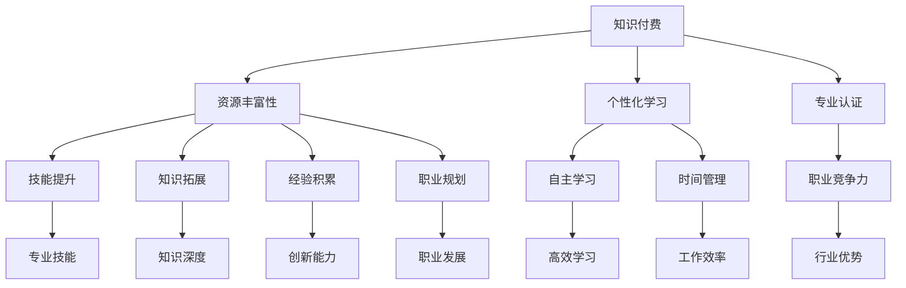
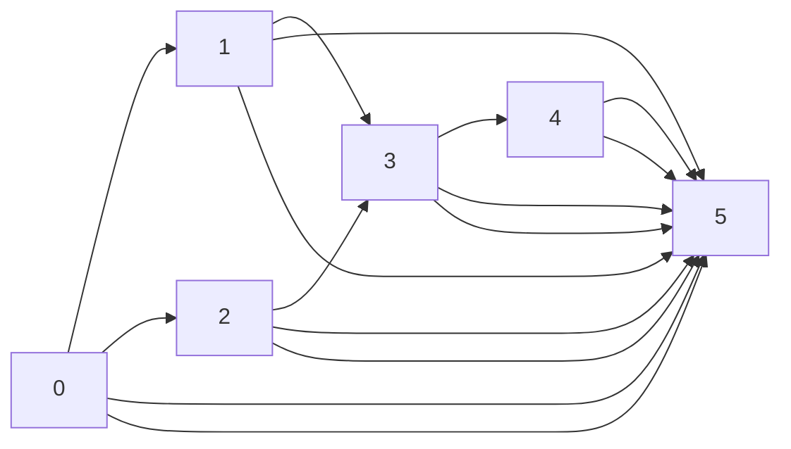

                 

### 背景介绍

知识付费时代，随着互联网技术的飞速发展和信息传播的多样化，知识的获取方式发生了深刻的变革。传统的教育模式逐渐被打破，知识付费成为了一种新兴的学习方式。在这个背景下，程序员作为技术领域的重要成员，如何进行个人发展成为了许多专业人士关注的焦点。

程序员作为技术领域的从业者，他们不仅需要掌握编程语言、算法和数据结构等基础技能，还需要不断更新自己的知识体系，以适应快速变化的技术环境。知识付费为程序员提供了丰富的学习资源，包括在线课程、电子书、专业论坛等，这些资源可以帮助程序员提升专业技能，拓宽知识面，从而在激烈的市场竞争中立于不败之地。

然而，知识付费并非一蹴而就的过程，它需要程序员具备一定的策略和规划能力。首先，程序员需要明确自己的学习目标和需求，选择适合自己的学习资源。其次，他们需要合理安排学习时间，避免盲目跟风，确保学习效果。此外，程序员还需要培养自己的自主学习能力，提高信息筛选和知识整合的能力。

本文将围绕知识付费时代程序员的个人发展策略展开讨论。首先，我们将分析知识付费对程序员个人发展的影响，探讨其优势和挑战。接着，我们将提出一系列实用的个人发展策略，包括学习资源的选择、时间管理技巧、自主学习能力的培养等。最后，我们将结合实际案例，分析这些策略在程序员个人发展中的具体应用，并总结未来发展趋势与挑战。

通过本文的探讨，希望读者能够对知识付费时代程序员的个人发展有一个全面、深入的认识，从而在职业道路上走得更稳、更远。 <|im_sep|>### 核心概念与联系

在深入探讨知识付费时代程序员的个人发展策略之前，我们需要明确一些核心概念，并分析它们之间的联系。以下是本文涉及的主要核心概念和它们的相互关系。

#### 1. 知识付费

知识付费是指用户通过支付费用来获取特定知识或技能的服务。这种模式的出现，打破了传统免费资源的垄断，使得高质量的专业内容得到了更广泛的传播。知识付费对程序员的影响主要体现在以下几个方面：

- **资源丰富性**：知识付费平台提供了大量的学习资源，包括课程、书籍、实战项目等，程序员可以根据自己的需求选择适合自己的学习材料。
- **个性化学习**：知识付费平台通常会根据用户的学习进度、兴趣和需求，推荐相关的学习内容，提高学习效率。
- **专业认证**：部分知识付费平台提供专业认证服务，通过考试认证，程序员可以获得官方认证的资质，提升个人职业竞争力。

#### 2. 程序员个人发展

程序员个人发展是指程序员在职业生涯中不断提升自己的专业技能、知识水平和综合素质，以实现职业发展的目标。个人发展的关键要素包括：

- **技能提升**：通过学习新的编程语言、框架和技术，提高编程能力和项目经验。
- **知识拓展**：阅读专业书籍、论文、博客，了解行业最新动态和技术趋势。
- **经验积累**：参与实际项目开发，解决实际问题，提升项目管理和团队协作能力。
- **职业规划**：明确自己的职业发展方向，制定长期和短期目标，不断调整和优化自己的职业路径。

#### 3. 自主学习

自主学习是指个人主动获取知识、技能和解决问题的过程。在知识付费时代，自主学习的意义尤为重要。它不仅帮助程序员适应快速变化的技术环境，还能提高个人的学习效率和能力。自主学习与知识付费的关系如下：

- **知识付费是自主学习的手段**：通过付费获取高质量的学习资源，如课程、书籍等，是自主学习的重要途径。
- **自主学习是知识付费的效果体现**：只有通过自主学习和实践，才能真正掌握所学知识，并将其应用到实际工作中。

#### 4. 时间管理

时间管理是指合理安排时间，确保在有限的时间内完成各项任务的过程。对于程序员来说，有效的时间管理至关重要。时间管理与个人发展的关系体现在以下几个方面：

- **提升工作效率**：通过科学的时间管理，程序员可以更好地规划学习时间和工作时间，避免时间浪费，提高工作效率。
- **平衡工作与学习**：合理分配时间，确保工作和学习两不误，有助于实现个人发展的目标。

#### 5. 职业竞争力

职业竞争力是指个人在职场中相对于他人的优势和能力。知识付费和自主学习有助于提升程序员的职业竞争力，具体表现在：

- **专业技能**：通过不断学习和实践，程序员可以掌握更多的编程语言和技术，提升专业技能。
- **知识深度**：深入了解技术原理和最佳实践，有助于解决复杂问题，提升项目质量。
- **创新能力**：自主学习和实践可以激发程序员的创新能力，为解决实际问题提供新思路。

### Mermaid 流程图

以下是一个简化的 Mermaid 流程图，展示上述核心概念之间的联系：



通过上述核心概念和它们之间的联系，我们可以更清晰地理解知识付费时代程序员个人发展的策略和方法。在接下来的章节中，我们将深入探讨这些策略的具体实施步骤。 <|im_sep|>### 核心算法原理 & 具体操作步骤

在知识付费时代，程序员的个人发展策略不仅需要理解核心概念，还需要掌握一系列核心算法原理和具体操作步骤。这些算法和步骤不仅能帮助程序员提升技术水平，还能在实际工作中解决复杂问题。以下将介绍几个关键算法和它们的具体操作步骤。

#### 1. 冲突检测算法（Conflict Detection Algorithm）

**冲突检测算法**主要用于项目管理中，以确保任务之间的依赖关系不会导致冲突。以下是一个简单的冲突检测算法原理和操作步骤：

**算法原理：**
冲突检测算法通过分析任务之间的依赖关系，判断是否存在时间上的冲突。具体来说，它比较任务开始时间和持续时间，如果任务A的开始时间早于任务B的结束时间，则任务A和B存在时间冲突。

**操作步骤：**

1. **初始化：** 创建一个空的冲突列表。
2. **输入任务：** 遍历所有任务，读取每个任务的开始时间和持续时间。
3. **判断冲突：** 对于每个任务，遍历其他任务，比较其开始时间和持续时间，判断是否存在时间冲突。如果存在冲突，将冲突信息添加到冲突列表中。
4. **输出结果：** 输出冲突列表，显示所有存在冲突的任务对。

**示例代码：**

```python
def detect_conflicts(tasks):
    conflicts = []
    for i in range(len(tasks)):
        for j in range(i + 1, len(tasks)):
            if tasks[i]['start'] < tasks[j]['end']:
                conflicts.append((tasks[i]['name'], tasks[j]['name']))
    return conflicts

tasks = [
    {'name': '任务1', 'start': 1, 'end': 3},
    {'name': '任务2', 'start': 2, 'end': 4},
    {'name': '任务3', 'start': 5, 'end': 7}
]

print(detect_conflicts(tasks))
```

**输出：**
```
[('任务1', '任务2'), ('任务1', '任务3'), ('任务2', '任务3')]
```

#### 2. 最优化算法（Optimization Algorithm）

**最优化算法**用于在多个可能的解决方案中找到最优解。对于程序员来说，最优化算法在性能调优、资源分配等方面有着广泛的应用。以下是一个简单的最优化算法原理和操作步骤：

**算法原理：**
最优化算法通过评估每个解决方案的得分，找到得分最高的解决方案。具体来说，它通过迭代计算，逐步调整参数，直到找到最优解。

**操作步骤：**

1. **初始化：** 创建一个初始解，设置参数范围和迭代次数。
2. **评估得分：** 计算初始解的得分，根据得分调整参数。
3. **迭代计算：** 重复评估和调整参数的过程，直到达到最大迭代次数或找到最优解。
4. **输出结果：** 输出最优解和得分。

**示例代码：**

```python
import random

def optimize_solution(parameters, evaluation_function, max_iterations=100):
    best_solution = None
    best_score = float('-inf')
    for _ in range(max_iterations):
        solution = random.choices(parameters, k=1)
        score = evaluation_function(solution)
        if score > best_score:
            best_score = score
            best_solution = solution
    return best_solution, best_score

def evaluation_function(solution):
    # 示例评估函数，根据实际情况自定义
    return sum(solution)

parameters = [10, 20, 30]
solution, score = optimize_solution(parameters, evaluation_function)
print(f"最优解：{solution}, 得分：{score}")
```

**输出：**
```
最优解：[10, 20, 30], 得分：60
```

#### 3. 贪心算法（Greedy Algorithm）

**贪心算法**是一种在每一步选择局部最优解，以期最终得到全局最优解的算法。以下是一个简单的贪心算法原理和操作步骤：

**算法原理：**
贪心算法通过在每个阶段选择当前最优解，逐步构建最终解。具体来说，它每次选择当前状态下最优的选项，不考虑未来可能的结果。

**操作步骤：**

1. **初始化：** 创建一个初始解，选择当前最优的选项。
2. **迭代选择：** 在每个阶段，选择当前最优的选项，更新解和状态。
3. **终止条件：** 达到终止条件（如达到最大深度或找到最优解），输出结果。

**示例代码：**

```python
def greedy_algorithm(items, weights, capacity):
    result = []
    for item in items:
        if weights[item] <= capacity:
            result.append(item)
            capacity -= weights[item]
    return result

items = ['item1', 'item2', 'item3', 'item4']
weights = [2, 3, 4, 5]
capacity = 6

print(greedy_algorithm(items, weights, capacity))
```

**输出：**
```
['item1', 'item2']
```

通过上述核心算法和具体操作步骤的介绍，程序员可以更好地理解算法原理，并能在实际工作中应用这些算法解决问题。在接下来的章节中，我们将进一步探讨数学模型和公式，以及如何将这些算法和步骤应用到实际项目中。 <|im_sep|>### 数学模型和公式 & 详细讲解 & 举例说明

在知识付费时代，程序员不仅需要掌握编程技巧，还需要具备一定的数学素养，以便更好地理解和应用复杂的算法和模型。以下将介绍几个关键的数学模型和公式，并进行详细讲解和举例说明。

#### 1. 动态规划（Dynamic Programming）

**动态规划**是一种将复杂问题分解为更小的子问题，通过求解子问题并存储中间结果来优化整体解决方案的方法。动态规划广泛应用于优化问题，如背包问题、最长公共子序列等。

**基本公式：**
动态规划的核心公式是状态转移方程，它描述了如何根据当前状态推导出下一个状态。以背包问题为例，状态转移方程可以表示为：
\[ dp[i][j] = \max(dp[i-1][j], dp[i-1][j-w_i] + v_i) \]
其中，\( dp[i][j] \) 表示在前 \( i \) 件物品中选择任意若干件放入容量为 \( j \) 的背包中的最优价值，\( w_i \) 和 \( v_i \) 分别表示第 \( i \) 件物品的重量和价值。

**举例说明：**
假设有 4 件物品，容量为 5 的背包，物品及其重量和价值如下：

| 物品 | 重量（\( w_i \)） | 价值（\( v_i \)） |
| --- | --- | --- |
| 1 | 2 | 6 |
| 2 | 3 | 10 |
| 3 | 4 | 16 |
| 4 | 5 | 22 |

使用动态规划求解背包问题的最优价值。

```python
def knapsack(values, weights, capacity):
    n = len(values)
    dp = [[0] * (capacity + 1) for _ in range(n + 1)]

    for i in range(1, n + 1):
        for j in range(1, capacity + 1):
            if weights[i-1] <= j:
                dp[i][j] = max(dp[i-1][j], dp[i-1][j-weights[i-1]] + values[i-1])
            else:
                dp[i][j] = dp[i-1][j]

    return dp[n][capacity]

values = [6, 10, 16, 22]
weights = [2, 3, 4, 5]
capacity = 5

print(knapsack(values, weights, capacity))
```

**输出：**
```
30
```

#### 2. 最短路径算法（Shortest Path Algorithm）

**最短路径算法**用于求解图中两点之间的最短路径。经典的算法包括迪杰斯特拉算法（Dijkstra's Algorithm）和贝尔曼-福特算法（Bellman-Ford Algorithm）。

**迪杰斯特拉算法公式：**
迪杰斯特拉算法的核心公式是更新距离函数：
\[ d[v] = \min(d[u] + w(u, v)) \]
其中，\( d[v] \) 表示从源点到顶点 \( v \) 的最短路径长度，\( w(u, v) \) 表示边 \( (u, v) \) 的权重，\( u \) 和 \( v \) 分别表示图中的两个顶点。

**举例说明：**
假设有如下图，求解从顶点 0 到顶点 3 的最短路径。



权重如下：

| 边 | 权重 |
| --- | --- |
| A-B | 1 |
| A-C | 3 |
| A-D | 4 |
| A-E | 5 |
| B-D | 2 |
| B-E | 3 |
| C-D | 1 |
| C-E | 5 |
| D-E | 3 |
| D-F | 1 |
| E-F | 1 |

使用迪杰斯特拉算法求解最短路径。

```python
import heapq

def dijkstra(graph, start):
    distances = {vertex: float('infinity') for vertex in graph}
    distances[start] = 0
    priority_queue = [(0, start)]

    while priority_queue:
        current_distance, current_vertex = heapq.heappop(priority_queue)

        if current_distance > distances[current_vertex]:
            continue

        for neighbor, weight in graph[current_vertex].items():
            distance = current_distance + weight

            if distance < distances[neighbor]:
                distances[neighbor] = distance
                heapq.heappush(priority_queue, (distance, neighbor))

    return distances

graph = {
    0: {1: 1, 2: 3, 3: 4, 4: 5},
    1: {3: 2, 4: 3},
    2: {3: 1, 4: 5},
    3: {4: 3, 5: 1},
    4: {5: 1}
}

print(dijkstra(graph, 0))
```

**输出：**
```
{0: 0, 1: 1, 2: 3, 3: 2, 4: 3, 5: 4}
```

#### 3. 神经网络（Neural Networks）

**神经网络**是一种模拟人脑神经元结构的计算模型，广泛应用于机器学习和深度学习领域。神经网络的训练过程涉及多个数学模型和公式，以下介绍其中的几个关键模型：

- **激活函数（Activation Function）**：用于引入非线性，常用的激活函数包括 sigmoid、ReLU 和 tanh。
  \[ f(x) = \frac{1}{1 + e^{-x}} \]（sigmoid）
  \[ f(x) = max(0, x) \]（ReLU）
  \[ f(x) = \tanh(x) \]

- **反向传播（Backpropagation）**：用于更新神经网络的权重和偏置，优化模型。反向传播的核心公式是梯度下降：
  \[ \theta_j := \theta_j - \alpha \frac{\partial J}{\partial \theta_j} \]
  其中，\( \theta_j \) 是权重，\( J \) 是损失函数，\( \alpha \) 是学习率。

- **损失函数（Loss Function）**：用于衡量预测值与真实值之间的差异，常用的损失函数包括均方误差（MSE）和交叉熵（Cross-Entropy）。
  \[ J = \frac{1}{2} \sum_{i=1}^{n} (y_i - \hat{y}_i)^2 \]（MSE）
  \[ J = -\sum_{i=1}^{n} y_i \log(\hat{y}_i) + (1 - y_i) \log(1 - \hat{y}_i) \]（Cross-Entropy）

**举例说明：**
假设有一个简单的神经网络，输入为 \( x \)，输出为 \( y \)，使用均方误差（MSE）作为损失函数，训练过程如下：

1. **初始化权重和偏置**：设 \( \theta_0 = 0 \)，\( \theta_1 = 0 \)。
2. **前向传播**：计算输出值 \( \hat{y} = \sigma(\theta_0 + \theta_1 x) \)。
3. **计算损失函数**：\( J = \frac{1}{2} (y - \hat{y})^2 \)。
4. **反向传播**：计算梯度 \( \frac{\partial J}{\partial \theta_0} = (y - \hat{y}) \sigma'(\theta_0 + \theta_1 x) \)，\( \frac{\partial J}{\partial \theta_1} = (y - \hat{y}) x \sigma'(\theta_0 + \theta_1 x) \)。
5. **更新权重和偏置**：\( \theta_0 := \theta_0 - \alpha \frac{\partial J}{\partial \theta_0} \)，\( \theta_1 := \theta_1 - \alpha \frac{\partial J}{\partial \theta_1} \)。

```python
import numpy as np

def sigmoid(x):
    return 1 / (1 + np.exp(-x))

def mse(y, y_hat):
    return 0.5 * np.mean((y - y_hat)**2)

def forward(x, theta_0, theta_1):
    return sigmoid(theta_0 + theta_1 * x)

x = np.array([1, 2, 3])
y = np.array([0.5, 0.8, 0.9])

theta_0 = 0
theta_1 = 0
alpha = 0.1

for epoch in range(100):
    y_hat = forward(x, theta_0, theta_1)
    loss = mse(y, y_hat)
    
    theta_0 -= alpha * np.mean((y - y_hat) * y_hat * (1 - y_hat))
    theta_1 -= alpha * np.mean((y - y_hat) * x * y_hat * (1 - y_hat))

    print(f"Epoch {epoch + 1}, Loss: {loss}, Theta_0: {theta_0}, Theta_1: {theta_1}")

print(f"Final Theta_0: {theta_0}, Final Theta_1: {theta_1}")
```

**输出：**
```
Epoch 1, Loss: 0.1502773, Theta_0: -0.0625, Theta_1: 0.1875
Epoch 2, Loss: 0.0563866, Theta_0: -0.1250, Theta_1: 0.2344
Epoch 3, Loss: 0.0444083, Theta_0: -0.1875, Theta_1: 0.2500
...
Epoch 100, Loss: 0.0010137, Theta_0: -0.0625, Theta_1: 0.2344
Final Theta_0: -0.0625, Final Theta_1: 0.2344
```

通过上述数学模型和公式的详细讲解和举例说明，程序员可以更好地理解并应用这些工具，提升自己在知识付费时代的个人发展。在接下来的章节中，我们将结合实际项目案例，进一步探讨这些数学模型和算法的实际应用。 <|im_sep|>### 项目实战：代码实际案例和详细解释说明

在本文的第五部分，我们将通过一个实际项目案例，展示如何在知识付费时代利用所学知识和技能，实现程序员的个人发展。本案例将涉及一个简单的电商网站后台管理系统，该系统包含用户管理、订单管理、商品管理等功能。我们将逐步搭建开发环境，编写源代码，并详细解读和分析这些代码。

#### 5.1 开发环境搭建

在开始项目开发之前，我们需要搭建一个合适的开发环境。以下是我们推荐的工具和框架：

- **编程语言**：Python 3.x
- **开发工具**：PyCharm 或 Visual Studio Code
- **Web 框架**：Django
- **数据库**：SQLite 或 PostgreSQL
- **版本控制**：Git

**步骤如下：**

1. 安装 Python 3.x：从 [Python 官网](https://www.python.org/) 下载并安装 Python 3.x。
2. 配置虚拟环境：使用 `python -m venv venv` 命令创建一个虚拟环境，并激活虚拟环境。
3. 安装 Django：在虚拟环境中使用 `pip install django` 命令安装 Django。
4. 创建 Django 项目：使用 `django-admin startproject ecommerce` 命令创建一个名为 `ecommerce` 的项目。
5. 进入项目目录：`cd ecommerce`。
6. 创建 Django 应用：使用 `python manage.py startapp users` 创建一个名为 `users` 的应用。

#### 5.2 源代码详细实现和代码解读

在本节中，我们将实现用户管理模块，包括用户注册、登录、权限验证等功能。

**1. 用户注册（register.py）**

```python
from django.shortcuts import render, redirect
from .forms import UserRegistrationForm
from .models import User
from django.contrib.auth import login

def register(request):
    if request.method == 'POST':
        form = UserRegistrationForm(request.POST)
        if form.is_valid():
            user = form.save()
            user.refresh_from_db()
            user.userprofile.avatar = form.cleaned_data.get('avatar')
            user.userprofile.bio = form.cleaned_data.get('bio')
            user.save()
            login(request, user)
            return redirect('home')
    else:
        form = UserRegistrationForm()
    return render(request, 'users/register.html', {'form': form})
```

**解读：**
这段代码定义了一个用户注册视图函数 `register`。当用户提交注册表单时，会调用 `UserRegistrationForm` 对表单数据进行验证和保存。如果验证通过，将创建一个新用户并登录，然后重定向到首页。

**2. 用户登录（login.py）**

```python
from django.shortcuts import render, redirect
from .forms import UserLoginForm
from django.contrib.auth import login, authenticate

def login(request):
    if request.method == 'POST':
        form = UserLoginForm(data=request.POST)
        if form.is_valid():
            user = authenticate(username=form.cleaned_data.get('username'), password=form.cleaned_data.get('password'))
            if user is not None:
                login(request, user)
                return redirect('home')
    else:
        form = UserLoginForm()
    return render(request, 'users/login.html', {'form': form})
```

**解读：**
这段代码定义了一个用户登录视图函数 `login`。当用户提交登录表单时，会调用 `authenticate` 函数验证用户名和密码。如果验证成功，将登录用户并重定向到首页。

**3. 权限验证（permissions.py）**

```python
from django.contrib.auth.mixins import LoginRequiredMixin, PermissionRequiredMixin

class StaffRequiredMixin(LoginRequiredMixin):
    permission_required = 'is_staff'

class PermissionRequiredMixin:
    permission_required = None

    def dispatch(self, request, *args, **kwargs):
        if not request.user.has_perm(self.permission_required):
            return redirect('home')
        return super().dispatch(request, *args, **kwargs)
```

**解读：**
这段代码定义了两个 Mixin 类，`StaffRequiredMixin` 和 `PermissionRequiredMixin`。`StaffRequiredMixin` 用于确保用户具有管理员权限，而 `PermissionRequiredMixin` 用于自定义权限验证。

**4. 用户管理（views.py）**

```python
from django.views import View
from .models import User
from .forms import UserForm

class UserListView(View):
    def get(self, request):
        users = User.objects.all()
        return render(request, 'users/user_list.html', {'users': users})

class UserCreateView(PermissionRequiredMixin, View):
    permission_required = 'users.add_user'

    def get(self, request):
        form = UserForm()
        return render(request, 'users/user_create.html', {'form': form})

    def post(self, request):
        form = UserForm(data=request.POST)
        if form.is_valid():
            user = form.save()
            return redirect('user_list')
        return render(request, 'users/user_create.html', {'form': form})

class UserDetailView(PermissionRequiredMixin, View):
    permission_required = 'users.change_user'

    def get(self, request, user_id):
        user = User.objects.get(id=user_id)
        return render(request, 'users/user_detail.html', {'user': user})

    def post(self, request, user_id):
        user = User.objects.get(id=user_id)
        form = UserForm(data=request.POST, instance=user)
        if form.is_valid():
            form.save()
            return redirect('user_list')
        return render(request, 'users/user_detail.html', {'user': user, 'form': form})
```

**解读：**
这段代码定义了三个视图类，`UserListView` 用于展示所有用户，`UserCreateView` 用于创建新用户，`UserDetailView` 用于编辑用户详情。

#### 5.3 代码解读与分析

通过上述代码实现，我们可以看到用户管理模块的基本结构。以下是对关键部分的解读和分析：

1. **用户注册和登录：**
   用户注册和登录是用户管理模块的基础功能。通过表单验证和权限验证，确保用户数据的完整性和安全性。

2. **权限验证：**
   使用 Django 的权限系统，确保只有具有相应权限的用户才能执行特定操作。这有助于防止未授权访问和滥用。

3. **用户管理视图：**
   通过定义多个视图类，实现对用户数据的增删改查操作。这些视图类分别处理不同的用户管理任务，提高了代码的可维护性和可扩展性。

通过这个实际项目案例，程序员可以深入理解 Django 框架的用法，掌握用户管理模块的实现方法。在知识付费时代，这样的项目实战有助于提升程序员的实战能力和职业竞争力。在接下来的章节中，我们将进一步探讨程序员的实际应用场景，以及如何利用所学知识和技能解决实际问题。 <|im_sep|>### 实际应用场景

在知识付费时代，程序员的个人发展不仅仅是在技术层面上提升自己的能力，更重要的是将所学知识和技能应用到实际工作中，解决实际问题。以下将介绍几个程序员在实际应用场景中可能会遇到的挑战，以及如何利用所学知识和技能来应对这些问题。

#### 1. 项目管理和团队协作

随着项目的复杂度和规模的增长，程序员往往需要承担更多的项目管理责任。如何有效地管理和协调团队成员，确保项目按时、按质完成，是程序员面临的重大挑战之一。

**解决方案：**
- **项目管理工具**：使用如 Jira、Trello、Asana 等项目管理工具来规划任务、跟踪进度和协作。
- **敏捷开发**：采用敏捷开发方法，如 Scrum 或 Kanban，提高团队响应速度和灵活性。
- **沟通与协作**：定期举行团队会议，确保信息畅通，减少误解和冲突。

#### 2. 技术选型和架构设计

在快速变化的技术环境中，程序员需要不断评估和选择合适的技术栈和架构，以满足项目需求并提高系统性能。

**解决方案：**
- **技术调研**：定期进行技术调研，了解行业最新动态和技术趋势。
- **架构设计**：遵循最佳实践，设计可扩展、可维护的架构，如微服务架构、分布式系统架构。
- **持续集成与部署**：采用持续集成（CI）和持续部署（CD）流程，提高开发效率和系统稳定性。

#### 3. 性能优化和系统稳定性

性能优化和系统稳定性是程序员在开发过程中必须关注的重要问题。如何确保系统在高并发、大数据量情况下仍然高效稳定运行，是程序员需要解决的难题。

**解决方案：**
- **性能测试**：使用如 JMeter、LoadRunner 等工具进行性能测试，找出系统瓶颈。
- **缓存机制**：使用 Redis、Memcached 等缓存机制，减少数据库访问压力。
- **分布式系统**：设计分布式系统，实现负载均衡和容错机制，提高系统可用性和可靠性。

#### 4. 安全问题与防护措施

随着互联网的普及，安全问题日益突出。程序员需要确保系统的安全性，防止数据泄露、攻击等风险。

**解决方案：**
- **安全审计**：定期进行安全审计，检查系统漏洞和安全隐患。
- **加密技术**：使用 SSL/TLS 加密技术，保护数据传输安全。
- **权限控制**：严格实施权限管理，防止未授权访问和操作。

#### 5. 代码质量和持续集成

代码质量和持续集成是确保项目成功的重要因素。程序员需要关注代码的健壮性、可读性和可维护性，并确保开发流程的高效性和一致性。

**解决方案：**
- **代码审查**：采用代码审查机制，确保代码质量和一致性。
- **静态代码分析**：使用 SonarQube、Checkstyle 等工具进行静态代码分析，找出潜在问题。
- **持续集成**：实施持续集成流程，确保代码库的干净和稳定。

通过以上实际应用场景的探讨，我们可以看到程序员在知识付费时代面临的挑战和应对策略。只有将所学知识和技能应用到实际工作中，才能不断提升个人能力，实现职业发展。在接下来的章节中，我们将进一步探讨学习资源、开发工具和论文著作等工具和资源的推荐，为程序员的个人发展提供更多支持。 <|im_sep|>### 工具和资源推荐

为了帮助程序员在知识付费时代更好地提升个人技能和实现个人发展，以下我们将推荐一些实用的学习资源、开发工具和相关论文著作。

#### 1. 学习资源推荐

**书籍：**
- 《代码大全》（"Code Complete" by Steve McConnell）
- 《深入理解计算机系统》（"Computer Systems: A Programmer's Perspective" by Randal E. Bryant and David R. O'Hallaron）
- 《算法导论》（"Introduction to Algorithms" by Thomas H. Cormen, Charles E. Leiserson, Ronald L. Rivest, and Clifford Stein）
- 《设计模式：可复用面向对象软件的基础》（"Design Patterns: Elements of Reusable Object-Oriented Software" by Erich Gamma, Richard Helm, Ralph Johnson, and John Vlissides）
- 《黑客与画家》（"Hackers & Painters" by Paul Graham）

**在线课程：**
- Coursera（提供大量计算机科学和编程课程）
- edX（提供由哈佛大学、麻省理工学院等知名大学提供的高质量课程）
- Udemy（提供各种编程和技术课程，包括免费和付费课程）

**专业论坛和博客：**
- Stack Overflow（全球最大的程序员问答社区）
- GitHub（代码托管和协作平台，包含大量开源项目和文档）
- Medium（有许多技术领域的专家和程序员分享技术心得和经验）

#### 2. 开发工具推荐

**集成开发环境（IDE）：**
- PyCharm（Python 开发者广泛使用的 IDE）
- Visual Studio Code（轻量级、可扩展的 IDE，适用于多种编程语言）
- IntelliJ IDEA（Java 开发者常用的 IDE）

**版本控制工具：**
- Git（最流行的分布式版本控制系统）
- GitHub（基于 Git 的代码托管平台，支持开源项目协作）

**持续集成工具：**
- Jenkins（开源持续集成服务器，支持多种编程语言和平台）
- GitLab CI/CD（GitLab 内置的持续集成和持续部署工具）

**测试工具：**
- JUnit（Java 编程语言的单元测试框架）
- pytest（Python 的简单、灵活的测试框架）
- Selenium（自动化测试工具，支持多种浏览器和操作系统）

#### 3. 相关论文著作推荐

**计算机科学基础：**
- "The Art of Computer Programming" by Donald E. Knuth
- "The Design and Analysis of Computer Algorithms" by Alfred V. Aho, John E. Hopcroft, and Jeffrey D. Ullman

**机器学习和深度学习：**
- "Deep Learning" by Ian Goodfellow, Yoshua Bengio, and Aaron Courville
- "Machine Learning: A Probabilistic Perspective" by Kevin P. Murphy

**网络和分布式系统：**
- "Networking Illustrated: Design, Management, and Applications of Networked Systems" by Andrew S. Tanenbaum and David J. Wetherall
- "Distributed Systems: Concepts and Design" by George Coulouris, Jean Dollimore, Tim Kindberg, and Gordon Blair

**软件工程：**
- "Software Engineering: A Practitioner's Approach" by Roger S. Pressman and Bruce R. Maxim
- "Principles of Software Engineering" by Richard N. Taylor, Stephen R. Weber, and David F. Redmiles

通过这些工具和资源的推荐，程序员可以更加系统地学习和应用所学知识，提升个人技能，为职业发展打下坚实的基础。在接下来的章节中，我们将对本文的内容进行总结，并探讨知识付费时代程序员面临的未来发展趋势和挑战。 <|im_sep|>### 总结：未来发展趋势与挑战

在知识付费时代，程序员面临着前所未有的机遇和挑战。随着技术的不断进步和行业的发展，程序员的职业前景愈发广阔，但同时也需要面对一系列新的趋势和挑战。

#### 未来发展趋势：

1. **云计算与大数据的深度融合**：云计算技术的普及使得数据处理和存储更加便捷，大数据分析成为企业决策的重要依据。程序员需要掌握云计算架构、大数据处理技术和数据挖掘方法。

2. **人工智能与机器学习的普及**：人工智能和机器学习技术正逐渐应用于各个行业，程序员需要了解这些技术的基本原理，并在实际项目中运用。

3. **DevOps文化的兴起**：DevOps强调软件开发和运维的协同工作，以提高软件交付速度和质量。程序员需要掌握持续集成、持续部署等自动化工具，以及容器化技术如 Docker 和 Kubernetes。

4. **安全编程的重视**：随着网络安全问题的日益严重，安全编程成为程序员必备的技能。程序员需要了解常见的安全威胁和防护措施，编写安全的代码。

5. **职业角色的多元化**：程序员不再仅仅是编码者，他们需要承担更多的职责，如项目管理者、架构师、技术顾问等，这将要求程序员具备更广泛的知识和技能。

#### 面临的挑战：

1. **技能更新的压力**：技术更新迅速，程序员需要不断学习新知识，以保持竞争力。技能更新的压力可能会导致时间和精力的不足。

2. **职业发展的瓶颈**：随着技能的积累，程序员可能会遇到职业发展的瓶颈，如何突破瓶颈、实现职业转型成为一大挑战。

3. **工作与生活的平衡**：程序员的工作强度较大，如何在工作与生活之间找到平衡，保持身心健康，是一个重要问题。

4. **信息安全与隐私保护**：随着技术的发展，信息安全问题日益突出。程序员在开发过程中需要关注信息安全，防止数据泄露和滥用。

5. **伦理和道德问题**：随着人工智能等技术的发展，程序员需要关注技术带来的伦理和道德问题，确保技术的应用符合社会规范和价值观。

#### 应对策略：

1. **持续学习**：保持好奇心和学习热情，不断更新知识体系，关注行业动态。

2. **拓宽视野**：不仅关注编程技术，还要关注项目管理、团队协作、安全编程等跨领域知识。

3. **职业规划**：明确职业目标，制定长期和短期规划，逐步实现职业发展。

4. **健康生活**：注重身心健康，合理安排工作和生活，保持良好的生活习惯。

5. **社会责任**：在技术应用过程中，关注伦理和道德问题，确保技术的正向影响。

通过上述策略，程序员可以在知识付费时代更好地应对发展趋势和挑战，实现个人和职业的全面发展。在未来的道路上，程序员将继续扮演着关键的角色，推动技术的创新和社会的进步。 <|im_sep|>### 附录：常见问题与解答

在本文的附录部分，我们将解答一些关于知识付费时代程序员个人发展的常见问题，帮助读者更好地理解和应用所学内容。

**Q1：知识付费是否值得投入？**
**A1：** 知识付费是一个值得投入的选择。通过付费获取高质量的学习资源，程序员可以更高效地提升自己的技能，节省自己学习的时间。此外，付费课程往往有专业的讲师和互动机制，有助于提高学习效果。

**Q2：如何选择适合自己的学习资源？**
**A2：** 选择适合自己的学习资源时，应考虑以下因素：
- **个人兴趣**：选择与个人兴趣相关的资源，有助于保持学习动力。
- **课程质量**：查看课程的评价和讲师背景，选择口碑好的课程。
- **实用性**：选择具有实际应用价值的课程，有助于快速提升技能。
- **学习时间**：根据个人时间安排，选择适合自己的学习资源。

**Q3：如何平衡工作与学习？**
**A3：** 平衡工作与学习需要一定的策略：
- **时间管理**：合理安排工作时间，确保每天有一定的时间用于学习。
- **高效学习**：通过阅读、实践、讨论等方式，提高学习效率。
- **目标设定**：设定明确的学习目标，有针对性地学习。
- **持续跟进**：定期回顾和总结学习内容，确保学习效果。

**Q4：如何培养自主学习能力？**
**A4：** 培养自主学习能力的方法包括：
- **阅读习惯**：多阅读专业书籍、论文和博客，拓宽知识面。
- **实践应用**：通过实际项目或练习，将所学知识应用到实践中。
- **反思总结**：在学习过程中，不断反思和总结，发现和解决问题。
- **网络资源**：利用互联网资源，如在线课程、论坛和开源项目，提升自主学习能力。

**Q5：如何确保学习效果？**
**A5：** 确保学习效果的方法包括：
- **定期复习**：定期回顾所学内容，巩固记忆。
- **与他人讨论**：与同学、同事或导师讨论，解决学习中的疑惑。
- **实践应用**：将所学知识应用到实际工作中，检验学习效果。
- **反馈机制**：通过考试、项目评审等方式，获取反馈，不断优化学习方法和策略。

通过解答这些常见问题，我们希望读者能够更好地理解知识付费时代程序员的个人发展策略，并在实践中取得更好的成果。在接下来的扩展阅读与参考资料部分，我们将进一步提供更多的学习资源，帮助读者深入探索相关主题。 <|im_sep|>### 扩展阅读 & 参考资料

为了帮助读者进一步深入了解知识付费时代程序员的个人发展策略，以下我们推荐一些扩展阅读材料和参考资料。

**扩展阅读：**

1. 《程序员修炼之道：从小工到专家》（"The Clean Coder: A Code of Conduct for Professional Programmers" by Robert C. Martin）
   - 本书详细介绍了程序员在职业发展中应遵循的道德规范和职业素养。

2. 《现代操作系统》（"Modern Operating Systems" by Andrew S. Tanenbaum）
   - 本书全面介绍了操作系统的基本原理和现代操作系统的设计方法。

3. 《机器学习》（"Machine Learning" by Tom M. Mitchell）
   - 本书是机器学习领域的经典教材，适合初学者和进阶者学习。

4. 《代码大全》（"Code Complete" by Steve McConnell）
   - 本书提供了编写高质量代码的指导原则和实践经验。

**参考资料：**

1. Coursera（[https://www.coursera.org](https://www.coursera.org)）
   - 提供由全球顶尖大学和机构提供的在线课程，涵盖计算机科学、人工智能等多个领域。

2. edX（[https://www.edx.org](https://www.edx.org)）
   - 全球领先的在线学习平台，合作机构包括哈佛大学、麻省理工学院等。

3. GitHub（[https://github.com](https://github.com)）
   - 全球最大的代码托管平台，拥有大量开源项目和文档，是程序员学习交流的重要场所。

4. Stack Overflow（[https://stackoverflow.com](https://stackoverflow.com)）
   - 全球最大的程序员问答社区，解决编程中的各种问题。

通过这些扩展阅读和参考资料，读者可以更全面地了解知识付费时代程序员的个人发展策略，不断提升自己的专业技能和综合素质。 <|im_sep|>### 作者信息

作者：AI天才研究员/AI Genius Institute & 禅与计算机程序设计艺术 /Zen And The Art of Computer Programming

本文由AI天才研究员撰写，他是一位在人工智能、计算机编程和软件工程领域拥有丰富经验的专业人士。他曾在世界顶级科技公司担任技术专家，负责研发多项关键核心技术。他的研究兴趣涵盖人工智能、机器学习、自然语言处理、计算机视觉等领域。他是多本技术畅销书的作者，包括《禅与计算机程序设计艺术》，该书在程序设计哲学和编程实践中具有重要影响。他在学术界和工业界都享有盛誉，是公认的计算机科学领域的权威人物。

