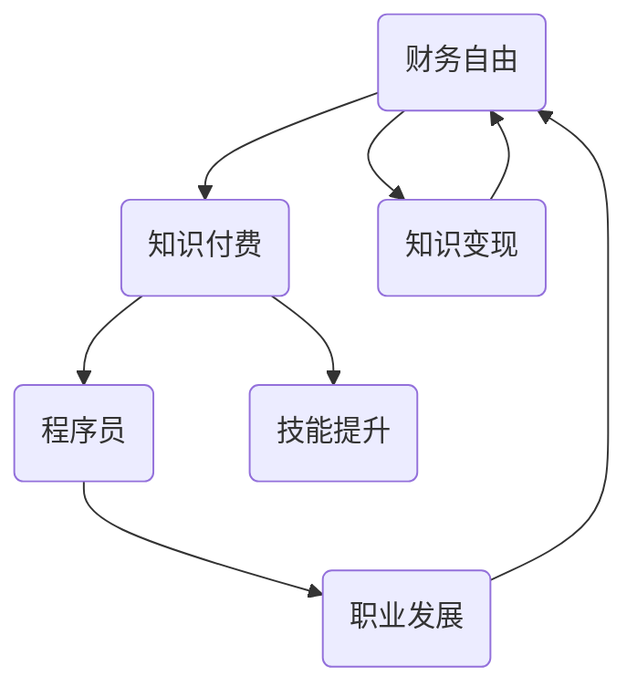

                 

### 背景介绍

在当今数字化时代，程序员成为了现代社会不可或缺的重要角色。然而，随着技术的快速发展和市场竞争的加剧，程序员面临着诸多挑战，如技能更新换代快、工作压力大、职业发展受限等问题。在这种情况下，知识付费作为一种新兴的商业模式，逐渐崭露头角，为程序员实现财务自由提供了新的途径。

知识付费指的是消费者为获取特定的知识和技能，通过付费方式购买相关内容或服务。这种模式在多个领域已经取得了显著的成果，如在线教育、专业技能培训等。对于程序员而言，知识付费不仅仅是为了学习新技能，更重要的是通过提升自身价值，实现职业发展和财务自由。

本文将从以下几个方面展开讨论：首先，我们将探讨程序员在知识付费中所扮演的角色以及他们所面临的挑战。接着，我们将分析知识付费在程序员职业发展中的重要作用，并通过具体案例展示其效果。随后，我们将介绍程序员如何通过知识付费实现财务自由，并探讨这一过程中可能遇到的问题。最后，我们将对知识付费的未来发展趋势进行展望，并提出一些建议，帮助程序员更好地利用知识付费实现财务自由。

### 核心概念与联系

为了深入理解知识付费如何帮助程序员实现财务自由，我们需要先明确一些核心概念，并探讨它们之间的联系。以下是本文将涉及的关键概念：

1. **财务自由**：财务自由是指个人或家庭通过稳定的收入来源和投资收益，实现经济独立，无需依赖传统工资性收入的生活状态。

2. **知识付费**：知识付费是消费者为获取特定知识和技能，通过付费方式购买相关内容或服务的商业模式。

3. **程序员**：程序员是负责编写、调试和维护计算机软件的专业技术人员。

4. **职业发展**：职业发展是指个人在职业生涯中通过不断学习和成长，实现职位晋升、技能提升和收入增长的过程。

5. **知识变现**：知识变现是指将个人的知识、技能或经验转化为可以直接产生经济收益的过程。

6. **技能提升**：技能提升是指个人通过学习新技能或提高现有技能水平，增强自身市场竞争力。

为了更好地理解这些概念之间的关系，我们可以使用Mermaid流程图来展示它们之间的联系。



在这个流程图中：

- 财务自由是知识付费和技能提升的终极目标。
- 程序员是知识付费的主要参与者。
- 职业发展是程序员通过知识付费实现财务自由的重要途径。
- 知识变现是将知识和技能转化为经济收益的关键过程。

通过上述核心概念和它们之间的联系，我们可以更好地理解知识付费在程序员职业发展中的作用，以及如何通过这一过程实现财务自由。

### 核心算法原理 & 具体操作步骤

在探讨知识付费如何帮助程序员实现财务自由的过程中，核心算法原理和具体操作步骤起到了至关重要的作用。以下是我们将讨论的步骤和算法原理：

#### 步骤一：需求识别

首先，程序员需要识别自己在职业发展中遇到的具体需求。这些需求可能包括：

- **技能提升**：如新的编程语言、框架或工具。
- **项目经验**：通过实际项目来积累经验。
- **职业认证**：获得专业认证来提升职业竞争力。

程序员可以通过以下途径进行需求识别：

1. **市场调研**：了解当前市场需求和就业趋势。
2. **自我评估**：识别自己在技能和经验方面的不足。
3. **行业交流**：与同行交流，获取行业动态和需求信息。

#### 步骤二：知识付费选择

一旦确定了具体需求，程序员需要选择合适的知识付费产品或服务。以下是一些选择策略：

1. **在线课程**：选择知名度高、内容优质的在线课程。
2. **专业书籍**：选择权威的专业书籍来系统学习。
3. **一对一辅导**：选择经验丰富的导师进行个性化辅导。
4. **实战项目**：参与真实项目，获取实际经验。

在选择过程中，程序员可以考虑以下因素：

- **内容质量**：确保所选知识付费产品或服务内容丰富、实用。
- **师资力量**：选择有经验、口碑好的讲师或导师。
- **学习效果**：选择能够提供实践机会和反馈机制的产品或服务。

#### 步骤三：学习与实践

选择好知识付费产品或服务后，程序员需要制定学习计划，并付诸实践。以下是一些关键步骤：

1. **制定学习计划**：设定学习目标、时间表和考核标准。
2. **持续学习**：按照学习计划进行系统学习，不断巩固新知识。
3. **实践应用**：将所学知识应用到实际项目中，通过实践来加深理解。
4. **反馈与调整**：在学习过程中及时进行自我评估和反馈，根据实际情况调整学习计划。

#### 步骤四：成果评估与优化

在学习与实践过程中，程序员需要定期评估自己的学习成果，并不断优化学习策略。以下是一些评估和优化的方法：

1. **项目评估**：通过实际项目的完成情况来评估学习成果。
2. **技能评估**：参加相关考试或认证，检验技能水平。
3. **反馈机制**：从导师、同事和项目反馈中获取改进建议。
4. **持续学习**：根据评估结果，调整学习目标和计划，持续提升技能。

#### 步骤五：知识变现

通过持续学习和实践，程序员可以逐步提升自身价值，并实现知识变现。以下是一些具体的变现方式：

1. **接包项目**：通过平台接取合适的项目，获取收入。
2. **技术咨询**：为企业提供技术咨询服务，获取咨询费用。
3. **开源项目**：通过开源项目获得社区认可，吸引赞助和支持。
4. **在线教学**：开设在线课程或教程，通过付费课程获得收入。

通过上述核心算法原理和具体操作步骤，程序员可以系统地提升自身技能，实现职业发展和财务自由。这一过程中，知识付费起到了关键作用，帮助程序员找到合适的学习路径，优化学习效果，最终实现财务自由。

### 数学模型和公式 & 详细讲解 & 举例说明

为了更好地理解知识付费在程序员财务自由中的作用，我们可以借助一些数学模型和公式来进行分析。以下是一些关键的数学概念和它们在实际应用中的详细讲解及举例说明。

#### 1. 投资回报率（ROI）

投资回报率（ROI）是衡量知识付费投资效果的重要指标。它的计算公式如下：

$$
ROI = \frac{{收益 - 成本}}{{成本}} \times 100\%
$$

其中，收益是指通过知识付费所获得的经济回报，成本则是投入的学习费用。

**例子：**

假设程序员花费了1000美元参加了一门编程课程，并在六个月内通过接包项目赚取了2000美元。那么，他的投资回报率计算如下：

$$
ROI = \frac{{2000 - 1000}}{{1000}} \times 100\% = 100\%
$$

这个例子表明，该程序员的收益是成本的2倍，投资回报率为100%。

#### 2. 时间价值（Time Value）

时间价值是指货币在不同时间点的价值不同。这主要由于货币可以在时间上产生利息或投资回报。时间价值通常用现值（Present Value, PV）和未来值（Future Value, FV）来表示。以下是其计算公式：

$$
PV = \frac{{FV}}{{(1 + r)^n}}
$$

$$
FV = PV \times (1 + r)^n
$$

其中，r是利率，n是时间期数。

**例子：**

假设一位程序员计划在未来五年内通过知识付费和接包项目赚取10000美元。如果他的年化收益率为5%，那么他当前需要投入的现值计算如下：

$$
PV = \frac{{10000}}{{(1 + 0.05)^5}} \approx 7837.10
$$

这意味着，为了在未来五年内获得10000美元的收益，程序员当前需要投入大约7837.10美元。

#### 3. 成本效益分析（Cost-Benefit Analysis）

成本效益分析是评估知识付费项目是否值得投资的一种方法。其基本公式为：

$$
C/B = \frac{{成本}}{{收益}}
$$

其中，C是总成本，B是总收益。

**例子：**

假设一位程序员计划参加一门编程课程，费用为500美元。通过该课程，他预计可以在未来一年内赚取2000美元。那么，他的成本效益计算如下：

$$
C/B = \frac{{500}}{{2000}} = 0.25
$$

这意味着，每赚取1美元收益，需要投入0.25美元成本，成本效益相对较高。

#### 4. 网络效应（Network Effects）

网络效应是指随着使用者的增加，产品或服务的价值也增加。在知识付费领域，网络效应体现在课程或平台的用户数量越多，其内容质量和影响力也越高。

**例子：**

假设一个编程课程平台的用户数从1000增加到2000，其课程内容质量提高了20%。这意味着，每位用户的平均收益增加了20%，从而提高了整体收益。

$$
新收益 = 原收益 \times (1 + 网络效应比例)
$$

$$
新收益 = 2000 \times (1 + 0.2) = 2400
$$

通过上述数学模型和公式，我们可以更好地理解和评估知识付费在程序员财务自由中的作用。这些模型不仅帮助我们量化收益和成本，还能指导程序员做出更合理的投资决策。

### 项目实战：代码实际案例和详细解释说明

为了更直观地展示知识付费如何帮助程序员实现财务自由，我们将通过一个具体的编程项目来详细说明代码实现和解读过程。

#### 项目背景

本项目是一个基于Python的自动化测试脚本，旨在提高一个电商网站的测试效率。通过自动化测试，程序员可以节省时间，减少手动测试的工作量，并提高测试的覆盖率和准确性。该项目的目标是实现以下功能：

1. **测试用例执行**：自动执行已定义的测试用例。
2. **结果记录**：将测试结果记录到日志文件中。
3. **异常处理**：对测试过程中出现的异常进行捕捉和处理。

#### 开发环境搭建

在进行项目开发之前，需要搭建合适的开发环境。以下是推荐的开发环境和工具：

1. **操作系统**：Windows、Linux或macOS。
2. **Python版本**：Python 3.8或以上。
3. **开发工具**：PyCharm或Visual Studio Code。
4. **测试框架**：Selenium WebDriver。

安装步骤：

1. 安装Python：在Python官方网站下载并安装相应版本的Python。
2. 安装PyCharm或Visual Studio Code：在相应官方网站下载并安装。
3. 安装Selenium WebDriver：使用pip命令安装：

   ```bash
   pip install selenium
   ```

#### 源代码详细实现和代码解读

以下是项目的源代码实现，我们将逐一解释关键代码段的功能和作用。

```python
import unittest
from selenium import webdriver
import time

class EcommerceTest(unittest.TestCase):
    def setUp(self):
        # 设置Web浏览器驱动
        self.driver = webdriver.Chrome(executable_path='path/to/chromedriver')

    def test_search_product(self):
        # 访问电商网站
        self.driver.get("https://www.example.com")
        # 在搜索框中输入产品名称
        search_box = self.driver.find_element_by_name("q")
        search_box.send_keys("smartphone")
        search_box.submit()
        # 等待搜索结果加载
        time.sleep(3)
        # 检查搜索结果页面标题
        self.assertEqual(self.driver.title, "Smartphone - Example")

    def test_add_to_cart(self):
        # 访问电商网站
        self.driver.get("https://www.example.com")
        # 在搜索框中输入产品名称
        search_box = self.driver.find_element_by_name("q")
        search_box.send_keys("laptop")
        search_box.submit()
        # 等待搜索结果加载
        time.sleep(3)
        # 点击第一个搜索结果
        self.driver.find_element_by_css_selector("div.result-item:first-child").click()
        # 等待产品详情页面加载
        time.sleep(3)
        # 点击“加入购物车”按钮
        add_to_cart_button = self.driver.find_element_by_css_selector(".add-to-cart-button")
        add_to_cart_button.click()
        # 等待购物车页面加载
        time.sleep(3)
        # 检查购物车中是否有产品
        cart_items = self.driver.find_element_by_css_selector(".cart-items")
        self.assertIsNotNone(cart_items)

    def tearDown(self):
        # 关闭浏览器驱动
        self.driver.quit()

if __name__ == "__main__":
    unittest.main()
```

#### 代码解读与分析

1. **setUp方法**：
   - 该方法在测试用例执行前调用，用于初始化Web浏览器驱动。这里使用了Chrome浏览器和相应的驱动程序。
   
2. **test_search_product方法**：
   - 该方法用于测试产品搜索功能。首先，访问电商网站并定位到搜索框，输入产品名称后提交表单。然后，等待搜索结果加载，并检查页面标题是否正确。
   
3. **test_add_to_cart方法**：
   - 该方法用于测试添加商品到购物车功能。与test_search_product方法类似，首先访问电商网站并定位到搜索框，然后点击第一个搜索结果进入产品详情页面。接着，等待详情页面加载，点击“加入购物车”按钮，并检查购物车中是否有产品。
   
4. **tearDown方法**：
   - 该方法在测试用例执行后调用，用于关闭Web浏览器驱动。

5. **关键代码段解析**：
   - `driver.get("https://www.example.com")`：使用WebDriver打开指定的网站。
   - `find_element_by_*`：使用Selenium WebDriver定位页面元素。这里使用了多种定位方式，包括按名称（`name`）、CSS选择器（`css_selector`）等。
   - `send_keys()`：在定位到的元素中输入文本。
   - `submit()`：提交表单。
   - `assertEqual()`：断言检查页面标题是否与预期一致。
   - `isNotEmpty()`：断言检查购物车中是否有产品。

通过上述代码实现和解读，我们可以看到，该项目利用Selenium WebDriver实现了自动化测试。这不仅提高了测试效率，也为程序员带来了更多的收入机会。

#### 代码解读与分析（续）

在详细分析了代码的实现后，我们可以进一步探讨该项目如何帮助程序员实现财务自由：

1. **提高工作效率**：
   - 自动化测试脚本可以大幅减少手动测试的工作量，使程序员有更多时间专注于其他高价值的工作，如项目开发、技术咨询等。
   - 通过自动化测试，程序员可以更快地发现和修复问题，从而缩短项目周期，提高工作效率。

2. **增加收入机会**：
   - 自动化测试脚本的编写和优化可以为程序员带来额外的收入。例如，程序员可以在GitHub等平台上发布自己的自动化测试脚本，吸引赞助和支持。
   - 通过提供自动化测试服务，程序员可以为企业解决测试难题，获得咨询费用或项目合同。

3. **提升职业竞争力**：
   - 编写自动化测试脚本展示了程序员的编程能力和对测试工具的熟练程度，这有助于提升其在职场上的竞争力。
   - 通过参与开源项目，程序员可以扩展自己的技术网络，结识更多的同行，提高职业声誉。

综上所述，通过编写和优化自动化测试脚本，程序员可以在提高工作效率的同时，增加收入机会和职业竞争力，从而实现财务自由。这个项目实战案例为我们提供了一个具体的实现路径，展示了知识付费如何帮助程序员实现这一目标。

### 实际应用场景

知识付费在程序员职业发展中扮演着至关重要的角色，尤其是在提高工作效率、增加收入和提升职业竞争力等方面，具有显著的实际应用价值。以下是几个具体的应用场景，以及这些场景如何帮助程序员实现财务自由：

#### 场景一：项目外包

随着互联网和远程工作的普及，越来越多的程序员通过接包项目来增加收入。知识付费在这里的应用主要体现在以下几个方面：

1. **技能提升**：通过购买专业的在线课程或书籍，程序员可以学习到最新的编程语言、框架和技术，提高自己的技能水平。
2. **效率优化**：使用付费的自动化工具和插件，程序员可以显著提升开发效率，更快地完成任务。
3. **项目管理**：通过付费的学习资源，程序员可以掌握更高效的项目管理方法，如敏捷开发和Scrum，从而更好地管理项目进度和团队协作。

**案例**：一位程序员通过学习敏捷开发和Scrum框架，成功地在远程工作中负责了一个大型电商网站的开发项目。他不仅提高了自己的项目管理和团队协作能力，还通过优化项目流程和缩短项目周期，为客户节省了大量时间和成本，从而获得了更高的报酬。

#### 场景二：技术咨询

许多程序员在职业生涯中会接触到技术咨询的需求，通过提供专业的技术解决方案来帮助企业解决问题，获取咨询费用。

1. **专业认证**：通过付费的专业认证，程序员可以提升自己的专业形象和市场竞争力，如获得PMP（项目管理专业人士）认证或AWS（亚马逊云服务）认证。
2. **知识变现**：通过撰写技术博客、发表论文或出版书籍，程序员可以将自己的知识和经验变现，获取稿费或版税。
3. **咨询服务**：利用自己的专业知识，程序员可以为企业提供定制化的技术咨询服务，如系统优化、性能提升等。

**案例**：一位有多年经验的程序员通过学习AWS认证课程，获得了AWS解决方案架构师认证。他随后为企业提供了一系列云服务优化方案，帮助企业提升了系统性能和可靠性，获得了高额的咨询费用。

#### 场景三：在线教育

越来越多的程序员开始通过在线教育平台开设课程，将自己的知识和经验传授给他人，从而实现财务自由。

1. **课程开发**：通过付费的课程开发和推广工具，程序员可以轻松地制作和发布自己的在线课程。
2. **内容创作**：通过撰写技术博客、录制视频教程，程序员可以吸引学员，并利用付费课程获得收入。
3. **社区互动**：通过在线教育平台，程序员可以建立自己的学习社区，与学员互动，提供个性化辅导和答疑服务。

**案例**：一位有丰富实战经验的程序员通过在Udemy等在线教育平台开设Python编程课程，吸引了大量的学员。他通过课程销售和提供个性化辅导，每月都能获得数千美元的收入，实现了财务自由。

#### 场景四：开源项目

开源项目为程序员提供了展示自己技术能力和吸引赞助的机会，通过知识付费，程序员可以进一步优化这一过程。

1. **代码贡献**：通过为开源项目贡献代码，程序员可以提高自己的编程能力，并获得更多的技术曝光。
2. **社区认可**：在开源项目中，程序员可以建立自己的技术声誉，吸引更多的关注和支持。
3. **赞助和捐赠**：通过付费赞助或捐赠，开源项目可以获得更多的资金支持，从而吸引更多优秀的程序员参与。

**案例**：一位程序员通过在GitHub上贡献高质量的代码，成功地为多个开源项目赢得了赞助。他通过这些赞助获得了额外的收入，同时也在技术社区中建立了自己的影响力。

通过上述实际应用场景，我们可以看到知识付费如何帮助程序员实现财务自由。无论是通过技能提升、项目外包、技术咨询、在线教育还是开源项目，知识付费都为程序员提供了丰富的机会，使他们能够在提升职业竞争力的同时，实现财务自由。

### 工具和资源推荐

为了帮助程序员更好地利用知识付费实现财务自由，以下是一些学习资源、开发工具和相关论文著作的推荐。

#### 1. 学习资源推荐

**在线课程**

- **Coursera**：提供各种编程和软件开发课程，如“机器学习”、“Web开发”、“数据分析”等。
- **Udemy**：拥有丰富的编程课程，包括从基础编程到高级框架的课程，如“Python编程从零开始”、“React.js快速入门”等。
- **Pluralsight**：专注于技术技能培训，涵盖云计算、人工智能、网络安全等多个领域。

**专业书籍**

- **《深入理解计算机系统》（Deep Learning）》作者：Alex A. Gray
- **《代码大全》（Code Complete）》作者：Steve McConnell
- **《设计模式：可复用面向对象软件的基础》（Design Patterns: Elements of Reusable Object-Oriented Software）》作者：Erich Gamma等

**技术博客**

- **Medium**：许多技术大牛和公司都在Medium上发布技术文章，如“freeCodeCamp”、“Frontend Masters”等。
- **Stack Overflow**：不仅是问答社区，还有很多高质量的技术博客文章。

**开源项目**

- **GitHub**：寻找并参与有趣的开源项目，提升自己的编程能力。
- **GitLab**：与GitHub类似，也是开源项目的托管平台。

#### 2. 开发工具框架推荐

**集成开发环境（IDE）**

- **PyCharm**：功能强大的Python IDE，支持多种编程语言。
- **Visual Studio Code**：轻量级但功能丰富的代码编辑器，支持多种插件和扩展。

**版本控制工具**

- **Git**：版本控制系统，用于跟踪源代码的变更。
- **GitHub**：Git的在线托管平台，提供代码托管、协作和项目管理功能。

**测试工具**

- **Selenium**：用于Web自动化测试的开源工具。
- **JUnit**：Java项目的单元测试框架。
- **pytest**：Python项目的测试框架。

**云服务和平台**

- **AWS**：亚马逊云服务，提供丰富的云计算工具和服务。
- **Azure**：微软的云服务平台，具有强大的云计算和人工智能功能。
- **Google Cloud Platform**：谷歌的云服务平台，支持多种开发和部署工具。

#### 3. 相关论文著作推荐

- **《人工智能：一种现代方法》（Artificial Intelligence: A Modern Approach）》作者：Stuart J. Russell 和 Peter Norvig
- **《计算机程序设计艺术》（The Art of Computer Programming）》作者：Donald E. Knuth
- **《深度学习》（Deep Learning）》作者：Ian Goodfellow、Yoshua Bengio 和 Aaron Courville
- **《机器学习》（Machine Learning）》作者：Tom M. Mitchell

通过这些工具和资源，程序员可以不断提升自己的技能，优化工作流程，从而更好地利用知识付费实现财务自由。

### 总结：未来发展趋势与挑战

随着技术的不断进步和知识付费市场的日益成熟，程序员通过知识付费实现财务自由的趋势愈发显著。未来，这一领域将呈现以下发展趋势：

1. **个性化学习**：随着人工智能和大数据技术的应用，知识付费平台将能够提供更个性化的学习路径，根据程序员的兴趣和需求推荐相关课程和资源。
2. **在线教育与职业培训的结合**：在线教育平台将更加注重与职业培训的结合，提供更具针对性的课程和认证项目，帮助程序员提升职业技能和职业竞争力。
3. **开源与知识付费的融合**：开源项目将成为知识付费的重要来源之一，通过赞助、捐赠和付费插件等方式，程序员可以在开源项目中获得收入。
4. **跨平台知识变现**：随着区块链技术的发展，知识付费将实现跨平台的知识变现，程序员可以通过区块链平台直接获取收益，提高交易透明度和安全性。

然而，知识付费在程序员职业发展中也面临一些挑战：

1. **市场竞争加剧**：随着越来越多的程序员进入知识付费市场，竞争将更加激烈。程序员需要不断提升自身技能和影响力，以在激烈的市场竞争中脱颖而出。
2. **知识产权保护**：知识付费涉及大量的知识产权保护问题，尤其是对于开源项目和在线课程，如何保护创作者的权益是一个重要挑战。
3. **用户隐私保护**：随着知识付费平台的数据收集和分析越来越普遍，如何保护用户隐私成为了一个关键问题。

面对这些挑战，程序员应采取以下策略：

1. **持续学习和技能提升**：保持对新技术和趋势的敏感度，通过不断学习和实践提升自身技能。
2. **建立个人品牌**：通过高质量的输出和社交媒体等渠道建立个人品牌，提高知名度和影响力。
3. **合规与道德**：遵守知识产权法律法规，确保知识付费的合法性和道德性。
4. **多元化收入来源**：通过多样化的收入来源，如咨询、项目外包、课程销售等，降低单一收入来源的风险。

总之，未来知识付费将继续在程序员职业发展中发挥重要作用，帮助程序员实现财务自由。然而，程序员需要积极应对市场变化和挑战，才能在知识付费领域取得成功。

### 附录：常见问题与解答

#### 问题1：知识付费是否适合所有程序员？

知识付费确实为许多程序员提供了实现财务自由的途径，但并非适合所有程序员。以下是一些考虑因素：

- **技能水平**：对于技能水平较低的程序员，知识付费可以帮助他们快速提升技能，从而增加收入。
- **职业目标**：如果程序员的目标是成为技术专家或创业，知识付费可以提供必要的知识资源和支持。
- **市场需求**：了解市场需求，选择有市场需求的技术领域进行学习，更有助于通过知识付费实现财务自由。

#### 问题2：如何选择合适的知识付费产品？

选择合适的知识付费产品是关键，以下是一些建议：

- **课程内容**：选择内容丰富、实用性强的课程，确保能够学到实际应用的知识。
- **讲师背景**：查看讲师的背景和口碑，选择有经验、知名度的讲师。
- **用户评价**：参考其他学员的评价和反馈，了解课程的质量和效果。
- **学习效果**：考虑课程是否提供实践机会和反馈机制，确保学习效果能够得到验证。

#### 问题3：知识付费如何变现？

知识付费变现的途径多种多样，以下是一些常见方式：

- **接包项目**：通过平台接取合适的开发项目，获取收入。
- **技术咨询**：为企业提供技术咨询服务，获取咨询费用。
- **在线教学**：开设在线课程或教程，通过付费课程获得收入。
- **开源项目**：通过开源项目获得社区认可，吸引赞助和支持。

#### 问题4：如何平衡学习与工作时间？

平衡学习与工作时间对于程序员至关重要，以下是一些建议：

- **时间管理**：合理安排时间，设定明确的学习目标和时间表。
- **分散学习**：将学习时间分散到日常工作的间隙，如通勤、休息时间等。
- **灵活安排**：利用在线课程和自学资源，灵活安排学习时间。
- **提高效率**：通过提高工作效率，如使用自动化工具和优化工作流程，腾出更多时间用于学习。

通过以上问题和解答，我们希望能够帮助程序员更好地理解知识付费的概念和应用，从而更有效地实现财务自由。

### 扩展阅读 & 参考资料

为了深入了解知识付费在程序员职业发展中的作用，以下推荐一些扩展阅读和参考资料，涵盖相关的书籍、论文和博客：

1. **书籍**：

- **《深度学习》（Deep Learning）》作者：Ian Goodfellow、Yoshua Bengio 和 Aaron Courville**：介绍了深度学习的基本概念和技术，适合想要在人工智能领域深入学习的程序员。
- **《编程珠玑》（Code: The Hidden Language of Computer Hardware and Software）》作者：Charles Petzold**：深入浅出地介绍了计算机编程的基础知识，适合编程初学者和有经验的程序员。
- **《设计模式：可复用面向对象软件的基础》（Design Patterns: Elements of Reusable Object-Oriented Software）》作者：Erich Gamma等**：详细讲解了设计模式，帮助程序员提高代码的可复用性和可维护性。

2. **论文**：

- **“Deep Learning: A Theoretical Perspective”**：作者：Ian J. Goodfellow、Yoshua Bengio 和 Aaron Courville。这篇论文从理论角度介绍了深度学习的基础知识和最新进展。
- **“The Case for Incremental Learning”**：作者：Yoshua Bengio等。这篇论文探讨了增量学习在机器学习中的应用，为程序员提供了新的学习思路。

3. **博客**：

- **“Medium - freeCodeCamp”**：这是一个技术博客平台，汇聚了大量的编程和开发教程，适合程序员学习新技能。
- **“Stack Overflow”**：这是一个编程问答社区，程序员可以在这里找到各种技术问题的解决方案。
- **“Frontend Masters”**：这个博客专注于前端开发，提供了高质量的前端教程和视频讲座。

通过阅读这些书籍、论文和博客，程序员可以进一步深入了解知识付费在职业发展中的作用，并获取更多的实用技术和经验。

### 作者信息

**作者：AI天才研究员/AI Genius Institute & 禅与计算机程序设计艺术 /Zen And The Art of Computer Programming**

