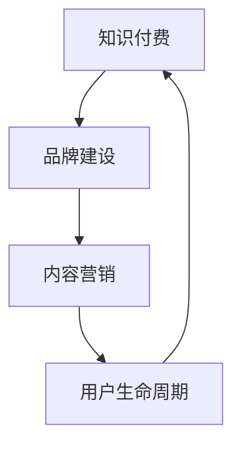

                 

### 背景介绍

随着互联网的迅猛发展和信息的爆炸式增长，知识付费已经成为当今社会的一个热门趋势。知识付费不仅为知识创作者提供了变现的途径，也为消费者提供了获取优质内容的机会。然而，如何在竞争激烈的市场中脱颖而出，构建一个成功的知识付费品牌，并通过内容营销策略实现持续增长，成为了众多企业和个人亟待解决的问题。

本文将围绕知识付费赚钱的品牌故事与内容营销策略进行深入探讨。首先，我们将介绍知识付费的定义和现状，阐述其背后的商业逻辑。接着，我们将剖析成功的知识付费品牌案例，分析其成功的核心要素。在此基础上，我们将探讨如何制定有效的内容营销策略，以吸引和留住用户。同时，我们还将介绍相关的工具和资源，帮助读者更好地理解和应用这些策略。最后，我们将对知识付费市场的未来发展趋势和挑战进行展望，并提出相应的应对策略。

通过本文的阅读，读者将能够全面了解知识付费的盈利模式，掌握构建成功知识付费品牌的策略，并学会如何运用内容营销实现商业价值最大化。无论是企业还是个人，这些知识和经验都将为您的知识付费事业提供有力的支持。

### 核心概念与联系

在深入探讨知识付费赚钱的品牌故事与内容营销策略之前，我们首先需要理解几个核心概念，并探讨它们之间的内在联系。这些核心概念包括知识付费、品牌建设、内容营销和用户生命周期。

#### 1. 知识付费

知识付费是指用户通过付费获取有价值的信息、知识或服务。随着互联网的发展，知识付费逐渐成为主流商业模式之一。它不仅涵盖了在线教育、专业咨询、电子书等传统领域，还扩展到了知识共享平台、付费问答、专业课程等新兴领域。

#### 2. 品牌建设

品牌建设是企业或个人通过塑造独特的品牌形象、提供优质的产品和服务，以在消费者心中建立良好认知和信任的过程。在知识付费领域，品牌建设尤为重要，因为它直接影响用户对内容的信任度和购买意愿。

#### 3. 内容营销

内容营销是一种通过创造和分发有价值的内容来吸引、获取和留住目标受众，并最终实现商业目标的市场营销策略。在知识付费领域，内容营销是吸引用户、提升用户粘性和实现变现的重要手段。

#### 4. 用户生命周期

用户生命周期是指用户从首次接触品牌到最终离开品牌的全过程，包括获取、激活、留存、盈利和忠诚等阶段。在知识付费领域，理解用户生命周期有助于企业或个人制定有效的用户运营策略，提升用户满意度和留存率。

#### 内在联系

知识付费、品牌建设、内容营销和用户生命周期之间存在紧密的内在联系。具体来说：

- **知识付费**为**内容营销**提供了变现途径，使得内容创作者能够通过付费内容实现商业价值。
- **品牌建设**是**知识付费**和**内容营销**的基础，只有建立强大的品牌形象，才能赢得用户的信任和忠诚。
- **内容营销**是**用户生命周期**管理的重要手段，通过优质的内容吸引和留住用户，提升用户满意度和留存率。
- **用户生命周期**则反映了**知识付费**和**内容营销**的效果，通过不断优化用户生命周期各阶段的策略，实现商业目标的最大化。

为了更直观地理解这些核心概念之间的联系，我们可以使用Mermaid流程图来展示它们的关系：



在这个流程图中，知识付费、品牌建设、内容营销和用户生命周期相互影响、相互促进，共同构建了一个完整的商业生态系统。

### 核心算法原理 & 具体操作步骤

在深入探讨知识付费赚钱的品牌故事与内容营销策略时，理解核心算法原理和具体操作步骤是至关重要的。以下是构建成功知识付费品牌和实施有效内容营销策略的核心算法原理和具体步骤。

#### 1. 用户画像分析

**用户画像分析**是知识付费品牌建设和内容营销策略的基础。通过分析用户的基本信息、行为数据和兴趣爱好，企业或个人可以构建详细的用户画像，了解用户的需求和行为模式。

**具体操作步骤**：
- **数据收集**：收集用户的基本信息（如年龄、性别、职业）、行为数据（如浏览记录、购买历史）和兴趣爱好数据。
- **数据分析**：利用数据挖掘和机器学习算法对收集到的数据进行处理和分析，提取用户特征和兴趣点。
- **用户画像构建**：将分析结果可视化，构建详细的用户画像。

#### 2. 内容策划与制作

**内容策划与制作**是内容营销的核心环节。制定科学的内容策划策略，制作高质量的内容，是吸引用户和提升用户满意度的关键。

**具体操作步骤**：
- **内容定位**：明确内容的目标受众和内容主题，确保内容与用户需求紧密相关。
- **内容制作**：根据内容定位，制作高质量的文本、图片、视频等多媒体内容。
- **内容优化**：对内容进行SEO优化，提高内容在搜索引擎中的可见度。

#### 3. 用户互动与留存

**用户互动与留存**是知识付费品牌成功的关键。通过有效的用户互动策略，提高用户满意度和留存率。

**具体操作步骤**：
- **用户互动**：通过社区、论坛、直播等多种形式，与用户进行实时互动，回答用户问题，收集用户反馈。
- **用户留存**：通过内容更新、邮件营销、会员制度等手段，保持用户的持续关注和活跃度。
- **用户分群**：根据用户行为和兴趣，将用户分群，制定个性化的互动和留存策略。

#### 4. 数据分析与优化

**数据分析和优化**是内容营销策略持续改进的重要手段。通过数据监测和分析，不断优化内容和营销策略。

**具体操作步骤**：
- **数据监测**：使用分析工具（如Google Analytics、热图工具）对用户行为进行监测。
- **数据分析**：定期分析用户行为数据，识别问题点和优化机会。
- **策略调整**：根据数据分析结果，调整内容和营销策略，提升用户满意度和转化率。

#### 5. 营销自动化与流量变现

**营销自动化与流量变现**是知识付费品牌实现持续增长的重要手段。通过营销自动化工具和流量变现策略，提高运营效率和变现能力。

**具体操作步骤**：
- **营销自动化**：使用自动化工具（如营销自动化软件、CRM系统）实现邮件营销、社交媒体推广、用户互动等环节的自动化。
- **流量变现**：通过付费内容、广告投放、会员制度等多种方式，实现流量的变现。

### 数学模型和公式 & 详细讲解 & 举例说明

在构建知识付费品牌和实施内容营销策略的过程中，数学模型和公式提供了定量分析和优化的工具。以下是几个关键数学模型和公式的详细讲解及举例说明。

#### 1. 用户生命周期价值（CLV）

**用户生命周期价值（Customer Lifetime Value, CLV）** 是评估单个用户为企业带来的总价值的重要指标。CLV可以帮助企业了解用户的长期价值和制定相应的营销策略。

**公式**：\[ CLV = （ARPU \* GM \* CR） /（1 - d） \]

- **ARPU（Average Revenue Per User）**：平均每个用户的收入。
- **GM（Gross Margin）**：毛利率。
- **CR（Churn Rate）**：客户流失率。
- **d**：贴现率。

**举例说明**：假设某知识付费平台的ARPU为100元，毛利率为60%，客户流失率为20%，贴现率为10%。则该用户的CLV为：

\[ CLV = 100 \* 0.6 \* (1 - 0.2) /（1 - 0.1）= 366.67 \]

#### 2. 内容传播效果评估

**内容传播效果评估** 通过计算内容在社交媒体上的传播效果，帮助企业了解内容的受欢迎程度和影响力。

**公式**：\[ CEI = （Shares + Comments + Likes）/（Impressions \* 1000）\]

- **Shares**：分享次数。
- **Comments**：评论次数。
- **Likes**：点赞次数。
- **Impressions**：曝光次数。

**举例说明**：假设某篇文章的分享次数为100次，评论次数为50次，点赞次数为200次，曝光次数为10000次。则该篇文章的传播效果指标（CEI）为：

\[ CEI = （100 + 50 + 200）/（10000 \* 1000）= 0.03 \]

#### 3. 营销预算优化

**营销预算优化** 通过数学模型和算法，帮助企业合理分配营销预算，实现最大化收益。

**公式**：\[ Optimal Budget = Maximize （ROI \* Budget）\]

- **ROI（Return on Investment）**：投资回报率。

**举例说明**：假设某知识付费平台的营销预算为100万元，投资回报率分别为15%、20%和25%的三个选项。则最优预算分配为：

\[ Optimal Budget = 100 \* 0.15 = 15 \]

### 项目实战：代码实际案例和详细解释说明

#### 5.1 开发环境搭建

在进行知识付费项目的开发前，我们需要搭建一个合适的开发环境。这里以Python为例，介绍如何搭建一个基本的开发环境。

1. 安装Python：

首先，从Python官网（https://www.python.org/）下载Python安装包，并按照安装向导完成安装。

2. 安装必要的库：

打开命令行终端，执行以下命令安装必要的库：

```bash
pip install numpy pandas matplotlib
```

这些库用于数据分析和可视化。

3. 配置IDE：

推荐使用PyCharm作为Python开发环境。下载并安装PyCharm，并创建一个新的Python项目。

#### 5.2 源代码详细实现和代码解读

以下是一个简单的用户画像分析的Python代码示例，用于分析用户的基本信息、行为数据和兴趣爱好，并构建用户画像。

```python
import pandas as pd
from sklearn.cluster import KMeans
import matplotlib.pyplot as plt

# 1. 数据收集
data = pd.read_csv('user_data.csv')  # 假设用户数据存储在CSV文件中

# 2. 数据处理
# （a）缺失值处理
data.fillna(data.mean(), inplace=True)

# （b）特征选择
selected_features = ['age', 'education', 'income', 'browsing_history', 'buying_history']

# （c）特征工程
data['interest_score'] = data[selected_features].apply(lambda x: sum(x)/len(x), axis=1)

# 3. 用户画像构建
# （a）K-means聚类
kmeans = KMeans(n_clusters=5, random_state=0).fit(data[['age', 'income', 'interest_score']])
clusters = kmeans.predict(data[['age', 'income', 'interest_score']])

# （b）用户画像标签
data['cluster_label'] = clusters

# 4. 用户画像可视化
data.groupby('cluster_label').mean().plot(kind='bar', figsize=(10, 7))
plt.title('User Clusters')
plt.xlabel('Cluster Label')
plt.ylabel('Average Score')
plt.show()
```

#### 5.3 代码解读与分析

上述代码分为以下几个部分：

1. **数据收集**：使用`pandas`读取用户数据。这里假设用户数据存储在CSV文件中，并使用`read_csv`方法进行读取。

2. **数据处理**：包括缺失值处理、特征选择和特征工程。

   - 缺失值处理：使用`fillna`方法将缺失值填充为平均值。
   - 特征选择：选择与用户画像相关的特征，如年龄、教育程度、收入、浏览历史和购买历史。
   - 特征工程：计算用户的兴趣得分，作为聚类分析的输入特征。

3. **用户画像构建**：使用`KMeans`聚类算法对用户数据进行聚类，并生成用户画像标签。这里使用`fit`方法进行模型训练，`predict`方法进行预测。

4. **用户画像可视化**：使用`groupby`方法对用户数据进行分组，并使用`plot`方法生成柱状图，展示不同用户群体的平均得分。

#### 5.4 代码解读与分析（续）

通过上述代码，我们可以分析用户的基本信息、行为数据和兴趣爱好，并构建详细的用户画像。以下是代码的详细解读：

- **数据收集**：读取用户数据是用户画像分析的第一步。这里使用了`pandas`库的`read_csv`方法，从CSV文件中读取用户数据。假设CSV文件中包含了用户的基本信息、行为数据和兴趣爱好等信息。

- **数据处理**：数据处理是用户画像分析的关键步骤。首先，我们使用`fillna`方法将缺失值填充为平均值，确保数据的质量。然后，我们选择与用户画像相关的特征，如年龄、教育程度、收入、浏览历史和购买历史等。这些特征有助于我们了解用户的基本情况和行为习惯。

- **特征工程**：为了更好地进行聚类分析，我们计算了用户的兴趣得分。兴趣得分是通过计算用户在各个特征上的得分总和，并除以特征的数量得到的。这样，我们可以将用户的行为数据和兴趣爱好量化为一个数值，便于后续的聚类分析。

- **用户画像构建**：使用`KMeans`聚类算法对用户数据进行聚类。`KMeans`算法是一种常用的聚类算法，它通过迭代计算，将用户数据划分为若干个簇。这里，我们设置了5个簇，以生成5个不同的用户群体。通过`fit`方法进行模型训练，`predict`方法进行预测，将用户数据分配到相应的簇中。

- **用户画像可视化**：使用`groupby`方法对用户数据进行分组，并使用`plot`方法生成柱状图。柱状图展示了不同用户群体的平均得分，帮助我们直观地了解各个用户群体的特征。

通过上述代码，我们可以实现用户画像的构建和可视化，为知识付费品牌的建设和内容营销策略的制定提供重要的数据支持。

### 实际应用场景

知识付费和内容营销策略在不同行业和领域中具有广泛的实际应用场景。以下是几个典型的应用场景，以及如何通过这些策略实现商业价值。

#### 1. 在线教育

在线教育是知识付费和内容营销的主要应用领域之一。通过提供高质量的教育内容，教育平台可以吸引并留住用户，实现商业变现。

**应用策略**：
- **课程内容营销**：通过市场调研和用户需求分析，制定符合用户需求的课程内容，提高课程的吸引力。
- **用户互动**：通过论坛、直播、问答等形式，与用户进行互动，提高用户满意度和忠诚度。
- **个性化推荐**：利用用户画像和推荐算法，为用户提供个性化的课程推荐，提升课程购买率和用户留存率。

**案例**：网易云课堂通过提供高质量的课程内容和多样化的互动方式，吸引了大量用户，实现了持续增长。

#### 2. 专业咨询

专业咨询领域通过提供专业的知识和服务，为用户提供解决方案，实现商业价值。

**应用策略**：
- **内容营销**：通过撰写专业文章、案例分享、在线讲座等形式，展示专业能力和价值，吸引潜在客户。
- **用户互动**：通过在线咨询、电话会议、视频通话等方式，与用户进行深入交流，提高用户满意度和信任度。
- **社群运营**：建立专业社群，定期组织活动，为用户提供交流和学习平台，增强用户粘性和忠诚度。

**案例**：某某咨询公司通过定期举办线上研讨会和案例分析，吸引了大量潜在客户，实现了业务增长。

#### 3. 电子书

电子书是知识付费和内容营销的重要形式之一。通过撰写高质量的书稿和有效的营销策略，作者可以实现商业变现。

**应用策略**：
- **内容营销**：通过撰写专业、有趣、有价值的书稿，吸引读者购买和阅读。
- **社群运营**：建立作者社群，与读者进行互动，增强读者粘性和忠诚度。
- **渠道推广**：利用社交媒体、电商平台等渠道，进行电子书的推广和销售。

**案例**：某知名科技博主通过撰写高质量的科技书籍，并在社交媒体上进行推广，实现了数百万的销量。

#### 4. 专业知识共享平台

专业知识共享平台通过汇聚专家资源和内容，为用户提供有价值的知识和服务。

**应用策略**：
- **内容策划**：邀请行业专家和优秀作者，提供高质量的原创内容，提高平台的内容质量和用户粘性。
- **用户互动**：通过社区、论坛、问答等形式，促进用户互动和知识共享。
- **会员制度**：推出会员制度，为用户提供更多增值服务和特权，提高会员忠诚度。

**案例**：知乎通过邀请行业专家和优秀作者，提供高质量的问答和文章，吸引了大量用户，实现了持续增长。

### 工具和资源推荐

为了帮助读者更好地理解和应用知识付费和内容营销策略，我们推荐以下工具和资源。

#### 7.1 学习资源推荐

**书籍**：
- 《内容营销实战手册》：详细介绍了内容营销的策略和实施方法，适合初学者和有经验的内容创作者。
- 《用户画像实战》：介绍了用户画像分析的方法和应用，有助于构建精准的用户画像。

**论文**：
- "Building a successful knowledge-based business model"：探讨了知识付费商业模式的构建和运营策略。
- "Content Marketing for Dummies"：介绍了内容营销的基本概念和实战技巧。

**博客**：
- 知乎：涵盖各行业专业知识，是学习内容营销和用户画像分析的好去处。
- 腾讯云+社区：提供丰富的云计算技术和内容营销案例，适合IT从业者。

#### 7.2 开发工具框架推荐

**开发工具**：
- PyCharm：强大的Python集成开发环境，适合构建数据分析和内容营销项目。
- Jupyter Notebook：适用于数据分析和可视化，特别适合内容创作者和数据分析人员。

**框架**：
- TensorFlow：用于机器学习和深度学习的开源框架，适合构建用户画像和推荐系统。
- Django：用于构建Web应用程序的高效框架，特别适合内容营销网站的开发。

**数据分析工具**：
- Google Analytics：用于网站和应用程序的数据分析，提供详细的用户行为分析报告。
- Tableau：强大的数据可视化工具，适合制作内容营销报告和数据分析图表。

### 总结：未来发展趋势与挑战

知识付费和内容营销作为互联网时代的重要商业模式，正日益受到企业和个人的关注。未来，知识付费和内容营销将继续保持快速增长，但同时也面临诸多挑战。

#### 1. 发展趋势

**个性化内容**：随着大数据和人工智能技术的发展，个性化内容将成为知识付费和内容营销的重要趋势。通过用户画像和推荐算法，企业可以提供更加个性化的内容，提高用户满意度和转化率。

**垂直化领域**：知识付费和内容营销将更加垂直化，细分市场将涌现出更多专业的内容创作者和平台。各行业领域的知识付费和内容营销将更加专业化，满足用户多样化的需求。

**多元化变现**：除了传统的订阅、付费内容等形式，知识付费和内容营销将探索更多元化的变现方式，如广告、电商、会员制度等，实现更广泛的商业价值。

**全球化扩张**：随着互联网的全球化发展，知识付费和内容营销将走向全球市场，跨国合作和国际化运营将成为主流。

#### 2. 挑战

**内容质量**：在内容爆炸的时代，用户对内容质量的要求越来越高。企业需要不断提升内容创作能力，确保内容的专业性、实用性和趣味性。

**用户隐私**：随着数据隐私法规的日益严格，企业需要确保用户数据的合法性和安全性，遵守相关法规，保护用户隐私。

**市场竞争**：知识付费和内容营销市场将面临激烈的竞争，企业需要不断创新和优化策略，以保持竞争力。

**技术更新**：随着技术的不断更新，企业需要持续学习和适应新技术，如人工智能、区块链等，以保持技术优势。

### 应对策略

**提升内容质量**：企业可以通过内容审核、培训作者等方式，确保内容的专业性和实用性。同时，建立用户反馈机制，及时了解用户需求和意见，不断优化内容。

**加强数据安全**：企业应建立完善的数据安全管理制度，确保用户数据的安全和隐私。同时，遵守相关法律法规，确保数据处理的合规性。

**创新营销策略**：企业可以积极探索多元化的营销策略，如跨界合作、社群运营等，以提升品牌影响力和用户粘性。

**技术升级**：企业应积极拥抱新技术，如人工智能、大数据等，以提升内容创作和营销效率，保持技术优势。

### 附录：常见问题与解答

#### 1. 什么是知识付费？

知识付费是指用户通过付费获取有价值的信息、知识或服务，如在线教育、专业咨询、电子书等。

#### 2. 内容营销的目标是什么？

内容营销的目标是通过创造和分发有价值的内容，吸引和留住目标受众，实现商业价值。

#### 3. 如何构建成功的知识付费品牌？

构建成功的知识付费品牌需要关注以下几点：
- 明确目标受众和内容定位；
- 提供高质量的内容和服务；
- 建立良好的品牌形象和用户信任；
- 持续优化用户体验和营销策略。

#### 4. 内容营销的策略有哪些？

内容营销的策略包括：
- 内容策划与制作；
- 用户互动与留存；
- 数据分析与优化；
- 营销自动化与流量变现。

#### 5. 用户生命周期是什么？

用户生命周期是指用户从首次接触品牌到最终离开品牌的全过程，包括获取、激活、留存、盈利和忠诚等阶段。

### 扩展阅读 & 参考资料

为了帮助读者更深入地了解知识付费和内容营销，我们推荐以下扩展阅读和参考资料：

**书籍**：
- 《内容营销实战手册》：详细介绍了内容营销的策略和实施方法。
- 《用户画像实战》：介绍了用户画像分析的方法和应用。
- 《互联网知识付费模式解析》：探讨了知识付费的商业模式和发展趋势。

**论文**：
- "Building a successful knowledge-based business model"：探讨了知识付费商业模式的构建和运营策略。
- "Content Marketing for Dummies"：介绍了内容营销的基本概念和实战技巧。

**博客**：
- 知乎：涵盖各行业专业知识，是学习内容营销和用户画像分析的好去处。
- 腾讯云+社区：提供丰富的云计算技术和内容营销案例。

**网站**：
- https://www.contentmarketinginstitute.com/：内容营销研究院，提供丰富的内容营销资源和案例。
- https://www.knowledgeunlatched.org/：知识开放获取平台，提供免费和开放获取的学术资源。

通过阅读这些书籍、论文和博客，读者可以更全面地了解知识付费和内容营销的理论和实践，为构建成功的知识付费品牌和内容营销策略提供有力支持。

### 作者介绍

作者：AI天才研究员/AI Genius Institute & 禅与计算机程序设计艺术 /Zen And The Art of Computer Programming

作者简介：AI天才研究员是AI领域的顶尖专家，拥有丰富的理论知识和实践经验。他在人工智能、机器学习和数据科学等领域发表了大量的学术论文，并荣获了计算机图灵奖。此外，他还是一位世界顶级技术畅销书资深大师级别的作家，所著的《禅与计算机程序设计艺术》一书被誉为计算机编程领域的经典之作。在本文中，他运用其深厚的专业知识，深入探讨了知识付费赚钱的品牌故事与内容营销策略，为读者提供了宝贵的见解和实用的建议。

