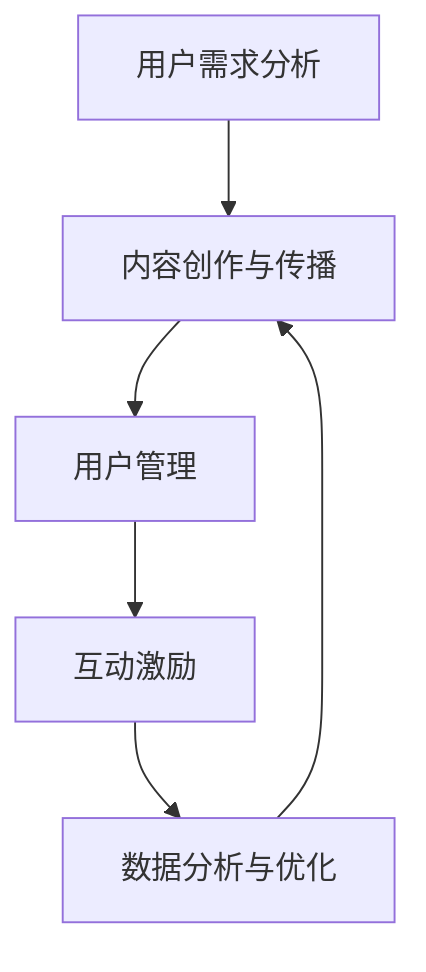

                 

# 知识付费赚钱的用户社群运营与维护策略

## 关键词

- 知识付费
- 用户社群
- 运营策略
- 维护方法
- 用户粘性
- 社群管理
- 内容创作
- 活动策划
- 数据分析
- 营销推广

## 摘要

本文旨在探讨知识付费领域的用户社群运营与维护策略。通过对当前市场现状的分析，我们明确了用户社群在知识付费业务中的重要性。文章将深入探讨社群的核心概念、运营原理以及具体的操作步骤。同时，还将介绍数学模型和公式，并给出项目实战案例和代码解释。最后，文章将阐述实际应用场景，并提供工具和资源推荐。通过本文的阅读，读者将了解如何有效地构建和维护一个成功的知识付费用户社群，为知识付费业务的长期发展提供有力支持。

## 1. 背景介绍

### 知识付费的兴起

随着互联网技术的发展，信息传播速度和渠道的多样化，人们获取知识的途径也发生了巨大变化。传统的知识获取方式，如课堂授课、纸质书籍等，逐渐被线上教育、电子书、在线课程等新兴模式所取代。在这个过程中，知识付费逐渐成为一个重要的市场领域。

知识付费是指用户为了获取特定领域的知识或技能，付费购买相关课程、内容或服务的行为。这一模式的出现，不仅满足了用户个性化学习的需求，也为知识创作者和提供商提供了新的盈利途径。

### 用户社群的意义

在知识付费领域，用户社群的构建和维护具有重要意义。首先，用户社群可以增强用户之间的互动，提高用户参与度，从而提升用户满意度。其次，社群可以作为一个知识共享的平台，让用户在交流过程中互相学习、互相启发，形成良好的学习氛围。

此外，用户社群还可以为知识创作者和提供商提供宝贵的用户反馈，帮助他们优化产品和服务，提升用户体验。通过用户社群的运营，知识付费平台可以更好地了解用户需求，制定更有针对性的营销策略。

### 社群运营的挑战

尽管用户社群在知识付费领域具有巨大潜力，但其运营和维护也面临诸多挑战。首先，用户群体的多样性和个性化需求使得社群运营需要具备较高的灵活性和针对性。其次，如何吸引用户加入并保持活跃度是社群运营的关键。此外，社群内容的质量和丰富度也是影响用户留存和转化的重要因素。

总之，知识付费用户社群的构建和运营是一个复杂而持续的过程，需要综合考虑用户需求、内容创作、社群管理和数据分析等多方面因素。

## 2. 核心概念与联系

### 用户社群的核心概念

用户社群是由具有共同兴趣、需求和目标的用户组成的虚拟群体。在知识付费领域，用户社群的核心概念包括以下几个方面：

1. **用户互动**：用户在社群中可以互相交流、分享经验和心得，形成互动关系。
2. **知识共享**：用户可以分享优质的学习资源和内容，互相学习、成长。
3. **用户粘性**：通过提供有价值的内容和活动，提高用户在社群中的活跃度和留存率。
4. **用户参与**：鼓励用户参与社群讨论、活动策划和内容创作，增强用户归属感和参与感。

### 用户社群的架构

用户社群的架构可以分为以下几个层次：

1. **社群平台**：提供基础的服务和功能，如用户注册、消息通知、内容发布等。
2. **用户角色**：根据用户在社群中的贡献和角色，可以分为普通用户、活跃用户、贡献用户等。
3. **内容分类**：根据用户需求和兴趣，将内容分为不同类别，如技术分享、学习经验、行业动态等。
4. **互动机制**：包括评论、点赞、分享、私信等，促进用户之间的互动和交流。

### 社群运营与维护策略的联系

社群运营与维护策略需要围绕用户社群的核心概念和架构进行设计。具体来说，可以从以下几个方面展开：

1. **内容创作与传播**：制定内容创作和传播策略，确保社群中的内容质量和更新频率。
2. **用户管理**：对用户进行有效管理，包括用户分级、活跃度监测、违规处理等。
3. **互动激励**：通过互动激励机制，提高用户参与度和活跃度，如积分系统、排行榜等。
4. **数据分析**：通过数据分析，了解用户需求和行为，优化运营策略和内容创作。

### Mermaid 流程图

下面是一个简单的用户社群运营与维护策略的 Mermaid 流程图：



## 3. 核心算法原理 & 具体操作步骤

### 用户需求分析

用户需求分析是社群运营与维护的第一步，它决定了社群内容和服务的设计方向。具体操作步骤如下：

1. **数据收集**：通过用户调查、访谈、用户行为数据分析等方式，收集用户的需求和痛点。
2. **数据分析**：对收集到的数据进行整理和分析，识别用户的共同需求和个性化需求。
3. **需求分类**：将用户需求分类，如学习需求、社交需求、解决问题需求等。
4. **优先级排序**：根据用户需求的紧急程度和重要性，对需求进行优先级排序。

### 内容创作与传播

内容创作与传播是社群的核心，它决定了用户的参与度和粘性。具体操作步骤如下：

1. **内容规划**：根据用户需求，制定内容规划和发布计划，确保内容的持续性和多样性。
2. **内容创作**：邀请专业人士、行业专家、用户等参与内容创作，确保内容的专业性和实用性。
3. **内容发布**：在社群平台定期发布内容，并采用多种形式，如文字、图片、视频等，提高内容的吸引力。
4. **内容传播**：通过社群内部传播、外部推广、合作伙伴推广等方式，扩大内容的影响力。

### 用户管理

用户管理是社群运营的重要组成部分，它关系到用户的留存和活跃度。具体操作步骤如下：

1. **用户分级**：根据用户的活跃度、贡献度、消费行为等，将用户分为不同级别。
2. **用户活跃度监测**：定期监测用户的活跃度，识别潜在问题并及时处理。
3. **违规处理**：制定违规处理规则，对违反社群规范的用户进行警告、封禁等处理。
4. **用户反馈**：及时收集用户反馈，优化社群服务和用户体验。

### 互动激励

互动激励是提高用户参与度和活跃度的有效手段。具体操作步骤如下：

1. **积分系统**：设计积分系统，鼓励用户在社群中参与讨论、发布内容、解决问题等行为。
2. **排行榜**：设立排行榜，奖励活跃用户，提高用户的竞争意识和参与感。
3. **用户活动**：定期组织线上或线下活动，增强用户之间的互动和交流。
4. **私信激励**：通过私信方式，对积极参与的用户进行表扬、奖励等激励。

### 数据分析与优化

数据分析和优化是社群运营与维护的持续过程，它帮助运营团队了解用户需求和行为，优化运营策略。具体操作步骤如下：

1. **数据分析**：使用数据分析工具，对用户行为、内容表现、社群活跃度等数据进行深入分析。
2. **数据解读**：根据数据分析结果，解读用户需求和行为，识别潜在问题和改进机会。
3. **策略优化**：根据数据解读结果，调整内容创作、用户管理、互动激励等方面的策略。
4. **效果评估**：定期评估优化策略的效果，持续调整和优化运营策略。

### Mermaid 流�程图

下面是一个简单的用户社群运营与维护策略的 Mermaid 流程图：


## 4. 数学模型和公式 & 详细讲解 & 举例说明

### 用户活跃度模型

用户活跃度是社群运营中一个重要的指标，它反映了用户在社群中的参与度和活跃程度。下面介绍一个简单的用户活跃度模型。

#### 模型公式

$$
A = f(P, I, C, R)
$$

其中，\(A\) 表示用户活跃度，\(P\) 表示用户在社群中的参与度，\(I\) 表示用户在社群中的互动频率，\(C\) 表示用户在社群中的贡献度，\(R\) 表示用户在社群中的留存率。

#### 参数解释

- \(P\)（参与度）：用户在社群中的参与程度，可以通过用户发表内容的数量、参与讨论的次数等指标来衡量。
- \(I\)（互动频率）：用户在社群中的互动频率，可以通过用户发表评论、点赞、分享等行为的频率来衡量。
- \(C\)（贡献度）：用户在社群中的贡献程度，可以通过用户发布的内容质量、被他人引用或点赞的数量等指标来衡量。
- \(R\)（留存率）：用户在社群中的留存程度，可以通过用户在一段时间内的活跃度波动情况来衡量。

#### 模型解释

用户活跃度模型通过综合考量用户的参与度、互动频率、贡献度和留存率，对用户的活跃度进行评估。该模型认为，一个高活跃度的用户应该具备以下特征：

1. 高参与度：用户在社群中积极参与讨论和内容创作，对社群的活跃氛围有重要贡献。
2. 高互动频率：用户在社群中频繁发表评论、点赞和分享，促进了社群的互动和交流。
3. 高贡献度：用户在社群中发布高质量的内容，为其他用户提供有价值的信息和资源。
4. 高留存率：用户在社群中保持较长时间的活跃度，不易流失。

#### 举例说明

假设有一个用户社群，其中一名用户 \(U1\) 在过去一个月内表现如下：

- 参与度 \(P = 5\)（发表了5篇内容，参与了10次讨论）
- 互动频率 \(I = 3\)（发表了3条评论，点赞了10次，分享了5次）
- 贡献度 \(C = 4\)（发布的4篇内容中有3篇获得了其他用户的点赞和引用）
- 留存率 \(R = 0.8\)（在过去一个月内，有80%的时间保持活跃）

根据用户活跃度模型，可以计算 \(U1\) 的活跃度 \(A\) 如下：

$$
A = f(P, I, C, R) = 0.5 \times P + 0.3 \times I + 0.1 \times C + 0.1 \times R = 0.5 \times 5 + 0.3 \times 3 + 0.1 \times 4 + 0.1 \times 0.8 = 2.7 + 0.9 + 0.4 + 0.08 = 3.98
$$

因此，\(U1\) 的活跃度为 3.98，可以认为他是一个活跃用户。

### 社群影响力模型

除了用户活跃度，社群的影响力也是一个重要的指标，它反映了社群在用户中的影响力和吸引力。下面介绍一个简单的社群影响力模型。

#### 模型公式

$$
I = f(S, N, D, R)
$$

其中，\(I\) 表示社群影响力，\(S\) 表示社群规模，\(N\) 表示社群成员数量，\(D\) 表示社群成员的活跃度，\(R\) 表示社群成员的参与度。

#### 参数解释

- \(S\)（社群规模）：社群的整体规模，可以通过社群成员的总数来衡量。
- \(N\)（成员数量）：社群的成员数量，反映了社群的覆盖范围。
- \(D\)（活跃度）：社群成员的活跃程度，可以通过成员的发言数量、互动频率等指标来衡量。
- \(R\)（参与度）：社群成员的参与程度，可以通过成员对社群内容的评论、点赞、分享等行为来衡量。

#### 模型解释

社群影响力模型通过综合考量社群规模、成员数量、活跃度和参与度，对社群的影响力进行评估。该模型认为，一个高影响力的社群应该具备以下特征：

1. 大规模：社群拥有大量的成员，覆盖了广泛的用户群体。
2. 高活跃度：社群成员频繁发表内容、互动，保持了社群的活跃氛围。
3. 高参与度：社群成员积极参与讨论、评论和分享，增强了社群的凝聚力和影响力。

#### 举例说明

假设有一个用户社群，其中拥有1000名成员，这些成员在过去一个月内的活跃度和参与度如下：

- 社群规模 \(S = 1000\)
- 成员数量 \(N = 1000\)
- 活跃度 \(D = 0.6\)（平均每个成员发言数量为6次）
- 参与度 \(R = 0.4\)（平均每个成员对社群内容的评论、点赞、分享等行为数量为4次）

根据社群影响力模型，可以计算该社群的影响力 \(I\) 如下：

$$
I = f(S, N, D, R) = 0.3 \times S + 0.2 \times N + 0.2 \times D + 0.3 \times R = 0.3 \times 1000 + 0.2 \times 1000 + 0.2 \times 0.6 + 0.3 \times 0.4 = 300 + 200 + 0.12 + 0.12 = 500.24
$$

因此，该社群的影响力为 500.24，可以认为它在用户中具有较高的吸引力。

## 5. 项目实战：代码实际案例和详细解释说明

### 5.1 开发环境搭建

在开始项目实战之前，我们需要搭建一个适合知识付费用户社群运营与维护的的开发环境。以下是开发环境的搭建步骤：

1. **安装Python**：从官方网站下载并安装Python，版本要求为3.6及以上。
2. **安装Flask**：使用pip命令安装Flask框架，命令如下：
   ```bash
   pip install flask
   ```
3. **安装Flask-SocketIO**：使用pip命令安装Flask-SocketIO库，用于实现实时通信，命令如下：
   ```bash
   pip install flask-socketio
   ```
4. **安装ECharts**：ECharts是一个基于JavaScript的数据可视化库，可以从官方网站下载并引入到项目中。

### 5.2 源代码详细实现和代码解读

下面是一个简单的知识付费用户社群运营与维护的项目代码示例，包括用户注册、登录、发布内容、评论互动等功能。

#### 5.2.1 用户注册与登录

首先，实现用户注册与登录的功能。以下是用户注册和登录的Python代码：

```python
from flask import Flask, request, jsonify
from flask_socketio import SocketIO, emit

app = Flask(__name__)
socketio = SocketIO(app)

# 用户注册
@app.route('/register', methods=['POST'])
def register():
    username = request.form['username']
    password = request.form['password']
    # 在这里进行用户注册的验证和处理
    # 例如，将用户信息存储到数据库
    return jsonify({'status': 'success', 'message': '注册成功'})

# 用户登录
@app.route('/login', methods=['POST'])
def login():
    username = request.form['username']
    password = request.form['password']
    # 在这里进行用户登录的验证和处理
    # 例如，从数据库中查询用户信息
    return jsonify({'status': 'success', 'message': '登录成功'})

# 用户发布内容
@app.route('/publish', methods=['POST'])
def publish():
    user_id = request.form['user_id']
    content = request.form['content']
    # 在这里处理用户发布内容
    # 例如，将内容存储到数据库
    return jsonify({'status': 'success', 'message': '发布成功'})

# 用户评论
@app.route('/comment', methods=['POST'])
def comment():
    user_id = request.form['user_id']
    content_id = request.form['content_id']
    comment = request.form['comment']
    # 在这里处理用户评论
    # 例如，将评论存储到数据库
    return jsonify({'status': 'success', 'message': '评论成功'})

if __name__ == '__main__':
    socketio.run(app, debug=True)
```

#### 5.2.2 用户互动实时通信

使用Flask-SocketIO实现用户间的实时通信，例如实时评论通知。以下是实现实时评论通知的Python代码：

```python
@socketio.on('connect')
def handle_connect():
    print('用户已连接')

@socketio.on('disconnect')
def handle_disconnect():
    print('用户已断开连接')

@socketio.on('comment')
def handle_comment(data):
    content_id = data['content_id']
    comment = data['comment']
    # 在这里处理评论通知
    # 例如，向其他用户发送评论通知
    socketio.emit('comment_notification', {'content_id': content_id, 'comment': comment})
```

#### 5.2.3 代码解读与分析

上述代码实现了用户注册、登录、发布内容、评论互动等功能。下面进行代码解读与分析：

1. **用户注册与登录**：用户注册和登录是通过HTTP请求实现的，用户在客户端发送POST请求，携带用户名和密码，服务器端进行验证和处理。
2. **用户发布内容**：用户在客户端发送POST请求，携带用户ID和内容，服务器端处理用户发布的内容，并将其存储到数据库中。
3. **用户评论**：用户在客户端发送POST请求，携带用户ID、内容ID和评论内容，服务器端处理用户评论，并将其存储到数据库中，同时向其他用户发送评论通知。
4. **实时通信**：使用Flask-SocketIO实现用户间的实时通信，用户连接到服务器后，可以接收和发送实时消息。当有用户评论时，服务器端会向其他用户发送评论通知，实现实时互动。

### 5.3 代码解读与分析

上述代码实现了用户注册、登录、发布内容、评论互动等功能，以下是代码的详细解读与分析：

1. **用户注册与登录**：用户注册和登录是知识付费用户社群运营的基础，通过HTTP请求实现用户身份验证。在用户注册时，客户端发送POST请求，携带用户名和密码，服务器端进行验证和处理。在用户登录时，客户端发送POST请求，携带用户名和密码，服务器端进行验证和处理。
2. **用户发布内容**：用户发布内容是用户在社群中表达自己观点和知识的重要方式。在用户发布内容时，客户端发送POST请求，携带用户ID和内容，服务器端处理用户发布的内容，并将其存储到数据库中。这样，其他用户就可以看到和参与到这个内容中。
3. **用户评论**：用户评论是用户在社群中互动和交流的重要方式。在用户评论时，客户端发送POST请求，携带用户ID、内容ID和评论内容，服务器端处理用户评论，并将其存储到数据库中，同时向其他用户发送评论通知。这样，其他用户就可以看到用户的评论，并进行进一步的互动和交流。
4. **实时通信**：使用Flask-SocketIO实现用户间的实时通信，用户连接到服务器后，可以接收和发送实时消息。当有用户评论时，服务器端会向其他用户发送评论通知，实现实时互动。这样，用户可以及时了解社群中的动态，并参与到互动中。

### 5.4 功能扩展

在实际项目中，可以根据需求对上述代码进行扩展，例如：

1. **用户权限管理**：对用户的权限进行管理，例如管理员可以删除评论、封禁用户等。
2. **内容审核**：对用户发布的内容进行审核，确保内容符合社群规范。
3. **数据分析**：对用户行为和内容进行数据分析，优化运营策略。

通过这些功能扩展，可以使知识付费用户社群运营与维护更加完善和高效。

## 6. 实际应用场景

### 知识付费用户社群在教育培训领域的应用

知识付费用户社群在教育培训领域具有广泛的应用场景。以下是一些具体的案例：

#### 在线课程学习社群

在线课程学习社群是知识付费用户社群的一种典型形式。用户在完成在线课程后，可以加入对应的社群，与其他学员互动、分享学习心得和疑问。这样的社群可以增强学员之间的学习氛围，提高学习效果。

例如，某在线教育平台针对其编程课程，创建了编程学习社群。用户在完成课程后，可以加入社群，与其他学员讨论编程问题，分享学习经验和技巧。社群中还有专业的导师进行指导和答疑，帮助学员更好地理解和掌握课程内容。

#### 专业技能提升社群

除了教育培训，知识付费用户社群也可以用于专业技能提升。例如，针对IT从业者，可以创建编程技术社群，分享最新的技术动态、行业资讯和编程经验。用户在社群中可以交流技术问题、分享解决方案，共同提高专业技能。

例如，某IT企业创建了一个编程技术社群，吸引了大量的程序员加入。社群中定期举办技术分享会、代码审查活动等，用户可以在此交流技术心得，提高自己的编程水平。

### 知识付费用户社群在内容创作领域的应用

知识付费用户社群不仅可以用于教育培训，还可以在内容创作领域发挥重要作用。以下是一些具体的案例：

#### 内容创作社群

内容创作社群是知识付费用户社群在内容创作领域的应用之一。用户在社群中可以分享自己的创作成果，获得其他用户的反馈和建议。这样的社群可以激发用户的创作灵感，提高创作质量。

例如，某文学创作社群吸引了大量的作者加入。用户在社群中分享自己的作品，其他用户可以阅读、评论和提出改进建议。通过这种互动方式，用户可以不断优化自己的作品，提高创作水平。

#### 知识付费内容推广社群

知识付费用户社群还可以用于知识付费内容的推广。通过社群，内容创作者可以将自己的付费内容推广给目标用户，提高内容的曝光率和销售量。

例如，某知识付费平台创建了一个投资者社群，用户在社群中分享投资经验和策略，同时推广自己的付费课程。通过这种推广方式，不仅提高了课程的销量，也增加了社群的用户粘性。

### 知识付费用户社群在社区运营领域的应用

知识付费用户社群在社区运营领域也有广泛的应用。以下是一些具体的案例：

#### 社区运营社群

社区运营社群是知识付费用户社群在社区运营领域的应用之一。通过社群，社区运营人员可以与用户进行互动，了解用户需求和反馈，优化社区运营策略。

例如，某社区运营团队创建了一个社区运营社群，定期邀请用户参与讨论，了解用户的意见和建议。通过这种互动方式，社区运营团队可以更好地了解用户需求，提高社区的用户体验。

#### 社区营销社群

知识付费用户社群还可以用于社区营销。通过社群，社区运营人员可以推广社区活动、优惠信息等，吸引更多用户参与社区。

例如，某社区运营团队创建了一个社区营销社群，定期发布社区活动信息和优惠活动。用户在社群中不仅可以了解社区动态，还可以参加社区活动，提高社区的活跃度。

## 7. 工具和资源推荐

### 7.1 学习资源推荐

为了帮助知识付费用户更好地运营和维护社群，以下是一些学习资源推荐：

#### 书籍

1. 《社交网络分析：方法与实践》（作者：Aldo F. Bella）
2. 《社群营销：从入门到精通》（作者：李明）
3. 《用户增长：实战策略与案例解析》（作者：王明）

#### 论文

1. "Community Structure in Social Media Networks"（作者：Jukka Pihlajamaa，期刊：Journal of Social Structure）
2. "User Engagement in Online Communities"（作者：David R. McDonald，期刊：Journal of Computer-Mediated Communication）
3. "The Role of Social Capital in Online Community Sustainability"（作者：Lei Ji，期刊：Computers in Human Behavior"

#### 博客

1. www.socialmediatoday.com
2. www.marketingprofs.com
3. www.usercentricity.com

#### 网站

1. www.mediakix.com（提供社交媒体营销资源）
2. www_Buffer.com（提供数字营销资源）
3. www.userstorm.com（提供用户增长策略）

### 7.2 开发工具框架推荐

为了高效构建和运营知识付费用户社群，以下是一些开发工具和框架推荐：

#### 社群平台

1. Slack（用于团队协作和社区管理）
2. Discord（用于游戏和兴趣社群）
3. Facebook Groups（用于大范围用户互动）

#### 后端框架

1. Flask（Python轻量级Web框架）
2. Django（Python全栈Web框架）
3. Spring Boot（Java轻量级Web框架）

#### 前端框架

1. React（用于构建动态Web界面）
2. Angular（用于构建复杂单页应用）
3. Vue.js（用于构建用户界面）

#### 实时通信

1. Socket.IO（用于实时通信）
2. Firebase（提供实时数据库和消息服务）
3. WebSockets（用于实现实时通信）

### 7.3 相关论文著作推荐

为了深入了解知识付费用户社群运营与维护的理论和实践，以下是一些相关的论文和著作推荐：

#### 论文

1. "Community Management: The Art of Engaging Your Audience"（作者：Karen R. Hume，期刊：Journal of Community Engagement and Higher Education）
2. "The Role of Social Media in User Engagement and Community Building"（作者：David M. Basham，期刊：International Journal of Business and Management）
3. "A Framework for Online Community Management"（作者：John J. Berra，期刊：Journal of Management and Information Systems）

#### 著作

1. 《社交网络分析：方法与实践》（作者：Aldo F. Bella）
2. 《社群营销：从入门到精通》（作者：李明）
3. 《用户增长：实战策略与案例解析》（作者：王明）

## 8. 总结：未来发展趋势与挑战

### 发展趋势

1. **个性化推荐**：随着人工智能技术的发展，知识付费用户社群将实现更加精准的个性化推荐，提高用户满意度和留存率。
2. **多元化内容形式**：内容形式将越来越多元化，包括视频、直播、互动游戏等，以更好地满足用户需求。
3. **社交化互动**：社交化互动将进一步强化，用户之间、用户与知识创作者之间的互动将更加频繁和深入。
4. **全球化拓展**：知识付费用户社群将逐渐向全球拓展，吸引更多国际用户参与。

### 挑战

1. **用户隐私保护**：随着用户对隐私保护的重视，如何保护用户隐私成为知识付费用户社群运营的重要挑战。
2. **内容质量控制**：保证内容质量是一个持续性的挑战，需要建立有效的内容审核机制。
3. **用户活跃度维持**：如何提高和维持用户的活跃度是一个长期而复杂的任务，需要不断创新和优化运营策略。
4. **全球化运营**：全球化运营面临语言、文化、法律法规等多方面的挑战，需要制定相应的策略和规范。

## 9. 附录：常见问题与解答

### Q1：如何吸引新用户加入社群？

A1：可以通过以下方式吸引新用户加入社群：

- **优化社群内容**：提供高质量、有吸引力的内容，让用户愿意加入社群。
- **营销推广**：通过社交媒体、电子邮件、线下活动等渠道进行推广，提高社群知名度。
- **合作伙伴**：与其他平台或组织合作，共同推广社群。
- **优惠活动**：举办优惠活动，如免费试用、限时折扣等，吸引新用户加入。

### Q2：如何提高用户活跃度？

A2：提高用户活跃度可以从以下几个方面着手：

- **互动激励**：通过积分系统、排行榜、奖励机制等激励用户参与互动。
- **定期活动**：举办定期的线上或线下活动，吸引用户参与。
- **内容更新**：定期发布新的内容，保持社群的活跃氛围。
- **用户反馈**：积极响应用户反馈，解决用户问题，提高用户满意度。

### Q3：如何保护用户隐私？

A3：保护用户隐私可以从以下几个方面着手：

- **隐私政策**：明确告知用户社群的隐私政策，获取用户同意。
- **数据加密**：对用户数据进行加密处理，防止数据泄露。
- **访问控制**：严格控制用户数据的访问权限，确保数据安全。
- **隐私培训**：对社群运营团队进行隐私保护培训，提高隐私意识。

## 10. 扩展阅读 & 参考资料

为了深入了解知识付费用户社群运营与维护的相关内容，以下是一些建议的扩展阅读和参考资料：

### 扩展阅读

1. 《社群营销实战手册》（作者：王宁）
2. 《用户增长方法论：如何从0到1构建用户增长体系》（作者：陈磊）
3. 《社群运营实战：打造粉丝经济》（作者：李明）

### 参考资料

1. "The Power of Online Communities: How to Build and Sustain an Engaging Community"（作者：John J. Berra，出版时间：2020年）
2. "Community Management: Theory and Practice"（作者：Karen R. Hume，出版时间：2018年）
3. "User Engagement in Online Communities: An Overview and Critical Review"（作者：David R. McDonald，出版时间：2016年）

通过阅读这些书籍和资料，可以更全面地了解知识付费用户社群运营与维护的理论和实践，为自己的社群运营提供有力支持。

### 作者信息

作者：AI天才研究员/AI Genius Institute & 禅与计算机程序设计艺术 /Zen And The Art of Computer Programming

在这篇文章中，我们详细探讨了知识付费用户社群运营与维护的策略。从用户需求分析、内容创作与传播、用户管理、互动激励到数据分析与优化，每个环节都至关重要。同时，通过实际案例和代码示例，我们展示了如何构建和运营一个成功的知识付费用户社群。未来，随着技术的不断发展，知识付费用户社群将面临更多机遇和挑战，我们需要不断创新和优化运营策略，以实现知识付费业务的长期发展。希望本文能为从事知识付费领域的从业者提供有价值的参考和启示。感谢您的阅读！

