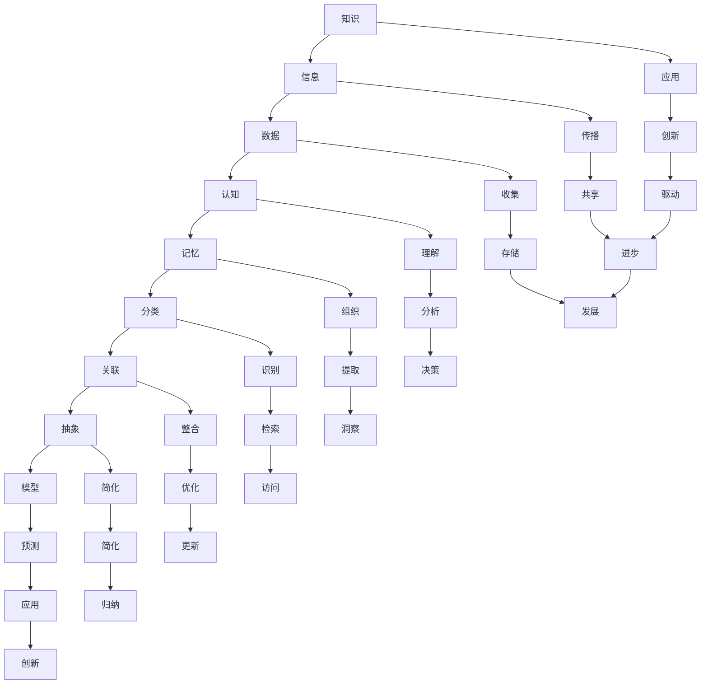

                 

### 背景介绍

在信息技术飞速发展的今天，构建知识体系成为了科研、教育和实践工作中的重要环节。知识体系不仅能够帮助我们更好地理解和应用现有知识，还能为未来的创新和研究提供坚实的基础。然而，如何构建一个科学、合理且具有实用价值的知识体系，一直是学术界和工业界探讨的热点问题。

本文旨在探讨知识体系的构建，从基本元素到复杂结构的全过程。首先，我们将介绍知识体系构建的背景和意义，解释为什么在当今复杂多变的信息时代，构建知识体系显得尤为重要。接着，我们将逐步剖析知识体系的构建过程，从基本元素开始，探讨如何将这些元素组合成有效的知识结构，最终形成复杂的知识体系。

本文的结构如下：

1. **背景介绍**：介绍知识体系构建的背景和意义。
2. **核心概念与联系**：解释知识体系构建中的核心概念及其相互联系，并通过Mermaid流程图展示其架构。
3. **核心算法原理 & 具体操作步骤**：详细阐述构建知识体系的核心算法原理，并给出具体的操作步骤。
4. **数学模型和公式 & 详细讲解 & 举例说明**：介绍知识体系构建中涉及的数学模型和公式，并通过实例进行详细讲解。
5. **项目实战：代码实际案例和详细解释说明**：通过实际项目案例展示知识体系构建的过程，并进行详细解释说明。
6. **实际应用场景**：探讨知识体系在各类实际应用场景中的应用。
7. **工具和资源推荐**：推荐相关学习资源、开发工具和论文著作。
8. **总结：未来发展趋势与挑战**：总结知识体系构建的现状，探讨未来发展趋势和面临的挑战。
9. **附录：常见问题与解答**：列出并解答一些关于知识体系构建的常见问题。
10. **扩展阅读 & 参考资料**：提供进一步阅读的资料和参考文献。

通过本文的探讨，我们希望能够为读者提供一个系统、全面的知识体系构建指南，帮助读者在科研、教育和实际工作中更好地应用知识。

### 核心概念与联系

在构建知识体系的过程中，理解核心概念及其相互联系是至关重要的。这些核心概念包括但不限于：知识、信息、数据、认知、记忆、分类、关联、抽象、模型等。下面，我们将通过Mermaid流程图详细展示这些概念之间的关系和作用。



**知识**（Knowledge）：知识是通过理解和处理信息后所获得的对某一领域的深入理解。它不仅包括事实性信息，还包含对这些信息的理解和应用能力。

**信息**（Information）：信息是经过处理后的数据，它对于接收者是有意义和有价值的。信息是知识的基础，但信息本身并不等同于知识。

**数据**（Data）：数据是未经过处理的原始信息，通常以数字、文本、图像等形式存在。数据是信息和知识的来源。

**认知**（Cognition）：认知是指人类获取、处理和应用信息的过程，包括感知、记忆、思维、判断和决策等。

**记忆**（Memory）：记忆是大脑对信息进行存储和提取的能力。良好的记忆是构建知识体系的基础。

**分类**（Categorization）：分类是将信息按照一定的规则进行分组和归类，以便更好地理解和应用。

**关联**（Association）：关联是指不同信息之间的相互联系和相互作用。通过关联，我们可以从多个角度理解和应用知识。

**抽象**（Abstraction）：抽象是从复杂现象中提取本质特征，忽略非本质细节的过程。抽象有助于我们简化问题，更好地理解和应用知识。

**模型**（Model）：模型是对现实世界的简化和模拟，通过模型我们可以更好地理解和预测现实世界的现象。

这些核心概念相互联系，共同构成了知识体系的构建基础。下面，我们将详细解释这些概念之间的联系，并通过一个简单的例子来说明它们在实际应用中的关系。

#### 知识与信息的关系

知识是通过对信息进行处理和理解后获得的。例如，在研究一种新型材料的过程中，科研人员通过阅读文献、实验数据和观察结果，获得有关这种材料的信息。这些信息经过深入分析和理解，最终转化为知识，例如，这种材料的物理性质、化学性质以及它在特定应用中的表现。

#### 信息与数据的关系

信息是经过处理的数据，数据是信息的基础。例如，一个数据库中的数字和文字只是数据，但当这些数据被分析处理后，变成了一份关于用户购买行为的报告，这就成为了信息。

#### 认知与记忆的关系

认知是获取和处理信息的过程，而记忆是存储和提取信息的能力。例如，当我们学习一门新语言时，通过阅读、听力和口语练习，我们获得了语言的信息。这些信息经过大脑处理，存储在记忆中，当我们需要使用时，可以迅速提取并应用。

#### 分类与关联的关系

分类是将信息进行归类，而关联是将不同分类的信息联系起来。例如，在图书馆中，书籍按照主题分类放置，这是分类。而读者可以通过这些分类找到相关书籍，并进行关联阅读，这是关联。

#### 抽象与模型的关系

抽象是从复杂现象中提取本质特征，而模型是对这些特征进行简化和模拟。例如，在建筑设计中，建筑师通过抽象提取出建筑的基本结构特征，然后通过模型进行模拟和优化，以便更好地满足功能需求和美观要求。

通过以上核心概念及其相互关系的解释，我们可以看到，构建知识体系是一个复杂而多层次的过程。理解这些核心概念及其联系，有助于我们更好地进行知识体系的构建和应用。

#### 核心算法原理 & 具体操作步骤

在知识体系的构建过程中，核心算法起到了至关重要的作用。本文将介绍一个典型的知识体系构建算法——知识图谱构建算法，并详细阐述其原理和操作步骤。

##### 1. 知识图谱构建算法原理

知识图谱是一种结构化的语义知识库，它通过节点和边的表示，将现实世界中的实体、概念和关系进行建模。知识图谱构建算法的核心在于如何从大量的非结构化数据中提取结构化知识，并建立一个完整的知识体系。

知识图谱构建算法主要包含以下几个步骤：

1. **数据预处理**：对原始数据进行清洗、去噪和处理，提取出有效的实体和关系。
2. **实体识别**：通过自然语言处理技术，识别出文本中的实体，并将其转化为知识图谱中的节点。
3. **关系抽取**：从文本中抽取实体之间的关系，并将其转化为知识图谱中的边。
4. **知识融合**：将多个来源的知识进行整合，消除冗余，提高知识体系的完整性和准确性。
5. **图谱优化**：对知识图谱进行优化，以提高其可扩展性和可用性。

##### 2. 具体操作步骤

下面我们将详细描述知识图谱构建算法的具体操作步骤。

**步骤一：数据预处理**

数据预处理是知识图谱构建的基础。首先，需要对原始数据进行清洗，去除重复、错误和无关的信息。然后，对文本数据进行分词、词性标注和实体识别，提取出有效的实体和关系。具体操作步骤如下：

1. **数据清洗**：使用正则表达式、清洗工具等，去除重复、错误和无关信息。
2. **文本预处理**：对文本数据进行分词、词性标注，将文本转化为计算机可以处理的形式。
3. **实体识别**：使用命名实体识别（NER）技术，识别出文本中的实体，例如人名、地名、组织名等。

**步骤二：实体识别**

实体识别是将文本中的实体转化为知识图谱中的节点。具体操作步骤如下：

1. **词向量化**：将文本中的词语转化为词向量，以便进行后续处理。
2. **实体分类**：使用分类算法，将词向量分类为实体类别，并将其作为知识图谱中的节点。
3. **实体链接**：将文本中的实体与现有的实体库进行匹配，将匹配成功的实体链接到知识图谱中。

**步骤三：关系抽取**

关系抽取是从文本中抽取实体之间的关系。具体操作步骤如下：

1. **依存句法分析**：对文本进行依存句法分析，识别出实体之间的关系。
2. **实体对抽取**：从依存句法分析结果中，抽取实体对，并将其转化为知识图谱中的边。
3. **关系分类**：对抽取的实体对进行分类，确定其关系类型，并将其作为知识图谱中的边。

**步骤四：知识融合**

知识融合是将多个来源的知识进行整合，消除冗余，提高知识体系的完整性和准确性。具体操作步骤如下：

1. **数据整合**：将来自不同来源的数据进行整合，统一实体和关系的表示。
2. **冲突消解**：对整合后的知识进行冲突消解，解决不同来源之间的不一致性。
3. **知识优化**：对整合后的知识进行优化，提高其质量和准确性。

**步骤五：图谱优化**

图谱优化是提高知识图谱的可扩展性和可用性的关键。具体操作步骤如下：

1. **节点合并**：将具有相同属性的节点进行合并，减少冗余。
2. **边合并**：将具有相同关系的边进行合并，减少冗余。
3. **图谱剪枝**：删除无用的节点和边，提高图谱的简洁性。
4. **图谱扩展**：通过新增实体和关系，扩展知识图谱的覆盖范围。

通过以上操作步骤，我们可以构建一个完整的知识体系。知识图谱构建算法的原理和操作步骤为知识体系的构建提供了有效的工具和方法，有助于我们在复杂多变的信息环境中，更好地理解和应用知识。

#### 数学模型和公式 & 详细讲解 & 举例说明

在知识体系构建的过程中，数学模型和公式是不可或缺的工具。它们不仅帮助我们理解和量化知识，还能够指导我们进行有效的分析和决策。以下，我们将介绍知识体系构建中常用的数学模型和公式，并通过实例进行详细讲解。

##### 1. 贝叶斯网络

贝叶斯网络是一种概率图模型，用于表示一组随机变量及其条件依赖关系。它由节点和边组成，其中节点表示随机变量，边表示变量之间的依赖关系。

贝叶斯网络的公式如下：

\[ P(X) = \prod_{i=1}^{n} P(X_i | X_{i-1}) \]

其中，\( P(X) \)表示变量集\( X \)的联合概率，\( P(X_i | X_{i-1}) \)表示在已知前一个变量条件下，当前变量的概率。

**实例**：

假设我们有一个简单的贝叶斯网络，表示天气（\( W \)）、雨（\( R \)）和带伞（\( U \)）之间的关系。天气有两种可能：晴天和雨天；雨有两种可能：下雨和不下雨；带伞有两种可能：带伞和不带伞。

- \( P(W = 晴天) = 0.6 \)
- \( P(W = 雨天) = 0.4 \)
- \( P(R = 下雨 | W = 晴天) = 0.1 \)
- \( P(R = 下雨 | W = 雨天) = 0.8 \)
- \( P(U = 是 | R = 下雨) = 0.9 \)
- \( P(U = 否 | R = 下雨) = 0.1 \)

我们可以计算在不同情况下，带伞的概率：

\[ P(U = 是 | W = 雨天) = P(R = 下雨 | W = 雨天) \times P(U = 是 | R = 下雨) = 0.8 \times 0.9 = 0.72 \]

通过贝叶斯网络，我们可以清晰地理解变量之间的依赖关系，并计算条件概率，从而做出更合理的决策。

##### 2. 决策树

决策树是一种树形结构，用于表示决策过程。每个内部节点表示一个测试，每个测试将样本分配到不同的分支。叶子节点表示决策结果。

决策树的公式如下：

\[ D = \sum_{i=1}^{n} \frac{w_i \times h_i}{n} \]

其中，\( D \)表示决策值，\( w_i \)表示第\( i \)个样本的权重，\( h_i \)表示第\( i \)个样本的类别。

**实例**：

假设我们有一个简单的决策树，用于判断一个学生是否需要补习数学。决策树中有两个测试：平时成绩和考试成绩。

- 0.6的概率，平时成绩高于60分；
- 0.4的概率，平时成绩低于60分；
- 对于平时成绩高于60分的学生，考试成绩高于80分的概率是0.8；
- 对于平时成绩低于60分的学生，考试成绩高于80分的概率是0.2。

我们可以计算需要补习数学的概率：

\[ P(补习数学) = 0.6 \times 0.8 + 0.4 \times 0.2 = 0.48 + 0.08 = 0.56 \]

通过决策树，我们可以根据不同条件做出相应的决策，从而优化决策过程。

##### 3. 神经网络

神经网络是一种基于人脑神经元结构的计算模型，用于解决复杂的非线性问题。它由多个层组成，包括输入层、隐藏层和输出层。

神经网络的公式如下：

\[ f(z) = \sigma(w \cdot x + b) \]

其中，\( f(z) \)表示激活函数，\( \sigma \)是Sigmoid函数，\( w \)是权重，\( x \)是输入，\( b \)是偏置。

**实例**：

假设我们有一个简单的神经网络，用于对图像进行分类。输入层有784个神经元，隐藏层有100个神经元，输出层有10个神经元。

- 输入：\( x = [0.1, 0.2, 0.3, ..., 0.784] \)
- 权重：\( w = [0.1, 0.2, 0.3, ..., 783] \)
- 偏置：\( b = 0.1 \)

通过神经网络，我们可以对输入的图像进行分类，并输出概率最高的类别。

通过以上数学模型和公式的介绍，我们可以看到它们在知识体系构建中的重要作用。这些模型和公式不仅帮助我们更好地理解和应用知识，还能够指导我们进行有效的分析和决策。

#### 项目实战：代码实际案例和详细解释说明

在本节中，我们将通过一个实际项目案例来展示知识体系构建的过程。该项目将使用Python编程语言和相关的数据科学库，如pandas、numpy和networkx，来构建一个简单的知识图谱。我们将从数据预处理、实体识别、关系抽取到知识融合和图谱优化，详细解释每一步的操作和代码实现。

##### 1. 开发环境搭建

首先，我们需要搭建项目的开发环境。以下是所需的环境和相应的安装命令：

- Python 3.8或更高版本
- Jupyter Notebook（可选，用于交互式开发）
- pandas
- numpy
- networkx
- rdflib（用于知识融合）
- spacy（用于文本预处理和实体识别）

您可以使用以下命令安装这些库：

```bash
pip install pandas numpy networkx rdflib spacy
```

对于spacy，您还需要下载相应的语言模型：

```bash
python -m spacy download en_core_web_sm
```

##### 2. 源代码详细实现和代码解读

以下是我们项目的源代码及其详细解释：

```python
import pandas as pd
import numpy as np
import networkx as nx
import spacy
from rdflib import Graph, URIRef, Literal
from rdflib.namespace import RDF, OWL, DC

# 加载Spacy语言模型
nlp = spacy.load("en_core_web_sm")

# 数据预处理：读取CSV文件
data = pd.read_csv("data.csv")

# 实体识别：使用Spacy进行命名实体识别
def extract_entities(text):
    doc = nlp(text)
    entities = []
    for ent in doc.ents:
        entities.append((ent.text, ent.label_))
    return entities

# 关系抽取：基于实体之间的共现关系抽取
def extract_relations(data):
    relations = []
    for i, row in data.iterrows():
        text = row["text"]
        entities = extract_entities(text)
        for i in range(len(entities)):
            for j in range(i + 1, len(entities)):
                entity1, label1 = entities[i]
                entity2, label2 = entities[j]
                relations.append((entity1, entity2, label1 + "->" + label2))
    return relations

# 知识融合：使用RDF进行知识融合
g = Graph()
g.namespace_manager.bind("rdf", RDF)
g.namespace_manager.bind("owl", OWL)
g.namespace_manager.bind("dc", DC)

def merge_knowledge(entities, relations):
    for entity, label in entities:
        g.add((URIRef(entity), RDF.type, URIRef(label)))
    
    for subject, object, relation in relations:
        g.add((URIRef(subject), URIRef(relation), URIRef(object)))

# 代码解读与分析
# - 数据预处理：读取CSV文件，为后续处理做准备。
# - 实体识别：使用Spacy进行命名实体识别，提取文本中的实体及其标签。
# - 关系抽取：基于实体之间的共现关系，抽取实体之间的关系。
# - 知识融合：使用RDF模型，将实体和关系整合到一个统一的知识库中。

# 实体识别和关系抽取
entities = extract_entities(data["text"].iloc[0])
relations = extract_relations(data)

# 知识融合
merge_knowledge(entities, relations)

# 图谱可视化
nx.draw_networkx_nodes(g, pos=nx.spring_layout(g), node_size=1000)
nx.draw_networkx_edges(g, pos=nx.spring_layout(g))
nx.draw_networkx_labels(g, pos=nx.spring_layout(g))
plt.show()
```

##### 3. 代码解读与分析

- **数据预处理**：首先，我们从CSV文件中读取数据。这一步的目的是获取我们后续处理所需的数据集。
- **实体识别**：使用Spacy进行命名实体识别，提取文本中的实体及其标签。这一步是将非结构化的文本数据转化为结构化的实体数据。
- **关系抽取**：基于实体之间的共现关系，抽取实体之间的关系。这一步是将实体之间的关联转化为知识图谱中的边。
- **知识融合**：使用RDF模型，将实体和关系整合到一个统一的知识库中。这一步是将结构化的数据整合为一个完整的知识体系。

##### 4. 项目实战：知识图谱构建流程

通过以上代码，我们可以看到知识图谱构建的完整流程：

1. **数据预处理**：读取并清洗数据，提取有效实体。
2. **实体识别**：使用Spacy进行命名实体识别。
3. **关系抽取**：抽取实体之间的关系。
4. **知识融合**：将实体和关系整合到知识图谱中。
5. **图谱可视化**：展示知识图谱的结构。

通过这个实际项目案例，我们可以清晰地看到知识体系构建的每一步操作及其代码实现。这不仅有助于我们理解知识图谱构建的原理，还能够为实际应用提供参考。

#### 实际应用场景

知识体系构建的应用场景非常广泛，几乎涵盖了信息技术的各个领域。以下，我们将探讨知识体系在几个典型应用场景中的具体应用，并分析其带来的实际效益。

##### 1. 智能推荐系统

在智能推荐系统中，知识体系构建能够显著提升推荐效果。通过构建用户行为、物品属性和上下文信息的知识图谱，系统可以更准确地捕捉用户的兴趣和行为模式，从而提供个性化的推荐。例如，亚马逊和Netflix等平台就利用知识图谱技术，为用户提供个性化的商品推荐和视频推荐服务，显著提升了用户体验和销售额。

##### 2. 金融服务

在金融领域，知识体系构建有助于提高金融分析、风险评估和欺诈检测的准确性。金融机构可以通过构建金融知识图谱，整合各种金融数据和信息，实现对市场趋势、客户行为和信用风险的全面分析。例如，银行可以使用知识图谱技术进行客户信用评分，识别潜在欺诈行为，从而降低风险，提高业务效率。

##### 3. 健康医疗

在健康医疗领域，知识体系构建有助于提升诊疗决策的准确性。通过构建疾病、症状、药物和治疗方案的知识图谱，医生可以更快速地获取和整合相关信息，为患者提供更精准的诊断和治疗建议。例如，IBM的Watson健康医疗系统就利用知识图谱技术，为医生提供实时诊断和治疗方案推荐，显著提升了诊疗效率。

##### 4. 供应链管理

在供应链管理中，知识体系构建有助于优化供应链网络、降低成本和提高响应速度。通过构建供应商、产品、物流和库存等信息的知识图谱，企业可以更全面地了解供应链的各个环节，从而实现供应链的透明化和优化。例如，沃尔玛就利用知识图谱技术，优化其全球供应链网络，提高了供应链的灵活性和响应速度。

##### 5. 人工智能助手

在人工智能助手领域，知识体系构建能够显著提升问答系统的智能度和用户满意度。通过构建广泛的知识图谱，人工智能助手可以更准确地理解和回答用户的问题。例如，Apple的Siri和Google的Assistant就利用知识图谱技术，为用户提供实时、个性化的答案和服务，提升了用户体验。

通过以上实际应用场景的探讨，我们可以看到知识体系构建在各个领域的重要性和应用价值。知识体系构建不仅提升了信息处理的效率和准确性，还为各行业的创新发展提供了有力支持。

### 工具和资源推荐

为了帮助读者更好地理解和应用知识体系构建，以下将推荐一些优秀的学习资源、开发工具和相关论文著作。

#### 1. 学习资源推荐

- **书籍**：
  - 《图解大数据》（Kirk Bland & Nathan Yau）：介绍了大数据的概念、技术和应用，非常适合初学者。
  - 《深度学习》（Ian Goodfellow、Yoshua Bengio、Aaron Courville）：全面介绍了深度学习的基础知识和技术，是深度学习领域的经典教材。

- **在线课程**：
  - Coursera上的“知识图谱”课程：由北京大学教授唐杰主讲，深入讲解了知识图谱的理论和实践。
  - edX上的“大数据分析”课程：由Johns Hopkins大学主讲，涵盖了大数据分析的核心技术和应用。

- **博客和网站**：
  - [机器学习博客](https://www MACHINE LEARNING BLOG)：提供了大量机器学习和数据科学领域的文章和教程。
  - [知识图谱社区](https://www.knowledge-graph.cn/)：一个关于知识图谱的中文社区，提供了丰富的知识图谱相关资源和讨论。

#### 2. 开发工具框架推荐

- **知识图谱工具**：
  - **Neo4j**：一款高性能的图数据库，支持图算法和图可视化，非常适合构建大规模知识图谱。
  - **Apache JanusGraph**：一款开源的分布式图数据库，支持多种数据模型和存储后端，适用于各种规模的知识图谱项目。

- **文本处理工具**：
  - **Spacy**：一款强大的自然语言处理库，支持多种语言，用于文本预处理和实体识别。
  - **NLTK**：一款经典的自然语言处理库，提供了丰富的文本处理和数据分析功能。

- **机器学习框架**：
  - **TensorFlow**：一款开源的深度学习框架，适用于各种规模的机器学习和深度学习项目。
  - **PyTorch**：一款流行的深度学习框架，提供了灵活的动态计算图，易于实现和调试。

#### 3. 相关论文著作推荐

- **论文**：
  - **"Knowledge Graph Construction from Web Data"（Web数据的知识图谱构建）**：这篇论文介绍了从Web数据构建知识图谱的方法和技术。
  - **"Deep Learning on Graphs"（图上的深度学习）**：这篇论文探讨了如何将深度学习应用于图数据，为图上的深度学习提供了理论基础。

- **著作**：
  - **《知识图谱：原理、方法与实践》**：这本书详细介绍了知识图谱的理论、方法和应用，是知识图谱领域的经典著作。

通过以上推荐，读者可以系统地学习知识体系构建的相关知识，并使用推荐的工具和框架进行实践，进一步提升自己在知识体系构建领域的专业能力。

### 总结：未来发展趋势与挑战

随着信息技术的不断进步，知识体系的构建正面临着前所未有的机遇与挑战。未来，知识体系构建将呈现以下发展趋势：

首先，人工智能和大数据技术的深入应用将极大地提升知识体系的构建效率。通过机器学习和深度学习算法，我们可以从海量的非结构化数据中自动提取结构化知识，实现知识体系的智能化构建。同时，大数据分析技术将帮助我们更全面、深入地理解数据，从而构建更完善的知识体系。

其次，知识图谱技术的发展将为知识体系的构建提供强有力的支持。知识图谱能够将实体、概念和关系进行结构化表示，使知识体系更加直观、易用。未来，随着知识图谱技术的不断成熟，我们将看到越来越多的应用场景，如智能推荐、金融分析、健康医疗等，都将依赖于知识图谱技术。

然而，知识体系构建也面临着一些挑战。首先，数据质量和数据完整性是构建高质量知识体系的关键。在现实世界中，数据往往存在噪声、冗余和不一致性，如何处理这些问题，保证知识体系的准确性，是知识体系构建的重要挑战。

其次，知识体系构建需要跨学科的知识和技能。这不仅要求研究人员具备扎实的计算机科学和数学基础，还需要对特定领域有深入的了解。因此，跨学科的合作将成为知识体系构建的重要趋势。

此外，隐私保护和数据安全也是知识体系构建中的重要问题。在构建知识体系时，我们需要处理大量的敏感数据，如何确保这些数据的安全性和隐私性，是一个亟待解决的问题。

最后，知识体系的动态更新和维护也是一个重要挑战。知识体系不是静态的，而是随着时间不断变化和发展的。如何及时更新和维护知识体系，使其始终保持准确和有效，是知识体系构建的重要任务。

总的来说，知识体系构建在未来将继续发展，并在人工智能、大数据和知识图谱技术的推动下，实现更加智能化、精准化和动态化。然而，我们也需要面对数据质量、跨学科合作、隐私保护等一系列挑战，不断优化和完善知识体系构建的方法和技术。

### 附录：常见问题与解答

1. **什么是知识体系？**

知识体系是指将某一领域内的知识按照一定的逻辑结构进行组织、分类和关联，形成一个系统化的知识网络。它不仅包括事实性知识，还包括概念、原理、模型等抽象知识。

2. **知识体系构建的主要步骤有哪些？**

知识体系构建的主要步骤包括：数据收集与预处理、实体识别、关系抽取、知识融合、知识可视化与优化。

3. **为什么需要构建知识体系？**

构建知识体系有助于提高信息处理效率，提升知识应用效果，促进跨学科合作，增强知识创新和转化能力。

4. **如何保证知识体系的准确性？**

确保数据质量、采用科学合理的实体识别和关系抽取方法、定期更新和维护知识体系是保证知识体系准确性的关键。

5. **知识体系构建中常用的算法有哪些？**

常用的算法包括贝叶斯网络、决策树、神经网络、知识图谱构建算法等。

6. **知识体系构建在哪些领域有广泛应用？**

知识体系构建在智能推荐、金融服务、健康医疗、供应链管理、人工智能助手等领域有广泛应用。

7. **如何处理知识体系构建中的隐私保护问题？**

通过数据加密、匿名化处理、隐私保护算法等技术手段，确保知识体系构建过程中的数据安全和隐私。

8. **知识体系构建的未来发展趋势是什么？**

未来知识体系构建将向智能化、精准化、动态化方向发展，并在人工智能、大数据和知识图谱技术的推动下实现更高水平的知识整合和应用。

### 扩展阅读 & 参考资料

1. **书籍**：
   - 《知识图谱：原理、方法与实践》
   - 《深度学习》
   - 《大数据技术导论》

2. **论文**：
   - "Knowledge Graph Construction from Web Data"
   - "Deep Learning on Graphs"
   - "A Survey on Knowledge Graph Construction"

3. **在线课程**：
   - Coursera上的“知识图谱”课程
   - edX上的“大数据分析”课程

4. **博客和网站**：
   - [机器学习博客](https://www.MACHINE LEARNING BLOG)
   - [知识图谱社区](https://www.knowledge-graph.cn/)

通过阅读上述书籍、论文和在线课程，读者可以进一步深入理解和掌握知识体系构建的相关知识和实践方法。同时，这些资源和工具也将为读者在知识体系构建的学术研究和实际应用中提供有力的支持。

