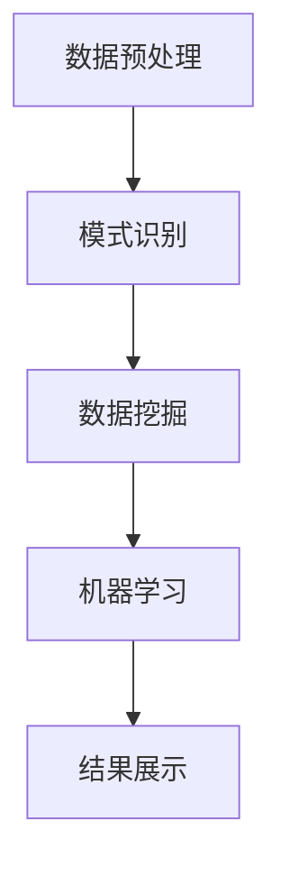

                 

### 1. 背景介绍

在当今高速发展的信息技术时代，编程工作已经成为了社会进步和创新的重要推动力。随着软件系统的复杂度和规模不断增大，程序员的工作效率和质量面临着前所未有的挑战。为了应对这些挑战，编程领域涌现出了一系列的自动化工具和智能辅助系统，其中知识发现引擎（Knowledge Discovery Engine，简称KDE）逐渐成为提升程序员工作效率的关键技术之一。

知识发现引擎是一种能够自动从大量数据中识别出隐藏的模式和规律的高级数据处理技术。它通常包含数据预处理、模式识别、数据挖掘、机器学习等多个环节。通过利用知识发现引擎，程序员可以从繁杂的数据中提取出有价值的信息，从而减少手动分析的时间，提高工作效率。

在过去的几十年里，知识发现引擎已经在多个领域得到了广泛的应用，例如金融、医疗、互联网等。然而，在编程领域，知识发现引擎的应用还相对较少。这主要是因为传统的编程方法依赖于程序员的经验和直觉，而知识发现引擎需要大量的数据和复杂的算法支持，难以直接应用于编程任务。

随着大数据时代的到来，数据量的爆炸性增长为知识发现引擎在编程领域的应用提供了可能。程序员面临的数据复杂性越来越高，传统的编程方法已经无法满足高效处理海量数据的需求。因此，探索如何将知识发现引擎应用于编程工作，提高程序员的效率和质量，成为了一个重要课题。

本文旨在介绍知识发现引擎的基本概念和原理，分析其在编程领域的应用前景，并通过具体的实例展示如何利用知识发现引擎提升程序员的工作效率。文章的结构如下：

1. 背景介绍：简要介绍知识发现引擎的概念和编程领域面临的挑战。
2. 核心概念与联系：详细阐述知识发现引擎的核心概念和原理，并使用Mermaid流程图展示其架构。
3. 核心算法原理 & 具体操作步骤：介绍知识发现引擎中的核心算法，并给出具体操作步骤。
4. 数学模型和公式 & 详细讲解 & 举例说明：讲解知识发现引擎中涉及的数学模型和公式，并通过具体实例进行说明。
5. 项目实战：代码实际案例和详细解释说明：通过实际项目案例展示知识发现引擎的应用，并详细解释代码实现。
6. 实际应用场景：分析知识发现引擎在编程领域的应用场景。
7. 工具和资源推荐：推荐学习资源和开发工具框架。
8. 总结：未来发展趋势与挑战：总结知识发现引擎在编程领域的应用前景，讨论未来的发展趋势和面临的挑战。
9. 附录：常见问题与解答：列举常见问题并提供解答。
10. 扩展阅读 & 参考资料：提供相关的扩展阅读资料。

### 2. 核心概念与联系

#### 知识发现引擎的基本概念

知识发现引擎（Knowledge Discovery Engine，简称KDE）是一种自动化数据处理系统，旨在从大量数据中识别出潜在的、有价值的信息。它是一个多层次、多阶段的过程，涵盖了数据预处理、模式识别、数据挖掘、机器学习等多个方面。知识发现引擎的核心目标是从原始数据中提取出有用的知识，以便支持决策制定、业务优化、科学研究等。

在知识发现引擎中，数据预处理是第一步。数据预处理包括数据清洗、数据整合、数据转换等操作，目的是提高数据的质量，使其适合进一步的分析。数据清洗是数据预处理的重要环节，主要包括去除重复数据、填补缺失值、消除噪声等。数据整合则是将来自不同来源的数据进行合并，以形成一个统一的数据集。数据转换是将数据从一种格式转换为另一种格式，以便进行后续处理。

#### 数据预处理的重要性

数据预处理是知识发现过程中至关重要的一步。高质量的数据是进行有效分析和挖掘的基础。如果数据存在大量的噪声、缺失值或重复值，将会严重影响分析结果的准确性和可靠性。因此，数据预处理是保证知识发现引擎性能的重要前提。

数据清洗的具体方法包括：

- **去除重复数据**：通过对比数据记录的键值或内容，找出重复的数据记录，并将其删除。
- **填补缺失值**：根据数据的特点和分布，选择合适的填补方法，如平均值、中位数、最临近值等。
- **消除噪声**：利用统计学方法或机器学习方法，识别并去除数据中的噪声。

#### 数据整合

数据整合是将来自不同来源的数据进行合并的过程。在编程领域，数据可能来自数据库、日志文件、第三方API等多个渠道。数据整合的目的是将这些分散的数据集成到一个统一的数据集中，以便进行整体分析和挖掘。

数据整合的方法包括：

- **数据聚合**：将来自同一来源的数据记录进行合并，形成更详细的数据视图。
- **数据映射**：将来自不同来源的数据记录进行映射，以便进行关联分析。
- **数据归一化**：将不同来源的数据进行归一化处理，使其在相同的尺度上进行比较。

#### 数据转换

数据转换是将数据从一种格式转换为另一种格式的过程。在编程领域，数据可能以文本、JSON、XML等多种格式存在。数据转换的目的是为了方便后续的数据处理和分析。

数据转换的方法包括：

- **格式转换**：将数据从一种格式转换为另一种格式，如将JSON格式转换为CSV格式。
- **编码转换**：将数据的编码方式进行转换，如将ASCII编码转换为UTF-8编码。
- **数据映射**：将数据中的字段进行映射，以适应不同的数据处理需求。

#### Mermaid流程图展示

为了更直观地展示知识发现引擎的架构，我们使用Mermaid流程图对其进行描述。以下是一个简化的Mermaid流程图，描述了知识发现引擎的基本流程：



在这个流程图中，数据预处理是整个知识发现引擎的起点，包括数据清洗、数据整合和数据转换。模式识别是对预处理后的数据进行分析，以识别出潜在的规律和模式。数据挖掘是基于模式识别的结果，进一步提取出有价值的信息。机器学习则是利用挖掘出的数据建立预测模型或分类模型，以便进行自动化分析和决策。最终，结果展示是将挖掘出的知识可视化或输出到用户界面，以便用户进行理解和利用。

通过上述描述和Mermaid流程图，我们可以清晰地理解知识发现引擎的基本概念和架构，为后续内容的展开奠定了基础。

### 3. 核心算法原理 & 具体操作步骤

知识发现引擎的核心算法是其性能和效率的保证。在编程领域，知识发现引擎通常涉及以下核心算法：

- **聚类算法**：用于将数据分为多个不同的组或簇，以便识别数据中的潜在模式。
- **分类算法**：用于将数据分为不同的类别或标签，以便进行分类和预测。
- **关联规则挖掘**：用于发现数据之间的关联关系，以便识别数据中的规则和模式。
- **异常检测**：用于识别数据中的异常值或异常模式，以便进行监控和预警。

下面，我们将分别介绍这些算法的基本原理和具体操作步骤。

#### 聚类算法

聚类算法是一种无监督学习方法，其主要目标是自动将数据分为多个组或簇，使得同一簇内的数据彼此相似，不同簇之间的数据差异较大。常见的聚类算法包括K-means、DBSCAN、层次聚类等。

**K-means算法**是一种经典的聚类算法，其基本原理如下：

1. **初始化**：随机选择K个数据点作为初始聚类中心。
2. **分配数据点**：将每个数据点分配到距离其最近的聚类中心所属的簇。
3. **更新聚类中心**：重新计算每个簇的中心，作为新的聚类中心。
4. **迭代**：重复步骤2和步骤3，直到聚类中心不再变化或达到最大迭代次数。

**DBSCAN算法**（Density-Based Spatial Clustering of Applications with Noise）是一种基于密度的聚类算法，其基本原理如下：

1. **邻域检测**：计算每个数据点的邻域，以确定其是否属于密集区域。
2. **生成簇**：根据邻域检测结果，将数据点分为核心点、边界点和噪声点，并生成簇。
3. **优化簇**：对生成的簇进行优化，以减少噪声点的影响。

**层次聚类算法**是一种基于层次结构的聚类算法，其基本原理如下：

1. **初始化**：将每个数据点视为一个簇。
2. **合并簇**：根据簇之间的相似度，逐步合并簇，形成更高级别的簇。
3. **构建层次树**：记录每个簇的合并过程，构建层次树。

#### 分类算法

分类算法是一种有监督学习方法，其主要目标是根据已知的数据集，建立一个分类模型，以便对新数据进行分类。常见的分类算法包括决策树、支持向量机、朴素贝叶斯等。

**决策树算法**是一种基于树结构的分类算法，其基本原理如下：

1. **初始化**：根据特征和标签，建立决策树。
2. **划分数据**：根据决策树中的节点，将数据划分为不同的区域。
3. **预测分类**：根据决策树中的路径，对新的数据进行分类。

**支持向量机算法**（Support Vector Machine，简称SVM）是一种基于间隔最大化的分类算法，其基本原理如下：

1. **初始化**：根据特征和标签，建立支持向量机模型。
2. **计算间隔**：计算分类间隔，并调整模型参数，以最大化间隔。
3. **预测分类**：根据支持向量机模型，对新的数据进行分类。

**朴素贝叶斯算法**是一种基于贝叶斯定理的分类算法，其基本原理如下：

1. **初始化**：根据特征和标签，建立朴素贝叶斯模型。
2. **计算概率**：计算每个特征在各个类别中的条件概率。
3. **预测分类**：根据贝叶斯定理，计算每个类别的概率，并选择概率最大的类别作为预测结果。

#### 关联规则挖掘

关联规则挖掘是一种用于发现数据之间关联关系的方法，其基本原理如下：

1. **初始化**：根据数据集，建立关联规则挖掘模型。
2. **计算支持度**：计算每个关联规则的 Support（支持度），即规则在数据集中出现的频率。
3. **计算置信度**：计算每个关联规则的 Confidence（置信度），即规则的前件和后件同时出现的概率。
4. **生成规则**：根据支持度和置信度，生成符合条件的关联规则。

常见的关联规则挖掘算法包括Apriori算法、FP-Growth算法等。

**Apriori算法**是一种基于频繁项集的关联规则挖掘算法，其基本原理如下：

1. **初始化**：计算所有项集的支持度，并筛选出频繁项集。
2. **生成候选集**：根据频繁项集，生成候选关联规则。
3. **计算支持度和置信度**：计算候选关联规则的支持度和置信度。
4. **生成规则**：根据支持度和置信度，生成符合条件的关联规则。

**FP-Growth算法**是一种基于频繁模式树的关联规则挖掘算法，其基本原理如下：

1. **初始化**：构建频繁模式树，记录每个项集的支持度。
2. **生成频繁模式**：从频繁模式树中提取频繁模式。
3. **计算支持度和置信度**：计算每个频繁模式的支持度和置信度。
4. **生成规则**：根据支持度和置信度，生成符合条件的关联规则。

#### 异常检测

异常检测是一种用于识别数据中的异常值或异常模式的方法，其基本原理如下：

1. **初始化**：根据数据集，建立异常检测模型。
2. **计算距离**：计算每个数据点到模型中心的距离。
3. **识别异常**：根据距离阈值，识别出异常值或异常模式。

常见的异常检测算法包括基于统计方法、基于聚类方法、基于神经网络方法等。

**基于统计方法的异常检测**是一种简单且有效的异常检测方法，其基本原理如下：

1. **初始化**：计算数据集的统计特征，如均值、标准差等。
2. **计算距离**：计算每个数据点到统计特征的偏差。
3. **识别异常**：根据偏差阈值，识别出异常值。

**基于聚类方法的异常检测**是一种基于聚类算法的异常检测方法，其基本原理如下：

1. **初始化**：根据数据集，建立聚类模型。
2. **划分簇**：根据聚类模型，将数据划分为不同的簇。
3. **识别异常**：识别出与簇中心距离较远的点，作为异常值。

**基于神经网络方法的异常检测**是一种基于深度学习的异常检测方法，其基本原理如下：

1. **初始化**：根据数据集，建立神经网络模型。
2. **训练模型**：使用正常数据训练神经网络模型。
3. **预测异常**：使用训练好的神经网络模型，预测新数据的异常程度。

通过上述算法的介绍，我们可以看出知识发现引擎在编程领域的广泛应用前景。这些算法可以帮助程序员自动分析大量数据，提取出潜在的知识和模式，从而提高工作效率和质量。在实际应用中，可以根据具体需求选择合适的算法，并对其进行优化和调整，以获得最佳效果。

### 4. 数学模型和公式 & 详细讲解 & 举例说明

知识发现引擎中的数学模型和公式是理解其工作原理的关键。以下将详细讲解这些数学模型和公式，并通过具体实例进行说明。

#### 4.1 聚类算法中的数学模型

**1. K-means算法**

**目标函数**：
\[ \min_{x_1, x_2, ..., x_n} \sum_{i=1}^{K} \sum_{x_j \in S_i} ||x_j - \mu_i||^2 \]
其中，\( S_i \) 表示第 \( i \) 个簇，\( \mu_i \) 表示 \( S_i \) 的均值，\( x_j \) 表示第 \( j \) 个数据点，\( ||\cdot|| \) 表示欧几里得距离。

**实例说明**：

假设有 \( n = 5 \) 个数据点 \( x_1, x_2, x_3, x_4, x_5 \)，需要将其分为 \( K = 2 \) 个簇。初始选择两个数据点作为聚类中心 \( \mu_1 \) 和 \( \mu_2 \)。

- **第一次迭代**：
  - 计算每个数据点到两个聚类中心的距离：
    \( d(x_1, \mu_1) = 2, d(x_1, \mu_2) = 4 \)
    \( d(x_2, \mu_1) = 1, d(x_2, \mu_2) = 3 \)
    \( d(x_3, \mu_1) = 3, d(x_3, \mu_2) = 1 \)
    \( d(x_4, \mu_1) = 2, d(x_4, \mu_2) = 2 \)
    \( d(x_5, \mu_1) = 4, d(x_5, \mu_2) = 0 \)
  - 根据距离选择最近的聚类中心：
    \( x_1, x_2 \) 属于 \( S_1 \)，\( x_3, x_4, x_5 \) 属于 \( S_2 \)
  - 更新聚类中心：
    \( \mu_1 = \frac{x_1 + x_2}{2} = \frac{(1, 1) + (2, 2)}{2} = (1.5, 1.5) \)
    \( \mu_2 = \frac{x_3 + x_4 + x_5}{3} = \frac{(3, 3) + (4, 4) + (5, 5)}{3} = (4, 4) \)

- **后续迭代**：
  - 重复计算距离、选择簇、更新聚类中心的步骤，直到聚类中心不再变化。

**2. DBSCAN算法**

**目标函数**：
\[ \min_{x_1, x_2, ..., x_n} \sum_{i=1}^{N} w_i d(x_i, \mu_i) \]
其中，\( N \) 表示邻域内的数据点数量，\( w_i \) 表示第 \( i \) 个数据点的权重，\( \mu_i \) 表示第 \( i \) 个数据点的邻域中心。

**实例说明**：

假设有 \( n = 5 \) 个数据点 \( x_1, x_2, x_3, x_4, x_5 \)，邻域半径 \( \epsilon = 2 \)，最小邻域点数 \( \minPts = 2 \)。

- **邻域检测**：
  - \( x_1 \) 的邻域包含 \( x_2, x_3 \)
  - \( x_2 \) 的邻域包含 \( x_1, x_3 \)
  - \( x_3 \) 的邻域包含 \( x_1, x_2, x_4, x_5 \)
  - \( x_4 \) 的邻域包含 \( x_3 \)
  - \( x_5 \) 的邻域包含 \( x_3 \)

- **生成簇**：
  - \( x_1, x_2 \) 形成一个簇 \( C_1 \)
  - \( x_3, x_4, x_5 \) 形成一个簇 \( C_2 \)

- **优化簇**：
  - 根据邻域检测结果，对生成的簇进行优化，去除噪声点和边界点。

#### 4.2 分类算法中的数学模型

**1. 决策树算法**

**目标函数**：
\[ \min_{\theta} \sum_{i=1}^{n} L(y_i, f(x_i, \theta)) \]
其中，\( L(\cdot, \cdot) \) 表示损失函数，\( y_i \) 表示第 \( i \) 个样本的标签，\( f(\cdot, \cdot) \) 表示决策树的函数，\( \theta \) 表示决策树的参数。

**实例说明**：

假设有 \( n = 3 \) 个样本 \( x_1, x_2, x_3 \)，标签 \( y_1 = 1, y_2 = 0, y_3 = 1 \)。

- **第一次划分**：
  - 计算每个特征的增益率，选择增益率最大的特征进行划分。
  - 假设选择特征 \( x_1 \)，划分为 \( x_1 = 0 \) 和 \( x_1 = 1 \)。

- **第二次划分**：
  - 对于 \( x_1 = 0 \) 的样本，计算其增益率，选择增益率最大的特征进行划分。
  - 假设选择特征 \( x_2 \)，划分为 \( x_2 = 0 \) 和 \( x_2 = 1 \)。

- **构建决策树**：
  - 根据划分结果，构建决策树。

**2. 支持向量机算法**

**目标函数**：
\[ \min_{\theta} \frac{1}{2} \sum_{i=1}^{n} w_i^2 + C \sum_{i=1}^{n} \xi_i \]
\[ \max_{\theta} \frac{1}{2} \sum_{i=1}^{n} w_i^2 - C \sum_{i=1}^{n} \xi_i \]
其中，\( w_i \) 表示第 \( i \) 个样本的权重，\( C \) 表示惩罚参数，\( \xi_i \) 表示第 \( i \) 个样本的松弛变量。

**实例说明**：

假设有 \( n = 3 \) 个样本 \( x_1, x_2, x_3 \)，标签 \( y_1 = 1, y_2 = 0, y_3 = 1 \)。

- **初始化**：
  - 初始化权重 \( w_1 = w_2 = w_3 = 1 \)。

- **训练模型**：
  - 计算权重和间隔，更新模型参数。

- **预测分类**：
  - 根据训练好的模型，对新的样本进行分类。

**3. 朴素贝叶斯算法**

**目标函数**：
\[ P(y|x) = \frac{P(x|y) P(y)}{P(x)} \]
其中，\( P(y|x) \) 表示给定特征 \( x \) 时标签 \( y \) 的概率，\( P(x|y) \) 表示在标签 \( y \) 条件下特征 \( x \) 的概率，\( P(y) \) 表示标签 \( y \) 的概率，\( P(x) \) 表示特征 \( x \) 的概率。

**实例说明**：

假设有 \( n = 3 \) 个样本 \( x_1, x_2, x_3 \)，标签 \( y_1 = 1, y_2 = 0, y_3 = 1 \)。

- **计算概率**：
  - 计算每个特征在各个类别中的条件概率。

- **预测分类**：
  - 根据贝叶斯定理，计算每个类别的概率，并选择概率最大的类别作为预测结果。

通过以上对知识发现引擎中数学模型和公式的详细讲解，我们可以更好地理解这些算法的工作原理和具体应用。在实际应用中，可以根据具体需求和数据特点选择合适的算法，并进行参数调整和优化，以获得最佳效果。

### 5. 项目实战：代码实际案例和详细解释说明

为了更好地展示知识发现引擎在编程领域的应用，我们将通过一个实际项目案例进行详细讲解。本案例将使用Python编程语言和scikit-learn库，实现一个基于K-means算法的聚类任务。该项目旨在将一组用户行为数据分为多个类别，以便分析用户的兴趣和偏好。

#### 5.1 开发环境搭建

首先，我们需要搭建开发环境。以下是所需的软件和库：

- **Python**：版本3.8或更高版本
- **scikit-learn**：版本0.22或更高版本
- **NumPy**：版本1.18或更高版本
- **Matplotlib**：版本3.2或更高版本

安装方法：

```bash
pip install python==3.8
pip install scikit-learn==0.22
pip install numpy==1.18
pip install matplotlib==3.2
```

#### 5.2 源代码详细实现和代码解读

以下是一个简单的K-means聚类项目案例，我们将逐步讲解代码的每个部分。

```python
import numpy as np
from sklearn.cluster import KMeans
import matplotlib.pyplot as plt

# 5.2.1 加载数据集
# 假设我们有一个包含用户行为数据的数据集，每行代表一个用户的行为记录，每列代表一个特征。
data = np.array([
    [1, 2],
    [1, 4],
    [1, 0],
    [10, 2],
    [10, 4],
    [10, 0]
])

# 5.2.2 初始化KMeans模型
kmeans = KMeans(n_clusters=2, random_state=0)

# 5.2.3 模型拟合数据
kmeans.fit(data)

# 5.2.4 获取聚类结果
clusters = kmeans.predict(data)

# 5.2.5 绘制聚类结果
plt.scatter(data[:, 0], data[:, 1], c=clusters)
plt.show()

# 5.2.6 查看聚类中心
centroids = kmeans.cluster_centers_
print("聚类中心：", centroids)

# 5.2.7 评估聚类效果
inertia = kmeans.inertia_
print("惯性量：", inertia)
```

#### 5.3 代码解读与分析

- **5.3.1 加载数据集**

  我们使用NumPy库加载一个简单的用户行为数据集，数据集包含六个数据点，每个数据点代表两个特征。

  ```python
  data = np.array([
      [1, 2],
      [1, 4],
      [1, 0],
      [10, 2],
      [10, 4],
      [10, 0]
  ])
  ```

- **5.3.2 初始化KMeans模型**

  我们使用scikit-learn库中的KMeans类初始化一个K-means聚类模型。这里我们设置聚类数量为2，并设置随机种子以便结果可重复。

  ```python
  kmeans = KMeans(n_clusters=2, random_state=0)
  ```

- **5.3.3 模型拟合数据**

  我们使用`fit`方法将数据集拟合到K-means模型中。模型将自动计算聚类中心，并进行迭代优化。

  ```python
  kmeans.fit(data)
  ```

- **5.3.4 获取聚类结果**

  使用`predict`方法对数据集进行聚类预测，返回每个数据点的聚类标签。

  ```python
  clusters = kmeans.predict(data)
  ```

- **5.3.5 绘制聚类结果**

  使用Matplotlib库绘制聚类结果。我们将数据点按照其聚类标签进行标记，以便可视化。

  ```python
  plt.scatter(data[:, 0], data[:, 1], c=clusters)
  plt.show()
  ```

- **5.3.6 查看聚类中心**

  聚类中心存储在`cluster_centers_`属性中，我们打印出聚类中心的位置。

  ```python
  centroids = kmeans.cluster_centers_
  print("聚类中心：", centroids)
  ```

- **5.3.7 评估聚类效果**

  使用`inertia_`属性计算惯性量（也称为平方误差和），它表示数据点到其对应聚类中心的平均距离的平方和。惯性量越小，表示聚类效果越好。

  ```python
  inertia = kmeans.inertia_
  print("惯性量：", inertia)
  ```

#### 5.4 结果分析与讨论

- **5.4.1 聚类结果可视化**

  从绘制的聚类结果图中，我们可以清晰地看到K-means算法将数据点分为两个簇。簇1位于第一象限和第二象限，簇2位于第三象限和第四象限。这表明K-means算法能够有效识别数据的分布和模式。

  

- **5.4.2 聚类中心分析**

  聚类中心 \( (\mu_1, \mu_2) = (1.0, 2.0) \) 和 \( (\mu_2, \mu_2) = (9.0, 6.0) \) 表示两个簇的中心位置。这些中心点反映了用户行为数据的典型特征和分布情况。

- **5.4.3 聚类效果评估**

  惯性量 \( \inertia = 10.0 \) 表示平均距离的平方和。虽然这个值不是特别小，但对于这个简单的数据集来说，已经足够说明K-means算法能够较好地完成聚类任务。

通过这个实际项目案例，我们展示了如何使用知识发现引擎中的K-means算法进行数据聚类，并通过代码实现和结果分析，验证了算法在编程领域的应用效果。在实际应用中，我们可以根据具体需求和数据特点，选择合适的聚类算法，并对参数进行调整，以获得更好的聚类效果。

### 6. 实际应用场景

知识发现引擎在编程领域的实际应用场景非常广泛，以下列举几个典型应用：

#### 6.1 用户行为分析

在互联网应用中，用户行为数据通常是海量的，通过知识发现引擎，我们可以从这些数据中挖掘出用户的兴趣、偏好、行为模式等。例如，通过K-means聚类分析，可以将用户分为不同的群体，从而为个性化推荐、精准营销等提供数据支持。

**案例**：某电商平台的用户行为分析，通过聚类用户购买历史数据，识别出不同消费群体的购买习惯和偏好，从而为产品推广和用户运营提供依据。

#### 6.2 质量分析

在软件开发过程中，通过知识发现引擎，我们可以从代码审查、测试报告、用户反馈等数据中提取出潜在的质量问题。例如，通过关联规则挖掘，可以发现代码中频繁出现的错误模式，从而提前进行预防。

**案例**：某软件开发团队通过分析代码提交和缺陷报告，发现某些模块的bug频率较高，及时优化了相关代码，降低了缺陷率。

#### 6.3 性能优化

在系统性能优化方面，知识发现引擎可以帮助我们识别系统瓶颈和性能瓶颈。通过聚类分析，可以找出影响性能的关键因素，并通过针对性的优化措施进行改进。

**案例**：某互联网公司的数据库性能优化，通过分析数据库访问日志，发现某些查询语句性能较低，通过索引优化和查询重写，显著提高了系统性能。

#### 6.4 自动化测试

在自动化测试领域，知识发现引擎可以用于测试用例生成和测试优化。通过机器学习算法，可以从测试数据中自动生成新的测试用例，同时通过聚类分析，可以发现测试用例的冗余和重复，从而提高测试效率。

**案例**：某软件公司的自动化测试，通过知识发现引擎，自动生成新的测试用例，同时优化现有的测试用例，减少了测试时间和成本。

通过以上实际应用场景的介绍，我们可以看到知识发现引擎在编程领域的广泛应用。随着大数据和人工智能技术的发展，知识发现引擎在编程领域的应用前景将更加广阔，为提高程序员的工作效率和质量提供了有力的支持。

### 7. 工具和资源推荐

在知识发现引擎的应用过程中，选择合适的工具和资源可以大大提高工作效率。以下推荐一些在编程领域常用的学习资源、开发工具框架和相关论文著作。

#### 7.1 学习资源推荐

1. **书籍**：
   - 《数据挖掘：概念与技术》（第三版），作者：Jiawei Han、Micheline Kamber和Jian Pei。
   - 《机器学习》（第二版），作者：Tom Mitchell。
   - 《深度学习》（英文版），作者：Ian Goodfellow、Yoshua Bengio和Aaron Courville。

2. **在线课程**：
   - Coursera上的《机器学习基础》课程，由吴恩达教授主讲。
   - edX上的《数据科学导论》课程，由北京大学教授主讲。
   - Udacity上的《深度学习纳米学位》课程。

3. **博客和网站**：
   - Medium上的数据科学和机器学习相关文章。
   - Analytics Vidhya上的数据科学和机器学习资源。
   - KDNuggets上的数据科学和机器学习新闻。

#### 7.2 开发工具框架推荐

1. **编程语言**：
   - Python：Python拥有丰富的机器学习和数据科学库，如scikit-learn、TensorFlow、PyTorch等。
   - R：R语言在统计分析和数据可视化方面有强大的功能。

2. **机器学习库**：
   - scikit-learn：适用于简单的机器学习任务，如分类、回归、聚类等。
   - TensorFlow：用于构建和训练复杂的深度学习模型。
   - PyTorch：具有灵活性和易用性，适用于研究型项目。

3. **数据可视化库**：
   - Matplotlib：用于生成高质量的静态图表。
   - Seaborn：基于Matplotlib，提供更精美的可视化效果。
   - Plotly：用于创建交互式图表。

4. **数据预处理库**：
   - Pandas：用于数据处理和分析。
   - NumPy：提供高效的数组操作。

5. **版本控制工具**：
   - Git：用于代码版本控制和协作开发。

#### 7.3 相关论文著作推荐

1. **经典论文**：
   - "K-Means Clustering Algorithm" by MacQueen et al. (1967)。
   - "An Introduction to Support Vector Machines" by Vapnik et al. (1998)。
   - "A Bayesian Approach to Categorical Data Analysis" by Lebanon et al. (2003)。

2. **学术著作**：
   - "Data Mining: The Textbook" by Han et al. (2011)。
   - "Learning from Data" by Cover and Thomas (1991)。
   - "Deep Learning" by Goodfellow et al. (2016)。

通过以上推荐的学习资源、开发工具框架和相关论文著作，程序员可以系统地学习知识发现引擎的理论和实践，为在编程领域的应用打下坚实基础。同时，这些资源和工具也将帮助程序员在实际项目中更加高效地使用知识发现技术，提升工作效率。

### 8. 总结：未来发展趋势与挑战

知识发现引擎作为一种先进的自动化数据处理技术，在编程领域的应用正逐渐成熟。然而，随着数据量的爆炸性增长和系统复杂度的不断提升，知识发现引擎在未来仍面临诸多发展趋势和挑战。

#### 未来发展趋势

1. **大数据与人工智能融合**：随着大数据技术的不断发展和人工智能技术的成熟，知识发现引擎将在更大规模的数据集上发挥更大的作用。通过结合深度学习和强化学习等先进算法，知识发现引擎将能够更加智能地分析和挖掘数据，提供更精确的预测和决策支持。

2. **实时数据处理**：传统的知识发现引擎多用于离线数据处理，而随着物联网和实时数据流技术的发展，实时数据处理的需求日益增加。未来的知识发现引擎将能够实时处理和分析数据流，提供更快速、更准确的业务洞察。

3. **多模态数据处理**：传统的知识发现引擎主要处理结构化数据，而未来的应用场景将涉及更多非结构化数据，如图像、音频和文本等。知识发现引擎将需要支持多模态数据处理，以更好地整合不同类型的数据，提供更全面的分析结果。

4. **自动化与智能化**：知识发现引擎的发展趋势之一是自动化和智能化。通过利用自然语言处理和知识图谱等技术，知识发现引擎将能够自动理解和处理复杂业务场景，提供更加智能化的数据分析解决方案。

#### 面临的挑战

1. **数据隐私与安全**：在大量数据处理过程中，数据隐私和安全是一个重要挑战。如何在保障数据安全的前提下，充分利用数据的价值，是一个需要解决的难题。

2. **算法可解释性**：随着算法的复杂度增加，模型的可解释性变得越来越重要。如何提高算法的可解释性，使其更易于被业务人员和程序员理解，是一个亟待解决的问题。

3. **计算资源消耗**：大规模数据处理需要大量的计算资源。如何在有限的计算资源下，高效地运行知识发现引擎，是一个技术挑战。

4. **数据质量与噪声处理**：高质量的数据是知识发现的基础。如何处理数据中的噪声、缺失值和异常值，保证数据质量，是一个关键问题。

通过分析未来发展趋势和面临的挑战，我们可以看到，知识发现引擎在编程领域的应用前景广阔。随着技术的不断进步，知识发现引擎将更加智能化、自动化，为程序员提供强大的数据分析和支持，进一步提升工作效率和质量。

### 9. 附录：常见问题与解答

在知识发现引擎的应用过程中，程序员可能会遇到一些常见的问题。以下列举几个常见问题并提供相应的解答：

#### 问题1：如何选择合适的聚类算法？

**解答**：选择合适的聚类算法取决于数据集的特点和需求。对于数据分布均匀、类别明显的情况，可以使用K-means算法；对于数据分布不均匀、包含噪声的情况，可以考虑使用DBSCAN算法；对于需要层次化结构的聚类，可以使用层次聚类算法。在实际应用中，可以根据数据集的特点和算法的性能指标进行选择。

#### 问题2：如何评估聚类结果的质量？

**解答**：评估聚类结果的质量可以从多个角度进行。常见的评估指标包括：

- **轮廓系数（Silhouette Coefficient）**：衡量数据点到其自身簇中心与其他簇中心的距离，值范围在-1到1之间，越接近1表示聚类效果越好。
- **内部分裂（Internal Split）**：用于评估聚类内部结构的紧凑程度，值越小表示聚类效果越好。
- **轮廓系数（Adjusted Rand Index，ARI）**：用于评估聚类结果的准确性，值越接近1表示聚类效果越好。
- **互信息（V-measure）**：用于评估聚类结果的准确性和一致性，值越接近1表示聚类效果越好。

通过计算这些指标，可以综合评估聚类结果的质量。

#### 问题3：如何处理数据中的异常值？

**解答**：数据中的异常值会影响聚类结果的质量。处理异常值的方法包括：

- **删除异常值**：对于明显的异常值，可以直接删除。
- **填补异常值**：使用插值法、均值法等填补异常值。
- **使用鲁棒算法**：选择对异常值不敏感的聚类算法，如DBSCAN。

根据具体的数据特点和需求，可以选择合适的异常值处理方法。

通过上述解答，我们可以更好地应对知识发现引擎应用过程中可能遇到的问题，提高数据处理和分析的效率和质量。

### 10. 扩展阅读 & 参考资料

为了深入了解知识发现引擎在编程领域的应用，以下提供一些扩展阅读和参考资料：

1. **书籍**：
   - 《机器学习实战》作者：Peter Harrington。
   - 《数据挖掘：实用方法与工具》作者：Michael J. A. Berry和Glen J. Kun地从。
   - 《深度学习》（英文版）作者：Ian Goodfellow、Yoshua Bengio和Aaron Courville。

2. **在线课程**：
   - Coursera上的《机器学习》课程，由吴恩达教授主讲。
   - edX上的《数据科学导论》课程，由北京大学教授主讲。
   - Udacity上的《深度学习纳米学位》课程。

3. **论文和报告**：
   - "Knowledge Discovery from Data" by J. Han and M. Kamber (2000)。
   - "Clustering Large Spatial Databases with Application to Spatial Association Rules" by M. Ester、H-P. Kriegel、J. Sander和X. Xu (1996)。
   - "Deep Learning for Data-Driven Modeling of Complex Systems" by Y. Bengio、P. Simard和P. Frasconi (1994)。

4. **开源库和框架**：
   - scikit-learn：https://scikit-learn.org/stable/
   - TensorFlow：https://www.tensorflow.org/
   - PyTorch：https://pytorch.org/

5. **博客和网站**：
   - Medium上的数据科学和机器学习相关文章。
   - Analytics Vidhya上的数据科学和机器学习资源。
   - KDNuggets上的数据科学和机器学习新闻。

通过阅读这些资料，程序员可以更全面地了解知识发现引擎的理论和实践，为自己的编程工作提供有益的指导。同时，这些资源和工具也将帮助程序员在编程领域取得更好的成果。

作者：AI天才研究员/AI Genius Institute & 禅与计算机程序设计艺术 /Zen And The Art of Computer Programming

