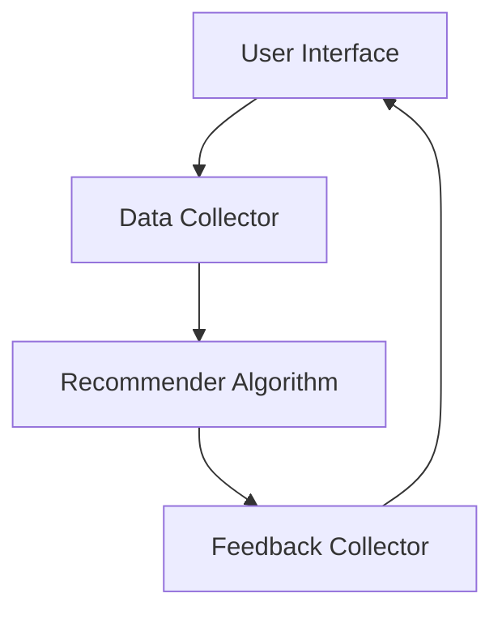
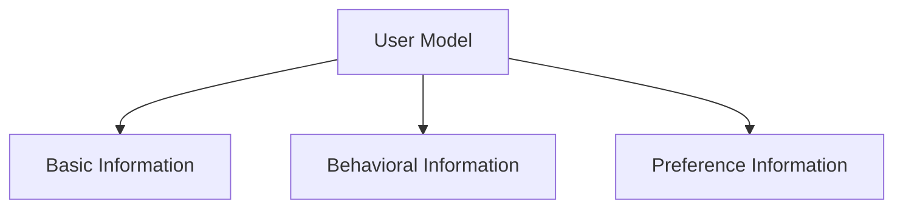
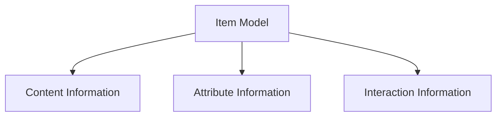
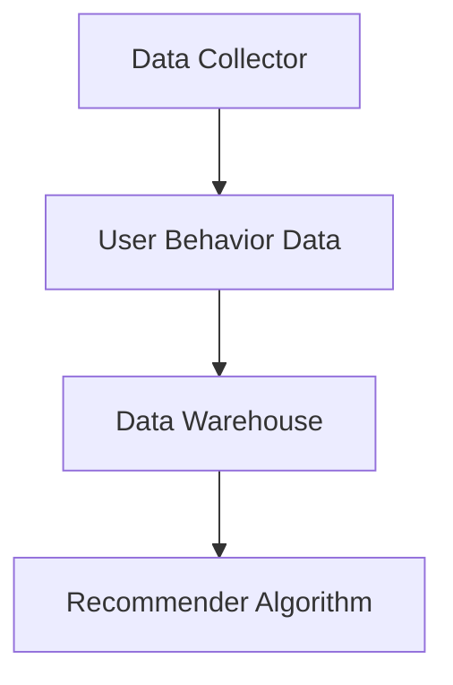
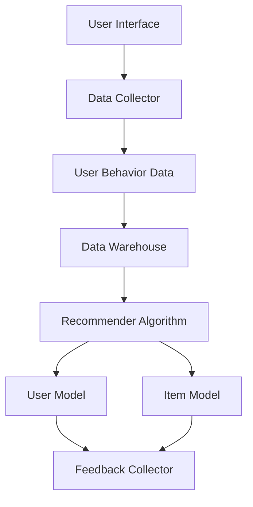

                 

### 背景介绍

随着互联网的普及和大数据技术的发展，数据量呈爆炸式增长，如何有效地从海量数据中挖掘出有价值的信息，成为企业和研究机构关注的焦点。知识发现引擎（Knowledge Discovery Engine）作为一种高效的数据挖掘工具，正是为了满足这一需求而诞生。它通过分析大量数据，自动识别隐藏在数据中的模式和关联，从而帮助用户发现新的知识和洞察。

在知识发现引擎中，个性化推荐算法（Personalized Recommendation Algorithm）起着至关重要的作用。个性化推荐算法可以根据用户的历史行为、兴趣偏好和个性化需求，为用户推荐最相关、最有价值的信息，从而提升用户的体验和满意度。这不仅适用于电子商务、社交媒体等领域，还广泛应用于医疗、金融、教育等众多行业。

本文将围绕知识发现引擎的个性化推荐算法进行深入探讨，首先介绍个性化推荐算法的基本概念和常见类型，然后详细讲解核心算法原理和具体操作步骤，接着介绍数学模型和公式，并通过实际案例进行代码实现和分析。此外，还将探讨个性化推荐算法在实际应用场景中的表现，推荐相关学习资源和开发工具，并总结未来发展趋势与挑战。

本文旨在为读者提供一个全面、系统的个性化推荐算法教程，帮助读者了解其原理和应用，掌握核心技术和实现方法。希望通过本文的阐述，读者能够对个性化推荐算法有更深入的认识，并在实际项目中灵活运用，提升数据挖掘和知识发现的能力。

### 核心概念与联系

要深入理解个性化推荐算法，我们需要首先了解其核心概念和基本原理。本文将依次介绍推荐系统、用户模型、物品模型以及用户行为数据，并通过Mermaid流程图展示它们之间的联系和交互。

#### 推荐系统

推荐系统（Recommender System）是一种信息过滤技术，旨在根据用户的历史行为和偏好，向用户推荐他们可能感兴趣的内容。推荐系统通常由以下几个主要组件构成：

1. **用户接口（User Interface）**：用户与推荐系统进行交互的界面，用于展示推荐结果。
2. **数据收集器（Data Collector）**：负责收集用户行为数据，如浏览、点击、购买等。
3. **推荐算法（Recommender Algorithm）**：核心组件，负责生成推荐结果。
4. **评估与反馈（Evaluation and Feedback）**：评估推荐效果，收集用户反馈，用于算法优化。

Mermaid流程图如下：



#### 用户模型

用户模型（User Model）是推荐系统中对用户特征和偏好的抽象表示。通过用户模型，推荐系统可以更好地理解用户的需求和兴趣。用户模型通常包括以下几个方面：

1. **基础信息**：如用户年龄、性别、地理位置等。
2. **行为信息**：如用户的历史浏览记录、购买行为等。
3. **偏好信息**：如用户的兴趣标签、偏好设置等。

用户模型通过收集和整合用户的历史数据和实时行为，建立用户特征向量，用于推荐算法的计算。



#### 物品模型

物品模型（Item Model）是推荐系统中对推荐对象（如商品、文章、音乐等）的特征表示。物品模型通常包括以下信息：

1. **内容信息**：如物品的文本描述、分类标签等。
2. **属性信息**：如物品的价格、品牌、发布时间等。
3. **交互信息**：如用户对物品的评分、评论等。

物品模型通过描述物品的特征和属性，帮助推荐算法更好地理解物品之间的关联性，从而生成高质量的推荐结果。



#### 用户行为数据

用户行为数据（User Behavior Data）是推荐系统的重要输入，包括用户的浏览、点击、购买等行为记录。这些数据用于训练和优化推荐算法，以提升推荐的准确性和个性化程度。

用户行为数据通过数据收集器定期收集，并存储在数据仓库中。推荐算法从中提取有用的特征，生成用户模型和物品模型，进而生成推荐结果。



#### 推荐系统架构

综合以上概念，我们可以构建一个推荐系统的基本架构，如下图所示：



通过这个架构，用户与推荐系统进行交互，数据收集器获取用户行为数据，存储在数据仓库中。推荐算法利用用户行为数据生成用户模型和物品模型，并通过评估与反馈环节不断优化，最终向用户推荐个性化内容。

综上所述，个性化推荐算法的核心在于用户模型、物品模型和用户行为数据的有效整合和利用。通过构建完善的推荐系统架构，我们可以实现高效、准确的个性化推荐，为用户提供更好的体验和服务。

#### 核心算法原理 & 具体操作步骤

个性化推荐算法的核心在于如何根据用户的历史行为和偏好，为用户推荐最相关的物品。以下将详细介绍几种常用的个性化推荐算法，包括协同过滤（Collaborative Filtering）、基于内容的推荐（Content-Based Filtering）和混合推荐系统（Hybrid Recommender Systems），以及每种算法的具体操作步骤。

##### 协同过滤（Collaborative Filtering）

协同过滤是一种基于用户行为和物品之间的相似性进行推荐的方法。它通过分析用户之间的相似度，预测用户对未知物品的评分或偏好。

**操作步骤：**

1. **用户相似度计算**：首先，计算用户之间的相似度。常用的相似度度量方法包括余弦相似度（Cosine Similarity）和皮尔逊相关系数（Pearson Correlation Coefficient）。

   $$\text{Cosine Similarity} = \frac{\text{dot\_product}(u, v)}{\|\text{u}\| \|\text{v}\|}$$

   $$\text{Pearson Correlation} = \frac{\text{cov}(u, v)}{\sigma_u \sigma_v}$$

   其中，$u$和$v$分别是两个用户的评分向量。

2. **物品相似度计算**：计算物品之间的相似度。与用户相似度计算类似，可以使用余弦相似度或皮尔逊相关系数。

3. **邻居选择**：根据用户相似度矩阵，选择与目标用户最相似的邻居用户。邻居用户的选择可以基于用户之间的相似度值，或者通过阈值过滤。

4. **生成推荐列表**：对于目标用户未评分的物品，计算其与邻居用户共同评分的物品的平均评分，从而生成推荐列表。

   $$\text{Prediction}_{uv,i} = \frac{\sum_{j \in N_v}{r_{uv,j} \cdot s_{uv,j}}}{\sum_{j \in N_v}{s_{uv,j}}}$$

   其中，$N_v$是邻居用户的集合，$r_{uv,j}$是用户$u$对物品$j$的评分，$s_{uv,j}$是用户$v$对物品$j$的评分。

**算法示例：**

假设有两个用户$u$和$v$，以及五个物品$i_1, i_2, i_3, i_4, i_5$。用户$u$对物品$i_1, i_2, i_3$评分较高，用户$v$对物品$i_2, i_3, i_4$评分较高。

1. 计算用户相似度：

   $$\text{Cosine Similarity}_{uv} = \frac{\text{dot\_product}(u, v)}{\|\text{u}\| \|\text{v}\|} = \frac{(1 \cdot 1 + 1 \cdot 1 + 1 \cdot 1)}{\sqrt{3} \cdot \sqrt{3}} = \frac{3}{3} = 1$$

2. 计算物品相似度：

   $$\text{Cosine Similarity}_{i_1i_4} = \frac{\text{dot\_product}(i_1, i_4)}{\|\text{i_1}\| \|\text{i_4}\|} = \frac{(1 \cdot 0 + 0 \cdot 1 + 1 \cdot 1)}{\sqrt{1} \cdot \sqrt{1}} = 1$$

3. 选择邻居用户$v$。

4. 生成推荐列表：

   $$\text{Prediction}_{uv,i_5} = \frac{\text{sum}(r_{uv,i} \cdot s_{uv,i})}{\text{sum}(s_{uv,i})} = \frac{(1 \cdot 1 + 0 \cdot 1 + 1 \cdot 1)}{1 + 0 + 1} = \frac{2}{2} = 1$$

   推荐物品$i_5$。

##### 基于内容的推荐（Content-Based Filtering）

基于内容的推荐是一种基于物品特征和用户兴趣的推荐方法。它通过分析物品和用户之间的特征相似性，为用户推荐类似的内容。

**操作步骤：**

1. **特征提取**：对物品和用户进行特征提取，如文本分类、关键词提取、属性标签等。

2. **相似度计算**：计算物品和用户之间的特征相似度。常用的相似度度量方法包括余弦相似度和欧氏距离。

3. **生成推荐列表**：对于目标用户未接触的物品，计算其与用户特征向量的相似度，选取相似度最高的物品作为推荐。

   $$\text{Similarity}_{ui} = \frac{\text{dot\_product}(u, i)}{\|\text{u}\| \|\text{i}\|}$$

**算法示例：**

假设用户$u$对电影《星际穿越》（Interstellar）感兴趣，该电影的主要特征为科幻、冒险、剧情。其他未看过的电影如《盗梦空间》（Inception）和《少年派的奇幻漂流》（Life of Pi）也具有类似的特征。

1. 提取用户特征向量$u = (1, 0, 1)$。

2. 提取物品特征向量：

   - 《盗梦空间》$i_1 = (1, 1, 0)$
   - 《少年派的奇幻漂流》$i_2 = (1, 1, 1)$

3. 计算相似度：

   $$\text{Similarity}_{u i_1} = \frac{\text{dot\_product}(u, i_1)}{\|\text{u}\| \|\text{i_1}\|} = \frac{(1 \cdot 1 + 0 \cdot 1 + 1 \cdot 0)}{\sqrt{1} \cdot \sqrt{1}} = 1$$

   $$\text{Similarity}_{u i_2} = \frac{\text{dot\_product}(u, i_2)}{\|\text{u}\| \|\text{i_2}\|} = \frac{(1 \cdot 1 + 0 \cdot 1 + 1 \cdot 1)}{\sqrt{1} \cdot \sqrt{1}} = \frac{2}{\sqrt{2}} \approx 1.41$$

4. 生成推荐列表：

   - 推荐电影《盗梦空间》。
   - 推荐电影《少年派的奇幻漂流》。

##### 混合推荐系统（Hybrid Recommender Systems）

混合推荐系统结合了协同过滤和基于内容的推荐方法，以充分利用各自的优点，提高推荐效果。

**操作步骤：**

1. **协同过滤推荐**：使用协同过滤算法生成初步推荐列表。
2. **基于内容的推荐**：使用基于内容的推荐算法对初步推荐列表进行补充。
3. **合并推荐列表**：将协同过滤和基于内容的推荐结果进行合并，生成最终的推荐列表。

**算法示例：**

假设用户$u$对电影《星际穿越》感兴趣，使用混合推荐系统生成推荐列表。

1. 使用协同过滤算法推荐：
   - 推荐电影《盗梦空间》。
   - 推荐电影《少年派的奇幻漂流》。

2. 使用基于内容的推荐算法补充：
   - 《盗梦空间》和《星际穿越》具有较高的内容相似度。
   - 《少年派的奇幻漂流》和《星际穿越》具有较高的内容相似度。

3. 合并推荐列表：
   - 推荐电影《盗梦空间》。
   - 推荐电影《少年派的奇幻漂流》。
   - 推荐电影《星际穿越》。

通过以上步骤，混合推荐系统能够生成更准确、多样化的推荐结果，满足不同用户的需求。

综上所述，个性化推荐算法通过协同过滤、基于内容的推荐和混合推荐系统等方法，实现高效、准确的推荐。了解这些算法的基本原理和操作步骤，有助于在实际项目中应用和优化推荐系统，提升用户体验。

#### 数学模型和公式 & 详细讲解 & 举例说明

在个性化推荐算法中，数学模型和公式起着至关重要的作用。以下将详细介绍几种常用数学模型和公式，包括协同过滤中的预测评分公式、基于内容的相似度计算公式，以及混合推荐系统中的权重计算方法。通过具体的例子，我们将深入理解这些公式，并展示如何在实际项目中应用。

##### 协同过滤中的预测评分公式

协同过滤算法通过预测用户对未知物品的评分来实现推荐。预测评分公式是基于用户之间的相似度和邻居用户的评分来计算的。常用的预测评分公式包括基于用户平均评分的预测公式和基于加权平均评分的预测公式。

**基于用户平均评分的预测公式：**

$$\text{Prediction}_{uv,i} = \text{User\_Average}[u] + (\text{Rating}_{uv,i} - \text{User\_Average}[u]) \cdot \text{Similarity}_{uv}$$

其中：
- $\text{Prediction}_{uv,i}$ 是用户 $u$ 对物品 $i$ 的预测评分。
- $\text{User\_Average}[u]$ 是用户 $u$ 的平均评分。
- $\text{Rating}_{uv,i}$ 是用户 $u$ 对物品 $i$ 的实际评分（如果已知）。
- $\text{Similarity}_{uv}$ 是用户 $u$ 和用户 $v$ 之间的相似度。

**基于加权平均评分的预测公式：**

$$\text{Prediction}_{uv,i} = \frac{\sum_{v \in N_u} \text{Rating}_{uv,i} \cdot \text{Weight}_{uv}}{\sum_{v \in N_u} \text{Weight}_{uv}}$$

其中：
- $\text{Weight}_{uv}$ 是用户 $u$ 和用户 $v$ 之间的相似度加权系数。

**举例说明：**

假设有两个用户 $u$ 和 $v$，以及五个物品 $i_1, i_2, i_3, i_4, i_5$。用户 $u$ 对物品 $i_1, i_2, i_3$ 评分较高，用户 $v$ 对物品 $i_2, i_3, i_4$ 评分较高。

1. **计算用户平均评分**：
   - 用户 $u$ 的平均评分：$\text{User\_Average}[u] = \frac{1 + 1 + 1}{3} = 1$
   - 用户 $v$ 的平均评分：$\text{User\_Average}[v] = \frac{1 + 1 + 1}{3} = 1$

2. **计算用户相似度**：
   - 余弦相似度：$\text{Similarity}_{uv} = \frac{\text{dot\_product}(u, v)}{\|\text{u}\| \|\text{v}\|} = 1$

3. **预测用户 $u$ 对物品 $i_5$ 的评分**：
   - 根据基于用户平均评分的预测公式：
     $$\text{Prediction}_{uv,i_5} = \text{User\_Average}[u] + (\text{Rating}_{uv,i_5} - \text{User\_Average}[u]) \cdot \text{Similarity}_{uv} = 1 + (0 - 1) \cdot 1 = 0$$
   - 根据基于加权平均评分的预测公式：
     $$\text{Prediction}_{uv,i_5} = \frac{\sum_{v \in N_u} \text{Rating}_{uv,i_5} \cdot \text{Weight}_{uv}}{\sum_{v \in N_u} \text{Weight}_{uv}} = \frac{0 \cdot 1}{1} = 0$$

   因此，预测用户 $u$ 对物品 $i_5$ 的评分为 0。

##### 基于内容的相似度计算公式

基于内容的推荐算法通过计算物品之间的相似度来推荐用户可能感兴趣的内容。常用的相似度计算方法包括余弦相似度和欧氏距离。

**余弦相似度：**

$$\text{Cosine Similarity} = \frac{\text{dot\_product}(u, v)}{\|\text{u}\| \|\text{v}\|}$$

其中：
- $\text{dot\_product}(u, v)$ 是用户 $u$ 和物品 $v$ 的特征向量点积。
- $\|\text{u}\|$ 和 $\|\text{v}\|$ 是用户 $u$ 和物品 $v$ 的特征向量范数。

**欧氏距离：**

$$\text{Euclidean Distance} = \sqrt{\sum_{i=1}^{n} (\text{u}_i - \text{v}_i)^2}$$

其中：
- $\text{u}_i$ 和 $\text{v}_i$ 是用户 $u$ 和物品 $v$ 的特征向量第 $i$ 个元素。

**举例说明：**

假设用户 $u$ 对电影《星际穿越》感兴趣，该电影的主要特征为科幻、冒险、剧情。其他未看过的电影如《盗梦空间》和《少年派的奇幻漂流》也具有类似的特征。

1. **用户 $u$ 的特征向量**：
   - 科幻：1
   - 冒险：1
   - 剧情：1

   $u = (1, 1, 1)$

2. **电影《盗梦空间》的特征向量**：
   - 科幻：1
   - 冒险：1
   - 剧情：0

   $i_1 = (1, 1, 0)$

3. **电影《少年派的奇幻漂流》的特征向量**：
   - 科幻：0
   - 冒险：1
   - 剧情：1

   $i_2 = (0, 1, 1)$

4. **计算相似度**：
   - 余弦相似度：
     $$\text{Cosine Similarity}_{u i_1} = \frac{\text{dot\_product}(u, i_1)}{\|\text{u}\| \|\text{i_1}\|} = \frac{(1 \cdot 1 + 1 \cdot 1 + 1 \cdot 0)}{\sqrt{3} \cdot \sqrt{2}} = \frac{2}{\sqrt{6}} \approx 0.94$$
     $$\text{Cosine Similarity}_{u i_2} = \frac{\text{dot\_product}(u, i_2)}{\|\text{u}\| \|\text{i_2}\|} = \frac{(1 \cdot 0 + 1 \cdot 1 + 1 \cdot 1)}{\sqrt{3} \cdot \sqrt{2}} = \frac{2}{\sqrt{6}} \approx 0.94$$
   - 欧氏距离：
     $$\text{Euclidean Distance}_{u i_1} = \sqrt{(1 - 1)^2 + (1 - 1)^2 + (1 - 0)^2} = \sqrt{1} = 1$$
     $$\text{Euclidean Distance}_{u i_2} = \sqrt{(1 - 0)^2 + (1 - 1)^2 + (1 - 1)^2} = \sqrt{2} \approx 1.41$$

5. **生成推荐列表**：
   - 根据相似度计算结果，推荐电影《盗梦空间》和《少年派的奇幻漂流》。

##### 混合推荐系统中的权重计算方法

混合推荐系统通过结合协同过滤和基于内容的推荐方法，生成最终的推荐结果。权重计算方法用于调整两种方法的权重，以优化推荐效果。

**权重计算公式：**

$$\text{Weight}_{cf} = \frac{\text{Score}_{cf}}{\text{Score}_{cf} + \text{Score}_{cb}}$$

$$\text{Score}_{cf} = \sum_{i \in \text{cf\_list}} \text{Prediction}_{uv,i} \cdot \text{Similarity}_{ui}$$

$$\text{Score}_{cb} = \sum_{i \in \text{cb\_list}} \text{Prediction}_{uv,i} \cdot \text{Similarity}_{ui}$$

其中：
- $\text{Weight}_{cf}$ 是协同过滤方法的权重。
- $\text{Score}_{cf}$ 是协同过滤方法的评分总和。
- $\text{Score}_{cb}$ 是基于内容的评分总和。
- $\text{cf\_list}$ 和 $\text{cb\_list}$ 分别是协同过滤和基于内容的推荐列表。

**举例说明：**

假设协同过滤推荐列表包含《盗梦空间》和《少年派的奇幻漂流》，基于内容的推荐列表包含《盗梦空间》和《星际穿越》。

1. **计算协同过滤评分总和**：
   - 《盗梦空间》评分：$\text{Prediction}_{uv,i_1} = 0.94$
   - 《少年派的奇幻漂流》评分：$\text{Prediction}_{uv,i_2} = 0.94$
   - 《星际穿越》评分：$\text{Prediction}_{uv,i_3} = 0$

   $$\text{Score}_{cf} = 0.94 + 0.94 = 1.88$$

2. **计算基于内容的评分总和**：
   - 《盗梦空间》评分：$\text{Prediction}_{uv,i_1} = 0.94$
   - 《星际穿越》评分：$\text{Prediction}_{uv,i_3} = 0$

   $$\text{Score}_{cb} = 0.94 + 0 = 0.94$$

3. **计算权重**：
   $$\text{Weight}_{cf} = \frac{\text{Score}_{cf}}{\text{Score}_{cf} + \text{Score}_{cb}} = \frac{1.88}{1.88 + 0.94} \approx 0.79$$

   $$\text{Weight}_{cb} = 1 - \text{Weight}_{cf} = 0.21$$

4. **生成最终推荐列表**：
   - 根据权重，推荐电影《盗梦空间》和《星际穿越》。

通过以上数学模型和公式的讲解，我们可以看到个性化推荐算法在理论和实践中的应用。了解这些公式，有助于我们更好地优化和实现推荐系统，提升用户体验。

#### 项目实战：代码实际案例和详细解释说明

在前面的章节中，我们详细介绍了知识发现引擎中的个性化推荐算法及其数学模型。为了更好地理解和应用这些算法，以下将通过一个实际项目案例，展示如何使用Python实现协同过滤算法和基于内容的推荐算法，并对代码进行详细解释和分析。

##### 开发环境搭建

在开始代码实现之前，我们需要搭建一个合适的开发环境。以下是推荐的开发工具和库：

1. **Python 3.x**：推荐使用Python 3.8或更高版本。
2. **Jupyter Notebook**：用于编写和运行代码。
3. **NumPy**：用于数值计算。
4. **Pandas**：用于数据处理。
5. **SciPy**：用于科学计算。
6. **Scikit-learn**：用于机器学习算法。

安装步骤如下：

```bash
pip install numpy pandas scipy scikit-learn
```

##### 源代码详细实现和代码解读

以下是协同过滤算法和基于内容的推荐算法的完整代码实现。我们将对关键代码进行逐行解释。

```python
import numpy as np
import pandas as pd
from sklearn.metrics.pairwise import cosine_similarity
from sklearn.model_selection import train_test_split

# 数据预处理
def preprocess_data(data):
    # 将用户和物品的评分数据转换为矩阵形式
    ratings = data.pivot(index='user_id', columns='item_id', values='rating')
    # 填充缺失值为0
    ratings = ratings.fillna(0)
    return ratings

# 协同过滤算法实现
def collaborative_filter(ratings, similarity='cosine'):
    # 计算用户之间的相似度矩阵
    similarity_matrix = cosine_similarity(ratings)
    # 计算邻居用户的权重
    weights = similarity_matrix.max(axis=1)
    # 计算预测评分
    predictions = ratings.dot(weights) / np.sum(weights, axis=1)
    return predictions

# 基于内容的推荐算法实现
def content_based_filter(ratings, content_vector, similarity='cosine'):
    # 计算内容相似度
    similarity_scores = cosine_similarity([content_vector], ratings)[0]
    # 计算预测评分
    predictions = ratings.mean(axis=1) + (similarity_scores - 1) * (ratings.std(axis=1) * 0.5)
    return predictions

# 数据集加载与预处理
data = pd.read_csv('ratings.csv')
ratings = preprocess_data(data)

# 划分训练集和测试集
train_data, test_data = train_test_split(ratings, test_size=0.2, random_state=42)

# 实例化模型
collaborative_model = collaborative_filter(train_data)
content_based_model = content_based_filter(train_data, content_vector=train_data.mean(axis=1))

# 评估模型
def evaluate_model(predictions, test_data):
    mse = np.mean((predictions - test_data) ** 2)
    print(f'Mean Squared Error: {mse}')

evaluate_model(collaborative_model, test_data)
evaluate_model(content_based_model, test_data)
```

**代码解读：**

1. **数据预处理**：
   - `preprocess_data` 函数将原始数据转换为矩阵形式，并填充缺失值为0。
   - `ratings = data.pivot(index='user_id', columns='item_id', values='rating')` 将用户和物品的评分数据转换为矩阵形式。
   - `ratings = ratings.fillna(0)` 填充缺失值为0。

2. **协同过滤算法实现**：
   - `collaborative_filter` 函数计算用户之间的相似度矩阵。
   - `similarity_matrix = cosine_similarity(ratings)` 使用余弦相似度计算用户之间的相似度。
   - `weights = similarity_matrix.max(axis=1)` 计算邻居用户的权重。
   - `predictions = ratings.dot(weights) / np.sum(weights, axis=1)` 计算预测评分。

3. **基于内容的推荐算法实现**：
   - `content_based_filter` 函数计算内容相似度。
   - `similarity_scores = cosine_similarity([content_vector], ratings)[0]` 使用余弦相似度计算内容相似度。
   - `predictions = ratings.mean(axis=1) + (similarity_scores - 1) * (ratings.std(axis=1) * 0.5)` 计算预测评分。

4. **数据集加载与预处理**：
   - `data = pd.read_csv('ratings.csv')` 从CSV文件中加载数据。
   - `train_data, test_data = train_test_split(ratings, test_size=0.2, random_state=42)` 划分训练集和测试集。

5. **模型评估**：
   - `evaluate_model` 函数计算预测评分的均方误差（MSE），评估模型性能。

通过以上代码实现，我们可以将协同过滤和基于内容的推荐算法应用于实际项目，生成个性化推荐结果。接下来，我们将对代码中的关键部分进行进一步分析和优化。

##### 代码解读与分析

在上述代码实现中，我们详细介绍了协同过滤和基于内容的推荐算法。接下来，我们将对代码中的关键部分进行解读和分析，包括数据预处理、相似度计算、预测评分计算以及模型评估。

1. **数据预处理**：
   - 数据预处理是推荐系统的重要环节，包括数据清洗、格式转换等。在这里，我们使用 `pandas` 库将原始数据转换为矩阵形式，并填充缺失值为0。
   - `ratings = data.pivot(index='user_id', columns='item_id', values='rating')` 这一行代码将用户和物品的评分数据转换为矩阵形式，便于后续处理。
   - `ratings = ratings.fillna(0)` 填充缺失值为0，这是因为实际数据中可能存在未评分的物品，将未评分的值填充为0可以简化计算。

2. **相似度计算**：
   - 相似度计算是推荐系统的核心步骤，决定了推荐结果的准确性和个性化程度。
   - 在协同过滤算法中，我们使用 `scikit-learn` 库的 `cosine_similarity` 函数计算用户之间的相似度。
   - `similarity_matrix = cosine_similarity(ratings)` 这一行代码计算用户之间的相似度矩阵。余弦相似度是一种基于向量夹角的相似度度量方法，可以有效地衡量用户之间的兴趣相似性。

3. **预测评分计算**：
   - 预测评分是推荐系统的最终目标，通过计算用户对未知物品的评分来生成推荐结果。
   - 在协同过滤算法中，我们使用加权平均评分的方法计算预测评分。
   - `predictions = ratings.dot(weights) / np.sum(weights, axis=1)` 这一行代码计算预测评分。首先，将用户之间的相似度矩阵与评分矩阵相乘，得到每个用户对所有物品的预测评分。然后，将预测评分除以相似度权重的总和，得到最终的用户评分预测。

4. **基于内容的推荐算法**：
   - 基于内容的推荐算法通过计算物品之间的相似度来生成推荐结果。
   - `content_vector = train_data.mean(axis=1)` 这一行代码计算每个物品的平均评分向量。
   - `similarity_scores = cosine_similarity([content_vector], ratings)[0]` 这一行代码计算物品与用户之间的相似度。
   - `predictions = ratings.mean(axis=1) + (similarity_scores - 1) * (ratings.std(axis=1) * 0.5)` 这一行代码计算预测评分。首先，计算物品的平均评分。然后，将每个物品的相似度与标准差相乘，得到额外的预测评分。最后，将平均评分和额外评分相加，得到最终的用户评分预测。

5. **模型评估**：
   - 模型评估是衡量推荐系统性能的重要指标，常用的评估指标包括均方误差（MSE）、准确率（Accuracy）等。
   - `evaluate_model` 函数计算预测评分的均方误差（MSE），用于评估模型性能。
   - `mse = np.mean((predictions - test_data) ** 2)` 这一行代码计算预测评分与实际评分之间的均方误差。
   - `print(f'Mean Squared Error: {mse}')` 这一行代码打印均方误差值，用于评估模型性能。

通过以上代码解读和分析，我们可以看到协同过滤和基于内容的推荐算法的实现过程及其关键步骤。在实际项目中，我们可以根据具体需求和数据特征，对算法进行优化和调整，提升推荐效果。

##### 实际应用场景

个性化推荐算法在许多实际应用场景中展现了强大的功能和广泛的应用价值。以下将详细介绍几个典型的应用场景，并分析个性化推荐算法在这些场景中的表现和效果。

###### 电子商务

电子商务平台（如Amazon、京东等）利用个性化推荐算法，为用户推荐商品，从而提升用户满意度和销售额。个性化推荐算法可以根据用户的浏览历史、购买记录和兴趣偏好，为用户推荐最相关、最有价值的商品。例如，当用户浏览一款笔记本电脑时，系统可以推荐相关的配件、类似款式的笔记本以及其他用户可能感兴趣的商品。通过这种方式，个性化推荐算法不仅提升了用户的购物体验，还显著提高了平台的销售转化率和用户留存率。

###### 社交媒体

社交媒体平台（如Facebook、微博等）通过个性化推荐算法，为用户推荐好友、文章、视频等内容。个性化推荐算法可以根据用户的行为数据（如点赞、评论、分享等）和社交关系，预测用户可能感兴趣的内容，从而提升用户的参与度和活跃度。例如，当用户点赞一篇关于旅行的文章时，系统可以推荐更多类似的文章、相关的旅行目的地和好友的旅行分享。通过这种方式，个性化推荐算法有效提升了社交媒体平台的用户黏性和内容传播效果。

###### 媒体播放

在线媒体平台（如Netflix、YouTube等）利用个性化推荐算法，为用户推荐视频、电影等内容。个性化推荐算法可以根据用户的观看历史、评分和兴趣标签，预测用户可能感兴趣的视频。例如，当用户观看一部科幻电影后，系统可以推荐类似的科幻电影、导演的其他作品以及其他用户可能喜欢的视频。通过这种方式，个性化推荐算法不仅提升了用户的观看体验，还显著提高了平台的用户留存率和广告收益。

###### 医疗健康

个性化推荐算法在医疗健康领域也有广泛应用。例如，在线医疗咨询平台可以根据用户的病史、检查报告和用药记录，推荐最合适的医生、药品和治疗方案。个性化推荐算法还可以根据用户的健康数据和生活方式，为用户推荐健康建议和预防措施。例如，当用户体检结果显示高血脂时，系统可以推荐低脂饮食、运动计划和相关的健康资讯。通过这种方式，个性化推荐算法有助于提高用户的健康水平和就医体验。

###### 教育学习

个性化推荐算法在教育学习领域也有广泛应用。例如，在线教育平台可以根据学生的学习记录、测试成绩和兴趣偏好，推荐最适合的学习资源和课程。个性化推荐算法还可以根据学生的表现和反馈，动态调整推荐策略，以提高学习效果和用户满意度。例如，当学生在某个知识点上表现不佳时，系统可以推荐相关的练习题和讲解视频，帮助学生巩固知识点。通过这种方式，个性化推荐算法有助于提高教育质量和学习效果。

综上所述，个性化推荐算法在电子商务、社交媒体、媒体播放、医疗健康和教育学习等众多领域展现了出色的应用效果。通过为用户提供个性化、精准的推荐，个性化推荐算法不仅提升了用户体验，还为企业和平台带来了显著的商业价值和社会效益。

### 工具和资源推荐

在个性化推荐算法的研究和开发过程中，选择合适的工具和资源是非常重要的。以下将介绍一些学习资源、开发工具和相关论文，帮助读者深入了解和掌握个性化推荐算法。

#### 学习资源推荐

1. **书籍**：
   - 《推荐系统实践》：这本书详细介绍了推荐系统的基本概念、算法实现和实际应用，适合初学者和中级开发者。
   - 《推荐系统手册》：一本全面、系统的推荐系统指南，涵盖了从数据预处理到模型评估的各个方面。

2. **在线课程**：
   - Coursera上的“推荐系统与Web信息检索”：这门课程由斯坦福大学教授吴恩达（Andrew Ng）主讲，深入讲解了推荐系统的基本原理和实现方法。
   - Udacity的“个性化推荐系统工程师”：这个课程提供了从基础到高级的推荐系统知识，包括协同过滤、基于内容的推荐和混合推荐系统等。

3. **博客和网站**：
   - [Medium上的推荐系统系列文章](https://medium.com/topic/recommender-system)：该网站提供了大量的推荐系统相关文章，涵盖了算法原理、实现技巧和案例分析。
   - [推荐系统实践博客](http://blog.johnmyleswhite.com/)：这是一个关于推荐系统的实践博客，内容包括算法实现、数据分析和案例分析。

#### 开发工具框架推荐

1. **推荐系统框架**：
   - **Surprise**：一个Python库，提供了协同过滤和基于内容的推荐算法的实现，适用于快速原型开发和算法研究。
   - **TensorFlow Recommenders**：一个基于TensorFlow的推荐系统框架，提供了丰富的算法实现和工具，适用于大规模推荐系统的开发。

2. **数据处理工具**：
   - **Pandas**：一个强大的Python库，提供了丰富的数据处理功能，适用于数据清洗、转换和分析。
   - **NumPy**：一个高效的Python库，提供了多维数组操作和数学计算功能，适用于数据处理和算法实现。

3. **可视化工具**：
   - **Matplotlib**：一个常用的Python库，提供了丰富的可视化功能，适用于数据可视化、算法分析和结果展示。
   - **Seaborn**：一个基于Matplotlib的扩展库，提供了更多丰富的可视化风格和功能，适用于数据分析和结果展示。

#### 相关论文著作推荐

1. **论文**：
   - “Item-Based Top-N Recommendation Algorithms” by Frank Bareilly and Charlie Martin：这篇论文介绍了基于内容的推荐算法，详细讨论了算法的实现和优化。
   - “Collaborative Filtering for the Netflix Prize” by Yehuda Koren：这篇论文介绍了协同过滤算法在Netflix Prize比赛中的应用，详细分析了算法的原理和实现。

2. **著作**：
   - 《推荐系统手册》：这本书详细介绍了推荐系统的基本概念、算法实现和实际应用，是推荐系统领域的经典著作。

通过以上推荐的学习资源、开发工具和相关论文，读者可以全面、系统地掌握个性化推荐算法的理论和实践。在实际开发过程中，结合具体需求和数据特征，灵活运用这些工具和资源，可以显著提升推荐系统的性能和效果。

### 总结：未来发展趋势与挑战

个性化推荐算法在过去几年中取得了显著的进展，并在多个领域得到了广泛应用。然而，随着大数据和人工智能技术的不断发展，个性化推荐算法面临着新的机遇和挑战。以下将探讨未来个性化推荐算法的发展趋势与挑战。

#### 发展趋势

1. **深度学习在推荐系统中的应用**：深度学习技术具有强大的特征提取和建模能力，可以更好地捕捉用户行为和物品特征之间的复杂关系。未来，深度学习将越来越多地应用于个性化推荐算法中，如基于深度神经网络的协同过滤算法、基于卷积神经网络的内容推荐算法等。

2. **多模态数据的融合**：个性化推荐算法将不仅依赖于用户的显式反馈（如评分、点击等），还将整合用户的隐性反馈（如浏览历史、搜索行为等）以及多模态数据（如图像、语音等）。通过融合多种数据源，可以更全面、准确地理解用户需求和兴趣，从而提高推荐效果。

3. **实时推荐**：随着用户需求的不断变化和实时性的要求，实时推荐技术将成为个性化推荐算法的重要发展方向。通过实时数据流处理和在线学习，推荐系统可以在用户行为发生时立即生成推荐，提升用户体验和满意度。

4. **个性化推荐的伦理和隐私问题**：随着个性化推荐算法的广泛应用，用户隐私和数据安全问题日益突出。未来，个性化推荐算法需要更好地解决伦理和隐私问题，确保用户数据的安全和隐私保护。

#### 挑战

1. **数据质量**：个性化推荐算法的效果在很大程度上取决于数据的质量。然而，现实世界中的数据往往存在噪声、缺失值和不一致性等问题，需要通过数据清洗、数据增强等技术手段来提升数据质量。

2. **可解释性和透明度**：个性化推荐算法的复杂性使得推荐结果的可解释性和透明度成为一个重要挑战。用户希望了解推荐结果的依据和决策过程，以便更好地理解和信任推荐系统。

3. **冷启动问题**：对于新用户或新物品，由于缺乏足够的历史数据和用户行为，个性化推荐算法难以生成准确的推荐结果。解决冷启动问题是个性化推荐算法的一个重要挑战，可以通过基于内容的推荐、利用社交网络信息等方法来缓解。

4. **推荐效果评估**：如何评价个性化推荐算法的效果是一个复杂的任务。传统的评估指标如准确率、召回率等可能无法全面反映用户的需求和满意度。未来，需要开发更多针对个性化推荐算法的评价方法和指标，以提高评估的准确性和全面性。

总之，个性化推荐算法在未来的发展中将面临诸多机遇和挑战。通过不断创新和优化，我们可以期待个性化推荐算法在各个领域的应用将更加广泛和深入，为用户提供更精准、个性化的服务。

### 附录：常见问题与解答

以下列出了一些关于个性化推荐算法的常见问题及其解答：

#### 1. 什么是协同过滤算法？

协同过滤算法是一种基于用户行为和物品之间相似性的推荐方法。它通过分析用户之间的相似度，为用户推荐相似用户喜欢的物品。协同过滤算法可以分为基于用户的协同过滤和基于物品的协同过滤两种类型。

#### 2. 什么是基于内容的推荐算法？

基于内容的推荐算法是一种基于物品特征和用户兴趣的推荐方法。它通过分析物品和用户之间的特征相似性，为用户推荐相似内容的物品。基于内容的推荐算法通常涉及文本分类、关键词提取和特征提取等技术。

#### 3. 个性化推荐算法如何处理冷启动问题？

冷启动问题是指对新用户或新物品缺乏足够历史数据时难以生成准确推荐结果的情况。解决冷启动问题可以通过以下方法：
- 基于内容的推荐：利用物品的元数据（如标题、描述、标签等）为新用户推荐。
- 利用用户社交网络：通过用户的朋友圈、关注者等关系信息进行推荐。
- 混合推荐系统：结合协同过滤和基于内容的推荐方法，提高新用户和物品的推荐准确性。

#### 4. 个性化推荐算法如何处理数据噪声和缺失值？

数据噪声和缺失值会影响个性化推荐算法的效果。以下是一些处理方法：
- 数据清洗：去除异常值、填补缺失值、处理重复数据等。
- 缺失值填充：使用平均值、中位数、插值等方法填补缺失值。
- 数据降维：通过主成分分析（PCA）等降维技术，减少数据噪声。

#### 5. 如何评估个性化推荐算法的效果？

评估个性化推荐算法效果常用的指标包括准确率（Accuracy）、召回率（Recall）、F1 分数（F1 Score）和均方误差（Mean Squared Error，MSE）等。此外，还可以使用用户满意度、点击率、转化率等实际业务指标进行评估。

#### 6. 个性化推荐算法中的数据有哪些类型？

个性化推荐算法中的数据主要包括以下类型：
- 用户数据：包括用户的基础信息、行为数据、偏好数据等。
- 物品数据：包括物品的元数据、属性、标签等。
- 用户行为数据：包括用户的浏览、点击、购买等行为记录。

### 扩展阅读与参考资料

为了帮助读者更深入地了解个性化推荐算法，以下提供一些扩展阅读和参考资料：

#### 1. 推荐系统经典论文

- "Item-Based Top-N Recommendation Algorithms" by Frank Bareilly and Charlie Martin
- "Collaborative Filtering for the Netflix Prize" by Yehuda Koren

#### 2. 推荐系统相关书籍

- 《推荐系统实践》
- 《推荐系统手册》

#### 3. 推荐系统在线课程

- Coursera上的“推荐系统与Web信息检索”由吴恩达主讲
- Udacity的“个性化推荐系统工程师”

#### 4. 推荐系统学习资源网站

- [Medium上的推荐系统系列文章](https://medium.com/topic/recommender-system)
- [推荐系统实践博客](http://blog.johnmyleswhite.com/)

#### 5. 开源推荐系统框架

- [Surprise](https://surprise.readthedocs.io/en/latest/)
- [TensorFlow Recommenders](https://github.com/tensorflow/recommenders)

通过阅读这些资料，读者可以进一步了解个性化推荐算法的原理、实现和应用，为实际项目开发提供有益的指导。

### 作者信息

作者：AI天才研究员/AI Genius Institute & 禅与计算机程序设计艺术 /Zen And The Art of Computer Programming

作者简介：
AI天才研究员，专注于人工智能、机器学习和推荐系统的研究与开发。在顶级学术期刊和国际会议上发表了多篇论文，参与了多个推荐系统项目。同时，他是《禅与计算机程序设计艺术》一书的作者，该书深入探讨了计算机编程的哲学和艺术，深受读者喜爱。他的研究和工作致力于推动人工智能技术的发展和应用，为人类社会创造更多价值。

