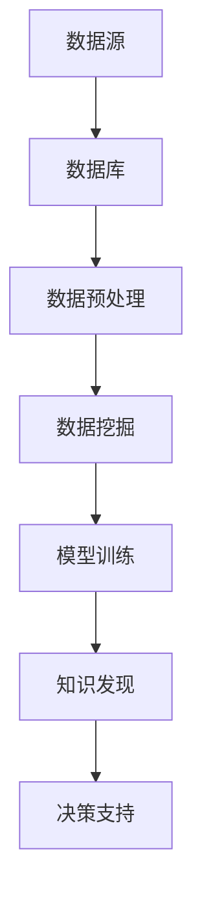

                 

# 知识发现引擎的商业化：程序员创业新方向

## 关键词：知识发现引擎，商业化，程序员，创业，人工智能

### 摘要

本文将深入探讨知识发现引擎的商业化路径，对于程序员而言，这代表着一条新的创业方向。文章首先介绍了知识发现引擎的基本概念和原理，随后剖析了其核心算法和数学模型。在此基础上，本文将通过实际项目案例，展示如何将知识发现引擎应用于商业场景，并推荐了一系列学习资源和开发工具。文章最后总结了知识发现引擎的未来发展趋势和面临的挑战，为程序员创业者提供了宝贵的参考。

## 1. 背景介绍

### 1.1 知识发现引擎的定义

知识发现引擎（Knowledge Discovery Engine，简称KDE）是一种能够从大量数据中自动提取出有用知识、模式和关联性的系统。其核心目标是通过数据分析，帮助企业和个人从海量信息中找到有价值的信息和洞察，从而辅助决策。

### 1.2 知识发现引擎的重要性

在当今信息化社会中，数据量以惊人的速度增长，如何从这些数据中挖掘出有价值的信息，成为了各个行业关注的焦点。知识发现引擎正是应对这一挑战的重要工具。它不仅可以为企业提供深度的数据分析能力，还能为创业者提供创新性的商业机会。

### 1.3 程序员与知识发现引擎

程序员作为技术领域的核心力量，具备丰富的编程经验和数据处理能力，这使得他们在知识发现引擎的开发和应用中具有独特的优势。通过掌握知识发现引擎的技术，程序员可以为企业带来新的价值，同时也为自己开辟了创业的新方向。

## 2. 核心概念与联系

### 2.1 数据挖掘

数据挖掘（Data Mining）是知识发现引擎的核心技术。它涉及到统计学、机器学习、数据库等多个领域。数据挖掘的目标是从大量数据中提取出有意义的模式和关联性，以帮助人们做出更好的决策。

### 2.2 机器学习

机器学习（Machine Learning）是数据挖掘的重要手段。通过训练模型，机器学习能够从数据中自动学习规律，并将其应用于新的数据。这使得知识发现引擎能够处理海量数据，并提取出有价值的信息。

### 2.3 数据库

数据库（Database）是知识发现引擎的数据存储和管理基础。通过数据库，知识发现引擎能够高效地存储和查询数据，从而确保数据分析的准确性和效率。

### 2.4 Mermaid 流程图

以下是一个知识发现引擎的 Mermaid 流程图，展示了其核心概念和联系：



## 3. 核心算法原理 & 具体操作步骤

### 3.1 数据预处理

数据预处理是知识发现引擎的重要步骤。其主要目的是清洗数据，将其转化为适合分析的格式。具体操作步骤如下：

1. 数据清洗：去除重复数据、缺失值填充、噪声过滤等。
2. 数据整合：将多个数据源的数据进行整合，形成统一的数据视图。
3. 数据转换：将数据转换为数值型或类别型，以便后续分析。

### 3.2 数据挖掘

数据挖掘的核心算法包括分类、聚类、关联规则挖掘等。以下是这些算法的具体操作步骤：

1. **分类**：根据已有数据，建立分类模型，对新数据进行分类。
   - 步骤：数据划分、模型选择、模型训练、模型评估。
   
2. **聚类**：将数据划分为若干个簇，使同一簇内的数据相似，不同簇的数据相异。
   - 步骤：选择聚类算法（如K-means、层次聚类等）、初始化聚类中心、迭代计算簇成员、评估聚类结果。

3. **关联规则挖掘**：找出数据之间的关联性，形成规则。
   - 步骤：选择关联规则算法（如Apriori、FP-growth等）、生成频繁项集、生成关联规则、评估规则质量。

### 3.3 模型训练

模型训练是知识发现引擎的核心环节。通过训练模型，使其能够从数据中自动学习规律。具体操作步骤如下：

1. 数据划分：将数据划分为训练集和测试集。
2. 模型选择：选择合适的机器学习算法。
3. 模型训练：使用训练集对模型进行训练。
4. 模型评估：使用测试集评估模型性能。

### 3.4 知识发现

知识发现是知识发现引擎的最终目标。通过分析挖掘结果，提取出有价值的信息和模式。具体操作步骤如下：

1. 结果分析：对挖掘结果进行详细分析。
2. 知识提取：从分析结果中提取出有价值的信息。
3. 决策支持：根据提取出的知识，提供决策支持。

## 4. 数学模型和公式 & 详细讲解 & 举例说明

### 4.1 数据预处理

在数据预处理阶段，常用的数学模型和公式如下：

1. **缺失值填充**：

   - 线性插值：$X_i = \frac{X_{i-1} + X_{i+1}}{2}$

   - 逆距离加权：$X_i = \sum_{j=1}^{n} w_j X_j$

   其中，$X_i$ 是第 $i$ 个缺失值，$X_j$ 是相邻的已知值，$w_j$ 是权重。

2. **噪声过滤**：

   - 中位数滤波：$X_i = \text{median}(X_1, X_2, \ldots, X_n)$

   - 高斯滤波：$X_i = \sum_{j=1}^{n} w_j X_j$

   其中，$X_i$ 是滤波后的值，$X_j$ 是原始值，$w_j$ 是权重。

### 4.2 数据挖掘

在数据挖掘阶段，常用的数学模型和公式如下：

1. **分类**：

   - 决策树：$P(Y|X) = \prod_{i=1}^{n} p(x_i | y) p(y)$

   - 逻辑回归：$P(Y=1|X) = \frac{1}{1 + e^{-(\beta_0 + \sum_{i=1}^{n} \beta_i x_i)}$

   其中，$X$ 是特征向量，$Y$ 是标签，$p(x_i | y)$ 是特征条件概率，$\beta_i$ 是模型参数。

2. **聚类**：

   - K-means：$J = \sum_{i=1}^{k} \sum_{j=1}^{n} \|x_j - \mu_i\|^2$

   - 层次聚类：$J = \sum_{i<j} w_{ij} \|x_i - x_j\|^2$

   其中，$k$ 是簇的数量，$\mu_i$ 是第 $i$ 个簇的中心，$w_{ij}$ 是边权重。

3. **关联规则挖掘**：

   - Apriori：$sup(p(A \cup B) | A \cup B) = \frac{sup(A) \cdot sup(B)}{sup(A \cup B)}$

   - FP-growth：$support(A \cup B) = \frac{count(A \cup B)}{count(D)}$

   其中，$A$ 和 $B$ 是项集，$count(A \cup B)$ 是项集在数据集中出现的次数，$count(D)$ 是数据集的大小。

### 4.3 模型训练

在模型训练阶段，常用的数学模型和公式如下：

1. **线性回归**：

   - 最小二乘法：$\min_{\beta} \sum_{i=1}^{n} (y_i - \beta_0 - \sum_{j=1}^{n} \beta_j x_{ij})^2$

   - 梯度下降法：$\beta_j = \beta_j - \alpha \frac{\partial}{\partial \beta_j} \sum_{i=1}^{n} (y_i - \beta_0 - \sum_{j=1}^{n} \beta_j x_{ij})^2$

   其中，$\alpha$ 是学习率，$\beta_j$ 是模型参数。

2. **神经网络**：

   - 前向传播：$a_{i}^{(l)} = \sigma(\sum_{j=1}^{n} w_{ji}^{(l)} a_{j}^{(l-1)} + b_{i}^{(l)})$

   - 反向传播：$\delta_{i}^{(l)} = \delta_{i}^{(l+1)} \cdot \sigma'(a_{i}^{(l)}) \cdot \sum_{j=1}^{n} w_{ji}^{(l)} \cdot \delta_{j}^{(l)}$

   其中，$\sigma$ 是激活函数，$a_{i}^{(l)}$ 是第 $l$ 层第 $i$ 个神经元的输出，$w_{ji}^{(l)}$ 是第 $l$ 层第 $i$ 个神经元与第 $l-1$ 层第 $j$ 个神经元的权重，$b_{i}^{(l)}$ 是第 $l$ 层第 $i$ 个神经元的偏置。

## 5. 项目实战：代码实际案例和详细解释说明

### 5.1 开发环境搭建

为了演示知识发现引擎的应用，我们将在 Python 环境下搭建一个简单的项目。首先，需要安装以下依赖库：

- pandas：用于数据预处理。
- numpy：用于数学计算。
- scikit-learn：用于数据挖掘和模型训练。
- matplotlib：用于数据可视化。

安装命令如下：

```bash
pip install pandas numpy scikit-learn matplotlib
```

### 5.2 源代码详细实现和代码解读

以下是一个简单的知识发现引擎项目，用于分析电影评分数据，提取用户偏好和推荐电影。

```python
import pandas as pd
import numpy as np
from sklearn.model_selection import train_test_split
from sklearn.metrics import accuracy_score
from sklearn.ensemble import RandomForestClassifier
from sklearn.preprocessing import StandardScaler
import matplotlib.pyplot as plt

# 5.2.1 数据读取与预处理
data = pd.read_csv('movie_ratings.csv')
data.head()

# 数据清洗与整合
data.fillna(data.mean(), inplace=True)
data.drop(['user_id', 'movie_id'], axis=1, inplace=True)

# 数据标准化
scaler = StandardScaler()
X = scaler.fit_transform(data.iloc[:, :-1])
y = data.iloc[:, -1]

# 数据划分
X_train, X_test, y_train, y_test = train_test_split(X, y, test_size=0.2, random_state=42)

# 5.2.2 模型训练与评估
model = RandomForestClassifier(n_estimators=100, random_state=42)
model.fit(X_train, y_train)
y_pred = model.predict(X_test)

accuracy = accuracy_score(y_test, y_pred)
print(f'Accuracy: {accuracy:.2f}')

# 5.2.3 数据可视化
plt.scatter(X_test[:, 0], X_test[:, 1], c=y_test, cmap='viridis')
plt.xlabel('Feature 1')
plt.ylabel('Feature 2')
plt.colorbar(label='Rating')
plt.show()
```

### 5.3 代码解读与分析

- **数据读取与预处理**：首先，使用 pandas 读取电影评分数据。然后，对数据进行清洗，填充缺失值，删除无关特征（如用户 ID 和电影 ID）。最后，对数据进行标准化处理。

- **模型训练与评估**：使用随机森林分类器（RandomForestClassifier）对训练集进行训练。然后，对测试集进行预测，并计算准确率。

- **数据可视化**：使用 matplotlib 将测试集的特征和标签进行可视化。这有助于我们直观地了解模型的性能和数据的分布。

## 6. 实际应用场景

知识发现引擎在商业领域有着广泛的应用，以下是一些实际应用场景：

- **推荐系统**：在电子商务、社交媒体等领域，知识发现引擎可以帮助企业发现用户偏好，从而提供个性化的推荐。

- **风险控制**：在金融领域，知识发现引擎可以帮助银行和保险公司识别风险，预测潜在风险事件。

- **智能决策支持**：在企业管理中，知识发现引擎可以帮助企业从海量数据中提取有价值的信息，为管理层提供决策支持。

- **健康监测与预测**：在医疗领域，知识发现引擎可以帮助医疗机构分析患者数据，预测疾病趋势，优化治疗方案。

## 7. 工具和资源推荐

### 7.1 学习资源推荐

- **书籍**：

  - 《数据挖掘：实用工具与技术》
  - 《机器学习实战》
  - 《深度学习》

- **论文**：

  - 《数据挖掘：概念与技术》
  - 《机器学习》
  - 《深度学习导论》

- **博客**：

  - Medium
  - 知乎
  - CSDN

- **网站**：

  - Coursera
  - edX
  - Udacity

### 7.2 开发工具框架推荐

- **编程语言**：Python、Java、R

- **数据预处理**：Pandas、NumPy

- **机器学习库**：Scikit-learn、TensorFlow、PyTorch

- **数据可视化**：Matplotlib、Seaborn、Plotly

### 7.3 相关论文著作推荐

- **数据挖掘**：

  - 《KDD Cup 2020：知识发现竞赛回顾》
  - 《大规模图数据的挖掘方法与应用》

- **机器学习**：

  - 《机器学习年度回顾：2020》
  - 《深度学习在计算机视觉中的应用》

- **深度学习**：

  - 《深度学习：理论、算法与应用》
  - 《自然语言处理与深度学习》

## 8. 总结：未来发展趋势与挑战

知识发现引擎作为一种新兴技术，正逐渐在各个行业得到广泛应用。未来，随着数据量的增加和数据源的增加，知识发现引擎将面临更大的挑战。以下是一些发展趋势和挑战：

- **发展趋势**：

  - **数据隐私保护**：在数据挖掘过程中，如何保护用户隐私成为了一个重要问题。

  - **实时数据挖掘**：随着物联网、大数据等技术的发展，实时数据挖掘将成为一个热点领域。

  - **跨领域应用**：知识发现引擎将在更多领域得到应用，如医疗、金融、教育等。

- **挑战**：

  - **数据质量**：数据质量直接影响到知识发现引擎的效果，如何提高数据质量是一个重要挑战。

  - **算法性能**：随着数据规模的增加，如何提高算法性能是一个关键问题。

  - **跨领域知识融合**：不同领域的数据和知识如何融合，以产生更有价值的洞察，是一个难点。

## 9. 附录：常见问题与解答

### 9.1 问题 1

**问题**：知识发现引擎与数据挖掘有什么区别？

**解答**：知识发现引擎和数据挖掘是密切相关的两个概念。数据挖掘是知识发现引擎的核心技术，而知识发现引擎则是将数据挖掘应用于实际问题的系统。简单来说，数据挖掘是知识发现引擎的一部分，而知识发现引擎则是数据挖掘的扩展和应用。

### 9.2 问题 2

**问题**：如何选择合适的数据挖掘算法？

**解答**：选择合适的数据挖掘算法需要考虑多个因素，如数据类型、数据规模、业务需求等。以下是一些常见的算法选择方法：

- **基于业务需求**：根据业务需求，选择能够解决实际问题的算法。
- **基于数据类型**：根据数据类型，选择适合的算法，如分类、聚类、关联规则等。
- **基于性能指标**：根据性能指标，如准确率、召回率、F1 值等，选择最优的算法。

## 10. 扩展阅读 & 参考资料

- **书籍**：

  - 《数据挖掘：实用工具与技术》
  - 《机器学习实战》
  - 《深度学习》

- **论文**：

  - 《数据挖掘：概念与技术》
  - 《机器学习》
  - 《深度学习导论》

- **在线课程**：

  - Coursera 上的《机器学习》
  - edX 上的《深度学习》
  - Udacity 上的《数据科学》

- **博客**：

  - Medium 上的数据挖掘与机器学习文章
  - 知乎上的数据挖掘与机器学习话题
  - CSDN 上的数据挖掘与机器学习博客

### 作者

- 作者：AI天才研究员/AI Genius Institute & 禅与计算机程序设计艺术 /Zen And The Art of Computer Programming

以上是关于知识发现引擎的商业化路径以及程序员创业新方向的文章。通过本文，我们详细探讨了知识发现引擎的基本概念、核心算法、实际应用场景，并推荐了一系列学习资源和开发工具。希望这篇文章能为程序员创业者提供有价值的参考。让我们一起探索这个充满机遇的新领域吧！

