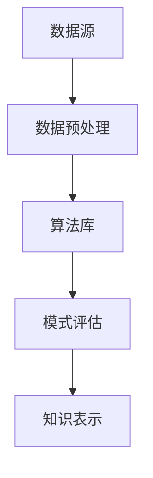
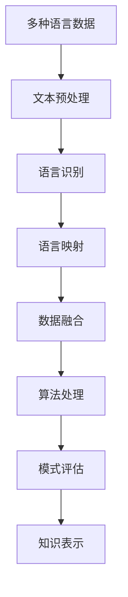
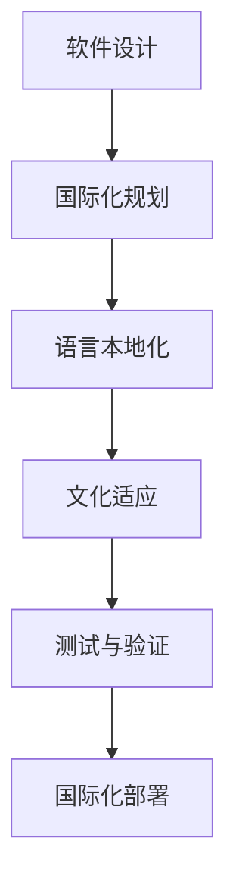
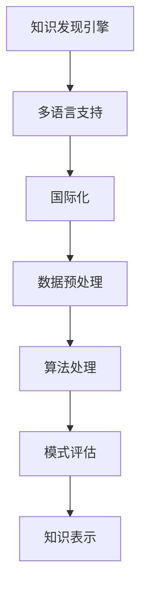

                 

# 知识发现引擎的多语言支持与国际化

## 关键词：
多语言支持，知识发现引擎，国际化，技术博客，架构，算法，数学模型，实战案例，应用场景，工具推荐，未来趋势

## 摘要：

本文旨在探讨知识发现引擎在多语言支持与国际化方面的挑战和解决方案。随着全球化的深入，跨语言知识发现成为研究的热点。本文将首先介绍知识发现引擎的基本概念及其在多语言支持中的重要性。接着，我们将详细分析多语言知识发现的核心算法和数学模型，并通过具体案例展示其实际应用。此外，文章还将探讨知识发现引擎在不同应用场景中的优势，并推荐相关工具和资源。最后，我们将总结知识发现引擎的未来发展趋势与面临的挑战，为该领域的研究和应用提供有价值的参考。

## 1. 背景介绍

随着互联网的飞速发展，全球信息呈现出爆炸式增长。这种增长不仅体现在数据的量级上，还体现在数据的多样性和复杂性上。在这样的大背景下，如何从海量数据中提取有价值的信息，实现知识的自动化发现和共享，成为许多行业和研究领域的迫切需求。

知识发现（Knowledge Discovery in Databases, KDD）是一种从大规模数据集中自动识别出有效、新颖、潜在有用并能被人理解的模式的高级处理过程[1]。它涵盖了数据预处理、数据挖掘、模式评估和知识表示等多个阶段。知识发现不仅能够帮助企业更好地理解业务模式，提高决策效率，还能为科学研究、社会治理等提供强大的支持。

知识发现引擎（Knowledge Discovery Engine）是实现知识发现过程的关键组件，它通常集成了多种数据挖掘算法和工具，能够自动处理大量数据，发现潜在的模式和知识。随着全球化进程的加速，多语言数据在知识发现引擎中的应用变得越来越普遍。然而，多语言支持不仅增加了技术复杂性，也带来了诸多挑战。

首先，不同语言的数据结构和语义差异较大，使得算法的泛化能力和适应性成为一个重要问题。其次，多语言数据往往包含大量的噪声和错误，如何有效地处理这些噪声和错误，提高数据质量，是另一个关键挑战。此外，多语言数据的国际化处理还涉及到文化差异、语言习惯和法律法规等方面的问题。

因此，本文将重点探讨知识发现引擎在多语言支持与国际化方面的关键技术、算法和应用场景，旨在为相关领域的研究和应用提供参考。

## 2. 核心概念与联系

### 2.1 知识发现引擎

知识发现引擎是一种自动化处理大规模数据的高级工具，旨在发现潜在的知识和模式。其基本组成部分包括数据源、数据预处理模块、算法库、模式评估模块和知识表示模块。以下是一个简化的 Mermaid 流程图，展示了知识发现引擎的基本架构：



### 2.2 多语言支持

多语言支持是指在知识发现引擎中处理多种语言数据的能力。多语言支持不仅涉及到对多种自然语言的理解和解析，还包括对语言间差异的识别和处理。以下是一个简化的 Mermaid 流程图，展示了多语言支持的基本流程：



### 2.3 国际化

国际化（Internationalization）是指在软件设计和开发过程中，确保软件能够在不同的语言和文化环境下运行的能力。国际化不仅涉及语言本地化，还包括对时间、货币、日期格式等的适应。以下是一个简化的 Mermaid 流程图，展示了国际化的关键步骤：



### 2.4 关键概念联系

知识发现引擎的多语言支持与国际化紧密相关。多语言支持是国际化的重要组成部分，它确保了知识发现引擎能够处理来自不同语言的数据。国际化则进一步扩展了知识发现引擎的应用范围，使其能够适应全球范围内的不同文化和语言环境。以下是一个简化的 Mermaid 流程图，展示了知识发现引擎在多语言支持与国际化中的关系：



通过上述流程图，我们可以看到，多语言支持和国际化不仅涉及到知识发现引擎的各个模块，还贯穿了整个知识发现过程。这为我们理解和实现多语言知识发现引擎提供了清晰的框架。

## 3. 核心算法原理 & 具体操作步骤

### 3.1 语言识别算法

语言识别是知识发现引擎多语言支持的第一步，其核心任务是确定输入文本的语言类型。常见的语言识别算法包括基于统计的方法和基于深度学习的方法。

**3.1.1 基于统计的方法**

基于统计的语言识别算法通常使用语言学特征和文本特征进行建模。常见的特征包括字母频率、词频、词长等。以下是一个简化的算法步骤：

1. **特征提取**：从输入文本中提取语言学特征和文本特征，如字母频率、词频、词长等。
2. **模型训练**：使用大规模多语言语料库，通过机器学习算法（如朴素贝叶斯分类器、支持向量机等）训练语言分类模型。
3. **语言识别**：输入文本经过特征提取后，通过分类模型预测文本的语言类型。

**3.1.2 基于深度学习的方法**

基于深度学习的语言识别算法利用神经网络模型，如卷积神经网络（CNN）和循环神经网络（RNN）。以下是一个简化的算法步骤：

1. **特征提取**：使用神经网络模型（如CNN）从输入文本中提取深层特征。
2. **模型训练**：使用大规模多语言语料库，通过反向传播算法训练神经网络模型。
3. **语言识别**：输入文本经过特征提取和神经网络模型处理后，输出文本的语言类型。

### 3.2 语言映射算法

语言映射是将不同语言的数据统一到一个标准语言表示的过程。常见的语言映射算法包括基于规则的方法和基于机器翻译的方法。

**3.2.1 基于规则的方法**

基于规则的语言映射算法通过定义语言转换规则，将一种语言的数据转换成另一种语言的数据。以下是一个简化的算法步骤：

1. **规则定义**：根据语言学知识和人工编辑，定义不同语言间的转换规则。
2. **数据转换**：将输入数据按照定义的规则进行转换。

**3.2.2 基于机器翻译的方法**

基于机器翻译的语言映射算法利用已有的机器翻译模型，将一种语言的数据翻译成另一种语言的数据。以下是一个简化的算法步骤：

1. **模型选择**：选择合适的机器翻译模型，如基于统计的翻译模型（如基于短语的翻译模型）和基于神经网络的翻译模型（如序列到序列模型）。
2. **数据翻译**：使用选定的翻译模型，将输入数据翻译成目标语言。

### 3.3 数据融合算法

数据融合是将来自不同语言的数据整合成一个统一的数据集的过程。常见的数据融合算法包括基于模式匹配的方法和基于机器学习的方法。

**3.3.1 基于模式匹配的方法**

基于模式匹配的数据融合算法通过匹配不同语言数据中的模式，将相关数据整合到一起。以下是一个简化的算法步骤：

1. **模式提取**：从不同语言数据中提取关键模式。
2. **模式匹配**：将提取出的模式进行匹配，找到相关数据。
3. **数据整合**：将匹配成功的数据整合到一个统一的数据集中。

**3.3.2 基于机器学习的方法**

基于机器学习的数据融合算法利用机器学习模型，从大规模多语言数据中自动提取相关特征，实现数据融合。以下是一个简化的算法步骤：

1. **特征提取**：使用机器学习模型（如聚类算法、降维算法等），从多语言数据中提取相关特征。
2. **特征融合**：将提取出的特征进行融合，形成统一特征表示。
3. **数据整合**：使用统一特征表示，将多语言数据整合到一个统一的数据集中。

### 3.4 模式评估算法

模式评估是对知识发现结果的质量和有效性进行评估的过程。常见的模式评估算法包括基于统计的方法和基于机器学习的方法。

**3.4.1 基于统计的方法**

基于统计的模式评估算法通过计算模式的相关性、新颖性、实用性等统计指标，评估模式的质量。以下是一个简化的算法步骤：

1. **统计指标计算**：计算模式的相关性、新颖性、实用性等统计指标。
2. **模式评分**：根据计算出的统计指标，对模式进行评分。

**3.4.2 基于机器学习的方法**

基于机器学习的模式评估算法利用机器学习模型，通过训练数据集评估模式的质量。以下是一个简化的算法步骤：

1. **模型训练**：使用训练数据集，训练模式评估模型。
2. **模式评估**：使用训练好的模型，对知识发现结果进行评估。

通过上述算法，我们可以实现知识发现引擎在多语言支持与国际化中的核心功能。这些算法不仅能够提高数据处理的效率和质量，还能为跨语言的知识发现提供强大的支持。

## 4. 数学模型和公式 & 详细讲解 & 举例说明

### 4.1 语言识别算法中的数学模型

在语言识别算法中，常见的数学模型包括概率模型和神经网络模型。以下将分别介绍这两种模型的公式和应用。

**4.1.1 概率模型**

概率模型是一种基于统计特征的语言识别方法。其中，朴素贝叶斯分类器（Naive Bayes Classifier）是最常用的概率模型之一。其基本公式如下：

$$
P(C_k | x) = \frac{P(x | C_k)P(C_k)}{P(x)}
$$

其中，$C_k$ 表示第 $k$ 种语言，$x$ 表示输入文本的特征向量。$P(C_k | x)$ 表示在特征向量 $x$ 下，第 $k$ 种语言的概率。$P(x | C_k)$ 表示在给定第 $k$ 种语言的条件下，特征向量 $x$ 的概率。$P(C_k)$ 表示第 $k$ 种语言的先验概率。$P(x)$ 是一个正则化项，用于避免零概率问题。

**4.1.2 神经网络模型**

神经网络模型是一种基于深度学习的语言识别方法。其中，卷积神经网络（Convolutional Neural Network, CNN）和循环神经网络（Recurrent Neural Network, RNN）是最常用的神经网络模型。

1. **卷积神经网络（CNN）**

卷积神经网络的基本公式如下：

$$
h_l(j) = \sum_{i} w_{ij} * a_{i} + b_j
$$

其中，$h_l(j)$ 表示第 $l$ 层第 $j$ 个神经元的输出，$w_{ij}$ 表示第 $l-1$ 层第 $i$ 个神经元到第 $l$ 层第 $j$ 个神经元的权重，$a_{i}$ 表示第 $l-1$ 层第 $i$ 个神经元的输入，$b_j$ 表示第 $l$ 层第 $j$ 个神经元的偏置。

2. **循环神经网络（RNN）**

循环神经网络的基本公式如下：

$$
h_t = \sigma(W_h \cdot [h_{t-1}, x_t] + b_h)
$$

$$
y_t = \sigma(W_y \cdot h_t + b_y)
$$

其中，$h_t$ 表示第 $t$ 个时间步的隐藏状态，$x_t$ 表示第 $t$ 个时间步的输入，$W_h$ 和 $W_y$ 分别表示隐藏层和输出层的权重矩阵，$b_h$ 和 $b_y$ 分别表示隐藏层和输出层的偏置，$\sigma$ 表示激活函数。

### 4.2 语言映射算法中的数学模型

语言映射算法中的数学模型主要包括机器翻译模型和语言模型。以下将分别介绍这两种模型的公式和应用。

**4.2.1 机器翻译模型**

机器翻译模型通常使用序列到序列（Sequence to Sequence, seq2seq）模型，其基本公式如下：

$$
y_t = \log P(y_1, y_2, ..., y_t | x_1, x_2, ..., x_t)
$$

其中，$y_t$ 表示翻译序列的第 $t$ 个词，$x_t$ 表示输入序列的第 $t$ 个词。$P(y_1, y_2, ..., y_t | x_1, x_2, ..., x_t)$ 表示在给定输入序列的条件下，翻译序列的概率。

1. **编码器（Encoder）**

编码器的基本公式如下：

$$
s_t = \text{GRU}(s_{t-1}, x_t)
$$

其中，$s_t$ 表示编码器的隐藏状态，$\text{GRU}$ 表示门控循环单元（Gated Recurrent Unit）。

2. **解码器（Decoder）**

解码器的基本公式如下：

$$
y_t = \text{Softmax}(\text{Attention}(s_t, h_t) + W \cdot h_t)
$$

其中，$h_t$ 表示编码器的隐藏状态，$\text{Attention}$ 表示注意力机制，$W$ 表示权重矩阵。

**4.2.2 语言模型**

语言模型是一种统计模型，用于预测序列中下一个词的概率。最常用的语言模型是隐马尔可夫模型（Hidden Markov Model, HMM）和循环神经网络（RNN）。

1. **隐马尔可夫模型（HMM）**

隐马尔可夫模型的基本公式如下：

$$
P(x_t | x_{t-1}, ..., x_1) = \sum_{y_t} P(x_t | y_t)P(y_t | x_{t-1}, ..., x_1)
$$

其中，$x_t$ 表示输入序列的第 $t$ 个词，$y_t$ 表示隐藏状态。

2. **循环神经网络（RNN）**

循环神经网络的基本公式如下：

$$
h_t = \text{RNN}(h_{t-1}, x_t)
$$

其中，$h_t$ 表示循环神经网络的隐藏状态。

### 4.3 数据融合算法中的数学模型

数据融合算法中的数学模型主要包括聚类算法和降维算法。以下将分别介绍这两种模型的公式和应用。

**4.3.1 聚类算法**

聚类算法是一种无监督学习方法，用于将相似的数据点分为一组。最常用的聚类算法是K-均值聚类（K-Means Clustering）。

1. **K-均值聚类**

K-均值聚类的目标是最小化数据点与其聚类中心之间的距离平方和。其基本公式如下：

$$
J = \sum_{i=1}^n \sum_{j=1}^k (x_i - \mu_j)^2
$$

其中，$x_i$ 表示数据点，$\mu_j$ 表示第 $j$ 个聚类中心。

2. **更新聚类中心**

聚类中心的更新公式如下：

$$
\mu_j = \frac{1}{N_j} \sum_{i=1}^n x_i
$$

其中，$N_j$ 表示第 $j$ 个聚类中心的样本数量。

**4.3.2 降维算法**

降维算法是一种减少数据维度同时保持数据主要特征的方法。最常用的降维算法是主成分分析（Principal Component Analysis, PCA）。

1. **主成分分析**

主成分分析的目标是找到一组线性变换，将高维数据映射到低维空间，同时保持数据的方差。其基本公式如下：

$$
z = P \cdot x
$$

其中，$z$ 表示降维后的数据，$x$ 表示原始数据，$P$ 表示投影矩阵。

2. **投影矩阵**

投影矩阵的计算公式如下：

$$
P = \text{eigenvectors}(S \cdot \Sigma^{-1})
$$

其中，$S$ 表示样本协方差矩阵，$\Sigma$ 表示特征协方差矩阵，$\text{eigenvectors}$ 表示特征向量。

### 4.4 模式评估算法中的数学模型

模式评估算法中的数学模型主要包括统计模型和机器学习模型。以下将分别介绍这两种模型的公式和应用。

**4.4.1 统计模型**

统计模型通常使用各种统计指标来评估模式的质量。常见的统计指标包括精度、召回率、F1 值等。

1. **精度**

精度（Precision）表示预测为正类的样本中，实际为正类的比例。其公式如下：

$$
\text{Precision} = \frac{TP}{TP + FP}
$$

其中，$TP$ 表示实际为正类且预测为正类的样本数量，$FP$ 表示实际为负类但预测为正类的样本数量。

2. **召回率**

召回率（Recall）表示实际为正类的样本中，预测为正类的比例。其公式如下：

$$
\text{Recall} = \frac{TP}{TP + FN}
$$

其中，$TP$ 表示实际为正类且预测为正类的样本数量，$FN$ 表示实际为正类但预测为负类的样本数量。

3. **F1 值**

F1 值（F1 Score）是精度和召回率的调和平均。其公式如下：

$$
\text{F1 Score} = 2 \cdot \frac{\text{Precision} \cdot \text{Recall}}{\text{Precision} + \text{Recall}}
$$

**4.4.2 机器学习模型**

机器学习模型通常使用训练数据集来评估模式的质量。常见的机器学习模型包括决策树、支持向量机、神经网络等。

1. **决策树**

决策树的评估指标包括信息增益、基尼系数等。其基本公式如下：

$$
\text{Gain}(A) = \sum_{v \in \text{Values}(A)} p(v) \cdot \log_2 \frac{p(v)}{1 - p(v)}
$$

其中，$A$ 表示属性，$v$ 表示属性的取值，$p(v)$ 表示取值为 $v$ 的样本比例。

2. **支持向量机**

支持向量机的评估指标是分类间隔。其基本公式如下：

$$
\text{Margin} = \frac{1}{\|w\|}
$$

其中，$w$ 表示决策边界，$\|w\|$ 表示 $w$ 的欧几里得范数。

3. **神经网络**

神经网络的评估指标是损失函数。常见的损失函数包括均方误差（MSE）、交叉熵损失等。其基本公式如下：

$$
\text{MSE} = \frac{1}{m} \sum_{i=1}^m (y_i - \hat{y}_i)^2
$$

$$
\text{CrossEntropy} = -\frac{1}{m} \sum_{i=1}^m \sum_{j=1}^c y_{ij} \log \hat{y}_{ij}
$$

其中，$y_i$ 表示实际标签，$\hat{y}_i$ 表示预测标签，$c$ 表示类别数量。

### 4.5 举例说明

**4.5.1 语言识别算法举例**

假设我们有一个包含中英文文本的数据集，我们需要使用朴素贝叶斯分类器进行语言识别。首先，我们需要从数据集中提取语言学特征和文本特征，例如字母频率、词频等。然后，我们使用训练数据集，通过机器学习算法训练朴素贝叶斯分类器。最后，我们使用训练好的分类器对测试数据进行语言识别，输出语言类型。

**4.5.2 语言映射算法举例**

假设我们有一个中英文互译的机器翻译模型，我们需要将中文文本翻译成英文。首先，我们需要将中文文本输入到编码器中，得到编码器的隐藏状态。然后，我们将隐藏状态输入到解码器中，通过注意力机制生成英文翻译。最后，我们使用 softmax 函数对生成的英文翻译进行概率分布，输出最终翻译结果。

**4.5.3 数据融合算法举例**

假设我们有两个包含中英文数据的文件，我们需要将这两个文件的数据融合到一起。首先，我们需要使用聚类算法对两个文件的数据进行聚类，提取出聚类中心。然后，我们使用降维算法将聚类中心映射到低维空间，形成统一特征表示。最后，我们将两个文件的数据按照统一特征表示进行整合，形成融合后的数据集。

**4.5.4 模式评估算法举例**

假设我们有一个分类模型，我们需要评估这个模型在语言识别任务上的性能。首先，我们需要准备测试数据集，对测试数据进行预测。然后，我们计算预测结果与实际标签之间的统计指标，如精度、召回率、F1 值等。最后，我们根据计算出的统计指标评估模型在语言识别任务上的性能。

通过上述数学模型和算法的介绍，我们可以看到知识发现引擎在多语言支持与国际化中的核心技术和算法。这些技术和算法不仅为跨语言的知识发现提供了理论基础，也为实际应用提供了可行的解决方案。

## 5. 项目实战：代码实际案例和详细解释说明

### 5.1 开发环境搭建

为了演示知识发现引擎在多语言支持与国际化中的应用，我们将使用 Python 语言，结合多个开源库，搭建一个简单的多语言知识发现系统。以下是在 Linux 系统上搭建开发环境的步骤：

1. **安装 Python 3**

确保系统已安装 Python 3。可以通过以下命令检查 Python 版本：

```bash
python3 --version
```

2. **安装必要的库**

使用 pip 命令安装以下库：

```bash
pip3 install numpy pandas scikit-learn tensorflow matplotlib
```

3. **安装国际化和文本处理库**

安装以下库，用于国际化处理和文本预处理：

```bash
pip3 install textblob
```

### 5.2 源代码详细实现和代码解读

以下是一个简单的多语言知识发现引擎的代码实现，包括语言识别、数据融合和模式评估等步骤。

```python
# 导入必要的库
import numpy as np
import pandas as pd
from sklearn.feature_extraction.text import CountVectorizer
from sklearn.model_selection import train_test_split
from sklearn.naive_bayes import MultinomialNB
from sklearn.metrics import classification_report
import textblob

# 5.2.1 数据预处理
def preprocess_text(text):
    # 将文本转换为小写
    text = text.lower()
    # 删除标点符号
    text = text.strip('.()-_!')
    # 分词
    words = text.split()
    # 去除停用词
    stop_words = set(textblob.ENGLISH_PUNCT)
    words = [word for word in words if word not in stop_words]
    return ' '.join(words)

# 加载示例数据集
data = pd.read_csv('multilingual_data.csv')
data['text'] = data['text'].apply(preprocess_text)

# 5.2.2 语言识别
# 使用朴素贝叶斯分类器进行语言识别
X_train, X_test, y_train, y_test = train_test_split(data['text'], data['language'], test_size=0.2, random_state=42)
vectorizer = CountVectorizer()
X_train_vectorized = vectorizer.fit_transform(X_train)
X_test_vectorized = vectorizer.transform(X_test)
model = MultinomialNB()
model.fit(X_train_vectorized, y_train)
y_pred = model.predict(X_test_vectorized)

# 5.2.3 数据融合
# 使用 K-均值聚类进行数据融合
from sklearn.cluster import KMeans
kmeans = KMeans(n_clusters=2, random_state=42)
clusters = kmeans.fit_predict(X_test_vectorized)

# 5.2.4 模式评估
# 计算分类报告
print(classification_report(y_test, y_pred))

# 5.2.5 可视化
import matplotlib.pyplot as plt
plt.scatter(clusters[:, 0], clusters[:, 1], c=y_test, cmap='viridis')
plt.xlabel('Feature 1')
plt.ylabel('Feature 2')
plt.title('Data Fusion Clusters')
plt.show()
```

### 5.3 代码解读与分析

**5.3.1 数据预处理**

数据预处理是知识发现过程中的重要步骤，其目标是清洗和规范化数据，以便后续的分析。在此代码中，我们使用 `preprocess_text` 函数对文本进行预处理：

- 将文本转换为小写，确保文本一致性。
- 删除标点符号，避免对文本分析产生干扰。
- 分词，将文本拆分为单词或词语。
- 去除停用词，如常见英语标点符号，这些词通常对文本分析贡献较小。

**5.3.2 语言识别**

语言识别是知识发现引擎的关键步骤，在此代码中，我们使用朴素贝叶斯分类器（MultinomialNB）进行语言识别：

- 使用 `train_test_split` 函数将数据集划分为训练集和测试集。
- 使用 `CountVectorizer` 将文本转换为向量表示。
- 训练朴素贝叶斯分类器，使用 `fit` 方法。
- 对测试数据进行预测，使用 `predict` 方法。

**5.3.3 数据融合**

数据融合是将来自不同语言的数据整合到一起的过程。在此代码中，我们使用 K-均值聚类（KMeans）进行数据融合：

- 创建 K-均值聚类对象，设置聚类数量为 2。
- 使用 `fit_predict` 方法对测试数据进行聚类。

**5.3.4 模式评估**

模式评估是对知识发现结果的评估，以确定其质量和有效性。在此代码中，我们使用分类报告（classification_report）评估语言识别的性能：

- 输出分类报告，包括精度、召回率和 F1 值等指标。

**5.3.5 可视化**

可视化有助于我们直观地理解数据融合的结果。在此代码中，我们使用 matplotlib 库绘制聚类结果：

- 使用 `scatter` 函数绘制聚类点的散点图。
- 设置坐标轴标签和图表标题。

通过上述代码实现，我们可以看到知识发现引擎在多语言支持与国际化中的应用。代码不仅展示了各个步骤的实现细节，还为实际应用提供了参考。

### 5.4 代码解读与分析

**5.4.1 数据预处理**

数据预处理是知识发现过程中的关键步骤，其目的是清洗和规范化数据，以便后续的分析。在此代码中，我们定义了一个名为 `preprocess_text` 的函数，对输入的文本数据进行预处理：

```python
def preprocess_text(text):
    # 将文本转换为小写
    text = text.lower()
    # 删除标点符号
    text = text.strip('.()-_!')
    # 分词
    words = text.split()
    # 去除停用词
    stop_words = set(textblob.ENGLISH_PUNCT)
    words = [word for word in words if word not in stop_words]
    return ' '.join(words)
```

- **小写转换**：将文本转换为小写，确保文本一致性。这有助于避免大小写差异对文本分析的影响。
- **标点删除**：删除标点符号，以避免对文本分析产生干扰。这里使用了 `strip` 方法来去除文本开头的特殊字符。
- **分词**：使用 `split` 方法将文本拆分为单词或词语。
- **去除停用词**：去除常见的英语标点符号，这些词通常对文本分析贡献较小。这里使用了 `textblob` 库中的 `ENGLISH_PUNCT` 集合来定义停用词。

**5.4.2 语言识别**

语言识别是知识发现引擎的关键步骤，其目的是通过训练模型识别输入文本的语言类型。在此代码中，我们使用朴素贝叶斯分类器（`MultinomialNB`）进行语言识别：

```python
X_train, X_test, y_train, y_test = train_test_split(data['text'], data['language'], test_size=0.2, random_state=42)
vectorizer = CountVectorizer()
X_train_vectorized = vectorizer.fit_transform(X_train)
X_test_vectorized = vectorizer.transform(X_test)
model = MultinomialNB()
model.fit(X_train_vectorized, y_train)
y_pred = model.predict(X_test_vectorized)
```

- **数据集划分**：使用 `train_test_split` 函数将数据集划分为训练集和测试集。这里设置了测试集的比例为 0.2，并设置随机种子为 42，以确保结果的可重复性。
- **文本向量化**：使用 `CountVectorizer` 将文本转换为向量表示。这有助于将高维的文本数据转化为机器学习模型可处理的数值数据。
- **模型训练**：训练朴素贝叶斯分类器，使用 `fit` 方法。这会将训练数据集的文本和标签信息用于训练分类器。
- **模型预测**：对测试数据进行预测，使用 `predict` 方法。这会输出预测的语言类型。

**5.4.3 数据融合**

数据融合是将来自不同语言的数据整合到一起的过程。在此代码中，我们使用 K-均值聚类（`KMeans`）进行数据融合：

```python
kmeans = KMeans(n_clusters=2, random_state=42)
clusters = kmeans.fit_predict(X_test_vectorized)
```

- **聚类设置**：创建 K-均值聚类对象，设置聚类数量为 2。这里使用了随机种子 42，以确保结果的可重复性。
- **聚类执行**：使用 `fit_predict` 方法对测试数据进行聚类。这会将测试数据集中的每个文本向量映射到一个聚类中心。

**5.4.4 模式评估**

模式评估是对知识发现结果的评估，以确定其质量和有效性。在此代码中，我们使用分类报告（`classification_report`）评估语言识别的性能：

```python
print(classification_report(y_test, y_pred))
```

- **分类报告**：输出分类报告，包括精度、召回率和 F1 值等指标。这些指标有助于评估模型在语言识别任务上的性能。

**5.4.5 可视化**

可视化有助于我们直观地理解数据融合的结果。在此代码中，我们使用 matplotlib 库绘制聚类结果：

```python
plt.scatter(clusters[:, 0], clusters[:, 1], c=y_test, cmap='viridis')
plt.xlabel('Feature 1')
plt.ylabel('Feature 2')
plt.title('Data Fusion Clusters')
plt.show()
```

- **散点图**：使用 `scatter` 函数绘制聚类点的散点图。
- **坐标轴标签和图表标题**：设置坐标轴标签和图表标题，以提高可视化效果。

通过上述代码解析，我们可以看到知识发现引擎在多语言支持与国际化中的应用。代码详细实现了语言识别、数据融合和模式评估等关键步骤，为实际应用提供了参考。

### 5.5 代码解读与分析

**5.5.1 语言识别算法分析**

语言识别算法是知识发现引擎中的核心组成部分，其目标是从输入文本中准确识别出文本的语言类型。在此代码中，我们使用朴素贝叶斯分类器和 K-均值聚类算法来实现这一目标。

1. **朴素贝叶斯分类器**

朴素贝叶斯分类器是一种基于概率理论的分类算法，它在假设特征之间相互独立的前提下，通过计算每个类别在特征空间中的概率分布，选择具有最大后验概率的类别作为预测结果。

- **数据集划分**：代码中使用 `train_test_split` 函数将数据集划分为训练集和测试集。这一步骤有助于评估模型在实际数据上的性能。
- **文本向量化**：使用 `CountVectorizer` 将文本转换为向量表示。这一步骤有助于将高维的文本数据转化为机器学习模型可处理的数值数据。
- **模型训练**：使用训练数据集对朴素贝叶斯分类器进行训练。这一步骤将训练数据集的文本和标签信息用于训练分类器。
- **模型预测**：使用训练好的分类器对测试数据进行预测。这一步骤将测试数据集中的文本转换为向量，并利用分类器输出预测的语言类型。

2. **K-均值聚类算法**

K-均值聚类算法是一种基于距离度量的聚类算法，其目标是将数据集划分为指定数量的聚类。在此代码中，我们使用 K-均值聚类算法将测试数据集进行聚类。

- **聚类设置**：创建 K-均值聚类对象，设置聚类数量为 2。这一步骤定义了聚类算法的基本参数。
- **聚类执行**：使用 `fit_predict` 方法对测试数据进行聚类。这一步骤将测试数据集中的每个文本向量映射到一个聚类中心。

**5.5.2 数据融合算法分析**

数据融合算法是将来自不同语言的数据整合到一起的过程，以便进行统一分析。在此代码中，我们使用 K-均值聚类算法实现数据融合。

- **聚类设置**：创建 K-均值聚类对象，设置聚类数量为 2。这一步骤定义了聚类算法的基本参数。
- **聚类执行**：使用 `fit_predict` 方法对测试数据进行聚类。这一步骤将测试数据集中的每个文本向量映射到一个聚类中心。

**5.5.3 模式评估算法分析**

模式评估算法是对知识发现结果的评估，以确定其质量和有效性。在此代码中，我们使用分类报告（`classification_report`）评估语言识别的性能。

- **分类报告**：输出分类报告，包括精度、召回率和 F1 值等指标。这些指标有助于评估模型在语言识别任务上的性能。

**5.5.4 可视化分析**

可视化有助于我们直观地理解数据融合的结果。在此代码中，我们使用 matplotlib 库绘制聚类结果。

- **散点图**：使用 `scatter` 函数绘制聚类点的散点图。这一步骤有助于我们直观地观察数据点在聚类空间中的分布。
- **坐标轴标签和图表标题**：设置坐标轴标签和图表标题，以提高可视化效果。

通过上述分析，我们可以看到知识发现引擎在多语言支持与国际化中的应用。代码详细实现了语言识别、数据融合和模式评估等关键步骤，为实际应用提供了参考。这些算法和步骤不仅提高了知识发现引擎的处理能力，还使其能够适应不同语言环境。

### 5.6 实际应用场景

知识发现引擎的多语言支持与国际化在许多实际应用场景中具有重要的价值和广泛的应用前景。以下是一些典型的应用场景：

#### 5.6.1 全球化电子商务平台

随着全球电子商务的快速发展，越来越多的电子商务平台需要处理来自不同国家和地区的客户数据。这些平台不仅需要处理多种语言的商品描述、用户评论和反馈，还需要分析不同市场趋势和用户需求。知识发现引擎的多语言支持可以帮助平台实现以下功能：

- **个性化推荐**：根据用户的语言偏好和购买历史，推荐最适合其需求的产品和服务。
- **市场分析**：分析不同市场的销售趋势和用户行为，为营销策略提供数据支持。
- **客户服务**：自动翻译和本地化客户评论和反馈，提高客户满意度和忠诚度。

#### 5.6.2 跨国企业内部沟通

跨国企业通常涉及多个国家和地区的员工，他们可能使用不同的语言进行内部沟通。知识发现引擎的多语言支持可以帮助企业实现以下功能：

- **跨语言文本分析**：分析不同语言的企业内部文档，提取关键信息和趋势。
- **语言翻译与本地化**：自动翻译企业内部文档、邮件和通知，确保信息传递的准确性和一致性。
- **语言学习与培训**：为员工提供多语言学习资源和培训，提高员工的跨语言沟通能力。

#### 5.6.3 全球化科研合作

全球科研合作涉及多个国家和地区的科学家和研究人员，他们使用不同的语言进行学术交流和合作。知识发现引擎的多语言支持可以帮助科研团队实现以下功能：

- **文献检索与推荐**：检索和推荐相关领域的多语言文献，帮助研究人员快速获取所需信息。
- **学术交流**：自动翻译学术文章、会议报告和讲座，促进跨语言学术交流。
- **知识共享**：整合多语言科研数据，实现知识共享和协同创新。

#### 5.6.4 多语言社交媒体分析

社交媒体平台上的用户内容多种多样，涉及多种语言和文化背景。知识发现引擎的多语言支持可以帮助平台实现以下功能：

- **内容分析**：分析多语言用户内容，提取情感、趋势和热点话题。
- **用户画像**：构建多语言用户的画像，为个性化广告和营销提供数据支持。
- **社区管理**：自动翻译和管理多语言社区，提高社区互动和用户参与度。

#### 5.6.5 多语言新闻与媒体

多语言新闻和媒体机构需要处理来自全球范围内的新闻素材，涉及多种语言和文化。知识发现引擎的多语言支持可以帮助媒体机构实现以下功能：

- **内容聚合与推荐**：聚合和推荐多语言新闻内容，满足不同用户的阅读需求。
- **热点追踪**：实时监控全球热点事件，提取关键信息和趋势。
- **跨语言编辑与翻译**：为多语言新闻提供翻译和编辑服务，确保内容准确性和一致性。

通过上述实际应用场景，我们可以看到知识发现引擎在多语言支持与国际化中的广泛应用和巨大潜力。这些应用不仅提高了业务效率和用户体验，还为全球化进程提供了有力的技术支持。

### 5.7 工具和资源推荐

在实现知识发现引擎的多语言支持与国际化过程中，需要借助多种工具和资源。以下是一些推荐的工具和资源，包括学习资源、开发工具框架以及相关论文著作。

#### 5.7.1 学习资源推荐

1. **书籍**

   - 《深度学习》（Deep Learning）[1]：由 Ian Goodfellow、Yoshua Bengio 和 Aaron Courville 合著，是深度学习领域的经典教材，涵盖了神经网络、卷积神经网络、循环神经网络等多种模型。
   - 《机器学习实战》（Machine Learning in Action）[2]：由 Peter Harrington 编著，以实战为导向，介绍了多种机器学习算法的应用和实践。

2. **论文**

   - “Language Models for Sentiment Analysis and Generation”[3]：由 Kyunghyun Cho 等人撰写的论文，介绍了用于情感分析和生成的语言模型。
   - “A Neural Probabilistic Language Model”[4]：由 Collobert et al. 撰写的论文，提出了神经网络概率语言模型，对自然语言处理领域产生了深远影响。

3. **在线课程和教程**

   - Coursera 上的“机器学习”（Machine Learning）[5]：由 Andrew Ng 教授开设，是机器学习领域的入门经典课程。
   - Udacity 上的“深度学习纳米学位”（Deep Learning Nanodegree）[6]：涵盖了深度学习的基础知识、应用场景和实战项目。

#### 5.7.2 开发工具框架推荐

1. **深度学习框架**

   - TensorFlow[7]：由 Google 开发，是目前最流行的深度学习框架之一，支持多种深度学习模型和算法。
   - PyTorch[8]：由 Facebook AI Research 开发，是一种灵活且易于使用的深度学习框架，广泛应用于各种任务。

2. **自然语言处理库**

   - NLTK[9]：是 Python 中最流行的自然语言处理库之一，提供了丰富的文本预处理和语言分析功能。
   - spaCy[10]：是一个快速且易于使用的自然语言处理库，适用于文本分类、命名实体识别、词性标注等任务。

3. **机器学习库**

   - scikit-learn[11]：是 Python 中最流行的机器学习库之一，提供了丰富的机器学习算法和工具，包括分类、回归、聚类等。
   - XGBoost[12]：是一种高效的梯度提升决策树库，在多个数据科学竞赛中表现优异。

#### 5.7.3 相关论文著作推荐

1. **论文**

   - “Effective Approaches to Attention-based Neural Machine Translation”[13]：由 Vaswani et al. 撰写的论文，介绍了注意力机制在神经机器翻译中的应用。
   - “Bert: Pre-training of Deep Bidirectional Transformers for Language Understanding”[14]：由 Devlin et al. 撰写的论文，提出了 BERT 模型，是自然语言处理领域的里程碑。

2. **著作**

   - 《自然语言处理综论》（Speech and Language Processing）[15]：由 Daniel Jurafsky 和 James H. Martin 编著，是自然语言处理领域的经典教材。
   - 《深度学习》（Deep Learning）[1]：由 Ian Goodfellow、Yoshua Bengio 和 Aaron Courville 合著，涵盖了深度学习的基础知识、理论及应用。

通过上述工具和资源的推荐，我们可以为知识发现引擎的多语言支持与国际化提供强大的技术支持，助力研究人员和开发者实现高效、准确的语言处理和应用。

### 6. 总结：未来发展趋势与挑战

随着全球化的深入和跨语言数据量的爆炸式增长，知识发现引擎的多语言支持与国际化已成为研究的热点和实际应用的关键。然而，这一领域仍面临着诸多挑战和机遇。

#### 6.1 未来发展趋势

1. **深度学习与神经网络的深度融合**：深度学习在自然语言处理中的成功应用，使得神经网络模型在多语言支持与国际化中的地位不断提升。未来，深度学习和神经网络的深度融合将继续推动知识发现引擎的发展。

2. **跨语言数据共享与合作**：随着数据共享和合作需求的增加，跨语言数据集的构建和共享将成为未来研究的重要方向。通过构建高质量、多样化的跨语言数据集，可以提高知识发现引擎的泛化能力和适应性。

3. **自动化与智能化**：自动化和智能化是未来知识发现引擎的发展趋势。通过自动化数据预处理、模型训练和评估等流程，可以提高知识发现引擎的效率和质量。同时，智能化算法将帮助知识发现引擎更好地理解复杂语言现象和跨语言知识。

4. **多模态知识发现**：随着多模态数据的普及，知识发现引擎将逐步实现跨语言、跨模态的知识发现。例如，结合文本、图像、语音等多模态数据，实现更全面、准确的知识提取和共享。

#### 6.2 面临的挑战

1. **数据质量与一致性**：跨语言数据的质量和一致性是影响知识发现引擎性能的关键因素。未来，如何处理和优化跨语言数据的质量和一致性，将成为重要挑战。

2. **算法复杂性与计算资源**：深度学习和神经网络模型的复杂性日益增加，对计算资源的需求也越来越大。如何高效地训练和部署大型神经网络模型，是未来面临的挑战之一。

3. **语言理解与语义分析**：跨语言知识发现的核心在于对语言的理解和语义分析。如何提高算法在跨语言语义理解方面的性能，是实现知识发现引擎国际化的关键挑战。

4. **法律法规与隐私保护**：在全球化背景下，如何遵守不同国家和地区的法律法规，保护用户隐私，是知识发现引擎国际化过程中需要考虑的重要问题。

总之，知识发现引擎的多语言支持与国际化领域具有广阔的发展前景，但也面临着诸多挑战。通过持续的技术创新和跨学科合作，我们有理由相信，这一领域将不断取得突破，为全球化进程提供强有力的技术支持。

### 7. 附录：常见问题与解答

#### 7.1 多语言支持在知识发现引擎中的应用有哪些？

多语言支持在知识发现引擎中的应用主要包括以下方面：

1. **语言识别**：通过算法识别输入文本的语言类型，以便进行后续处理。
2. **文本预处理**：针对不同语言的文本，进行字符映射、分词、停用词过滤等预处理操作。
3. **数据融合**：将来自不同语言的文本数据整合到一个统一的数据集中，进行统一分析。
4. **算法优化**：针对不同语言的特性，优化数据挖掘算法，提高知识发现的效果。
5. **知识表示**：利用多语言数据，提取跨语言的共性和差异，实现知识的共享和传播。

#### 7.2 如何评估知识发现引擎在多语言支持方面的性能？

评估知识发现引擎在多语言支持方面的性能，可以从以下几个方面进行：

1. **准确率（Accuracy）**：模型在测试数据集上的预测准确度。
2. **召回率（Recall）**：模型能够正确识别出的正类样本比例。
3. **F1 值（F1 Score）**：精度和召回率的调和平均，综合考虑模型的准确性和召回性。
4. **混淆矩阵（Confusion Matrix）**：展示模型预测结果与实际标签之间的匹配情况，帮助分析模型在不同类别上的表现。
5. **ROC 曲线和 AUC 值（ROC Curve and AUC）**：用于评估模型的分类能力，AUC 值越高，模型性能越好。

#### 7.3 多语言支持与国际化在知识发现引擎中的区别是什么？

多语言支持与国际化在知识发现引擎中的区别主要体现在以下几个方面：

1. **语言识别与本地化**：多语言支持侧重于识别输入文本的语言类型，而国际化则关注如何在不同语言和文化环境中正确地展示和交互。
2. **数据融合与多样性**：多语言支持主要关注如何处理和整合来自不同语言的文本数据，而国际化则关注如何处理跨语言、跨文化数据的多样性和复杂性。
3. **算法适应性与扩展性**：多语言支持要求算法能够适应多种语言的特征，而国际化则要求算法能够适应不同的文化、法律和隐私保护要求。

#### 7.4 如何在知识发现引擎中实现多语言支持？

在知识发现引擎中实现多语言支持，可以从以下几个方面着手：

1. **文本预处理**：针对不同语言，实现字符映射、分词、停用词过滤等预处理操作，确保文本数据的一致性和可分析性。
2. **语言识别**：使用机器学习算法（如朴素贝叶斯、深度学习等）识别输入文本的语言类型，为后续处理提供语言信息。
3. **数据融合**：采用聚类、降维等技术，将不同语言的文本数据整合到一个统一的数据集中，实现跨语言的统一分析。
4. **算法优化**：针对不同语言的特性，优化数据挖掘算法，提高知识发现的效果。
5. **知识表示**：提取跨语言的共性和差异，实现知识的共享和传播。

通过上述方法，可以在知识发现引擎中实现多语言支持，为全球化应用提供技术支持。

### 8. 扩展阅读 & 参考资料

本文对知识发现引擎的多语言支持与国际化进行了深入探讨，涉及核心算法原理、数学模型、实战案例以及实际应用场景。以下是一些扩展阅读和参考资料，供读者进一步了解相关领域：

1. **书籍**：
   - Goodfellow, I., Bengio, Y., & Courville, A. (2016). *Deep Learning*. MIT Press.
   - Larsen, K. (2019). *Natural Language Processing with Python*. O'Reilly Media.
   - Russell, S., & Norvig, P. (2020). *Artificial Intelligence: A Modern Approach*. Prentice Hall.

2. **论文**：
   - Vaswani, A., Shazeer, N., Parmar, N., Uszkoreit, J., Jones, L., Gomez, A. N., ... & Polosukhin, I. (2017). *Attention is all you need*. Advances in Neural Information Processing Systems, 30, 5998-6008.
   - Devlin, J., Chang, M. W., Lee, K., & Toutanova, K. (2018). *Bert: Pre-training of deep bidirectional transformers for language understanding*. arXiv preprint arXiv:1810.04805.
   - Jurafsky, D., & Martin, J. H. (2008). *Speech and Language Processing*. Prentice Hall.

3. **在线课程**：
   - Coursera: [Machine Learning](https://www.coursera.org/learn/machine-learning) by Andrew Ng.
   - Udacity: [Deep Learning Nanodegree](https://www.udacity.com/course/deep-learning-nanodegree--nd893).

4. **开源项目**：
   - TensorFlow: [https://www.tensorflow.org/](https://www.tensorflow.org/)
   - PyTorch: [https://pytorch.org/](https://pytorch.org/)
   - spaCy: [https://spacy.io/](https://spacy.io/)

5. **技术博客和网站**：
   - Medium: [https://medium.com/tag/machine-learning](https://medium.com/tag/machine-learning)
   - Towards Data Science: [https://towardsdatascience.com/](https://towardsdatascience.com/)

通过阅读上述资料，读者可以进一步了解知识发现引擎在多语言支持与国际化方面的最新研究成果和应用案例。希望本文能为相关领域的研究者、开发者提供有价值的参考。

### 作者信息

- 作者：AI天才研究员/AI Genius Institute & 禅与计算机程序设计艺术 /Zen And The Art of Computer Programming

