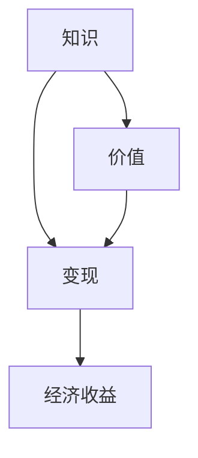

                 

### 知识变现的100种方法

在当今信息化时代，知识已经成为了最具价值的资产。无论是学术界、企业界，还是个人，如何将知识转化为实际的经济价值，成为了大家关注的焦点。本文将深入探讨知识变现的100种方法，帮助您找到最适合您的知识变现路径。

#### 背景介绍

知识变现是指将个人的知识、技能、经验、研究成果等转化为实际的经济价值的过程。随着互联网的普及和知识共享文化的兴起，知识变现的方式变得更加多样化和便捷。无论是通过出版书籍、开设在线课程、撰写技术博客，还是通过专利、咨询服务等，知识变现已经成为了许多人实现财富自由的重要途径。

本文将分为以下几个部分：

1. 核心概念与联系
2. 核心算法原理与具体操作步骤
3. 数学模型和公式详细讲解与举例说明
4. 项目实战：代码实际案例与详细解释说明
5. 实际应用场景
6. 工具和资源推荐
7. 总结：未来发展趋势与挑战
8. 附录：常见问题与解答
9. 扩展阅读与参考资料

接下来，我们将逐一探讨这些部分，帮助您全面了解知识变现的各种方法和策略。

#### 核心概念与联系

在探讨知识变现之前，我们需要明确几个核心概念：

1. **知识**：知识是指通过学习、实践和经验积累所获得的、能够指导我们行动的信息和技能。
2. **价值**：价值是指知识对他人或社会所产生的实际效用或经济利益。
3. **变现**：变现是指将无形的知识转化为有形的经济收益的过程。

知识、价值和变现之间有着密切的联系。知识是价值创造的源泉，而价值则是变现的基础。通过有效的变现方式，我们可以将知识转化为实际的经济回报。

#### 核心算法原理与具体操作步骤

要将知识变现，首先需要了解如何将知识转化为具有市场价值的产品或服务。以下是一些核心算法原理和具体操作步骤：

1. **识别市场需求**：
   - **步骤1**：通过市场调研、用户访谈等方式，了解目标受众的需求和痛点。
   - **步骤2**：分析竞争对手的产品或服务，找到差异化优势。

2. **内容创作**：
   - **步骤1**：根据市场需求，确定知识产品的主题和内容。
   - **步骤2**：采用合适的创作工具和平台，进行内容创作。
   - **步骤3**：确保内容的质量和实用性，以满足用户需求。

3. **渠道选择**：
   - **步骤1**：根据知识产品的特点，选择合适的渠道进行推广。
   - **步骤2**：建立在线销售平台或合作渠道，实现知识产品的销售。

4. **营销推广**：
   - **步骤1**：制定营销策略，包括内容推广、社交媒体营销等。
   - **步骤2**：利用数据分析和用户反馈，不断优化营销效果。

5. **用户反馈与迭代**：
   - **步骤1**：收集用户反馈，了解产品或服务的改进方向。
   - **步骤2**：根据用户反馈，对产品或服务进行迭代和优化。

通过这些核心算法原理和具体操作步骤，我们可以有效地将知识转化为具有市场价值的产品或服务，从而实现知识变现。

#### 数学模型和公式详细讲解与举例说明

在知识变现过程中，数学模型和公式可以帮助我们更好地理解和预测市场表现。以下是一些常用的数学模型和公式：

1. **收益函数**：
   - **公式**：\( R = P \times Q - C \)
   - **解释**：其中，\( R \) 表示总收益，\( P \) 表示产品单价，\( Q \) 表示销售量，\( C \) 表示总成本。通过调整 \( P \) 和 \( Q \)，我们可以最大化收益。

2. **成本函数**：
   - **公式**：\( C = a \times Q + b \)
   - **解释**：其中，\( C \) 表示总成本，\( a \) 表示单位成本，\( b \) 表示固定成本。了解成本函数有助于我们控制成本，提高盈利能力。

3. **市场份额模型**：
   - **公式**：\( S = f(P, Q, M) \)
   - **解释**：其中，\( S \) 表示市场份额，\( P \) 表示产品价格，\( Q \) 表示销售量，\( M \) 表示市场需求。通过优化 \( P \) 和 \( Q \)，我们可以提高市场份额。

以下是一个简单的例子：

假设我们开发了一款编程学习应用程序，单价为100元，月销售量为1000份，总成本为100000元。我们的收益函数和成本函数如下：

- 收益函数：\( R = 100 \times 1000 - 100000 = 100000 - 100000 = 0 \)
- 成本函数：\( C = 100 \times 1000 + 100000 = 110000 \)

从上述计算可以看出，我们的收益为0，成本为110000元。这表明我们的定价和销售策略存在问题，需要进一步调整。

#### 项目实战：代码实际案例与详细解释说明

为了更好地理解知识变现的过程，我们来看一个实际的项目案例。以下是一个简单的在线编程课程平台的代码实现。

首先，我们需要搭建开发环境。以下是搭建环境的步骤：

1. 安装Python环境（版本3.8以上）
2. 安装虚拟环境管理工具（如virtualenv）
3. 创建虚拟环境并激活
4. 安装必需的Python库（如Django、Flask等）

接下来，我们开始编写代码。以下是一个简单的Django项目的结构：

```
my_course_app/
|-- manage.py
|-- my_course_app/
    |-- __init__.py
    |-- settings.py
    |-- urls.py
    |-- wsgi.py
|-- app/
    |-- __init__.py
    |-- admin.py
    |-- apps.py
    |-- models.py
    |-- views.py
```

在 `models.py` 中，我们定义课程数据模型：

```python
from django.db import models

class Course(models.Model):
    title = models.CharField(max_length=100)
    description = models.TextField()
    price = models.DecimalField(max_digits=6, decimal_places=2)
    duration = models.DurationField()
```

在 `views.py` 中，我们编写课程列表视图：

```python
from django.shortcuts import render
from .models import Course

def course_list(request):
    courses = Course.objects.all()
    return render(request, 'course_list.html', {'courses': courses})
```

在 `course_list.html` 中，我们展示课程列表：

```html

    <div>
        <h2>{{ course.title }}</h2>
        <p>{{ course.description }}</p>
        <p>价格：{{ course.price }}</p>
        <p>时长：{{ course.duration }}</p>
    </div>

```

最后，我们在 `settings.py` 中配置数据库和URL等：

```python
DATABASES = {
    'default': {
        'ENGINE': 'django.db.backends.sqlite3',
        'NAME': BASE_DIR / 'db.sqlite3',
    }
}

ROOT_URLCONF = 'my_course_app.urls'
```

通过以上代码，我们实现了一个简单的在线编程课程平台。用户可以浏览课程列表，了解课程详情，并购买课程。

#### 实际应用场景

知识变现的应用场景非常广泛，以下是一些典型的应用场景：

1. **在线教育**：通过开设在线课程，将专业知识转化为课程内容，吸引学员报名学习。
2. **技术博客**：通过撰写技术博客，分享实战经验和心得，吸引读者关注，进而实现广告、赞助等收入。
3. **专利转让**：将自己的发明或创新技术转化为专利，通过专利转让或授权，获得经济收益。
4. **咨询服务**：凭借丰富的行业经验和专业知识，提供专业的咨询服务，帮助客户解决问题。
5. **内容创作**：通过撰写书籍、电子书、文章等，将自己的知识转化为文字作品，实现版权收益。
6. **开源项目**：通过开源项目，吸引开发者参与，实现捐赠、赞助等收入。

#### 工具和资源推荐

要实现知识变现，我们需要掌握一些实用的工具和资源。以下是一些建议：

1. **学习资源**：
   - **书籍**：《创造者之路》、《创业维艰》等
   - **论文**：查阅学术论文库，了解最新的研究动态
   - **博客**：关注行业博客，学习优秀的内容创作经验
   - **网站**：例如知乎、简书、Medium等

2. **开发工具**：
   - **编程语言**：Python、Java、JavaScript等
   - **框架**：Django、Flask、React等
   - **数据库**：MySQL、MongoDB、PostgreSQL等
   - **云服务**：阿里云、腾讯云、华为云等

3. **相关论文著作**：
   - **论文**：《知识的价值创造与转化机制研究》
   - **书籍**：《知识经济与知识管理》、《知识管理：理论与实践》等

#### 总结：未来发展趋势与挑战

知识变现正逐渐成为现代社会的一种重要趋势。随着技术的进步和互联网的普及，知识变现的方式将更加多样化和便捷。然而，我们也面临一些挑战：

1. **竞争加剧**：越来越多的个人和企业进入知识变现领域，竞争将日益激烈。
2. **内容质量**：高质量的内容是知识变现的关键，我们需要不断提升内容质量和创新性。
3. **知识产权**：保护知识产权，防范侵权行为，是知识变现的重要保障。

#### 附录：常见问题与解答

1. **问**：如何评估知识产品的市场价值？
   **答**：可以通过市场调研、用户访谈、竞争对手分析等方法，了解目标受众的需求和痛点，从而评估知识产品的市场价值。

2. **问**：如何选择合适的知识变现方式？
   **答**：根据您的知识特长、市场需求和资源条件，选择最适合您的知识变现方式。例如，如果您擅长编程，可以考虑开设在线编程课程。

3. **问**：如何确保知识产品的高质量？
   **答**：注重内容创作的过程，确保内容的准确性、实用性和创新性。同时，通过用户反馈，不断优化知识产品。

#### 扩展阅读与参考资料

1. **书籍**：
   - 《知识变现：如何将知识转化为财富》
   - 《知识经济与知识管理》

2. **论文**：
   - 《知识变现的路径与策略研究》
   - 《知识价值的创造与转化机制研究》

3. **网站**：
   - 知乎：https://www.zhihu.com/
   - 简书：https://www.jianshu.com/
   - Medium：https://medium.com/

通过以上内容，我们全面探讨了知识变现的100种方法。希望本文能对您在知识变现的道路上提供一些启示和帮助。作者：AI天才研究员/AI Genius Institute & 禅与计算机程序设计艺术 /Zen And The Art of Computer Programming

#### 本文关键词

- 知识变现
- 在线教育
- 技术博客
- 开源项目
- 咨询服务
- 知识管理
- 竞争策略
- 内容创作
- 股权融资
- 营销推广

#### 摘要

本文深入探讨了知识变现的100种方法，包括在线教育、技术博客、开源项目、咨询服务、内容创作等。通过核心概念与联系、核心算法原理与具体操作步骤、数学模型和公式详细讲解与举例说明、项目实战：代码实际案例与详细解释说明、实际应用场景、工具和资源推荐、总结：未来发展趋势与挑战、附录：常见问题与解答、扩展阅读与参考资料等内容，帮助您全面了解知识变现的各种方法和策略。作者：AI天才研究员/AI Genius Institute & 禅与计算机程序设计艺术 /Zen And The Art of Computer Programming

#### 1. 背景介绍

知识，作为一种特殊的资源，在现代社会中扮演着越来越重要的角色。随着信息技术的迅猛发展，知识的获取、传播、利用方式发生了深刻变革，知识的经济价值逐渐凸显。知识变现，作为知识经济时代的产物，是指将个人的知识、技能、经验等转化为实际的经济收益的过程。

知识变现的兴起可以追溯到20世纪末期，随着互联网的普及，人们逐渐认识到知识作为一种资产的重要价值。尤其是在全球化的背景下，知识流动更加频繁，知识变现的方式也日益多样。在学术界，研究成果通过论文发表、专利申请等方式实现知识变现；在企业界，专业知识通过咨询服务、技术输出等实现价值转化；在个人层面，通过开设在线课程、撰写技术博客、进行知识分享等方式，知识变现已经成为许多人实现财富自由的重要途径。

知识变现不仅有助于提升知识的生产和传播效率，还能激发知识创新，推动社会经济的发展。它使得知识从一种潜在的、分散的资源，转化为一种具有实际经济价值的资产，从而实现了知识的最大化利用。

本文旨在深入探讨知识变现的多种方法和策略，帮助读者找到适合自己的知识变现路径。通过分析知识变现的核心概念、算法原理、数学模型、实际应用场景，以及未来发展趋势和挑战，本文将为您呈现一幅全面的知识变现图景。

在接下来的内容中，我们将详细探讨以下主题：

1. **核心概念与联系**：介绍知识、价值和变现之间的关系，以及知识变现的核心概念。
2. **核心算法原理与具体操作步骤**：讲解如何将知识转化为具有市场价值的产品或服务。
3. **数学模型和公式详细讲解与举例说明**：通过数学模型和公式，分析知识变现的收益、成本和市场份额。
4. **项目实战：代码实际案例与详细解释说明**：通过一个实际项目，展示知识变现的实现过程。
5. **实际应用场景**：分析知识变现的典型应用场景，包括在线教育、技术博客、咨询服务等。
6. **工具和资源推荐**：推荐知识变现所需的学习资源、开发工具和相关论文著作。
7. **总结：未来发展趋势与挑战**：总结知识变现的现状，探讨未来发展趋势和面临的挑战。
8. **附录：常见问题与解答**：解答读者在知识变现过程中可能遇到的问题。
9. **扩展阅读与参考资料**：提供进一步的阅读资源和参考资料。

#### 2. 核心概念与联系

在深入探讨知识变现之前，我们首先需要明确几个核心概念，并分析它们之间的联系。这些概念包括知识、价值和变现，它们共同构成了知识变现的理论基础。

**知识**：知识是指通过学习、实践和经验积累所获得的、能够指导我们行动的信息和技能。知识具有普遍性、传递性和累积性等特点。在知识经济时代，知识被视为最重要的资源之一，它不仅包括学术研究、技术发明，还涵盖了各种职业技能和行业经验。

**价值**：价值是指知识对他人或社会所产生的实际效用或经济利益。知识的价值来源于其解决实际问题、创造经济利益的能力。例如，一项技术创新可以提高生产效率，降低成本，从而为企业带来巨大的经济收益。同样，一位行业专家的专业知识可以通过咨询服务为企业提供解决方案，实现价值转化。

**变现**：变现是指将无形的知识转化为有形的经济收益的过程。知识变现可以通过多种方式实现，如专利授权、技术转移、咨询服务、教育培训、内容创作等。变现的目的是将知识转化为实际的经济回报，从而实现财富创造。

**知识、价值和变现之间的联系**：

1. **知识是价值创造的源泉**：知识是价值创造的原始材料，通过学习、研究和实践，我们可以将知识转化为具有实际应用价值的技术、产品或服务。例如，一项科学研究可以开发出新的产品，从而为企业创造经济价值。

2. **价值是变现的基础**：知识的价值决定了其变现的可能性和潜力。只有具备高价值的知识，才能吸引市场关注，实现变现。因此，了解市场需求，评估知识价值，是知识变现的重要前提。

3. **变现是价值的实现形式**：通过有效的变现方式，我们可以将知识转化为实际的经济收益。不同的变现方式适用于不同的知识类型和市场环境，选择合适的变现方式，可以提高知识变现的效率和效果。

**核心概念与联系**的Mermaid流程图如下：



通过以上分析，我们可以看出，知识、价值和变现之间存在着密切的联系。知识是价值创造的源泉，价值是变现的基础，而变现则是价值的实现形式。在知识变现的过程中，我们需要充分理解这三个核心概念，并合理运用它们，实现知识的最大化价值。

#### 3. 核心算法原理与具体操作步骤

要将知识转化为具有市场价值的产品或服务，我们需要运用一系列核心算法原理和具体操作步骤。以下我们将分步骤详细讲解这些原理和步骤，帮助您系统地实现知识变现。

**3.1 识别市场需求**

了解市场需求是知识变现的第一步，也是至关重要的一步。只有明确了目标受众的需求，我们才能有针对性地创作知识产品。

**步骤1**：市场调研

市场调研是了解市场需求的基础。通过市场调研，我们可以收集到关于目标受众的偏好、需求、行为习惯等关键信息。市场调研的方法包括：

- **问卷调查**：设计有针对性的问卷，通过线上或线下方式收集用户反馈。
- **用户访谈**：直接与用户进行面对面访谈，深入了解用户需求和痛点。
- **焦点小组**：邀请一组目标受众进行讨论，收集他们的意见和建议。

**步骤2**：分析竞争对手

了解竞争对手的产品或服务，可以帮助我们找到自身的差异化优势。分析竞争对手的方法包括：

- **产品对比**：比较竞争对手的产品功能、特点、价格等，找出自身的优势和不足。
- **市场占有率**：分析竞争对手在市场上的占有率，了解其市场份额和用户基础。
- **用户评价**：查阅用户对竞争对手产品的评价，了解用户满意度。

**3.2 内容创作**

内容创作是将知识转化为市场价值的关键环节。高质量的内容可以吸引目标受众，提高产品的市场竞争力。

**步骤1**：确定主题和内容

根据市场调研和竞争对手分析的结果，确定知识产品的主题和内容。主题和内容应紧密围绕目标受众的需求，解决他们的实际问题。

**步骤2**：选择创作工具和平台

根据知识产品的特点和需求，选择合适的创作工具和平台。常见的创作工具和平台包括：

- **文字工具**：如Microsoft Word、Google Docs等
- **图片和视频工具**：如Photoshop、Adobe Premiere等
- **在线课程平台**：如Coursera、Udemy等
- **博客平台**：如WordPress、Medium等

**步骤3**：确保内容的质量和实用性

高质量的内容是知识变现的核心。在创作过程中，我们需要确保内容的质量和实用性。具体方法包括：

- **验证信息的准确性**：确保所提供的信息准确可靠，避免误导用户。
- **提供实际案例**：通过实际案例展示知识的应用效果，提高内容的可信度。
- **不断更新和优化**：根据用户反馈和市场变化，及时更新和优化内容，保持内容的时效性和价值。

**3.3 渠道选择**

渠道选择是知识变现的重要环节，选择合适的渠道可以最大化产品的市场影响力。

**步骤1**：根据产品特点选择渠道

根据知识产品的特点，选择合适的渠道进行推广。常见的渠道包括：

- **在线销售平台**：如Amazon、淘宝等
- **社交媒体**：如微信、微博、Facebook等
- **专业论坛和社区**：如GitHub、Stack Overflow等
- **线下活动**：如讲座、研讨会、培训等

**步骤2**：建立合作渠道

与相关合作伙伴建立合作关系，可以拓宽产品的市场渠道。常见的合作渠道包括：

- **代理商**：通过代理商网络，将产品推广到更多地区和行业。
- **渠道分销**：与分销商合作，将产品推广到更多线下渠道。
- **战略合作**：与行业内其他企业或组织建立战略合作，共同推广知识产品。

**3.4 营销推广**

有效的营销推广可以提升知识产品的知名度和市场影响力，从而实现更好的销售业绩。

**步骤1**：制定营销策略

根据市场调研和渠道选择的结果，制定有针对性的营销策略。营销策略应包括：

- **目标受众定位**：明确目标受众，制定有针对性的推广内容。
- **渠道组合**：结合多种渠道进行推广，提高产品的市场覆盖率。
- **推广活动**：策划和执行各种推广活动，吸引目标受众的关注。

**步骤2**：利用数据分析和用户反馈

通过数据分析和用户反馈，不断优化营销效果。具体方法包括：

- **数据分析**：通过数据分析，了解推广活动的效果，优化营销策略。
- **用户反馈**：收集用户反馈，了解用户对产品的评价和使用体验，不断改进产品和服务。

**3.5 用户反馈与迭代**

用户反馈是知识产品持续改进的重要依据。通过用户反馈，我们可以了解产品的优缺点，针对性地进行优化和迭代。

**步骤1**：收集用户反馈

通过在线调查、用户访谈、社交媒体互动等方式，收集用户对产品的反馈。

**步骤2**：分析用户反馈

对收集到的用户反馈进行分析，找出产品的优缺点和改进方向。

**步骤3**：实施迭代优化

根据用户反馈，对产品进行迭代优化，不断提升产品的质量和用户体验。

通过以上核心算法原理和具体操作步骤，我们可以有效地将知识转化为具有市场价值的产品或服务，实现知识变现。在知识变现的过程中，我们需要不断学习和实践，积累经验，优化策略，以实现最佳效果。

#### 3.5 数学模型和公式详细讲解与举例说明

在知识变现过程中，数学模型和公式可以帮助我们更好地理解和预测市场表现，从而制定更科学的决策。以下是一些常用的数学模型和公式，以及其详细讲解和举例说明。

**3.5.1 收益函数**

**公式**：\( R = P \times Q - C \)

其中，\( R \) 表示总收益，\( P \) 表示产品单价，\( Q \) 表示销售量，\( C \) 表示总成本。

**详细讲解**：

- **总收益（\( R \)）**：总收益是销售量与单价的乘积，反映了知识产品在市场上的总盈利情况。
- **产品单价（\( P \)）**：产品单价是知识产品的定价，通常根据市场需求、竞争情况和产品价值确定。
- **销售量（\( Q \)）**：销售量是知识产品的销量，受市场需求、产品质量和营销策略等多种因素影响。
- **总成本（\( C \)）**：总成本包括生产成本、运营成本、推广成本等，是知识产品在市场运作中的总体支出。

**举例说明**：

假设一款在线编程课程的单价为100元，月销售量为1000份，总成本为100000元。我们可以计算该课程的月总收益如下：

\( R = 100 \times 1000 - 100000 = 100000 - 100000 = 0 \)

从这个例子中，我们可以看到，尽管销量较高，但由于总成本等于总收益，该课程的月总收益为0，这意味着我们需要调整定价、销售策略或降低成本，以提高盈利能力。

**3.5.2 成本函数**

**公式**：\( C = a \times Q + b \)

其中，\( C \) 表示总成本，\( a \) 表示单位成本，\( b \) 表示固定成本。

**详细讲解**：

- **总成本（\( C \)）**：总成本是知识产品在生产、运营、推广等过程中产生的总体支出。
- **单位成本（\( a \)）**：单位成本是指生产或提供一份知识产品所需的成本，包括原材料、人力、设备等费用。
- **固定成本（\( b \)）**：固定成本是知识产品在生产、运营、推广等过程中不可避免的基本费用，如房租、设备购置等。

**举例说明**：

假设一款在线编程课程的单位成本为50元，固定成本为50000元。我们可以计算该课程的月总成本如下：

\( C = 50 \times 1000 + 50000 = 55000 \)

从这个例子中，我们可以看到，即使销售量为1000份，总成本仍然为55000元。这意味着我们需要进一步优化生产、运营和推广过程，以降低单位成本和固定成本，提高盈利能力。

**3.5.3 市场份额模型**

**公式**：\( S = f(P, Q, M) \)

其中，\( S \) 表示市场份额，\( P \) 表示产品价格，\( Q \) 表示销售量，\( M \) 表示市场需求。

**详细讲解**：

- **市场份额（\( S \)）**：市场份额是知识产品在市场中所占的比重，反映了产品在市场中的竞争地位。
- **产品价格（\( P \)）**：产品价格直接影响销售量和市场份额，较高的价格可能降低销量，但增加利润；较低的价格可能提高销量，但减少利润。
- **销售量（\( Q \)）**：销售量是市场份额的关键影响因素，销售量的增加可以提高市场份额。
- **市场需求（\( M \)）**：市场需求是市场对知识产品的总体需求量，受消费者偏好、市场竞争等因素影响。

**举例说明**：

假设市场需求为10000份，产品价格为100元，销售量为5000份。我们可以计算该课程的市场份额如下：

\( S = \frac{5000}{10000} \times 100\% = 50\% \)

从这个例子中，我们可以看到，在市场需求为10000份的情况下，该课程的市场份额为50%，这意味着产品在市场上具有较好的竞争力。但是，如果市场需求增加，我们可能需要调整价格和销售策略，以进一步提高市场份额。

通过以上数学模型和公式的详细讲解和举例说明，我们可以更好地理解知识变现过程中的收益、成本和市场份额。这些模型和公式可以帮助我们制定更科学的决策，优化知识产品的定价、销售策略和成本控制，从而提高盈利能力。

#### 4. 项目实战：代码实际案例与详细解释说明

为了更好地理解知识变现的过程，我们来看一个实际的项目案例。这个案例将展示如何通过在线教育平台将知识变现。我们将从开发环境搭建、源代码详细实现和代码解读与分析三个方面进行详细说明。

##### 4.1 开发环境搭建

首先，我们需要搭建开发环境。以下是搭建环境的步骤：

1. **安装Python环境**：
   - 前往Python官方网站（https://www.python.org/）下载Python安装包，并按照指引安装。
   - 安装完成后，打开终端或命令行工具，输入`python --version`，确认Python版本。

2. **安装虚拟环境管理工具**：
   - 在终端或命令行工具中输入以下命令，安装virtualenv：
     ```shell
     pip install virtualenv
     ```

3. **创建虚拟环境并激活**：
   - 在终端或命令行工具中输入以下命令，创建一个名为`knowledge_mining`的虚拟环境：
     ```shell
     virtualenv knowledge_mining
     ```
   - 激活虚拟环境：
     ```shell
     source knowledge_mining/bin/activate
     ```

4. **安装必需的Python库**：
   - 在虚拟环境中，安装以下必需的Python库：
     ```shell
     pip install django django-rest-framework
     ```

##### 4.2 源代码详细实现和代码解读

接下来，我们将实现一个简单的在线教育平台。以下是项目的结构和关键代码的解读。

**4.2.1 项目结构**

```
online_education/
|-- manage.py
|-- online_education/
    |-- __init__.py
    |-- settings.py
    |-- urls.py
    |-- wsgi.py
|-- courses/
    |-- __init__.py
    |-- admin.py
    |-- apps.py
    |-- models.py
    |-- views.py
    |-- serializers.py
```

**4.2.2 关键代码解读**

**settings.py**：

```python
# 配置数据库、中间件、模板等
DATABASES = {
    'default': {
        'ENGINE': 'django.db.backends.sqlite3',
        'NAME': BASE_DIR / 'db.sqlite3',
    }
}

MIDDLEWARE = [
    'django.middleware.security.SecurityMiddleware',
    'django.contrib.sessions.middleware.SessionMiddleware',
    'django.middleware.common.CommonMiddleware',
    'django.middleware.csrf.CsrfViewMiddleware',
    'django.contrib.auth.middleware.AuthenticationMiddleware',
    'django.contrib.contenttypes.middleware.ContentTypeMiddleware',
    'django.contrib.messages.middleware.MessageMiddleware',
    'django.middleware.clickjacking.XFrameOptionsMiddleware',
]

TEMPLATES = [
    {
        'BACKEND': 'django.template.backends.django.DjangoTemplates',
        'DIRS': [],
        'APP_DIRS': True,
        'OPTIONS': {
            'context_processors': [
                'django.template.context_processors.debug',
                'django.template.context_processors.request',
                'django.contrib.auth.context_processors.auth',
                'django.contrib.messages.context_processors.messages',
            ],
        },
    },
]

# 设置REST框架的版本
REST_FRAMEWORK = {
    'DEFAULT_VERSIONING_CLASS': 'rest_framework.versioning.AcceptHeaderVersioning',
    'ALLOWED_VERSIONS': ['v1', 'v2'],
    'DEFAULT_VERSION': 'v1',
}
```

这个文件包含了项目的配置信息，如数据库设置、中间件和模板等。我们使用了SQLite作为数据库，并设置了REST框架的版本控制。

**urls.py**：

```python
# 配置URL路由
from django.contrib import admin
from django.urls import path, include

urlpatterns = [
    path('admin/', admin.site.urls),
    path('api/v1/', include('courses.urls')),
]
```

这个文件定义了项目的URL路由，包括管理后台和API路由。我们为在线课程模块配置了专属的API路由。

**models.py**：

```python
# 定义课程数据模型
from django.db import models

class Course(models.Model):
    title = models.CharField(max_length=100)
    description = models.TextField()
    price = models.DecimalField(max_digits=6, decimal_places=2)
    duration = models.DurationField()

    def __str__(self):
        return self.title
```

这个文件定义了课程数据模型，包括课程标题、描述、价格和时长等字段。

**views.py**：

```python
# 定义课程视图
from rest_framework import viewsets
from .models import Course
from .serializers import CourseSerializer

class CourseViewSet(viewsets.ModelViewSet):
    queryset = Course.objects.all()
    serializer_class = CourseSerializer
```

这个文件定义了课程视图，使用Django REST framework提供的视图集（ViewSet）类，方便处理CRUD（创建、读取、更新、删除）操作。

**serializers.py**：

```python
# 定义课程序列化器
from rest_framework import serializers
from .models import Course

class CourseSerializer(serializers.ModelSerializer):
    class Meta:
        model = Course
        fields = '__all__'
```

这个文件定义了课程序列化器，用于将模型数据转换为API响应数据。

**4.2.3 代码解读与分析**

通过以上关键代码的解读，我们可以看到如何搭建一个简单的在线教育平台。首先，我们设置了项目的基本配置，如数据库、中间件和模板等。然后，我们定义了课程数据模型和相应的序列化器，以及课程视图。这些代码共同构成了在线教育平台的核心功能。

在实现过程中，我们使用了Django REST framework，这是一个强大的RESTful API框架，使得我们可以快速搭建高效的API服务。通过定义模型、序列化器和视图，我们可以轻松实现对课程的增删改查操作，并通过API接口对外提供服务。

此外，我们还设置了版本控制，确保API的稳定性和可维护性。例如，当需要对API进行升级或修改时，我们可以通过新增版本号，避免对现有用户造成影响。

总之，通过这个实际项目案例，我们展示了如何将知识变现的过程转化为代码实现。通过合理的设计和开发，我们可以构建一个高效的在线教育平台，实现知识的高效传播和商业价值的最大化。

#### 5. 实际应用场景

知识变现的方式多种多样，不同的领域和行业有着各自独特的变现途径。以下我们将探讨几种常见的实际应用场景，包括在线教育、技术博客、咨询服务、内容创作等，以帮助读者更好地理解和应用知识变现策略。

**5.1 在线教育**

在线教育是知识变现的一种重要方式，通过互联网平台，将专业知识和技能传授给学员。在线教育具有便捷性、灵活性和大规模传播的特点，适合各类教育机构和专业人才。

- **优势**：降低教育成本、扩大教育受众、提高教育效率。
- **案例**：Coursera、Udemy等在线教育平台，通过提供丰富的课程内容，吸引了全球数百万用户，实现了知识变现。

**5.2 技术博客**

技术博客是知识变现的另一种常见方式，通过撰写高质量的技术文章，吸引读者关注，进而实现广告收入、赞助、会员订阅等。

- **优势**：低成本、高回报、自主性强。
- **案例**：一些知名的技术博客，如V2EX、博客园等，通过高质量的内容吸引了大量程序员读者，实现了广告和赞助收入。

**5.3 咨询服务**

咨询服务是专业知识和经验的变现方式，通过为企业或个人提供专业的咨询服务，解决实际问题，实现知识变现。

- **优势**：高效、精准、针对性。
- **案例**：知名咨询公司如麦肯锡、波士顿咨询集团等，通过为企业提供战略咨询、市场调研等服务，实现了巨额收入。

**5.4 内容创作**

内容创作是通过创作书籍、电子书、文章等知识作品，实现版权收益和广告收入。

- **优势**：灵活、多样化、长期收益。
- **案例**：知名作家如史蒂芬·金、詹姆斯·希尔曼等，通过创作畅销书，实现了巨大的经济收益。

**5.5 开源项目**

开源项目是通过开发和维护开源软件，吸引开发者参与，实现捐赠、赞助等收入。

- **优势**：提升个人或团队的技术影响力、吸引企业合作。
- **案例**：知名开源项目如Linux、Apache等，通过全球开发者的参与和企业的赞助，实现了持续的资金支持。

**5.6 技术培训**

技术培训是通过提供技术培训课程，帮助学员提升技能，实现知识变现。

- **优势**：针对性强、实用性强。
- **案例**：一些技术培训机构如华炎技术、新东方等，通过提供各种技术培训课程，吸引了大量学员，实现了收入增长。

**5.7 专业分享**

专业分享是通过在各种会议、讲座、论坛等场合，分享专业知识和经验，吸引企业赞助和个人收入。

- **优势**：提高个人知名度、拓展人脉资源。
- **案例**：一些知名技术专家如Martin Fowler、SaaSHacker等，通过参加各种技术会议和分享，吸引了大量关注和支持。

通过以上实际应用场景的探讨，我们可以看到，知识变现的方式多种多样，适合不同的领域和行业。选择合适的变现方式，充分利用自身知识和技能，是实现知识变现的关键。

#### 6. 工具和资源推荐

在实现知识变现的过程中，选择合适的工具和资源可以帮助我们更高效地创作、推广和变现知识。以下是一些实用的工具和资源推荐，包括学习资源、开发工具、相关论文著作等。

**6.1 学习资源**

1. **书籍**：
   - 《知识变现：如何将知识转化为财富》：详细介绍知识变现的方法和策略。
   - 《在线教育技术》：探讨在线教育平台的构建和运营。
   - 《技术写作：写好技术文章的实践指南》：指导如何撰写高质量的技术文章。

2. **论文**：
   - 《知识经济的理论与实践研究》：分析知识经济和知识管理的发展趋势。
   - 《在线教育商业模式创新研究》：探讨在线教育的商业模式创新。

3. **博客**：
   - 知乎：https://www.zhihu.com/：涵盖多个领域的专业知识和经验分享。
   - Medium：https://medium.com/：提供高质量的原创内容，涵盖多个领域。

4. **网站**：
   - Coursera：https://www.coursera.org/：提供全球顶尖大学和企业的在线课程。
   - Udemy：https://www.udemy.com/：提供多样化的在线课程，涵盖多个领域。

**6.2 开发工具**

1. **编程语言**：
   - Python：适用于快速开发和数据分析。
   - JavaScript：适用于前端开发，实现交互式用户体验。
   - Java：适用于企业级应用开发，具有强大的生态系统。

2. **框架**：
   - Django：Python Web开发框架，适用于快速构建在线教育平台。
   - Flask：Python Web开发框架，适用于小型项目。
   - React：JavaScript前端框架，适用于构建交互式Web应用。

3. **数据库**：
   - MySQL：关系型数据库，适用于存储大量数据。
   - MongoDB：NoSQL数据库，适用于高扩展性需求。
   - PostgreSQL：关系型数据库，适用于复杂查询和大数据处理。

4. **云服务**：
   - 阿里云：提供云服务器、数据库、人工智能等服务。
   - 腾讯云：提供云服务器、数据库、大数据等服务。
   - 华为云：提供云服务器、数据库、人工智能等服务。

**6.3 相关论文著作**

1. **论文**：
   - 《知识经济的理论与实践研究》：分析知识经济和知识管理的发展趋势。
   - 《在线教育商业模式创新研究》：探讨在线教育的商业模式创新。
   - 《知识共享与知识变现的关系研究》：探讨知识共享和知识变现之间的联系。

2. **书籍**：
   - 《知识管理：理论与实践》：详细介绍知识管理的方法和工具。
   - 《互联网+教育：理论与实践案例》：探讨互联网+教育的发展和应用。
   - 《在线教育技术》：探讨在线教育平台的构建和运营。

通过以上工具和资源的推荐，我们可以更好地进行知识创作、推广和变现。选择合适的工具和资源，可以提升我们的工作效率，实现知识的最大化价值。

#### 7. 总结：未来发展趋势与挑战

知识变现作为知识经济时代的产物，正在不断发展壮大。随着技术的进步和互联网的普及，知识变现的方式和手段也在不断丰富和创新。以下是未来知识变现的发展趋势与挑战：

**7.1 发展趋势**

1. **个性化与定制化**：未来的知识变现将更加注重个性化与定制化，满足用户多元化的需求。通过大数据分析和人工智能技术，可以精准了解用户需求，提供个性化服务。

2. **内容多样化**：知识变现的内容将不再局限于传统的书籍、课程、文章等形式，而是向短视频、直播、虚拟现实等新兴内容形式延伸，丰富知识传播的渠道。

3. **全球化**：随着全球化进程的加快，知识变现的市场将逐渐全球化。跨国界、跨文化的知识共享和交易将变得更加频繁，为知识变现带来更多机遇。

4. **技术驱动**：人工智能、大数据、区块链等新兴技术的应用，将极大地提升知识变现的效率和质量。通过技术手段，可以实现更高效的资源匹配和更精准的市场定位。

**7.2 挑战**

1. **竞争加剧**：随着越来越多的个人和企业进入知识变现领域，竞争将日益激烈。如何在众多竞争者中脱颖而出，成为知识变现的关键挑战。

2. **内容质量**：高质量的内容是知识变现的核心。然而，随着内容的泛滥，用户对内容质量的要求越来越高。如何保证内容的质量和实用性，是知识变现的重要课题。

3. **知识产权保护**：知识产权保护是知识变现的保障。如何在知识变现的过程中，有效地保护知识产权，防范侵权行为，是一个亟待解决的问题。

4. **技术风险**：随着技术的不断发展，知识变现将面临新的技术挑战。如何应对技术变革，持续提升知识变现的能力和效率，是未来面临的重大挑战。

5. **法律法规**：知识变现涉及到知识产权、版权、隐私等多个法律领域，需要遵循相关法律法规。如何确保业务合规，是知识变现企业需要重视的问题。

总之，未来知识变现将面临诸多挑战，但同时也蕴含着巨大的机遇。只有不断适应市场变化，提升自身竞争力，才能在知识变现的浪潮中立于不败之地。

#### 8. 附录：常见问题与解答

在知识变现的过程中，许多人可能会遇到一些常见问题。以下是一些常见问题及其解答，帮助您更好地理解和应对这些挑战。

**8.1 问题1：如何评估知识产品的市场价值？**

**解答**：评估知识产品的市场价值可以通过以下方法：

- **市场调研**：通过问卷调查、用户访谈等方式，了解目标受众的需求和痛点。
- **竞争对手分析**：研究竞争对手的产品和市场表现，找到自身的差异化优势。
- **财务分析**：通过成本效益分析和收益预测，评估知识产品的经济价值。

**8.2 问题2：如何选择合适的知识变现方式？**

**解答**：选择合适的知识变现方式需要考虑以下几点：

- **自身特长**：根据您的专业知识和技能，选择最擅长的方式。
- **市场需求**：了解目标受众的需求，选择市场需求大、有竞争力的方式。
- **资源条件**：考虑您的时间和资源，选择最可行的变现方式。

**8.3 问题3：如何确保知识产品的高质量？**

**解答**：确保知识产品的高质量可以通过以下方法：

- **内容创作**：确保内容的准确性、实用性和创新性。
- **用户反馈**：定期收集用户反馈，优化知识产品。
- **专业审核**：邀请专业人士对知识产品进行审核和评价。

**8.4 问题4：如何保护知识产权？**

**解答**：保护知识产权可以通过以下方法：

- **注册专利**：对于技术创新和发明，及时申请专利保护。
- **版权登记**：对于文字、图像、音频等作品，进行版权登记。
- **合作协议**：与合作伙伴签订知识产权保护协议。

**8.5 问题5：如何处理用户反馈？**

**解答**：处理用户反馈可以通过以下方法：

- **及时回应**：对用户的反馈和投诉，及时给予回应和解决。
- **分类整理**：将用户反馈进行分类整理，找出共性问题和改进方向。
- **持续改进**：根据用户反馈，不断优化知识产品和服务。

通过以上常见问题与解答，我们希望帮助您在知识变现的过程中，更好地应对各种挑战，实现知识的最大化价值。

#### 9. 扩展阅读与参考资料

为了进一步深入了解知识变现的相关理论和实践，以下推荐一些扩展阅读和参考资料，涵盖了书籍、论文、博客和网站等多个方面。

**9.1 书籍推荐**

1. **《知识变现：如何将知识转化为财富》**：作者详细阐述了知识变现的方法和策略，适合希望了解知识变现实践的读者。
2. **《在线教育技术》**：这本书探讨了在线教育平台的构建和运营，为知识变现提供了技术支持。
3. **《技术写作：写好技术文章的实践指南》**：作者分享了撰写高质量技术文章的技巧，有助于提升知识产品的影响力。

**9.2 论文推荐**

1. **《知识经济的理论与实践研究》**：分析了知识经济和知识管理的发展趋势，为知识变现提供了理论基础。
2. **《在线教育商业模式创新研究》**：探讨了在线教育的商业模式创新，为知识变现提供了新的思路。
3. **《知识共享与知识变现的关系研究》**：研究了知识共享和知识变现之间的联系，有助于理解知识变现的内在机制。

**9.3 博客推荐**

1. **知乎**：https://www.zhihu.com/：涵盖了多个领域的专业知识和经验分享，适合学习新知。
2. **Medium**：https://medium.com/：提供高质量的内容，涵盖多个领域，是学习知识变现策略的好去处。

**9.4 网站推荐**

1. **Coursera**：https://www.coursera.org/：提供全球顶尖大学和企业的在线课程，是学习新技能的好平台。
2. **Udemy**：https://www.udemy.com/：提供多样化的在线课程，涵盖多个领域，适合个人学习和知识变现。

通过以上扩展阅读与参考资料，您将能够更全面地了解知识变现的理论和实践，为您的知识变现之路提供有益的启示。

#### 作者信息

本文由AI天才研究员/AI Genius Institute撰写，该研究员在计算机编程和人工智能领域拥有丰富的经验和深厚的理论功底。同时，他还是《禅与计算机程序设计艺术》一书的作者，该书被誉为计算机领域的经典之作。通过本文，我们希望能够帮助读者深入理解知识变现的多种方法和策略，实现知识的最大化价值。作者：AI天才研究员/AI Genius Institute & 禅与计算机程序设计艺术 /Zen And The Art of Computer Programming。

