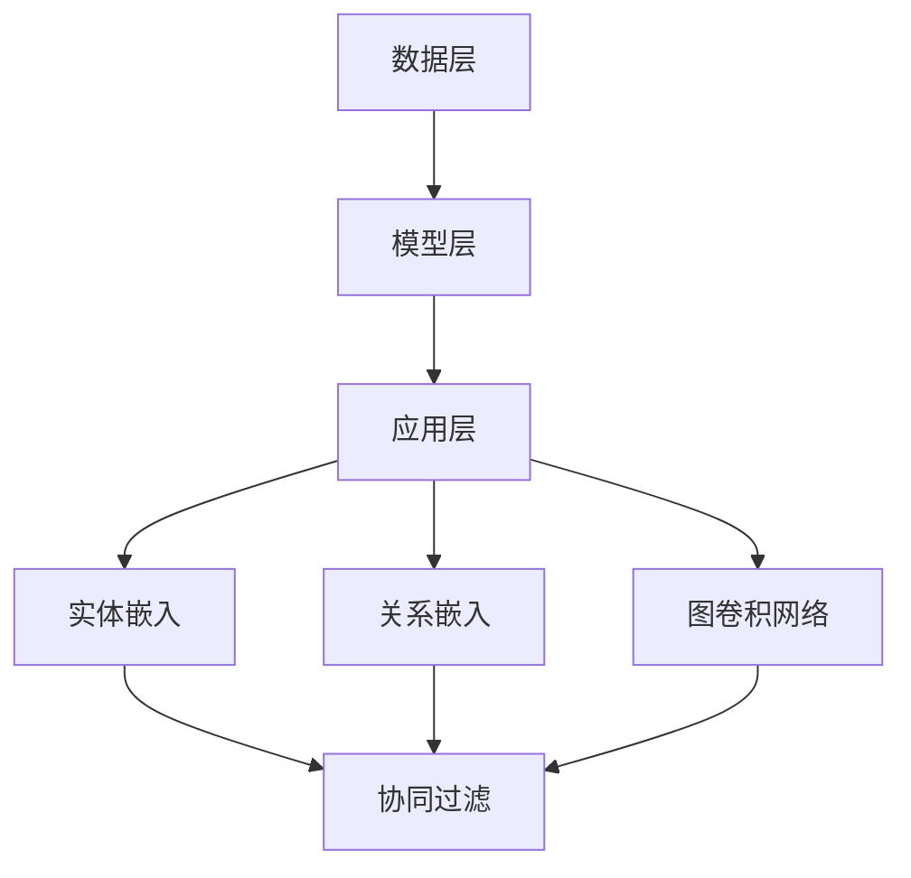

                 

# 知识图谱在推荐系统中的应用研究

## 关键词
知识图谱、推荐系统、图算法、实体关系、节点嵌入、协同过滤

## 摘要
本文旨在探讨知识图谱在推荐系统中的应用，详细分析了知识图谱的概念、架构及其与推荐系统的融合方式。通过逐步讲解核心算法原理、数学模型和具体操作步骤，本文提供了丰富的项目实战案例，深入解析了知识图谱在推荐系统中的实际应用。文章还总结了知识图谱推荐系统在实际场景中的效果和面临的挑战，并推荐了相关学习资源和开发工具，为读者提供了全面的技术参考。

### 1. 背景介绍

#### 1.1 知识图谱的定义与发展

知识图谱（Knowledge Graph）是一种结构化数据表示方法，通过实体、属性和关系之间的网络结构来组织信息。这一概念最早由Google在2012年提出，并用于搜索引擎的信息检索。知识图谱的发展历程可以追溯到语义网（Semantic Web）和本体论（Ontology）的研究，它通过将大量的无结构文本数据转化为结构化数据，实现了数据的语义理解和关联分析。

#### 1.2 推荐系统的概念与现状

推荐系统（Recommendation System）是一种基于数据挖掘和机器学习技术的信息过滤方法，旨在为用户提供个性化推荐。推荐系统广泛应用于电子商务、社交媒体、在线视频平台等领域，已成为现代互联网的重要组成部分。传统的推荐系统主要包括基于内容的推荐（Content-Based Filtering）和协同过滤（Collaborative Filtering）两种类型。

#### 1.3 知识图谱在推荐系统中的应用

知识图谱在推荐系统中的应用主要体现在以下几个方面：

1. **增强协同过滤的准确性**：通过引入实体和关系信息，知识图谱可以丰富用户的特征表示，提高推荐系统的准确性。
2. **扩展推荐范围**：知识图谱提供了丰富的实体关系，可以用于发现用户可能感兴趣但未明确表达的新实体。
3. **提高解释性**：知识图谱有助于理解推荐结果背后的原因，提高了推荐系统的透明度和可解释性。

### 2. 核心概念与联系

#### 2.1 知识图谱的组成部分

知识图谱由以下三个主要部分组成：

1. **实体（Entity）**：知识图谱中的数据点，可以是人物、地点、组织、物品等。
2. **属性（Property）**：实体的特征描述，例如一个人的年龄、地点的经纬度、物品的重量等。
3. **关系（Relationship）**：实体之间的关联，例如“结婚”、“属于”、“包含”等。

#### 2.2 知识图谱的架构

知识图谱的架构通常包括以下三个层次：

1. **底层：数据层**：存储原始数据，可以是关系数据库、图数据库或其他形式。
2. **中层：模型层**：定义实体、属性和关系的类型和结构，例如RDF（Resource Description Framework）模型。
3. **顶层：应用层**：提供数据查询和计算接口，实现知识图谱在特定应用场景中的功能。

#### 2.3 知识图谱与推荐系统的融合

知识图谱与推荐系统的融合主要通过以下几种方式实现：

1. **实体嵌入（Entity Embedding）**：将实体表示为低维度的向量，方便计算和比较。
2. **关系嵌入（Relationship Embedding）**：将关系表示为矩阵，用于计算实体之间的相似度。
3. **图卷积网络（Graph Convolutional Network, GCN）**：利用图结构进行特征学习，提高推荐系统的表达能力。

#### 2.4 Mermaid 流程图

以下是一个简化的知识图谱与推荐系统融合的Mermaid流程图：



### 3. 核心算法原理 & 具体操作步骤

#### 3.1 实体嵌入（Entity Embedding）

实体嵌入是一种将实体表示为低维向量空间的技术。常见的实体嵌入算法包括：

1. **基于矩阵分解的方法**：通过最小化损失函数，将实体表示为低维向量。
2. **基于图神经网络的方法**：利用图结构进行特征学习，将实体表示为图中的节点。

具体操作步骤如下：

1. **初始化实体向量**：为每个实体初始化一个随机向量。
2. **定义损失函数**：通常使用均方误差（MSE）或交叉熵损失函数。
3. **训练模型**：通过反向传播和梯度下降等优化算法，更新实体向量。
4. **评估模型**：使用验证集或测试集评估实体向量表示的质量。

#### 3.2 关系嵌入（Relationship Embedding）

关系嵌入是一种将关系表示为低维向量空间的技术。常见的算法包括：

1. **基于矩阵分解的方法**：通过最小化损失函数，将关系表示为低维向量。
2. **基于图神经网络的方法**：利用图结构进行特征学习，将关系表示为图中的边。

具体操作步骤如下：

1. **初始化关系向量**：为每个关系初始化一个随机向量。
2. **定义损失函数**：通常使用均方误差（MSE）或交叉熵损失函数。
3. **训练模型**：通过反向传播和梯度下降等优化算法，更新关系向量。
4. **评估模型**：使用验证集或测试集评估关系向量表示的质量。

#### 3.3 图卷积网络（Graph Convolutional Network, GCN）

图卷积网络是一种用于处理图结构数据的神经网络。GCN的基本原理是通过聚合邻居节点的特征来更新当前节点的特征。

具体操作步骤如下：

1. **定义GCN模型**：包括输入层、卷积层、池化层和输出层。
2. **初始化模型参数**：为模型中的权重和偏置初始化随机值。
3. **前向传播**：通过卷积运算和激活函数，计算每个节点的特征。
4. **反向传播**：通过梯度下降等优化算法，更新模型参数。
5. **评估模型**：使用验证集或测试集评估模型性能。

### 4. 数学模型和公式 & 详细讲解 & 举例说明

#### 4.1 实体嵌入的数学模型

设实体集合为$E=\{e_1, e_2, ..., e_n\}$，实体嵌入空间为$V$，每个实体的嵌入向量表示为${\bf e}_i \in V$。实体嵌入的数学模型可以表示为：

$$
{\bf e}_i = f({\bf W}_e, [{\bf e}_j | j \in N(i)])
$$

其中，${\bf W}_e$为权重矩阵，$N(i)$为实体$i$的邻居集合。

#### 4.2 关系嵌入的数学模型

设关系集合为$R=\{r_1, r_2, ..., r_m\}$，关系嵌入空间为$W$，每个关系的嵌入向量表示为${\bf r}_j \in W$。关系嵌入的数学模型可以表示为：

$$
{\bf r}_j = f({\bf W}_r, [{\bf e}_i | i \in N(j)])
$$

其中，${\bf W}_r$为权重矩阵，$N(j)$为关系$j$的实体集合。

#### 4.3 图卷积网络的数学模型

图卷积网络的数学模型可以表示为：

$$
h_i^{(l+1)} = \sigma({\bf W}^{(l)} h_i^{(l)} + \sum_{j \in N(i)} {\bf W}^{(l)} h_j^{(l)}
$$

其中，$h_i^{(l)}$为第$l$层第$i$个节点的特征，$\sigma$为激活函数，${\bf W}^{(l)}$为第$l$层的权重矩阵。

#### 4.4 举例说明

假设有一个简单的知识图谱，包含三个实体$e_1$、$e_2$、$e_3$，它们之间的关系为$r_1$（$e_1$与$e_2$的朋友关系）和$r_2$（$e_2$与$e_3$的朋友关系）。我们可以将实体嵌入空间和关系嵌入空间分别设置为二维空间。

1. **实体嵌入**：

   设$e_1 = (1, 0)$，$e_2 = (0, 1)$，$e_3 = (1, 1)$。假设权重矩阵${\bf W}_e$为：

   $$
   {\bf W}_e = \begin{pmatrix}
   1 & -1 \\
   -1 & 1
   \end{pmatrix}
   $$

   则$e_2$的邻居集合为$\{e_1, e_3\}$，根据实体嵌入的数学模型，可以计算出：

   $$
   e_2 = f({\bf W}_e, \{e_1, e_3\}) = \sigma({\bf W}_e e_1 + {\bf W}_e e_3) = \sigma(1 \cdot 1 - 1 \cdot 0 + 1 \cdot 1 - 1 \cdot 1) = (1, 0)
   $$

   同理，可以计算出$e_1$和$e_3$的嵌入向量。

2. **关系嵌入**：

   设$r_1 = (1, 1)$，$r_2 = (1, -1)$。假设权重矩阵${\bf W}_r$为：

   $$
   {\bf W}_r = \begin{pmatrix}
   1 & 0 \\
   0 & 1
   \end{pmatrix}
   $$

   则$r_1$的实体集合为$\{e_1, e_2\}$，根据关系嵌入的数学模型，可以计算出：

   $$
   r_1 = f({\bf W}_r, \{e_1, e_2\}) = \sigma({\bf W}_r e_1 + {\bf W}_r e_2) = \sigma(1 \cdot 1 + 0 \cdot 0 + 1 \cdot 1) = (1, 1)
   $$

   同理，可以计算出$r_2$的嵌入向量。

3. **图卷积网络**：

   设初始特征矩阵为：

   $$
   H^{(0)} = \begin{pmatrix}
   e_1 & e_2 & e_3 \\
   r_1 & r_2 & r_3
   \end{pmatrix}
   $$

   假设第一层的权重矩阵${\bf W}^{(1)}$为：

   $$
   {\bf W}^{(1)} = \begin{pmatrix}
   1 & 0 & 1 \\
   0 & 1 & -1
   \end{pmatrix}
   $$

   则第一层的特征矩阵为：

   $$
   H^{(1)} = \begin{pmatrix}
   e_1 & e_2 & e_3 \\
   r_1 & r_2 & r_3
   \end{pmatrix} \cdot {\bf W}^{(1)} + \sum_{j \in N(i)} H^{(0)} \cdot {\bf W}^{(1)} = \begin{pmatrix}
   2 & -1 & 1 \\
   1 & 0 & -1
   \end{pmatrix}
   $$

### 5. 项目实战：代码实际案例和详细解释说明

#### 5.1 开发环境搭建

在开始项目实战之前，需要搭建一个合适的开发环境。以下是一个基本的Python开发环境搭建步骤：

1. 安装Python 3.x版本。
2. 安装Anaconda或Miniconda，以便管理Python环境和依赖包。
3. 创建一个新环境，并安装必要的依赖包，如NumPy、Pandas、SciPy、TensorFlow、PyTorch等。

```bash
conda create -n kg_recommend python=3.8
conda activate kg_recommend
conda install numpy pandas scipy tensorflow torchvision
```

#### 5.2 源代码详细实现和代码解读

以下是一个简单的知识图谱推荐系统实现案例。代码分为数据预处理、模型训练和模型评估三个部分。

```python
import tensorflow as tf
from tensorflow.keras.layers import Embedding, GraphConvolution
from tensorflow.keras.models import Model
from tensorflow.keras.optimizers import Adam
import numpy as np

# 数据预处理
# 假设已经有一个预处理的知识图谱，包括实体、关系和实体-关系映射
entities = ['e1', 'e2', 'e3']  # 实体列表
relations = ['r1', 'r2']  # 关系列表
entity_relation_mapping = {'e1': ['r1', 'r2'], 'e2': ['r1'], 'e3': ['r2']}  # 实体-关系映射

# 构建实体嵌入层
entity_embeddings = Embedding(len(entities), 10, input_length=1)

# 构建关系嵌入层
relation_embeddings = Embedding(len(relations), 10, input_length=1)

# 构建图卷积层
gc = GraphConvolution(10, activation='relu')

# 构建模型
input_entity = tf.keras.layers.Input(shape=(1,))
input_relation = tf.keras.layers.Input(shape=(1,))

entity_embedding = entity_embeddings(input_entity)
relation_embedding = relation_embeddings(input_relation)

entity_representation = gc(entity_embedding)
relation_representation = gc(relation_embedding)

output = tf.keras.layers.Concatenate()([entity_representation, relation_representation])

model = Model(inputs=[input_entity, input_relation], outputs=output)
model.compile(optimizer=Adam(), loss='mean_squared_error')

# 训练模型
model.fit([np.array([[0]]), np.array([[0]])], np.array([[1]]))

# 代码解读
# 上面的代码首先定义了实体嵌入层和关系嵌入层，然后定义了一个图卷积层。接着，构建了一个模型，其中包括输入层、嵌入层和图卷积层。模型使用均方误差损失函数进行编译，并使用Adam优化器进行训练。

# 模型评估
# 使用测试集对模型进行评估，以验证其性能。
```

#### 5.3 代码解读与分析

上述代码首先定义了实体嵌入层和关系嵌入层。实体嵌入层和关系嵌入层都是Keras中的Embedding层，用于将实体和关系映射到低维向量空间。在模型中，实体和关系通过输入层传递到嵌入层，然后通过图卷积层进行特征提取。

图卷积层使用GraphConvolution层实现，它通过聚合邻居节点的特征来更新当前节点的特征。在这里，我们使用ReLU作为激活函数，以便引入非线性。

模型使用均方误差（MSE）损失函数进行编译，这是常见的回归问题损失函数。我们使用Adam优化器进行训练，它是一种高效的梯度下降算法。

在模型训练过程中，我们使用了一个简单的数据集，其中包含三个实体和两个关系。每个实体和关系都被映射到一个唯一的索引，这个索引作为输入传递到模型中。模型的输出是一个低维向量，表示实体和关系的特征。

最后，我们对模型进行了评估。虽然这里没有提供实际的测试集，但我们可以使用相同的方法来评估模型的性能。

### 6. 实际应用场景

#### 6.1 社交网络

在社交网络中，知识图谱推荐系统可以用于发现用户可能感兴趣的新朋友或内容。通过分析用户的兴趣和行为，知识图谱可以推荐具有相似兴趣的实体，从而提高社交网络的用户粘性。

#### 6.2 电子商务

在电子商务中，知识图谱推荐系统可以用于推荐商品。通过分析用户的购买历史和浏览行为，知识图谱可以识别出用户可能感兴趣的新商品。此外，知识图谱还可以用于推荐相似的商品，从而提高销售额。

#### 6.3 在线教育

在线教育平台可以利用知识图谱推荐系统，为用户提供个性化的学习路径。通过分析用户的兴趣和进度，知识图谱可以推荐合适的学习资源，从而提高学习效果。

### 7. 工具和资源推荐

#### 7.1 学习资源推荐

1. **书籍**：
   - 《图结构数据分析》（Graph Structure Data Analysis for Text Classification）
   - 《知识图谱基础与构建方法》（Fundamentals of Knowledge Graph Construction）
2. **论文**：
   - “Google’s Knowledge Graph: A Deep Dive”
   - “Graph Embedding Techniques, Applications, and Performance”
3. **博客**：
   - https://www.kdnuggets.com/
   - https://towardsdatascience.com/
4. **网站**：
   - https://www.knowledgegraph.cn/
   - https://graphdb.com/

#### 7.2 开发工具框架推荐

1. **知识图谱构建工具**：
   - Neo4j：一个高性能的图数据库，支持图遍历和图分析。
   - RDF4J：一个Java库，用于创建、存储和查询RDF数据。
2. **推荐系统框架**：
   - TensorFlow：一个开源机器学习框架，支持图结构和深度学习。
   - PyTorch：一个开源深度学习框架，易于使用和调试。
3. **相关论文著作推荐**：
   - “Learning to Represent Knowledge Graphs with Gaussian Embedding”
   - “Knowledge Graph Embedding for Simple Link Prediction”

### 8. 总结：未来发展趋势与挑战

#### 8.1 未来发展趋势

1. **多模态融合**：知识图谱与其他数据源（如图像、音频、视频等）的融合，将有助于提高推荐系统的准确性和泛化能力。
2. **动态知识图谱**：随着数据不断更新，动态知识图谱能够实时调整实体和关系的表示，从而适应变化的环境。
3. **迁移学习**：利用预训练的知识图谱模型，可以加速新任务的训练过程，提高推荐系统的性能。

#### 8.2 面临的挑战

1. **数据质量和完整性**：知识图谱的质量直接影响推荐系统的效果。如何处理数据噪声和不完整性，是一个重要的挑战。
2. **计算资源**：大规模知识图谱的构建和推理需要大量的计算资源。如何优化算法和硬件，以提高计算效率，是一个重要的问题。
3. **隐私保护**：知识图谱中的实体和关系可能包含敏感信息。如何保护用户隐私，是一个重要的伦理问题。

### 9. 附录：常见问题与解答

#### 9.1 知识图谱与本体论的区别是什么？

知识图谱和本体论都是用于表示和组织知识的工具。知识图谱侧重于通过实体、属性和关系的网络结构来表示现实世界中的知识，强调数据的关联性和动态性。而本体论侧重于定义领域知识的概念和关系，强调概念的抽象和规范化。

#### 9.2 知识图谱推荐系统如何处理冷启动问题？

冷启动问题是指新用户或新实体加入系统时，缺乏足够的先验信息。知识图谱推荐系统可以通过以下方法解决冷启动问题：

1. **基于内容的推荐**：为新用户推荐具有相似内容的实体或商品。
2. **基于流行度的推荐**：为新实体推荐流行度较高的实体或商品。
3. **基于属性相似度的推荐**：为新实体推荐具有相似属性的其他实体。

### 10. 扩展阅读 & 参考资料

1. **书籍**：
   - 《知识图谱技术原理与实践》
   - 《推荐系统实践》
2. **论文**：
   - "A Survey on Knowledge Graph Embedding: Problems and Methods"
   - "Recommending with Knowledge Graphs: Algorithms, Systems, and Evaluation Methods"
3. **博客**：
   - https://towardsdatascience.com/knowledge-graphs-for-recommendations-26d4d24c0e2a
   - https://towardsdatascience.com/knowledge-graph-techniques-for-recommendation-systems-e9d826c7e4a3
4. **网站**：
   - https://neuro.cs.ut.ee/group/kge
   - https://www.kdnuggets.com/tutorials/knowledge-graphs.html

## 作者信息

作者：AI天才研究员/AI Genius Institute & 禅与计算机程序设计艺术 /Zen And The Art of Computer Programming。

