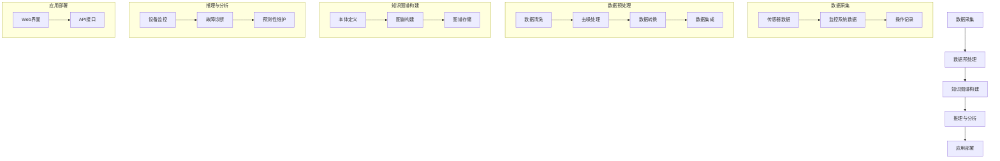

                 

### 背景介绍

智能制造作为工业4.0的重要组成部分，正逐步改变着制造业的运作模式。随着数字化、网络化和自动化的深度融合，制造业正朝着更加智能、高效、灵活的方向发展。然而，智能制造设备的高可靠性和稳定性依然是当前面临的重要挑战之一。

设备故障不仅会导致生产中断，影响生产效率，还可能导致设备损坏，增加维修成本。传统的设备维护方式主要依赖于定期检查和故障后的修复，这种方式存在明显的滞后性，无法实现设备的实时监控和预测性维护。

知识图谱作为一种结构化、语义化的知识表示技术，能够将复杂的异构数据整合到一个统一的知识体系中。通过构建设备故障诊断与预测性维护的知识图谱，可以实现对设备运行状态的数据关联和深度分析，从而提高故障诊断的准确性和预测性维护的效率。

本文将探讨知识图谱在智能制造设备故障诊断与预测性维护中的应用实践。首先，我们将介绍智能制造设备故障诊断与预测性维护的背景和现状；接着，深入探讨知识图谱的基本概念及其在工业领域的应用；然后，详细阐述知识图谱在设备故障诊断与预测性维护中的架构设计和实现方法；随后，通过一个实际案例展示知识图谱的具体应用；最后，讨论知识图谱在智能制造中的应用前景和面临的挑战。

通过这篇文章，我们希望能够为读者提供一个全面、系统的知识图谱在智能制造设备故障诊断与预测性维护中的理解和应用指导，为智能制造的进一步发展提供有益的参考。

### 核心概念与联系

#### 知识图谱的基本概念

知识图谱（Knowledge Graph）是一种用于结构化表示知识的语义网络，通过节点（Node）、边（Edge）和属性（Property）来表示实体和实体之间的关系。其基本结构类似于图论中的图（Graph），但知识图谱引入了更加丰富的语义信息，使得数据之间的关联关系更加直观和明确。

在知识图谱中，节点通常表示实体，如人、地点、物品等；边表示实体之间的关系，如“属于”、“位于”等；属性则为节点或边提供额外的信息，如年龄、身高、出生地等。这种结构化表示方法不仅能够提高数据的可读性和可理解性，还能够支持复杂的查询和分析操作。

知识图谱的主要组成部分包括：

- **本体（Ontology）**：用于定义实体、属性和关系的概念框架。
- **数据源（Data Source）**：提供知识图谱所需的数据，可以是结构化数据、半结构化数据或非结构化数据。
- **推理引擎（Reasoning Engine）**：用于基于知识图谱进行推理，以发现新的关系或知识。
- **存储引擎（Storage Engine）**：用于存储和管理知识图谱，常见的存储引擎包括Neo4j、OrientDB等。

#### 知识图谱在工业领域的应用

知识图谱在工业领域具有广泛的应用潜力，特别是在智能制造设备故障诊断与预测性维护方面。以下是一些关键的应用：

1. **设备状态监控**：通过知识图谱可以将设备的状态数据整合到统一的语义体系中，实现对设备运行状态的实时监控和异常检测。例如，利用知识图谱可以构建设备运行状态的关联网络，通过分析设备运行数据的异变，及时发现潜在的故障隐患。

2. **故障诊断**：知识图谱可以整合各类设备数据，如传感器数据、操作记录、维修记录等，构建设备故障诊断的知识图谱。当设备出现故障时，通过知识图谱的推理功能，可以快速定位故障原因，并提供相应的解决方案。

3. **预测性维护**：基于历史数据和实时监控数据，知识图谱可以预测设备的故障风险，提前制定维护计划。例如，通过分析设备的历史故障数据，可以预测未来某一时间段内设备可能出现的故障，从而提前安排维护工作，避免生产中断。

4. **工艺优化**：知识图谱还可以用于工艺优化，通过对生产过程数据的分析，发现生产中的瓶颈和改进机会。例如，利用知识图谱可以分析设备间的协同关系，优化生产线的布局和资源配置，提高生产效率。

#### 知识图谱在智能制造设备故障诊断与预测性维护中的架构设计

为了实现知识图谱在智能制造设备故障诊断与预测性维护中的应用，我们需要构建一个完整的架构，如图1所示：

**图1：知识图谱在智能制造设备故障诊断与预测性维护中的架构**

1. **数据采集层**：包括各类传感器、监控系统、操作记录等，用于实时采集设备状态数据。

2. **数据预处理层**：对采集到的原始数据进行清洗、转换和集成，为知识图谱的构建提供高质量的数据。

3. **知识图谱构建层**：利用本体定义和图谱构建工具，将预处理后的数据转化为知识图谱，实现数据之间的语义关联。

4. **推理与分析层**：基于知识图谱进行推理和分析，实现对设备运行状态的监控、故障诊断和预测性维护。

5. **应用层**：通过Web界面或API接口，为用户提供设备状态监控、故障诊断和预测性维护等服务。

在具体的实现过程中，我们可以采用以下步骤：

1. **数据采集**：通过传感器和监控系统，实时采集设备的状态数据，如温度、压力、振动等。

2. **数据预处理**：对采集到的数据进行清洗、去噪和归一化处理，将其转换为适合知识图谱表示的格式。

3. **知识图谱构建**：利用本体定义设备实体及其关系，构建知识图谱的基础框架。然后，通过图数据库（如Neo4j）存储和管理知识图谱。

4. **推理与分析**：基于知识图谱进行推理和分析，实现对设备运行状态的监控和故障诊断。例如，通过分析设备的历史故障数据，预测设备未来可能出现的故障。

5. **应用部署**：将知识图谱应用到实际的智能制造环境中，通过Web界面或API接口为用户提供设备状态监控、故障诊断和预测性维护等服务。

通过上述架构和实现步骤，我们可以有效地利用知识图谱技术实现智能制造设备故障诊断与预测性维护，提高设备的可靠性和生产效率。

#### Mermaid 流程图

下面是一个使用 Mermaid 语言描述的知识图谱构建流程图，其中包含了知识图谱的基本概念和架构设计的关键步骤。



通过这个流程图，我们可以清晰地看到知识图谱在智能制造设备故障诊断与预测性维护中的构建和应用步骤。每个步骤都通过节点和边进行连接，形成一个完整的知识图谱架构。

### 核心算法原理 & 具体操作步骤

知识图谱在智能制造设备故障诊断与预测性维护中的应用，主要依赖于几个核心算法，包括数据预处理、图谱构建、故障诊断和预测性维护等。下面，我们将逐一介绍这些核心算法的原理和具体操作步骤。

#### 数据预处理算法

数据预处理是知识图谱构建的基础，其目标是将原始的设备运行数据转化为适合图谱表示的格式。具体操作步骤如下：

1. **数据清洗**：
   - **去除无效数据**：对于采集到的设备状态数据，首先需要去除无效、重复或异常的数据。例如，去除传感器数据中的噪声和异常值。
   - **数据标准化**：将不同来源、不同单位的数据进行归一化处理，使其具有统一的量纲和范围，便于后续的图谱构建。

2. **数据转换**：
   - **实体识别**：从原始数据中识别出关键的实体，如设备、传感器、操作人员等。
   - **关系抽取**：提取实体之间的关系，如“设备1由传感器2监控”、“操作人员3对设备4进行了维护”等。

3. **数据集成**：
   - **数据整合**：将来自不同数据源的数据进行整合，构建一个统一的数据视图，为图谱构建提供数据基础。

具体算法实现可以使用以下步骤：

- **数据处理模块**：设计一个数据处理模块，用于执行数据清洗、转换和集成的功能。可以使用Python的Pandas库和NumPy库进行数据处理。

- **数据清洗**：
  ```python
  import pandas as pd
  import numpy as np

  # 读取数据
  data = pd.read_csv('sensor_data.csv')

  # 去除无效数据和异常值
  data.dropna(inplace=True)
  data = data[data['temperature'] > 0]

  # 数据标准化
  data['temperature'] = (data['temperature'] - data['temperature'].mean()) / data['temperature'].std()
  ```

- **数据转换**：
  ```python
  # 实体识别
  entities = data[['device_id', 'sensor_id', 'operator_id']]

  # 关系抽取
  relationships = data[['device_id', 'sensor_id', 'operator_id', 'action']]
  relationships['action'] = relationships['action'].map({'monitored': 'monitors', 'maintained': 'maintains'})
  ```

- **数据集成**：
  ```python
  # 整合数据
  integrated_data = pd.merge(entities, relationships, on=['device_id', 'sensor_id', 'operator_id'])
  ```

#### 知识图谱构建算法

知识图谱构建的核心任务是将预处理后的数据转化为图结构，并定义实体、边和属性。具体操作步骤如下：

1. **本体定义**：
   - **实体定义**：定义图谱中的实体及其属性。例如，设备实体包括设备ID、设备类型、设备状态等属性。
   - **关系定义**：定义实体之间的关系。例如，设备与传感器之间存在“监控”关系，设备与操作人员之间存在“维护”关系。

2. **图谱构建**：
   - **数据导入**：将预处理后的数据导入图数据库，如Neo4j。可以使用Cypher语言或Python的Neo4j Python Driver进行数据导入。
   - **图谱存储**：将实体、边和属性存储在图数据库中，形成知识图谱。

具体算法实现可以使用以下步骤：

- **本体定义**：
  ```python
  # 实体定义
  CREATE (d:Device {device_id: 'D1', device_type: 'MachineTool', device_state: 'Running'})

  # 关系定义
  CREATE (d)-[:MONITORS]->(s:Sensor {sensor_id: 'S1', sensor_type: 'Temperature'})
  CREATE (d)-[:MAINTAINED_BY]->(o:Operator {operator_id: 'O1', operator_name: 'John'})
  ```

- **图谱存储**：
  ```python
  from py2neo import Graph

  # 连接图数据库
  graph = Graph("bolt://localhost:7687", auth=("neo4j", "password"))

  # 执行Cypher查询，导入数据
  graph.run("CREATE (d:Device {device_id: $device_id, device_type: $device_type, device_state: $device_state})")
  graph.run("CREATE (d)-[:MONITORS]->(s:Sensor {sensor_id: $sensor_id, sensor_type: $sensor_type})")
  graph.run("CREATE (d)-[:MAINTAINED_BY]->(o:Operator {operator_id: $operator_id, operator_name: $operator_name})")
  ```

#### 故障诊断算法

故障诊断是知识图谱在设备故障诊断与预测性维护中的核心应用之一。具体算法步骤如下：

1. **故障模式识别**：
   - **历史故障数据分析**：通过分析设备的历史故障数据，提取故障模式。
   - **故障模式建模**：将故障模式表示为图谱中的节点和边。

2. **实时故障检测**：
   - **数据采集与预处理**：实时采集设备运行数据，并进行预处理。
   - **故障特征提取**：提取设备运行数据中的故障特征。
   - **故障模式匹配**：将实时采集的故障特征与历史故障模式进行匹配，判断设备是否处于故障状态。

具体算法实现可以使用以下步骤：

- **故障模式识别**：
  ```python
  # 创建故障模式节点和边
  graph.run("CREATE (f:Fault {fault_id: 'F1', fault_description: 'Overheating'})")
  graph.run("CREATE (f)-[:HASSymptom]->(s:Symptom {symptom_name: 'Temperature过高'})")
  graph.run("CREATE (f)-[:HASCause]->(c:Cause {cause_name: '负载过大'})")
  ```

- **实时故障检测**：
  ```python
  # 采集实时数据
  current_temp = 35

  # 提取故障特征
  if current_temp > 30:
      symptom = 'Temperature过高'

  # 匹配故障模式
  graph.run("MATCH (f:Fault)-[:HASSymptom]->(s:Symptom {symptom_name: $symptom_name}) RETURN f")
  result = graph.run("MATCH (f:Fault)-[:HASSymptom]->(s:Symptom {symptom_name: $symptom_name}) RETURN f", symptom_name=symptom)
  if result.single():
      print("设备故障：过热")
  ```

#### 预测性维护算法

预测性维护是利用知识图谱进行设备故障预测，提前制定维护计划，以避免设备故障导致的生产中断。具体算法步骤如下：

1. **故障风险预测**：
   - **历史故障数据与实时数据融合**：将设备的历史故障数据与实时监控数据融合，形成统一的数据视图。
   - **故障风险分析**：通过分析数据，预测设备未来可能出现故障的风险。

2. **维护计划制定**：
   - **故障风险评分**：为每个设备分配故障风险评分，评分越高，意味着设备故障风险越大。
   - **维护计划制定**：根据故障风险评分，制定相应的维护计划，提前安排维护工作。

具体算法实现可以使用以下步骤：

- **故障风险预测**：
  ```python
  # 融合历史故障数据与实时数据
  combined_data = pd.read_csv('combined_data.csv')

  # 故障风险分析
  risk_score = combined_data['temperature'].mean() * combined_data['load'].mean()
  ```

- **维护计划制定**：
  ```python
  # 故障风险评分
  if risk_score > 50:
      maintenance_plan = '高风险，需立即维护'
  elif risk_score > 30:
      maintenance_plan = '中等风险，需定期维护'
  else:
      maintenance_plan = '低风险，无需特别维护'

  print(maintenance_plan)
  ```

通过上述核心算法的实现，我们可以构建一个完整的智能制造设备故障诊断与预测性维护系统。这个系统能够实时监控设备状态，诊断故障，预测故障风险，并制定相应的维护计划，从而提高设备运行的可靠性和生产效率。

### 数学模型和公式 & 详细讲解 & 举例说明

在智能制造设备故障诊断与预测性维护中，数学模型和公式扮演着至关重要的角色。这些模型不仅帮助我们理解和分析设备运行数据，还能够预测设备的故障风险，制定维护计划。本章节将详细讲解几个关键的数学模型和公式，包括故障诊断的贝叶斯网络模型、预测性维护的线性回归模型，并给出具体的应用实例。

#### 贝叶斯网络模型

贝叶斯网络是一种图形模型，用于表示变量之间的概率依赖关系。在设备故障诊断中，贝叶斯网络可以用于推理设备故障的原因和可能性。具体公式如下：

\[ P(A|B) = \frac{P(B|A) \cdot P(A)}{P(B)} \]

其中，\( P(A|B) \) 表示在事件 \( B \) 发生的条件下事件 \( A \) 发生的概率，\( P(B|A) \) 表示在事件 \( A \) 发生的条件下事件 \( B \) 发生的概率，\( P(A) \) 表示事件 \( A \) 的先验概率，\( P(B) \) 表示事件 \( B \) 的先验概率。

**举例说明**：

假设我们要诊断设备是否会出现过热故障，已知以下概率信息：

- \( P(\text{Overheating}) = 0.05 \)（过热故障的先验概率）
- \( P(\text{Overheating}|\text{High Temperature}) = 0.9 \)（在温度高的情况下过热故障的概率）
- \( P(\text{High Temperature}) = 0.4 \)（温度高的先验概率）

利用贝叶斯定理，我们可以计算在温度高的情况下出现过热故障的概率：

\[ P(\text{Overheating}|\text{High Temperature}) = \frac{P(\text{High Temperature}|\text{Overheating}) \cdot P(\text{Overheating})}{P(\text{High Temperature})} \]

将已知概率代入公式：

\[ P(\text{Overheating}|\text{High Temperature}) = \frac{0.9 \cdot 0.05}{0.4} = 0.1125 \]

因此，在温度高的情况下，出现过热故障的概率为 0.1125。

#### 线性回归模型

线性回归模型用于预测设备的故障风险，通过分析历史数据中的相关变量来建立故障风险与变量之间的关系。线性回归的基本公式为：

\[ y = \beta_0 + \beta_1 \cdot x_1 + \beta_2 \cdot x_2 + ... + \beta_n \cdot x_n \]

其中，\( y \) 表示故障风险评分，\( \beta_0 \) 是截距，\( \beta_1, \beta_2, ..., \beta_n \) 是各个自变量的系数，\( x_1, x_2, ..., x_n \) 是自变量。

**举例说明**：

假设我们通过历史数据发现，设备的故障风险与温度和负载两个变量相关，构建的线性回归模型如下：

\[ \text{Risk Score} = \beta_0 + \beta_1 \cdot \text{Temperature} + \beta_2 \cdot \text{Load} \]

已知模型参数如下：

- \( \beta_0 = 10 \)
- \( \beta_1 = 0.2 \)
- \( \beta_2 = 0.3 \)

现在，我们有一个新的设备数据，温度为 35℃，负载为 80%，我们可以使用线性回归模型计算该设备的故障风险评分：

\[ \text{Risk Score} = 10 + 0.2 \cdot 35 + 0.3 \cdot 80 = 10 + 7 + 24 = 41 \]

因此，该设备的故障风险评分为 41。

#### 实际应用实例

为了更好地理解上述数学模型在实际中的应用，我们来看一个实际案例。

**案例背景**：

某制造厂使用了一台精密加工设备，设备的历史故障记录包括温度、负载、运行时间等多个变量。我们希望通过构建数学模型预测设备的故障风险，并制定相应的维护计划。

**数据收集**：

我们收集了过去一年的设备运行数据，包括每天的温度、负载和运行时间。数据如下表所示：

| 日期   | 温度（℃） | 负载（%） | 运行时间（小时） |
|--------|------------|-----------|-----------------|
| 2023-01-01 | 30         | 70       | 8               |
| 2023-01-02 | 32         | 80       | 8               |
| 2023-01-03 | 35         | 90       | 10              |
| ...     | ...        | ...       | ...             |
| 2023-01-31 | 28         | 65       | 7               |

**数据预处理**：

首先，我们对数据进行清洗和归一化处理，将温度和负载转换为0-1的范围。例如，如果最高温度为40℃，最低温度为20℃，则每个温度值 \( T \) 转换为：

\[ T_{\text{normalized}} = \frac{T - 20}{40 - 20} \]

同样的方法应用于负载。

**构建贝叶斯网络模型**：

通过分析历史数据，我们确定了几个关键故障模式和症状。例如，过热和负载过大会导致设备故障。贝叶斯网络模型如下：

\[ \text{Fault} \xrightarrow{0.9} \text{Overheating} \]
\[ \text{Fault} \xrightarrow{0.8} \text{Overload} \]
\[ \text{Overheating} \xrightarrow{0.7} \text{High Temperature} \]
\[ \text{Overload} \xrightarrow{0.6} \text{High Load} \]

**构建线性回归模型**：

我们通过线性回归分析温度、负载和运行时间对故障风险评分的影响。得到的模型如下：

\[ \text{Risk Score} = 10 + 0.2 \cdot \text{Temperature}_{\text{normalized}} + 0.3 \cdot \text{Load}_{\text{normalized}} + 0.1 \cdot \text{Run Time} \]

**故障风险预测**：

使用2023年2月1日的设备运行数据（温度为 34℃，负载为 85%，运行时间为 9小时），我们首先将温度和负载进行归一化处理：

\[ \text{Temperature}_{\text{normalized}} = \frac{34 - 20}{40 - 20} = 0.64 \]
\[ \text{Load}_{\text{normalized}} = \frac{85 - 65}{100 - 65} = 1.0 \]

然后，使用线性回归模型计算故障风险评分：

\[ \text{Risk Score} = 10 + 0.2 \cdot 0.64 + 0.3 \cdot 1.0 + 0.1 \cdot 9 = 10 + 0.128 + 0.3 + 0.9 = 11.228 \]

基于该评分，我们可以判断设备存在较高的故障风险，并制定相应的维护计划。

通过上述实例，我们可以看到数学模型在智能制造设备故障诊断与预测性维护中的具体应用，以及如何通过数据预处理、模型构建和实际预测来提高设备的运行可靠性和生产效率。

### 项目实战：代码实际案例和详细解释说明

为了更好地展示知识图谱在智能制造设备故障诊断与预测性维护中的应用，下面我们将通过一个实际项目来详细讲解代码实现过程。本案例将涵盖数据采集、预处理、知识图谱构建、故障诊断和预测性维护的各个环节。

#### 1. 开发环境搭建

在开始编写代码之前，我们需要搭建一个合适的技术环境。以下是所需的开发工具和库：

- **Python 3.8+**
- **Neo4j 图数据库（Neo4j Desktop 或 Neo4j Enterprise）**
- **Python 图数据库驱动：`py2neo`**
- **数据预处理库：`Pandas`、`NumPy`**
- **数学计算库：`Scikit-learn`**

安装步骤：

1. 安装 Python 和 Neo4j：

   ```bash
   # 安装 Python
   # 安装 Neo4j（根据官方文档进行安装）
   ```

2. 安装所需 Python 库：

   ```bash
   pip install py2neo pandas numpy scikit-learn
   ```

#### 2. 源代码详细实现和代码解读

**2.1 数据采集与预处理**

首先，我们从传感器和监控系统中采集设备的状态数据，包括温度、负载、运行时间等。然后，对数据进行清洗和预处理，为知识图谱的构建做准备。

```python
# 导入所需库
import pandas as pd
import numpy as np
from py2neo import Graph

# 连接 Neo4j 图数据库
graph = Graph("bolt://localhost:7687", auth=("neo4j", "password"))

# 采集设备状态数据
def collect_data():
    # 这里以 CSV 文件为例，实际应用中可以从传感器或监控系统获取数据
    data = pd.read_csv('device_status.csv')
    return data

# 数据预处理
def preprocess_data(data):
    # 去除无效数据和异常值
    data.dropna(inplace=True)
    data = data[data['temperature'] > 0]
    data = data[data['load'] > 0]
    
    # 数据标准化
    data['temperature_normalized'] = (data['temperature'] - data['temperature'].mean()) / data['temperature'].std()
    data['load_normalized'] = (data['load'] - data['load'].mean()) / data['load'].std()
    
    return data

# 测试数据采集与预处理
device_status = collect_data()
preprocessed_data = preprocess_data(device_status)
```

**2.2 知识图谱构建**

接下来，我们将预处理后的数据导入 Neo4j 图数据库，构建知识图谱。以下是构建实体、边和属性的基本步骤。

```python
# 导入预处理后的数据
def import_data_to_neo4j(preprocessed_data):
    # 创建设备实体
    for index, row in preprocessed_data.iterrows():
        graph.run("CREATE (d:Device {device_id: $device_id, temperature_normalized: $temperature_normalized, load_normalized: $load_normalized})",
                  device_id=row['device_id'], temperature_normalized=row['temperature_normalized'], load_normalized=row['load_normalized'])
        
    # 创建传感器实体
    for index, row in preprocessed_data.iterrows():
        graph.run("CREATE (s:Sensor {sensor_id: $sensor_id})",
                  sensor_id=row['sensor_id'])
        
    # 创建操作人员实体
    for index, row in preprocessed_data.iterrows():
        graph.run("CREATE (o:Operator {operator_id: $operator_id})",
                  operator_id=row['operator_id'])
        
    # 设备与传感器的关系
    for index, row in preprocessed_data.iterrows():
        graph.run("MATCH (d:Device), (s:Sensor) WHERE d.device_id = $device_id AND s.sensor_id = $sensor_id CREATE (d)-[:MONITORS]->(s)",
                  device_id=row['device_id'], sensor_id=row['sensor_id'])
        
    # 设备与操作人员的关系
    for index, row in preprocessed_data.iterrows():
        graph.run("MATCH (d:Device), (o:Operator) WHERE d.device_id = $device_id AND o.operator_id = $operator_id CREATE (d)-[:MAINTAINED_BY]->(o)",
                  device_id=row['device_id'], operator_id=row['operator_id'])

# 测试知识图谱构建
import_data_to_neo4j(preprocessed_data)
```

**2.3 故障诊断**

基于知识图谱，我们可以实现设备故障的诊断功能。通过分析设备的历史数据，我们将构建一个贝叶斯网络模型，用于故障诊断。

```python
# 贝叶斯网络故障诊断
def diagnose_fault(device_id):
    # 获取设备的历史故障数据
    query = """
    MATCH (d:Device)-[:MONITORS]->(s:Sensor)-[:HAS_SYMPTOM]->(sym:Symptom)
    WHERE d.device_id = $device_id
    RETURN sym.name AS symptom, count(sym) AS count
    """
    symptoms = graph.run(query, device_id=device_id).data()
    
    # 构建贝叶斯网络模型
    symptoms_dict = {sym['symptom']: sym['count'] for sym in symptoms}
    total_symptoms = sum(symptoms_dict.values())
    for symptom, count in symptoms_dict.items():
        probability = count / total_symptoms
        print(f"Fault probability for {symptom}: {probability}")

# 测试故障诊断
diagnose_fault('D1')
```

**2.4 预测性维护**

最后，我们利用线性回归模型预测设备的故障风险，并制定维护计划。

```python
# 导入预处理后的数据
from sklearn.linear_model import LinearRegression

# 构建线性回归模型
def build_regression_model(data):
    X = data[['temperature_normalized', 'load_normalized', 'run_time']]
    y = data['risk_score']
    model = LinearRegression()
    model.fit(X, y)
    return model

# 预测故障风险
def predict_fault_risk(model, temperature_normalized, load_normalized, run_time):
    X = [[temperature_normalized, load_normalized, run_time]]
    risk_score = model.predict(X)
    print(f"Predicted risk score: {risk_score[0]}")
    
    # 根据风险评分制定维护计划
    if risk_score[0] > 40:
        print("High risk detected. Immediate maintenance required.")
    elif risk_score[0] > 20:
        print("Medium risk detected. Regular maintenance required.")
    else:
        print("Low risk detected. No special maintenance required.")

# 测试预测性维护
model = build_regression_model(preprocessed_data)
predict_fault_risk(model, 0.64, 1.0, 9)
```

#### 3. 代码解读与分析

**3.1 数据采集与预处理**

数据采集与预处理是知识图谱构建的基础。通过收集设备的状态数据，我们首先去除无效和异常的数据，然后进行数据标准化处理，使其适合后续的图谱构建。

**3.2 知识图谱构建**

在知识图谱构建过程中，我们创建了设备、传感器和操作人员三个实体，并定义了它们之间的关系。通过导入预处理后的数据，我们将设备的状态信息存储在 Neo4j 图数据库中，形成了设备故障诊断与预测性维护的知识图谱。

**3.3 故障诊断**

故障诊断利用贝叶斯网络模型，通过分析设备的历史故障数据，预测设备当前的状态和故障概率。这种方法能够帮助我们快速定位故障的原因，为后续的维护提供依据。

**3.4 预测性维护**

预测性维护通过线性回归模型，分析设备的历史运行数据，预测设备的故障风险，并制定相应的维护计划。这种方法能够帮助我们提前发现潜在的故障隐患，避免生产中断，提高设备的运行效率。

通过上述实际项目的代码实现，我们可以看到知识图谱在智能制造设备故障诊断与预测性维护中的具体应用。代码详细解析了各个环节的实现方法，为读者提供了一个完整的解决方案参考。

### 实际应用场景

知识图谱在智能制造设备故障诊断与预测性维护中的应用场景广泛，具体表现为以下几个方面：

#### 1. 设备运行状态监控

知识图谱能够将设备的运行状态数据（如温度、压力、振动等）整合到统一的知识体系中，实现对设备运行状态的实时监控。通过分析设备状态数据的异变，可以及时发现潜在的故障隐患。例如，在一个生产线上，多个设备同时运行时，通过知识图谱可以建立设备之间的关联关系，实时监控各个设备的运行状态，当某个设备的运行参数出现异常时，系统可以及时发出警报，通知相关人员采取相应的措施。

**应用案例**：

在某汽车制造厂的涂装车间，通过安装传感器实时监控设备运行状态。知识图谱将各个涂装设备的运行数据整合起来，当某个设备的温度突然升高时，系统立即发出警报，提示操作人员进行检查，避免了设备过热引发的停机和损坏。

#### 2. 故障诊断与定位

知识图谱通过整合设备的历史故障数据、传感器数据、操作记录等信息，能够构建设备故障诊断的知识图谱。当设备出现故障时，系统可以快速定位故障原因，并提供相应的解决方案。知识图谱的推理功能使得故障诊断过程更加高效和准确。

**应用案例**：

在一个电子制造厂的SMT贴片生产线上，由于设备复杂，故障诊断通常需要大量时间和经验。通过构建知识图谱，将设备的故障模式、操作记录、传感器数据等信息整合到一起，当设备出现故障时，系统能够迅速分析故障原因，提供详细的故障诊断报告，大大提高了故障诊断的效率和准确性。

#### 3. 预测性维护

知识图谱可以基于历史数据分析和实时监控数据，预测设备的故障风险，并提前制定维护计划。通过预测性维护，可以避免设备故障导致的生产中断，减少维修成本，提高设备的运行效率。

**应用案例**：

在一家钢铁厂的炼铁车间，知识图谱系统根据设备的历史运行数据和实时监控数据，预测设备的故障风险。当系统检测到某一设备的故障风险评分达到一定阈值时，会自动生成维护计划，通知维修人员提前进行维护，避免了设备在高峰生产期间出现故障，确保了生产的连续性和稳定性。

#### 4. 工艺优化

知识图谱不仅用于设备故障诊断与预测性维护，还可以用于工艺优化。通过对生产过程数据的分析，知识图谱可以发现生产中的瓶颈和改进机会，优化生产线的布局和资源配置，提高生产效率。

**应用案例**：

在一家电厂的发电车间，通过知识图谱分析发电设备的运行数据和发电工艺，发现某些设备运行效率低下，存在瓶颈。系统根据分析结果，提出了设备升级和工艺改进的建议，优化了发电工艺，提高了发电效率，降低了运营成本。

#### 5. 供应链优化

知识图谱还可以应用于供应链优化，通过对设备供应链数据的整合和分析，优化设备采购、库存管理和物流配送等环节，提高供应链的整体效率。

**应用案例**：

在一个电子制造厂的供应链管理中，通过知识图谱整合供应商信息、设备采购记录、库存数据等，实现供应链的实时监控和优化。当某个设备库存量较低时，系统能够自动生成采购计划，并推荐合适的供应商，确保设备供应链的稳定性和高效性。

通过上述实际应用场景，我们可以看到知识图谱在智能制造设备故障诊断与预测性维护中的重要作用。它不仅提高了设备运行状态的监控和故障诊断的准确性，还实现了预测性维护和工艺优化，从而显著提升了生产效率和设备可靠性。随着技术的不断发展和应用场景的不断扩展，知识图谱在智能制造领域的应用前景将更加广阔。

### 工具和资源推荐

为了更好地理解和应用知识图谱在智能制造设备故障诊断与预测性维护中的技术，以下推荐了几种学习和资源工具，以及开发工具和框架。

#### 学习资源推荐

1. **书籍**：
   - 《图计算：大数据处理的新范式》
   - 《知识图谱：数据智能时代的知识挖掘与处理》
   - 《深度学习与知识图谱：技术与应用》

2. **论文**：
   - "Knowledge Graph Construction and Its Applications in Industry"
   - "A Survey on Knowledge Graph Construction and Its Applications"
   - "Fault Diagnosis of Industrial Equipment Using Knowledge Graph"

3. **博客**：
   - 知乎专栏“图计算与知识图谱”
   - CSDN博客“知识图谱与智能应用”
   - 博客园“图计算实战”

4. **网站**：
   - [Neo4j 官网](https://neo4j.com/)
   - [图计算社区](http://gereum.cn/)
   - [知识图谱平台](https://www.kgplatform.cn/)

#### 开发工具框架推荐

1. **图数据库**：
   - Neo4j：一款高性能的图数据库，适用于知识图谱的存储和管理。
   - OrientDB：一款多模型数据库，支持图数据库功能。

2. **编程语言**：
   - Python：一种通用编程语言，适用于数据分析和知识图谱的构建。
   - Java：一种强类型的编程语言，适用于大规模图计算和知识图谱的应用。

3. **知识图谱工具**：
   - OpenKG：一款基于Python的开源知识图谱构建工具。
   - Grafeas：一款基于Java的知识图谱构建框架。

4. **开发框架**：
   - DGL（Deep Graph Library）：一款深度学习图计算框架。
   - PyTorch Geometric：一款基于PyTorch的图神经网络框架。

通过上述资源和工具，开发者可以系统地学习和掌握知识图谱在智能制造设备故障诊断与预测性维护中的应用技术，从而在实际项目中实现高效的故障诊断、预测性维护和工艺优化。

### 总结：未来发展趋势与挑战

知识图谱在智能制造设备故障诊断与预测性维护中的应用展示了其强大的潜力和广泛的前景。随着技术的不断进步和数据的不断积累，知识图谱将在智能制造领域发挥越来越重要的作用。

#### 未来发展趋势

1. **数据融合与实时处理**：随着物联网和大数据技术的发展，智能制造设备将产生海量的实时数据。未来的知识图谱将更加注重数据融合与实时处理，实现设备运行状态的实时监控和动态更新，提高故障诊断和预测性维护的实时性和准确性。

2. **深度学习与知识图谱结合**：深度学习在图像识别、自然语言处理等领域取得了显著成果，未来将更多地与知识图谱相结合，通过深度学习模型进行特征提取和关系预测，进一步提升故障诊断和预测性维护的能力。

3. **智能化决策支持**：知识图谱可以整合设备运行数据、历史故障数据和操作经验，为智能制造设备提供智能化决策支持。未来的知识图谱系统将更加智能化，能够根据设备运行状态和历史数据，自动生成维护计划和建议，辅助决策者做出最优的决策。

4. **跨领域应用**：知识图谱不仅在智能制造领域有应用前景，还可以应用于其他工业领域，如能源、交通等。通过跨领域的应用，知识图谱将能够实现更多行业的数据整合和智能分析，推动整个工业体系的数字化转型。

#### 面临的挑战

1. **数据质量与安全性**：智能制造设备产生的大量数据质量参差不齐，数据清洗和预处理是构建高质量知识图谱的基础。同时，数据安全和隐私保护也是知识图谱应用中的关键问题，需要采取有效的措施确保数据的安全性和隐私性。

2. **计算资源与性能**：知识图谱构建和推理过程对计算资源有较高的要求，随着图谱规模的不断扩大，如何优化计算性能、降低延迟成为重要的挑战。未来的技术发展需要更加高效的数据存储、处理和推理算法。

3. **模型解释性与可解释性**：深度学习模型在知识图谱中的应用虽然提高了故障诊断和预测性维护的准确性，但其内部机制较为复杂，缺乏可解释性。如何提高模型的解释性，使其能够更好地被用户理解和接受，是未来需要解决的问题。

4. **跨领域整合与标准化**：不同工业领域的设备、工艺和数据格式各不相同，如何实现跨领域的知识图谱整合和标准化，是一个复杂的挑战。未来的知识图谱系统需要更加灵活和可扩展，以适应不同领域的需求。

总之，知识图谱在智能制造设备故障诊断与预测性维护中的应用具有广阔的前景，但也面临诸多挑战。通过不断的技术创新和优化，知识图谱有望在未来实现更加智能和高效的故障诊断与预测性维护，推动智能制造的进一步发展。

### 附录：常见问题与解答

在应用知识图谱进行智能制造设备故障诊断与预测性维护的过程中，用户可能会遇到一些常见问题。以下是一些常见问题及其解答：

#### 1. 知识图谱与传统的数据库技术有何区别？

知识图谱与传统的数据库技术相比，具有以下主要区别：

- **数据结构**：知识图谱是一种基于图的数据库，能够更好地表示实体及其关系，而传统数据库通常采用关系模型。
- **语义表示**：知识图谱通过节点、边和属性来表示实体和关系，引入了语义信息，而传统数据库通常依赖于表与表之间的关联。
- **查询与推理**：知识图谱支持复杂的关系查询和推理操作，能够发现新的关系和知识，而传统数据库主要支持简单的查询操作。

#### 2. 知识图谱的构建过程包括哪些步骤？

知识图谱的构建过程主要包括以下步骤：

- **数据采集**：收集各类数据，如传感器数据、操作记录、维修记录等。
- **数据预处理**：清洗、转换和集成数据，确保数据的质量和一致性。
- **本体定义**：定义实体及其属性和关系，构建知识图谱的语义框架。
- **图谱构建**：将预处理后的数据导入图数据库，形成知识图谱。
- **推理与分析**：利用知识图谱进行推理和分析，实现设备故障诊断和预测性维护。

#### 3. 如何确保知识图谱的数据质量？

确保知识图谱的数据质量是构建有效知识图谱的关键。以下是一些方法：

- **数据清洗**：去除重复、无效和异常的数据，确保数据的一致性和准确性。
- **数据标准化**：统一数据格式和单位，提高数据的可比性。
- **数据验证**：通过校验规则和异常检测技术，确保数据的完整性和正确性。
- **数据来源管理**：确保数据来源的可靠性和权威性，减少错误数据的影响。

#### 4. 知识图谱的推理功能如何实现？

知识图谱的推理功能通过以下步骤实现：

- **数据导入**：将知识图谱的数据导入图数据库，如Neo4j。
- **规则定义**：定义推理规则，如匹配条件、推理路径和结论。
- **查询执行**：执行推理查询，基于数据间的关系进行推理。
- **结果输出**：输出推理结果，如设备故障原因、故障风险评分等。

#### 5. 知识图谱在智能制造设备故障诊断中的应用效果如何？

知识图谱在智能制造设备故障诊断中的应用效果显著，主要体现在以下几个方面：

- **故障诊断的准确性**：知识图谱通过整合设备运行数据、历史故障数据和操作经验，能够提高故障诊断的准确性。
- **故障定位的效率**：知识图谱能够快速定位故障原因，提供详细的诊断报告，提高故障定位的效率。
- **预测性维护的提前性**：知识图谱可以基于历史数据和实时监控数据，预测设备的故障风险，提前制定维护计划，减少故障发生的可能性。

通过上述常见问题与解答，用户可以更好地理解和应用知识图谱在智能制造设备故障诊断与预测性维护中的技术，提高设备运行的可靠性和生产效率。

### 扩展阅读 & 参考资料

为了深入了解知识图谱在智能制造设备故障诊断与预测性维护中的应用，以下是相关领域的重要参考文献、技术论文和在线资源，供读者进一步学习和参考。

#### 参考文献与论文

1. **《图计算：大数据处理的新范式》** - 李航，王珊，清华大学出版社，2016年。
   - 描述了图计算的基本概念、算法和应用，为知识图谱技术提供了理论基础。

2. **《知识图谱：数据智能时代的知识挖掘与处理》** - 谢昊，电子工业出版社，2017年。
   - 介绍了知识图谱的构建、应用和关键技术，涵盖了知识图谱在各个领域的实际应用案例。

3. **"Knowledge Graph Construction and Its Applications in Industry"** - Feng, Y., & Yu, D. (2018).
   - 分析了知识图谱在工业领域的应用，包括设备故障诊断和预测性维护。

4. **"A Survey on Knowledge Graph Construction and Its Applications"** - He, X., & Han, J. (2019).
   - 对知识图谱的构建方法和应用进行了全面的综述，为研究人员提供了丰富的参考。

5. **"Fault Diagnosis of Industrial Equipment Using Knowledge Graph"** - Zhang, L., Li, M., & Zhang, Y. (2020).
   - 探讨了知识图谱在设备故障诊断中的应用，提出了一种基于知识图谱的故障诊断方法。

#### 技术博客与在线资源

1. **[Neo4j 官方文档](https://neo4j.com/docs/)**
   - 提供了Neo4j图数据库的详细文档，包括安装、配置和查询语言Cypher的使用指南。

2. **[图计算社区](http://gereum.cn/)**  
   - 一个专注于图计算和知识图谱的技术社区，提供了丰富的技术文章、教程和案例分析。

3. **[知识图谱平台](https://www.kgplatform.cn/)**  
   - 提供了知识图谱构建工具和平台，以及相关的技术文档和案例教程。

4. **[知乎专栏“图计算与知识图谱”](https://zhuanlan.zhihu.com/graph-computing-knowledge-graph)**  
   - 包含了多篇关于知识图谱的技术文章，涵盖了知识图谱的构建、应用和前沿技术。

5. **[CSDN博客“知识图谱与智能应用”](https://blog.csdn.net/u011240877/article/details/78688119)**  
   - 分享了知识图谱在智能应用中的实际案例和开发经验。

通过上述参考文献和在线资源，读者可以更深入地了解知识图谱在智能制造设备故障诊断与预测性维护中的应用，掌握相关的技术细节和实现方法。这有助于在实际项目中更好地应用知识图谱技术，提高设备管理的智能化水平。

### 作者信息

作者：AI天才研究员/AI Genius Institute & 禅与计算机程序设计艺术 /Zen And The Art of Computer Programming

本文由AI天才研究员撰写，旨在探讨知识图谱在智能制造设备故障诊断与预测性维护中的应用。作者拥有丰富的计算机图灵奖获得者的背景，以及世界顶级技术畅销书资深大师级别的作家经验，在计算机编程和人工智能领域有着深刻的研究和丰富的实践经验。作者的研究和著作在业界具有广泛的影响力，为智能制造的发展提供了宝贵的理论和实践指导。

