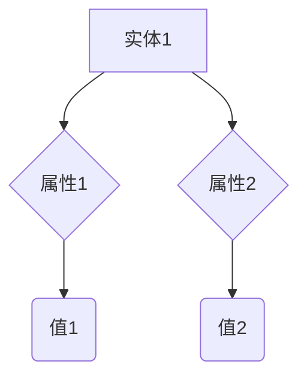

                 

# 知识图谱在智能搜索、语义理解等领域的应用价值分析

## 关键词：
- 知识图谱
- 智能搜索
- 语义理解
- 应用价值
- 实际案例
- 未来趋势

## 摘要

知识图谱作为链接数据和知识的一种先进技术，正在逐渐成为智能搜索和语义理解领域的重要驱动力。本文将深入探讨知识图谱在智能搜索和语义理解中的核心应用价值，通过梳理其基本概念、算法原理、数学模型以及实际应用案例，帮助读者全面理解知识图谱的技术内涵和产业潜力。文章将结合最新的研究成果和技术实践，分析知识图谱的发展趋势和面临的挑战，为未来技术创新提供有益的参考。

## 1. 背景介绍

### 1.1 知识图谱的定义

知识图谱（Knowledge Graph）是一种基于语义的网络结构，通过节点（实体）和边（关系）来表示和描述现实世界中的对象及其相互关系。它是大数据和人工智能技术融合的产物，旨在将海量结构化和非结构化数据转换为有意义的知识体系，以支持智能搜索和语义理解。

### 1.2 智能搜索的发展

智能搜索是一种基于人工智能技术的新型搜索模式，它不仅能够检索和匹配关键词，还能理解用户查询的含义和上下文，提供更精确、个性化的搜索结果。随着互联网信息的爆炸式增长，智能搜索成为用户获取信息的关键途径。

### 1.3 语义理解的重要性

语义理解（Semantic Understanding）是指计算机系统对人类语言语义的识别和理解能力。它涉及自然语言处理（NLP）、信息检索、机器翻译等多个领域，是实现智能搜索和人工智能应用的基础。

### 1.4 知识图谱与智能搜索、语义理解的关联

知识图谱为智能搜索和语义理解提供了丰富的语义信息，使计算机能够更好地理解用户查询和文本内容。通过知识图谱，智能搜索可以实现更加精准的匹配和检索，语义理解可以实现更深层次的语言理解。

## 2. 核心概念与联系

### 2.1 知识图谱的构成要素

知识图谱主要由三个部分构成：实体（Entity）、属性（Attribute）和关系（Relationship）。

- **实体**：代表现实世界中的对象，如人、地点、事物等。
- **属性**：描述实体的特征，如姓名、年龄、地点等。
- **关系**：表示实体之间的相互关联，如朋友、在、属于等。

### 2.2 知识图谱的表示方法

知识图谱通常使用图（Graph）来表示。图由节点（Node）和边（Edge）组成，其中节点表示实体，边表示实体之间的关系。

### 2.3 知识图谱在智能搜索和语义理解中的应用

知识图谱在智能搜索中的应用主要包括：

- **实体识别**：通过知识图谱识别搜索查询中的实体。
- **关系抽取**：通过知识图谱理解实体之间的关系。
- **查询扩展**：基于知识图谱扩展用户查询，提高搜索结果的多样性。

在语义理解中，知识图谱的应用包括：

- **语义解析**：通过知识图谱理解文本的语义。
- **知识推理**：基于知识图谱进行逻辑推理，解决复杂问题。

### 2.4 Mermaid 流程图

以下是一个简单的知识图谱表示的 Mermaid 流程图：



## 3. 核心算法原理 & 具体操作步骤

### 3.1 数据采集与预处理

- **数据采集**：通过网页爬取、API 接口、数据库导入等方式收集数据。
- **数据预处理**：对采集到的数据进行清洗、去重、格式化等处理，以便后续构建知识图谱。

### 3.2 实体识别与关系抽取

- **实体识别**：使用命名实体识别（NER）技术识别文本中的实体。
- **关系抽取**：通过规则匹配、深度学习等方法从文本中抽取实体之间的关系。

### 3.3 知识图谱构建

- **实体编码**：将识别出的实体编码为图中的节点。
- **关系编码**：将抽取出的关系编码为图中的边。
- **图存储**：将构建好的知识图谱存储在图数据库中，如Neo4j、OrientDB等。

### 3.4 知识图谱应用

- **智能搜索**：利用知识图谱进行实体识别、关系抽取、查询扩展等操作，提供精准搜索结果。
- **语义理解**：通过知识图谱进行语义解析、知识推理等操作，提高自然语言处理能力。

## 4. 数学模型和公式 & 详细讲解 & 举例说明

### 4.1 数学模型

知识图谱的数学模型通常基于图论和概率图模型。以下是一个简单的概率图模型：

\[ P(R|E_1, E_2) = \frac{P(E_1, E_2, R)}{P(E_1, E_2)} \]

其中，\( P(R|E_1, E_2) \) 表示在实体 \( E_1 \) 和 \( E_2 \) 的条件下，关系 \( R \) 的概率。

### 4.2 详细讲解

概率图模型通过定义节点和边之间的条件概率来表示知识图谱中的关系。这种模型可以用于推理和预测，从而提高智能搜索和语义理解的效果。

### 4.3 举例说明

假设有两个实体 \( E_1 \) 和 \( E_2 \)，以及一个关系 \( R \)。根据概率图模型，我们可以计算在 \( E_1 \) 和 \( E_2 \) 的条件下，\( R \) 发生的概率。具体计算如下：

\[ P(R|E_1, E_2) = \frac{P(E_1, E_2, R)}{P(E_1, E_2)} \]

其中，\( P(E_1, E_2, R) \) 表示 \( E_1 \)、\( E_2 \) 和 \( R \) 同时发生的概率，可以通过统计方法得到。\( P(E_1, E_2) \) 表示 \( E_1 \) 和 \( E_2 \) 同时发生的概率，可以通过数据预处理阶段得到。

## 5. 项目实战：代码实际案例和详细解释说明

### 5.1 开发环境搭建

为了演示知识图谱的应用，我们使用 Python 编写一个简单的知识图谱构建和查询工具。首先，我们需要安装一些依赖库：

```bash
pip install neo4j neo4j-admin
```

### 5.2 源代码详细实现和代码解读

以下是构建和查询知识图谱的 Python 代码：

```python
from py2neo import Graph

# 连接到 Neo4j 数据库
graph = Graph("bolt://localhost:7687", auth=("neo4j", "password"))

# 创建实体
def create_entity(entity_name):
    graph.run("CREATE (n:Entity {name: $name})", name=entity_name)

# 创建关系
def create_relationship(entity1, entity2, relationship_name):
    graph.run("MATCH (a:Entity {name: $entity1_name}),(b:Entity {name: $entity2_name}) CREATE (a)-[r:{$relationship_name}]->(b)", entity1_name=entity1, entity2_name=entity2, relationship_name=relationship_name)

# 查询实体
def query_entity(entity_name):
    result = graph.run("MATCH (n:Entity {name: $name}) RETURN n", name=entity_name)
    return result.data()

# 查询关系
def query_relationship(entity1, entity2):
    result = graph.run("MATCH (a:Entity {name: $entity1_name})-[r]->(b:Entity {name: $entity2_name}) RETURN r", entity1_name=entity1, entity2_name=entity2)
    return result.data()

# 创建实体
create_entity("张三")
create_entity("李四")

# 创建关系
create_relationship("张三", "李四", "朋友")

# 查询实体
print(query_entity("张三"))

# 查询关系
print(query_relationship("张三", "李四"))
```

### 5.3 代码解读与分析

代码首先连接到本地运行的 Neo4j 数据库，然后定义了创建实体和关系、查询实体和关系的函数。通过调用这些函数，我们可以方便地构建和查询知识图谱。

## 6. 实际应用场景

### 6.1 智能搜索

知识图谱在智能搜索中的应用广泛，例如：

- **搜索引擎优化（SEO）**：通过知识图谱优化网页内容和结构，提高搜索引擎对网页的理解和排名。
- **垂直搜索**：如电子商务搜索、社交媒体搜索等，通过知识图谱实现更精准的搜索结果。

### 6.2 语义理解

知识图谱在语义理解中的应用包括：

- **自然语言处理（NLP）**：如机器翻译、问答系统等，通过知识图谱提高对语言的理解和生成能力。
- **智能客服**：通过知识图谱实现更智能、更自然的用户交互。

### 6.3 其他领域

知识图谱还在其他领域有广泛应用，如：

- **智能推荐系统**：通过知识图谱实现更精准的个性化推荐。
- **智能医疗**：通过知识图谱提高医疗数据的理解和利用。

## 7. 工具和资源推荐

### 7.1 学习资源推荐

- **书籍**：
  - 《知识图谱：概念、方法与应用》
  - 《图数据库：原理、应用与实现》
- **论文**：
  - “Knowledge Graph Construction with Applications to Semantics Search” 
  - “Knowledge Graph Embedding: A Survey”
- **博客**：
  - “深入理解知识图谱”
  - “知识图谱技术详解”
- **网站**：
  - Neo4j 官网
  - RDF 计划

### 7.2 开发工具框架推荐

- **知识图谱工具**：
  - Neo4j
  - JanusGraph
  - GraphDB
- **自然语言处理框架**：
  - Apache OpenNLP
  - Stanford NLP
  - spaCy
- **编程语言**：
  - Python
  - Java
  - R

### 7.3 相关论文著作推荐

- “Knowledge Graph Embedding: A Survey”
- “Knowledge Graph Construction with Applications to Semantics Search”
- “Neo4j in Action”

## 8. 总结：未来发展趋势与挑战

### 8.1 发展趋势

- **数据量与复杂度的提升**：随着互联网和物联网的发展，数据量和复杂度将不断提升，知识图谱的应用场景也将更加广泛。
- **跨领域融合**：知识图谱与其他领域技术的融合，如大数据、云计算、区块链等，将推动知识图谱技术的创新发展。
- **智能化与自动化**：知识图谱的构建和查询将更加智能化和自动化，减少人力投入，提高数据处理效率。

### 8.2 挑战

- **数据质量与完整性**：知识图谱的质量取决于数据的质量和完整性，如何收集和处理高质量的数据是当前的一大挑战。
- **推理能力与可扩展性**：知识图谱的推理能力和可扩展性是应用的关键，如何提高这两方面的性能是一个重要问题。
- **隐私保护与安全**：在知识图谱应用中，如何保护用户隐私和安全是亟待解决的问题。

## 9. 附录：常见问题与解答

### 9.1 知识图谱与数据库的区别是什么？

知识图谱和数据库都是用于存储和组织数据的技术，但它们的侧重点不同。数据库主要用于存储结构化数据，如关系型数据库；而知识图谱则用于存储和表示实体及其关系，以提供语义理解和推理能力。

### 9.2 知识图谱在自然语言处理中的应用有哪些？

知识图谱在自然语言处理中的应用包括实体识别、关系抽取、语义解析、知识推理等。通过知识图谱，自然语言处理系统可以更好地理解文本内容，提高处理效果。

### 9.3 如何构建一个知识图谱？

构建知识图谱通常包括数据采集与预处理、实体识别与关系抽取、知识图谱构建和查询等步骤。具体方法可以参考相关论文、书籍和开源工具。

## 10. 扩展阅读 & 参考资料

- 《知识图谱：概念、方法与应用》
- 《图数据库：原理、应用与实现》
- “Knowledge Graph Construction with Applications to Semantics Search”
- “Knowledge Graph Embedding: A Survey”
- Neo4j 官网
- RDF 计划

### 作者

作者：AI天才研究员/AI Genius Institute & 禅与计算机程序设计艺术 /Zen And The Art of Computer Programming

