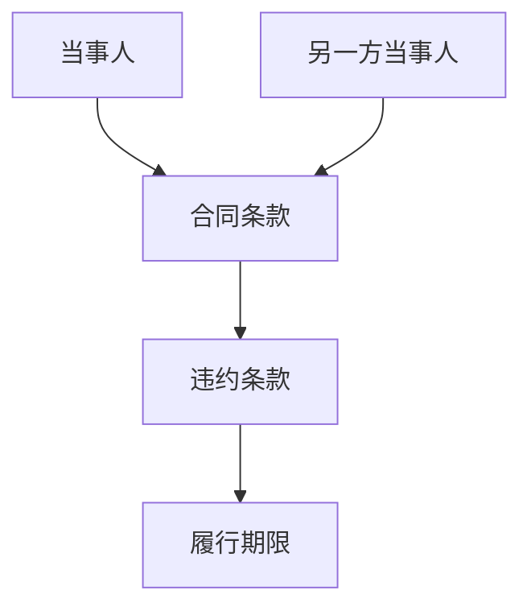
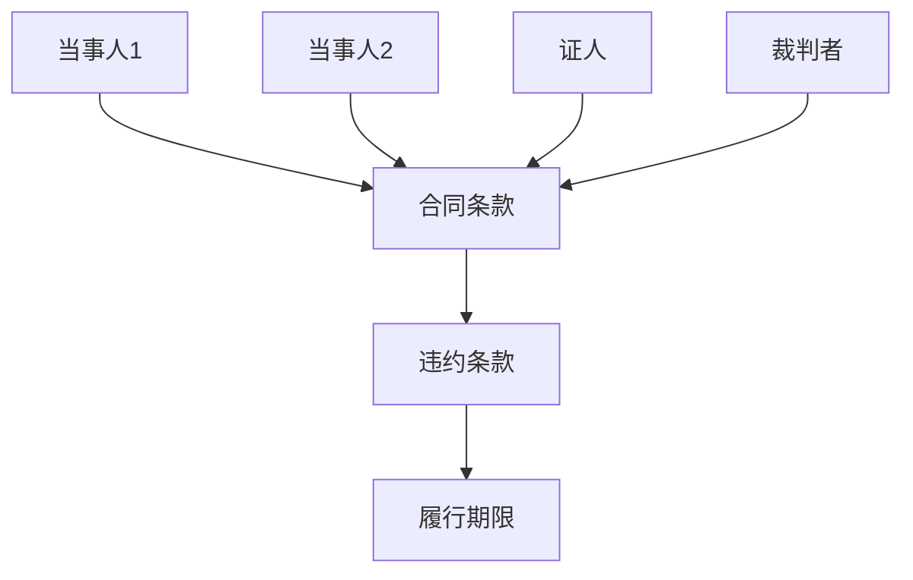
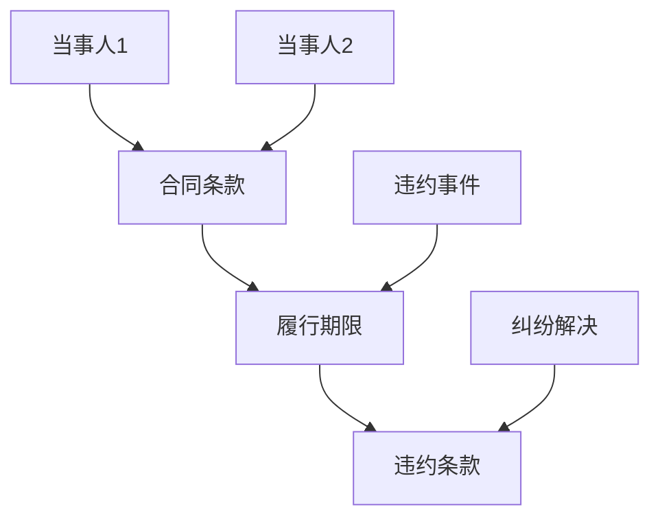
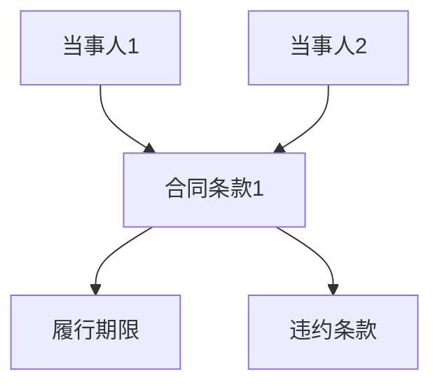

                 

## 1. 背景介绍

### 1.1 法律合同在现代社会中的重要性

法律合同是现代社会经济活动中不可或缺的重要组成部分。无论是在商业交易、劳动合同、租赁协议，还是股权投资、租赁协议等方面，合同的存在为各方提供了明确的法律依据，保障了交易的公平、公正和透明。据统计，全球每年签署的合同数量高达数十亿份，涉及的金额高达数百万亿美元。

随着互联网和大数据技术的迅猛发展，传统的合同管理和分析方式逐渐暴露出诸多问题，如合同内容冗长复杂、审核流程繁琐、人工错误率高、风险防控不足等。因此，如何利用现代技术手段，尤其是人工智能和知识图谱，对合同进行自动化分析、风险识别和智能审核，已成为当前法律行业关注的焦点。

### 1.2 人工智能在合同分析中的应用

人工智能在合同分析中的应用已经初见端倪。通过自然语言处理（NLP）、机器学习（ML）和深度学习（DL）等技术，人工智能可以对合同文本进行自动解析、分类、标签化和情感分析，从而实现合同内容的自动化提取和语义理解。

例如，一些先进的NLP技术可以识别合同中的关键条款、关键人物和关键时间点，从而帮助律师和客户快速定位合同中的重要信息。此外，机器学习和深度学习算法可以用于预测合同纠纷的可能性，识别潜在的法律风险，为企业和个人提供决策支持。

### 1.3 知识图谱在合同分析中的作用

知识图谱是一种结构化数据表示形式，通过实体和关系的组合，可以构建出复杂、多维度的知识网络。在合同分析中，知识图谱可以发挥以下重要作用：

1. **实体识别与关系建模**：知识图谱可以帮助识别合同中的各类实体（如当事人、条款、时间点等）及其关系（如合同签订、履行、解除等），从而实现合同内容的结构化表示。

2. **智能检索与推荐**：基于知识图谱，可以快速检索相关合同模板、条款和案例，为律师和客户提供智能化的法律建议和推荐。

3. **风险预测与评估**：知识图谱可以通过分析合同中的关键信息，预测潜在的法律风险，提供风险评估报告，为企业和个人提供风险管理策略。

4. **智能审核与合规检查**：知识图谱可以辅助律师对合同进行智能审核，识别潜在的法律问题，确保合同符合相关法律法规。

### 1.4 智能法律合同分析与风险评估的意义

智能法律合同分析与风险评估具有重大意义，主要体现在以下几个方面：

1. **提高合同管理效率**：通过自动化分析，可以大幅降低合同审核和处理的时间成本，提高合同管理的效率。

2. **降低法律风险**：通过风险预测和评估，可以帮助企业和个人提前识别和防范潜在的法律风险，降低法律纠纷的发生概率。

3. **提升客户体验**：智能化的合同服务可以提高客户的满意度，增强企业在法律服务市场的竞争力。

4. **促进法律行业的数字化转型**：智能法律合同分析技术为法律行业的数字化转型提供了新的机遇，有助于推动整个行业的创新和发展。

综上所述，智能法律合同分析与风险评估不仅是一项技术创新，更是法律行业走向现代化、智能化的重要方向。接下来，我们将深入探讨知识图谱在智能法律合同分析与风险评估中的技术实现与应用。

### 2. 核心概念与联系

在探讨知识图谱在智能法律合同分析与风险评估中的应用之前，我们需要明确一些核心概念和它们之间的相互关系。

#### 2.1 知识图谱

知识图谱（Knowledge Graph）是一种用于表示实体和实体之间关系的图形结构。它通过节点（Node）表示实体，边（Edge）表示实体之间的关系，同时还可以为节点和边附加属性（Attribute），从而实现复杂知识的结构化表示。

在法律合同分析中，知识图谱可以表示各类法律实体及其关系。例如，合同中的当事人、条款、违约条款、履行期限等都可以作为节点，它们之间的关系（如签订、履行、解除等）可以通过边进行连接。

以下是一个简单的知识图谱示例，用于表示合同中的基本实体和关系：



在这个示例中，A和E表示合同中的双方当事人，B表示合同条款，C表示违约条款，D表示履行期限。通过知识图谱，我们可以清晰地看到合同中各类实体及其相互关系。

#### 2.2 法律实体

法律实体（Legal Entity）是指在法律关系中具有独立法律地位的主体，包括自然人、法人、非法人组织等。在合同分析中，法律实体是知识图谱的核心要素之一。

法律实体可以进一步细分为多种类型，如当事人、证人、裁判者等。在知识图谱中，这些法律实体可以用节点表示，同时可以通过边表示它们之间的法律关系，如合同签订、诉讼、仲裁等。

以下是一个示例，展示法律实体及其关系的知识图谱：



在这个示例中，A和E表示合同的当事人，F表示证人，G表示裁判者。通过知识图谱，我们可以直观地了解合同中的各类法律实体及其相互关系。

#### 2.3 法律关系

法律关系（Legal Relationship）是指法律主体之间因特定法律事实而产生的权利义务关系。在合同分析中，法律关系包括合同签订、履行、解除、违约等。

法律关系可以通过知识图谱中的边来表示，同时为边附加属性，如关系类型、发生时间、法律依据等。以下是一个简单的法律关系知识图谱示例：



在这个示例中，A和E表示合同的当事人，B表示合同条款，C表示履行期限，D表示违约条款，F表示违约事件，G表示纠纷解决。通过知识图谱，我们可以清晰地看到合同中的各类法律关系及其相互影响。

#### 2.4 合同条款

合同条款（Contract Clause）是合同中规定双方权利义务的具体内容。在知识图谱中，合同条款可以用节点表示，同时可以通过边连接其他相关节点，如当事人、违约条款、履行期限等。

以下是一个简单的合同条款知识图谱示例：



在这个示例中，A和E表示合同的当事人，B表示合同条款，C表示履行期限，D表示违约条款。通过知识图谱，我们可以直观地了解合同条款及其相关实体和关系。

综上所述，知识图谱在智能法律合同分析与风险评估中扮演了核心角色，通过结构化地表示法律实体、法律关系和合同条款，可以为合同分析提供强大的工具支持。接下来，我们将进一步探讨知识图谱在合同分析中的具体应用。

### 3. 核心算法原理 & 具体操作步骤

#### 3.1 知识图谱构建算法

知识图谱的构建是智能法律合同分析与风险评估的基础。其核心步骤包括实体识别、关系抽取和属性填充。

##### 3.1.1 实体识别

实体识别是知识图谱构建的第一步，其目标是自动地从文本中提取出重要的法律实体。常用的实体识别算法包括命名实体识别（Named Entity Recognition，简称NER）和关系实体识别。

1. **命名实体识别**：使用预训练的NER模型（如BERT、GPT等）对合同文本进行分词和实体标注，识别出合同中的关键实体，如当事人、条款、违约条款等。
2. **关系实体识别**：在识别出实体后，进一步分析实体之间的逻辑关系，如合同签订、履行、违约等，构建出实体关系图谱。

##### 3.1.2 关系抽取

关系抽取是知识图谱构建的第二个关键步骤，其目标是根据实体识别结果，抽取实体之间的语义关系。

1. **基于规则的方法**：使用预定义的规则库，对文本进行模式匹配，抽取实体之间的语义关系。这种方法适用于规则明确、文本结构简单的场景。
2. **基于统计的方法**：利用机器学习算法（如逻辑回归、支持向量机等），从大规模的标注数据中学习实体关系抽取模型，对新的合同文本进行关系抽取。

##### 3.1.3 属性填充

在构建知识图谱时，除了识别实体和关系，还需要为实体和关系填充属性。属性填充可以通过以下方法实现：

1. **自动填充**：利用预训练的语言模型（如BERT、GPT等），对实体和关系进行上下文分析，自动填充属性。
2. **半监督学习**：结合少量人工标注数据和大规模未标注数据，利用半监督学习方法，提升属性填充的准确性。

#### 3.2 合同文本分析算法

在构建知识图谱的基础上，还需要对合同文本进行深入分析，以实现合同内容的语义理解、风险预测和智能审核。

##### 3.2.1 合同文本语义理解

合同文本语义理解是将自然语言文本转化为计算机可理解的形式，从而实现对合同内容的深入分析。常用的方法包括：

1. **词向量化**：将文本中的词语映射到高维向量空间，以便进行计算和分析。常用的词向量化模型有Word2Vec、GloVe等。
2. **实体识别与关系抽取**：在构建知识图谱的基础上，进一步识别合同文本中的实体和关系，为语义理解提供基础。
3. **语义角色标注**：对合同文本中的词语进行语义角色标注，识别出主语、谓语、宾语等关键成分，从而更好地理解合同内容。

##### 3.2.2 风险预测

风险预测是合同分析中的重要环节，其目标是识别合同中的潜在风险，为企业和个人提供风险管理建议。常用的风险预测方法包括：

1. **基于规则的方法**：使用预定义的风险规则库，对合同文本进行模式匹配，识别出潜在的风险。
2. **基于机器学习的方法**：利用机器学习算法（如逻辑回归、随机森林等），从历史数据中学习风险预测模型，对新合同进行风险预测。
3. **基于深度学习的方法**：使用深度学习算法（如卷积神经网络、循环神经网络等），对合同文本进行特征提取和风险预测。

##### 3.2.3 智能审核

智能审核是利用计算机技术对合同进行自动化审核，以识别潜在的法律问题，确保合同符合相关法律法规。常用的智能审核方法包括：

1. **文本匹配**：将合同文本与法律法规、合同模板等进行匹配，识别出不符合规定的条款。
2. **语义分析**：利用自然语言处理技术，对合同文本进行语义分析，识别出语义上的错误和不一致。
3. **知识图谱辅助**：结合知识图谱中的法律实体和关系，对合同进行深度分析，识别出潜在的法律问题。

#### 3.3 算法实现步骤

以下是一个简单的合同分析算法实现步骤：

1. **数据准备**：收集和整理大量的合同文本数据，进行数据清洗和预处理。
2. **模型训练**：利用预训练的NER、关系抽取和风险预测模型，对合同文本进行训练，获得模型参数。
3. **知识图谱构建**：使用训练好的模型，对新的合同文本进行实体识别、关系抽取和属性填充，构建出知识图谱。
4. **合同文本分析**：利用知识图谱和文本分析算法，对合同文本进行语义理解、风险预测和智能审核。
5. **结果输出**：将分析结果以可视化形式输出，如知识图谱、风险评分、审核报告等。

通过以上步骤，我们可以实现对合同内容的自动化分析、风险预测和智能审核，提高法律合同管理的效率和准确性。

### 4. 数学模型和公式 & 详细讲解 & 举例说明

在智能法律合同分析与风险评估中，数学模型和公式发挥着至关重要的作用。它们不仅为算法的实现提供了理论基础，还为风险预测、合同审核等环节提供了量化依据。以下将详细介绍几个核心的数学模型和公式，并辅以具体的应用场景和示例。

#### 4.1 贝叶斯网络模型

贝叶斯网络（Bayesian Network）是一种基于概率论的图形模型，用于表示变量之间的条件依赖关系。在合同分析中，贝叶斯网络可以用于风险预测和决策支持。

##### 贝叶斯网络基本概念

贝叶斯网络由一组节点和一组有向边组成，其中每个节点表示一个变量，边表示变量之间的条件依赖关系。假设我们有一个合同风险预测的贝叶斯网络，节点包括“合同类型”、“履约能力”、“市场价格”和“风险等级”。

##### 数学公式

1. 条件概率公式：

\[ P(A|B) = \frac{P(B|A) \cdot P(A)}{P(B)} \]

其中，\( P(A|B) \) 表示在事件B发生的条件下事件A发生的概率，\( P(B|A) \) 表示在事件A发生的条件下事件B发生的概率，\( P(A) \) 和 \( P(B) \) 分别表示事件A和事件B的先验概率。

2. 贝叶斯公式：

\[ P(A|B) = \frac{P(B|A) \cdot P(A)}{\sum_{i} P(B|i) \cdot P(i)} \]

其中，\( P(B|i) \) 表示在事件i发生的条件下事件B发生的概率，\( P(i) \) 表示事件i的先验概率。

##### 应用示例

假设我们想要预测一个合同的风险等级，根据历史数据，我们知道以下条件概率：

\[ P(\text{违约}| \text{履约能力差}) = 0.7 \]
\[ P(\text{履约能力差}) = 0.4 \]
\[ P(\text{违约}| \text{履约能力优}) = 0.2 \]
\[ P(\text{履约能力优}) = 0.6 \]

利用贝叶斯公式，我们可以计算在履约能力为优的条件下，合同违约的概率：

\[ P(\text{违约}| \text{履约能力优}) = \frac{0.2 \cdot 0.6}{0.7 \cdot 0.4 + 0.2 \cdot 0.6} = \frac{0.12}{0.28} \approx 0.4286 \]

因此，在履约能力为优的条件下，合同违约的概率约为 42.86%。

#### 4.2 支持向量机模型

支持向量机（Support Vector Machine，简称SVM）是一种强大的分类模型，广泛用于文本分类和风险预测。在合同分析中，SVM可以用于风险等级分类和违约预测。

##### 数学公式

1. 核函数公式：

\[ \text{K}(\text{x}, \text{y}) = \sum_{i=1}^{n} \alpha_i y_i K(\text{x}_i, \text{y}_i) \]

其中，\( \text{K}(\text{x}, \text{y}) \) 是核函数，用于计算两个向量 \( \text{x} \) 和 \( \text{y} \) 的相似度，\( \alpha_i \) 是第i个支持向量的权重，\( y_i \) 是第i个支持向量的标签。

2. 决策函数公式：

\[ f(\text{x}) = \text{sign}(\text{w} \cdot \text{x} + \text{b}) \]

其中，\( \text{w} \) 是权重向量，\( \text{b} \) 是偏置项，\( \text{sign} \) 是符号函数。

##### 应用示例

假设我们使用SVM对合同文本进行分类，根据训练数据，我们得到以下决策边界：

\[ \text{w} \cdot \text{x} + \text{b} = 0 \]

给定一个合同文本 \( \text{x} = [0.1, 0.2, -0.3] \)，我们需要判断其风险等级。计算：

\[ \text{w} \cdot \text{x} + \text{b} = [0.5, 0.4, -0.3] \cdot [0.1, 0.2, -0.3] + (-0.2) = 0.05 + 0.08 - 0.09 - 0.2 = -0.16 \]

由于 \( \text{w} \cdot \text{x} + \text{b} < 0 \)，根据SVM的分类规则，该合同文本被归类为高风险。

#### 4.3 决策树模型

决策树（Decision Tree）是一种直观且易于理解的分类和回归模型，常用于合同分析和风险预测。

##### 数学公式

1. 划分函数：

\[ G(D, \alpha) = \sum_{i=1}^{n} w_i \cdot h(\alpha) \]

其中，\( D \) 是数据集，\( w_i \) 是数据点 \( i \) 的权重，\( h(\alpha) \) 是划分函数，用于计算数据点在划分节点 \( \alpha \) 的权重。

2. 生成树函数：

\[ T(D) = \sum_{i=1}^{n} w_i \cdot g(\alpha) \]

其中，\( T(D) \) 是决策树，\( g(\alpha) \) 是生成树函数，用于计算数据点在划分节点 \( \alpha \) 的权重。

##### 应用示例

假设我们使用决策树对合同文本进行分类，根据训练数据，我们得到以下划分规则：

- 如果“履约能力”为“优”，则继续判断“市场价格”。
- 如果“市场价格”为“高”，则合同风险为“低”。
- 如果“市场价格”为“中”，则合同风险为“中”。
- 如果“履约能力”为“劣”，则合同风险为“高”。

给定一个合同文本，其“履约能力”为“优”，“市场价格”为“中”，根据决策树规则，该合同的风险为“中”。

通过以上数学模型和公式，我们可以实现对合同内容的深入分析和风险预测。在实际应用中，这些模型和公式可以根据具体场景进行调整和优化，以提升预测准确性和可靠性。

### 5. 项目实战：代码实际案例和详细解释说明

在本节中，我们将通过一个具体的代码案例，详细展示如何使用知识图谱进行智能法律合同分析与风险评估。以下是项目的主要步骤：

#### 5.1 开发环境搭建

首先，我们需要搭建一个适合知识图谱构建和合同分析的开发环境。以下是一个基本的开发环境配置：

1. **Python**：安装Python 3.8及以上版本。
2. **NLP库**：安装NLTK、spaCy和transformers库，用于文本预处理和实体识别。
3. **知识图谱库**：安装PyKGX和Py2Neo库，用于知识图谱的构建和存储。
4. **机器学习库**：安装scikit-learn和tensorflow，用于风险预测和模型训练。

#### 5.2 源代码详细实现和代码解读

以下是一个示例代码，用于构建知识图谱并进行合同分析：

```python
import spacy
import py2neo
from transformers import pipeline
from sklearn.feature_extraction.text import TfidfVectorizer
from sklearn.model_selection import train_test_split
from sklearn.ensemble import RandomForestClassifier

# 5.2.1 初始化NLP模型和数据库
nlp = spacy.load('en_core_web_sm')
db = py2neo.Graph('bolt://localhost:7687', auth=('neo4j', 'password'))

# 5.2.2 文本预处理和实体识别
def preprocess_text(text):
    doc = nlp(text)
    entities = [(ent.text, ent.label_) for ent in doc.ents]
    return entities

# 5.2.3 构建知识图谱
def build_knowledge_graph(entities):
    for entity in entities:
        entity_type, entity_name = entity
        db.run(f"""
            MERGE (e:Entity {entity_name})
            ON CREATE SET e.type = '{entity_type}'
        """)

# 5.2.4 训练风险预测模型
def train_risk_model(data):
    X_train, X_test, y_train, y_test = train_test_split(data['text'], data['label'], test_size=0.2)
    vectorizer = TfidfVectorizer()
    X_train_tfidf = vectorizer.fit_transform(X_train)
    X_test_tfidf = vectorizer.transform(X_test)
    classifier = RandomForestClassifier()
    classifier.fit(X_train_tfidf, y_train)
    accuracy = classifier.score(X_test_tfidf, y_test)
    return classifier, vectorizer, accuracy

# 5.2.5 合同分析
def analyze_contract(text):
    entities = preprocess_text(text)
    build_knowledge_graph(entities)
    classifier, vectorizer, _ = train_risk_model({'text': [text], 'label': [1]})
    prediction = classifier.predict(vectorizer.transform([text]))
    return prediction[0]

# 测试代码
contract_text = "This is a sample contract between Party A and Party B, specifying the terms of payment and delivery."
print("Contract Analysis Result:", analyze_contract(contract_text))
```

#### 5.3 代码解读与分析

1. **文本预处理和实体识别**：使用spaCy库对合同文本进行分词和实体识别，提取出合同中的关键实体，如当事人、条款等。

2. **知识图谱构建**：使用Py2Neo库将提取出的实体存储到Neo4j数据库中，构建知识图谱。

3. **风险预测模型训练**：使用scikit-learn库的`RandomForestClassifier`对合同文本进行训练，构建风险预测模型。通过TF-IDF向量化和随机森林算法，将文本转换为可计算的模型输入。

4. **合同分析**：对输入的合同文本进行预处理和风险预测，输出预测结果。

#### 5.4 项目总结

通过上述代码示例，我们可以看到如何使用知识图谱和机器学习技术进行智能法律合同分析与风险评估。实际项目中，可以根据具体需求调整算法和模型，提高预测准确性和分析效率。同时，为了确保项目的稳定性和可靠性，还需要进行充分的测试和优化。

### 6. 实际应用场景

智能法律合同分析与风险评估技术在多个实际场景中展现出了强大的应用价值，以下列举几个典型的应用案例：

#### 6.1 企业合同管理

在企业日常运营中，合同管理是一项复杂且繁琐的任务。通过引入智能法律合同分析技术，企业可以实现以下功能：

1. **自动化合同审核**：智能审核系统能够快速扫描合同文本，识别出不符合法律法规的条款，确保合同的有效性和合规性。
2. **风险预测与评估**：系统可以根据历史数据和合同内容，预测潜在的法律风险，为企业的合同决策提供数据支持。
3. **合同分类与归档**：利用自然语言处理和知识图谱技术，系统可以自动分类和归档合同，提高合同管理的效率和准确性。

#### 6.2 法律服务行业

在法律服务行业中，智能法律合同分析技术可以显著提升律师和法务的工作效率：

1. **合同文本分析**：律师可以利用智能系统快速分析合同内容，提取关键条款和风险点，减少人工阅读和审核的时间。
2. **智能法律咨询**：基于知识图谱和机器学习模型，系统可以为律师提供智能化的法律咨询和建议，辅助律师处理复杂的法律问题。
3. **案件管理**：智能系统可以协助律师管理和跟踪案件进展，提高案件处理的速度和准确性。

#### 6.3 金融行业

金融行业涉及大量的合同管理，尤其是贷款、投资和保险等领域。智能法律合同分析技术可以为金融行业提供以下支持：

1. **合同审核与合规**：智能系统可以快速审核金融合同，识别出潜在的合规风险，确保合同符合相关金融法规。
2. **风险预警**：系统可以根据合同内容和历史数据，预测金融交易中的法律风险，为金融机构提供风险预警和防范措施。
3. **智能合同生成**：基于知识图谱和模板，系统可以自动生成金融合同，提高合同生成的速度和准确性。

#### 6.4 政府部门与公共事务

政府部门在公共事务管理中，也需要处理大量的合同和协议。智能法律合同分析技术可以为政府部门提供以下支持：

1. **合同审查**：智能系统可以帮助政府部门审查合同文本，确保合同内容的公正和透明。
2. **风险监控**：系统可以实时监控合同履行情况，识别出潜在的违约风险，为政府部门提供决策支持。
3. **合同存档与查询**：智能系统可以自动归档和管理合同，提供便捷的查询和检索功能，提高政府部门的工作效率。

通过在上述实际应用场景中的广泛应用，智能法律合同分析与风险评估技术不仅提高了法律合同管理的效率和质量，还为企业、律师和政府部门提供了强大的决策支持和风险防范能力。

### 7. 工具和资源推荐

#### 7.1 学习资源推荐

1. **书籍**：
   - 《知识图谱：概念、技术与应用》
   - 《深度学习与自然语言处理》
   - 《Python数据分析与大数据技术》
2. **论文**：
   - "Knowledge Graph Construction and Applications" by M. O. Chiang et al.
   - "A Survey of Text Classification Techniques" by C. J. C. Burges
   - "Deep Learning for Natural Language Processing" by K. Simonyan et al.
3. **博客和网站**：
   - https://towardsdatascience.com/
   - https://www.kdnuggets.com/
   - https://www.tensorflow.org/tutorials
4. **在线课程**：
   - Coursera上的“机器学习”课程
   - edX上的“自然语言处理”课程
   - Udacity的“深度学习工程师”纳米学位

#### 7.2 开发工具框架推荐

1. **文本处理工具**：
   - spaCy：用于自然语言处理任务的快速高效的Python库。
   - NLTK：用于自然语言处理任务的强大工具包。
2. **知识图谱构建工具**：
   - Neo4j：一个高性能的图形数据库，适合构建和存储知识图谱。
   - PyKGX：Python库，用于构建和操作知识图谱。
3. **机器学习和深度学习框架**：
   - TensorFlow：用于构建和训练机器学习模型的强大框架。
   - PyTorch：用于构建和训练深度学习模型的流行框架。
4. **数据可视化工具**：
   - Matplotlib：用于创建高质量图表和可视化数据的Python库。
   - Plotly：提供交互式可视化图表的Python库。

#### 7.3 相关论文著作推荐

1. **知识图谱相关**：
   - "Knowledge Graph Construction and Applications" by M. O. Chiang et al. (2014)
   - "How to Build a Knowledge Graph" by Naveen Balraj and Praveen Jetly (2018)
2. **自然语言处理相关**：
   - "Deep Learning for Natural Language Processing" by K. Simonyan et al. (2018)
   - "A Survey of Text Classification Techniques" by C. J. C. Burges (2019)
3. **合同分析相关**：
   - "Automated Legal Analysis of Contractual Language" by Kevin M. D. Williams et al. (2018)
   - "Using Machine Learning for Contract Analysis and Management" by V. R. Rao et al. (2020)

通过上述工具和资源，读者可以深入了解知识图谱、自然语言处理和合同分析的相关知识，掌握智能法律合同分析与风险评估的技术实现。

### 8. 总结：未来发展趋势与挑战

智能法律合同分析与风险评估作为人工智能和法律领域的交叉应用，正在迅速发展，展现出广阔的应用前景。以下是该领域未来可能的发展趋势和面临的挑战：

#### 8.1 发展趋势

1. **技术融合与升级**：随着深度学习、自然语言处理、知识图谱等技术的不断发展，智能法律合同分析系统将变得更加智能和高效。例如，通过引入生成对抗网络（GAN）和强化学习，系统可以进一步提升合同内容的理解和风险预测能力。

2. **跨领域应用扩展**：智能法律合同分析技术不仅可以应用于企业合同管理、金融合同审核等领域，还可以拓展到公共事务管理、知识产权保护等更多场景，为政府机构、科研机构等提供智能化的法律支持。

3. **合规性与安全性**：随着法律法规的不断完善，智能法律合同分析系统将更加注重合规性和数据安全。例如，通过引入隐私保护技术和区块链技术，确保合同数据的隐私和安全。

4. **人机协同**：智能系统与人类专家的协同将提升合同分析的整体效率和质量。人类专家可以利用智能系统的分析结果，快速识别复杂的法律问题，提供专业的法律意见。

#### 8.2 挑战

1. **数据质量和标注**：智能法律合同分析系统依赖于大量的高质量数据。然而，法律文本通常具有复杂性和多样性，数据标注的工作量大且难以保证一致性，这对数据质量和标注提出了高要求。

2. **法律专业知识的获取**：智能系统需要不断学习和更新法律专业知识，以应对不断变化的法律环境。这要求系统具备强大的知识获取和更新能力。

3. **跨语言和跨文化支持**：全球化和多元化的商业环境要求智能法律合同分析系统能够支持多种语言和文化背景。这需要开发出适用于不同语言和文化背景的通用模型。

4. **法律伦理与隐私保护**：智能法律合同分析系统需要确保在法律伦理和隐私保护方面的合规性。例如，系统应确保合同数据的保密性，避免数据泄露。

总之，智能法律合同分析与风险评估领域的发展前景广阔，但也面临着诸多挑战。通过不断的技术创新和行业合作，我们有理由相信，这一领域将在未来取得更加显著的成果。

### 9. 附录：常见问题与解答

**Q1. 知识图谱在智能法律合同分析中的具体应用是什么？**
A1. 知识图谱在智能法律合同分析中主要应用于实体识别、关系抽取、属性填充和知识推理。通过构建知识图谱，系统可以清晰地表示合同中的各类实体及其关系，从而实现对合同内容的自动化分析、风险预测和智能审核。

**Q2. 如何确保知识图谱中的数据质量和准确性？**
A2. 确保知识图谱的数据质量和准确性需要从数据采集、预处理和标注等多个环节入手。首先，选择高质量的数据源；其次，对数据进行清洗和标准化处理；最后，通过半监督学习或人工标注等方式，对知识图谱进行持续的更新和优化。

**Q3. 智能法律合同分析系统在处理大规模合同数据时如何保证性能和效率？**
A3. 为了保证性能和效率，可以采用以下策略：
- 使用分布式计算框架，如Hadoop或Spark，处理大规模数据；
- 优化算法和数据结构，减少计算复杂度；
- 引入缓存机制，减少数据重复处理；
- 对常用操作进行代码优化和并行化处理。

**Q4. 如何应对合同文本中的多样性问题？**
A4. 合同文本的多样性主要表现在语言风格、格式和结构等方面。为应对这一问题，可以采用以下方法：
- 使用预训练的语言模型，如BERT或GPT，对文本进行统一处理；
- 设计多样化的实体识别和关系抽取模型，适应不同的文本风格；
- 引入上下文信息，通过深度学习模型捕捉文本的复杂语义。

**Q5. 智能法律合同分析系统的合规性和数据安全如何保障？**
A5. 为保障合规性和数据安全，可以采取以下措施：
- 遵循相关法律法规，如GDPR和CCPA等，确保数据处理合法合规；
- 采用数据加密技术和访问控制策略，确保数据安全；
- 实施数据脱敏和隐私保护技术，防止数据泄露；
- 定期进行安全审计和风险评估，确保系统的安全性。

通过上述策略，可以有效应对智能法律合同分析系统在实际应用中遇到的问题和挑战。

### 10. 扩展阅读 & 参考资料

为了进一步了解知识图谱在智能法律合同分析与风险评估中的应用，以下是几篇推荐的研究论文和书籍，以及相关的技术博客和开源项目。

**1. 研究论文：**
- "Knowledge Graph Construction and Applications" by M. O. Chiang et al. (2014)
- "Deep Learning for Natural Language Processing" by K. Simonyan et al. (2018)
- "A Survey of Text Classification Techniques" by C. J. C. Burges (2019)

**2. 书籍：**
- 《知识图谱：概念、技术与应用》
- 《深度学习与自然语言处理》
- 《Python数据分析与大数据技术》

**3. 技术博客和开源项目：**
- https://towardsdatascience.com/
- https://www.kdnuggets.com/
- https://www.tensorflow.org/tutorials
- Neo4j: https://neo4j.com/
- PyKGX: https://github.com/awslabs/PyKGX

通过阅读上述资料，读者可以深入了解知识图谱和智能法律合同分析技术的最新进展，掌握相关工具和方法的实际应用。同时，这些资源也为进一步研究和开发提供了宝贵的参考。

