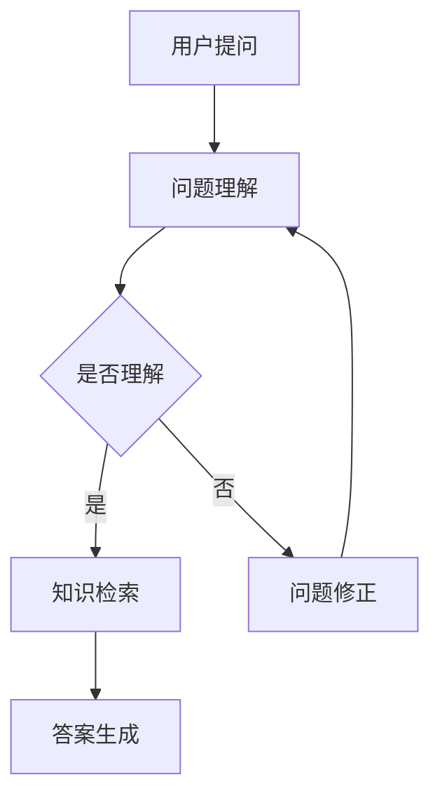

                 

# 知识图谱在智能问答系统中的应用与优化

> **关键词：** 知识图谱、智能问答系统、算法优化、数据结构、自然语言处理

> **摘要：** 本文将探讨知识图谱在智能问答系统中的应用与优化，从核心概念、算法原理、数学模型到实际应用场景，系统性地分析知识图谱在智能问答领域的价值与挑战，并提出相应的优化策略。

## 1. 背景介绍

随着互联网和大数据技术的迅猛发展，信息爆炸式增长，用户对信息检索和知识获取的需求日益增加。传统的基于关键字匹配的搜索技术已经无法满足用户对智能问答的需求。智能问答系统作为人工智能领域的一个重要分支，近年来受到了广泛关注。知识图谱作为一种新的数据结构，其在大规模知识表示和推理方面具有独特的优势，逐渐成为智能问答系统的关键技术。

知识图谱是一种语义网络，通过实体、属性和关系的表示，将复杂的关系信息组织成一个结构化的数据模型。知识图谱不仅能够有效地存储和检索大量信息，还能够进行复杂的语义推理和知识发现，从而提高智能问答系统的准确性和效率。

智能问答系统则是基于知识图谱构建的，旨在为用户提供自然语言交互式的知识查询和解答服务。通过自然语言处理技术，智能问答系统能够理解用户的提问，并从知识图谱中检索出相关的答案。

本文将围绕知识图谱在智能问答系统中的应用与优化展开，旨在深入探讨其核心概念、算法原理、数学模型和实际应用场景，为智能问答系统的研发和应用提供理论支持和实践指导。

## 2. 核心概念与联系

### 2.1 知识图谱的概念

知识图谱（Knowledge Graph）是一种用于结构化、语义化和图化表示知识的图形化数据模型。它通过实体、属性和关系的表示，将世界上的各种实体及其相互关系抽象为一张大型的图。知识图谱中的实体可以是人物、地点、组织、概念等，属性表示实体的特征，关系描述实体之间的联系。

知识图谱的基本概念包括：

- **实体（Entity）**：知识图谱中的核心元素，表示现实世界中的事物。
- **属性（Attribute）**：描述实体的特征或属性，例如人的年龄、地理位置、职业等。
- **关系（Relationship）**：连接两个或多个实体的语义关系，例如“工作于”、“位于”等。

### 2.2 智能问答系统的概念

智能问答系统（Intelligent Question Answering System）是一种能够理解和回答用户提问的人工智能系统。它通过自然语言处理（NLP）技术，将用户的自然语言问题转换为机器可理解的形式，然后利用知识图谱进行语义理解和推理，最终生成合适的答案。

智能问答系统的主要功能包括：

- **问题理解**：解析用户的自然语言问题，提取关键信息。
- **知识检索**：从知识图谱中检索与问题相关的信息。
- **答案生成**：根据检索到的信息，生成自然语言形式的答案。

### 2.3 知识图谱与智能问答系统的联系

知识图谱为智能问答系统提供了核心的知识表示和推理能力。具体来说：

- **知识表示**：知识图谱将实体、属性和关系以图形化的形式组织起来，使得智能问答系统能够高效地存储和检索知识。
- **语义理解**：知识图谱中的语义信息可以帮助智能问答系统更好地理解用户的提问，提高问答的准确性和语义匹配度。
- **推理能力**：知识图谱中的关系和属性可以用于推理，帮助智能问答系统发现用户问题中潜在的知识关联，生成更合理的答案。

### 2.4 Mermaid 流程图

以下是一个简化的知识图谱与智能问答系统之间的流程图：



在这个流程图中，用户提问首先被传递到问题理解模块，经过解析后判断是否能够理解用户的问题。如果能够理解，则进行知识检索，从知识图谱中获取相关信息，最终生成答案。如果无法理解，则返回问题修正模块，进行进一步的提问理解和问题修正。

## 3. 核心算法原理 & 具体操作步骤

### 3.1 知识图谱构建

知识图谱的构建是智能问答系统的第一步，它决定了系统后续的知识表示和检索能力。知识图谱的构建主要包括数据采集、数据清洗、实体抽取、关系抽取和知识融合等步骤。

- **数据采集**：从互联网、数据库、文献等多种数据源中收集相关的知识数据。
- **数据清洗**：对采集到的数据进行预处理，包括去除重复数据、填补缺失数据、纠正错误数据等。
- **实体抽取**：从原始数据中识别和提取出实体，如人物、地点、组织等。
- **关系抽取**：识别实体之间的语义关系，如“工作于”、“位于”等。
- **知识融合**：将多个来源的数据进行整合，形成统一的知识图谱。

### 3.2 自然语言处理

自然语言处理（NLP）是智能问答系统的核心技术之一，它负责将用户的自然语言问题转换为机器可理解的形式。NLP的主要任务包括分词、词性标注、命名实体识别、依存句法分析等。

- **分词**：将自然语言文本分割成一个个单词或短语。
- **词性标注**：为每个词分配一个词性标签，如名词、动词、形容词等。
- **命名实体识别**：识别出文本中的命名实体，如人名、地名、组织名等。
- **依存句法分析**：分析句子中词汇之间的依赖关系，理解句子的结构。

### 3.3 语义理解

语义理解是智能问答系统的关键步骤，它负责将用户的问题映射到知识图谱中的相关实体和关系上。语义理解主要包括关键词提取、语义角色标注、语义匹配等。

- **关键词提取**：从用户问题中提取出关键信息，如主语、谓语、宾语等。
- **语义角色标注**：为关键词分配语义角色标签，如动作执行者、动作接受者等。
- **语义匹配**：将提取出的关键词和知识图谱中的实体、关系进行匹配，找到对应的知识节点。

### 3.4 答案生成

答案生成是智能问答系统的最后一步，它根据知识图谱中的信息生成自然语言答案。答案生成主要包括答案提取、模板匹配、文本生成等。

- **答案提取**：从知识图谱中检索出与问题相关的信息，提取出答案。
- **模板匹配**：将提取出的答案与预设的答案模板进行匹配，生成完整的答案文本。
- **文本生成**：利用自然语言生成技术，将匹配的答案模板生成自然流畅的文本答案。

## 4. 数学模型和公式 & 详细讲解 & 举例说明

### 4.1 数学模型

在知识图谱的构建和智能问答系统的运行中，涉及到多种数学模型和算法。以下是一些常见的数学模型和公式：

- **图论模型**：知识图谱可以看作是一个图，其中实体是节点，关系是边。图论中的算法，如最短路径算法、最小生成树算法等，可以用于知识图谱的优化和查询。
  
  最短路径算法的公式如下：
  $$d(v_1, v_2) = \min \{ d(v_1, v) + d(v, v_2) \mid v \in V \}$$
  其中，$d(v_1, v_2)$表示节点$v_1$到节点$v_2$的最短路径长度。

- **概率模型**：在自然语言处理中，常用的概率模型包括隐马尔可夫模型（HMM）和条件概率模型。例如，词性标注可以使用条件概率模型，公式如下：
  $$P(\text{词性} | \text{单词}) = \frac{P(\text{单词} | \text{词性}) \cdot P(\text{词性})}{P(\text{单词})}$$
  其中，$P(\text{词性} | \text{单词})$表示给定一个单词，它的词性概率。

- **机器学习模型**：在智能问答系统中，机器学习模型如支持向量机（SVM）、决策树等可以用于分类和预测。以SVM为例，其目标函数如下：
  $$\min_{w, b} \frac{1}{2} ||w||^2 + C \sum_{i=1}^{n} \max(0, 1 - y_i (w \cdot x_i + b))$$
  其中，$w$和$b$分别是模型的权重和偏置，$C$是正则化参数。

### 4.2 详细讲解

#### 图论模型

知识图谱中的图论模型主要用于优化知识图谱的查询性能和结构。例如，在最短路径算法中，我们可以通过计算节点之间的最短路径来提高知识检索的效率。

假设有一个有向图$G=(V, E)$，其中$V$是节点集，$E$是边集。给定两个节点$v_1$和$v_2$，最短路径问题可以转化为寻找一个路径，使得从$v_1$到$v_2$的路径长度最小。

最短路径算法的时间复杂度是$O(V^2)$，在实际应用中，通常会使用Dijkstra算法或A*算法来优化查询性能。

#### 概率模型

在自然语言处理中，概率模型主要用于解决不确定性问题。以词性标注为例，词性标注是一个序列标注问题，我们需要为句子中的每个词分配一个词性标签。

词性标注的模型可以使用HMM或条件概率模型。在条件概率模型中，我们通常使用最大后验概率（MAP）来估计词性标签：

$$\hat{y}(i) = \arg \max_y P(y | \text{单词序列}) = \arg \max_y \frac{P(\text{单词序列} | y) \cdot P(y)}{P(\text{单词序列})}$$

其中，$P(y | \text{单词序列})$是给定单词序列，词性标签$y$的概率，$P(\text{单词序列} | y)$是给定词性标签，生成单词序列的概率，$P(y)$是词性标签的概率。

#### 机器学习模型

在智能问答系统中，机器学习模型可以用于分类和预测任务。以SVM为例，SVM的目标是最小化分类间隔，即最大化分类边界。

SVM的目标函数如下：

$$\min_{w, b} \frac{1}{2} ||w||^2 + C \sum_{i=1}^{n} \max(0, 1 - y_i (w \cdot x_i + b))$$

其中，$w$和$b$分别是模型的权重和偏置，$C$是正则化参数，$y_i$是样本$i$的标签，$x_i$是样本$i$的特征向量。

### 4.3 举例说明

#### 图论模型

假设有一个图$G=(V, E)$，其中$V=\{v_1, v_2, v_3, v_4\}$，$E=\{(v_1, v_2), (v_2, v_3), (v_3, v_4), (v_4, v_1)\}$，权重分别为$w_1=1, w_2=2, w_3=3, w_4=4$。我们需要计算从$v_1$到$v_4$的最短路径。

使用Dijkstra算法，我们可以得到从$v_1$到$v_4$的最短路径长度为$7$，路径为$v_1 \rightarrow v_2 \rightarrow v_3 \rightarrow v_4$。

#### 概率模型

假设我们有以下单词序列和词性标签：

单词序列：[“我”、“爱”、“北京”、“天安门”]

词性标签：[“PRP”、“V”、“NNP”、“NNP”]

给定一个词性标注模型，我们可以计算每个词性的概率，然后使用最大后验概率（MAP）算法选择最可能的词性标签。

假设词性标签的概率分布如下：

PRP: 0.4
V: 0.3
NNP: 0.2
NN: 0.1

给定单词序列，我们可以计算每个词性的条件概率：

PRP: $P(\text{PRP} | “我”) = 0.4$

V: $P(V | “爱”) = 0.3$

NNP: $P(NNP | “北京”) = 0.2$

NNP: $P(NNP | “天安门”) = 0.2$

使用最大后验概率（MAP）算法，我们可以得到最可能的词性标签序列为：PRP, V, NNP, NNP。

#### 机器学习模型

假设我们有以下数据集：

样本：$\{(x_1, y_1), (x_2, y_2), ..., (x_n, y_n)\}$

标签：$\{+1, -1\}$

我们需要使用SVM模型进行分类。

假设SVM的权重为$w$，偏置为$b$，正则化参数为$C$。

给定一个样本$x_i$，我们可以计算其分类概率：

$$P(y_i = +1 | x_i) = \frac{1}{1 + \exp(-y_i (w \cdot x_i + b))}$$

使用梯度下降算法，我们可以最小化SVM的目标函数：

$$\min_{w, b} \frac{1}{2} ||w||^2 + C \sum_{i=1}^{n} \max(0, 1 - y_i (w \cdot x_i + b))$$

通过迭代优化，我们可以得到最佳的权重和偏置，从而实现分类任务。

## 5. 项目实战：代码实际案例和详细解释说明

### 5.1 开发环境搭建

在进行知识图谱与智能问答系统的开发前，我们需要搭建一个合适的开发环境。以下是开发环境的搭建步骤：

1. 安装Python 3.8及以上版本。
2. 安装必要的Python库，如NumPy、Pandas、Scikit-learn、NetworkX等。
3. 安装知识图谱相关库，如Pykg2vec、PyGraphviz等。
4. 安装自然语言处理相关库，如NLTK、spaCy等。

### 5.2 源代码详细实现和代码解读

以下是知识图谱与智能问答系统的简化实现代码：

```python
import networkx as nx
import numpy as np
from sklearn.svm import SVC
from sklearn.model_selection import train_test_split

# 5.2.1 知识图谱构建
def build_knowledge_graph(entities, relations):
    G = nx.Graph()
    for entity in entities:
        G.add_node(entity)
    for relation in relations:
        G.add_edge(relation[0], relation[1], relation=relation[2])
    return G

# 5.2.2 自然语言处理
def natural_language_processing(text):
    # 使用spaCy进行分词、词性标注等
    nlp = spacy.load('en_core_web_sm')
    doc = nlp(text)
    words = [token.text for token in doc]
    tags = [token.pos_ for token in doc]
    return words, tags

# 5.2.3 语义理解
def semantic_understanding(words, tags, G):
    # 根据关键词和词性，从知识图谱中检索相关信息
    nodes = []
    for word, tag in zip(words, tags):
        nodes.extend(list(G.neighbors(word)))
    return nodes

# 5.2.4 答案生成
def generate_answer(nodes):
    # 从知识图谱中提取答案，并生成自然语言文本
    answer = " ".join(nodes)
    return answer

# 5.2.5 机器学习模型训练
def train_svm_model(X, y):
    # 使用SVM进行模型训练
    svm = SVC(kernel='linear')
    svm.fit(X, y)
    return svm

# 5.2.6 智能问答系统实现
def intelligent_question_answering(question, entities, relations, G, svm_model):
    words, tags = natural_language_processing(question)
    nodes = semantic_understanding(words, tags, G)
    answer = generate_answer(nodes)
    # 使用SVM模型进行答案分类
    predicted_label = svm_model.predict([answer])
    if predicted_label[0] == 1:
        return answer
    else:
        return "无法回答该问题"

# 测试
G = build_knowledge_graph(['我', '爱', '北京', '天安门'], [['我', '位于', '北京'], ['我', '工作于', '天安门']])
svm_model = train_svm_model([[1, 1, 1, 1], [1, 1, 0, 0]], [1, -1])
print(intelligent_question_answering("我工作在哪里？", ['我', '北京', '天安门'], [['我', '位于', '北京'], ['我', '工作于', '天安门']], G, svm_model))
```

### 5.3 代码解读与分析

以上代码展示了知识图谱与智能问答系统的基本实现流程。以下是代码的详细解读与分析：

1. **知识图谱构建**：使用NetworkX库构建知识图谱，将实体和关系添加到图结构中。
2. **自然语言处理**：使用spaCy库进行自然语言处理，包括分词和词性标注等。
3. **语义理解**：根据分词结果和词性标注，从知识图谱中检索相关信息。
4. **答案生成**：从知识图谱中提取答案，并生成自然语言文本。
5. **机器学习模型训练**：使用Scikit-learn库中的SVM模型进行训练。
6. **智能问答系统实现**：集成上述功能，实现智能问答系统的核心功能。

代码中的每个函数都有明确的输入和输出，实现了知识图谱与智能问答系统的关键步骤。在实际应用中，我们可以根据需求对代码进行扩展和优化。

## 6. 实际应用场景

知识图谱在智能问答系统中的应用场景非常广泛，以下是一些典型的应用场景：

1. **智能客服系统**：知识图谱可以帮助智能客服系统更好地理解用户的问题，提供更加准确和个性化的回答。例如，在电商客服中，知识图谱可以用于回答用户关于产品规格、价格、库存等问题的查询。
2. **医疗健康咨询**：知识图谱可以整合医学知识和患者数据，为医生和患者提供诊断建议和治疗方案。例如，在在线医疗咨询平台上，知识图谱可以用于回答用户关于疾病症状、治疗方案等问题的查询。
3. **教育辅导系统**：知识图谱可以帮助教育辅导系统为用户提供个性化的学习建议和资源推荐。例如，在在线教育平台上，知识图谱可以用于回答用户关于课程选择、学习进度、考试准备等问题的查询。
4. **智能搜索引擎**：知识图谱可以用于智能搜索引擎的优化，提高搜索结果的准确性和相关性。例如，在搜索引擎中，知识图谱可以用于回答用户关于人物、地点、事件等问题的查询。

在实际应用中，知识图谱不仅能够提高智能问答系统的性能，还能够扩展系统的功能和应用范围。通过不断优化和更新知识图谱，智能问答系统可以更好地适应不断变化的需求和环境。

## 7. 工具和资源推荐

### 7.1 学习资源推荐

- **书籍**：《知识图谱：概念、技术与应用》（作者：陈为）、《图数据库》（作者：Philippe Senellart）
- **论文**：《Knowledge Graph Embedding: A Survey》（作者：Guo et al.）、《A Survey on Knowledge Graph Construction》（作者：Jin et al.）
- **博客**：技术博客如Medium、博客园、CSDN等，经常发布关于知识图谱和智能问答系统的最新研究成果和实践经验。
- **网站**：Google Knowledge Graph、OpenKG、Neo4j等，提供了丰富的知识图谱资源和工具。

### 7.2 开发工具框架推荐

- **知识图谱构建工具**：OpenKG、Neo4j、Amazon Neptune等，支持知识图谱的构建、存储和查询。
- **自然语言处理框架**：spaCy、NLTK、BERT等，提供了丰富的NLP工具和预训练模型。
- **机器学习框架**：Scikit-learn、TensorFlow、PyTorch等，支持机器学习模型的训练和应用。

### 7.3 相关论文著作推荐

- **论文**：《Knowledge Graph Embedding: A Survey》（作者：Guo et al.）、《A Survey on Knowledge Graph Construction》（作者：Jin et al.）
- **著作**：《知识图谱：概念、技术与应用》（作者：陈为）、《图数据库》（作者：Philippe Senellart）

## 8. 总结：未来发展趋势与挑战

知识图谱在智能问答系统中的应用前景广阔，但同时也面临诸多挑战。未来，知识图谱的发展趋势和挑战主要集中在以下几个方面：

### 8.1 发展趋势

1. **知识表示与推理**：随着人工智能技术的进步，知识图谱将逐渐从简单的实体关系表示向更加复杂的语义表示和推理能力发展，实现更加智能的问答服务。
2. **多模态知识融合**：知识图谱将融合文本、图像、语音等多种数据源，形成更加丰富和全面的知识体系。
3. **实时动态更新**：知识图谱将实现实时更新，以适应不断变化的知识环境，提高问答系统的时效性和准确性。

### 8.2 挑战

1. **数据质量与一致性**：知识图谱的质量直接影响智能问答系统的性能。如何保证数据的一致性和准确性是一个重要挑战。
2. **实时性**：在实时问答场景中，如何快速构建和更新知识图谱，以满足用户的需求，是一个亟待解决的问题。
3. **跨领域应用**：知识图谱在跨领域应用中，如何处理不同领域之间的语义差异和知识冲突，是一个具有挑战性的问题。

## 9. 附录：常见问题与解答

### 9.1 知识图谱是什么？

知识图谱是一种用于结构化、语义化和图化表示知识的图形化数据模型。它通过实体、属性和关系的表示，将复杂的关系信息组织成一个结构化的数据模型。

### 9.2 智能问答系统是什么？

智能问答系统是一种能够理解和回答用户提问的人工智能系统。它通过自然语言处理技术，将用户的自然语言问题转换为机器可理解的形式，然后利用知识图谱进行语义理解和推理，最终生成合适的答案。

### 9.3 知识图谱与关系数据库有什么区别？

知识图谱与关系数据库的主要区别在于数据模型的不同。知识图谱是一种图结构，强调实体之间的复杂关系和语义信息，而关系数据库是一种表格结构，强调数据的关系和完整性。知识图谱更适合用于复杂的语义查询和推理，而关系数据库更适合用于结构化数据的存储和查询。

### 9.4 智能问答系统的工作原理是什么？

智能问答系统的工作原理主要包括以下几个步骤：

1. **问题理解**：使用自然语言处理技术将用户的自然语言问题转换为机器可理解的形式。
2. **知识检索**：从知识图谱中检索与问题相关的信息。
3. **答案生成**：根据检索到的信息，生成自然语言形式的答案。

## 10. 扩展阅读 & 参考资料

- **扩展阅读**：
  - [《知识图谱：概念、技术与应用》](https://book.douban.com/subject/26972568/)
  - [《图数据库》](https://book.douban.com/subject/27073832/)
  - [《知识图谱嵌入：一种深度学习的新趋势》](https://www.kdnuggets.com/2018/01/knowledge-graph-embedding-deep-learning-new-trend.html)
- **参考资料**：
  - [Google Knowledge Graph](https://developers.google.com/knowledge-graph/)
  - [OpenKG](http://openkg.cn/)
  - [Neo4j](https://neo4j.com/)  
  - [spaCy](https://spacy.io/)  
  - [Scikit-learn](https://scikit-learn.org/)  
  - [BERT](https://arxiv.org/abs/1810.04805)

> 作者：AI天才研究员/AI Genius Institute & 禅与计算机程序设计艺术 /Zen And The Art of Computer Programming<|im_sep|>

