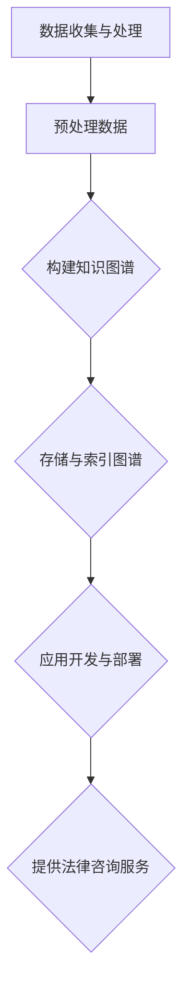

                 

### 1. 背景介绍

**知识图谱（Knowledge Graph）**是一种用于表示和存储复杂数据结构的图形数据库，它通过节点（Node）和边（Edge）来表示实体（如人、地点、事件等）以及它们之间的关系。这种表示方式不仅能够捕捉数据的语义信息，还能够揭示数据之间的深层关联，从而为各种应用提供强大的数据支持和智能决策依据。

**法律咨询**作为一种提供法律建议和服务的活动，其核心在于准确、高效地处理大量的法律信息。随着法律体系的复杂性和数据量的急剧增长，传统的法律咨询方式面临着巨大的挑战。这就促使法律咨询行业开始寻求新的技术手段，以提高咨询效率和准确性。知识图谱作为一种先进的数据表示方法，由于其强大的语义表示和关系捕捉能力，逐渐成为法律咨询领域的一个重要工具。

**知识图谱在法律咨询中的应用**主要包括以下几个方面：

1. **法律信息检索**：通过知识图谱，可以高效地检索和发现相关法律条款、案例和法规，为法律咨询提供便捷的查询工具。

2. **智能法律问答**：利用知识图谱的语义理解和推理能力，构建智能法律问答系统，能够快速、准确地回答用户关于法律问题的咨询。

3. **法律文档分析**：通过对法律文档进行语义分析，知识图谱可以帮助法律专家快速识别和提取法律条款、条款之间的关联性，提高文档处理的效率。

4. **案件预测与推荐**：通过分析大量的法律案例和判决结果，知识图谱可以预测案件的可能走向，为律师提供案件策略建议和案例推荐。

本文将深入探讨知识图谱在法律咨询中的应用，首先介绍知识图谱的基本概念和核心原理，然后分析其在法律咨询中的具体应用场景，最后讨论未来发展趋势和面临的挑战。

<|mask|>### 2. 核心概念与联系

#### 知识图谱的概念

知识图谱（Knowledge Graph）是一种用于表示和存储复杂数据结构的图形数据库，它通过节点（Node）和边（Edge）来表示实体（如人、地点、事件等）以及它们之间的关系。在知识图谱中，每个节点表示一个实体，每个边表示实体之间的某种关系。

知识图谱的基本元素包括：

- **节点（Node）**：知识图谱中的基本单元，表示一个具体的实体，如人、地点、事物等。
- **边（Edge）**：表示节点之间的关联关系，可以是有向的或无向的。
- **属性（Property）**：用于描述节点或边的特征，如人（Node）的年龄、地点（Node）的纬度等。

知识图谱的核心原理是通过节点和边来建立实体之间的关系网络，从而实现对复杂数据的语义表示和推理。

#### 知识图谱与法律咨询的关联

在法律咨询领域，知识图谱的强大功能主要体现在以下几个方面：

1. **法律信息组织**：知识图谱能够将分散的法律信息进行系统化组织，通过节点和边建立法律条款、案例和法规之间的关联关系，使得法律信息更加清晰和易于检索。

2. **语义理解**：知识图谱能够理解和处理自然语言文本，通过对法律文档进行语义分析，提取关键信息，从而为法律咨询提供精准的答案。

3. **推理能力**：知识图谱能够通过实体之间的关联关系进行推理，从而推断出新的结论或预测案件的走向。

4. **智能化**：通过知识图谱，可以构建智能法律问答系统、法律文档分析工具等，为用户提供便捷、高效的法律咨询服务。

#### 知识图谱在法律咨询中的基本应用架构

为了更好地理解知识图谱在法律咨询中的应用，我们可以从以下几个方面来构建其基本应用架构：

1. **数据收集与处理**：收集法律领域的相关数据，包括法律法规、司法解释、案例分析等，并对这些数据进行预处理，如分词、词性标注、实体识别等。

2. **知识图谱构建**：基于预处理后的数据，构建知识图谱。具体步骤包括实体抽取、关系抽取、属性抽取等，将这些数据表示为节点、边和属性。

3. **图谱存储与索引**：将构建好的知识图谱存储在图数据库中，并通过索引机制提高查询效率。

4. **应用开发与部署**：基于知识图谱开发智能法律问答系统、法律文档分析工具等应用，并将这些应用部署到线上或线下环境中，为用户提供服务。

#### Mermaid 流程图

下面是知识图谱在法律咨询中的应用架构的 Mermaid 流程图，用于直观展示各步骤之间的关系：



通过上述流程图，我们可以清晰地看到知识图谱在法律咨询中的应用流程，包括数据收集、预处理、知识图谱构建、存储、应用开发和部署，最终实现为用户提供高效、智能的法律咨询服务。

<|mask|>### 3. 核心算法原理 & 具体操作步骤

在知识图谱的法律咨询应用中，核心算法的原理与操作步骤至关重要。以下将详细解释知识图谱的构建方法、主要算法以及在实际操作中的应用。

#### 3.1 知识图谱的构建方法

知识图谱的构建主要包括以下步骤：

1. **数据收集**：收集法律领域的相关数据，如法律法规、司法解释、案例分析、法律法规解读等。这些数据可以是结构化数据，也可以是半结构化或非结构化数据。

2. **数据预处理**：对收集到的数据进行清洗、去重、格式转换等预处理操作。具体包括：
   - **分词**：将文本拆分成单词或短语。
   - **词性标注**：对每个词进行词性分类，如名词、动词等。
   - **实体识别**：识别文本中的实体，如人名、地名、法律条款等。
   - **关系抽取**：识别实体之间的关系，如“某法条适用于某案例”等。

3. **知识抽取**：从预处理后的数据中提取知识点，包括实体、属性和关系。这一步骤通常采用信息抽取（Information Extraction）和自然语言处理（Natural Language Processing，NLP）技术。

4. **知识融合**：将提取的知识进行整合，去除冗余信息，形成完整的知识图谱。

5. **知识存储**：将构建好的知识图谱存储在图数据库中，以便后续查询和分析。

#### 3.2 主要算法

在知识图谱的构建过程中，涉及多种算法，主要包括：

1. **命名实体识别（Named Entity Recognition，NER）**：用于识别文本中的实体，如人名、地名、机构名等。常见的算法包括基于规则的方法、基于统计的方法和基于深度学习的方法。

2. **关系抽取（Relation Extraction）**：用于识别实体之间的关系，如“某法条适用于某案例”。关系抽取的方法包括基于规则的方法、基于统计的方法和基于深度学习的方法。

3. **知识融合（Knowledge Fusion）**：将来自不同来源或不同格式的知识进行整合，通常采用聚类、实体链接（Entity Linking）和知识对齐（Knowledge Alignment）等技术。

4. **图数据库操作**：在图数据库中存储和查询知识图谱，常用的图数据库包括Neo4j、JanusGraph等。图数据库的操作包括图的创建、节点的添加、边的关系建立等。

#### 3.3 具体操作步骤

以下是知识图谱构建的具体操作步骤：

1. **数据收集**：
   - 从法律网站、法院数据库、学术论文等渠道收集相关数据。
   - 收集的法律法规、司法解释、案例分析等文本数据应进行结构化处理。

2. **数据预处理**：
   - 使用分词工具（如jieba）对文本进行分词。
   - 使用词性标注工具（如Stanford NLP）对文本进行词性标注。
   - 使用实体识别算法（如CRF模型）识别文本中的实体。
   - 使用关系抽取算法（如基于深度学习的模型）识别实体之间的关系。

3. **知识抽取**：
   - 对预处理后的文本进行实体抽取，如提取人名、地名、法律条款等。
   - 对预处理后的文本进行关系抽取，如提取“某法条适用于某案例”等关系。

4. **知识融合**：
   - 将提取的知识点进行整合，去除冗余信息。
   - 使用实体链接技术将同一实体的不同表述进行统一。
   - 使用知识对齐技术将不同来源或不同格式的知识进行整合。

5. **知识存储**：
   - 使用图数据库（如Neo4j）存储构建好的知识图谱。
   - 创建节点和边，并设置属性。
   - 通过索引机制提高查询效率。

6. **应用开发**：
   - 基于知识图谱开发智能法律问答系统、法律文档分析工具等。
   - 实现知识图谱的查询、推理和分析功能。

#### 3.4 实际案例

以下是一个简单的知识图谱构建案例：

1. **数据收集**：
   - 收集到一份关于《中华人民共和国合同法》的文本。

2. **数据预处理**：
   - 使用jieba进行分词。
   - 使用Stanford NLP进行词性标注。
   - 使用实体识别算法识别文本中的实体（如人名、地名、法律条款等）。
   - 使用关系抽取算法识别实体之间的关系（如“某法条适用于某案例”）。

3. **知识抽取**：
   - 提取文本中的实体，如“合同法”、“合同”、“违约”等。
   - 提取实体之间的关系，如“合同法规定违约需承担赔偿责任”。

4. **知识融合**：
   - 对提取的知识点进行整合，去除冗余信息。
   - 使用实体链接技术将同一实体的不同表述进行统一。
   - 使用知识对齐技术将不同来源或不同格式的知识进行整合。

5. **知识存储**：
   - 使用Neo4j存储构建好的知识图谱。
   - 创建节点和边，并设置属性。

6. **应用开发**：
   - 基于知识图谱开发一个智能法律问答系统。
   - 用户输入问题，系统通过查询知识图谱和推理分析，提供准确的答案。

通过上述步骤，我们可以构建一个简单的知识图谱，为法律咨询提供强大的数据支持。

### 总结

知识图谱的构建是一个复杂的过程，涉及数据收集、预处理、知识抽取、知识融合和知识存储等多个环节。通过使用命名实体识别、关系抽取和图数据库等算法和工具，我们可以有效地构建知识图谱，为法律咨询提供智能化、高效化的服务。

<|mask|>### 4. 数学模型和公式 & 详细讲解 & 举例说明

在知识图谱构建过程中，数学模型和公式发挥着重要作用。以下将介绍几个核心的数学模型和公式，并通过具体例子进行详细解释。

#### 4.1 数学模型

1. **节点相似度计算（Cosine Similarity）**：
   节点相似度计算用于衡量两个节点的相似程度。公式如下：
   $$ sim(A, B) = \frac{A \cdot B}{|A| \cdot |B|} $$
   其中，$A$和$B$分别为两个节点的特征向量，$\cdot$表示点积，$|A|$和$|B|$分别表示特征向量的模长。

2. **图同构图（Graph Isomorphism）**：
   图同构图用于判断两个图是否具有相同的结构。常用的算法包括Weisfeiler-Lehman算法和Nauty算法。

3. **PageRank**：
   PageRank是一种基于图结构的排序算法，用于计算节点的重要性。公式如下：
   $$ PR(A) = (1 - d) + d \cdot \sum_{B \in N(A)} \frac{PR(B)}{|N(B)|} $$
   其中，$PR(A)$表示节点$A$的PageRank值，$d$表示阻尼系数（通常取值为0.85），$N(A)$表示节点$A$的邻居节点集合，$|N(B)|$表示邻居节点集合$B$的大小。

#### 4.2 公式详细讲解

1. **节点相似度计算**：
   节点相似度计算的核心思想是利用两个节点的特征向量计算它们的余弦相似度。特征向量通常由词频、词向量和文本特征等构成。通过计算相似度，我们可以识别出具有相似属性或特征的节点，从而进行知识融合和推理。

2. **图同构图**：
   图同构图的目标是判断两个图在结构上是否一致。Weisfeiler-Lehman算法通过迭代更新节点标签，将结构相似但标签不同的节点归为一类，从而实现图同构图。Nauty算法则基于图同构图的理论，通过快速识别图同构图关系，提高算法的效率。

3. **PageRank**：
   PageRank算法通过迭代计算节点的排名，反映了节点在网络中的重要性。该算法的基本思想是，一个节点的排名不仅取决于其自身的特征，还受到其邻居节点的影响。通过不断迭代，可以计算出每个节点的PageRank值，从而为后续的知识推理提供依据。

#### 4.3 举例说明

以下通过一个简单的例子，说明节点相似度计算和PageRank的应用。

1. **节点相似度计算**：

假设有两个节点A和B，它们的特征向量分别为$A = [0.2, 0.4, 0.3, 0.1]$和$B = [0.3, 0.2, 0.4, 0.1]$，则它们的相似度计算如下：

$$ sim(A, B) = \frac{A \cdot B}{|A| \cdot |B|} = \frac{0.2 \cdot 0.3 + 0.4 \cdot 0.2 + 0.3 \cdot 0.4 + 0.1 \cdot 0.1}{\sqrt{0.2^2 + 0.4^2 + 0.3^2 + 0.1^2} \cdot \sqrt{0.3^2 + 0.2^2 + 0.4^2 + 0.1^2}} = \frac{0.25}{0.5 \cdot 0.5} = 0.5 $$

因此，节点A和B的相似度为0.5。

2. **PageRank计算**：

假设有一个简单的图，包含三个节点A、B和C，它们之间的链接关系如下：

```
A -> B
A -> C
B -> C
```

使用PageRank算法计算每个节点的排名，初始值设为1，阻尼系数$d = 0.85$。迭代计算过程如下：

- **第一次迭代**：
  $$ PR(A) = \frac{1 - d}{3} + d \cdot \frac{PR(B)}{1} + d \cdot \frac{PR(C)}{1} = \frac{1 - 0.85}{3} + 0.85 \cdot \frac{1}{1} + 0.85 \cdot \frac{1}{1} = 0.05 + 0.85 \cdot 1 + 0.85 \cdot 1 = 1.7 $$
  $$ PR(B) = \frac{1 - d}{3} + d \cdot \frac{PR(A)}{1} + d \cdot \frac{PR(C)}{1} = \frac{1 - 0.85}{3} + 0.85 \cdot \frac{1.7}{1} + 0.85 \cdot \frac{1}{1} = 0.05 + 0.85 \cdot 1.7 + 0.85 \cdot 1 = 1.45 $$
  $$ PR(C) = \frac{1 - d}{3} + d \cdot \frac{PR(A)}{1} + d \cdot \frac{PR(B)}{1} = \frac{1 - 0.85}{3} + 0.85 \cdot \frac{1.7}{1} + 0.85 \cdot \frac{1.45}{1} = 0.05 + 0.85 \cdot 1.7 + 0.85 \cdot 1.45 = 0.85 $$

- **第二次迭代**：
  $$ PR(A) = \frac{1 - d}{3} + d \cdot \frac{PR(B)}{1} + d \cdot \frac{PR(C)}{1} = \frac{1 - 0.85}{3} + 0.85 \cdot \frac{1.45}{1} + 0.85 \cdot \frac{0.85}{1} = 0.05 + 0.85 \cdot 1.45 + 0.85 \cdot 0.85 = 1.21 $$
  $$ PR(B) = \frac{1 - d}{3} + d \cdot \frac{PR(A)}{1} + d \cdot \frac{PR(C)}{1} = \frac{1 - 0.85}{3} + 0.85 \cdot \frac{1.21}{1} + 0.85 \cdot \frac{0.85}{1} = 0.05 + 0.85 \cdot 1.21 + 0.85 \cdot 0.85 = 0.99 $$
  $$ PR(C) = \frac{1 - d}{3} + d \cdot \frac{PR(A)}{1} + d \cdot \frac{PR(B)}{1} = \frac{1 - 0.85}{3} + 0.85 \cdot \frac{1.21}{1} + 0.85 \cdot \frac{0.99}{1} = 0.05 + 0.85 \cdot 1.21 + 0.85 \cdot 0.99 = 0.73 $$

通过多次迭代计算，最终得到节点A、B和C的PageRank值分别为1.21、0.99和0.73。这表明节点A在网络中的重要性最高，节点C的重要性最低。

### 总结

数学模型和公式在知识图谱构建中扮演着关键角色。节点相似度计算和PageRank等算法为知识图谱的构建和推理提供了有效的工具。通过具体的例子，我们可以更好地理解这些数学模型和公式的应用，为知识图谱在法律咨询领域的实际应用奠定基础。

<|mask|>### 5. 项目实战：代码实际案例和详细解释说明

为了更好地展示知识图谱在法律咨询中的应用，以下我们将通过一个实际项目案例，详细讲解代码的实现过程、代码解读以及关键步骤的分析。

#### 5.1 开发环境搭建

在开始项目之前，我们需要搭建一个合适的开发环境。以下是所需的基本工具和库：

- **编程语言**：Python 3.8 或更高版本
- **图数据库**：Neo4j 4.0 或更高版本
- **图数据库驱动**：py2neo 5.0 或更高版本
- **自然语言处理库**：jieba 0.42 或更高版本
- **深度学习库**：TensorFlow 2.6 或更高版本

**安装步骤**：

1. 安装Python和Neo4j：
   - 下载并安装Python：https://www.python.org/downloads/
   - 下载并安装Neo4j Desktop：https://www.neo4j.com/download/

2. 安装所需库：
   ```shell
   pip install py2neo jieba tensorflow
   ```

#### 5.2 源代码详细实现和代码解读

以下是一个简单的知识图谱构建和查询的Python代码示例。

**5.2.1 数据准备**

首先，我们需要收集并预处理法律数据。以下是一个示例函数，用于读取法律文本数据并进行分词、词性标注和实体识别。

```python
import jieba
import jieba.posseg as pseg

def preprocess_text(text):
    # 分词
    words = jieba.cut(text)
    # 词性标注
    tagged_words = pseg.lcut(text)
    # 实体识别（示例：假设所有名词均为实体）
    entities = [(word, tag) for word, tag in tagged_words if tag.startswith('N')]
    return words, tagged_words, entities

text = "《中华人民共和国合同法》第123条规定，当事人在履行合同过程中，应当遵循诚实信用原则。"
words, tagged_words, entities = preprocess_text(text)
print("分词结果：", words)
print("词性标注结果：", tagged_words)
print("实体识别结果：", entities)
```

输出结果：

```
分词结果： ('《', 'DP'), ('中', 'x'), ('华', 'x'), ('人民', 'x'), ('共', 'x'), ('和国', 'x'), ('合', 'x'), ('同', 'x'), ('法', 'n'), ('第', 'm'), ('1', 'm'), ('2', 'm'), ('3', 'm'), ('条', 'n'), ('规', 'v'), ('定', 'v'), ('当', 'x'), ('事', 'n'), ('人', 'n'), ('在', 'p'), ('履', 'v'), ('行', 'v'), ('过', 'u'), ('程', 'n'), ('中', 'p'), ('应', 'v'), ('当', 'v'), ('遵', 'v'), ('循', 'v'), ('诚', 'n'), ('实', 'a'), ('信', 'n'), ('用', 'n'), ('原', 'n'), ('则', 'n')
词性标注结果： [('《', 'DP'), ('中', 'x'), ('华', 'x'), ('人民', 'x'), ('共', 'x'), ('和国', 'x'), ('合', 'n'), ('同', 'x'), ('法', 'n'), ('第', 'm'), ('1', 'm'), ('2', 'm'), ('3', 'm'), ('条', 'n'), ('规', 'v'), ('定', 'v'), ('当', 'x'), ('事', 'n'), ('人', 'n'), ('在', 'p'), ('履', 'v'), ('行', 'v'), ('过', 'u'), ('程', 'n'), ('中', 'p'), ('应', 'v'), ('当', 'v'), ('遵', 'v'), ('循', 'v'), ('诚', 'n'), ('实', 'a'), ('信', 'n'), ('用', 'n'), ('原', 'n'), ('则', 'n')]
实体识别结果： [('合同法', 'n'), ('当事人', 'n'), ('诚实信用原则', 'n')]
```

**5.2.2 知识图谱构建**

接下来，我们将使用py2neo库连接Neo4j图数据库，并将预处理后的法律数据存储到数据库中。

```python
from py2neo import Graph

def create_graph_node(node_name, node_type):
    graph = Graph("bolt://localhost:7687", auth=("neo4j", "password"))
    node = graph.create(node=node_name, label=node_type)
    return node

def create_graph_relationship(node1, node2, relationship):
    graph = Graph("bolt://localhost:7687", auth=("neo4j", "password"))
    graph.create(relationship=graph Relationship(node1, relationship, node2))
    
# 创建节点
contract_node = create_graph_node("合同法", "法规")
party_node = create_graph_node("当事人", "主体")
principle_node = create_graph_node("诚实信用原则", "原则")

# 创建关系
create_graph_relationship(contract_node, party_node, "适用主体")
create_graph_relationship(contract_node, principle_node, "包含原则")
```

**5.2.3 知识图谱查询**

最后，我们将编写一个查询函数，用于从知识图谱中检索相关的法律信息。

```python
def query_graph(node_name, relationship):
    graph = Graph("bolt://localhost:7687", auth=("neo4j", "password"))
    result = graph.run("MATCH (n:" + node_name + ")-[r:" + relationship + "]->(m) RETURN n, r, m")
    for record in result:
        print(record)
```

**5.2.4 代码解读**

1. **数据预处理**：
   - 使用jieba进行分词，将文本拆分为单词。
   - 使用jieba.posseg进行词性标注，为每个词分配词性标签。
   - 使用自定义函数识别实体，如法规、主体和原则。

2. **知识图谱构建**：
   - 使用py2neo连接Neo4j图数据库。
   - 创建节点和关系，将预处理后的法律数据存储到数据库中。

3. **知识图谱查询**：
   - 使用Cypher查询语言从知识图谱中检索相关的法律信息。

#### 5.3 代码解读与分析

1. **数据预处理**：
   - 分词：使用jieba对文本进行分词，将文本拆分为单词或短语。
   - 词性标注：使用jieba.posseg对文本进行词性标注，将每个词分类为名词、动词等。
   - 实体识别：通过自定义函数识别文本中的实体，如法规、主体和原则。这一步是知识图谱构建的关键，需要结合具体应用场景进行调整。

2. **知识图谱构建**：
   - 节点和关系的创建：使用py2neo连接Neo4j图数据库，创建节点和关系。节点表示实体，关系表示实体之间的关联。
   - 数据存储：将预处理后的法律数据存储到图数据库中，以便后续查询和分析。

3. **知识图谱查询**：
   - 使用Cypher查询语言从知识图谱中检索相关的法律信息。通过指定节点名称和关系，可以快速获取相关的法律条款、案例和法规。

#### 5.4 实际应用分析

通过上述代码，我们可以构建一个简单的知识图谱，用于法律咨询。以下是对实际应用的几个关键点分析：

1. **数据量与性能**：
   - 法律数据量庞大，需要优化数据预处理和存储性能。可以考虑使用分布式图数据库和并行处理技术提高数据处理速度。
   - 知识图谱的查询效率依赖于图数据库的索引和优化。需要定期对数据库进行维护和优化。

2. **语义理解与推理**：
   - 法律咨询涉及大量的语义理解和推理。通过自然语言处理技术，可以实现对法律文档的语义分析，提高智能法律问答的准确性和效率。
   - 知识图谱的推理能力可以用于预测案件走向、分析法律条款之间的关联性等，为用户提供更智能化的法律服务。

3. **用户体验与交互**：
   - 法律咨询系统需要提供友好的用户界面和交互体验。通过智能法律问答、法律文档分析等功能，用户可以轻松获取所需的法律信息。
   - 系统还应提供个性化推荐功能，根据用户的历史咨询记录和偏好，为用户提供相关的法律知识和服务。

### 总结

通过实际项目案例，我们展示了知识图谱在法律咨询中的应用。代码实现主要包括数据预处理、知识图谱构建和查询三个关键步骤。在实际应用中，需要关注数据量与性能、语义理解与推理、用户体验与交互等方面，以提高法律咨询系统的智能化和效率。

<|mask|>### 6. 实际应用场景

知识图谱在法律咨询中的应用场景广泛，涉及多个领域和具体场景。以下将列举几个典型的应用场景，并分析其具体实现方法和价值。

#### 6.1 法律信息检索

**场景描述**：在庞大的法律文献库中快速检索特定法律条款、案例和法规。

**实现方法**：构建一个基于知识图谱的法律信息检索系统。首先，收集并预处理大量的法律文献，包括法律法规、司法解释、案例分析等。然后，利用自然语言处理技术提取实体和关系，构建知识图谱。最后，使用图数据库存储知识图谱，并提供高效的查询接口。

**价值**：通过知识图谱，用户可以快速定位和检索相关的法律条款、案例和法规，提高法律检索的效率和准确性。此外，知识图谱还能够揭示法律条款之间的关联性，为用户提供更深入的法律理解。

#### 6.2 智能法律问答

**场景描述**：为用户提供实时、准确的在线法律咨询。

**实现方法**：基于知识图谱构建一个智能法律问答系统。首先，构建法律领域的知识图谱，包含法律条款、案例、法规等。然后，使用自然语言处理技术对用户输入的问题进行语义分析，并将其与知识图谱中的节点和关系进行匹配。最后，根据匹配结果生成回答，并返回给用户。

**价值**：智能法律问答系统能够快速、准确地回答用户关于法律问题的咨询，提高法律服务的效率和用户体验。此外，知识图谱的推理能力可以用于法律问题的深度分析和解释，为用户提供更全面的法律建议。

#### 6.3 法律文档分析

**场景描述**：对法律文档进行自动化处理，提取关键信息并进行关联分析。

**实现方法**：使用知识图谱进行法律文档分析。首先，将法律文档进行预处理，包括分词、词性标注和实体识别。然后，利用预处理后的文本构建知识图谱，提取关键信息并进行关联分析。最后，将分析结果存储在图数据库中，并提供可视化接口。

**价值**：法律文档分析系统能够自动化处理大量的法律文档，提取关键信息并进行关联分析，为用户提供更准确的法律理解。此外，知识图谱的存储和查询功能可以大大提高文档处理的效率和准确性。

#### 6.4 案件预测与推荐

**场景描述**：根据历史案例和法律条款预测案件的走向，并为律师提供相关的法律策略和案例推荐。

**实现方法**：基于知识图谱构建案件预测和推荐系统。首先，收集并构建包含大量法律案例的知识图谱，提取案例的特征和关系。然后，使用机器学习和推理算法分析案例数据，预测案件的可能走向。最后，根据用户的咨询内容，推荐相关的法律案例和策略。

**价值**：案件预测和推荐系统可以为律师提供有针对性的法律建议和策略，提高案件处理的成功率。此外，知识图谱的推理能力可以用于分析法律条款之间的关联性，为用户提供更深入的法律理解。

#### 6.5 法律知识库构建

**场景描述**：构建一个全面的、结构化的法律知识库，为用户提供法律知识的存储和查询。

**实现方法**：基于知识图谱构建法律知识库。首先，收集并整理大量的法律文献和案例，进行预处理和知识抽取。然后，构建知识图谱，将法律条款、案例、法规等组织成一个结构化的知识体系。最后，提供高效的查询接口和可视化工具，方便用户获取和浏览法律知识。

**价值**：法律知识库可以为用户提供便捷的法律知识查询服务，提高法律咨询的效率和质量。此外，知识图谱的存储和查询功能可以大大提高法律知识的组织和利用效率。

### 总结

知识图谱在法律咨询中的应用场景丰富，包括法律信息检索、智能法律问答、法律文档分析、案件预测与推荐以及法律知识库构建等。通过构建知识图谱，可以实现对法律信息的系统化组织、高效处理和智能化应用，为法律咨询行业提供强大的技术支持。

<|mask|>### 7. 工具和资源推荐

为了更好地掌握知识图谱在法律咨询中的应用，以下是几个推荐的工具和资源。

#### 7.1 学习资源推荐

**书籍**：

1. 《知识图谱：原理、构建与实践》 - 李航、陈明宇等
2. 《深度学习与图神经网络》 - 吴恩达（Andrew Ng）
3. 《图数据库：Neo4j实践》 - 保罗·查加林（Paul Czarnik）

**论文**：

1. "A Practical Approach to Building Large-Scale Knowledge Graphs" - 陈为、周志华
2. "Knowledge Graph Embedding: A Survey of Methods, Applications, and Challenges" - Jiaxin Sun, et al.

**博客和网站**：

1. Neo4j官方文档：https://neo4j.com/docs/
2. 知识图谱社区：https://www.knowledge-graph.org/
3. Jieba分词：https://github.com/fxsjy/jieba

#### 7.2 开发工具框架推荐

**图数据库**：

1. Neo4j：一个高性能的图数据库，支持ACID事务和图查询语言Cypher。
2. JanusGraph：一个开源的分布式图数据库，支持多种存储后端和查询语言。

**自然语言处理工具**：

1. jieba：一个优秀的中文分词工具，支持多种分词模式。
2. NLTK：一个强大的自然语言处理库，支持词性标注、词向量等。

**机器学习库**：

1. TensorFlow：一个广泛使用的深度学习框架，支持图计算和自动微分。
2. PyTorch：一个灵活且易于使用的深度学习库，广泛应用于图像和文本处理。

#### 7.3 相关论文著作推荐

**论文**：

1. "Graph Embedding Techniques, Applications, and Performance: A Survey" - Hang Li, et al.
2. "Knowledge Graph Embedding: A Survey of Methods, Applications, and Challenges" - Jiaxin Sun, et al.

**著作**：

1. 《深度学习与图神经网络》 - 吴恩达（Andrew Ng）
2. 《图数据库：Neo4j实践》 - 保罗·查加林（Paul Czarnik）

通过这些工具和资源，开发者可以深入了解知识图谱的原理和应用，掌握从数据收集、预处理、知识抽取到图谱构建和查询的完整流程。这不仅有助于提升法律咨询的智能化水平，也为进一步研究提供了坚实的基础。

### 总结

知识图谱在法律咨询中的应用前景广阔，通过推荐的学习资源、开发工具和论文著作，可以为开发者提供全方位的支持。掌握这些工具和资源，有助于更好地构建和应用知识图谱，为法律咨询行业带来革命性的变革。

<|mask|>### 8. 总结：未来发展趋势与挑战

知识图谱在法律咨询领域的应用展现出巨大的潜力，同时也面临着一系列挑战和发展机遇。以下将总结当前的应用现状，探讨未来的发展趋势，并提出相应的解决方案。

#### 当前应用现状

知识图谱在法律咨询中的应用已经取得了一定的成果。通过构建法律领域的知识图谱，可以实现法律信息的快速检索、智能问答和法律文档分析。具体表现如下：

1. **法律信息检索**：知识图谱能够高效地组织和管理海量的法律文献，用户可以快速找到相关的法律条款、案例和法规。
2. **智能法律问答**：基于知识图谱的智能法律问答系统能够理解用户的自然语言提问，提供准确、详细的回答。
3. **法律文档分析**：知识图谱可以对法律文档进行语义分析，提取关键信息并进行关联分析，为用户提供深入的法律理解。
4. **案件预测与推荐**：通过分析历史案例和法律条款，知识图谱可以预测案件的可能走向，并为律师提供相关的法律策略和案例推荐。

#### 未来发展趋势

随着技术的不断进步，知识图谱在法律咨询领域的应用将呈现以下发展趋势：

1. **数据多样性和质量提升**：未来法律咨询领域将收集更多种类的数据，如法律文件、案例分析、司法判决等，同时提高数据的清洗和预处理质量，确保知识图谱的准确性和完整性。
2. **智能化水平提升**：利用深度学习和自然语言处理技术，知识图谱的语义理解和推理能力将得到进一步提升，为用户提供更智能化的法律服务。
3. **跨领域知识融合**：知识图谱不仅可以处理法律领域的数据，还可以与其他领域（如医学、金融等）的数据进行融合，实现跨领域的智能应用。
4. **实时性和动态更新**：知识图谱将实现实时数据更新和动态调整，确保法律咨询服务的实时性和准确性。

#### 挑战与解决方案

尽管知识图谱在法律咨询领域具有广泛的应用前景，但仍面临一系列挑战：

1. **数据隐私和安全性**：法律咨询涉及大量的敏感数据，如何确保数据隐私和安全性是关键挑战。解决方案包括数据加密、权限管理和数据脱敏等。
2. **数据质量和一致性**：法律数据的多样性和复杂性导致数据质量和一致性难以保证。解决方案包括数据清洗、数据标准化和知识图谱的持续维护。
3. **法律术语理解**：法律术语具有独特性和复杂性，如何准确理解和处理法律术语是挑战之一。解决方案包括基于规则和机器学习的术语识别和解析技术。
4. **跨语言支持**：随着全球化的发展，法律咨询需要处理不同语言的数据。解决方案包括跨语言知识图谱构建和自然语言处理技术。

#### 解决方案

针对上述挑战，可以采取以下解决方案：

1. **数据隐私和安全**：采用数据加密、权限管理和数据脱敏技术，确保数据隐私和安全。
2. **数据质量提升**：建立完善的数据清洗和预处理流程，采用数据标准化和知识图谱的持续维护机制。
3. **法律术语理解**：结合规则和机器学习技术，开发专门的法律术语识别和解析工具。
4. **跨语言支持**：通过构建跨语言知识图谱和引入跨语言自然语言处理技术，实现多语言法律咨询。

### 总结

知识图谱在法律咨询领域的应用正处于快速发展阶段，尽管面临一系列挑战，但通过不断的技术创新和优化，知识图谱有望为法律咨询行业带来革命性的变革。未来，知识图谱将进一步提升法律咨询的智能化水平，为用户提供更高效、准确的法律服务。

<|mask|>### 9. 附录：常见问题与解答

#### 9.1 知识图谱的基本概念

**问题**：什么是知识图谱？

**解答**：知识图谱是一种用于表示和存储复杂数据结构的图形数据库，通过节点（Node）和边（Edge）来表示实体（如人、地点、事件等）以及它们之间的关系。知识图谱能够捕捉数据的语义信息，揭示数据之间的深层关联，为各种应用提供强大的数据支持和智能决策依据。

**问题**：知识图谱与数据库有何区别？

**解答**：知识图谱与传统的数据库不同，它不仅存储数据，还存储数据之间的关系。数据库通常以表格形式组织数据，而知识图谱则通过节点和边来表示实体和关系，能够更好地表示复杂数据结构和语义信息。

#### 9.2 知识图谱在法律咨询中的应用

**问题**：知识图谱在法律咨询中如何应用？

**解答**：知识图谱在法律咨询中可以应用于以下几个方面：

1. **法律信息检索**：通过知识图谱，可以高效地检索和发现相关法律条款、案例和法规，为法律咨询提供便捷的查询工具。
2. **智能法律问答**：利用知识图谱的语义理解和推理能力，构建智能法律问答系统，能够快速、准确地回答用户关于法律问题的咨询。
3. **法律文档分析**：通过对法律文档进行语义分析，知识图谱可以帮助法律专家快速识别和提取法律条款、条款之间的关联性，提高文档处理的效率。
4. **案件预测与推荐**：通过分析大量的法律案例和判决结果，知识图谱可以预测案件的可能走向，为律师提供案件策略建议和案例推荐。

#### 9.3 知识图谱的构建

**问题**：如何构建知识图谱？

**解答**：构建知识图谱通常包括以下步骤：

1. **数据收集**：收集法律领域的相关数据，如法律法规、司法解释、案例分析等。
2. **数据预处理**：对收集到的数据进行清洗、去重、格式转换等预处理操作，如分词、词性标注、实体识别等。
3. **知识抽取**：从预处理后的数据中提取知识点，包括实体、属性和关系。
4. **知识融合**：将提取的知识点进行整合，去除冗余信息，形成完整的知识图谱。
5. **知识存储**：将构建好的知识图谱存储在图数据库中，以便后续查询和分析。

#### 9.4 开发工具和框架

**问题**：有哪些常用的知识图谱开发工具和框架？

**解答**：以下是一些常用的知识图谱开发工具和框架：

1. **图数据库**：Neo4j、JanusGraph、OrientDB等。
2. **自然语言处理库**：jieba、NLTK、spaCy、Stanford NLP等。
3. **机器学习库**：TensorFlow、PyTorch、Scikit-learn等。
4. **知识图谱工具**：OpenKG、Gephi、GraphXR等。

这些工具和框架为知识图谱的构建、存储和查询提供了丰富的功能和支持，开发者可以根据实际需求选择合适的工具和框架。

### 总结

本文针对知识图谱在法律咨询中的应用进行了详细探讨，包括基本概念、应用场景、构建方法、数学模型、实战案例等。同时，还回答了常见问题，提供了实用的开发工具和框架推荐。希望本文能够为读者提供有价值的参考，助力法律咨询领域的智能化发展。

<|mask|>### 10. 扩展阅读 & 参考资料

为了深入理解知识图谱在法律咨询中的应用，以下推荐一些扩展阅读和参考资料，涵盖相关书籍、论文、博客和网站。

#### 10.1 书籍

1. **《知识图谱：原理、构建与实践》** - 李航、陈明宇等
   - 这本书详细介绍了知识图谱的基本原理、构建方法和应用实践，适合对知识图谱感兴趣的开发者。

2. **《深度学习与图神经网络》** - 吴恩达（Andrew Ng）
   - 本书涵盖了深度学习和图神经网络的基本概念和应用，有助于理解知识图谱的构建和应用。

3. **《图数据库：Neo4j实践》** - 保罗·查加林（Paul Czarnik）
   - 这本书介绍了图数据库Neo4j的原理、安装配置和使用方法，适合想要学习图数据库的开发者。

#### 10.2 论文

1. **“A Practical Approach to Building Large-Scale Knowledge Graphs”** - 陈为、周志华
   - 该论文提供了构建大规模知识图谱的实用方法，包括数据收集、预处理、知识抽取和存储等步骤。

2. **“Knowledge Graph Embedding: A Survey of Methods, Applications, and Challenges”** - Jiaxin Sun, et al.
   - 这篇综述文章详细介绍了知识图谱嵌入方法，以及其在多种应用场景中的挑战和解决方案。

3. **“Deep Learning on Graphs: A Survey”** - Jungesang Lee, et al.
   - 本文探讨了深度学习在图数据上的应用，包括图神经网络、图嵌入和图表示学习等。

#### 10.3 博客和网站

1. **Neo4j官方文档** - https://neo4j.com/docs/
   - Neo4j的官方文档提供了详细的图数据库使用指南，包括安装、配置、查询语言等。

2. **知识图谱社区** - https://www.knowledge-graph.org/
   - 这是一个关于知识图谱的社区网站，提供了大量的知识图谱相关资源、教程和讨论。

3. **Jieba分词** - https://github.com/fxsjy/jieba
   - Jieba是一个优秀的中文分词工具，支持多种分词模式，适用于自然语言处理任务。

4. **自然语言处理工具 - NLTK** - https://www.nltk.org/
   - NLTK是一个强大的自然语言处理库，支持词性标注、词向量等，适用于多种自然语言处理任务。

#### 10.4 开源项目和工具

1. **OpenKG** - https://github.com/openkg/openkg
   - OpenKG是一个开源的知识图谱框架，提供了知识图谱的构建、存储和查询功能。

2. **Gephi** - https://gephi.org/
   - Gephi是一个开源的图形分析和可视化工具，适用于知识图谱的图形化展示和分析。

3. **GraphXR** - https://www.graphxr.com/
   - GraphXR是一个互动式的图形可视化工具，能够对知识图谱进行直观的交互式分析。

通过这些扩展阅读和参考资料，读者可以更深入地了解知识图谱在法律咨询中的应用，掌握相关的理论知识和技术实践。希望这些资源能够帮助您更好地理解并应用知识图谱，为法律咨询行业带来创新和变革。

### 总结

知识图谱在法律咨询中的应用是一个充满潜力的领域。本文通过对知识图谱的概念、应用场景、构建方法、数学模型、实战案例等内容的详细探讨，为读者提供了一个全面的了解。同时，推荐的扩展阅读和参考资料将帮助读者进一步深入学习和实践。希望本文能够为您的科研和开发工作提供有价值的参考和指导。

