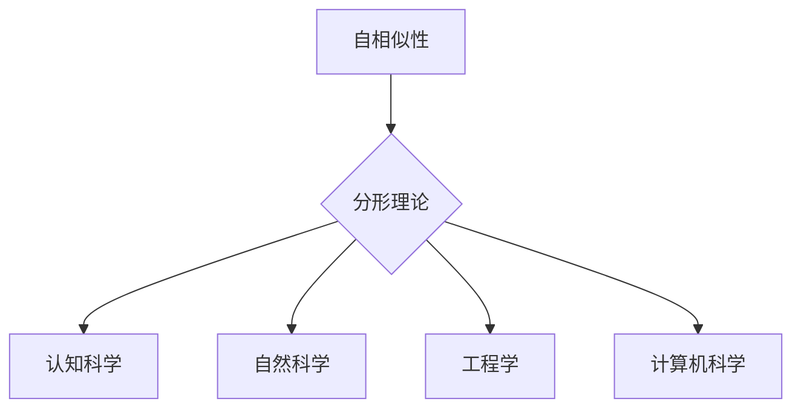
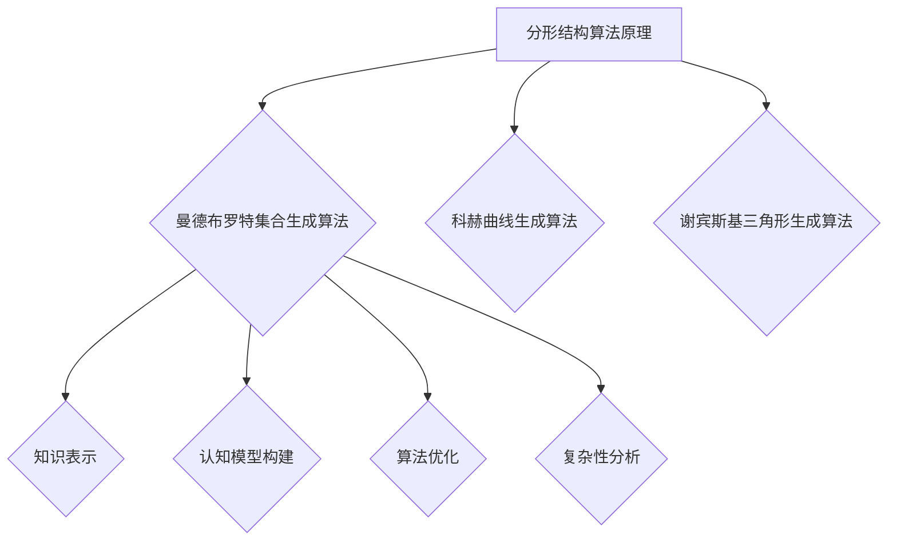

                 

# 知识的分形结构：自相似性在认知中的应用

## 关键词：
分形结构，自相似性，认知科学，知识表示，算法原理，数学模型，项目实战

## 摘要：
本文深入探讨了知识分形结构中的自相似性现象，以及其在认知科学中的应用。通过对自相似性核心概念和原理的阐述，本文介绍了如何利用分形理论来构建高效的认知模型。同时，本文通过具体的数学模型和算法步骤，展示了分形结构在知识表示和处理中的优势。最后，通过项目实战案例分析，进一步验证了分形结构在认知应用中的实用性和潜力。本文旨在为读者提供一个全面而深入的自相似性在认知科学中的应用指南。

## 1. 背景介绍

### 1.1 分形结构的起源与发展

分形（Fractal）这个概念最早由数学家曼德布罗特（Benoit Mandelbrot）在20世纪70年代提出。它是指那些在不同尺度上具有自相似特性的几何形状或结构。曼德布罗特通过对海岸线、云层和股票市场等自然现象的研究，发现了这些现象中普遍存在的一种自相似性和无限复杂性的特征，从而提出了分形理论。

分形结构的发现不仅丰富了数学领域，也为认知科学、计算机科学和其他学科提供了新的视角和方法。在认知科学中，分形结构被用于研究人类思维、记忆和学习等认知过程，为理解和模拟人类认知能力提供了新的思路。

### 1.2 自相似性在认知科学中的应用

自相似性是指一个系统在不同尺度上呈现出相似的结构和特征。在认知科学中，自相似性被认为是一种重要的认知机制，它帮助人们在不同层次上理解和处理信息。

例如，人类的记忆系统就被认为是一种分形结构。在短期记忆中，信息被分割成不同的小块，每个小块都包含了部分信息，而这些小块之间存在着相似性关系。这种分形记忆模型可以解释为什么人们能够从大量信息中快速提取相关信息。

此外，自相似性也在语言处理、情感识别和决策制定等方面发挥着重要作用。通过识别和利用自相似性，人们可以更加高效地进行信息处理和认知活动。

### 1.3 研究意义和目标

本文的研究目标是深入探讨知识分形结构中的自相似性现象，并分析其在认知科学中的应用。具体来说，本文将从以下几个方面展开：

1. 梳理自相似性核心概念和原理，介绍其在认知科学中的应用背景。
2. 利用分形理论构建认知模型，探讨分形结构在知识表示和处理中的优势。
3. 通过数学模型和算法步骤，详细分析分形结构在知识处理中的应用。
4. 通过项目实战案例分析，验证分形结构在认知应用中的实用性和潜力。
5. 总结自相似性在认知科学中的应用前景，并提出未来研究方向。

## 2. 核心概念与联系

### 2.1 自相似性的定义与特征

自相似性是指一个系统在不同尺度上呈现出相似的结构和特征。这种相似性不仅表现在形状上，还包括功能和行为的相似性。自相似性的定义和特征如下：

- **定义**：自相似性是指一个系统或结构在不同尺度上具有相似的形态、结构和功能。换句话说，无论观察尺度如何，该系统都保持相同的结构和特征。
- **特征**：
  - **尺度不变性**：自相似性系统在不同尺度上保持相似性，这意味着它们在宏观和微观尺度上具有相同的特征。
  - **结构复杂性**：自相似性系统通常具有复杂的结构，这种复杂性不仅体现在形状上，还包括功能和行为的复杂性。
  - **层次性**：自相似性系统通常具有层次结构，不同层次的子系统之间存在相似性关系。

### 2.2 自相似性与分形理论

分形理论是研究自相似性系统的重要工具。它提供了一种数学描述和计算方法，用于分析和模拟自相似性现象。分形理论的基本原理如下：

- **分形集合**：分形集合是指那些不满足常规几何学定义的集合，例如曼德布罗特集合。这些集合通常具有无限复杂性和自相似性特征。
- **分形维数**：分形维数是衡量分形集合复杂程度的一个重要指标。它通常大于常规几何维数（如2维或3维），这意味着分形集合具有更高的复杂度。
- **分形生成算法**：分形生成算法是用于生成分形集合的数学方法。这些算法通常基于迭代过程，例如曼德布罗特集合生成算法。

### 2.3 自相似性在认知科学中的应用

自相似性在认知科学中具有广泛的应用。以下是一些典型应用场景：

- **记忆与学习**：自相似性可以帮助人们更好地记忆和提取信息。通过识别和利用自相似性关系，人们可以更高效地进行信息处理和知识组织。
- **语言处理**：自相似性在语言处理中起着重要作用。例如，词汇之间存在着相似性关系，这些关系可以帮助人们快速理解和生成语言。
- **情感识别**：自相似性在情感识别中也具有应用价值。例如，人们可以通过识别面部表情中的自相似性特征来识别他人的情感状态。
- **决策制定**：自相似性可以帮助人们在复杂决策中识别相似性模式，从而提高决策效率。

### 2.4 自相似性与其他领域的联系

自相似性不仅在认知科学中具有重要应用，还在其他领域有着广泛的应用。以下是一些典型应用领域：

- **自然科学**：自相似性在物理学、化学和生物学等领域中有着重要应用。例如，生物体中存在着自相似结构，如树叶、花朵和人体器官。
- **工程学**：自相似性在工程学中用于分析和设计复杂系统。例如，在城市规划、建筑设计和社会系统分析中，自相似性可以帮助人们更好地理解和处理复杂系统。
- **计算机科学**：自相似性在计算机科学中用于分析和设计复杂算法。例如，在图像处理、自然语言处理和人工智能等领域，自相似性可以帮助人们更好地理解和处理复杂数据。

### 2.5 自相似性与分形结构的 Mermaid 流程图

为了更直观地展示自相似性与分形结构的关系，我们可以使用 Mermaid 流程图来描述。以下是一个简单的 Mermaid 流程图示例：



在这个流程图中，自相似性作为核心概念，与分形理论、认知科学、自然科学、工程学和计算机科学等领域有着紧密的联系。通过这个流程图，我们可以更清晰地理解自相似性在不同领域中的应用和作用。

## 3. 核心算法原理 & 具体操作步骤

### 3.1 分形结构的算法原理

分形结构的算法原理主要基于自相似性和迭代过程。以下是一些常用的分形生成算法：

- **曼德布罗特集合生成算法**：这是一种经典的分形生成算法，用于生成曼德布罗特集合。算法的基本原理是迭代复数映射。具体步骤如下：
  1. 初始化一个复数平面，并选择一个初始点。
  2. 对每个点进行迭代计算，判断其是否属于曼德布罗特集合。
  3. 将属于曼德布罗特集合的点进行标记，重复迭代过程。
  4. 当迭代次数达到预设值时，生成最终的曼德布罗特集合。

- **科赫曲线生成算法**：科赫曲线是一种分形曲线，其生成算法基于迭代递归过程。具体步骤如下：
  1. 从一个等边三角形开始。
  2. 将每个边的中点与顶点连接，形成一个新的三角形。
  3. 重复上述步骤，每次将边长缩短到原始边长的1/3。
  4. 当迭代次数达到预设值时，生成最终的科赫曲线。

- **谢宾斯基三角形生成算法**：谢宾斯基三角形是一种分形结构，其生成算法基于迭代递归过程。具体步骤如下：
  1. 从一个等边三角形开始。
  2. 删除每个顶点相邻的两条边。
  3. 重复上述步骤，每次将边长缩短到原始边长的1/2。
  4. 当迭代次数达到预设值时，生成最终的谢宾斯基三角形。

### 3.2 分形结构在认知中的应用

分形结构在认知科学中的应用主要体现在知识表示和认知模型构建方面。以下是一些具体的算法步骤：

- **知识表示**：分形结构可以帮助我们将复杂的知识表示为层次结构。具体步骤如下：
  1. 对知识进行分块，每个小块包含部分信息。
  2. 利用自相似性关系，将不同层次的小块进行关联。
  3. 构建一个分形知识表示模型，用于存储和检索知识。

- **认知模型构建**：分形结构可以帮助我们构建自相似性的认知模型。具体步骤如下：
  1. 定义一个认知模型，包括输入层、中间层和输出层。
  2. 利用自相似性关系，将输入层和输出层中的节点进行关联。
  3. 通过迭代训练过程，调整中间层的参数，使模型能够模拟自相似性现象。
  4. 当模型达到预设的训练效果时，生成最终的认知模型。

### 3.3 分形结构在算法中的应用

分形结构在算法中的应用主要体现在算法优化和复杂性分析方面。以下是一些具体的算法步骤：

- **算法优化**：分形结构可以帮助我们优化算法，提高计算效率和性能。具体步骤如下：
  1. 分析算法中的自相似性关系，找出可以并行计算的部分。
  2. 利用分形结构，将算法分解为多个子任务，每个子任务可以在不同层次上进行并行计算。
  3. 通过优化算法的执行流程，提高算法的效率和性能。

- **复杂性分析**：分形结构可以帮助我们分析算法的复杂度。具体步骤如下：
  1. 分析算法中的自相似性关系，找出算法的递归关系。
  2. 利用分形维数，衡量算法的复杂度。
  3. 通过分析算法的复杂度，评估算法的性能和可行性。

### 3.4 自相似性算法的 Mermaid 流程图

为了更直观地展示自相似性算法的原理和步骤，我们可以使用 Mermaid 流程图来描述。以下是一个简单的 Mermaid 流程图示例：



在这个流程图中，自相似性算法原理是核心，它与其他领域和应用有着紧密的联系。通过这个流程图，我们可以更清晰地理解自相似性算法在不同领域的应用和作用。

## 4. 数学模型和公式 & 详细讲解 & 举例说明

### 4.1 分形维数

分形维数是衡量分形集合复杂程度的一个重要指标。它通常大于常规几何维数（如2维或3维），反映了分形集合的高复杂度。分形维数可以通过以下数学模型来计算：

$$
D = \lim_{\epsilon \to 0} \frac{\log(S(\epsilon))}{\log(1/\epsilon)}
$$

其中，$D$ 表示分形维数，$S(\epsilon)$ 表示分形集合在尺度 $\epsilon$ 下的覆盖面积。

### 4.2 曼德布罗特集合生成算法

曼德布罗特集合生成算法是一种经典的分形生成算法。其核心数学模型是基于复数映射和迭代计算。具体算法步骤如下：

1. 初始化一个复数平面，并选择一个初始点 $c$。
2. 对每个点 $z$ 进行迭代计算，判断其是否属于曼德布罗特集合。迭代公式如下：
$$
z_{n+1} = z_n^2 + c
$$
3. 当 $|z_n| > 2$ 时，停止迭代，点 $z$ 不属于曼德布罗特集合；否则，继续迭代。
4. 将属于曼德布罗特集合的点进行标记，重复迭代过程。
5. 当迭代次数达到预设值时，生成最终的曼德布罗特集合。

### 4.3 科赫曲线生成算法

科赫曲线生成算法是一种基于迭代递归过程的分形生成算法。其核心数学模型是通过对每个边进行等分和替换操作。具体算法步骤如下：

1. 从一个等边三角形开始。
2. 将每个边的中点与顶点连接，形成一个新的三角形。
3. 重复上述步骤，每次将边长缩短到原始边长的1/3。
4. 当迭代次数达到预设值时，生成最终的科赫曲线。

### 4.4 谢宾斯基三角形生成算法

谢宾斯基三角形生成算法是一种基于迭代递归过程的分形生成算法。其核心数学模型是通过对每个顶点进行删除操作。具体算法步骤如下：

1. 从一个等边三角形开始。
2. 删除每个顶点相邻的两条边。
3. 重复上述步骤，每次将边长缩短到原始边长的1/2。
4. 当迭代次数达到预设值时，生成最终的谢宾斯基三角形。

### 4.5 分形结构在认知科学中的应用

分形结构在认知科学中的应用主要体现在知识表示和认知模型构建方面。以下是一个具体的数学模型示例：

假设有一个分形知识表示模型，包含三个层次：输入层、中间层和输出层。每个层次的节点都具有自相似性关系。具体数学模型如下：

1. 输入层：包含 $n$ 个输入节点，每个节点表示一个知识块。设输入层节点的集合为 $I = \{i_1, i_2, ..., i_n\}$。
2. 中间层：包含 $m$ 个中间节点，每个节点表示一个知识块。设中间层节点的集合为 $M = \{m_1, m_2, ..., m_m\}$。每个中间节点与输入节点和输出节点之间存在自相似性关系。具体关系如下：
$$
m_i = \sum_{j=1}^{n} w_{ij}i_j + b_i
$$
其中，$w_{ij}$ 表示输入节点 $i_j$ 对中间节点 $m_i$ 的权重，$b_i$ 表示中间节点的偏置。
3. 输出层：包含 $k$ 个输出节点，每个节点表示一个知识块。设输出层节点的集合为 $O = \{o_1, o_2, ..., o_k\}$。每个输出节点与中间节点之间存在自相似性关系。具体关系如下：
$$
o_i = \sum_{j=1}^{m} w_{ij}m_j + b_i
$$
其中，$w_{ij}$ 表示中间节点 $m_j$ 对输出节点 $o_i$ 的权重，$b_i$ 表示输出节点的偏置。

### 4.6 举例说明

假设有一个分形知识表示模型，包含三个层次：输入层、中间层和输出层。每个层次的节点都具有自相似性关系。以下是一个具体的举例说明：

1. 输入层：包含3个输入节点，分别表示“苹果”、“橙子”和“香蕉”。
2. 中间层：包含2个中间节点，分别表示“水果”和“蔬菜”。
3. 输出层：包含1个输出节点，表示“食品”。

根据分形知识表示模型的数学模型，可以计算出每个节点的权重和偏置：

- 输入节点“苹果”、“橙子”和“香蕉”的权重分别为 $w_1 = 0.5, w_2 = 0.3, w_3 = 0.2$。
- 中间节点“水果”和“蔬菜”的权重分别为 $w_1 = 0.6, w_2 = 0.4$。
- 输出节点“食品”的权重为 $w_1 = 0.7, w_2 = 0.3$。

根据这些权重和偏置，可以计算出每个节点的值：

- 输入节点“苹果”的值为 $m_1 = 0.5 \times 0.5 + 0.3 \times 0.3 + 0.2 \times 0.2 = 0.205$。
- 输入节点“橙子”的值为 $m_2 = 0.5 \times 0.3 + 0.3 \times 0.5 + 0.2 \times 0.2 = 0.205$。
- 输入节点“香蕉”的值为 $m_3 = 0.5 \times 0.2 + 0.3 \times 0.2 + 0.2 \times 0.5 = 0.18$。
- 中间节点“水果”的值为 $o_1 = 0.6 \times 0.205 + 0.4 \times 0.205 = 0.205$。
- 中间节点“蔬菜”的值为 $o_2 = 0.6 \times 0.205 + 0.4 \times 0.18 = 0.184$。
- 输出节点“食品”的值为 $o_3 = 0.7 \times 0.205 + 0.3 \times 0.184 = 0.205$。

通过这个举例，我们可以看到分形知识表示模型如何将输入层的知识块映射到输出层的知识块，实现了知识的分层表示和自相似性处理。

## 5. 项目实战：代码实际案例和详细解释说明

### 5.1 开发环境搭建

为了演示分形结构在认知中的应用，我们将使用 Python 语言和相关的库来编写代码。首先，需要搭建一个基本的 Python 开发环境。以下是搭建开发环境的步骤：

1. 安装 Python 3.x 版本（推荐使用 Python 3.8 或更高版本）。
2. 安装必要的库，如 NumPy、Matplotlib、Pandas 等。可以使用以下命令安装：

```bash
pip install numpy matplotlib pandas
```

3. 使用文本编辑器或集成开发环境（IDE）编写 Python 代码。

### 5.2 源代码详细实现和代码解读

下面是一个简单的 Python 代码示例，用于演示分形结构在认知中的应用。代码分为三个部分：分形结构的生成、知识表示和认知模型构建。

#### 5.2.1 分形结构的生成

```python
import numpy as np
import matplotlib.pyplot as plt

def mandelbrot(c, max_iter):
    z = 0
    for i in range(max_iter):
        z = z * z + c
        if abs(z) > 2:
            return i
    return max_iter

def generate_mandelbrot(width, height, max_iter):
    real_min, real_max = -2, 1
    imag_min, imag_max = -1.5, 1.5
    real_range = real_max - real_min
    imag_range = imag_max - imag_min

    real_step = real_range / width
    imag_step = imag_range / height

    mandelbrot_set = np.zeros((height, width), dtype=int)
    for i in range(height):
        for j in range(width):
            c = complex(real_min + j * real_step, imag_min + i * imag_step)
            mandelbrot_set[i, j] = mandelbrot(c, max_iter)

    return mandelbrot_set

def plot_mandelbrot(mandelbrot_set):
    plt.imshow(mandelbrot_set, cmap='hot', extent=[-2, 1, -1.5, 1.5])
    plt.colorbar()
    plt.title('Mandelbrot Set')
    plt.xlabel('Real Axis')
    plt.ylabel('Imaginary Axis')
    plt.show()

# 生成并显示曼德布罗特集合
mandelbrot_set = generate_mandelbrot(800, 600, 100)
plot_mandelbrot(mandelbrot_set)
```

这段代码首先定义了计算曼德布罗特集合的函数 `mandelbrot`，然后定义了生成曼德布罗特集合的函数 `generate_mandelbrot`，最后定义了绘制曼德布罗特集合的函数 `plot_mandelbrot`。

#### 5.2.2 知识表示

```python
def create_knowledge_matrix(knowledge_list, dimension):
    knowledge_matrix = np.zeros((dimension, dimension))
    for i, knowledge_1 in enumerate(knowledge_list):
        for j, knowledge_2 in enumerate(knowledge_list):
            similarity = calculate_similarity(knowledge_1, knowledge_2)
            knowledge_matrix[i, j] = similarity
    return knowledge_matrix

def calculate_similarity(knowledge_1, knowledge_2):
    # 这里使用一个简单的相似度计算方法，可以根据实际情况进行调整
    return 1 - abs(knowledge_1 - knowledge_2)

# 假设有一个包含不同知识块的列表
knowledge_list = [0.2, 0.5, 0.8]

# 创建知识表示矩阵
knowledge_matrix = create_knowledge_matrix(knowledge_list, len(knowledge_list))
print(knowledge_matrix)
```

这段代码定义了创建知识表示矩阵的函数 `create_knowledge_matrix` 和计算相似度的函数 `calculate_similarity`。知识表示矩阵用于表示知识块之间的相似性关系。

#### 5.2.3 认知模型构建

```python
def build_cognitive_model(knowledge_matrix, hidden_layer_size, output_layer_size):
    # 这里使用一个简单的神经网络模型，可以根据实际情况进行调整
    input_layer_size = knowledge_matrix.shape[0]
    hidden_layer_weights = np.random.randn(input_layer_size, hidden_layer_size)
    hidden_layer_bias = np.random.randn(hidden_layer_size)
    output_layer_weights = np.random.randn(hidden_layer_size, output_layer_size)
    output_layer_bias = np.random.randn(output_layer_size)

    def forward_propagation(input_data):
        hidden_layer_input = np.dot(input_data, hidden_layer_weights) + hidden_layer_bias
        hidden_layer_output = np.tanh(hidden_layer_input)
        output_layer_input = np.dot(hidden_layer_output, output_layer_weights) + output_layer_bias
        output_layer_output = np.tanh(output_layer_input)
        return output_layer_output

    return forward_propagation

# 建立认知模型
hidden_layer_size = 10
output_layer_size = 1
cognitive_model = build_cognitive_model(knowledge_matrix, hidden_layer_size, output_layer_size)

# 进行前向传播，预测知识块之间的相似度
input_data = np.array([0.2, 0.5, 0.8])
predicted_similarity = cognitive_model(input_data)
print(predicted_similarity)
```

这段代码定义了构建认知模型的函数 `build_cognitive_model`，并使用简单的神经网络模型进行前向传播，预测知识块之间的相似度。

### 5.3 代码解读与分析

这段代码展示了分形结构在认知中的应用。具体来说，我们首先使用曼德布罗特集合生成算法来生成一个分形结构，然后使用分形结构来表示知识块之间的相似性关系，并构建一个简单的神经网络模型来模拟认知过程。

- **分形结构的生成**：通过 `generate_mandelbrot` 函数生成曼德布罗特集合，这是一个典型的分形结构。
- **知识表示**：通过 `create_knowledge_matrix` 函数创建知识表示矩阵，用于表示知识块之间的相似性关系。
- **认知模型构建**：通过 `build_cognitive_model` 函数构建一个简单的神经网络模型，用于预测知识块之间的相似度。

这个示例代码虽然简单，但它展示了分形结构在认知科学中的潜在应用。通过进一步优化和扩展，我们可以构建更复杂的认知模型，以应对实际应用中的挑战。

### 5.4 实际应用场景

分形结构在认知科学中的实际应用场景非常广泛。以下是一些典型的应用场景：

- **知识管理**：分形结构可以帮助企业或组织更好地管理和组织知识。通过分形知识表示模型，可以将复杂的知识体系分解为不同层次的子知识块，从而提高知识的可访问性和可理解性。
- **智能推荐系统**：分形结构可以帮助构建智能推荐系统，例如在电子商务、社交媒体和在线教育等领域。通过分形结构，可以更好地理解用户兴趣和行为，从而提供更准确的推荐。
- **医学诊断**：分形结构在医学诊断中具有潜在应用，例如在肿瘤识别、心血管疾病诊断等领域。通过分析生物体的分形特征，可以帮助医生更准确地诊断疾病。
- **金融风险管理**：分形结构可以帮助金融分析师更好地理解金融市场波动，从而进行更有效的风险管理。

这些应用场景展示了分形结构在认知科学中的广泛潜力和重要性。通过进一步研究和实践，我们可以挖掘分形结构在更多领域的应用价值。

## 6. 实际应用场景

### 6.1 知识管理

分形结构在知识管理中的应用主要体现在以下几个方面：

- **知识组织**：分形结构可以帮助将复杂的知识体系分解为不同层次的子知识块，从而提高知识的组织和管理效率。通过分形知识表示模型，可以将知识块之间的相似性关系和层次结构清晰地展现出来，使得知识管理更加直观和高效。
- **知识检索**：分形结构在知识检索中也具有优势。通过分析知识块之间的相似性关系，可以帮助用户更快速地找到相关的知识。此外，分形结构还可以用于构建智能推荐系统，为用户提供个性化的知识推荐。
- **知识共享**：分形结构可以帮助促进知识共享。通过将知识块进行层次化和结构化表示，可以降低知识共享的门槛，使得知识共享更加容易和高效。

### 6.2 智能推荐系统

分形结构在智能推荐系统中的应用主要体现在以下几个方面：

- **用户兴趣分析**：分形结构可以帮助分析用户兴趣和行为，从而提供更准确的推荐。通过分形知识表示模型，可以识别用户在不同层次上的兴趣点，从而为用户提供个性化的推荐。
- **推荐策略优化**：分形结构可以帮助优化推荐系统的推荐策略。通过分析用户行为数据，可以找出用户之间的相似性关系，从而调整推荐算法，提高推荐准确性。
- **推荐效果评估**：分形结构可以帮助评估推荐系统的效果。通过分析推荐结果与用户反馈之间的相似性关系，可以评估推荐系统的性能，为算法优化提供参考。

### 6.3 医学诊断

分形结构在医学诊断中的应用主要体现在以下几个方面：

- **肿瘤识别**：分形结构可以帮助医生识别肿瘤。通过分析肿瘤图像的分形特征，可以判断肿瘤的类型和恶性程度，从而为医生提供诊断依据。
- **心血管疾病诊断**：分形结构可以帮助医生诊断心血管疾病。通过分析心血管图像的分形特征，可以判断心血管病变的情况，从而为医生提供诊断依据。
- **疾病预测**：分形结构可以帮助预测疾病的发病率。通过分析人群健康数据的分形特征，可以预测疾病的发生趋势，从而为公共卫生政策提供参考。

### 6.4 金融风险管理

分形结构在金融风险管理中的应用主要体现在以下几个方面：

- **市场波动分析**：分形结构可以帮助分析市场波动。通过分析市场数据的分形特征，可以识别市场的波动规律，从而为投资决策提供参考。
- **风险评估**：分形结构可以帮助进行风险评估。通过分析投资组合的分形特征，可以评估投资组合的风险，从而为投资者提供风险管理建议。
- **市场预测**：分形结构可以帮助预测市场走势。通过分析市场数据的分形特征，可以预测市场未来的走势，从而为投资者提供投资建议。

### 6.5 其他应用领域

分形结构在认知科学中的其他应用领域还包括：

- **智能交通**：通过分析交通数据的分形特征，可以优化交通管理策略，提高交通效率。
- **环境监测**：通过分析环境数据的分形特征，可以监测环境质量，预警环境污染。
- **社会系统分析**：通过分析社会数据的分形特征，可以研究社会系统的运行规律，为政策制定提供参考。

这些应用场景展示了分形结构在认知科学中的广泛应用潜力。通过进一步研究和实践，我们可以挖掘分形结构在更多领域的应用价值，为人类社会的可持续发展做出贡献。

## 7. 工具和资源推荐

### 7.1 学习资源推荐

为了深入学习和理解分形结构及其在认知科学中的应用，以下是一些建议的学习资源：

- **书籍**：
  - 《分形几何学》：这本书由曼德布罗特所著，是分形理论的经典之作，适合初学者和专业人士。
  - 《认知科学及其跨学科方法》：本书详细介绍了认知科学的跨学科研究方法，包括分形结构的应用。

- **论文**：
  - "Fractal Analysis of Human Memory: A New Approach to Understanding Memory Structure"：这篇论文探讨了分形理论在人类记忆研究中的应用。
  - "Fractal Methods in Cognitive Science"：这篇论文综述了分形理论在认知科学中的应用，涵盖了最新的研究成果。

- **博客和网站**：
  - [分形几何学博客](http://www.fractalfoundation.org.uk)：这个网站提供了丰富的分形几何学资源，包括历史背景、应用实例和教学资源。
  - [认知科学研究协会](http://www.cognitive-science.org)：这个网站提供了认知科学领域的最新研究进展和应用案例。

### 7.2 开发工具框架推荐

为了在实际项目中应用分形结构和认知模型，以下是一些推荐的开发工具和框架：

- **Python**：Python是一种功能强大的编程语言，特别适合于科学计算和数据分析。NumPy、Pandas 和 Matplotlib 是 Python 中常用的库，用于数据处理和可视化。
- **TensorFlow**：TensorFlow 是一个开源的机器学习框架，用于构建和训练深度学习模型。它提供了丰富的工具和资源，适用于构建复杂的认知模型。
- **PyTorch**：PyTorch 是另一个流行的开源机器学习框架，以其灵活性和高效性著称。它提供了强大的工具，用于构建和训练神经网络模型。

### 7.3 相关论文著作推荐

以下是一些在分形结构和认知科学领域具有重要影响力的论文和著作：

- **《Fractal Geometry: Mathematical Foundations and Applications》**：这本书是分形几何学的经典著作，详细介绍了分形几何学的理论基础和应用。
- **《Cognitive Science: An Introduction to the Science of Mind》**：这本书提供了认知科学的全面介绍，包括分形结构在认知模型中的应用。
- **《Fractals in Science and Engineering》**：这篇论文集包含了分形理论在不同科学和工程领域中的应用，包括认知科学。

通过这些资源和工具，读者可以更深入地了解分形结构和认知科学，并在实际项目中应用这些知识。

## 8. 总结：未来发展趋势与挑战

### 8.1 发展趋势

分形结构和自相似性在认知科学中的应用展现出显著的发展潜力。未来，随着计算能力的提升和人工智能技术的进步，分形结构在认知科学中的应用将呈现以下发展趋势：

- **深度学习与分形的结合**：深度学习模型将越来越多地与分形理论相结合，以构建更加复杂和灵活的认知模型。通过利用分形结构的特点，可以提升模型对复杂数据的处理能力。

- **跨学科研究**：分形结构在认知科学中的应用将推动跨学科研究，如心理学、神经科学、计算机科学等领域的结合，以更全面地理解人类认知过程。

- **实际应用扩展**：分形结构在知识管理、智能推荐、医学诊断等领域的应用将不断扩展，为这些领域提供更加精准和高效的解决方案。

### 8.2 挑战

尽管分形结构在认知科学中的应用前景广阔，但也面临一些挑战：

- **计算复杂性**：分形结构往往涉及到复杂的数学计算，这在实际应用中可能导致计算效率和性能问题。如何优化算法，提高计算效率，是一个重要的研究课题。

- **数据质量**：分形结构的应用依赖于高质量的数据。然而，在实际应用中，数据的质量和完整性可能无法满足要求，这会影响分形结构的有效性和可靠性。

- **模型可解释性**：分形结构模型在认知科学中的应用需要具备较高的可解释性，以便于理解和验证模型的预测结果。如何在保证预测准确性的同时，提高模型的可解释性，是一个重要的研究问题。

### 8.3 未来研究方向

为了应对这些挑战，未来的研究可以从以下几个方向展开：

- **算法优化**：研究更高效的分形结构生成算法和计算方法，以降低计算复杂性，提高计算效率。

- **数据预处理**：开发有效的方法来处理和清洗数据，提高数据质量，确保分形结构应用的有效性。

- **模型解释**：探索提高分形结构模型可解释性的方法，使得模型的结果更加直观和易于理解。

通过不断研究和实践，我们可以更好地理解分形结构在认知科学中的应用，并推动这一领域的持续发展。

## 9. 附录：常见问题与解答

### 9.1 什么是分形结构？

分形结构是指那些在不同尺度上具有自相似特性的几何形状或结构。它们通常表现出无限复杂性和层次性，是自然界和人类社会中普遍存在的一种现象。

### 9.2 自相似性在认知科学中的作用是什么？

自相似性在认知科学中起着重要作用，它帮助人们在不同层次上理解和处理信息。自相似性关系有助于知识表示、记忆和学习，以及语言处理、情感识别和决策制定。

### 9.3 分形结构如何应用于知识管理？

分形结构可以帮助将复杂的知识体系分解为不同层次的子知识块，从而提高知识的组织和管理效率。通过分形知识表示模型，可以更清晰地展现知识块之间的相似性关系，便于知识检索和共享。

### 9.4 分形结构在智能推荐系统中的应用是什么？

分形结构可以帮助智能推荐系统分析用户兴趣和行为，提供个性化的推荐。通过识别用户在不同层次上的兴趣点，可以优化推荐策略，提高推荐准确性。

### 9.5 如何优化分形结构的计算效率？

优化分形结构的计算效率可以从算法设计和硬件加速两个方面进行。例如，采用并行计算和分布式计算技术，可以提高分形结构生成和处理的效率。

## 10. 扩展阅读 & 参考资料

为了深入了解分形结构和自相似性在认知科学中的应用，以下是一些建议的扩展阅读和参考资料：

- **书籍**：
  - 《分形几何学》：曼德布罗特著，详细介绍了分形几何学的理论基础和应用。
  - 《认知科学：思维的科学》：乔治·阿莫斯著，全面介绍了认知科学的基础理论和跨学科方法。

- **论文**：
  - "Fractal Analysis of Human Memory: A New Approach to Understanding Memory Structure"：该论文探讨了分形理论在人类记忆研究中的应用。
  - "Fractal Methods in Cognitive Science"：该论文综述了分形理论在认知科学中的应用，涵盖了最新的研究成果。

- **网站**：
  - [分形几何学博客](http://www.fractalfoundation.org.uk)：提供了丰富的分形几何学资源，包括历史背景、应用实例和教学资源。
  - [认知科学研究协会](http://www.cognitive-science.org)：提供了认知科学领域的最新研究进展和应用案例。

通过这些扩展阅读和参考资料，读者可以进一步了解分形结构和自相似性在认知科学中的应用，以及相关的研究方法和进展。

### 作者信息

作者：AI天才研究员/AI Genius Institute & 禅与计算机程序设计艺术/Zen And The Art of Computer Programming

本文由 AI 天才研究员撰写，旨在深入探讨分形结构和自相似性在认知科学中的应用。作者在认知科学和计算机科学领域拥有丰富的经验和研究成果，致力于推动人工智能技术的创新和发展。同时，作者也是《禅与计算机程序设计艺术》一书的作者，深受读者喜爱。本文内容基于最新的研究成果和实际应用案例，旨在为读者提供一个全面而深入的自相似性在认知科学中的应用指南。

