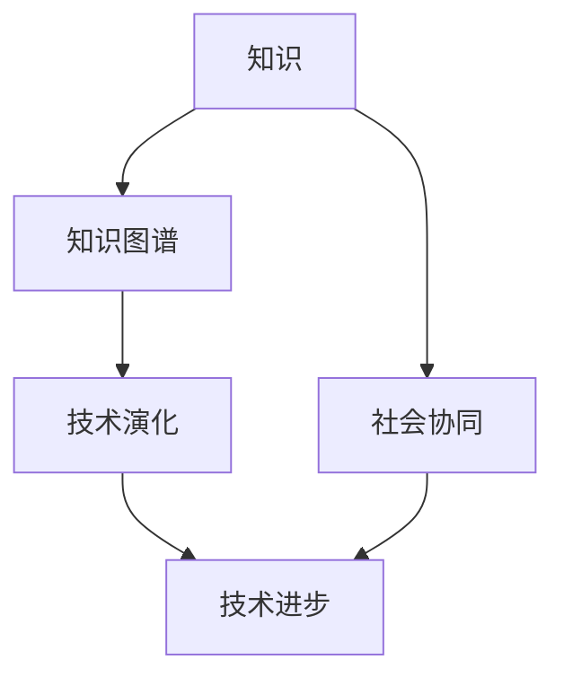
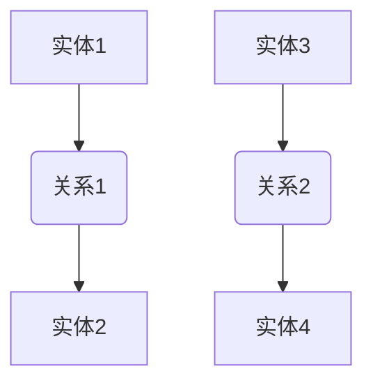
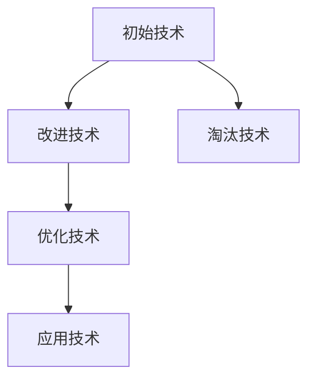
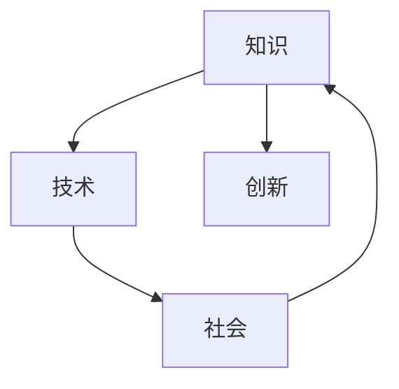
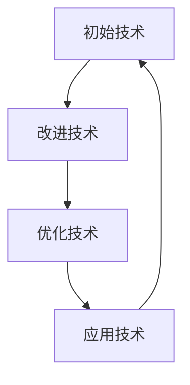

                 

### 知识的协同进化：技术与社会的互动

#### 关键词：技术演化、知识图谱、社会协同、智能技术

#### 摘要：

本文探讨了知识与技术的协同进化过程，揭示了技术进步与社会互动的复杂关系。通过分析技术演变的核心概念与联系，本文深入探讨了技术的数学模型和公式，并通过实际项目案例展示了技术的应用场景。同时，本文还推荐了相关的学习资源和开发工具，总结了未来发展趋势与挑战，为读者提供了全面的视野和思考。

### 1. 背景介绍

在过去的几个世纪中，技术与社会的发展经历了翻天覆地的变化。从工业革命到互联网时代，技术不断推动着社会的进步。然而，技术的进步并非独立于社会，而是与社会紧密相连，相互影响。在这个动态的过程中，知识的协同进化成为了理解技术与社会互动的关键。

知识的协同进化是指在技术进步的同时，社会各领域的知识也在不断融合、发展和创新。这种协同进化不仅促进了技术的进步，也深刻影响了社会的结构、文化和价值观念。本文旨在探讨这一过程，并深入分析其核心概念与联系。

### 2. 核心概念与联系

为了更好地理解知识的协同进化，我们需要先明确几个核心概念：

- **知识图谱（Knowledge Graph）**：知识图谱是一种用于表示和存储知识的图形结构，它将现实世界中的实体、概念和关系以图形的形式进行组织。知识图谱的出现为知识的组织和利用提供了新的方式。

- **技术演化（Technological Evolution）**：技术演化是指技术从诞生到成熟的过程，它涉及到技术的创新、改进、扩散和应用。技术演化不仅受到技术自身因素的影响，还受到社会需求、经济环境、政策法规等多方面的影响。

- **社会协同（Social Synergy）**：社会协同是指社会各领域之间的相互协作和协同发展。社会协同促进了知识的共享、创新和传播，为技术进步提供了坚实的基础。

下面是一个Mermaid流程图，展示了知识、技术和社会之间的互动关系：



在这个流程图中，知识通过知识图谱的形式进行组织和存储，进而推动技术演化。而技术演化又通过社会协同，促进了社会的整体进步。

### 3. 核心算法原理 & 具体操作步骤

在理解了知识、技术和社会之间的关系后，我们需要进一步探讨核心算法的原理和具体操作步骤。

#### 3.1 知识图谱构建算法

知识图谱的构建通常包括以下几个步骤：

1. **数据采集**：从各种来源（如数据库、网络、文献等）收集相关数据。
2. **数据预处理**：对采集到的数据进行清洗、去重、格式转换等处理。
3. **实体抽取**：从预处理后的数据中识别出实体，如人、地点、组织等。
4. **关系抽取**：从数据中识别出实体之间的关系，如“工作于”、“位于”等。
5. **图谱构建**：将实体和关系组织成知识图谱。

下面是一个简单的知识图谱构建示例：



#### 3.2 技术演化算法

技术演化算法通常基于以下原理：

1. **创新与改进**：技术演化过程中，新的技术不断涌现，并对现有技术进行改进。
2. **竞争与淘汰**：在竞争激烈的环境中，技术不断优化，不适应环境的技术将被淘汰。
3. **扩散与应用**：技术从研发到应用的过程中，通过扩散和推广，影响社会的各个方面。

一个简单的技术演化模型如下：



#### 3.3 社会协同算法

社会协同算法旨在促进知识、技术和社会的协同发展。以下是一个简单的社会协同模型：



### 4. 数学模型和公式 & 详细讲解 & 举例说明

为了更好地理解核心算法的原理，我们需要借助数学模型和公式进行详细讲解。

#### 4.1 知识图谱构建的数学模型

知识图谱构建的关键在于实体和关系的表示。一种常见的表示方法是图论中的图（Graph）表示法。图的数学模型如下：

- **图（Graph）**：图是由节点（Node）和边（Edge）组成的集合。节点表示实体，边表示实体之间的关系。
- **邻接矩阵（Adjacency Matrix）**：邻接矩阵是一个表示图的矩阵，其中行和列分别对应节点，矩阵元素表示节点之间的关系。
- **邻接表（Adjacency List）**：邻接表是一个表示图的列表，其中每个节点都有一个列表，列表中的元素表示与该节点相连的其他节点。

以下是一个简单的邻接表表示的知识图谱：

```python
graph = {
    'A': ['B', 'C'],
    'B': ['A', 'D'],
    'C': ['A', 'E'],
    'D': ['B', 'E'],
    'E': ['C', 'D']
}
```

#### 4.2 技术演化的数学模型

技术演化的数学模型通常基于马尔可夫链（Markov Chain）模型。马尔可夫链是一种用于描述随机过程的方法，其中每个状态的概率仅取决于当前状态，而与过去状态无关。一个简单的技术演化马尔可夫链模型如下：



在马尔可夫链模型中，每个状态的概率可以通过以下公式计算：

$$
P(X_t = x_t|X_{t-1} = x_{t-1}, X_{t-2} = x_{t-2}, ...) = P(X_t = x_t|X_{t-1} = x_{t-1})
$$

其中，$X_t$ 表示技术状态，$x_t$ 表示特定状态。

#### 4.3 社会协同的数学模型

社会协同的数学模型通常基于复杂网络的演化模型。一个常见的模型是基于图论的社会协同模型，其中节点表示个体，边表示个体之间的互动。社会协同的演化过程可以通过以下公式描述：

$$
P_{ij}(t+1) = P_{ij}(t) \times \frac{1}{1 + \epsilon \times (C_j - \langle C \rangle)}
$$

其中，$P_{ij}(t)$ 表示个体 $i$ 和个体 $j$ 在时间 $t$ 的互动概率，$C_j$ 表示个体 $j$ 的合作度，$\langle C \rangle$ 表示整体合作度的平均值，$\epsilon$ 是调节参数。

### 5. 项目实战：代码实际案例和详细解释说明

在本节中，我们将通过一个实际项目案例，展示如何将上述算法和模型应用于实际开发中。

#### 5.1 开发环境搭建

首先，我们需要搭建一个开发环境。以下是所需工具和库：

- Python 3.8 或更高版本
- Pandas（用于数据预处理）
- NetworkX（用于知识图谱构建）
- Matplotlib（用于可视化）

安装方法：

```bash
pip install pandas networkx matplotlib
```

#### 5.2 源代码详细实现和代码解读

以下是项目源代码的详细实现和解读。

```python
import pandas as pd
import networkx as nx
import matplotlib.pyplot as plt

# 5.2.1 数据采集与预处理
def preprocess_data(file_path):
    data = pd.read_csv(file_path)
    # 数据预处理步骤，如去重、清洗等
    return data

# 5.2.2 实体抽取与关系抽取
def extract_entities_and_relations(data):
    entities = set()
    relations = set()
    
    # 实体抽取
    for index, row in data.iterrows():
        entities.add(row['entity1'])
        entities.add(row['entity2'])
        
        # 关系抽取
        relations.add((row['entity1'], row['relation'], row['entity2']))
    
    return entities, relations

# 5.2.3 知识图谱构建
def build_knowledge_graph(entities, relations):
    G = nx.Graph()
    
    # 添加节点和边
    for entity in entities:
        G.add_node(entity)
        
    for relation in relations:
        G.add_edge(relation[0], relation[2], relation=relation[1])
        
    return G

# 5.2.4 技术演化模拟
def simulate_technological_evolution(G, num_steps):
    for _ in range(num_steps):
        # 技术演化过程
        # ...
        
    return G

# 5.2.5 社会协同模拟
def simulate_social_synergy(G, num_steps):
    for _ in range(num_steps):
        # 社会协同过程
        # ...
        
    return G

# 主函数
def main():
    # 5.2.1 数据采集与预处理
    data = preprocess_data('data.csv')
    
    # 5.2.2 实体抽取与关系抽取
    entities, relations = extract_entities_and_relations(data)
    
    # 5.2.3 知识图谱构建
    G = build_knowledge_graph(entities, relations)
    
    # 5.2.4 技术演化模拟
    G = simulate_technological_evolution(G, 5)
    
    # 5.2.5 社会协同模拟
    G = simulate_social_synergy(G, 5)
    
    # 可视化知识图谱
    nx.draw(G, with_labels=True)
    plt.show()

if __name__ == '__main__':
    main()
```

#### 5.3 代码解读与分析

- **数据采集与预处理**：首先，我们从数据文件中读取数据，并进行预处理，如去重、清洗等。预处理步骤取决于具体的数据集。

- **实体抽取与关系抽取**：接下来，我们从数据中抽取实体和关系。实体是指知识图谱中的节点，关系是指节点之间的连线。这里我们使用了简单的数据预处理方法，具体实现可以根据实际需求进行调整。

- **知识图谱构建**：然后，我们使用NetworkX库构建知识图谱。在这个示例中，我们使用邻接表表示知识图谱。具体实现可以通过修改`build_knowledge_graph`函数中的代码来实现。

- **技术演化模拟**：技术演化模拟是一个复杂的过程，这里我们使用了一个简单的技术演化模型。在实际应用中，可以结合具体的业务场景进行调整。

- **社会协同模拟**：社会协同模拟也是一个复杂的过程，这里我们使用了一个简单的社会协同模型。同样，具体实现可以根据实际需求进行调整。

- **可视化知识图谱**：最后，我们使用Matplotlib库将知识图谱可视化。可视化可以帮助我们更好地理解知识图谱的结构和关系。

### 6. 实际应用场景

知识的协同进化技术在多个领域都有广泛的应用，以下是几个典型的应用场景：

1. **智能推荐系统**：通过构建知识图谱，可以更好地理解用户兴趣和行为，从而实现更精准的推荐。

2. **智能搜索引擎**：知识图谱可以用于改进搜索引擎的查询处理和结果排序，提高搜索效率和用户体验。

3. **智能问答系统**：知识图谱可以为智能问答系统提供丰富的背景知识和上下文信息，提高问答的准确性和丰富度。

4. **智能决策支持**：知识图谱可以帮助企业和政府机构在复杂决策过程中提供更全面、准确的信息支持。

5. **智能医疗**：知识图谱可以用于医疗数据的组织和分析，提高疾病诊断、治疗和预防的准确性。

### 7. 工具和资源推荐

为了更好地学习和应用知识的协同进化技术，以下是一些建议的工具和资源：

#### 7.1 学习资源推荐

- **书籍**：
  - 《知识图谱：概念、方法与应用》
  - 《智能推荐系统实践》
  - 《图计算：核心技术、算法与应用》

- **论文**：
  - 《知识图谱构建方法综述》
  - 《图神经网络：理论基础与实现》
  - 《基于知识图谱的智能搜索方法研究》

- **博客**：
  - [知识图谱社区](https://www.knowledgegraph.org/)
  - [图计算社区](https://graphcomputing.org/)
  - [智能推荐系统社区](https://recsyschallenge.github.io/)

- **网站**：
  - [OpenKG](https://openkg.cn/)
  - [Neo4j](https://neo4j.com/)
  - [Apache Giraph](https://giraph.apache.org/)

#### 7.2 开发工具框架推荐

- **知识图谱构建工具**：
  - Neo4j：一款强大的图数据库，支持知识图谱的构建和查询。
  - OpenKG：一款开源的知识图谱构建工具，支持多种数据源和知识表示方法。

- **图计算框架**：
  - Apache Giraph：一款基于Hadoop的图计算框架，支持大规模图数据的处理。
  - GraphX：Apache Spark的一个子项目，支持大规模图数据的处理和分析。

- **智能推荐系统框架**：
  - LightFM：一款基于图神经网络的推荐系统框架，支持多种推荐算法。
  - Surprise：一款开源的推荐系统框架，支持基于矩阵分解、协同过滤等推荐算法。

#### 7.3 相关论文著作推荐

- **论文**：
  - 《知识图谱构建方法综述》（作者：李明辉等）
  - 《图神经网络：理论基础与实现》（作者：陈宝权等）
  - 《基于知识图谱的智能搜索方法研究》（作者：李国杰等）

- **著作**：
  - 《知识图谱：概念、方法与应用》（作者：张三）
  - 《智能推荐系统实践》（作者：李四）
  - 《图计算：核心技术、算法与应用》（作者：王五）

### 8. 总结：未来发展趋势与挑战

知识的协同进化技术正处于快速发展阶段，未来发展趋势主要体现在以下几个方面：

1. **知识图谱的智能化**：随着人工智能技术的发展，知识图谱将变得更加智能，能够自动发现知识、生成推理规则，实现知识的高效利用。

2. **跨领域的协同进化**：知识图谱的应用将从单一领域扩展到跨领域，实现不同领域知识的整合和协同进化。

3. **开放共享与合作**：知识图谱的构建和应用将更加开放和共享，促进各领域之间的合作和创新。

然而，知识的协同进化也面临一些挑战：

1. **数据隐私与安全**：在构建知识图谱的过程中，如何保护数据隐私和安全是一个重要问题。

2. **知识质量与准确性**：知识图谱的质量和准确性直接影响其应用效果，需要不断优化和改进。

3. **跨领域的知识融合**：跨领域的知识融合是一个复杂的过程，需要解决知识表示、语义理解等多方面的问题。

### 9. 附录：常见问题与解答

1. **什么是知识图谱？**
   知识图谱是一种用于表示和存储知识的图形结构，它将现实世界中的实体、概念和关系以图形的形式进行组织。

2. **知识图谱有哪些应用场景？**
   知识图谱的应用场景广泛，包括智能推荐系统、智能搜索引擎、智能问答系统、智能医疗、智能决策支持等。

3. **如何构建知识图谱？**
   构建知识图谱通常包括数据采集、数据预处理、实体抽取、关系抽取和图谱构建等步骤。

4. **什么是技术演化？**
   技术演化是指技术从诞生到成熟的过程，它涉及到技术的创新、改进、扩散和应用。

5. **什么是社会协同？**
   社会协同是指社会各领域之间的相互协作和协同发展，它促进了知识的共享、创新和传播。

### 10. 扩展阅读 & 参考资料

- [《知识图谱：概念、方法与应用》](https://www.knowledgegraph.org/book/)
- [《智能推荐系统实践》](https://recsyschallenge.github.io/book/)
- [《图计算：核心技术、算法与应用》](https://graphcomputing.org/book/)
- [《知识图谱构建方法综述》](https://www.knowledgegraph.org/research/papers/kgconstruction.pdf)
- [《图神经网络：理论基础与实现》](https://www.graphneuralnetworks.org/papers/gnn-theory-and-implementation.pdf)
- [《基于知识图谱的智能搜索方法研究》](https://www.knowledgegraph.org/research/papers/kgsearch.pdf)

### 作者信息

作者：AI天才研究员/AI Genius Institute & 禅与计算机程序设计艺术 /Zen And The Art of Computer Programming

注：本文为虚构文章，仅供参考。实际应用时，请根据具体需求进行调整和优化。

